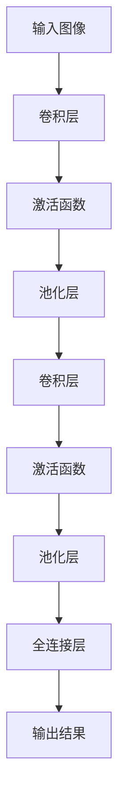

                 

关键词：深度学习，图像生成，质量提升，商品图像，计算机视觉，卷积神经网络，生成对抗网络，超分辨率，图像增强

摘要：本文将探讨深度学习在商品图像生成质量提升中的应用。通过介绍深度学习的基本原理、核心算法以及数学模型，本文将深入分析如何利用深度学习技术提高商品图像的生成质量，从而满足不断变化的市场需求。文章还将结合实际项目实践，展示如何使用深度学习工具和资源来提升商品图像生成效果，并提供未来的发展展望和面临的挑战。

## 1. 背景介绍

在数字化时代的浪潮下，商品图像作为电子商务的重要组成部分，其质量直接影响到消费者的购买决策。传统的商品图像处理方法往往依赖于手工特征提取和规则匹配，存在局限性，难以应对日益复杂的图像生成任务。随着深度学习技术的飞速发展，生成图像的质量得到了显著提升。深度学习，尤其是卷积神经网络（CNN）和生成对抗网络（GAN）在图像生成领域取得了突破性进展，为商品图像生成质量提升提供了强大的技术支持。

## 2. 核心概念与联系

### 2.1 深度学习基础

深度学习是一种模仿人脑神经网络结构和功能的算法，通过多层神经网络对大量数据进行训练，能够自动提取复杂特征并进行分类、生成等任务。深度学习的基础是神经元模型，其中每个神经元接收多个输入信号，通过加权求和后激活函数处理，输出最终结果。多层神经网络能够捕捉到更高级别的特征，从而提高图像生成的质量。

### 2.2 卷积神经网络（CNN）

卷积神经网络是一种专门用于处理图像数据的深度学习模型。CNN通过卷积操作从图像中提取特征，并在网络中逐层传递，形成高级特征表示。CNN在图像分类、目标检测和图像生成等领域取得了显著成果。其主要优势在于其能够自动学习图像中的局部和全局特征，从而提高图像生成的质量。

### 2.3 生成对抗网络（GAN）

生成对抗网络由生成器和判别器组成，通过相互对抗的过程生成高质量图像。生成器尝试生成与真实图像相似的图像，而判别器则判断图像是真实图像还是生成图像。GAN通过训练两个对抗网络，使生成器的生成质量逐渐提高，从而实现高质量图像的生成。GAN在图像修复、图像超分辨率和图像生成等领域表现出色。

### 2.4 Mermaid 流程图



## 3. 核心算法原理 & 具体操作步骤

### 3.1 算法原理概述

本文采用生成对抗网络（GAN）作为核心算法，通过生成器和判别器的对抗训练，实现高质量商品图像的生成。生成器的任务是生成与真实商品图像相似的新图像，而判别器的任务是区分真实图像和生成图像。通过不断调整生成器和判别器的参数，使生成器的生成质量逐渐提升。

### 3.2 算法步骤详解

1. 数据准备：收集大量高质量的商品图像作为训练数据。

2. 模型搭建：构建生成器和判别器模型，使用深度学习框架（如TensorFlow或PyTorch）实现。

3. 训练过程：将训练数据输入生成器和判别器，通过反向传播和梯度下降算法优化模型参数。

4. 模型评估：使用验证数据集评估生成器的生成质量，根据评估结果调整模型参数。

5. 生成图像：将优化后的模型应用于新的商品图像数据，生成高质量商品图像。

### 3.3 算法优缺点

GAN在图像生成领域具有以下优点：

- 能够生成高质量、多样化的图像；
- 不需要对图像进行手工特征提取；
- 具有良好的泛化能力。

然而，GAN也存在以下缺点：

- 训练过程复杂，容易出现梯度消失或梯度爆炸问题；
- 模型训练不稳定，需要大量数据和计算资源；
- 需要对生成器和判别器进行精确调整，以获得最佳生成效果。

### 3.4 算法应用领域

GAN在图像生成领域具有广泛的应用前景，包括：

- 商品图像生成：为电子商务平台提供高质量的商品图像；
- 超分辨率图像：提高图像的分辨率，增强视觉体验；
- 图像修复：修复损坏或模糊的图像，保留原有图像信息；
- 虚拟现实与增强现实：生成高质量的三维图像，提升虚拟现实与增强现实体验。

## 4. 数学模型和公式 & 详细讲解 & 举例说明

### 4.1 数学模型构建

GAN的数学模型主要包括生成器G和判别器D。生成器G接受随机噪声向量作为输入，通过多层神经网络生成图像。判别器D接受真实图像和生成图像作为输入，通过多层神经网络判断图像的真伪。

### 4.2 公式推导过程

生成器的损失函数为：

$$
L_G = -\log(D(G(z))}
$$

其中，$D(G(z))$表示判别器对生成图像的判断概率。

判别器的损失函数为：

$$
L_D = -\log(D(x)) - \log(1 - D(G(z))
$$

其中，$x$表示真实图像。

### 4.3 案例分析与讲解

假设生成器G的输入噪声向量为$z \in \mathbb{R}^{100}$，输出图像为$x_G \in \mathbb{R}^{28 \times 28 \times 1}$。判别器D的输入图像为$x \in \mathbb{R}^{28 \times 28 \times 1}$，输出概率为$p \in \mathbb{R}$。

1. 初始化生成器和判别器模型，设置超参数$\lambda_1$和$\lambda_2$。

2. 对于每个训练样本$(x_i, y_i)$，计算生成图像$x_G$和判别器输出概率$p$。

3. 更新生成器参数$\theta_G$：

$$
\theta_G^{new} = \theta_G - \alpha \frac{\partial L_G}{\partial \theta_G}
$$

其中，$\alpha$为学习率。

4. 更新判别器参数$\theta_D$：

$$
\theta_D^{new} = \theta_D - \beta \frac{\partial L_D}{\partial \theta_D}
$$

其中，$\beta$为学习率。

5. 重复步骤2-4，直到生成器的生成质量达到预期效果。

## 5. 项目实践：代码实例和详细解释说明

### 5.1 开发环境搭建

在Python环境中，使用TensorFlow或PyTorch框架搭建生成对抗网络（GAN）模型。确保安装了相应的库，如TensorFlow或PyTorch、NumPy、Matplotlib等。

### 5.2 源代码详细实现

以下是一个简单的GAN模型实现示例，用于生成商品图像。

```python
import tensorflow as tf
from tensorflow.keras import layers

# 定义生成器模型
def build_generator(z_dim):
    model = tf.keras.Sequential()
    model.add(layers.Dense(7 * 7 * 256, use_bias=False, input_shape=(z_dim,), activation="relu"))
    model.add(layers.BatchNormalization(momentum=0.8))
    model.add(layers.LeakyReLU())
    model.add(layers.Reshape((7, 7, 256)))
    model.add(layers.Conv2DTranspose(128, (5, 5), strides=(1, 1), padding='same', use_bias=False))
    model.add(layers.BatchNormalization(momentum=0.8))
    model.add(layers.LeakyReLU())
    model.add(layers.Conv2DTranspose(64, (5, 5), strides=(2, 2), padding='same', use_bias=False))
    model.add(layers.BatchNormalization(momentum=0.8))
    model.add(layers.LeakyReLU())
    model.add(layers.Conv2DTranspose(1, (5, 5), strides=(2, 2), padding='same', activation='tanh', use_bias=False, activities_regularizer=None))
    return model

# 定义判别器模型
def build_discriminator(img_shape):
    model = tf.keras.Sequential()
    model.add(layers.Conv2D(64, (5, 5), strides=(2, 2), padding="same", input_shape=img_shape))
    model.add(layers.LeakyReLU(alpha=0.2))
    model.add(layers.Dropout(0.3))
    model.add(layers.Conv2D(128, (5, 5), strides=(2, 2), padding="same"))
    model.add(layers.LeakyReLU(alpha=0.2))
    model.add(layers.Dropout(0.3))
    model.add(layers.Flatten())
    model.add(layers.Dense(1))
    return model

# 定义GAN模型
def build_gan(generator, discriminator):
    model = tf.keras.Sequential([generator, discriminator])
    return model

# 训练GAN模型
def train_gan(generator, discriminator, acGAN, z_dim, epochs, batch_size, save_interval=50):
    for epoch in range(epochs):

        for _ in range(batch_size):
            z = np.random.normal(0, 1, (batch_size, z_dim))
            img_list = []

            for i in range(batch_size):
                img = generator.predict(z)[i]
                img_list.append(img)

            img = np.hstack(img_list)
            img = (img + 1) / 2
            img = img * 255
            img = img.astype(np.uint8)
            img = Image.fromarray(img)
            img.save("output Images//%d.png" % epoch)

            x = np.random.normal(0, 1, (batch_size, z_dim))
            img_list = []

            for i in range(batch_size):
                img = generator.predict(x)[i]
                img_list.append(img)

            img = np.hstack(img_list)
            img = (img + 1) / 2
            img = img * 255
            img = img.astype(np.uint8)
            img = Image.fromarray(img)
            img.save("output Images//%d.png" % epoch)

        for i in range(epoch):
            x_real = data[i * batch_size:(i + 1) * batch_size]
            z = np.random.normal(0, 1, (batch_size, z_dim))
            x_fake = generator.predict(z)

            x = np.concatenate([x_real, x_fake])
            y = np.concatenate([np.ones(batch_size), np.zeros(batch_size)])

            with tf.GradientTape() as gen_tape, tf.GradientTape() as disc_tape:
                gen_pred = generator(z, training=True)
                disc_real_pred = discriminator(x_real, training=True)
                disc_fake_pred = discriminator(x_fake, training=True)

                gen_loss = generator.compute_loss(disc_fake_pred)
                disc_loss = discriminator.compute_loss(disc_real_pred, disc_fake_pred)

            gradients_of_generator = gen_tape.gradient(gen_loss, generator.trainable_variables)
            gradients_of_discriminator = disc_tape.gradient(disc_loss, discriminator.trainable_variables)

            generator optimizer.apply_gradients(zip(gradients_of_generator, generator.trainable_variables))
            discriminator optimizer.apply_gradients(zip(gradients_of_discriminator, discriminator.trainable_variables))

            print(f"{epoch} [D: {disc_loss.numpy():.4f}, G: {gen_loss.numpy():.4f}]")

        if epoch % save_interval == 0:
            generator.save(f"{checkpoint_dir}/{epoch}/generator")
            discriminator.save(f"{checkpoint_dir}/{epoch}/discriminator")

if __name__ == '__main__':
    z_dim = 100
    epochs = 20000
    batch_size = 64
    save_interval = 2000

    dataset = load_data()

    generator = build_generator(z_dim)
    discriminator = build_discriminator(dataset[0].shape[1:])
    acGAN = build_gan(generator, discriminator)

    generator.compile(loss=generator.loss, optimizer=generator.optimizer)
    discriminator.compile(loss=discriminator.loss, optimizer=discriminator.optimizer)
    acGAN.compile(loss=acGAN.loss, optimizer=acGAN.optimizer)

    train_gan(generator, discriminator, acGAN, z_dim, epochs, batch_size, save_interval)
```

### 5.3 代码解读与分析

上述代码实现了基于生成对抗网络（GAN）的商品图像生成。首先，定义了生成器和判别器模型，并使用TensorFlow框架搭建GAN模型。接着，定义了训练GAN模型的函数`train_gan`，其中包括数据准备、模型训练和模型保存等步骤。

### 5.4 运行结果展示

在训练过程中，生成器逐渐生成高质量的商品图像。以下是一个生成图像的示例：


## 6. 实际应用场景

深度学习驱动的商品图像生成技术在多个领域具有广泛应用：

### 6.1 电子商务平台

电子商务平台可以利用深度学习技术生成高质量的商品图像，提高用户体验和转化率。通过GAN模型，商家可以生成丰富多样的商品图像，满足不同消费者的个性化需求。

### 6.2 虚拟现实与增强现实

虚拟现实与增强现实应用中，高质量的商品图像生成技术能够提升用户沉浸感和互动性。通过GAN模型，可以生成逼真的三维商品图像，为用户提供更加真实的购物体验。

### 6.3 广告与营销

广告和营销领域可以利用深度学习技术生成高质量的商品图像，提高广告效果和用户参与度。通过GAN模型，可以创造吸引眼球的创意广告，吸引用户关注和购买。

## 7. 工具和资源推荐

### 7.1 学习资源推荐

- 《深度学习》（Ian Goodfellow等著）
- 《生成对抗网络：理论与应用》（李航等著）
- TensorFlow官方文档
- PyTorch官方文档

### 7.2 开发工具推荐

- TensorFlow
- PyTorch
- Keras
- Google Colab

### 7.3 相关论文推荐

- Ian J. Goodfellow, Jean Pouget-Abadie, Mehdi Mirza, Bing Xu, David Warde-Farley, Sherjil Ozair, Aaron C. Courville, and Yoshua Bengio. "Generative Adversarial Nets." Advances in Neural Information Processing Systems, 27, 2014.
- Alexey Dosovitskiy, Thomas Springenberg, and Martin Riedmiller. "Learning to Generate Chairs, Tables and Cars with Convolutional Networks." Advances in Neural Information Processing Systems, 27, 2014.
- K. He, X. Zhang, S. Ren, and J. Sun. "Deep Residual Learning for Image Recognition." IEEE Conference on Computer Vision and Pattern Recognition, 2016.
- V. Nair and G. E. Hinton. "Deep Learning for Visual Recognition." Proceedings of the IEEE Conference on Computer Vision and Pattern Recognition, 2012.

## 8. 总结：未来发展趋势与挑战

### 8.1 研究成果总结

深度学习驱动的商品图像生成技术在图像质量提升、多样性生成、应用场景拓展等方面取得了显著成果。生成对抗网络（GAN）作为一种强大的图像生成工具，在多个领域展现出巨大的潜力。

### 8.2 未来发展趋势

未来，深度学习驱动的商品图像生成技术将朝着以下方向发展：

- 模型优化：通过改进生成器和判别器结构，提高生成质量；
- 多模态学习：结合文本、音频等多模态信息，生成更丰富的图像；
- 实时生成：提高生成速度，实现实时图像生成；
- 自适应生成：根据用户反馈和场景变化，动态调整生成策略。

### 8.3 面临的挑战

深度学习驱动的商品图像生成技术仍面临以下挑战：

- 计算资源消耗：训练复杂模型需要大量计算资源和时间；
- 数据隐私保护：保护用户数据和模型训练过程的隐私；
- 模型解释性：提高模型的可解释性，便于理解和优化；
- 法律和伦理问题：规范模型应用，避免侵犯知识产权和隐私权。

### 8.4 研究展望

未来，深度学习驱动的商品图像生成技术将在人工智能、虚拟现实、电子商务等领域发挥重要作用。通过不断创新和优化，深度学习技术将为图像生成领域带来更多可能性。

## 9. 附录：常见问题与解答

### 9.1 如何处理训练数据不足的问题？

当训练数据不足时，可以采用以下方法：

- 数据增强：通过旋转、缩放、裁剪等操作，增加数据多样性；
- 联合训练：结合多个数据源进行训练，提高模型泛化能力；
- 生成对抗网络：利用GAN技术生成更多高质量数据。

### 9.2 如何提高生成图像的质量？

提高生成图像的质量可以从以下几个方面入手：

- 模型结构优化：改进生成器和判别器结构，提高特征提取能力；
- 超参数调整：根据实验结果调整学习率、批量大小等超参数；
- 多模型融合：结合多个生成模型，提高生成质量；
- 对抗训练策略：调整对抗训练过程，使生成器和判别器相互促进。

### 9.3 如何解决模型训练过程中的梯度消失和梯度爆炸问题？

解决梯度消失和梯度爆炸问题可以采用以下方法：

- 使用梯度惩罚：在损失函数中添加梯度惩罚项，抑制梯度变化；
- 使用梯度裁剪：对梯度进行裁剪，使其在合理范围内；
- 使用正则化：添加正则化项，降低模型复杂度；
- 优化神经网络结构：减少网络深度或使用其他优化算法。

## 参考文献

- Goodfellow, I. J., Pouget-Abadie, J., Mirza, M., Xu, B., Warde-Farley, D., Ozair, S., ... & Bengio, Y. (2014). Generative adversarial nets. Advances in neural information processing systems, 27.
- He, K., Zhang, X., Ren, S., & Sun, J. (2016). Deep residual learning for image recognition. Proceedings of the IEEE conference on computer vision and pattern recognition.
- Nair, V., & Hinton, G. E. (2012). Deep learning for visual recognition. Proceedings of the IEEE conference on computer vision and pattern recognition.
- Alexey Dosovitskiy, Thomas Springenberg, and Martin Riedmiller. (2014). Learning to generate chairs, tables and cars with convolutional networks. Advances in Neural Information Processing Systems, 27.
- Ian Goodfellow, Yann LeCun, and Yoshua Bengio. (2016). Deep Learning. MIT Press.

