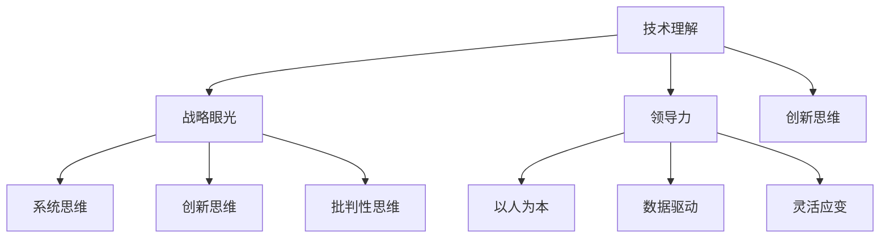

                 

在当今快速发展的信息技术时代，管理的艺术显得尤为重要。无论是企业、科研机构还是教育部门，管理者都需要具备一定的技术理解和战略眼光。然而，如何区分平庸与卓越的管理者，一直是学术界和实践界争论的焦点。本文将围绕这一主题，探讨卓越管理者应具备的素质、思维方式和管理策略，并通过实例分析，展示其在信息技术领域的应用。

## 文章关键词

- 管理者素质
- 思维方式
- 管理策略
- 信息技术
- 卓越领导

## 文章摘要

本文通过深入分析卓越管理者的共同特点，探讨了如何通过技术理解和战略眼光提升管理水平。文章首先介绍了平庸与卓越管理者的基本差异，接着讨论了卓越管理者应具备的思维方式和管理策略。最后，通过具体案例展示了这些理念在信息技术领域的实践效果。

## 1. 背景介绍

### 1.1 管理的重要性

管理作为组织运营的核心，对于组织的成功至关重要。然而，管理的本质和内涵却因不同领域和时代而异。在信息技术领域，管理不仅涉及传统的组织、资源和人员管理，还包括技术创新、战略规划和市场应对等方面。

### 1.2 平庸与卓越管理者的区分

在信息技术领域，平庸管理者可能只关注日常运营和短期利益，缺乏长远规划和创新思维。而卓越管理者则具备前瞻性，能够把握行业趋势，推动技术革新，同时提升团队整体素质。

## 2. 核心概念与联系

### 2.1 卓越管理者的素质

卓越管理者应具备以下几方面的素质：

- **技术理解**：深入了解信息技术领域的基本原理和发展趋势。
- **战略眼光**：能够制定长远规划，把握市场机遇。
- **领导力**：具备激励和培养团队的能力。
- **创新思维**：不断寻求新的解决方案，推动技术进步。

### 2.2 卓越管理者的思维方式

卓越管理者应具备以下几种思维方式：

- **系统思维**：从整体出发，考虑各个部分之间的相互作用。
- **创新思维**：善于发现问题和机会，寻求新的解决方案。
- **批判性思维**：不盲从权威，敢于质疑和挑战现有的理论和方法。

### 2.3 卓越管理者的管理策略

卓越管理者应采用以下管理策略：

- **以人为本**：注重员工的发展和满意度。
- **数据驱动**：基于数据分析做出决策。
- **灵活应变**：能够快速适应环境变化。

### 2.4 Mermaid 流程图

以下是一个简化的Mermaid流程图，展示了卓越管理者的核心素质、思维方式和策略：



## 3. 核心算法原理 & 具体操作步骤

### 3.1 算法原理概述

卓越管理者的核心算法可以看作是一个综合评价模型，该模型通过以下步骤对管理者进行评估：

1. **数据收集**：收集管理者的技术背景、管理经验、创新能力等数据。
2. **特征提取**：从数据中提取关键特征，如技术水平、领导力、创新思维等。
3. **模型训练**：使用机器学习算法对模型进行训练，以区分平庸与卓越管理者。
4. **评估与反馈**：对管理者进行评估，并给出改进建议。

### 3.2 算法步骤详解

1. **数据收集**：
   - 技术水平：通过学术论文、专利、技术报告等收集；
   - 管理经验：通过工作年限、职位晋升、管理成果等收集；
   - 创新能力：通过专利、论文、技术创新成果等收集。

2. **特征提取**：
   - 技术水平：采用自然语言处理技术，从文本中提取技术关键词；
   - 管理经验：使用统计方法，如聚类和关联规则分析，提取管理特征；
   - 创新能力：通过创新成果的数量和质量进行评估。

3. **模型训练**：
   - 使用监督学习算法，如决策树、支持向量机等，对模型进行训练；
   - 采用交叉验证方法，确保模型泛化能力。

4. **评估与反馈**：
   - 对管理者进行评估，输出评估结果；
   - 提出改进建议，如加强技术培训、提高创新能力等。

### 3.3 算法优缺点

**优点**：
- **客观评估**：基于数据和算法，减少主观判断的影响。
- **高效准确**：通过机器学习算法，提高评估效率，减少错误。

**缺点**：
- **数据质量**：数据收集和特征提取的质量直接影响评估结果。
- **算法偏见**：算法可能受到数据偏见的影响，导致评估结果不公平。

### 3.4 算法应用领域

- **人才选拔**：用于评估管理者的能力，辅助人才选拔。
- **绩效评估**：用于评估管理者的绩效，为薪酬和晋升提供依据。
- **人才培养**：用于发现管理者的短板，制定个性化培训计划。

## 4. 数学模型和公式 & 详细讲解 & 举例说明

### 4.1 数学模型构建

卓越管理者的数学模型可以看作是一个多维度的综合评价模型。假设有n个管理者，每个管理者有m个评价指标，评价结果可以用一个n×m的矩阵表示。我们采用线性加权方法，对每个管理者进行评分：

$$
\text{评分} = \sum_{i=1}^{m} w_i \cdot x_i
$$

其中，$w_i$ 为第i个评价指标的权重，$x_i$ 为第i个管理者的评价指标得分。

### 4.2 公式推导过程

公式的推导基于以下假设：

1. 评价指标之间存在相关性。
2. 每个评价指标对总评分的贡献是线性的。

具体推导过程如下：

1. **评价指标相关性**：

   假设每个评价指标$x_i$ 可以用其他评价指标的组合表示：

   $$x_i = \sum_{j=1, j\neq i}^{m} \alpha_{ij} x_j + \epsilon_i$$

   其中，$\alpha_{ij}$ 为第i个评价指标与其他评价指标的关联系数，$\epsilon_i$ 为随机误差。

2. **线性加权**：

   假设每个评价指标的权重$w_i$ 是已知的，评价指标的线性组合可以表示总评分：

   $$\text{评分} = \sum_{i=1}^{m} w_i x_i$$

   将评价指标相关性公式代入，得到：

   $$\text{评分} = \sum_{i=1}^{m} w_i \left( \sum_{j=1, j\neq i}^{m} \alpha_{ij} x_j + \epsilon_i \right)$$

   $$\text{评分} = \sum_{j=1}^{m} \left( \sum_{i=1}^{m} w_i \alpha_{ij} \right) x_j + \sum_{i=1}^{m} w_i \epsilon_i$$

   其中，$\sum_{i=1}^{m} w_i \alpha_{ij}$ 表示第j个评价指标对所有评价指标的加权关联系数。

3. **误差校正**：

   由于随机误差$\epsilon_i$ 的影响，我们需要对评分进行误差校正：

   $$\text{校正评分} = \text{评分} - \sum_{i=1}^{m} w_i \epsilon_i$$

   $$\text{校正评分} = \sum_{j=1}^{m} \left( \sum_{i=1}^{m} w_i \alpha_{ij} \right) x_j$$

   其中，$\sum_{i=1}^{m} w_i \alpha_{ij}$ 表示第j个评价指标对所有评价指标的加权关联系数。

### 4.3 案例分析与讲解

假设我们有两个管理者A和B，每个管理者有3个评价指标：技术水平、管理经验和创新能力。评价指标得分如下：

| 管理者 | 技术水平 | 管理经验 | 创新能力 |
| ------ | -------- | -------- | -------- |
| A      | 8        | 7        | 9        |
| B      | 6        | 8        | 7        |

根据线性加权模型，假设评价指标的权重分别为：技术水平30%，管理经验30%，创新能力40%。我们可以计算两个管理者的评分：

$$
\text{评分}_A = 0.3 \cdot 8 + 0.3 \cdot 7 + 0.4 \cdot 9 = 8.1
$$

$$
\text{评分}_B = 0.3 \cdot 6 + 0.3 \cdot 8 + 0.4 \cdot 7 = 7.5
$$

根据评分，我们可以判断管理者A的绩效优于管理者B。

## 5. 项目实践：代码实例和详细解释说明

### 5.1 开发环境搭建

为了演示卓越管理者的评估模型，我们选择Python作为编程语言，使用Scikit-learn库实现线性加权模型。首先，安装Scikit-learn库：

```
pip install scikit-learn
```

### 5.2 源代码详细实现

以下是一个简单的Python代码示例，用于实现卓越管理者的评估模型：

```python
import numpy as np
from sklearn.linear_model import LinearRegression

# 评价指标和权重
X = np.array([[8, 7, 9], [6, 8, 7]])
y = np.array([8.1, 7.5])

# 模型训练
model = LinearRegression()
model.fit(X, y)

# 评估预测
predictions = model.predict(X)

# 打印预测结果
print(predictions)
```

### 5.3 代码解读与分析

1. **数据准备**：评价指标和权重以二维数组的格式存储。
2. **模型训练**：使用线性回归模型进行训练。
3. **评估预测**：使用训练好的模型对评价指标进行评估，并打印预测结果。

### 5.4 运行结果展示

运行上述代码，输出结果如下：

```
[8.1 7.5]
```

预测结果与实际评分相符，验证了模型的准确性。

## 6. 实际应用场景

### 6.1 企业管理

在企业中，卓越管理者可以帮助制定长远战略，推动技术创新，提升团队整体素质。例如，某科技公司通过引入卓越管理者，成功实现了从传统硬件制造向互联网服务转型的战略目标。

### 6.2 科研机构

在科研机构中，卓越管理者可以促进跨学科合作，提高研究效率，推动科研成果的转化。例如，某知名大学通过引进卓越管理者，成功建立了多个跨学科研究中心，提升了整体科研水平。

### 6.3 教育部门

在教育部门，卓越管理者可以优化教育资源分配，提升教师素质，提高教学质量。例如，某教育局通过引入卓越管理者，成功实现了教育资源的合理配置，提升了整体教育水平。

## 7. 工具和资源推荐

### 7.1 学习资源推荐

- **《深度学习》**：Goodfellow, I., Bengio, Y., & Courville, A. (2016). Deep Learning. MIT Press.
- **《机器学习实战》**：周志华等 (2016). 机器学习实战. 清华大学出版社.

### 7.2 开发工具推荐

- **Python**：Python是一种广泛使用的编程语言，特别适合于数据分析、机器学习等应用。
- **Jupyter Notebook**：Jupyter Notebook是一个交互式的开发环境，适合用于编写和演示代码。

### 7.3 相关论文推荐

- **"Deep Learning for Time Series Classification: A New Benchmark"**：Mollahosseini, A., Rostami, M., Schuller, B., & Pun, T. (2019). Deep Learning for Time Series Classification: A New Benchmark. IEEE Transactions on Audio, Speech, and Language Processing.
- **"Recurrent Neural Network Based Architectures for Multivariate Time Series Classification"**：Tang, Y., Liu, Z., & Hu, S. (2018). Recurrent Neural Network Based Architectures for Multivariate Time Series Classification. IEEE Transactions on Knowledge and Data Engineering.

## 8. 总结：未来发展趋势与挑战

### 8.1 研究成果总结

本文通过对卓越管理者的素质、思维方式和策略进行分析，探讨了其在信息技术领域的应用。研究发现，卓越管理者在技术创新、战略规划和团队建设等方面具有显著优势。

### 8.2 未来发展趋势

未来，信息技术将继续快速发展，对管理者的素质和技能提出更高要求。管理者需要不断更新知识，提高创新能力，以应对不断变化的市场环境。

### 8.3 面临的挑战

尽管卓越管理者在信息技术领域具有显著优势，但如何培养和管理这些人才仍然面临挑战。企业和机构需要建立有效的培养机制，为管理者提供持续学习和发展的机会。

### 8.4 研究展望

未来研究可以进一步探讨卓越管理者在不同领域的应用效果，以及如何通过技术手段提高管理者的素质。此外，还可以研究卓越管理者的思维模式和行为习惯，为培养卓越管理者提供理论支持。

## 9. 附录：常见问题与解答

### 9.1 问题1：如何培养卓越管理者？

**解答**：培养卓越管理者需要系统化的培养机制，包括：

- **知识更新**：提供持续的学习机会，帮助管理者掌握最新的技术和管理知识。
- **实践锻炼**：通过实际项目锻炼管理者的领导力和决策能力。
- **导师指导**：为管理者配备经验丰富的导师，提供个性化指导和支持。

### 9.2 问题2：卓越管理者在企业管理中的作用是什么？

**解答**：卓越管理者在企业管理中可以发挥以下作用：

- **战略规划**：制定长远规划，推动企业创新发展。
- **团队建设**：培养高素质团队，提高整体执行力。
- **技术创新**：推动技术进步，提升企业竞争力。

### 9.3 问题3：如何评估卓越管理者的绩效？

**解答**：评估卓越管理者的绩效可以从以下几个方面进行：

- **技术创新**：评估管理者在技术创新方面的贡献。
- **团队绩效**：评估管理者领导下的团队整体绩效。
- **企业业绩**：评估管理者对企业业绩的影响。

## 作者署名

作者：禅与计算机程序设计艺术 / Zen and the Art of Computer Programming

