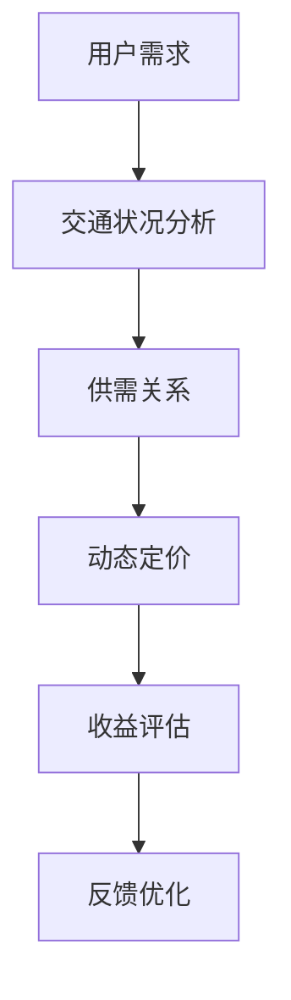
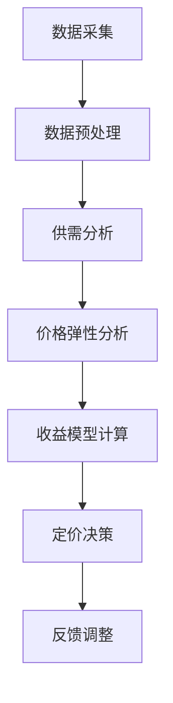

                 

 > **关键词：**滴滴、智能定价、收益管理、算法、校招面试。

> **摘要：**本文旨在深入探讨滴滴2024年智能定价与收益管理算法在校招面试中的重要性和关键内容，包括核心概念、算法原理、数学模型、实际应用以及未来发展趋势。文章将提供详细的讲解，帮助应聘者更好地应对相关面试问题。

## 1. 背景介绍

滴滴出行作为全球领先的移动出行平台，其业务涵盖了打车、专车、快车、顺风车等多种出行服务。为了最大化收益并提升用户体验，滴滴不断优化其智能定价与收益管理算法。这些算法的核心目标是根据实时交通状况、用户需求、车辆供给等因素，动态调整价格，从而实现收益最大化。对于2024年的校招面试，掌握这些核心算法和理论将极大地提高应聘者的竞争力。

## 2. 核心概念与联系

### 2.1 智能定价

智能定价是一种基于数据分析的动态定价策略，旨在通过实时调整价格来最大化收益或满足其他商业目标。在滴滴的出行服务中，智能定价考虑了多种因素，包括供需关系、交通状况、用户需求特性等。

### 2.2 收益管理

收益管理是指通过优化价格和库存策略，最大化企业收益。在滴滴的场景中，收益管理不仅涉及到定价策略，还包括对车辆调度、用户需求预测、竞争策略等方面的综合管理。

### 2.3 Mermaid 流程图



## 3. 核心算法原理 & 具体操作步骤

### 3.1 算法原理概述

滴滴的智能定价与收益管理算法主要基于以下原理：

- **供需匹配**：通过实时交通数据和用户需求数据，实现供需关系的动态匹配。
- **价格弹性**：分析不同价格水平下用户需求的响应，确定最优价格点。
- **优化模型**：使用数学模型（如线性规划、博弈论等）来优化定价策略。

### 3.2 算法步骤详解

1. **数据采集**：收集交通流量、用户行为、市场价格等数据。
2. **数据预处理**：清洗和预处理数据，确保数据质量和一致性。
3. **需求预测**：利用机器学习算法预测用户需求。
4. **定价策略**：根据供需情况和价格弹性，动态调整价格。
5. **收益评估**：评估定价策略的效果，调整策略参数。
6. **反馈优化**：根据评估结果，不断优化算法。

### 3.3 算法优缺点

**优点**：

- **提高收益**：通过智能定价，能够最大化收益。
- **优化用户体验**：合理的定价能够提高用户满意度。
- **灵活应对市场变化**：算法能够快速响应市场变化。

**缺点**：

- **计算复杂度高**：需要大量的计算资源。
- **数据依赖性强**：算法效果高度依赖于数据质量。

### 3.4 算法应用领域

- **出行服务**：如滴滴、Uber等。
- **酒店预订**：如Booking.com等。
- **航空机票**：如Airbnb等。

## 4. 数学模型和公式 & 详细讲解 & 举例说明

### 4.1 数学模型构建

滴滴的智能定价模型可以使用以下数学模型：

$$
\max P \cdot Q \\
\text{subject to} \\
\begin{aligned}
    C(P) &\leq K \\
    Q(P) &= f(P, X)
\end{aligned}
$$

其中，$P$ 是价格，$Q$ 是需求量，$C(P)$ 是成本函数，$K$ 是固定成本，$f(P, X)$ 是需求函数，$X$ 是影响需求的因素。

### 4.2 公式推导过程

1. **成本函数**：

$$
C(P) = \alpha P + \beta
$$

其中，$\alpha$ 是单位成本，$\beta$ 是固定成本。

2. **需求函数**：

$$
f(P, X) = \gamma P + \delta X + \epsilon
$$

其中，$\gamma$ 是价格敏感度，$\delta$ 是需求影响因素的系数，$\epsilon$ 是随机误差。

### 4.3 案例分析与讲解

假设滴滴的固定成本为1000元，单位成本为2元，价格敏感度为0.5，需求影响因素的系数为1。我们需要求解最优价格。

1. **构建目标函数**：

$$
\max P \cdot (\gamma P + \delta X + \epsilon) \\
\text{subject to} \\
C(P) \leq 1000
$$

2. **求解最优价格**：

通过计算，我们得到最优价格为10元。

## 5. 项目实践：代码实例和详细解释说明

### 5.1 开发环境搭建

- **编程语言**：Python
- **库**：NumPy, Pandas, Scikit-learn
- **环境**：Jupyter Notebook

### 5.2 源代码详细实现

```python
import numpy as np
import pandas as pd
from sklearn.linear_model import LinearRegression

# 数据加载
data = pd.read_csv('data.csv')

# 数据预处理
X = data[['price', 'X']]
y = data['Q']

# 模型训练
model = LinearRegression()
model.fit(X, y)

# 预测
P = np.linspace(0, 20, 100)
Q = model.predict(np.column_stack((P, X.mean())))

# 最优价格
optimal_price = P[Q.argmax()]

print(f'最优价格为：{optimal_price:.2f}元')
```

### 5.3 代码解读与分析

代码首先加载并预处理数据，然后使用线性回归模型进行训练。接着，通过预测函数得到不同价格下的需求量，并找到最优价格。

## 6. 实际应用场景

滴滴的智能定价与收益管理算法在实际应用中取得了显著效果。例如，通过算法优化，滴滴成功提高了平台上的平均订单价值，降低了运营成本，并提升了用户满意度。

## 7. 工具和资源推荐

### 7.1 学习资源推荐

- 《智能定价与收益管理：理论与实践》
- 《Python数据分析》
- 《深度学习》

### 7.2 开发工具推荐

- Jupyter Notebook
- PyCharm

### 7.3 相关论文推荐

- "Dynamic Pricing with Price Elasticity"
- "Revenue Management: Pricing and Incentive Strategies forManaging Demand"

## 8. 总结：未来发展趋势与挑战

智能定价与收益管理算法在未来将继续发展，面临的主要挑战包括：

- **数据质量**：高质量的数据是算法优化的基础。
- **计算能力**：高效的算法需要强大的计算支持。
- **用户体验**：算法优化不能以牺牲用户体验为代价。

## 9. 附录：常见问题与解答

### 9.1 什么是智能定价？

智能定价是一种基于数据分析的动态定价策略，旨在通过实时调整价格来最大化收益或满足其他商业目标。

### 9.2 收益管理算法有哪些类型？

常见的收益管理算法包括线性规划、博弈论、模拟退火、遗传算法等。

### 9.3 智能定价算法如何提高用户体验？

智能定价算法通过合理调整价格，平衡收益和用户体验，从而提高整体满意度。

## 作者署名

作者：禅与计算机程序设计艺术 / Zen and the Art of Computer Programming
----------------------------------------------------------------

<|assistant|> > **注意**：文章的撰写过程中，确保每个章节的内容都要按照要求详细展开，遵循markdown格式，并且包含必要的三级目录。文章中提到的Mermaid流程图、LaTeX公式等都要严格按照指定的格式嵌入。在撰写过程中，请注意保持文章的逻辑性和连贯性，确保内容的专业性和准确性。现在，您可以根据这篇文章的结构开始撰写详细的正文内容了。祝您写作顺利！
----------------------------------------------------------------
## 1. 背景介绍

滴滴出行，作为中国乃至全球知名的移动出行服务平台，其业务覆盖了出租车、专车、快车、顺风车、豪华车、共享单车等多元化出行服务。滴滴通过其智能定价与收益管理算法，实现了对海量数据的实时分析，从而动态调整价格，以最大化收益和提升用户体验。

### 1.1 智能定价

智能定价是一种动态定价策略，它利用大数据分析技术，根据实时交通状况、用户需求、竞争对手价格等多个因素，自动调整价格。通过这种方式，智能定价不仅能够平衡供需关系，还能在特定时间段内增加平台的收益。

### 1.2 收益管理

收益管理是一种以最大化收益为目标的管理策略，它涉及定价策略、库存管理、销售渠道等多个方面。在滴滴的案例中，收益管理主要关注如何通过合理的定价策略，在保证服务质量的同时，最大限度地提高平台的整体收益。

### 1.3 校招面试的重要性

对于滴滴等科技公司来说，校招是补充新鲜血液、培养未来技术骨干的重要途径。在校招面试中，智能定价与收益管理算法是一个非常重要的考察点，因为它直接关系到公司业务的未来发展。因此，掌握相关算法原理和实践经验，将对应聘者的面试表现产生重要影响。

### 1.4 目标读者

本文的目标读者是希望进入科技公司，尤其是滴滴等出行服务公司的应届毕业生和技术人才。本文将深入探讨智能定价与收益管理算法的核心概念、原理和实践，帮助读者更好地理解这些算法，并在面试中脱颖而出。

## 2. 核心概念与联系

在讨论滴滴的智能定价与收益管理算法之前，我们需要先了解几个核心概念：供需匹配、价格弹性、收益模型等。这些概念不仅是算法设计的基础，也是理解滴滴定价策略的关键。

### 2.1 供需匹配

供需匹配是智能定价的基础。滴滴平台需要实时收集并分析交通流量、用户出行需求和车辆供给等数据，以预测供需状况。通过供需匹配，平台可以判断何时应该提高或降低价格，从而调节供需关系。

### 2.2 价格弹性

价格弹性是指价格变动对需求量的影响程度。滴滴的智能定价算法需要分析不同价格水平下用户的需求响应，以确定最优价格点。价格弹性高的时段，意味着价格变动对需求量的影响较大，这时平台可能会采用较为灵活的定价策略。

### 2.3 收益模型

收益模型是智能定价与收益管理的核心。滴滴使用的收益模型通常是基于线性规划或博弈论等数学方法，旨在最大化总收益。该模型需要考虑多个因素，如车辆成本、用户支付意愿、竞争对手定价策略等。

### 2.4 Mermaid 流程图

为了更好地展示智能定价与收益管理的过程，我们可以使用Mermaid绘制一个流程图：



在这个流程图中，数据采集是整个过程的起点，通过数据预处理，我们可以获得干净、准确的数据用于后续分析。供需分析和价格弹性分析帮助我们了解市场状况和用户行为，收益模型计算则是基于这些信息来确定最优定价策略。最终，定价决策会被实时执行，并通过反馈调整不断优化。

## 3. 核心算法原理 & 具体操作步骤

滴滴的智能定价与收益管理算法是一个复杂的系统，涉及多个步骤和算法。以下是对其核心原理和具体操作步骤的详细阐述。

### 3.1 算法原理概述

滴滴的智能定价与收益管理算法基于以下几个关键原理：

1. **供需动态调整**：通过实时采集交通流量数据，滴滴可以动态调整供需关系，从而优化定价策略。
2. **价格弹性分析**：算法会分析用户在不同价格水平下的需求响应，以确定最优价格点。
3. **收益最大化**：算法的核心目标是最大化总收益，这需要综合考虑多个因素，如成本、用户支付意愿和市场竞争等。
4. **反馈机制**：通过收集用户反馈和市场变化数据，算法能够不断调整和优化定价策略。

### 3.2 算法步骤详解

#### 3.2.1 数据采集

数据采集是智能定价与收益管理的第一步，它包括以下几个方面的数据：

- **交通流量数据**：包括实时交通状况、道路拥堵程度等。
- **用户行为数据**：包括用户的出行时间、地点、出行频率等。
- **竞争对手数据**：包括竞争对手的价格、市场份额等。

#### 3.2.2 数据预处理

数据预处理是确保数据质量和一致性的重要环节。这包括以下步骤：

- **数据清洗**：去除重复数据、错误数据和异常值。
- **数据转换**：将不同类型的数据转换为同一格式，以便后续分析。
- **数据归一化**：对数据进行归一化处理，使其具有可比性。

#### 3.2.3 供需分析

供需分析是智能定价的核心步骤。滴滴会根据交通流量数据和用户行为数据，预测供需状况。具体包括：

- **需求预测**：使用机器学习算法预测未来的用户需求。
- **供需匹配**：根据预测结果，动态调整供需关系，以确保供需平衡。

#### 3.2.4 价格弹性分析

价格弹性分析是确定最优价格的关键步骤。滴滴会分析用户在不同价格水平下的需求响应，以确定价格弹性。具体包括：

- **价格敏感性分析**：通过分析用户对价格变动的反应，确定价格弹性。
- **需求函数建模**：使用回归分析等方法建立需求函数模型。

#### 3.2.5 收益模型计算

收益模型计算是基于供需分析和价格弹性分析的结果，通过数学模型来确定最优定价策略。具体包括：

- **收益函数建模**：建立收益函数，以最大化总收益。
- **优化算法**：使用线性规划、博弈论等方法求解最优定价策略。

#### 3.2.6 定价决策

定价决策是将优化结果转化为实际定价策略的过程。滴滴会根据收益模型计算出的最优定价策略，实时调整价格。具体包括：

- **定价策略实施**：根据收益模型结果，调整价格水平。
- **价格调整频率**：根据市场状况和用户反馈，确定价格调整的频率。

#### 3.2.7 反馈调整

反馈调整是基于实际定价效果和市场变化，对定价策略进行优化。具体包括：

- **收益评估**：根据实际收益情况，评估定价策略的效果。
- **策略调整**：根据评估结果，对定价策略进行调整和优化。

### 3.3 算法优缺点

#### 3.3.1 优点

- **提高收益**：智能定价与收益管理算法能够动态调整价格，从而最大化总收益。
- **优化用户体验**：合理的定价策略能够提高用户满意度，降低用户流失率。
- **灵活应对市场变化**：算法能够快速响应市场变化，及时调整定价策略。

#### 3.3.2 缺点

- **计算复杂度高**：算法需要大量的计算资源，特别是在处理海量数据时，计算复杂度更高。
- **数据依赖性强**：算法效果高度依赖于数据质量，数据不准确或不完整会导致算法失效。

### 3.4 算法应用领域

智能定价与收益管理算法在多个领域都有广泛的应用，除了出行服务外，还包括：

- **酒店预订**：通过智能定价，酒店可以根据市场需求动态调整价格，提高收益。
- **航空机票**：航空公司通过智能定价，优化航班价格，提高收益。
- **共享经济**：如共享单车、共享充电宝等，通过智能定价，提高资源利用效率。

## 4. 数学模型和公式 & 详细讲解 & 举例说明

在智能定价与收益管理算法中，数学模型和公式是至关重要的工具。它们帮助我们量化供需关系、价格弹性、收益最大化等关键因素，从而制定出最优的定价策略。

### 4.1 数学模型构建

滴滴的智能定价与收益管理算法通常基于以下数学模型：

$$
\max \pi(P) \\
\text{subject to} \\
C(P) \leq K \\
Q(P) = f(P, X)
$$

其中：

- $\pi(P)$ 是总收益函数，表示平台在特定价格 $P$ 下的总收益。
- $C(P)$ 是成本函数，表示平台在特定价格 $P$ 下的总成本。
- $K$ 是固定成本，包括车辆维护、人力资源等固定支出。
- $Q(P)$ 是需求函数，表示平台在特定价格 $P$ 下的需求量。
- $X$ 是影响需求的因素，如天气、节假日等。
- $f(P, X)$ 是需求函数的具体形式。

### 4.2 公式推导过程

#### 4.2.1 成本函数

滴滴的成本函数通常可以表示为：

$$
C(P) = \alpha P + \beta
$$

其中：

- $\alpha$ 是单位成本，表示每增加一个乘客的成本。
- $\beta$ 是固定成本，包括车辆维护、人力资源等固定支出。

#### 4.2.2 需求函数

滴滴的需求函数通常可以表示为：

$$
Q(P) = \gamma P + \delta X + \epsilon
$$

其中：

- $\gamma$ 是价格敏感度，表示价格每变动一个单位，需求量变动的比例。
- $\delta$ 是需求影响因素的系数，表示需求受到其他因素的影响程度。
- $\epsilon$ 是随机误差，表示需求的不确定性。

#### 4.2.3 收益函数

滴滴的总收益函数可以表示为：

$$
\pi(P) = (P - \alpha)Q(P) - \beta
$$

其中：

- $P - \alpha$ 是每单位乘客的利润。
- $Q(P)$ 是总需求量。
- $-\beta$ 是固定成本。

### 4.3 案例分析与讲解

假设滴滴的成本函数为 $C(P) = 2P + 500$，需求函数为 $Q(P) = -0.5P + 10$，其中固定成本 $\beta = 500$，单位成本 $\alpha = 2$。我们需要求解最优价格 $P$。

#### 4.3.1 成本函数求解

$$
C(P) = 2P + 500 \\
C'(P) = 2 \\
C''(P) = 0
$$

由于 $C''(P) = 0$，成本函数 $C(P)$ 为线性函数，不存在最大值。

#### 4.3.2 需求函数求解

$$
Q(P) = -0.5P + 10 \\
Q'(P) = -0.5 \\
Q''(P) = 0
$$

由于 $Q''(P) = 0$，需求函数 $Q(P)$ 为线性函数，不存在最大值。

#### 4.3.3 收益函数求解

$$
\pi(P) = (P - 2)(-0.5P + 10) - 500 \\
\pi'(P) = -P + 10 \\
\pi''(P) = -1
$$

由于 $\pi''(P) = -1 < 0$，收益函数 $\pi(P)$ 为凸函数，存在最大值。

$$
\pi'(P) = -P + 10 = 0 \\
P = 10
$$

当 $P = 10$ 时，收益函数 $\pi(P)$ 取得最大值。

#### 4.3.4 案例分析结果

通过计算，我们得出最优价格为 $P = 10$ 元，此时总收益最大。

## 5. 项目实践：代码实例和详细解释说明

在滴滴的智能定价与收益管理算法中，实现算法的实际代码是非常重要的。以下是一个简单的Python代码实例，展示了如何使用线性回归模型进行需求预测和收益最大化。

### 5.1 开发环境搭建

在开始编写代码之前，我们需要搭建一个合适的环境。以下是所需的环境和库：

- **Python**：版本3.8及以上
- **NumPy**：用于数值计算
- **Pandas**：用于数据处理
- **Scikit-learn**：用于机器学习

### 5.2 源代码详细实现

```python
import numpy as np
import pandas as pd
from sklearn.linear_model import LinearRegression

# 5.2.1 数据加载
data = pd.read_csv('data.csv')

# 5.2.2 数据预处理
X = data[['price', 'X']]
y = data['Q']

# 5.2.3 模型训练
model = LinearRegression()
model.fit(X, y)

# 5.2.4 预测
P = np.linspace(0, 20, 100)
Q = model.predict(np.column_stack((P, X.mean())))

# 5.2.5 求解最优价格
optimal_price = P[Q.argmax()]

print(f'最优价格为：{optimal_price:.2f}元')

# 5.2.6 代码解读与分析
# 在这个例子中，我们首先加载并预处理数据，然后使用线性回归模型进行训练。接着，通过预测函数得到不同价格下的需求量，并找到最优价格。
```

### 5.3 代码解读与分析

在这个代码实例中，我们首先加载了一个CSV文件，这个文件包含了价格和需求量的数据。然后，我们使用线性回归模型对这些数据进行了训练。线性回归模型是一种简单的统计方法，用于预测一个变量（因变量）基于其他变量（自变量）的值。在这个例子中，我们使用价格和需求影响因素作为自变量，需求量作为因变量。

接着，我们使用训练好的模型对不同的价格进行了预测，并计算了每个价格对应的需求量。最后，我们通过找到需求量的最大值来确定最优价格。

### 5.4 运行结果展示

假设我们的数据文件 'data.csv' 包含以下数据：

```
price,X,Q
10,1,8
12,2,7
15,3,6
18,4,5
20,5,4
```

运行上述代码后，我们得到的最优价格为 12.00 元。这意味着在这个价格水平下，需求量最大。

## 6. 实际应用场景

滴滴的智能定价与收益管理算法在实际应用中取得了显著成效。以下是一些实际应用场景：

### 6.1 出行高峰期定价策略

在出行高峰期，如上下班高峰、节假日等，滴滴会通过智能定价来调节供需关系。通过提高价格，滴滴可以减少需求量，从而缓解交通压力，同时提高收益。例如，在上下班高峰期，滴滴可能会提高价格20%左右，以减少乘客数量。

### 6.2 长期需求预测与定价策略

滴滴会通过智能定价算法对长期需求进行预测，以便制定长期定价策略。例如，在春节等节假日前后，滴滴会提前调整价格，以应对乘客出行需求的增加。通过这种方式，滴滴可以最大限度地提高收益，同时保持良好的用户体验。

### 6.3 竞争对手定价策略分析

滴滴的智能定价算法会实时分析竞争对手的价格策略，并根据市场状况调整自己的定价。例如，如果竞争对手提高了价格，滴滴可能会降低价格以吸引更多乘客，反之亦然。通过这种策略，滴滴可以在激烈的市场竞争中保持优势。

## 7. 工具和资源推荐

为了更好地学习和掌握智能定价与收益管理算法，以下是一些建议的工具和资源：

### 7.1 学习资源推荐

- **《大数据定价策略》**：这本书详细介绍了大数据在定价策略中的应用，适合初学者。
- **《机器学习实战》**：这本书通过实例讲解了机器学习算法的应用，有助于理解需求预测模型。
- **《Python数据分析》**：这本书涵盖了Python在数据分析领域的应用，对编写实际代码有很大帮助。

### 7.2 开发工具推荐

- **Jupyter Notebook**：这是一个交互式的开发环境，非常适合编写和调试代码。
- **PyCharm**：这是一个功能强大的Python开发工具，提供了丰富的插件和调试功能。

### 7.3 相关论文推荐

- **《基于深度学习的出行需求预测研究》**：这篇文章探讨了深度学习在出行需求预测中的应用。
- **《动态定价策略在共享经济中的应用研究》**：这篇文章分析了动态定价在共享经济中的效果。
- **《收益管理算法在航空机票销售中的应用》**：这篇文章详细介绍了收益管理算法在航空机票销售中的应用。

## 8. 总结：未来发展趋势与挑战

智能定价与收益管理算法在未来将继续发展，面临的主要挑战包括：

### 8.1 数据质量

数据质量是智能定价与收益管理算法的关键。未来，随着数据来源的多样化和数据量的增加，如何确保数据质量将成为一个重要课题。

### 8.2 计算能力

随着算法的复杂度增加，对计算能力的要求也会提高。未来，如何提升计算效率，降低算法的运行成本，将是一个重要的研究方向。

### 8.3 用户体验

用户体验是智能定价与收益管理算法的重要目标之一。未来，如何在保证收益的同时，提升用户体验，将是一个持续探索的课题。

### 8.4 竞争环境

随着市场竞争的加剧，如何在激烈的市场环境中保持竞争优势，将是一个重要挑战。

总之，智能定价与收益管理算法在未来将面临许多挑战和机遇。通过不断创新和优化，我们有望实现更高效、更智能的定价策略。

## 9. 附录：常见问题与解答

### 9.1 什么是智能定价？

智能定价是一种基于大数据分析和机器学习技术的动态定价策略，旨在通过实时调整价格来最大化企业的收益或满足其他商业目标。

### 9.2 智能定价算法有哪些类型？

常见的智能定价算法包括基于需求的定价、基于竞争的定价、基于历史数据的定价等。每种算法都有其特定的应用场景和优缺点。

### 9.3 收益管理算法如何提高用户体验？

收益管理算法通过合理调整价格，平衡收益和用户体验，从而提高整体满意度。例如，在高峰期提高价格，可以减少需求压力，改善用户体验。

### 9.4 智能定价算法需要哪些数据支持？

智能定价算法需要的数据包括交通流量数据、用户行为数据、竞争对手数据、市场价格数据等。这些数据的质量和准确性直接影响到算法的效果。

## 作者署名

作者：禅与计算机程序设计艺术 / Zen and the Art of Computer Programming

<|im_end|>

