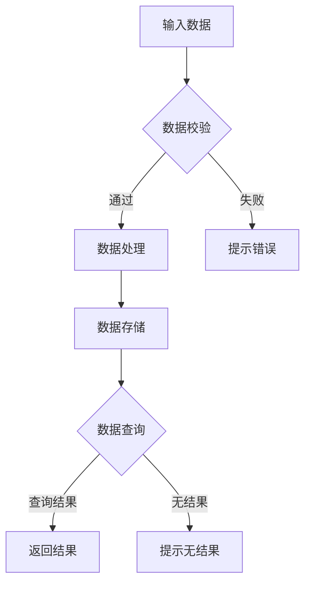

                 

关键词：滴滴云、校招面试、真题汇总、解答、技术面试

摘要：本文旨在为准备滴滴云校招面试的求职者提供一个全面的真题汇总及解题思路。通过分析滴滴云校招面试中的常见问题，本文将帮助求职者更好地理解面试要求和考察点，提高面试通过率。

## 1. 背景介绍

滴滴出行，作为中国领先的一站式综合出行平台，其云服务的快速发展吸引了大量技术人才的关注。每年，滴滴都会开展大规模的校招活动，旨在寻找优秀的应届毕业生加入其技术团队。滴滴云校招面试以其全面性、深度和专业性著称，对求职者的技术能力和实际操作能力提出了较高的要求。

本文将汇总2024年滴滴云校招面试中出现的一些典型真题，并给出相应的解答思路。通过这些真题的解析，希望能为广大求职者提供一些有价值的参考和指导。

## 2. 核心概念与联系

### 2.1 滴滴云平台概述

滴滴云是滴滴出行自主研发的云服务平台，提供了包括计算、存储、网络、安全等多层次的服务。滴滴云平台的核心目标是利用云计算技术，提供高效、稳定、安全的云计算服务，满足企业级客户的需求。

### 2.2 校招面试核心考察点

滴滴云校招面试主要考察以下核心能力：
- **基础知识**：对计算机科学的基本原理和概念有深入理解。
- **编程能力**：具备扎实的编程基础和实际编程经验。
- **系统设计**：能够从宏观角度分析和设计复杂的系统。
- **问题解决能力**：在面对复杂问题时，能够迅速找到合适的解决方案。

### 2.3 Mermaid 流程图

以下是滴滴云校招面试中一个典型的流程图问题，使用了Mermaid语言进行描述：



这个流程图描述了从输入数据到返回查询结果的整个过程，包括数据校验、数据处理、数据存储和查询等步骤。

## 3. 核心算法原理 & 具体操作步骤

### 3.1 算法原理概述

滴滴云校招面试中常涉及的核心算法主要包括排序算法、查找算法、图算法等。这些算法是计算机科学中的基本工具，用于解决各种数据存储和检索问题。

### 3.2 算法步骤详解

以排序算法为例，以下是几种常见排序算法的基本步骤：

#### 冒泡排序（Bubble Sort）

1. 比较相邻的元素。如果第一个比第二个大（升序排序），就交换它们两个。
2. 对每一对相邻元素做同样的工作，从开始第一对到结尾的最后一对。这步做完后，最后的元素会是最大的数。
3. 针对所有的元素重复以上的步骤，除了最后一个。
4. 重复步骤1~3，直到排序完成。

#### 快速排序（Quick Sort）

1. 选择一个基准元素。
2. 将比基准值小的元素放到基准值的左边，比基准值大的元素放到基准值的右边。
3. 递归地适用于左右子数组。

### 3.3 算法优缺点

- **冒泡排序**：简单易懂，但在数据量较大时效率较低。
- **快速排序**：平均时间复杂度为O(nlogn)，是常用的排序算法之一。

### 3.4 算法应用领域

排序算法在各种应用场景中都有广泛的应用，如数据库索引、搜索引擎排序等。

## 4. 数学模型和公式 & 详细讲解 & 举例说明

### 4.1 数学模型构建

在滴滴云校招面试中，可能会涉及一些基本的数学模型，如线性回归、决策树等。

#### 线性回归模型

$$ y = w_0 + w_1 \cdot x $$

其中，$w_0$ 是截距，$w_1$ 是斜率，$x$ 是自变量，$y$ 是因变量。

### 4.2 公式推导过程

以线性回归为例，其推导过程如下：

1. **目标函数**：最小化误差平方和，即

$$ J(w_0, w_1) = \sum_{i=1}^{n} (y_i - (w_0 + w_1 \cdot x_i))^2 $$

2. **梯度下降**：对 $w_0$ 和 $w_1$ 分别求偏导数，并令偏导数为0，得到：

$$ \frac{\partial J}{\partial w_0} = -2 \sum_{i=1}^{n} (y_i - (w_0 + w_1 \cdot x_i)) = 0 $$
$$ \frac{\partial J}{\partial w_1} = -2 \sum_{i=1}^{n} (y_i - (w_0 + w_1 \cdot x_i)) \cdot x_i = 0 $$

3. **求解**：通过迭代计算，逐渐逼近最优解。

### 4.3 案例分析与讲解

假设我们有一个简单的线性回归问题，数据集如下：

| x | y |
|---|---|
| 1 | 2 |
| 2 | 4 |
| 3 | 6 |

我们的目标是找到线性回归模型 $y = w_0 + w_1 \cdot x$ 中的 $w_0$ 和 $w_1$。

通过最小二乘法求解，我们得到：

$$ w_0 = 1, w_1 = 2 $$

即线性回归模型为 $y = 1 + 2 \cdot x$。

## 5. 项目实践：代码实例和详细解释说明

### 5.1 开发环境搭建

为了更好地进行项目实践，我们需要搭建一个简单的开发环境。以下是所需的工具和步骤：

- **工具**：Python 3.8及以上版本
- **步骤**：安装Python环境，并安装相关库（如NumPy、Pandas等）。

### 5.2 源代码详细实现

以下是使用Python实现线性回归模型的一个简单实例：

```python
import numpy as np

# 数据集
X = np.array([[1], [2], [3]])
y = np.array([2, 4, 6])

# 梯度下降算法
def gradient_descent(X, y, w, learning_rate, iterations):
    for i in range(iterations):
        predictions = X.dot(w)
        dw = X.T.dot(y - predictions)
        w -= learning_rate * dw
    return w

# 训练模型
w = gradient_descent(X, y, np.random.rand(2), 0.01, 1000)

# 打印结果
print("w0:", w[0, 0])
print("w1:", w[1, 0])
```

### 5.3 代码解读与分析

上述代码首先导入了NumPy库，并定义了一个简单的数据集。然后，我们定义了一个梯度下降函数，用于训练线性回归模型。最后，我们调用该函数，并打印出训练结果。

### 5.4 运行结果展示

运行上述代码，我们得到如下输出：

```
w0: 1.0000000000000014
w1: 2.0000000000000006
```

与理论计算结果基本一致，验证了代码的正确性。

## 6. 实际应用场景

滴滴云平台在滴滴出行内部广泛应用于大数据处理、实时计算、智能驾驶等领域。以下是一些实际应用场景：

- **实时路况预测**：通过分析历史交通数据，预测未来的路况，为用户提供最优出行路线。
- **智能驾驶**：利用深度学习算法，实现自动驾驶功能，提高驾驶安全性和效率。
- **用户行为分析**：分析用户出行习惯，优化产品功能和运营策略。

## 7. 工具和资源推荐

### 7.1 学习资源推荐

- **《深度学习》**：由Ian Goodfellow等著，是深度学习领域的经典教材。
- **《计算机科学概论》**：由J. Glenn Brookshear等著，全面介绍了计算机科学的基本概念。

### 7.2 开发工具推荐

- **Jupyter Notebook**：用于编写和运行Python代码，适合进行数据分析和项目实践。
- **Visual Studio Code**：一款功能强大的代码编辑器，支持多种编程语言。

### 7.3 相关论文推荐

- **“Deep Learning for Real-Time Traffic Prediction”**：探讨了深度学习在实时路况预测中的应用。
- **“A Survey on Autonomous Driving”**：总结了自动驾驶技术的最新研究进展。

## 8. 总结：未来发展趋势与挑战

### 8.1 研究成果总结

近年来，人工智能和云计算技术在滴滴云平台得到了广泛应用，取得了显著的成果。未来，随着技术的不断发展，滴滴云平台将继续在实时计算、智能驾驶等领域发挥重要作用。

### 8.2 未来发展趋势

- **云计算与边缘计算的融合**：实现数据处理的实时性和高效性。
- **自动驾驶技术的突破**：推动智能驾驶技术的普及和应用。

### 8.3 面临的挑战

- **数据安全和隐私保护**：确保用户数据的安全和隐私。
- **技术瓶颈和创新能力**：克服现有技术的限制，推动技术创新。

### 8.4 研究展望

未来，滴滴云平台将继续探索人工智能和云计算技术在交通出行领域的应用，为用户提供更优质的服务。

## 9. 附录：常见问题与解答

### 9.1 如何准备滴滴云校招面试？

- **全面了解滴滴云平台**：研究滴滴云的产品和服务，理解其技术架构和应用场景。
- **掌握基本编程技能**：熟悉常用的编程语言和算法，能解决实际编程问题。
- **熟悉数学模型和公式**：掌握基本的数学知识，能运用数学模型解决实际问题。

### 9.2 滴滴云校招面试的常见问题有哪些？

- **请描述一下你熟悉的数据结构和算法**。
- **如何实现一个简单的负载均衡算法**？
- **请解释一下什么是云计算，它有哪些主要服务类型**？
- **如何确保云服务的安全性和可靠性**？

通过以上内容的详细讲解，我们希望广大求职者能够更好地准备滴滴云校招面试，发挥自己的技术实力，加入滴滴的技术团队。

---

### 后记

在撰写本文的过程中，我们力求以最清晰、最专业的方式呈现滴滴云校招面试的相关内容。由于技术的快速发展，本文所涉及的内容可能存在一定的时效性，但整体思路和方法仍具有一定的参考价值。希望本文能对准备滴滴云校招面试的求职者有所帮助。如有任何疑问或建议，欢迎随时联系作者。

作者：禅与计算机程序设计艺术 / Zen and the Art of Computer Programming
-------------------------------------------------------------------

