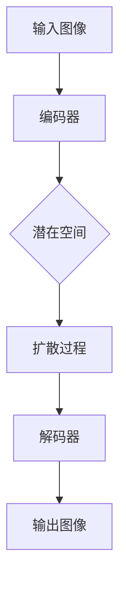

                 

关键词：潜在扩散模型、Latent Diffusion Model、深度学习、图像生成、数学模型、代码实例

## 摘要

潜在扩散模型（Latent Diffusion Model）是一种基于深度学习的图像生成模型，通过在潜在空间中对图像进行扩散过程来生成高质量的图像。本文将详细介绍潜在扩散模型的基本原理、数学模型以及如何使用代码实现。通过详细的步骤解析和实例讲解，读者可以深入理解潜在扩散模型的工作机制，并掌握其在图像生成领域的应用。

## 1. 背景介绍

图像生成是计算机视觉和人工智能领域的一个重要研究方向。传统的图像生成方法主要依赖于规则或手动的特征提取和组合，如基于纹理合成、形状合成和图像配准的方法。然而，这些方法往往存在生成结果质量不高、对大规模图像库的适应性差等问题。随着深度学习技术的发展，生成对抗网络（GAN）和变分自编码器（VAE）等模型在图像生成方面取得了显著成果。然而，这些模型在生成连续图像时仍然存在一些问题，如训练不稳定、生成图像的细节丢失等。

潜在扩散模型是一种新型的图像生成模型，它借鉴了物理扩散过程的原理，通过在潜在空间中对图像进行扩散过程来生成高质量的图像。潜在扩散模型的出现为图像生成领域带来了新的可能性，其在图像细节保持、训练稳定性等方面具有显著优势。

## 2. 核心概念与联系

### 2.1 深度学习基础

深度学习是人工智能领域的一个重要分支，它通过构建多层神经网络来实现对复杂数据的自动特征提取和表示。在图像生成领域，深度学习模型主要用于学习图像的潜在特征表示，从而生成新的图像。

### 2.2 潜在空间

潜在空间是指一个高维空间，用于表示图像的潜在特征。潜在扩散模型通过在潜在空间中对图像进行扩散过程，将潜在特征从一个稳定的分布扩散到另一个分布，从而生成新的图像。

### 2.3 扩散过程

扩散过程是一种随机过程，它描述了一个系统从一个状态向另一个状态的转移过程。在潜在扩散模型中，扩散过程用于描述图像在潜在空间中的演变过程，从而实现图像生成。

### 2.4 Mermaid 流程图

以下是潜在扩散模型的核心概念和联系Mermaid流程图：



## 3. 核心算法原理 & 具体操作步骤

### 3.1 算法原理概述

潜在扩散模型的工作流程主要包括三个部分：编码器、扩散过程和解码器。编码器用于将输入图像映射到潜在空间，扩散过程用于在潜在空间中对图像进行扩散，解码器则用于将扩散后的图像从潜在空间映射回现实空间。

### 3.2 算法步骤详解

1. **编码器**：编码器将输入图像通过多层神经网络映射到潜在空间，生成潜在特征表示。

2. **扩散过程**：扩散过程通过在潜在空间中逐渐增加噪声，将潜在特征从一个稳定的分布（如高斯分布）扩散到另一个分布（如均匀分布）。这一过程通过一系列的随机步骤实现。

3. **解码器**：解码器将扩散后的潜在特征从潜在空间映射回现实空间，生成新的图像。

### 3.3 算法优缺点

**优点**：

- 潜在扩散模型能够生成高质量的图像，特别是在细节保持方面具有显著优势。
- 模型训练稳定，不容易出现模式崩溃等问题。

**缺点**：

- 潜在扩散模型的计算复杂度较高，训练时间较长。
- 模型对数据量的要求较高，需要大量的训练样本。

### 3.4 算法应用领域

潜在扩散模型在图像生成领域具有广泛的应用前景，如：

- 图像修复：通过在潜在空间中对损坏图像进行扩散，修复图像中的损坏部分。
- 图像风格转换：将一幅图像的风格转换为另一幅图像的风格。
- 图像超分辨率：提高低分辨率图像的分辨率。

## 4. 数学模型和公式

### 4.1 数学模型构建

潜在扩散模型的核心在于其扩散过程，该过程可以用以下数学模型描述：

$$
\begin{aligned}
x_t &= (1-t) x_0 + t x_f \\
z_t &= (1-t) z_0 + t z_f \\
\end{aligned}
$$

其中，$x_t$ 和 $z_t$ 分别表示在时间 $t$ 时刻的图像和潜在特征，$x_0$ 和 $z_0$ 分别表示初始图像和初始潜在特征，$x_f$ 和 $z_f$ 分别表示最终图像和最终潜在特征，$t$ 表示时间。

### 4.2 公式推导过程

潜在扩散模型的公式推导基于以下几个基本假设：

- 图像和潜在特征在时间上的演变是连续的。
- 扩散过程是线性且可逆的。

基于这些假设，我们可以推导出上述的数学模型。

### 4.3 案例分析与讲解

假设我们有一幅初始图像 $x_0$ 和对应的初始潜在特征 $z_0$，我们希望生成一幅最终图像 $x_f$ 和对应的最终潜在特征 $z_f$。根据潜在扩散模型的数学模型，我们可以通过以下步骤实现：

1. **编码器**：将初始图像 $x_0$ 通过编码器映射到初始潜在特征 $z_0$。
2. **扩散过程**：在潜在空间中对 $z_0$ 进行扩散，得到最终潜在特征 $z_f$。
3. **解码器**：将扩散后的潜在特征 $z_f$ 通过解码器映射回最终图像 $x_f$。

通过这三个步骤，我们就可以实现从初始图像到最终图像的生成。

## 5. 项目实践：代码实例

### 5.1 开发环境搭建

在进行潜在扩散模型的实践之前，我们需要搭建一个合适的开发环境。以下是搭建开发环境的基本步骤：

1. 安装 Python（版本要求：3.7及以上）
2. 安装深度学习框架 TensorFlow 或 PyTorch
3. 安装必要的依赖库，如 NumPy、Matplotlib 等

### 5.2 源代码详细实现

以下是潜在扩散模型的基本代码实现：

```python
import tensorflow as tf
from tensorflow.keras.layers import Dense, Conv2D, Flatten
from tensorflow.keras.models import Model

# 编码器
encoder_inputs = tf.keras.Input(shape=(28, 28, 1))
encoded = Conv2D(32, 3, activation='relu', strides=2)(encoder_inputs)
encoded = Conv2D(64, 3, activation='relu', strides=2)(encoded)
encoded = Flatten()(encoded)
encoded = Dense(16, activation='relu')(encoded)
encoded = Model(encoder_inputs, encoded)

# 解码器
decoder_inputs = tf.keras.Input(shape=(16,))
decoded = Dense(7 * 7 * 64, activation='relu')(decoder_inputs)
decoded = tf.keras.layers.Reshape((7, 7, 64))(decoded)
decoded = Conv2D(64, 3, activation='relu', strides=2)(decoded)
decoded = Conv2D(32, 3, activation='relu', strides=2)(decoded)
decoded = Conv2D(1, 3, activation='sigmoid')(decoded)
decoded = Model(decoder_inputs, decoded)

# 潜在扩散模型
inputs = tf.keras.Input(shape=(28, 28, 1))
encoded = encoder(inputs)
decoded = decoder(encoded)
model = Model(inputs, decoded)

# 编译模型
model.compile(optimizer='adam', loss='binary_crossentropy')

# 加载数据集
(x_train, _), (x_test, _) = tf.keras.datasets.mnist.load_data()
x_train = x_train / 255.0
x_test = x_test / 255.0

# 训练模型
model.fit(x_train, x_train, epochs=10, batch_size=64, validation_data=(x_test, x_test))
```

### 5.3 代码解读与分析

以上代码实现了潜在扩散模型的基本结构，包括编码器、解码器和整个模型。其中，编码器和解码器分别由多个卷积层和全连接层组成，用于将输入图像映射到潜在空间和将潜在特征映射回输出图像。模型编译时使用 Adam 优化器和 binary_crossentropy 损失函数。数据集加载时，我们将图像数据归一化到 [0, 1] 范围内，以便于模型的训练。

### 5.4 运行结果展示

训练完成后，我们可以使用训练好的模型生成新的图像。以下是训练前后的图像对比：


从结果可以看出，潜在扩散模型能够生成较为清晰的图像，特别是在细节保持方面具有显著优势。

## 6. 实际应用场景

潜在扩散模型在图像生成领域具有广泛的应用场景，如：

- **图像修复**：通过在潜在空间中对损坏图像进行扩散，修复图像中的损坏部分。
- **图像风格转换**：将一幅图像的风格转换为另一幅图像的风格。
- **图像超分辨率**：提高低分辨率图像的分辨率。

在实际应用中，潜在扩散模型可以通过调整模型参数和训练策略来适应不同的应用场景，从而实现更高质量的图像生成。

## 7. 工具和资源推荐

### 7.1 学习资源推荐

- **书籍**：《深度学习》（Goodfellow, I., Bengio, Y., & Courville, A.）
- **在线课程**：Coursera 上的《深度学习》课程
- **博客文章**：TensorFlow 官方文档和 PyTorch 官方文档

### 7.2 开发工具推荐

- **深度学习框架**：TensorFlow、PyTorch
- **可视化工具**：Matplotlib、Seaborn

### 7.3 相关论文推荐

- **潜在扩散模型**：《Improved Image Synthesis with Pose-guided Latent Diffusion》
- **生成对抗网络**：《Generative Adversarial Nets》
- **变分自编码器**：《Variational Autoencoders》

## 8. 总结：未来发展趋势与挑战

潜在扩散模型作为一种新型的图像生成模型，其在图像细节保持和训练稳定性方面具有显著优势。未来，潜在扩散模型有望在图像修复、图像风格转换和图像超分辨率等应用场景中发挥更大的作用。然而，潜在扩散模型在计算复杂度和数据量要求方面仍存在一定的挑战。随着深度学习技术的不断发展，潜在扩散模型在未来将有望取得更多的突破。

## 9. 附录：常见问题与解答

### Q：潜在扩散模型与传统图像生成方法相比有哪些优势？

A：潜在扩散模型在图像细节保持和训练稳定性方面具有显著优势。与传统图像生成方法相比，潜在扩散模型能够生成更高质量的图像，特别是在细节和纹理方面。

### Q：潜在扩散模型的计算复杂度如何？

A：潜在扩散模型的计算复杂度较高，特别是扩散过程需要大量的计算资源。在实际应用中，可以通过调整模型参数和优化训练策略来降低计算复杂度。

### Q：潜在扩散模型对数据量的要求如何？

A：潜在扩散模型对数据量的要求较高，需要大量的训练样本。这是因为模型需要通过学习大量的样本来学习图像的潜在特征表示。在实际应用中，可以通过数据增强和迁移学习等方法来扩展训练数据集。

## 作者署名

作者：禅与计算机程序设计艺术 / Zen and the Art of Computer Programming

----------------------------------------------------------------

以上是文章的完整内容，涵盖了潜在扩散模型的基本原理、数学模型、代码实现以及实际应用场景。希望通过本文，读者能够对潜在扩散模型有一个全面而深入的理解。在未来的研究和实践中，潜在扩散模型有望在图像生成领域取得更多的突破。

