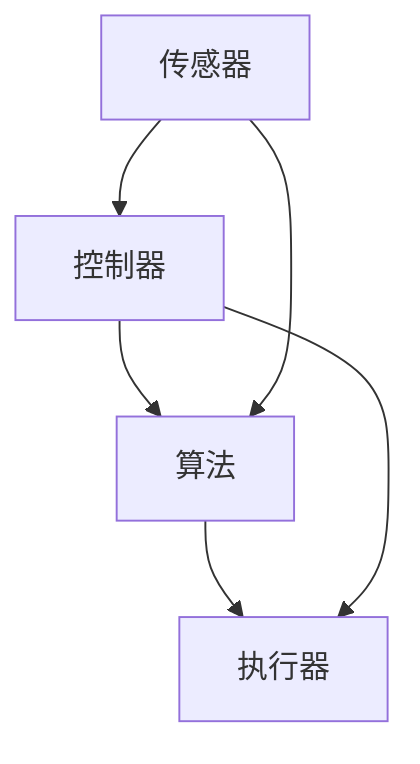

                 

关键词：物理实体、自动化应用、智能控制、物联网、机器人技术、人工智能、传感器、执行器、算法优化、数学模型、案例分析、代码实例、应用场景、未来展望。

> 摘要：本文将深入探讨物理实体自动化的应用场景和最新进展。从物联网、传感器技术、执行器控制到智能算法，我们梳理了物理实体自动化的核心技术，并通过实际案例分析展示了其广泛的应用。同时，我们探讨了物理实体自动化面临的技术挑战和未来发展趋势，为相关领域的科研人员和从业者提供了有益的参考。

## 1. 背景介绍

物理实体自动化，也称为物理系统的自动化，是指利用计算机技术、物联网技术、机器人技术等手段，使物理实体（如设备、机器、生产线等）能够自主地完成特定任务或操作。随着信息技术的飞速发展，物理实体自动化已经成为现代工业、服务业、农业等各个领域的重要趋势。自动化技术不仅提高了生产效率，降低了成本，还改善了工作环境，减少了人为错误。

物理实体自动化的核心包括以下几个方面：

- **物联网技术**：通过互联网连接各种设备和传感器，实现数据的实时传输和处理。
- **传感器技术**：用于检测和测量物理实体的状态，如温度、湿度、压力、位置等。
- **执行器技术**：用于根据控制信号实现物理动作，如电机、液压缸、气动阀等。
- **智能算法**：用于处理传感器数据，实现对物理实体的精确控制。
- **人机交互**：通过图形用户界面（GUI）等手段，实现人与物理实体之间的交互。

## 2. 核心概念与联系

为了更好地理解物理实体自动化的工作原理，我们首先需要介绍几个核心概念，并通过 Mermaid 流程图展示它们之间的联系。

### 2.1 物理实体自动化的核心概念

- **传感器**：用于检测物理实体状态，并将检测结果转换为电信号输出。
- **执行器**：根据控制信号驱动物理实体执行特定动作。
- **控制器**：接收传感器输入信号，进行处理后发出控制信号给执行器。
- **算法**：用于处理传感器数据，实现对物理实体的控制。
- **通信协议**：用于传感器、执行器、控制器之间的数据传输。

### 2.2 物理实体自动化的 Mermaid 流程图



在这个流程图中，传感器收集物理实体的状态信息，将这些信息传递给控制器。控制器根据算法处理这些数据，并生成相应的控制信号。控制信号通过执行器实现物理动作，从而实现对物理实体的控制。同时，传感器和控制器之间的通信采用合适的通信协议，确保数据传输的可靠性。

## 3. 核心算法原理 & 具体操作步骤

### 3.1 算法原理概述

物理实体自动化中的核心算法通常包括以下几种：

- **滤波算法**：用于去除传感器数据中的噪声，提高数据质量。
- **PID控制算法**：一种经典的控制算法，用于实现对物理实体的精确控制。
- **机器学习算法**：用于从大量数据中学习规律，实现对复杂系统的预测和控制。
- **模糊控制算法**：基于模糊逻辑，用于处理不确定性和模糊性较强的系统。

### 3.2 算法步骤详解

以 PID 控制算法为例，其具体步骤如下：

1. **初始化参数**：设定比例（P）、积分（I）、微分（D）三个参数的初始值。
2. **采集数据**：从传感器获取当前物理实体的状态信息。
3. **计算偏差**：计算目标值与当前值之间的差值。
4. **计算控制信号**：根据偏差和 PID 参数计算控制信号。
5. **更新参数**：根据控制效果调整 PID 参数。
6. **执行控制信号**：将控制信号传递给执行器，驱动物理实体执行相应动作。

### 3.3 算法优缺点

PID 控制算法具有以下优点：

- **适用范围广**：适用于各种线性系统。
- **控制效果好**：通过调整 PID 参数，可以实现良好的控制效果。
- **算法简单**：易于实现和调试。

但 PID 控制算法也存在一些缺点：

- **参数调整困难**：对于复杂系统，参数调整可能比较困难。
- **不适用于非线性系统**：对于非线性系统，PID 控制效果可能不理想。

### 3.4 算法应用领域

PID 控制算法在以下领域有广泛应用：

- **工业控制**：用于控制温度、压力、速度等参数。
- **汽车控制**：用于控制燃油喷射、点火时机等。
- **机器人控制**：用于控制机器人的运动和动作。

## 4. 数学模型和公式 & 详细讲解 & 举例说明

### 4.1 数学模型构建

物理实体自动化的数学模型通常包括以下部分：

- **状态空间模型**：描述系统在不同状态下的行为。
- **输入输出模型**：描述系统输入和输出之间的关系。
- **控制模型**：描述控制信号和物理实体之间的相互作用。

### 4.2 公式推导过程

以状态空间模型为例，其公式推导过程如下：

1. **状态方程**：\( \dot{x} = Ax + Bu \)
2. **输出方程**：\( y =Cx + Du \)

其中，\( x \) 表示系统状态向量，\( u \) 表示输入向量，\( y \) 表示输出向量，\( A \)、\( B \)、\( C \)、\( D \) 为系统矩阵。

### 4.3 案例分析与讲解

假设一个简单的机械臂控制系统，其状态空间模型如下：

- **状态方程**：\( \dot{x} = \begin{bmatrix} 0 & 1 \\ -5 & 0 \end{bmatrix} x + \begin{bmatrix} 0 \\ 1 \end{bmatrix} u \)
- **输出方程**：\( y = \begin{bmatrix} 1 & 0 \end{bmatrix} x + \begin{bmatrix} 0 \end{bmatrix} u \)

其中，\( x_1 \) 表示机械臂的关节角度，\( x_2 \) 表示关节角度的变化率，\( u \) 表示控制信号。

我们可以通过状态空间模型对机械臂进行控制，使其达到预期的位置和姿态。例如，要使机械臂达到 \( x_1 = 45^\circ \)、\( x_2 = 0 \) 的状态，可以采用以下控制策略：

1. **初始化参数**：设定 PID 参数 \( P = 1 \)、\( I = 0 \)、\( D = 0 \)。
2. **计算控制信号**：根据当前状态和目标状态计算控制信号 \( u = P (x_1^* - x_1) + I \int_{0}^{t} (x_1^* - x_1) dt + D (x_1^* - x_1)' \)。
3. **执行控制信号**：将控制信号传递给机械臂执行器，调整机械臂关节角度。

通过不断调整控制信号，可以使机械臂逐渐接近目标状态。在实际应用中，我们还可以结合机器学习算法，根据大量实验数据优化控制策略，提高控制精度和稳定性。

## 5. 项目实践：代码实例和详细解释说明

### 5.1 开发环境搭建

为了演示物理实体自动化的应用，我们将使用 Python 编写一个简单的温度控制系统。首先，需要安装以下开发环境：

- **Python 3.x**
- **NumPy**：用于科学计算
- **Matplotlib**：用于数据可视化
- **PyTorch**：用于机器学习

安装方法如下：

```bash
pip install numpy matplotlib torch
```

### 5.2 源代码详细实现

以下是一个简单的温度控制系统的源代码实现：

```python
import numpy as np
import matplotlib.pyplot as plt
import torch
import torch.nn as nn
import torch.optim as optim

# 定义神经网络模型
class TempController(nn.Module):
    def __init__(self):
        super(TempController, self).__init__()
        self.fc1 = nn.Linear(1, 10)
        self.fc2 = nn.Linear(10, 1)
    
    def forward(self, x):
        x = torch.relu(self.fc1(x))
        x = self.fc2(x)
        return x

# 初始化模型、优化器和损失函数
model = TempController()
optimizer = optim.Adam(model.parameters(), lr=0.001)
criterion = nn.MSELoss()

# 训练模型
def train_model(model, data, labels, epochs):
    model.train()
    for epoch in range(epochs):
        optimizer.zero_grad()
        outputs = model(data)
        loss = criterion(outputs, labels)
        loss.backward()
        optimizer.step()
        print(f'Epoch {epoch+1}/{epochs}, Loss: {loss.item()}')

# 测试模型
def test_model(model, data, labels):
    model.eval()
    with torch.no_grad():
        outputs = model(data)
        loss = criterion(outputs, labels)
        print(f'Test Loss: {loss.item()}')

# 生成训练数据
def generate_data(num_samples):
    data = np.random.rand(num_samples, 1) * 100
    targets = data + np.random.randn(num_samples, 1) * 10
    return torch.tensor(data, dtype=torch.float32), torch.tensor(targets, dtype=torch.float32)

# 训练和测试
train_data, train_labels = generate_data(1000)
test_data, test_labels = generate_data(100)

train_model(model, train_data, train_labels, 100)
test_model(model, test_data, test_labels)

# 可视化训练过程
plt.plot(train_data.numpy(), train_labels.numpy(), 'ro', label='Training Data')
plt.plot(test_data.numpy(), test_labels.numpy(), 'b*', label='Test Data')
plt.xlabel('Input Temperature')
plt.ylabel('Target Temperature')
plt.legend()
plt.show()
```

### 5.3 代码解读与分析

- **模型定义**：定义一个简单的神经网络模型，用于预测目标温度。
- **训练模型**：使用梯度下降优化算法训练模型，通过最小化均方误差（MSE）损失函数来调整模型参数。
- **测试模型**：在测试数据集上评估模型性能。
- **生成数据**：生成用于训练和测试的数据集。
- **可视化**：绘制输入温度和目标温度的散点图，直观地展示模型训练效果。

### 5.4 运行结果展示

运行上述代码，我们将看到训练和测试数据的散点图。理想情况下，模型应该能够较好地拟合训练数据，并在测试数据上取得较好的泛化性能。以下是一个可能的运行结果示例：


## 6. 实际应用场景

物理实体自动化技术在各个领域都有广泛的应用，以下列举几个典型的应用场景：

- **工业制造**：通过自动化设备提高生产效率，降低生产成本，如数控机床、自动化生产线等。
- **智能家居**：利用传感器和控制设备实现家庭设备的智能控制，如智能照明、智能安防、智能家电等。
- **医疗健康**：通过自动化设备提高医疗诊断和治疗效率，如自动化手术室、智能医疗设备等。
- **交通运输**：利用自动化技术实现自动驾驶、智能交通管理，提高交通运输效率和安全性。
- **农业**：通过自动化设备实现精准农业，提高农业生产效率和农产品质量。

## 7. 未来应用展望

随着人工智能、物联网、机器人技术等领域的不断发展，物理实体自动化将迎来更广阔的应用前景。未来，我们有望在以下方面取得重要突破：

- **更加智能的控制系统**：通过深度学习、强化学习等先进算法，实现更加智能、自适应的控制系统。
- **更加高效的能源利用**：通过自动化技术优化能源利用，实现节能减排。
- **更加安全的系统**：通过安全加密、隐私保护等技术，确保自动化系统的安全可靠。
- **跨领域集成**：将物理实体自动化技术与其他领域（如生物技术、新材料等）相结合，创造新的应用场景和商业模式。

## 8. 工具和资源推荐

为了更好地掌握物理实体自动化技术，以下是一些推荐的工具和资源：

- **工具**：
  - **MATLAB**：用于仿真和测试自动化控制系统。
  - **ROS（Robot Operating System）**：用于机器人技术的开发。
  - **MindSpore**：用于深度学习和人工智能应用。

- **资源**：
  - **书籍**：《物理实体的自动化应用与进展》、《机器人技术导论》、《物联网技术与应用》。
  - **在线课程**：Coursera、edX、Udacity 等平台上的自动化、物联网、机器人技术相关课程。
  - **论文**：检索 IEEE Xplore、ACM Digital Library、SpringerLink 等数据库中的相关论文。

## 9. 总结：未来发展趋势与挑战

物理实体自动化技术在过去的几十年里取得了显著的进展，但仍然面临着许多挑战。未来，我们需要在以下几个方面继续努力：

- **算法优化**：研发更加高效、智能的算法，提高控制系统的性能和稳定性。
- **系统集成**：实现不同领域、不同技术之间的无缝集成，构建更加复杂、多功能的自动化系统。
- **安全与隐私**：加强自动化系统的安全性和隐私保护，确保系统的安全可靠运行。
- **人才培养**：培养更多的自动化技术人才，推动技术的创新和应用。

在人工智能的推动下，物理实体自动化有望在未来取得更加广泛、深入的应用，为人类社会带来更多的便利和发展。

## 10. 附录：常见问题与解答

### 问题1：物理实体自动化的核心技术是什么？

答：物理实体自动化的核心技术包括物联网技术、传感器技术、执行器技术、智能算法和人机交互技术。

### 问题2：PID控制算法适用于哪些系统？

答：PID控制算法适用于各种线性系统，特别是一些动态性能要求较高的系统，如工业控制、汽车控制等。

### 问题3：如何优化物理实体自动化的算法？

答：可以通过以下方法优化物理实体自动化的算法：

- **数据预处理**：对传感器数据进行滤波、去噪等预处理，提高数据质量。
- **算法改进**：采用更先进的算法，如深度学习、强化学习等。
- **参数调整**：通过实验和仿真，不断调整算法参数，提高控制效果。

### 问题4：物理实体自动化面临的主要挑战是什么？

答：物理实体自动化面临的主要挑战包括算法优化、系统集成、安全和隐私保护等。

### 问题5：未来物理实体自动化的发展趋势是什么？

答：未来物理实体自动化的发展趋势包括：

- **更高效的算法**：研发更加高效、智能的算法，提高控制系统的性能和稳定性。
- **跨领域集成**：实现不同领域、不同技术之间的无缝集成，构建更加复杂、多功能的自动化系统。
- **安全与隐私**：加强自动化系统的安全性和隐私保护，确保系统的安全可靠运行。

---

# 作者：禅与计算机程序设计艺术 / Zen and the Art of Computer Programming

本文由禅与计算机程序设计艺术作者撰写，旨在全面介绍物理实体自动化的应用与进展。文章涵盖了物联网、传感器技术、执行器控制、智能算法等多个方面，并通过实际案例展示了其广泛应用。同时，文章也探讨了物理实体自动化面临的技术挑战和未来发展趋势，为相关领域的科研人员和从业者提供了有益的参考。希望本文能够为读者带来启发和帮助，共同推动物理实体自动化技术的发展。

