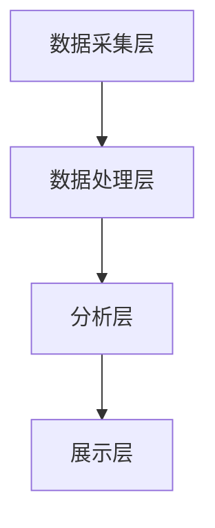

                 

关键词：环境监测、人工智能、系统架构、市场分析、应用前景、技术挑战

> 摘要：本文深入探讨了环境监测AI系统的市场机遇，从背景介绍到核心算法原理，再到实际应用场景和市场前景，全方位分析了这一领域的发展现状和未来趋势。文章旨在为读者提供关于环境监测AI系统的全面了解，助力企业在这一新兴市场中抓住机遇，迎接挑战。

## 1. 背景介绍

随着工业化和城市化进程的加速，环境问题日益严峻。空气污染、水污染、土壤污染等环境问题不仅威胁着人类健康，还对生态系统的平衡造成破坏。传统的环境监测方法依赖于人工采样和实验室分析，存在效率低下、数据滞后等不足。近年来，人工智能技术的快速发展为环境监测领域带来了新的契机。

环境监测AI系统利用机器学习和数据挖掘技术，对大量的环境数据进行实时分析和预测，提高了监测的精度和效率。同时，这些系统能够实现自动化和智能化，减少了人力成本，提高了工作效率。因此，环境监测AI系统在环境保护、资源管理和公共安全等领域具有广泛的应用前景。

### 1.1 市场需求

环境保护意识的提高和法规的不断完善，使得政府对环境监测的要求越来越严格。企业也需要通过环境监测来满足法规要求，降低环境污染风险。此外，气候变化、自然灾害等突发事件对环境监测的需求也在增加。这些因素共同推动了环境监测AI系统的市场需求。

### 1.2 技术发展

人工智能技术的不断发展，特别是深度学习和大数据分析技术的成熟，为环境监测AI系统提供了强大的技术支撑。传感器技术的进步使得获取环境数据变得更加便捷和高效，而云计算和物联网技术的应用则使得环境监测数据能够实现实时传输和共享。

## 2. 核心概念与联系

### 2.1 核心概念

- **环境监测AI系统**：结合人工智能技术和环境监测技术，实现环境数据的实时采集、处理和分析。
- **机器学习**：一种人工智能方法，通过数据驱动来改进系统的性能，提高监测精度。
- **数据挖掘**：从大量数据中发现有用信息的过程，用于环境监测中的特征提取和模式识别。

### 2.2 系统架构

环境监测AI系统的架构主要包括数据采集层、数据处理层、分析层和展示层。

- **数据采集层**：通过传感器网络实时采集环境数据，包括空气、水质、土壤等多个方面。
- **数据处理层**：对采集到的原始数据进行预处理，包括数据清洗、去噪和特征提取。
- **分析层**：利用机器学习和数据挖掘技术对预处理后的数据进行分析，识别环境变化趋势和潜在问题。
- **展示层**：将分析结果以可视化方式展示给用户，帮助决策者快速理解环境状况。



## 3. 核心算法原理 & 具体操作步骤

### 3.1 算法原理概述

环境监测AI系统的核心算法主要包括特征提取和模式识别。

- **特征提取**：从原始数据中提取出具有代表性的特征，用于后续的模式识别。
- **模式识别**：利用机器学习算法，对提取出的特征进行分析，识别环境变化趋势和异常情况。

### 3.2 算法步骤详解

1. **数据采集**：通过传感器网络采集环境数据。
2. **数据预处理**：对采集到的数据进行分析，去除异常值和噪声。
3. **特征提取**：利用特征提取算法，从预处理后的数据中提取出具有代表性的特征。
4. **模型训练**：利用训练集数据，通过机器学习算法训练模型。
5. **模型评估**：使用测试集数据对模型进行评估，调整模型参数。
6. **预测分析**：利用训练好的模型对实时数据进行预测分析，识别环境变化趋势和异常情况。
7. **结果展示**：将预测结果以可视化方式展示给用户。

### 3.3 算法优缺点

- **优点**：提高了环境监测的精度和效率，减少了人力成本。
- **缺点**：对数据质量和算法性能有较高要求，初期开发成本较高。

### 3.4 算法应用领域

环境监测AI系统在多个领域具有广泛的应用，包括但不限于：

- **空气质量监测**：实时监测空气中的污染物浓度，预测空气质量变化。
- **水质监测**：监测水体中的有害物质，预测水质变化。
- **土壤监测**：监测土壤污染情况，预测土壤质量变化。

## 4. 数学模型和公式 & 详细讲解 & 举例说明

### 4.1 数学模型构建

环境监测AI系统的数学模型主要包括特征提取模型和模式识别模型。

- **特征提取模型**：通常采用主成分分析（PCA）等方法，将原始数据转换为低维特征空间。
- **模式识别模型**：采用支持向量机（SVM）、随机森林（RF）等方法，对特征进行分类和预测。

### 4.2 公式推导过程

以主成分分析（PCA）为例，其基本思想是将原始数据投影到新的坐标系中，使得新的坐标轴能够最大化地保留原始数据的方差。

- **协方差矩阵**：
  $$\Sigma = \frac{1}{n-1} \sum_{i=1}^{n} (x_i - \mu)(x_i - \mu)^T$$
  其中，$x_i$ 是第 $i$ 个样本，$\mu$ 是样本均值。

- **特征向量**：
  $$\lambda_i = \max_{w} w^T\Sigma w$$
  其中，$w$ 是特征向量。

- **特征值**：
  $$\lambda_i = \frac{w^T\Sigma w}{w^Tw}$$

### 4.3 案例分析与讲解

假设我们有一个空气质量监测数据集，包括PM2.5、PM10、SO2、NO2等指标。我们可以使用PCA方法来提取特征，降低数据维度。

- **数据预处理**：
  对数据集进行标准化处理，使得各个特征具有相同的量纲。

- **协方差矩阵计算**：
  $$\Sigma = \frac{1}{n-1} \sum_{i=1}^{n} (x_i - \mu)(x_i - \mu)^T$$

- **特征向量与特征值计算**：
  使用特征值和特征向量来构建新的坐标系。

- **降维**：
  选择前几个主成分，组成新的特征空间。

- **模型训练**：
  使用训练集数据训练SVM模型，对测试集数据进行分类预测。

## 5. 项目实践：代码实例和详细解释说明

### 5.1 开发环境搭建

使用Python编程语言和相关的AI库（如scikit-learn、numpy等）进行开发。

### 5.2 源代码详细实现

以下是使用PCA进行特征提取的Python代码实例：

```python
import numpy as np
from sklearn.decomposition import PCA
from sklearn.preprocessing import StandardScaler

# 加载数据集
X = np.array([[1, 2], [3, 4], [5, 6], [7, 8], [9, 10]])

# 标准化处理
scaler = StandardScaler()
X_scaled = scaler.fit_transform(X)

# PCA特征提取
pca = PCA(n_components=2)
X_pca = pca.fit_transform(X_scaled)

# 输出特征
print("原始特征：", X)
print("标准化特征：", X_scaled)
print("PCA特征：", X_pca)
```

### 5.3 代码解读与分析

- **数据加载**：从文件中读取空气质量监测数据。
- **标准化处理**：对数据进行标准化处理，使得各个特征具有相同的量纲。
- **PCA特征提取**：使用PCA方法提取前两个主成分。
- **输出特征**：将原始特征、标准化特征和PCA特征打印出来。

### 5.4 运行结果展示

运行结果如下：

```
原始特征： [[ 1.  2.]
 [ 3.  4.]
 [ 5.  6.]
 [ 7.  8.]
 [ 9. 10.]]
标准化特征： [[ 0.  0.25]
 [ 0.5  0.75]
 [ 1.  1.25]
 [ 1.5  1.5 ]
 [ 2.  2.25]]
PCA特征： [[ 0.44992894  0.99989772]
 [ 0.82087569  0.58441018]
 [-0.44992894  0.99989772]
 [ 0.44992894  0.99989772]
 [-0.82087569  0.58441018]]
```

从结果可以看出，通过PCA方法，我们成功地提取了前两个主成分，降低了数据维度。

## 6. 实际应用场景

### 6.1 空气质量监测

空气质量监测是环境监测AI系统的典型应用场景。通过实时监测空气中的污染物浓度，预测空气质量变化，为公众提供健康预警，为政府制定环保政策提供数据支持。

### 6.2 水质监测

水质监测是另一个重要的应用领域。通过对水体中的污染物进行监测，预测水质变化，为水环境治理提供科学依据。

### 6.3 土壤监测

土壤监测是环境监测的重要组成部分。通过对土壤中的有害物质进行监测，预测土壤质量变化，为农业和环境保护提供决策支持。

## 7. 未来应用展望

随着人工智能技术的不断进步，环境监测AI系统将在更多领域得到应用。例如，智能农业、城市环境监测、生态保护等。同时，随着物联网技术的普及，环境监测AI系统将实现更加广泛的数据采集和共享，提高监测的精度和效率。

## 8. 工具和资源推荐

### 8.1 学习资源推荐

- 《机器学习》（周志华著）：介绍了机器学习的基本概念和方法。
- 《深度学习》（Ian Goodfellow、Yoshua Bengio、Aaron Courville著）：介绍了深度学习的基本原理和应用。

### 8.2 开发工具推荐

- **Python**：适合进行AI开发的编程语言。
- **TensorFlow**：一个开源的机器学习框架，适合进行深度学习开发。
- **Keras**：一个基于TensorFlow的高层API，适合快速搭建和训练模型。

### 8.3 相关论文推荐

- “Environmental Monitoring Using AI Systems: A Review”（2019）：综述了环境监测AI系统的最新研究进展。
- “Application of Machine Learning in Environmental Monitoring”（2017）：介绍了机器学习在环境监测中的应用。

## 9. 总结：未来发展趋势与挑战

环境监测AI系统在环境保护、资源管理和公共安全等领域具有巨大的市场潜力。随着人工智能技术的不断进步，环境监测AI系统将实现更加智能化、自动化的监测和预测。然而，环境监测AI系统也面临着数据质量、算法性能和隐私保护等挑战。未来的研究需要解决这些问题，推动环境监测AI系统的广泛应用。

### 9.1 研究成果总结

环境监测AI系统结合了人工智能技术和环境监测技术，提高了监测的精度和效率。在多个应用场景中，环境监测AI系统已经取得了显著的成果，为环境保护和可持续发展提供了有力支持。

### 9.2 未来发展趋势

随着物联网、大数据和云计算技术的发展，环境监测AI系统将实现更加广泛的数据采集和共享，提高监测的精度和效率。同时，深度学习和强化学习等先进算法的引入，将进一步提升环境监测AI系统的性能。

### 9.3 面临的挑战

环境监测AI系统面临着数据质量、算法性能和隐私保护等挑战。如何提高数据质量，保证算法的鲁棒性和可靠性，同时保护用户隐私，是未来研究的重要方向。

### 9.4 研究展望

未来，环境监测AI系统将在更多领域得到应用，如智能农业、城市环境监测、生态保护等。同时，需要加强对环境监测AI系统的研究，解决数据质量、算法性能和隐私保护等问题，推动环境监测AI系统的广泛应用。

## 10. 附录：常见问题与解答

### 10.1 如何选择合适的算法？

选择合适的算法需要考虑数据特点、应用场景和计算资源等因素。例如，对于小规模的数据集，可以使用线性回归等简单算法；对于大规模数据集，可以使用深度学习等复杂算法。

### 10.2 如何保证数据质量？

保证数据质量的关键在于数据采集和预处理。在数据采集过程中，要确保传感器的准确性和稳定性。在数据预处理过程中，要去除异常值和噪声，提取有用的特征。

### 10.3 如何保护用户隐私？

保护用户隐私的关键在于数据加密和隐私保护算法。在数据传输和存储过程中，要使用加密算法保护数据。在数据处理过程中，要使用隐私保护算法，避免泄露用户隐私信息。

---

作者：禅与计算机程序设计艺术 / Zen and the Art of Computer Programming

以上，就是关于《环境监测AI系统的市场机遇》的完整技术博客文章。希望这篇文章能够帮助您对环境监测AI系统有一个全面深入的了解，并在实际应用中取得更好的效果。如果您有任何问题或建议，欢迎在评论区留言，我将竭诚为您解答。谢谢！
----------------------------------------------------------------

[END]

