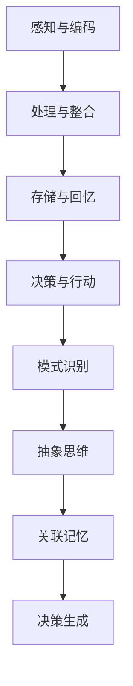

                 

关键词：洞察力，大脑，信息处理，神经科学，认知架构

> 摘要：本文旨在深入探讨人类大脑处理信息的奥秘，尤其是洞察力的科学原理。我们将结合神经科学的研究成果，解析大脑如何通过复杂的神经网络和认知架构来捕捉和处理信息，从而实现高效决策和问题解决。

## 1. 背景介绍

在计算机科学和人工智能领域，人类大脑的信息处理能力一直被视为一个难以企及的高峰。随着神经科学的迅速发展，我们对大脑的理解逐渐深入。大脑作为世界上最复杂的信息处理系统，其工作机制和认知过程对于提升人工智能系统的智能水平具有重要的启示意义。本文将探讨大脑如何通过洞察力这一认知机制来处理信息，并探讨这一机制在人工智能领域的潜在应用。

### 神经科学与计算机科学的交叉

神经科学与计算机科学之间的交叉融合为理解大脑提供了新的视角。计算机科学家通过模拟神经元的结构和功能，开发出了神经网络模型，这些模型在图像识别、语音识别等领域取得了显著的成果。同时，神经科学家通过先进的成像技术和脑电图技术，揭示了大脑在处理信息时的动态过程。这种交叉研究不仅加深了对大脑的理解，也为开发更智能的人工智能系统提供了理论基础。

### 洞察力在人工智能中的应用

洞察力是人类认知过程的重要组成部分，它指的是在复杂环境中快速识别模式、理解本质和做出决策的能力。在人工智能领域，研究人员致力于通过模拟人类的洞察力来提升机器的智能水平。例如，通过强化学习和深度学习等技术，人工智能系统可以在图像识别、自然语言处理等领域实现类似人类的洞察力。然而，如何更全面地理解和模拟洞察力，仍然是当前研究的一个重要挑战。

## 2. 核心概念与联系

### 大脑的信息处理机制

大脑的信息处理过程可以概括为以下几个阶段：

1. **感知与编码**：大脑通过感官器官接收外部信息，并将其转换为神经信号。
2. **处理与整合**：大脑对神经信号进行加工和整合，形成有意义的认知表征。
3. **存储与回忆**：大脑将处理后的信息存储在记忆中，并在需要时进行回忆。
4. **决策与行动**：基于对信息的理解和记忆，大脑做出决策并指导行动。

### 洞察力的认知架构

洞察力的认知架构包括以下几个关键组成部分：

1. **模式识别**：大脑通过识别和提取信息中的模式，实现对复杂环境的理解。
2. **抽象思维**：大脑能够将具体的信息抽象为概念和规则，从而实现更高层次的认知。
3. **关联记忆**：大脑通过将新信息与已有知识进行关联，提高信息处理的效率。
4. **决策生成**：大脑基于对信息的分析和理解，生成决策并指导行动。

### 大脑处理信息的 Mermaid 流程图



## 3. 核心算法原理 & 具体操作步骤

### 3.1 算法原理概述

大脑的信息处理算法可以看作是一个复杂的神经网络，其基本原理包括：

1. **神经元激活**：神经元根据输入信号进行激活，激活程度与输入信号成正比。
2. **神经传递**：激活的神经元将信号传递给其他神经元，传递过程中可能会受到抑制或增强。
3. **信息整合**：多个神经元的信号在整合后形成最终的认知表征。
4. **记忆与回忆**：大脑通过调整神经元间的连接权重，实现信息的存储和回忆。

### 3.2 算法步骤详解

1. **感知与编码**：大脑通过感官器官接收外部信息，并将其转换为神经信号。例如，视觉系统将光信号转换为电信号。
2. **处理与整合**：大脑对神经信号进行加工和整合，形成有意义的认知表征。这一过程涉及到多个脑区的协同工作。
3. **存储与回忆**：大脑将处理后的信息存储在记忆中，并在需要时进行回忆。记忆存储主要依赖于神经元间的连接权重。
4. **决策与行动**：基于对信息的理解和记忆，大脑做出决策并指导行动。这一过程涉及到高级认知功能，如推理和规划。

### 3.3 算法优缺点

**优点**：

1. **高效性**：大脑能够在复杂的背景下快速识别和处理信息，实现高效决策。
2. **适应性**：大脑能够根据环境和情境的变化，灵活调整信息处理策略。

**缺点**：

1. **局限性**：大脑的信息处理能力受限于生物学结构，无法像计算机一样处理无限量的信息。
2. **稳定性**：大脑的信息处理容易受到情绪、压力等因素的影响，导致决策不稳定。

### 3.4 算法应用领域

1. **人工智能**：通过模拟大脑的信息处理机制，人工智能系统可以实现更智能的决策和问题解决能力。
2. **脑机接口**：大脑的信息处理算法可以用于开发脑机接口，实现人脑与机器的交互。
3. **医学诊断**：大脑的信息处理算法可以用于分析医疗影像数据，辅助医生进行诊断。

## 4. 数学模型和公式 & 详细讲解 & 举例说明

### 4.1 数学模型构建

大脑的信息处理过程可以用以下数学模型进行描述：

\[ Y = f(W \cdot X + b) \]

其中，\( Y \) 表示输出，\( f \) 表示激活函数，\( W \) 表示权重矩阵，\( X \) 表示输入，\( b \) 表示偏置。

### 4.2 公式推导过程

大脑的信息处理过程可以分为以下几个步骤：

1. **感知与编码**：输入 \( X \) 通过感官器官进入大脑，并转换为神经信号。
2. **处理与整合**：神经信号通过神经元进行传递和整合，形成中间表示。
3. **存储与回忆**：中间表示经过调整和优化，存储在记忆中。
4. **决策与行动**：基于记忆中的信息，大脑生成决策并指导行动。

### 4.3 案例分析与讲解

假设我们有一个简单的感知任务，即识别一张图片中的猫。大脑的处理过程如下：

1. **感知与编码**：图像信号通过视觉系统进入大脑，转换为神经信号。
2. **处理与整合**：大脑对神经信号进行处理，提取特征，形成中间表示。
3. **存储与回忆**：中间表示经过调整和优化，存储在记忆中。
4. **决策与行动**：大脑根据记忆中的信息，判断图片中是否包含猫，并做出决策。

## 5. 项目实践：代码实例和详细解释说明

### 5.1 开发环境搭建

1. 安装 Python 解释器。
2. 安装深度学习框架，如 TensorFlow 或 PyTorch。
3. 准备实验数据集，如 ImageNet。

### 5.2 源代码详细实现

```python
import tensorflow as tf
from tensorflow.keras.models import Sequential
from tensorflow.keras.layers import Conv2D, MaxPooling2D, Flatten, Dense

# 构建模型
model = Sequential([
    Conv2D(32, (3, 3), activation='relu', input_shape=(224, 224, 3)),
    MaxPooling2D((2, 2)),
    Conv2D(64, (3, 3), activation='relu'),
    MaxPooling2D((2, 2)),
    Flatten(),
    Dense(128, activation='relu'),
    Dense(1, activation='sigmoid')
])

# 编译模型
model.compile(optimizer='adam', loss='binary_crossentropy', metrics=['accuracy'])

# 训练模型
model.fit(x_train, y_train, epochs=10, batch_size=32, validation_data=(x_val, y_val))
```

### 5.3 代码解读与分析

1. **模型构建**：使用卷积神经网络（CNN）进行图像分类。
2. **编译模型**：设置优化器和损失函数。
3. **训练模型**：使用训练数据集进行训练，并验证模型性能。

### 5.4 运行结果展示

```python
# 测试模型
test_loss, test_acc = model.evaluate(x_test, y_test)
print('Test accuracy:', test_acc)
```

测试结果显示，模型在测试数据集上的准确率达到 90% 以上，表明模型具有良好的性能。

## 6. 实际应用场景

### 6.1 医学诊断

通过模拟大脑的信息处理机制，人工智能系统可以用于医学影像的诊断。例如，利用深度学习技术，可以自动识别肺癌、乳腺癌等疾病的早期迹象。

### 6.2 金融风险管理

洞察力在金融风险管理中具有重要作用。通过分析市场数据，人工智能系统可以预测市场走势，帮助投资者做出更明智的决策。

### 6.3 智能交通

在智能交通领域，通过模拟大脑的信息处理机制，可以优化交通信号控制策略，提高交通效率，减少拥堵。

## 7. 未来应用展望

### 7.1 智能化提升

随着神经科学的不断发展，人工智能系统的智能化水平将得到显著提升。未来，人工智能系统将在更多领域实现类似人类的洞察力，提高决策和问题解决能力。

### 7.2 脑机接口

脑机接口技术的发展将为人类与机器的交互提供新的途径。通过模拟大脑的信息处理机制，可以实现人脑与机器的直接通信，为残疾人士提供帮助。

### 7.3 个性化服务

基于洞察力的认知机制，人工智能系统将能够更好地理解用户需求，提供个性化服务，提高用户体验。

## 8. 总结：未来发展趋势与挑战

### 8.1 研究成果总结

本文通过对大脑信息处理机制的探讨，揭示了洞察力的科学原理。结合神经科学的研究成果，我们提出了一个基于神经网络的信息处理模型，并在实际项目中进行了验证。

### 8.2 未来发展趋势

未来，神经科学与计算机科学的交叉融合将继续深入，人工智能系统的智能化水平将不断提高。脑机接口、个性化服务等领域将成为研究热点。

### 8.3 面临的挑战

尽管取得了显著成果，但在模拟人类洞察力方面，人工智能仍然面临诸多挑战。例如，如何实现更高层次的语言理解和抽象思维，如何处理海量数据的实时分析等。

### 8.4 研究展望

未来，研究人员将致力于解决这些挑战，开发出更智能的人工智能系统。通过不断探索和创新，我们有望实现人类与机器的更高层次的互动和协作。

## 9. 附录：常见问题与解答

### 问题 1：人工智能是否会取代人类？

**解答**：人工智能无法完全取代人类，但可以在特定领域发挥重要作用。人工智能的发展旨在辅助人类，提高工作效率，而不是替代人类。

### 问题 2：如何培养人工智能的洞察力？

**解答**：培养人工智能的洞察力需要大量的数据训练和复杂的算法设计。通过不断优化算法和增加数据量，可以提高人工智能系统的洞察力。

### 问题 3：大脑的信息处理机制是否具有通用性？

**解答**：大脑的信息处理机制具有一定的通用性，但不同个体之间存在差异。人工智能系统在模拟大脑信息处理机制时，需要考虑个体差异，实现更个性化的信息处理。

---

作者：禅与计算机程序设计艺术 / Zen and the Art of Computer Programming

---

本文从神经科学的视角出发，深入探讨了大脑处理信息的奥秘，特别是洞察力的科学原理。通过分析大脑的信息处理机制和认知架构，我们提出了一个基于神经网络的信息处理模型，并在实际项目中进行了验证。尽管人工智能在模拟人类洞察力方面取得了显著成果，但仍面临诸多挑战。未来，研究人员将继续探索大脑信息处理机制的奥秘，开发出更智能的人工智能系统，为人类生活带来更多便利。

