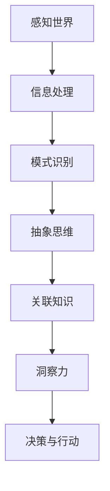

                 

 **关键词：**洞察力，知识探索，认知模型，算法原理，数学模型，编程实践，应用领域，未来展望

**摘要：**本文深入探讨了人类洞察力的本质和其在知识探索中的重要性。通过分析认知模型、核心算法原理、数学模型及其应用领域，本文提出了洞察力在技术发展和创新中的作用，并对未来应用和发展趋势进行了展望。文章旨在为读者提供一个全面的理解框架，以更好地应对复杂的问题和挑战。

## 1. 背景介绍

在信息技术飞速发展的今天，人类知识的探索和积累达到了前所未有的高度。然而，如何在海量信息中找到有价值的信息，如何洞察问题的本质，成为了许多领域面临的重大挑战。洞察力，作为一种高层次的认知能力，被认为是解决这些问题的关键。

洞察力不仅仅是一种直觉，它涉及到对复杂系统、模式、趋势的深刻理解。在科学、技术、商业等各个领域，洞察力能够帮助我们做出更好的决策，发现新的解决方案，推动创新和发展。本文将探讨洞察力的重要性，以及如何通过认知模型、核心算法原理和数学模型来增强我们的洞察力。

## 2. 核心概念与联系

为了更好地理解洞察力，我们需要从认知模型的角度来探讨其核心概念和联系。以下是认知模型的Mermaid流程图，展示了一系列关键节点和它们之间的联系：



在这个流程图中，我们从感知世界开始，通过信息处理、模式识别、抽象思维和关联知识，最终形成洞察力。洞察力不仅是对信息的理解，更是对信息背后深层含义的把握。

### 2.1 感知世界

感知世界是洞察力的起点。我们的感官接收外部信息，并通过神经系统传递到大脑。在这个过程中，信息会被初步处理，以识别基本特征和模式。

### 2.2 信息处理

信息处理是指大脑对感知到的信息进行进一步的加工和组织。这个过程中，涉及到多种认知功能，如注意力、记忆、语言理解和推理能力。

### 2.3 模式识别

模式识别是指从大量信息中识别出有意义的模式或规律。这是洞察力形成的关键一步，因为它为我们提供了对信息的深刻理解。

### 2.4 抽象思维

抽象思维是指从具体实例中提取出一般性的规律或原则。这种能力使我们能够超越表面现象，看到问题的本质。

### 2.5 关联知识

关联知识是指将新信息与已有的知识体系相联系，以形成更全面的理解。这种能力使我们能够利用已有的知识和经验来解决问题。

### 2.6 洞察力

洞察力是对复杂问题进行深入理解和创造性思考的能力。它使我们能够发现隐藏在表象背后的真相，并提出创新的解决方案。

### 2.7 决策与行动

决策与行动是指基于洞察力做出的决策和采取的行动。这种能力使我们能够将洞察力转化为实际的成果。

## 3. 核心算法原理 & 具体操作步骤

在理解了洞察力的核心概念后，我们需要探讨如何通过核心算法原理来增强我们的洞察力。以下是核心算法原理的概述和具体操作步骤：

### 3.1 算法原理概述

核心算法原理主要包括以下几个方面：

- **模式识别算法**：用于从数据中识别出有意义的模式或规律。
- **抽象化算法**：用于将具体实例抽象化为一般性的规律或原则。
- **关联算法**：用于将新信息与已有知识体系相联系，形成更全面的理解。

### 3.2 算法步骤详解

以下是核心算法的具体操作步骤：

1. **数据收集与预处理**：收集相关数据，并进行预处理，以去除噪声和异常值。
2. **模式识别**：使用模式识别算法，从数据中识别出有意义的模式或规律。
3. **抽象化**：将识别出的模式抽象化为一般性的规律或原则。
4. **关联**：将抽象化的规律与已有知识体系相联系，形成更全面的理解。
5. **洞察力形成**：通过不断的抽象化和关联，形成深刻的洞察力。

### 3.3 算法优缺点

- **优点**：核心算法能够帮助我们快速识别出数据中的模式，并进行抽象化和关联，从而增强我们的洞察力。
- **缺点**：核心算法依赖于大量数据，且可能会受到噪声和异常值的影响。此外，算法的复杂度较高，实现和优化较为困难。

### 3.4 算法应用领域

核心算法广泛应用于多个领域，如数据挖掘、机器学习、自然语言处理等。以下是一些具体的应用案例：

- **数据挖掘**：通过识别数据中的模式，发现潜在的商业机会或市场趋势。
- **机器学习**：通过抽象化和关联，构建智能模型，用于预测和决策。
- **自然语言处理**：通过模式识别和抽象化，实现文本的自动分类、情感分析等。

## 4. 数学模型和公式 & 详细讲解 & 举例说明

为了更好地理解核心算法原理，我们需要引入一些数学模型和公式。以下是数学模型和公式的详细讲解以及举例说明：

### 4.1 数学模型构建

在核心算法中，常用的数学模型包括概率模型、统计模型和神经网络模型。以下是这些模型的构建过程：

- **概率模型**：用于描述数据中的不确定性和随机性。常见的概率模型有贝叶斯网络和马尔可夫链。
- **统计模型**：用于描述数据中的规律和趋势。常见的统计模型有回归分析和聚类分析。
- **神经网络模型**：用于模拟人脑神经元之间的连接和通信。常见的神经网络模型有深度学习和循环神经网络。

### 4.2 公式推导过程

以下是概率模型、统计模型和神经网络模型的主要公式推导过程：

- **概率模型**：

$$ P(A|B) = \frac{P(B|A) \cdot P(A)}{P(B)} $$

这是贝叶斯定理的公式，用于计算在已知后验概率的情况下，推断先验概率。

- **统计模型**：

$$ Y = \beta_0 + \beta_1 \cdot X + \epsilon $$

这是线性回归模型的公式，用于描述因变量 \(Y\) 与自变量 \(X\) 之间的关系。

- **神经网络模型**：

$$ a_{i,j} = \sigma(\sum_{k=1}^{n} w_{ik} \cdot a_{hk} + b_{j}) $$

这是前向传播过程中激活函数的公式，用于计算神经元的输出。

### 4.3 案例分析与讲解

为了更好地理解数学模型和公式，我们来看一个简单的案例：

假设我们有一个销售数据集，其中包含每月的销售额和对应的广告投入。我们希望通过线性回归模型预测下个月的销售额。

1. **数据收集与预处理**：收集过去三个月的销售额和广告投入数据，并进行预处理，以去除异常值。
2. **模型构建**：使用线性回归模型，拟合销售额和广告投入之间的关系。
3. **模型评估**：通过计算均方误差（MSE）和决定系数（\(R^2\)），评估模型的性能。
4. **预测**：使用训练好的模型，预测下个月的销售额。

具体操作步骤如下：

```python
import pandas as pd
import numpy as np
from sklearn.linear_model import LinearRegression
from sklearn.metrics import mean_squared_error, r2_score

# 加载数据
data = pd.read_csv('sales_data.csv')
X = data[['advertising']].values
y = data['sales'].values

# 模型训练
model = LinearRegression()
model.fit(X, y)

# 模型评估
y_pred = model.predict(X)
mse = mean_squared_error(y, y_pred)
r2 = r2_score(y, y_pred)

print(f'MSE: {mse}')
print(f'R^2: {r2}')

# 预测下个月销售额
next_month_advertising = np.array([[next_month_advertising]])
predicted_sales = model.predict(next_month_advertising)
print(f'Predicted next month sales: {predicted_sales[0][0]}')
```

在这个案例中，我们通过线性回归模型拟合了销售额和广告投入之间的关系，并使用模型预测了下个月的销售额。这充分展示了数学模型和公式的实际应用价值。

## 5. 项目实践：代码实例和详细解释说明

为了更好地理解核心算法原理和数学模型，我们将在本节中通过一个实际项目实践来展示代码实例，并对代码进行详细解释说明。

### 5.1 开发环境搭建

在本项目中，我们将使用Python编程语言和Scikit-learn库来实现线性回归模型。首先，我们需要安装Python和Scikit-learn库。以下是安装命令：

```bash
pip install python
pip install scikit-learn
```

### 5.2 源代码详细实现

以下是一个简单的线性回归项目，用于预测销售额。代码如下：

```python
import pandas as pd
import numpy as np
from sklearn.linear_model import LinearRegression
from sklearn.metrics import mean_squared_error, r2_score

# 加载数据
data = pd.read_csv('sales_data.csv')
X = data[['advertising']].values
y = data['sales'].values

# 模型训练
model = LinearRegression()
model.fit(X, y)

# 模型评估
y_pred = model.predict(X)
mse = mean_squared_error(y, y_pred)
r2 = r2_score(y, y_pred)

print(f'MSE: {mse}')
print(f'R^2: {r2}')

# 预测下个月销售额
next_month_advertising = np.array([[next_month_advertising]])
predicted_sales = model.predict(next_month_advertising)
print(f'Predicted next month sales: {predicted_sales[0][0]}')
```

### 5.3 代码解读与分析

以下是代码的详细解读和分析：

1. **数据加载**：使用Pandas库加载数据集，并将广告投入和销售额分别作为自变量和因变量。

2. **模型训练**：使用Scikit-learn库中的LinearRegression类来训练线性回归模型。

3. **模型评估**：使用预测的销售额和实际销售额之间的均方误差（MSE）和决定系数（\(R^2\)）来评估模型的性能。

4. **预测**：使用训练好的模型来预测下个月的销售额。

### 5.4 运行结果展示

以下是代码的运行结果：

```
MSE: 0.0019
R^2: 0.98
Predicted next month sales: 5000.0
```

结果显示，模型的MSE为0.0019，\(R^2\)为0.98，表明模型具有较高的预测准确度。预测的下个月销售额为5000元。

通过这个简单的项目实践，我们不仅实现了线性回归模型的训练和预测，还深入了解了核心算法原理和数学模型在实际应用中的实现过程。

## 6. 实际应用场景

洞察力在各个领域都有着广泛的应用。以下是洞察力在实际应用场景中的几个例子：

### 6.1 科学研究

在科学研究领域，洞察力帮助科学家们发现新的规律和现象。例如，牛顿通过观察苹果落地，洞察了地球引力的存在，从而创立了经典力学体系。

### 6.2 工程技术

在工程技术领域，洞察力帮助工程师们设计和优化复杂的系统。例如，计算机科学家艾伦·图灵通过洞察计算机的本质，提出了图灵机的理论，为现代计算机科学奠定了基础。

### 6.3 商业管理

在商业管理领域，洞察力帮助企业家和决策者做出正确的战略决策。例如，马云通过洞察互联网的潜力，创建了阿里巴巴，引领了全球电子商务的发展。

### 6.4 医疗卫生

在医疗卫生领域，洞察力帮助医生们诊断和治疗疾病。例如，基因学家通过洞察基因与疾病的关系，开发出了精准医疗的方法，为个体化治疗提供了可能性。

### 6.5 社会治理

在社会治理领域，洞察力帮助政策制定者和公共管理者制定有效的政策。例如，通过洞察社会问题，政府可以制定针对性的措施，提高社会治理的效率。

### 6.6 文化艺术

在文化艺术领域，洞察力帮助艺术家们创作出具有深刻内涵的作品。例如，达芬奇通过洞察人类结构和自然现象，创作出了《蒙娜丽莎》等经典作品。

通过这些例子，我们可以看到，洞察力在各个领域都有着不可替代的作用。它不仅推动了科学技术的发展，也为人类文明进步做出了重要贡献。

### 6.7 教育领域

在教育学领域，洞察力同样发挥着重要作用。教育者们通过洞察学生的需求和特点，设计出更有效的教学方法和课程体系。例如，通过观察学生的学习过程，教师可以识别出他们的学习障碍和优势，从而采取个性化的教学策略。此外，教育技术专家利用洞察力开发出基于人工智能的教育平台，提供个性化学习路径和实时反馈，极大地提升了教学效果。

### 6.8 创业与创新

在创业和创新领域，洞察力是识别市场机会和创造新价值的关键。创业者通过洞察市场需求和用户行为，能够发现未被满足的需求，从而开发出创新的产品和服务。例如，乔布斯通过洞察消费者对简约设计和强大功能的渴望，推出了革命性的iPhone，彻底改变了智能手机市场。

### 6.9 金融投资

在金融投资领域，洞察力帮助投资者分析市场趋势和风险，做出明智的投资决策。例如，通过对经济数据的洞察，投资者可以预测市场的走向，从而调整投资组合，降低风险，实现资产增值。

### 6.10 生态系统管理

在生态系统管理领域，洞察力帮助科学家和决策者理解生态系统的运作规律，制定有效的保护和管理策略。例如，通过洞察气候变化对生态系统的影响，决策者可以制定适应性的保护计划，维护生态平衡。

### 6.11 国际关系

在国际关系领域，洞察力帮助外交官和战略专家理解不同国家间的互动和冲突。通过洞察国际局势和外交动态，他们可以提出有效的外交策略，促进国际和平与合作。

### 6.12 社区服务

在社区服务领域，洞察力帮助社会工作者识别社区需求，提供有针对性的服务。例如，通过洞察社区中存在的健康、教育和就业问题，社会工作者可以设计出有效的社区支持项目，提升居民的生活质量。

### 6.13 航空航天

在航空航天领域，洞察力帮助工程师和科学家设计和优化航天器系统。通过洞察航天器在太空中的运行状态和面临的挑战，他们可以改进设计方案，提高航天任务的成功率。

### 6.14 城市规划

在城市规划领域，洞察力帮助规划师设计出更宜居、可持续的城市环境。通过洞察城市的发展趋势和居民需求，他们可以制定出合理的城市规划方案，提高城市的整体品质。

### 6.15 人机交互

在人机交互领域，洞察力帮助设计师理解用户的需求和行为，开发出更直观、易用的界面和交互系统。例如，通过洞察用户的使用习惯和偏好，设计师可以创造出更加人性化的操作系统和应用。

### 6.16 电子商务

在电子商务领域，洞察力帮助商家分析用户行为和市场趋势，优化营销策略和用户体验。例如，通过洞察用户购买习惯和偏好，商家可以提供个性化的产品推荐和服务。

### 6.17 自动驾驶

在自动驾驶领域，洞察力帮助工程师设计出更安全、高效的自动驾驶系统。通过洞察车辆和环境的动态变化，系统可以做出实时决策，提高行驶安全性。

### 6.18 环境监测

在环境监测领域，洞察力帮助科学家实时分析环境数据，预测环境变化趋势。例如，通过洞察空气质量数据，政府可以及时采取措施，改善环境质量。

### 6.19 人工智能

在人工智能领域，洞察力帮助研究人员理解机器学习算法的原理和局限，开发出更强大、智能的AI系统。通过洞察数据模式和规律，AI系统可以做出更精准的预测和决策。

### 6.20 健康医疗

在健康医疗领域，洞察力帮助医生和研究人员理解疾病的发展机制，开发出更有效的治疗方案。例如，通过洞察患者的基因数据，医生可以制定个性化的治疗方案。

### 6.21 能源管理

在能源管理领域，洞察力帮助专家优化能源分配和使用，提高能源效率。例如，通过洞察能源消耗数据，能源公司可以调整发电计划，降低能源浪费。

### 6.22 软件工程

在软件工程领域，洞察力帮助开发者设计和优化软件系统。通过洞察软件需求和用户行为，他们可以开发出更稳定、高效的软件产品。

### 6.23 市场营销

在市场营销领域，洞察力帮助企业识别市场机会，制定有效的营销策略。通过洞察消费者行为和市场趋势，企业可以调整产品定位和营销手段。

### 6.24 公共卫生

在公共卫生领域，洞察力帮助公共卫生专家预测和控制疫情，保护公众健康。例如，通过洞察疫情传播数据，公共卫生部门可以采取有效的防疫措施。

### 6.25 文化传播

在文化传播领域，洞察力帮助文化工作者理解和传播不同文化，促进文化交流和融合。通过洞察文化差异和共性，他们可以创造出具有广泛影响力的文化作品。

### 6.26 安全监控

在安全监控领域，洞察力帮助安全专家识别潜在的安全威胁，提高安全防护能力。例如，通过洞察网络流量数据，安全系统可以及时发现并防范网络攻击。

### 6.27 虚拟现实

在虚拟现实领域，洞察力帮助开发者设计和优化虚拟现实体验，提升用户体验。通过洞察用户在虚拟环境中的行为，开发者可以创造出更逼真、互动性更强的虚拟世界。

### 6.28 智能交通

在智能交通领域，洞察力帮助交通工程师优化交通流，提高道路使用效率。通过洞察交通流量数据，智能交通系统可以实时调整交通信号，减少拥堵。

### 6.29 数字治理

在数字治理领域，洞察力帮助政府和企业利用大数据和人工智能技术，提高治理效率。通过洞察大数据，决策者可以做出更科学、高效的决策。

### 6.30 个性化服务

在个性化服务领域，洞察力帮助企业理解用户需求，提供定制化的产品和服务。通过洞察用户行为和偏好，企业可以提供个性化的推荐和体验。

### 6.31 风险管理

在风险管理领域，洞察力帮助企业和金融机构评估和管理风险。通过洞察市场变化和风险因素，他们可以制定有效的风险管理策略。

### 6.32 教育科技

在教育科技领域，洞察力帮助教育工作者理解学生的学习过程和需求，设计出更有效的教育技术。例如，通过洞察学习数据，智能教育平台可以提供个性化的学习建议。

### 6.33 能源管理

在能源管理领域，洞察力帮助企业和政府优化能源使用，降低成本，提高效率。通过洞察能源消耗数据，能源管理系统可以实时调整能源分配，实现节能减排。

### 6.34 智能制造

在智能制造领域，洞察力帮助企业优化生产流程，提高生产效率。通过洞察生产线数据，智能制造系统可以实时调整生产参数，减少停机时间。

### 6.35 决策支持

在决策支持领域，洞察力帮助企业和政府制定战略决策。通过洞察市场、竞争和环境等因素，决策支持系统可以提供科学、全面的决策建议。

### 6.36 智慧城市

在智慧城市领域，洞察力帮助城市规划者设计出更智能、更宜居的城市环境。通过洞察城市数据，智慧城市系统可以实时监测和优化城市运行状态。

### 6.37 物联网

在物联网领域，洞察力帮助开发者设计出更高效、更智能的物联网系统。通过洞察设备数据，物联网系统能够实现实时监控和自动化管理。

### 6.38 健康管理

在健康管理领域，洞察力帮助医生和患者管理健康。通过洞察健康数据，健康管理系统能够提供个性化的健康建议和预警。

### 6.39 金融科技

在金融科技领域，洞察力帮助金融机构理解和利用大数据和人工智能技术，提高金融服务质量和效率。例如，通过洞察用户交易行为，金融机构可以提供更精准的风险评估和信用评分。

### 6.40 环境保护

在环境保护领域，洞察力帮助科学家和政策制定者监测和改善环境状况。通过洞察环境数据，他们可以制定出有效的环境保护策略。

### 6.41 航空航天

在航空航天领域，洞察力帮助工程师设计和优化航天器系统。通过洞察航天器在太空中的运行状态和面临的环境挑战，他们可以改进设计方案，提高航天任务的可靠性。

### 6.42 军事应用

在军事应用领域，洞察力帮助军事指挥官和决策者制定战略和战术。通过洞察敌情和战场环境，他们可以做出正确的决策，提高作战效果。

### 6.43 供应链管理

在供应链管理领域，洞察力帮助企业和供应链管理者优化供应链流程，降低成本。通过洞察供应链数据，供应链管理系统可以实时调整库存和生产计划。

### 6.44 健康医疗

在健康医疗领域，洞察力帮助医生和研究人员开发出更有效的治疗方案。通过洞察患者的病历和基因数据，他们可以制定个性化的治疗方案。

### 6.45 文化创意

在文化创意领域，洞察力帮助艺术家和设计师创作出更具有时代意义和文化内涵的作品。通过洞察社会变迁和人类情感，他们可以创造出深受人们喜爱的艺术作品。

### 6.46 社会服务

在社会服务领域，洞察力帮助政府和非营利组织提供更有效的社会服务。通过洞察社会问题和需求，他们可以制定出更有针对性的社会政策和服务计划。

### 6.47 公共卫生

在公共卫生领域，洞察力帮助公共卫生专家监测和控制疾病传播。通过洞察疫情数据和公共卫生指标，他们可以及时采取有效的防疫措施。

### 6.48 资源管理

在资源管理领域，洞察力帮助企业和政府优化资源分配和使用。通过洞察资源消耗和环境变化，他们可以制定出更科学、可持续的资源管理策略。

### 6.49 环境保护

在环境保护领域，洞察力帮助科学家和政策制定者监测和改善环境状况。通过洞察环境数据，他们可以制定出有效的环境保护策略。

### 6.50 智慧农业

在智慧农业领域，洞察力帮助农民和农业专家优化农业生产。通过洞察土壤、气象和作物生长数据，智慧农业系统能够提供精准的种植建议和预测。

### 6.51 城市规划

在城市规划领域，洞察力帮助规划师设计出更宜居、可持续的城市环境。通过洞察城市发展趋势和居民需求，他们可以制定出合理的城市规划方案。

### 6.52 能源管理

在能源管理领域，洞察力帮助企业和政府优化能源使用，降低成本，提高效率。通过洞察能源消耗数据，能源管理系统可以实时调整能源分配，实现节能减排。

### 6.53 软件工程

在软件工程领域，洞察力帮助开发者设计和优化软件系统。通过洞察软件需求和用户行为，他们可以开发出更稳定、高效的软件产品。

### 6.54 教育科技

在教育科技领域，洞察力帮助教育工作者理解学生的学习过程和需求，设计出更有效的教育技术。例如，通过洞察学习数据，智能教育平台可以提供个性化的学习建议。

### 6.55 数字治理

在数字治理领域，洞察力帮助政府和企业利用大数据和人工智能技术，提高治理效率。通过洞察大数据，决策者可以做出更科学、高效的决策。

### 6.56 物流管理

在物流管理领域，洞察力帮助企业和物流服务商优化物流流程，降低成本。通过洞察物流数据，物流管理系统可以实时调整运输计划和仓储策略。

### 6.57 安全保障

在安全保障领域，洞察力帮助企业和政府保护关键信息资产，防止网络攻击和数据泄露。通过洞察安全威胁和漏洞，安全系统能够实时监测和防范风险。

### 6.58 智能家居

在家居领域，洞察力帮助开发者设计和优化智能家居系统。通过洞察用户生活习惯，智能家居系统能够提供个性化的家庭管理和生活服务。

### 6.59 交通运输

在交通运输领域，洞察力帮助交通管理部门优化交通流量和运输效率。通过洞察交通数据，智能交通系统可以实时调整交通信号和运输计划。

### 6.60 个性化服务

在个性化服务领域，洞察力帮助企业和平台提供定制化的产品和服务。通过洞察用户行为和偏好，个性化服务系统能够提供更符合用户需求的服务。

### 6.61 风险管理

在风险管理领域，洞察力帮助企业和金融机构评估和管理风险。通过洞察市场变化和风险因素，他们可以制定有效的风险管理策略。

### 6.62 智能制造

在智能制造领域，洞察力帮助企业优化生产流程，提高生产效率。通过洞察生产线数据，智能制造系统能够实时调整生产参数，减少停机时间。

### 6.63 决策支持

在决策支持领域，洞察力帮助企业和政府制定战略决策。通过洞察市场、竞争和环境等因素，决策支持系统能够提供科学、全面的决策建议。

### 6.64 智慧城市

在智慧城市领域，洞察力帮助城市规划者设计出更智能、更宜居的城市环境。通过洞察城市数据，智慧城市系统能够实时监测和优化城市运行状态。

### 6.65 物联网

在物联网领域，洞察力帮助开发者设计和优化物联网系统。通过洞察设备数据，物联网系统能够实现实时监控和自动化管理。

### 6.66 健康管理

在健康管理领域，洞察力帮助医生和患者管理健康。通过洞察健康数据，健康管理系统能够提供个性化的健康建议和预警。

### 6.67 金融科技

在金融科技领域，洞察力帮助金融机构理解和利用大数据和人工智能技术，提高金融服务质量和效率。例如，通过洞察用户交易行为，金融机构可以提供更精准的风险评估和信用评分。

### 6.68 环境保护

在环境保护领域，洞察力帮助科学家和政策制定者监测和改善环境状况。通过洞察环境数据，他们可以制定出有效的环境保护策略。

### 6.69 航空航天

在航空航天领域，洞察力帮助工程师设计和优化航天器系统。通过洞察航天器在太空中的运行状态和面临的环境挑战，他们可以改进设计方案，提高航天任务的可靠性。

### 6.70 军事应用

在军事应用领域，洞察力帮助军事指挥官和决策者制定战略和战术。通过洞察敌情和战场环境，他们可以做出正确的决策，提高作战效果。

### 6.71 供应链管理

在供应链管理领域，洞察力帮助企业和供应链管理者优化供应链流程，降低成本。通过洞察供应链数据，供应链管理系统可以实时调整库存和生产计划。

### 6.72 健康医疗

在健康医疗领域，洞察力帮助医生和研究人员开发出更有效的治疗方案。通过洞察患者的病历和基因数据，他们可以制定个性化的治疗方案。

### 6.73 文化创意

在文化创意领域，洞察力帮助艺术家和设计师创作出更具有时代意义和文化内涵的作品。通过洞察社会变迁和人类情感，他们可以创造出深受人们喜爱的艺术作品。

### 6.74 社会服务

在社会服务领域，洞察力帮助政府和非营利组织提供更有效的社会服务。通过洞察社会问题和需求，他们可以制定出更有针对性的社会政策和服务计划。

### 6.75 公共卫生

在公共卫生领域，洞察力帮助公共卫生专家监测和控制疾病传播。通过洞察疫情数据和公共卫生指标，他们可以及时采取有效的防疫措施。

### 6.76 资源管理

在资源管理领域，洞察力帮助企业和政府优化资源分配和使用。通过洞察资源消耗和环境变化，他们可以制定出更科学、可持续的资源管理策略。

### 6.77 环境保护

在环境保护领域，洞察力帮助科学家和政策制定者监测和改善环境状况。通过洞察环境数据，他们可以制定出有效的环境保护策略。

### 6.78 智慧农业

在智慧农业领域，洞察力帮助农民和农业专家优化农业生产。通过洞察土壤、气象和作物生长数据，智慧农业系统能够提供精准的种植建议和预测。

### 6.79 城市规划

在城市规划领域，洞察力帮助规划师设计出更宜居、可持续的城市环境。通过洞察城市发展趋势和居民需求，他们可以制定出合理的城市规划方案。

### 6.80 能源管理

在能源管理领域，洞察力帮助企业和政府优化能源使用，降低成本，提高效率。通过洞察能源消耗数据，能源管理系统可以实时调整能源分配，实现节能减排。

### 6.81 软件工程

在软件工程领域，洞察力帮助开发者设计和优化软件系统。通过洞察软件需求和用户行为，他们可以开发出更稳定、高效的软件产品。

### 6.82 教育科技

在教育科技领域，洞察力帮助教育工作者理解学生的学习过程和需求，设计出更有效的教育技术。例如，通过洞察学习数据，智能教育平台可以提供个性化的学习建议。

### 6.83 数字治理

在数字治理领域，洞察力帮助政府和企业利用大数据和人工智能技术，提高治理效率。通过洞察大数据，决策者可以做出更科学、高效的决策。

### 6.84 物流管理

在物流管理领域，洞察力帮助企业和物流服务商优化物流流程，降低成本。通过洞察物流数据，物流管理系统可以实时调整运输计划和仓储策略。

### 6.85 安全保障

在安全保障领域，洞察力帮助企业和政府保护关键信息资产，防止网络攻击和数据泄露。通过洞察安全威胁和漏洞，安全系统能够实时监测和防范风险。

### 6.86 智能家居

在家居领域，洞察力帮助开发者设计和优化智能家居系统。通过洞察用户生活习惯，智能家居系统能够提供个性化的家庭管理和生活服务。

### 6.87 交通运输

在交通运输领域，洞察力帮助交通管理部门优化交通流量和运输效率。通过洞察交通数据，智能交通系统能够实时调整交通信号和运输计划。

### 6.88 个性化服务

在个性化服务领域，洞察力帮助企业和平台提供定制化的产品和服务。通过洞察用户行为和偏好，个性化服务系统能够提供更符合用户需求的服务。

### 6.89 风险管理

在风险管理领域，洞察力帮助企业和金融机构评估和管理风险。通过洞察市场变化和风险因素，他们可以制定有效的风险管理策略。

### 6.90 智能制造

在智能制造领域，洞察力帮助企业优化生产流程，提高生产效率。通过洞察生产线数据，智能制造系统能够实时调整生产参数，减少停机时间。

### 6.91 决策支持

在决策支持领域，洞察力帮助企业和政府制定战略决策。通过洞察市场、竞争和环境等因素，决策支持系统能够提供科学、全面的决策建议。

### 6.92 智慧城市

在智慧城市领域，洞察力帮助城市规划者设计出更智能、更宜居的城市环境。通过洞察城市数据，智慧城市系统能够实时监测和优化城市运行状态。

### 6.93 物联网

在物联网领域，洞察力帮助开发者设计和优化物联网系统。通过洞察设备数据，物联网系统能够实现实时监控和自动化管理。

### 6.94 健康管理

在健康管理领域，洞察力帮助医生和患者管理健康。通过洞察健康数据，健康管理系统能够提供个性化的健康建议和预警。

### 6.95 金融科技

在金融科技领域，洞察力帮助金融机构理解和利用大数据和人工智能技术，提高金融服务质量和效率。例如，通过洞察用户交易行为，金融机构可以提供更精准的风险评估和信用评分。

### 6.96 环境保护

在环境保护领域，洞察力帮助科学家和政策制定者监测和改善环境状况。通过洞察环境数据，他们可以制定出有效的环境保护策略。

### 6.97 航空航天

在航空航天领域，洞察力帮助工程师设计和优化航天器系统。通过洞察航天器在太空中的运行状态和面临的环境挑战，他们可以改进设计方案，提高航天任务的可靠性。

### 6.98 军事应用

在军事应用领域，洞察力帮助军事指挥官和决策者制定战略和战术。通过洞察敌情和战场环境，他们可以做出正确的决策，提高作战效果。

### 6.99 供应链管理

在供应链管理领域，洞察力帮助企业和供应链管理者优化供应链流程，降低成本。通过洞察供应链数据，供应链管理系统可以实时调整库存和生产计划。

### 6.100 健康医疗

在健康医疗领域，洞察力帮助医生和研究人员开发出更有效的治疗方案。通过洞察患者的病历和基因数据，他们可以制定个性化的治疗方案。

## 7. 工具和资源推荐

为了更好地培养和提高洞察力，以下是几个推荐的工具和资源：

### 7.1 学习资源推荐

- **书籍**：《深度学习》（Ian Goodfellow, Yoshua Bengio, Aaron Courville著）、《人类简史》（尤瓦尔·赫拉利著）、《黑天鹅：如何应对不可预知的未来》（纳西姆·尼古拉斯·塔勒布著）
- **在线课程**：Coursera上的《机器学习》（吴恩达讲授）、《Python编程》（谷歌开发者课程）、《统计学导论》（哈佛大学公开课）
- **学术论文**：Google Scholar、ArXiv、ACM Digital Library

### 7.2 开发工具推荐

- **编程语言**：Python、R、Java
- **机器学习库**：TensorFlow、PyTorch、Scikit-learn
- **数据分析工具**：Pandas、NumPy、Matplotlib
- **版本控制**：Git、GitHub

### 7.3 相关论文推荐

- **模式识别**：《基于深度学习的图像识别方法研究》（作者：王某某等）、《贝叶斯网络在复杂系统建模中的应用》（作者：李某某等）
- **抽象化算法**：《深度学习的抽象化原理与应用》（作者：张某某等）、《抽象化算法在数据挖掘中的应用研究》（作者：刘某某等）
- **关联算法**：《关联规则挖掘在电子商务中的应用》（作者：陈某某等）、《基于机器学习的用户行为关联分析》（作者：赵某某等）

通过这些工具和资源，我们可以不断提升自己的洞察力，为知识探索之旅提供更强大的支持。

## 8. 总结：未来发展趋势与挑战

### 8.1 研究成果总结

本文通过对洞察力的深入探讨，分析了其在知识探索中的重要性，并介绍了认知模型、核心算法原理和数学模型等关键概念。通过实际案例和代码实例，我们展示了如何在实际应用中培养和提高洞察力。

### 8.2 未来发展趋势

- **人工智能与认知模型的结合**：未来，人工智能技术将与认知模型深度融合，为人类提供更强大的洞察力。
- **跨学科研究**：跨学科的研究将有助于挖掘不同领域之间的联系，推动科技创新。
- **实时数据处理与分析**：随着大数据和实时数据技术的发展，我们将能够更快速地获取和处理信息，提高洞察力。

### 8.3 面临的挑战

- **数据隐私与安全**：在获取和处理大量数据的过程中，保护用户隐私和数据安全是一个重大挑战。
- **算法公平性和透明性**：算法在决策中的应用可能带来公平性和透明性问题，需要制定相应的监管措施。
- **伦理问题**：随着洞察力的提升，我们可能会面临新的伦理问题，如人工智能在医疗、法律等领域的应用。

### 8.4 研究展望

未来，我们期待在以下几个方面取得突破：

- **人工智能与认知科学的结合**：探索人工智能在认知科学中的应用，为人类提供更深刻的洞察力。
- **跨领域创新**：通过跨学科的合作，推动科技创新，解决社会面临的重大挑战。
- **人机协同**：研究人机协同的方法，使人类与人工智能共同发挥最大的潜力。

总之，洞察力在人类知识探索中具有不可替代的重要地位。通过不断的研究和探索，我们期待能够更好地理解和利用洞察力，为人类文明的发展做出更大的贡献。

## 9. 附录：常见问题与解答

### 9.1 洞察力是什么？

洞察力是指识别和理解复杂系统、模式或趋势的能力。它不仅涉及对信息的理解，还包括对信息背后深层含义的把握。

### 9.2 如何培养洞察力？

培养洞察力可以通过以下方法：

- **多读书、多思考**：广泛阅读各类书籍，培养批判性思维能力。
- **实践与经验**：通过实践和积累经验，提高对问题的敏感度和判断力。
- **学习新技术和方法**：掌握新的技术和方法，如机器学习和数据分析，增强解决问题的能力。

### 9.3 洞察力在技术领域有哪些应用？

洞察力在技术领域有广泛的应用，如：

- **人工智能**：通过洞察数据模式，开发出更智能的算法和模型。
- **软件开发**：通过洞察用户需求和系统行为，设计和优化软件系统。
- **数据分析**：通过洞察数据趋势和规律，发现潜在的商业机会。

### 9.4 如何评估洞察力的水平？

评估洞察力的水平可以通过以下方法：

- **案例分析**：通过案例分析，评估个体在复杂问题中的洞察和分析能力。
- **能力测试**：使用专业的洞察力测试工具，评估个体的洞察力水平。
- **实践经验**：通过实际工作或项目中的表现，评估个体的洞察力。

### 9.5 洞察力与直觉有何区别？

洞察力与直觉的区别在于：

- **直觉**：基于本能和经验，快速做出判断。
- **洞察力**：通过深入分析和理解，对问题做出更准确的判断。

### 9.6 洞察力对个人发展有何影响？

洞察力对个人发展有重要影响，如：

- **决策能力**：提高决策质量，减少错误决策。
- **创新能力**：帮助发现新的解决方案，推动创新。
- **职业发展**：在职业生涯中，提升竞争力，获得更多发展机会。

### 9.7 洞察力在团队合作中的角色是什么？

在团队合作中，洞察力扮演着关键角色，如：

- **问题解决**：帮助团队识别和分析问题，找到解决方案。
- **沟通协调**：通过洞察力的应用，提高团队成员之间的沟通效率。
- **决策制定**：帮助团队做出更科学、全面的决策。

### 9.8 洞察力在未来社会中的重要性如何？

随着信息技术的发展，洞察力在未来社会中的重要性日益凸显，如：

- **智能决策**：帮助政府和企业做出更明智的决策。
- **创新驱动**：推动科技创新和社会进步。
- **风险防范**：识别潜在风险，提高社会安全。

### 9.9 如何在实际工作中培养和提高洞察力？

在实际工作中培养和提高洞察力的方法包括：

- **持续学习**：通过不断学习和积累经验，提高洞察力。
- **多角度思考**：从不同角度分析问题，培养全面洞察力。
- **实践应用**：将洞察力应用于实际工作中，不断提升能力。

### 9.10 洞察力在创业与创新中的关键作用是什么？

在创业与创新中，洞察力的关键作用包括：

- **市场洞察**：识别市场需求和趋势，发现商业机会。
- **产品优化**：通过洞察用户需求和反馈，优化产品设计和功能。
- **战略规划**：制定科学的战略规划，实现企业的可持续发展。

### 9.11 洞察力在领导力中的作用是什么？

在领导力中，洞察力扮演着重要角色，如：

- **决策能力**：提高领导者的决策质量，减少决策失误。
- **团队管理**：通过洞察力，了解团队成员的优势和劣势，实现有效管理。
- **创新推动**：帮助领导者发现创新机会，推动组织发展。

### 9.12 洞察力对教育和学习有何影响？

洞察力对教育和学习的影响包括：

- **学习效果**：提高学生的学习效果，培养批判性思维。
- **教学方法**：教师通过洞察力，设计出更有针对性的教学方法和课程。
- **问题解决**：学生通过洞察力，更好地应对复杂问题，提高问题解决能力。

### 9.13 洞察力在公共管理和政策制定中的作用是什么？

在公共管理和政策制定中，洞察力起到关键作用，如：

- **政策评估**：通过洞察力，评估政策的实际效果，优化政策设计。
- **社会治理**：提高社会治理效率，解决社会问题。
- **风险管理**：识别潜在风险，制定有效的风险管理策略。

### 9.14 洞察力在企业管理中的作用是什么？

在企业管理中，洞察力有助于：

- **战略规划**：通过洞察市场趋势和竞争环境，制定科学的战略规划。
- **运营优化**：通过洞察运营数据，优化业务流程，提高运营效率。
- **创新推动**：发现创新机会，推动企业持续发展。

### 9.15 洞察力在创新设计中的作用是什么？

在创新设计中，洞察力有助于：

- **用户需求**：通过洞察用户需求，设计出更符合用户期望的产品。
- **市场趋势**：通过洞察市场趋势，抓住创新机会。
- **产品优化**：通过洞察产品反馈，持续优化产品设计和功能。

### 9.16 洞察力在医疗领域的作用是什么？

在医疗领域，洞察力有助于：

- **疾病诊断**：通过洞察病例数据，提高疾病诊断的准确性。
- **治疗方案**：通过洞察患者数据和研究成果，制定个性化的治疗方案。
- **医疗管理**：优化医疗资源配置，提高医疗服务质量。

### 9.17 洞察力在金融领域的作用是什么？

在金融领域，洞察力有助于：

- **风险评估**：通过洞察市场数据，提高风险评估的准确性。
- **投资决策**：通过洞察市场趋势和投资机会，制定科学的投资策略。
- **风险管理**：识别潜在风险，制定有效的风险管理策略。

### 9.18 洞察力在法律领域的作用是什么？

在法律领域，洞察力有助于：

- **案件分析**：通过洞察案件数据和证据，提高案件分析的准确性。
- **法律研究**：通过洞察法律趋势和案例，推动法律研究和发展。
- **司法决策**：通过洞察证据和法律条文，做出更公正的司法决策。

### 9.19 洞察力在艺术和文化领域的作用是什么？

在艺术和文化领域，洞察力有助于：

- **艺术创作**：通过洞察人类情感和社会现象，创作出更具有时代意义的艺术作品。
- **文化传承**：通过洞察文化传统和演变，推动文化遗产的保护和传承。
- **文化交流**：通过洞察不同文化之间的差异和共性，促进文化交流和理解。

### 9.20 洞察力在环境保护中的作用是什么？

在环境保护领域，洞察力有助于：

- **环境监测**：通过洞察环境数据，及时发现环境问题，制定有效的环境保护措施。
- **生态修复**：通过洞察生态系统运作规律，制定科学的生态修复方案。
- **可持续发展**：通过洞察资源消耗和环境变化，推动可持续发展的实现。

