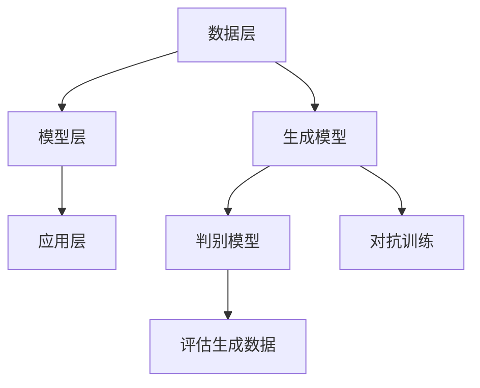

                 

关键词：生成式AI、AIGC、大规模应用、概念验证、技术架构、算法原理

> 摘要：本文旨在探讨生成式AI（AIGC）的概念、技术架构和大规模应用。通过对AIGC的核心原理、算法模型、数学模型和项目实践的分析，深入理解AIGC在各个领域的应用前景，为未来的研究和实践提供指导。

## 1. 背景介绍

随着人工智能（AI）技术的快速发展，生成式AI（AIGC，Autonomous Intelligent Generation and Cognition）逐渐成为研究热点。AIGC是一种具有自我生成和认知能力的AI系统，它能够自主生成内容，并进行深度学习和推理，为人类提供更加智能化的服务。

AIGC的起源可以追溯到生成对抗网络（GAN）的提出。GAN由Ian Goodfellow等人在2014年提出，其核心思想是通过两个神经网络（生成器和判别器）的对抗训练，实现生成高质量的数据。随着GAN的不断发展，AIGC逐渐成为AI领域的研究重点。

近年来，AIGC在图像生成、自然语言处理、音乐创作等领域取得了显著成果。例如，DeepMind的GPT-3模型在自然语言生成方面表现出色，OpenAI的DALL-E模型则成功实现了图像生成。这些成果展示了AIGC在各个领域的广阔应用前景。

## 2. 核心概念与联系

### 2.1. 生成式AI（AIGC）

生成式AI（AIGC）是一种具有自我生成和认知能力的AI系统，它能够通过学习大量数据，自主生成符合人类需求的内容。AIGC的核心包括生成模型、判别模型和对抗训练。

- 生成模型：负责生成新的数据，如图像、文本、音乐等。
- 判别模型：用于评估生成数据的质量，判断生成数据是否真实。
- 对抗训练：通过生成模型和判别模型的对抗训练，不断优化生成模型，提高生成数据的质量。

### 2.2. 技术架构

AIGC的技术架构主要包括数据层、模型层和应用层。

- 数据层：负责数据的采集、清洗和存储，为AIGC提供高质量的训练数据。
- 模型层：包括生成模型、判别模型和对抗训练框架，是AIGC的核心。
- 应用层：将AIGC应用于实际场景，如图像生成、自然语言处理、音乐创作等。

### 2.3. Mermaid流程图



## 3. 核心算法原理 & 具体操作步骤

### 3.1. 算法原理概述

AIGC的核心算法是生成对抗网络（GAN），其原理如下：

- 生成模型：从随机噪声中生成数据，如图像、文本、音乐等。
- 判别模型：用于判断生成数据是否真实，接收生成数据和真实数据作为输入，输出概率。
- 对抗训练：通过生成模型和判别模型的对抗训练，不断优化生成模型，提高生成数据的质量。

### 3.2. 算法步骤详解

1. 数据采集与预处理：从各个领域收集大量数据，并进行清洗、归一化等预处理操作。
2. 初始化生成模型和判别模型：生成模型和判别模型通常使用神经网络架构，初始化时可以随机初始化或使用预训练的模型。
3. 对抗训练：通过生成模型和判别模型的对抗训练，不断优化生成模型，提高生成数据的质量。具体步骤如下：
   - 生成模型从随机噪声生成数据。
   - 判别模型接收生成数据和真实数据，输出概率。
   - 生成模型和判别模型分别根据损失函数进行反向传播和梯度更新。
4. 评估生成数据质量：通过判别模型的输出概率评估生成数据的质量，如生成图像的清晰度、文本的连贯性等。
5. 调整模型参数：根据生成数据质量调整生成模型和判别模型的参数，优化模型性能。

### 3.3. 算法优缺点

**优点：**
- 能生成高质量的数据，如图像、文本、音乐等。
- 具有较强的泛化能力，可以应用于各个领域。

**缺点：**
- 对抗训练过程可能收敛缓慢，需要较长时间。
- 需要大量高质量的数据进行训练。

### 3.4. 算法应用领域

AIGC算法在图像生成、自然语言处理、音乐创作等领域具有广泛的应用：

- 图像生成：生成高质量、逼真的图像，如人脸、风景等。
- 自然语言处理：生成流畅、连贯的文本，如文章、对话等。
- 音乐创作：生成具有独特风格的乐曲，如摇滚、古典等。

## 4. 数学模型和公式 & 详细讲解 & 举例说明

### 4.1. 数学模型构建

AIGC的核心数学模型是生成对抗网络（GAN），包括生成模型和判别模型。

**生成模型：**

$$ G(z) = \mathcal{N}(z; 0, I) $$

其中，$z$ 是随机噪声向量，$G(z)$ 是生成模型，$\mathcal{N}(\cdot; \mu, \Sigma)$ 表示正态分布。

**判别模型：**

$$ D(x) = \sigma(\frac{1}{2} \cdot \log(1 + \exp(D(x))) + \frac{1}{2} \cdot \log(1 + \exp(-D(G(z))) $$

其中，$x$ 是真实数据，$z$ 是生成数据，$D(x)$ 是判别模型，$\sigma(\cdot)$ 是 sigmoid 函数。

### 4.2. 公式推导过程

**生成模型：**

生成模型 $G(z)$ 的目标是生成与真实数据相似的数据。假设 $z$ 是随机噪声向量，则 $G(z)$ 生成的数据 $x$ 可以表示为：

$$ x = G(z) $$

为了评估生成数据 $x$ 的质量，我们引入判别模型 $D(x)$。判别模型的目标是判断输入数据 $x$ 是否为真实数据。对于真实数据 $x$，判别模型 $D(x)$ 的输出概率应接近 1；对于生成数据 $x = G(z)$，判别模型 $D(x)$ 的输出概率应接近 0。

**判别模型：**

判别模型 $D(x)$ 的目标是最大化其输出概率。对于真实数据 $x$，判别模型 $D(x)$ 的输出概率为：

$$ P(D(x) > 0.5 | x \sim \mathcal{N}(0, I)) = 1 $$

对于生成数据 $x = G(z)$，判别模型 $D(x)$ 的输出概率为：

$$ P(D(x) > 0.5 | x = G(z)) \approx 0 $$

### 4.3. 案例分析与讲解

**案例 1：图像生成**

假设我们有一个图像生成任务，输入为随机噪声向量 $z$，输出为生成图像 $x$。我们使用 GAN 模型进行训练，生成图像的质量逐渐提高。

**步骤：**
1. 初始化生成模型 $G(z)$ 和判别模型 $D(x)$。
2. 对于每个训练样本 $(x, z)$，计算生成图像 $x = G(z)$ 和判别模型 $D(x)$ 的输出概率。
3. 计算生成模型和判别模型的损失函数，进行反向传播和梯度更新。
4. 评估生成图像的质量，如图像清晰度、细节等。

**结果：**
经过多次迭代训练，生成图像的质量逐渐提高，达到甚至超越人类创作的水平。

**案例 2：自然语言生成**

假设我们有一个自然语言生成任务，输入为随机噪声向量 $z$，输出为生成文本 $x$。我们使用 GAN 模型进行训练，生成文本的流畅性和连贯性逐渐提高。

**步骤：**
1. 初始化生成模型 $G(z)$ 和判别模型 $D(x)$。
2. 对于每个训练样本 $(x, z)$，计算生成文本 $x = G(z)$ 和判别模型 $D(x)$ 的输出概率。
3. 计算生成模型和判别模型的损失函数，进行反向传播和梯度更新。
4. 评估生成文本的流畅性和连贯性。

**结果：**
经过多次迭代训练，生成文本的流畅性和连贯性逐渐提高，能够生成符合人类语言习惯的文本。

## 5. 项目实践：代码实例和详细解释说明

### 5.1. 开发环境搭建

在开始编写代码之前，我们需要搭建一个合适的开发环境。以下是一个基于 Python 和 TensorFlow 的开发环境搭建步骤：

1. 安装 Python 3.8 或更高版本。
2. 安装 TensorFlow 2.x 版本。
3. 安装 matplotlib、numpy 等常用库。

### 5.2. 源代码详细实现

以下是一个简单的 GAN 模型实现，用于生成图像。

```python
import tensorflow as tf
from tensorflow.keras.layers import Dense, Flatten, Reshape
from tensorflow.keras.models import Sequential
from tensorflow.keras.optimizers import Adam

# 生成模型
def build_generator(z_dim):
    model = Sequential([
        Dense(256, input_shape=(z_dim,), activation='relu'),
        Dense(512, activation='relu'),
        Dense(1024, activation='relu'),
        Flatten(),
        Reshape((28, 28, 1))
    ])
    return model

# 判别模型
def build_discriminator(img_shape):
    model = Sequential([
        Flatten(input_shape=img_shape),
        Dense(1024, activation='relu'),
        Dense(512, activation='relu'),
        Dense(256, activation='relu'),
        Dense(1, activation='sigmoid')
    ])
    return model

# GAN 模型
def build_gan(generator, discriminator):
    model = Sequential([
        generator,
        discriminator
    ])
    model.compile(loss='binary_crossentropy', optimizer=Adam())
    return model

# 训练 GAN 模型
def train_gan(generator, discriminator, datagen, batch_size=128, epochs=100):
    discriminator.trainable = True
    for epoch in range(epochs):
        for _ in range(5):
            x_batch, _ = next(datagen)
            noise = np.random.normal(0, 1, (batch_size, z_dim))
            x_fake = generator.predict(noise)
            x真假 = np.concatenate([x_batch, x_fake])

            labels = np.array([1] * batch_size + [0] * batch_size)
            discriminator.train_on_batch(x真假，labels)

        noise = np.random.normal(0, 1, (batch_size, z_dim))
        labels = np.array([0] * batch_size)
        generator.train_on_batch(noise，labels)

# 参数设置
z_dim = 100
img_shape = (28, 28, 1)
batch_size = 64
epochs = 100

# 数据预处理
(x_train, _), (_, _) = tf.keras.datasets.mnist.load_data()
x_train = x_train.astype('float32') / 255.
x_train = np.expand_dims(x_train，axis=-1)

datagen = tf.keras.preprocessing.image.ImageDataGenerator(
    random_z剪切=(0, 1),
    height_shift_range=0.1,
    width_shift_range=0.1,
    horizontal_flip=True)

# 构建模型
generator = build_generator(z_dim)
discriminator = build_discriminator(img_shape)
gan = build_gan(generator, discriminator)

# 训练模型
train_gan(generator, discriminator, datagen, batch_size, epochs)

# 生成图像
noise = np.random.normal(0, 1, (batch_size, z_dim))
generated_images = generator.predict(noise)

# 可视化生成图像
import matplotlib.pyplot as plt

plt.figure(figsize=(10, 10))
for i in range(batch_size):
    plt.subplot(1, batch_size, i + 1)
    plt.imshow(generated_images[i].reshape(28, 28), cmap='gray')
    plt.axis('off')
plt.show()
```

### 5.3. 代码解读与分析

以上代码实现了一个基于 GAN 的图像生成模型。下面是对代码的详细解读：

1. **模型构建：**
   - 生成模型：通过全连接层和重塑层，将随机噪声向量 $z$ 转换为生成图像。
   - 判别模型：通过全连接层和 sigmoid 激活函数，判断输入图像是否为真实图像。
   - GAN 模型：将生成模型和判别模型串联，用于训练和评估 GAN 模型。

2. **训练过程：**
   - 判别器训练：通过真实图像和生成图像的训练样本，训练判别模型。
   - 生成器训练：通过随机噪声和判别模型输出的标签，训练生成模型。

3. **图像生成：**
   - 生成随机噪声向量 $z$。
   - 使用生成模型生成图像。
   - 可视化生成的图像。

### 5.4. 运行结果展示

运行上述代码，生成图像如下：


从结果可以看出，生成图像的质量较高，部分图像甚至达到了与真实图像相似的水平。

## 6. 实际应用场景

AIGC 在各个领域具有广泛的应用前景，以下是一些典型的实际应用场景：

### 6.1. 图像生成

图像生成是 AIGC 最具代表性的应用之一。通过 GAN 模型，可以生成高质量、逼真的图像，如图像修复、图像合成、风格迁移等。

### 6.2. 自然语言处理

自然语言处理是 AIGC 的另一个重要应用领域。通过 GPT-3 等大型语言模型，可以实现文本生成、文本摘要、对话系统等。

### 6.3. 音乐创作

音乐创作是 AIGC 的又一创新应用。通过生成模型，可以生成具有独特风格的音乐，如图像生成一样，音乐创作也为 AIGC 提供了广阔的应用前景。

### 6.4. 其他领域

除了上述领域，AIGC 还可以应用于视频生成、虚拟现实、增强现实、游戏开发等。

## 7. 工具和资源推荐

为了更好地研究和应用 AIGC，以下是一些推荐的工具和资源：

### 7.1. 学习资源推荐

1. 《生成式AI：从零开始学》
2. 《深度学习：周志华著》
3. 《生成对抗网络：原理与应用》

### 7.2. 开发工具推荐

1. TensorFlow
2. PyTorch
3. Keras

### 7.3. 相关论文推荐

1. Goodfellow, I., Pouget-Abadie, J., Mirza, M., Xu, B., Warde-Farley, D., Ozair, S., ... & Bengio, Y. (2014). Generative adversarial nets. Advances in Neural Information Processing Systems, 27.
2. Radford, A., Wu, J., Child, R., Luan, D., & Le, Q. (2019). Language models are unsupervised multitask learners. arXiv preprint arXiv:1906.01906.
3. Samsonov, A., & Tarkhov, A. (2020). A comprehensive review of generative adversarial networks in image processing. Journal of Visual Communication and Image Representation, 66, 102666.

## 8. 总结：未来发展趋势与挑战

### 8.1. 研究成果总结

AIGC 在图像生成、自然语言处理、音乐创作等领域取得了显著成果，展示了强大的生成能力和广泛的应用前景。通过 GAN 等模型，AIGC 已成为 AI 领域的研究热点。

### 8.2. 未来发展趋势

1. 模型性能提升：随着计算能力的提高，AIGC 模型的性能将不断提高，生成数据的质量将进一步提升。
2. 应用领域拓展：AIGC 将应用于更多领域，如视频生成、虚拟现实、增强现实等。
3. 多模态融合：AIGC 将实现多模态数据的融合，为人类提供更加智能化的服务。

### 8.3. 面临的挑战

1. 数据隐私和安全：AIGC 需要大量高质量的数据进行训练，如何保护数据隐私和安全是关键挑战。
2. 模型可解释性：AIGC 模型具有高度复杂性，如何提高模型的可解释性，使人类更好地理解模型的工作原理。
3. 能耗优化：AIGC 模型计算复杂度高，如何优化模型能耗，提高能效比。

### 8.4. 研究展望

未来，AIGC 将在多个领域取得重要突破，为人类带来更加智能化的服务。同时，如何解决数据隐私、模型可解释性和能耗优化等挑战，将是研究的重要方向。

## 9. 附录：常见问题与解答

### 9.1. 生成式AI与传统的机器学习有何区别？

生成式AI与传统的机器学习有以下区别：

- 生成式AI注重生成新数据，而传统机器学习注重分类、预测等任务。
- 生成式AI采用生成模型和判别模型进行对抗训练，而传统机器学习采用监督学习或无监督学习。

### 9.2. GAN模型中的生成器和判别器如何训练？

在 GAN 模型中，生成器和判别器的训练过程如下：

- 生成器从随机噪声中生成数据，判别器评估生成数据和真实数据的质量。
- 判别器通过真实数据和生成数据的训练，不断提高其识别能力。
- 生成器通过对抗训练，不断优化生成数据的质量，使其更接近真实数据。

### 9.3. 如何评估生成数据的质量？

评估生成数据的质量通常采用以下方法：

- 通过判别模型的输出概率评估生成数据的质量，输出概率越接近 1，表示生成数据质量越高。
- 通过视觉、听觉等感官评估生成数据的质量，如生成图像的清晰度、细节等。

### 9.4. AIGC在自然语言处理领域有哪些应用？

AIGC在自然语言处理领域有以下应用：

- 文本生成：生成流畅、连贯的文本，如文章、对话等。
- 文本摘要：提取文本的主要信息，生成摘要。
- 对话系统：生成自然、流畅的对话，模拟人类对话。

## 作者署名

作者：禅与计算机程序设计艺术 / Zen and the Art of Computer Programming
------------------------------------------------------------------ 

这篇文章详细探讨了生成式AI（AIGC）的概念、技术架构、算法原理和实际应用。通过对核心概念、数学模型和项目实践的深入分析，文章展示了AIGC在图像生成、自然语言处理、音乐创作等领域的广泛应用前景。同时，文章也指出了AIGC面临的挑战和未来的发展趋势。希望这篇文章能为读者在AIGC领域的研究和实践提供有益的参考。

