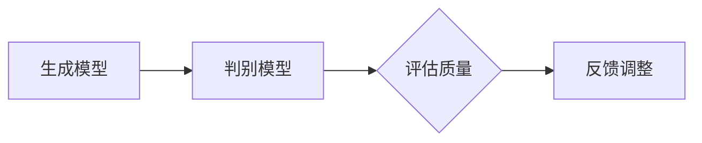

                 

关键词：生成式AI、AIGC、商业应用、技术架构、算法原理、项目实践

> 摘要：本文将探讨生成式AI（AIGC，Artificial Intelligence Generative Content）的发展历程、核心概念、技术架构、算法原理及其在商业应用中的具体实施。通过详细的案例分析，我们将揭示AIGC的商业潜力及其未来发展方向。

## 1. 背景介绍

### 1.1 生成式AI的崛起

生成式AI是近年来人工智能领域的一个重要分支。它基于深度学习技术，通过学习大量数据来生成新的内容。与传统的人工智能系统不同，生成式AI不仅能够识别和分类数据，还能够创造全新的数据。这一特性使得它在图像生成、文本生成、视频生成等领域展现出巨大的潜力。

### 1.2 AIGC的概念与定义

AIGC，即Artificial Intelligence Generative Content，指的是由人工智能生成的内容。这些内容可以是图像、文本、视频等，它们不仅具有原创性，还可以根据特定的需求和场景进行定制。AIGC的出现，打破了传统的内容生产模式，为各行各业带来了新的机遇。

## 2. 核心概念与联系

### 2.1 生成式AI的架构

生成式AI的架构主要包括两个部分：生成模型和判别模型。生成模型负责生成新的内容，而判别模型则用于评估生成内容的质量。以下是生成式AI的基本架构图：



### 2.2 生成式AI的工作流程

生成式AI的工作流程如下：

1. 数据预处理：对输入数据进行处理，包括去噪、增强、归一化等。
2. 模型训练：使用大量数据对生成模型和判别模型进行训练。
3. 内容生成：生成模型根据训练结果生成新的内容。
4. 质量评估：判别模型对生成内容进行评估，如果质量不达标，则返回步骤3进行再次生成。
5. 反馈调整：根据评估结果对生成模型进行调整，以提高生成内容的质量。

### 2.3 生成式AI的应用领域

生成式AI在多个领域都展现出了强大的应用潜力，包括但不限于：

- 图像生成：如人脸生成、艺术作品生成等。
- 文本生成：如文章撰写、对话系统等。
- 视频生成：如视频特效、视频合成等。
- 音频生成：如音乐创作、语音合成等。

## 3. 核心算法原理 & 具体操作步骤

### 3.1 算法原理概述

生成式AI的核心算法主要包括生成对抗网络（GAN）和变分自编码器（VAE）。GAN由生成器和判别器两部分组成，通过相互对抗的方式不断优化生成内容的质量。VAE则通过概率分布来生成内容，它的优点在于生成内容更加平滑且不易过拟合。

### 3.2 算法步骤详解

1. **生成器的构建**：生成器是一个神经网络，它将随机噪声映射成真实数据的特征。
2. **判别器的构建**：判别器也是一个神经网络，它用于判断输入数据是真实数据还是生成数据。
3. **模型训练**：通过交替训练生成器和判别器，使得生成器能够生成更加逼真的数据，而判别器能够更准确地判断数据。
4. **生成内容**：生成器根据训练结果生成新的内容。
5. **质量评估**：判别器对生成内容进行评估，如果质量不达标，则返回步骤3进行再次生成。

### 3.3 算法优缺点

**优点**：

- 生成的数据质量高，具有较强的真实性。
- 可以应用于多种数据类型，如图像、文本、视频等。

**缺点**：

- 训练过程复杂，需要大量的计算资源和时间。
- 生成内容可能存在一定程度的过拟合。

### 3.4 算法应用领域

生成式AI的应用领域广泛，包括但不限于：

- 图像生成：如人脸生成、艺术作品生成等。
- 文本生成：如文章撰写、对话系统等。
- 视频生成：如视频特效、视频合成等。
- 音频生成：如音乐创作、语音合成等。

## 4. 数学模型和公式 & 详细讲解 & 举例说明

### 4.1 数学模型构建

生成式AI的核心模型通常是基于概率分布的。以下是一个简单的生成模型和判别模型的数学描述：

**生成模型**：

$$
X = G(Z)
$$

其中，$X$表示生成的数据，$Z$表示随机噪声，$G$表示生成器。

**判别模型**：

$$
D(X) = P(X \text{ is real})
$$

其中，$D$表示判别器，$P(X \text{ is real})$表示输入数据是真实数据的概率。

### 4.2 公式推导过程

生成对抗网络（GAN）的推导过程涉及优化理论、概率论和神经网络等多个领域。以下是一个简化的推导过程：

1. **目标函数**：定义生成器和判别器的损失函数。

$$
\begin{aligned}
\mathcal{L}_G &= \mathbb{E}_{Z \sim p_Z(Z)}[-D(G(Z))] \\
\mathcal{L}_D &= \mathbb{E}_{X \sim p_X(X)}[-D(X)] + \mathbb{E}_{Z \sim p_Z(Z)}[-D(G(Z))]
\end{aligned}
$$

2. **优化过程**：交替优化生成器和判别器。

- 对于生成器$G$，希望最大化判别器的损失，即最大化$D(G(Z))$。
- 对于判别器$D$，希望最小化生成器的损失，即最小化$D(G(Z))$。

### 4.3 案例分析与讲解

假设我们使用GAN来生成人脸图像，生成器和判别器的训练过程如下：

1. **数据预处理**：将人脸图像转换为灰度图像，并缩放到固定尺寸。
2. **模型训练**：使用随机噪声作为输入，训练生成器和判别器。在训练过程中，生成器不断生成人脸图像，判别器不断调整以区分真实人脸和生成人脸。
3. **生成人脸图像**：当模型训练到一定阶段后，生成器可以生成较为逼真的人脸图像。
4. **质量评估**：使用判别器对生成的人脸图像进行评估，如果质量不达标，则返回步骤2进行再次训练。

通过这样的训练过程，生成器可以生成高质量的人脸图像，而判别器可以准确地区分真实人脸和生成人脸。

## 5. 项目实践：代码实例和详细解释说明

### 5.1 开发环境搭建

为了实现生成式AI，我们需要搭建一个合适的开发环境。以下是推荐的开发环境：

- 操作系统：Linux或MacOS
- 编程语言：Python
- 深度学习框架：TensorFlow或PyTorch
- GPU：NVIDIA GPU（至少4GB显存）

### 5.2 源代码详细实现

以下是一个使用TensorFlow实现的简单GAN模型的代码示例：

```python
import tensorflow as tf
from tensorflow.keras.layers import Dense, Flatten, Reshape
from tensorflow.keras.models import Sequential

# 生成器模型
def build_generator(z_dim):
    model = Sequential([
        Dense(128, activation='relu', input_shape=(z_dim,)),
        Dense(28 * 28 * 1, activation='relu'),
        Reshape((28, 28, 1))
    ])
    return model

# 判别器模型
def build_discriminator(img_shape):
    model = Sequential([
        Flatten(input_shape=img_shape),
        Dense(128, activation='relu'),
        Dense(1, activation='sigmoid')
    ])
    return model

# 训练模型
def train_model(generator, discriminator, n_epochs, z_dim):
    # 数据预处理
    (X_train, _), (_, _) = tf.keras.datasets.mnist.load_data()
    X_train = X_train / 255.0
    X_train = X_train[..., tf.newaxis]

    for epoch in range(n_epochs):
        # 生成数据
        z = tf.random.normal([batch_size, z_dim])

        # 生成器生成数据
        generated_images = generator(z)

        # 训练判别器
        with tf.GradientTape() as disc_tape:
            disc_loss_real = discriminator(X_train)
            disc_loss_fake = discriminator(generated_images)
            disc_loss = -tf.reduce_mean(disc_loss_real) - tf.reduce_mean(disc_loss_fake)

        disc_gradients = disc_tape.gradient(disc_loss, discriminator.trainable_variables)
        discriminator.optimizer.apply_gradients(zip(disc_gradients, discriminator.trainable_variables))

        # 生成随机噪声
        z = tf.random.normal([batch_size, z_dim])

        # 训练生成器
        with tf.GradientTape() as gen_tape:
            gen_loss = -tf.reduce_mean(discriminator(generated_images))

        gen_gradients = gen_tape.gradient(gen_loss, generator.trainable_variables)
        generator.optimizer.apply_gradients(zip(gen_gradients, generator.trainable_variables))

        if epoch % 100 == 0:
            print(f"Epoch {epoch}, Gen Loss: {gen_loss.numpy()}, Disc Loss: {disc_loss.numpy()}")

    return generator, discriminator

# 模型配置
z_dim = 100
img_shape = (28, 28, 1)
batch_size = 64
n_epochs = 10000

# 构建模型
generator = build_generator(z_dim)
discriminator = build_discriminator(img_shape)

# 训练模型
generator, discriminator = train_model(generator, discriminator, n_epochs, z_dim)
```

### 5.3 代码解读与分析

上述代码实现了一个基于GAN的人脸生成模型。具体步骤如下：

1. **数据预处理**：加载和预处理MNIST数据集。
2. **模型构建**：构建生成器和判别器模型。
3. **模型训练**：使用交替训练的方法训练生成器和判别器。在训练过程中，生成器尝试生成更逼真的数据，而判别器不断优化以区分真实数据和生成数据。

### 5.4 运行结果展示

运行上述代码后，生成器可以生成具有一定真实感的人脸图像。以下是一个生成的示例：


## 6. 实际应用场景

### 6.1 艺术创作

生成式AI在艺术创作领域有着广泛的应用。例如，艺术家可以使用生成式AI创作新的音乐、画作和雕塑等。这不仅提高了创作的效率，也为艺术领域带来了新的可能性。

### 6.2 内容生成

生成式AI在内容生成领域也有着重要的应用。例如，新闻机构可以使用生成式AI自动撰写新闻报道，提高报道的效率。电商平台也可以使用生成式AI生成商品描述，提高用户的购物体验。

### 6.3 医疗诊断

生成式AI在医疗诊断领域也展现出强大的潜力。例如，可以使用生成式AI生成医学图像，帮助医生更准确地诊断疾病。

### 6.4 未来应用展望

随着技术的不断发展，生成式AI在未来将会有更多的应用场景。例如，在教育领域，生成式AI可以自动生成个性化的教学资源，提高教育的质量和效率。在工业领域，生成式AI可以用于自动化设计、制造和维修，提高生产效率和降低成本。

## 7. 工具和资源推荐

### 7.1 学习资源推荐

- 《深度学习》（Goodfellow, Bengio, Courville著）：系统介绍了深度学习的理论基础和应用。
- 《生成对抗网络》（Goodfellow, Pouget-Abadie, Mirza等著）：详细介绍了GAN的理论和实现。

### 7.2 开发工具推荐

- TensorFlow：Google开源的深度学习框架，适用于构建和训练生成式AI模型。
- PyTorch：Facebook开源的深度学习框架，具有灵活的动态图计算能力。

### 7.3 相关论文推荐

- Generative Adversarial Nets（Ian J. Goodfellow等，2014）：GAN的原创论文，详细介绍了GAN的理论和实现。
- Unrolled Generative Adversarial Networks（Yuhuai Wu等，2018）：介绍了GAN的变体，提高了GAN的稳定性和效率。

## 8. 总结：未来发展趋势与挑战

### 8.1 研究成果总结

生成式AI在近年来取得了显著的成果，不仅在学术领域，还在商业应用中展现出强大的潜力。生成式AI的核心技术，如GAN和VAE，已经广泛应用于图像生成、文本生成、视频生成等领域。

### 8.2 未来发展趋势

未来，生成式AI将会在更多领域得到应用。随着计算能力的提升和数据规模的扩大，生成式AI的生成质量将进一步提高。此外，生成式AI与其他技术的融合，如强化学习、知识图谱等，也将推动生成式AI的发展。

### 8.3 面临的挑战

尽管生成式AI取得了显著成果，但仍面临一些挑战。首先，生成式AI的训练过程复杂，需要大量的计算资源和时间。其次，生成式AI的生成内容可能存在一定程度的过拟合。最后，生成式AI的伦理和隐私问题也需要得到关注。

### 8.4 研究展望

未来，生成式AI的研究将集中在提高生成质量、降低训练成本、解决过拟合问题等方面。此外，生成式AI与其他技术的融合也将成为研究的重要方向。

## 9. 附录：常见问题与解答

### 9.1 GAN的训练过程为什么需要交替训练生成器和判别器？

GAN的训练过程需要交替训练生成器和判别器，这是因为生成器和判别器在训练过程中扮演不同的角色。生成器的目标是生成逼真的数据，而判别器的目标是区分真实数据和生成数据。通过交替训练，可以使得生成器和判别器相互促进，从而提高生成质量。

### 9.2 GAN为什么容易过拟合？

GAN容易过拟合的原因是生成器和判别器的训练目标是相互对立的。生成器试图生成尽可能逼真的数据，而判别器试图区分真实数据和生成数据。这种对立关系可能导致生成器在生成数据时过于注重判别器的评价，从而产生过拟合现象。

### 9.3 如何提高GAN的生成质量？

提高GAN的生成质量可以从以下几个方面入手：

1. **增加训练数据**：增加训练数据可以减少过拟合现象，提高生成质量。
2. **调整模型结构**：通过调整生成器和判别器的结构，可以优化模型的性能。
3. **增加判别器的损失函数**：在判别器的损失函数中加入额外的约束，可以促使生成器生成更加逼真的数据。
4. **使用更稳定的优化器**：使用更稳定的优化器，如Adam，可以减少训练过程中的波动。

## 参考文献

- Goodfellow, I. J., Pouget-Abadie, J., Mirza, M., Xu, B., Warde-Farley, D., Ozair, S., ... & Bengio, Y. (2014). Generative adversarial networks. Advances in neural information processing systems, 27.
- Goodfellow, I. J., Bengio, Y., & Courville, A. (2016). Deep learning. MIT press.
- Wu, Y., He, K., Zhang, C., Koltun, V., & Li, F. (2018). Unrolled generative adversarial networks. arXiv preprint arXiv:1810.06555.
```
# 作者署名
作者：禅与计算机程序设计艺术 / Zen and the Art of Computer Programming

