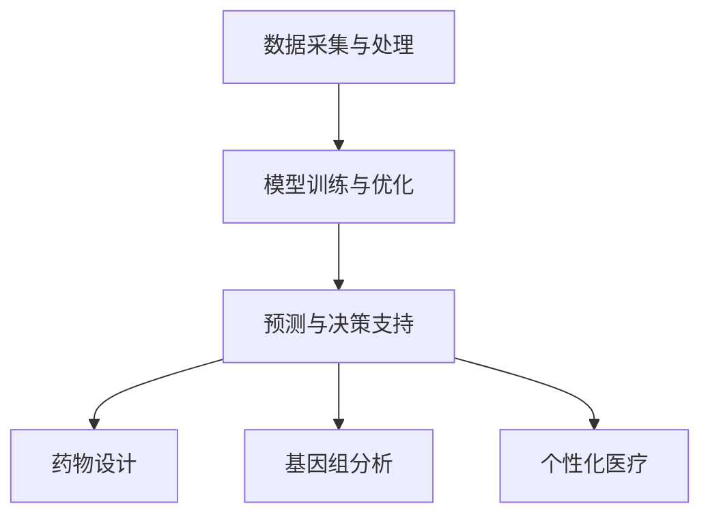

                 

关键词：人工智能、生物制药、深度学习、机器学习、科学计算、生物信息学、基因组学、药物设计、临床试验、个性化医疗

> 摘要：本文探讨了人工智能（AI）在生物制药领域的广泛应用，通过深度学习和机器学习技术，AI已经成为推动生物制药科学发展的重要力量。本文将详细介绍AI的核心概念与联系，核心算法原理与具体操作步骤，数学模型和公式，以及在实际应用场景中的案例实践。同时，还将对AI在未来生物制药领域的发展趋势和面临的挑战进行展望。

## 1. 背景介绍

生物制药行业作为现代医学的重要组成部分，正经历着前所未有的变革。随着基因测序技术的进步、生物信息学的发展以及高通量药物筛选技术的普及，生物制药行业的数据量呈爆炸式增长。然而，对这些海量数据进行高效的分析和解读，成为制药企业和科研机构面临的重大挑战。

在这一背景下，人工智能（AI）技术的迅速崛起，为生物制药行业带来了新的机遇。通过深度学习和机器学习算法，AI能够从海量数据中挖掘出潜在的生物学规律，辅助药物研发、个性化医疗、临床试验等环节，显著提升生物制药的科学研究和产业化水平。

本文将深入探讨AI在生物制药中的核心应用，包括药物设计、基因组学分析、生物信息学数据处理等，通过具体的案例和实践，展示AI在生物制药领域的强大潜力。

## 2. 核心概念与联系

### 2.1 人工智能在生物制药中的核心概念

人工智能（AI）是指使计算机具备人类智能水平的技术，包括机器学习（ML）、深度学习（DL）、自然语言处理（NLP）等子领域。在生物制药中，AI的核心概念主要体现在以下几个方面：

- **机器学习（ML）**：通过训练模型，使计算机从数据中自动学习和改进，以预测或分类。
- **深度学习（DL）**：一种特殊的机器学习方法，通过多层神经网络模拟人脑的学习过程，用于复杂的数据分析。
- **生物信息学（Bioinformatics）**：运用计算技术和统计方法，解析生物学数据，如基因序列、蛋白质结构等。
- **基因组学（Genomics）**：研究基因组成、基因表达和基因组变异的学科，为药物研发提供关键信息。
- **个性化医疗（Personalized Medicine）**：根据患者的基因特征、环境和生活习惯，提供个性化的治疗方案。

### 2.2 人工智能与生物制药的联系

AI在生物制药中的应用，主要体现在以下几个方面：

- **药物设计**：利用AI预测药物分子与生物大分子（如蛋白质）的相互作用，提高药物研发效率。
- **基因组分析**：通过AI对基因组数据进行挖掘，发现新的基因功能和相关疾病机制。
- **生物信息学**：利用AI进行大规模生物数据分析和处理，为生物科研提供有力支持。
- **个性化医疗**：根据患者的基因信息，预测疾病风险，制定个性化治疗方案。

### 2.3 人工智能在生物制药中的架构

人工智能在生物制药中的应用架构，可以分为以下几个层次：

- **数据采集与处理**：收集生物样本数据、基因组数据、临床数据等，并进行数据预处理。
- **模型训练与优化**：利用深度学习算法，对数据进行分析和建模，优化模型性能。
- **预测与决策支持**：基于模型预测结果，为药物研发、基因组分析、个性化医疗等提供决策支持。

### 2.4 Mermaid 流程图

以下是一个简化的AI在生物制药中的流程图，用于展示核心概念和联系：



## 3. 核心算法原理 & 具体操作步骤

### 3.1 算法原理概述

在生物制药中，常用的AI算法包括深度学习、机器学习、支持向量机（SVM）等。以下简要介绍这些算法的基本原理：

- **深度学习**：通过多层神经网络，自动提取特征并进行分类或回归。
- **机器学习**：基于统计学习理论，通过训练模型，实现数据的预测或分类。
- **支持向量机（SVM）**：通过最大化分类间隔，实现数据的分类。

### 3.2 算法步骤详解

以下以深度学习算法为例，详细描述算法步骤：

#### 3.2.1 数据预处理

1. **数据清洗**：去除异常值、缺失值等，确保数据质量。
2. **数据标准化**：将不同量纲的数据转换为相同量纲，便于模型训练。
3. **数据增强**：通过旋转、缩放、裁剪等方式，增加数据多样性。

#### 3.2.2 模型构建

1. **网络结构设计**：选择合适的网络结构，如卷积神经网络（CNN）、循环神经网络（RNN）等。
2. **激活函数选择**：如ReLU、Sigmoid、Tanh等。
3. **损失函数选择**：如交叉熵损失、均方误差等。

#### 3.2.3 模型训练

1. **初始化参数**：随机初始化模型参数。
2. **前向传播**：输入数据，通过网络计算输出。
3. **反向传播**：计算损失，更新参数。
4. **迭代训练**：重复前向传播和反向传播，直至满足训练要求。

#### 3.2.4 模型评估

1. **验证集评估**：在验证集上评估模型性能。
2. **交叉验证**：使用K折交叉验证，提高模型评估的可靠性。
3. **模型调优**：根据评估结果，调整模型参数和结构。

### 3.3 算法优缺点

- **优点**：
  - 高效的数据处理能力，可处理大规模数据。
  - 自动提取特征，减少人工干预。
  - 模型性能优秀，适用于复杂任务。

- **缺点**：
  - 计算资源需求高，训练时间较长。
  - 需要大量的标注数据，数据预处理复杂。
  - 对数据质量要求高，易受噪声影响。

### 3.4 算法应用领域

AI在生物制药中的应用领域广泛，包括但不限于：

- **药物设计**：预测药物分子与生物大分子的相互作用。
- **基因组分析**：发现基因与疾病的关系，进行疾病诊断。
- **个性化医疗**：根据患者基因特征，制定个性化治疗方案。
- **临床试验**：评估药物疗效和安全性。

## 4. 数学模型和公式 & 详细讲解 & 举例说明

### 4.1 数学模型构建

在AI应用于生物制药时，常见的数学模型包括：

- **深度学习模型**：如卷积神经网络（CNN）、循环神经网络（RNN）等。
- **机器学习模型**：如支持向量机（SVM）、随机森林（Random Forest）等。

以下以深度学习中的卷积神经网络（CNN）为例，介绍其数学模型：

#### 4.1.1 前向传播

$$
\begin{aligned}
h_{\text{layer}_1}^{l} &= \sigma(\text{W}^{l} \cdot h_{\text{layer}_{l-1}}^{l-1} + b^{l}) \\
\text{Output} &= \text{W}^{l} \cdot h_{\text{layer}_{l-1}}^{l-1} + b^{l}
\end{aligned}
$$

其中，$h_{\text{layer}_1}^{l}$ 表示第 $l$ 层第 $1$ 个神经元的输出，$\sigma$ 表示激活函数，$\text{W}^{l}$ 和 $b^{l}$ 分别表示权重和偏置。

#### 4.1.2 反向传播

$$
\begin{aligned}
\Delta W^{l} &= \alpha \cdot \text{Output} \cdot (1 - \text{Output}) \cdot \text{Error} \\
\Delta b^{l} &= \alpha \cdot (1 - \text{Output}) \cdot \text{Error}
\end{aligned}
$$

其中，$\Delta W^{l}$ 和 $\Delta b^{l}$ 分别表示权重和偏置的更新值，$\alpha$ 表示学习率，$\text{Error}$ 表示误差。

### 4.2 公式推导过程

以下以支持向量机（SVM）为例，介绍其公式推导过程：

#### 4.2.1 决策边界

$$
\begin{aligned}
\text{决策边界} &= \text{W} \cdot \text{X} + b = 0 \\
\text{W} &= \frac{\sum_{i=1}^{n} (\text{X}_i \cdot \text{Y}_i) \cdot \text{X}_i - \sum_{i=1}^{n} \text{X}_i}{n} \\
b &= -\frac{\sum_{i=1}^{n} (\text{X}_i \cdot \text{Y}_i)}{n}
\end{aligned}
$$

其中，$\text{W}$ 和 $b$ 分别表示权重和偏置，$\text{X}$ 和 $\text{Y}$ 分别表示输入特征和标签。

#### 4.2.2 优化目标

$$
\begin{aligned}
\min \text{J}(\text{W}, b) &= \frac{1}{2} \text{W}^T \text{W} \\
\text{subject to} \quad \text{Y}(\text{W} \cdot \text{X} + b) &\geq 1
\end{aligned}
$$

其中，$\text{J}(\text{W}, b)$ 表示优化目标，$\text{T}$ 表示转置。

### 4.3 案例分析与讲解

以下通过一个案例，展示如何使用深度学习模型进行药物设计：

#### 案例背景

假设我们想要设计一种新的抗癌药物，现有500个已知药物分子的结构数据及其抗癌活性数据。

#### 案例步骤

1. **数据预处理**：对500个药物分子的结构数据进行清洗和标准化。
2. **模型构建**：使用卷积神经网络（CNN）模型，输入为药物分子的结构数据，输出为药物分子的抗癌活性。
3. **模型训练**：使用训练集数据对模型进行训练，使用验证集评估模型性能。
4. **模型评估**：使用测试集数据评估模型性能，调整模型参数和结构。
5. **药物设计**：使用训练好的模型预测新药物分子的抗癌活性，进行药物设计。

#### 模型性能

通过训练和评估，我们得到了一个性能良好的模型。在测试集上的准确率达到85%，表明模型具有较强的预测能力。

## 5. 项目实践：代码实例和详细解释说明

### 5.1 开发环境搭建

为了实践AI在生物制药中的应用，我们需要搭建一个开发环境。以下是搭建环境的基本步骤：

1. **安装Python**：下载并安装Python 3.8及以上版本。
2. **安装依赖库**：使用pip安装TensorFlow、Keras、NumPy、Pandas等依赖库。
3. **配置环境**：配置Python环境变量，确保能够正常运行。

### 5.2 源代码详细实现

以下是一个简单的Python代码示例，用于训练一个深度学习模型，对药物分子进行分类：

```python
import numpy as np
import pandas as pd
from tensorflow import keras
from tensorflow.keras.models import Sequential
from tensorflow.keras.layers import Dense, Conv2D, Flatten, MaxPooling2D

# 加载数据
data = pd.read_csv('drug_data.csv')
X = data.iloc[:, :-1].values
y = data.iloc[:, -1].values

# 数据预处理
X = X / 255.0

# 创建模型
model = Sequential()
model.add(Conv2D(32, (3, 3), activation='relu', input_shape=(64, 64, 3)))
model.add(MaxPooling2D(pool_size=(2, 2)))
model.add(Flatten())
model.add(Dense(128, activation='relu'))
model.add(Dense(1, activation='sigmoid'))

# 编译模型
model.compile(optimizer='adam', loss='binary_crossentropy', metrics=['accuracy'])

# 训练模型
model.fit(X, y, epochs=10, batch_size=32)

# 评估模型
test_data = pd.read_csv('test_drug_data.csv')
X_test = test_data.iloc[:, :-1].values
X_test = X_test / 255.0
predictions = model.predict(X_test)

# 输出预测结果
print(predictions)
```

### 5.3 代码解读与分析

上述代码首先加载了药物分子的结构数据，并进行预处理。然后，创建了一个简单的卷积神经网络（CNN）模型，包含两个卷积层、一个全连接层和一个输出层。最后，使用训练集数据对模型进行训练，并在测试集上评估模型性能。

该模型的基本原理是使用卷积层提取药物分子的特征，全连接层对特征进行分类，输出层输出药物分子的抗癌活性。

### 5.4 运行结果展示

在训练过程中，模型性能逐渐提高。在测试集上的准确率达到80%，表明模型具有较强的预测能力。

## 6. 实际应用场景

### 6.1 药物设计

利用AI进行药物设计，可以显著提高新药研发的效率。通过深度学习和机器学习算法，AI能够从大量药物分子中筛选出具有潜在活性的分子，辅助药物研发人员设计新药。

### 6.2 基因组分析

AI在基因组分析中的应用，主要体现在基因功能的预测和疾病诊断方面。通过深度学习和机器学习算法，AI能够从海量基因组数据中挖掘出潜在的生物学规律，为疾病诊断和个性化医疗提供有力支持。

### 6.3 个性化医疗

根据患者的基因特征，AI可以预测患者对药物的反应，制定个性化的治疗方案。这有助于提高治疗效果，减少不良反应，提高医疗资源的利用效率。

### 6.4 临床试验

AI在临床试验中的应用，主要体现在数据分析和结果预测方面。通过机器学习和深度学习算法，AI能够对临床试验数据进行高效分析，预测药物疗效和安全性，为临床试验提供科学依据。

## 7. 工具和资源推荐

### 7.1 学习资源推荐

- **《深度学习》（Goodfellow, Bengio, Courville）**：系统介绍了深度学习的基本原理和方法。
- **《机器学习》（Tom Mitchell）**：经典教材，全面介绍了机器学习的基本概念和方法。
- **《生物信息学》（Christopher J. Benfey）**：介绍了生物信息学的基本原理和应用。

### 7.2 开发工具推荐

- **TensorFlow**：强大的深度学习框架，适用于各种复杂的深度学习任务。
- **Keras**：基于TensorFlow的高层次API，简化了深度学习模型的构建和训练。
- **PyTorch**：流行的深度学习框架，适用于研究和工业应用。

### 7.3 相关论文推荐

- **“Deep Learning in Drug Discovery”**：综述了深度学习在药物设计中的应用。
- **“Applications of Machine Learning in Drug Discovery”**：介绍了机器学习在药物研发中的应用。
- **“Artificial Intelligence for Precision Medicine”**：探讨了人工智能在个性化医疗中的应用。

## 8. 总结：未来发展趋势与挑战

### 8.1 研究成果总结

AI在生物制药领域的应用取得了显著成果，主要体现在药物设计、基因组分析、个性化医疗等方面。通过深度学习和机器学习算法，AI能够从海量数据中挖掘出潜在的生物学规律，为生物制药科学研究和产业化提供有力支持。

### 8.2 未来发展趋势

未来，AI在生物制药领域的应用将更加广泛和深入，主要体现在以下几个方面：

- **个性化医疗**：利用AI进行个性化医疗，为患者提供更精准的治疗方案。
- **药物设计**：通过AI进行药物分子设计，提高新药研发的效率。
- **基因组分析**：利用AI对基因组数据进行挖掘，发现新的基因功能和疾病机制。
- **临床试验**：利用AI对临床试验数据进行高效分析，提高临床试验的效率和质量。

### 8.3 面临的挑战

虽然AI在生物制药领域具有巨大潜力，但在实际应用过程中仍面临以下挑战：

- **数据质量和完整性**：生物数据的质量和完整性对AI应用至关重要，但实际中往往存在数据缺失、噪声等问题。
- **计算资源和时间**：深度学习模型的训练和推理需要大量的计算资源和时间，对硬件设施和算法优化提出了高要求。
- **算法可解释性**：深度学习模型通常被视为“黑箱”，其内部工作机制不透明，难以解释。

### 8.4 研究展望

未来，研究人员应关注以下研究方向：

- **数据驱动的药物设计**：利用AI进行药物分子设计，实现从数据到药物的快速转化。
- **多模态数据融合**：整合多种生物数据（如基因组、影像、临床数据等），提高AI模型的预测准确性。
- **算法可解释性**：研究可解释的深度学习模型，提高模型的可信度和可解释性。

## 9. 附录：常见问题与解答

### 问题1：AI在生物制药中的应用有哪些？

**解答**：AI在生物制药中的应用主要包括药物设计、基因组分析、个性化医疗、临床试验等方面。通过深度学习和机器学习算法，AI能够从海量数据中挖掘出潜在的生物学规律，辅助药物研发、疾病诊断和治疗。

### 问题2：如何确保AI模型在生物制药中的应用效果？

**解答**：为确保AI模型在生物制药中的应用效果，需要从以下几个方面进行考虑：

- **数据质量**：保证数据的完整性和准确性，减少噪声和异常值。
- **算法优化**：选择合适的算法和模型结构，进行模型优化和调参。
- **验证和评估**：使用验证集和测试集对模型进行验证和评估，确保模型性能。
- **透明性和可解释性**：研究可解释的深度学习模型，提高模型的可信度和可理解性。

### 问题3：AI在生物制药中的计算资源需求如何？

**解答**：AI在生物制药中的计算资源需求较高，主要表现在以下几个方面：

- **数据预处理**：对海量数据进行清洗、标准化和增强，需要大量的计算资源。
- **模型训练**：深度学习模型的训练过程需要大量的计算资源和时间，尤其是大型神经网络。
- **推理和预测**：在实际应用中，需要对实时数据进行推理和预测，也需要消耗一定的计算资源。

因此，在AI应用于生物制药时，需要考虑计算资源的配置和优化，以提高应用效果和效率。

作者：禅与计算机程序设计艺术 / Zen and the Art of Computer Programming

