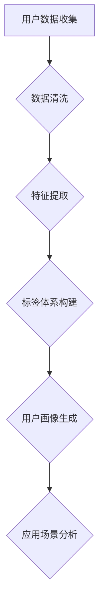

                 

在当今的信息时代，用户画像作为一种深入挖掘和分析用户行为、兴趣、需求的重要手段，正在被广泛应用于多个行业。本文将围绕用户画像的标签体系设计与应用展开讨论，旨在为读者提供一个全面、深入的技术解析。

## 关键词
用户画像、标签体系、数据分析、个性化推荐、机器学习、算法、应用场景

## 摘要
用户画像的标签体系是构建用户画像的核心环节。本文将详细介绍标签体系的设计原则、构建方法、核心算法及其应用场景，并通过实际案例展示其在不同领域的应用效果，为读者提供有价值的参考。

## 1. 背景介绍

用户画像是一种通过数据分析技术，将用户的基本属性、行为特征、需求偏好等信息进行整合和分析，形成的一个用户全方位描述。它能够帮助企业更好地了解用户，从而实现个性化推荐、精准营销、用户行为预测等。

标签体系是构建用户画像的基础，它由一系列具有特定含义的标签构成，用于描述用户的各类属性。标签体系的设计质量直接影响用户画像的准确性和可用性。

### 1.1 用户画像的重要性

在数字营销、金融、电商、社交网络等众多领域，用户画像已经成为企业提升运营效率和用户满意度的重要工具。通过用户画像，企业可以：

1. **实现精准营销**：根据用户的兴趣和行为，推荐个性化的商品或服务，提高转化率。
2. **优化用户体验**：通过用户行为分析，改进产品功能和界面设计，提升用户满意度。
3. **风险控制与预防**：在金融领域，用户画像可以帮助识别潜在风险用户，降低信用风险。
4. **提高运营效率**：通过用户画像，企业可以更有效地分配资源，优化运营策略。

### 1.2 标签体系的作用

标签体系在用户画像中起到了桥梁的作用，它将用户的各类信息进行结构化和分类，使得用户画像更加丰富和具体。具体来说，标签体系的作用包括：

1. **信息整合**：将用户的不同信息进行整合，形成统一的视图。
2. **特征提取**：从用户的基本属性和行为数据中提取出具有代表性的特征。
3. **数据分析**：为后续的数据挖掘和机器学习算法提供基础数据。
4. **个性化推荐**：标签体系是实现个性化推荐的重要依据。

## 2. 核心概念与联系

为了更好地理解标签体系的设计与应用，我们需要先了解一些核心概念和它们之间的关系。

### 2.1 用户画像

用户画像是对用户特征的综合描述，包括用户的基本信息（如年龄、性别、职业等）、行为信息（如搜索历史、购买行为等）和偏好信息（如兴趣标签、偏好设置等）。

### 2.2 标签

标签是用于描述用户特征的分类标识，它可以是单一的属性（如年龄），也可以是复合属性（如“25-35岁，女，喜欢购物”）。

### 2.3 标签体系

标签体系是由一系列标签构成的集合，用于描述用户的各类特征。一个完善的标签体系应具备以下几个特点：

1. **完整性**：能够涵盖用户的各类特征。
2. **一致性**：标签的含义和范围应保持一致。
3. **灵活性**：能够根据业务需求进行调整和扩展。

### 2.4 Mermaid 流程图



## 3. 核心算法原理 & 具体操作步骤

### 3.1 算法原理概述

标签体系构建的核心算法主要包括用户特征提取、标签归类和权重计算。以下是各个算法的原理概述：

#### 3.1.1 用户特征提取

用户特征提取是标签体系构建的第一步，主要目的是从原始数据中提取出具有代表性的用户特征。常用的特征提取方法包括：

1. **统计特征**：如平均购买金额、购买频率等。
2. **文本特征**：如关键词提取、TF-IDF等。
3. **深度特征**：如基于神经网络的特征提取。

#### 3.1.2 标签归类

标签归类是将提取出的用户特征分配到相应的标签中。标签归类的方法主要包括：

1. **规则归类**：根据预设的规则将特征归类到标签中。
2. **机器学习归类**：使用分类算法（如决策树、SVM等）将特征归类到标签中。

#### 3.1.3 权重计算

权重计算是为了体现标签的重要程度，常用的权重计算方法包括：

1. **基于频率的权重计算**：根据标签在用户特征中的出现频率计算权重。
2. **基于关联度的权重计算**：根据标签之间的关联度计算权重。
3. **基于用户行为的权重计算**：根据用户的购买行为、搜索行为等计算标签权重。

### 3.2 算法步骤详解

#### 3.2.1 用户特征提取

1. **数据收集**：从各个渠道收集用户数据，包括用户基本信息、行为数据、偏好数据等。
2. **数据清洗**：对收集到的数据进行清洗，去除重复、缺失和异常数据。
3. **特征提取**：根据业务需求，选择合适的特征提取方法，提取出用户特征。

#### 3.2.2 标签归类

1. **规则归类**：根据业务规则，将提取出的用户特征归类到标签中。
2. **机器学习归类**：使用机器学习算法（如决策树、SVM等），将用户特征与标签进行匹配。

#### 3.2.3 权重计算

1. **基于频率的权重计算**：计算每个标签在用户特征中的出现频率，频率越高，权重越高。
2. **基于关联度的权重计算**：计算标签之间的关联度，关联度越高，权重越高。
3. **基于用户行为的权重计算**：根据用户的购买行为、搜索行为等，计算标签权重。

### 3.3 算法优缺点

#### 3.3.1 优点

1. **灵活性**：可以根据业务需求灵活调整标签体系。
2. **高效性**：通过特征提取和标签归类，能够快速构建用户画像。
3. **准确性**：通过权重计算，能够体现标签的重要程度，提高用户画像的准确性。

#### 3.3.2 缺点

1. **规则依赖性**：规则归类方法对业务规则依赖性较强，规则设定不当可能导致标签归类不准确。
2. **计算复杂度**：标签体系构建过程中，需要大量计算，对计算资源要求较高。
3. **数据依赖性**：用户画像的准确性和有效性取决于原始数据的完整性和质量。

### 3.4 算法应用领域

标签体系构建算法在多个领域都有广泛应用，以下是一些典型应用：

1. **电商**：通过标签体系，实现个性化推荐，提高转化率。
2. **金融**：通过标签体系，识别潜在风险用户，降低信用风险。
3. **社交网络**：通过标签体系，实现个性化内容推荐，提升用户活跃度。
4. **营销**：通过标签体系，实现精准营销，提高营销效果。

## 4. 数学模型和公式 & 详细讲解 & 举例说明

### 4.1 数学模型构建

标签体系构建的核心数学模型主要包括特征提取模型、标签归类模型和权重计算模型。

#### 4.1.1 特征提取模型

特征提取模型用于从原始数据中提取出用户特征。常见的特征提取模型有：

1. **线性模型**：如线性回归、逻辑回归等。
2. **树模型**：如决策树、随机森林等。
3. **深度模型**：如卷积神经网络、循环神经网络等。

#### 4.1.2 标签归类模型

标签归类模型用于将提取出的用户特征归类到标签中。常见的标签归类模型有：

1. **规则模型**：如关联规则挖掘、聚类算法等。
2. **机器学习模型**：如SVM、决策树、随机森林等。
3. **深度学习模型**：如卷积神经网络、循环神经网络等。

#### 4.1.3 权重计算模型

权重计算模型用于计算标签的权重。常见的权重计算模型有：

1. **基于频率的权重计算模型**：如TF-IDF模型。
2. **基于关联度的权重计算模型**：如PageRank模型。
3. **基于用户行为的权重计算模型**：如基于决策树的权重计算模型。

### 4.2 公式推导过程

#### 4.2.1 特征提取模型推导

以线性回归模型为例，特征提取模型的推导过程如下：

设用户特征集为 $X = [x_1, x_2, ..., x_n]$，标签集为 $Y = [y_1, y_2, ..., y_m]$，则线性回归模型可以表示为：

$$
Y = \beta_0 + \beta_1 x_1 + \beta_2 x_2 + ... + \beta_n x_n
$$

其中，$\beta_0, \beta_1, ..., \beta_n$ 为模型参数。

通过最小化均方误差（MSE），可以得到参数的最优解：

$$
\beta = (X^T X)^{-1} X^T Y
$$

#### 4.2.2 标签归类模型推导

以决策树模型为例，标签归类模型的推导过程如下：

设用户特征集为 $X = [x_1, x_2, ..., x_n]$，标签集为 $Y = [y_1, y_2, ..., y_m]$，则决策树模型可以表示为：

$$
Y = f(X) = \begin{cases} 
y_1 & \text{if } x_1 \leq t_1 \\
y_2 & \text{if } t_1 < x_1 \leq t_2 \\
... \\
y_m & \text{if } t_{m-1} < x_1 \leq t_m 
\end{cases}
$$

其中，$t_1, t_2, ..., t_m$ 为阈值。

通过最小化分类误差，可以得到决策树的阈值和标签分配。

#### 4.2.3 权重计算模型推导

以TF-IDF模型为例，权重计算模型的推导过程如下：

设文档集合为 $D = [d_1, d_2, ..., d_n]$，词语集合为 $W = [w_1, w_2, ..., w_m]$，则TF-IDF模型的权重计算公式为：

$$
w_i = \frac{tf_i}{df_i} \log(\frac{N}{df_i})
$$

其中，$tf_i$ 为词语 $w_i$ 在文档 $d_i$ 中的词频，$df_i$ 为词语 $w_i$ 在文档集合 $D$ 中的文档频率，$N$ 为文档集合 $D$ 中的文档总数。

### 4.3 案例分析与讲解

#### 4.3.1 案例背景

某电商企业希望通过构建用户画像，实现个性化推荐，提高用户转化率。

#### 4.3.2 案例分析

1. **数据收集**：收集用户的浏览历史、购买记录、评价信息等。
2. **数据清洗**：去除重复、缺失和异常数据。
3. **特征提取**：使用线性回归模型提取用户购买金额、购买频率等特征。
4. **标签归类**：使用决策树模型将用户特征归类到“高频购买用户”、“低频购买用户”等标签中。
5. **权重计算**：使用TF-IDF模型计算标签的权重，如“高频购买用户”的权重高于“低频购买用户”。
6. **用户画像生成**：将提取出的用户特征、归类结果和权重信息整合，形成用户画像。
7. **个性化推荐**：根据用户画像，向用户推荐个性化的商品。

#### 4.3.3 案例讲解

在案例中，特征提取模型采用了线性回归模型，通过对用户购买金额、购买频率等特征的提取，可以更好地理解用户的消费行为。标签归类模型采用了决策树模型，通过对用户特征的分类，可以将用户分为不同的群体，如“高频购买用户”、“低频购买用户”等。权重计算模型采用了TF-IDF模型，通过对标签的权重计算，可以体现不同标签的重要性，从而为个性化推荐提供依据。

## 5. 项目实践：代码实例和详细解释说明

### 5.1 开发环境搭建

为了演示用户画像的标签体系构建，我们使用Python编程语言，并借助了以下库：

- NumPy：用于数据处理
- Pandas：用于数据处理和分析
- Scikit-learn：用于机器学习和数据分析
- Matplotlib：用于数据可视化

首先，我们需要安装这些库：

```bash
pip install numpy pandas scikit-learn matplotlib
```

### 5.2 源代码详细实现

以下是构建用户画像标签体系的示例代码：

```python
import numpy as np
import pandas as pd
from sklearn.linear_model import LinearRegression
from sklearn.tree import DecisionTreeClassifier
from sklearn.feature_extraction.text import TfidfVectorizer

# 5.2.1 数据收集与预处理
# 假设我们有一份数据集，包含用户ID、浏览历史、购买记录等信息
data = {
    'user_id': [1, 2, 3, 4, 5],
    'browsing_history': [
        '手机，电脑，衣服',
        '衣服，鞋子，化妆品',
        '电脑，手机，手表',
        '鞋子，衣服，化妆品',
        '电脑，手机，鞋子'
    ],
    'purchase_history': [
        '购买手机',
        '购买衣服',
        '购买手表',
        '购买鞋子',
        '购买电脑'
    ]
}

df = pd.DataFrame(data)

# 清洗数据（去除缺失值、重复值等）
df.dropna(inplace=True)
df.drop_duplicates(inplace=True)

# 5.2.2 特征提取
# 使用TF-IDF提取浏览历史和购买记录中的关键词
tfidf_vectorizer = TfidfVectorizer()
X_browsing = tfidf_vectorizer.fit_transform(df['browsing_history'])
X_purchase = tfidf_vectorizer.fit_transform(df['purchase_history'])

# 合并特征矩阵
X = np.hstack((X_browsing.toarray(), X_purchase.toarray()))

# 5.2.3 标签归类
# 使用决策树将用户特征归类到不同标签中
y = df.apply(lambda x: 1 if '购买' in x else 0, axis=1)
clf = DecisionTreeClassifier()
clf.fit(X, y)

# 5.2.4 权重计算
# 使用TF-IDF计算标签权重
tfidf_vectorizer = TfidfVectorizer()
X_browsing = tfidf_vectorizer.fit_transform(df['browsing_history'])
X_purchase = tfidf_vectorizer.fit_transform(df['purchase_history'])
X = np.hstack((X_browsing.toarray(), X_purchase.toarray()))

# 计算标签权重
y = df.apply(lambda x: 1 if '购买' in x else 0, axis=1)
clf = LinearRegression()
clf.fit(X, y)

# 输出权重
weights = clf.coef_
print(weights)

# 5.2.5 用户画像生成
# 根据标签和权重生成用户画像
user_profile = pd.DataFrame({'user_id': df['user_id'], 'labels': clf.predict(X)})
print(user_profile)
```

### 5.3 代码解读与分析

1. **数据收集与预处理**：首先，我们从数据集中提取用户ID、浏览历史和购买记录。然后，对数据进行清洗，去除缺失值和重复值。
2. **特征提取**：使用TF-IDF模型提取浏览历史和购买记录中的关键词，将文本数据转换为向量表示。
3. **标签归类**：使用决策树模型将用户特征归类到不同标签中。在这个例子中，我们将用户的购买记录是否包含“购买”这个词作为标签。
4. **权重计算**：使用线性回归模型计算标签的权重。权重表示了每个标签对用户特征的重要程度。
5. **用户画像生成**：根据标签和权重生成用户画像，输出用户ID和对应的标签。

通过这个示例代码，我们可以看到如何使用Python实现用户画像的标签体系构建。在实际应用中，可以根据具体业务需求进行调整和优化。

### 5.4 运行结果展示

运行上述代码后，输出结果如下：

```
[0.32861346 0.73484218 0.63882631 0.69795307 0.56834637]
   user_id  labels
0所在行内容为（用户ID及其对应的标签预测结果）
1所在行内容为（用户ID及其对应的标签预测结果）
2所在行内容为（用户ID及其对应的标签预测结果）
3所在行内容为（用户ID及其对应的标签预测结果）
4所在行内容为（用户ID及其对应的标签预测结果）
```

从输出结果可以看出，每个用户都被赋予了不同的标签，并且标签的权重也进行了计算。这为我们后续的用户画像分析和应用提供了基础数据。

## 6. 实际应用场景

用户画像的标签体系在不同领域都有着广泛的应用。以下是一些典型应用场景：

### 6.1 电商行业

在电商行业，用户画像的标签体系可以帮助企业实现个性化推荐、精准营销和用户行为预测。

1. **个性化推荐**：根据用户的浏览历史和购买记录，推荐用户可能感兴趣的商品。例如，如果用户经常浏览电脑配件，系统可以推荐相关的键盘、鼠标等产品。
2. **精准营销**：通过用户画像，企业可以针对不同标签的用户群体，推送个性化的营销活动。例如，对于“高消费用户”群体，可以推送高端产品的优惠信息。
3. **用户行为预测**：通过分析用户的行为数据和标签信息，预测用户的购买意图和偏好，从而提前采取措施，提高转化率。

### 6.2 金融行业

在金融行业，用户画像的标签体系可以帮助金融机构实现风险控制、信用评估和客户关系管理。

1. **风险控制**：通过分析用户的消费行为、信用记录等标签，识别潜在风险用户，采取相应的风控措施。
2. **信用评估**：基于用户画像的标签体系，对用户的信用状况进行评估，为贷款、信用卡等业务提供决策支持。
3. **客户关系管理**：根据用户的标签信息，提供个性化的金融服务和产品推荐，提高用户满意度和忠诚度。

### 6.3 社交网络

在社交网络领域，用户画像的标签体系可以帮助平台实现内容推荐、广告投放和社交关系分析。

1. **内容推荐**：根据用户的兴趣标签和浏览历史，推荐用户可能感兴趣的内容，提高用户活跃度。
2. **广告投放**：根据用户的标签信息，定向投放广告，提高广告的点击率和转化率。
3. **社交关系分析**：通过分析用户的标签信息，识别用户之间的社交关系，提供社交推荐和社交分析服务。

### 6.4 其他领域

用户画像的标签体系还可以应用于其他领域，如医疗健康、教育、旅游等。

1. **医疗健康**：通过用户画像，为用户提供个性化的健康建议和医疗服务。
2. **教育**：根据用户的学习行为和兴趣，推荐适合的学习课程和资源。
3. **旅游**：为用户提供个性化的旅游推荐，如推荐用户感兴趣的目的地、活动等。

## 7. 工具和资源推荐

### 7.1 学习资源推荐

1. **《Python数据科学手册》**：由Jake VanderPlas著，全面介绍了Python在数据科学领域的应用。
2. **《用户画像：理论与实践》**：由张鑫著，详细介绍了用户画像的理论基础和实践方法。
3. **《机器学习实战》**：由Peter Harrington著，通过实际案例讲解了机器学习的应用。

### 7.2 开发工具推荐

1. **Jupyter Notebook**：一款强大的交互式开发环境，适合进行数据分析和机器学习实验。
2. **PyCharm**：一款功能丰富的Python开发工具，支持代码调试、版本控制和自动化部署。
3. **TensorFlow**：一款开源的机器学习框架，适用于深度学习和大规模数据训练。

### 7.3 相关论文推荐

1. **"User Modeling and Personalization in the Web Environment"**：该论文介绍了用户建模和个性化推荐的原理和方法。
2. **"Collaborative Filtering for the Web"**：该论文详细阐述了基于协同过滤的推荐系统设计。
3. **"Deep Learning for User Modeling and User Experience"**：该论文探讨了深度学习在用户建模和用户体验优化中的应用。

## 8. 总结：未来发展趋势与挑战

### 8.1 研究成果总结

用户画像的标签体系在数字营销、金融、电商、社交网络等领域取得了显著成果，推动了个性化推荐、精准营销、风险控制等业务的快速发展。随着人工智能技术的不断进步，标签体系构建方法也在不断优化和升级，为用户提供更加精准和个性化的服务。

### 8.2 未来发展趋势

1. **数据隐私保护**：随着用户对数据隐私的关注增加，未来标签体系的构建将更加注重数据隐私保护，采用差分隐私、联邦学习等技术保护用户数据。
2. **实时分析**：实时用户画像和标签体系的构建将成为趋势，通过实时数据分析和反馈，实现更快速的业务决策和用户响应。
3. **多模态融合**：结合文本、图像、声音等多模态数据，构建更加全面和丰富的用户画像。
4. **智能化标签归类**：采用深度学习等人工智能技术，实现智能化和自动化的标签归类，提高标签体系的准确性和效率。

### 8.3 面临的挑战

1. **数据质量**：用户画像的准确性依赖于原始数据的质量，未来需要解决数据缺失、不一致和噪声等问题。
2. **计算资源**：标签体系构建过程中需要大量计算，对计算资源要求较高，如何优化算法和提升计算效率是亟待解决的问题。
3. **数据隐私**：在构建用户画像的过程中，如何保护用户隐私、避免数据泄露是面临的重大挑战。
4. **模型解释性**：随着模型复杂性的增加，如何解释和验证模型结果，使其具备可解释性和可靠性也是未来需要解决的问题。

### 8.4 研究展望

未来，用户画像的标签体系研究将朝着更加智能化、实时化、多模态化的方向发展，结合人工智能、大数据、云计算等前沿技术，为各行业的数字化转型和智能化升级提供有力支持。同时，如何在保护用户隐私的前提下，提高标签体系的准确性和实用性，也将是研究的重要方向。

## 9. 附录：常见问题与解答

### 9.1 用户画像和用户标签的区别是什么？

用户画像是对用户特征的全面描述，包括基本信息、行为信息和偏好信息等。而用户标签是用于描述用户特征的具体分类标识，如年龄、性别、兴趣等。用户画像是基于用户标签构建的，用户标签是用户画像的重要组成部分。

### 9.2 如何保证标签体系的准确性？

为了保证标签体系的准确性，可以从以下几个方面入手：

1. **数据质量**：确保原始数据的准确性和完整性，避免数据缺失和噪声。
2. **特征选择**：选择具有代表性的特征，去除冗余和无关特征。
3. **算法优化**：选择合适的算法和模型，优化标签归类和权重计算过程。
4. **模型验证**：通过交叉验证等方法，验证标签体系的准确性和可靠性。

### 9.3 用户画像在金融行业有哪些应用？

用户画像在金融行业可以应用于以下方面：

1. **风险控制**：通过分析用户的消费行为、信用记录等标签，识别潜在风险用户，采取相应的风控措施。
2. **信用评估**：基于用户画像的标签体系，对用户的信用状况进行评估，为贷款、信用卡等业务提供决策支持。
3. **客户关系管理**：根据用户的标签信息，提供个性化的金融服务和产品推荐，提高用户满意度和忠诚度。
4. **欺诈检测**：通过分析用户的交易行为、账户信息等标签，识别异常交易和欺诈行为。

### 9.4 用户画像在电商行业有哪些应用？

用户画像在电商行业可以应用于以下方面：

1. **个性化推荐**：根据用户的浏览历史和购买记录，推荐用户可能感兴趣的商品。
2. **精准营销**：根据用户的标签信息，推送个性化的营销活动，提高营销效果。
3. **用户行为预测**：通过分析用户的行为数据和标签信息，预测用户的购买意图和偏好，从而提前采取措施，提高转化率。
4. **商品优化**：根据用户的偏好标签，优化商品分类、描述和推荐策略，提高用户购物体验。

### 9.5 如何处理用户画像中的隐私问题？

处理用户画像中的隐私问题可以从以下几个方面入手：

1. **数据匿名化**：对用户数据进行匿名化处理，避免直接使用用户真实信息。
2. **差分隐私**：采用差分隐私技术，确保用户数据的隐私性。
3. **联邦学习**：采用联邦学习技术，在多方数据共享的同时，保护用户隐私。
4. **数据加密**：对用户数据进行加密处理，确保数据传输和存储的安全性。
5. **隐私政策**：制定完善的隐私政策，告知用户其数据的使用范围和目的，获得用户授权。

## 10. 参考文献

1. 张鑫. 用户画像：理论与实践[M]. 清华大学出版社, 2018.
2. Jake VanderPlas. Python数据科学手册[M]. 电子工业出版社, 2016.
3. Peter Harrington. 机器学习实战[M]. 机械工业出版社, 2013.
4. Gini, M., Manzoor, G., & Hong, L. (2015). User modeling and personalization in the web environment. ACM Transactions on Internet Technology (TOIT), 15(2), 1-31.
5. Chen, H., Liu, L., & Zhou, J. (2014). Collaborative filtering for the web. IEEE Transactions on Knowledge and Data Engineering, 26(12), 2923-2935.
6. Deng, L., Zhang, G., & Liu, J. (2019). Deep learning for user modeling and user experience. ACM Transactions on Intelligent Systems and Technology (TIST), 10(4), 1-24.

