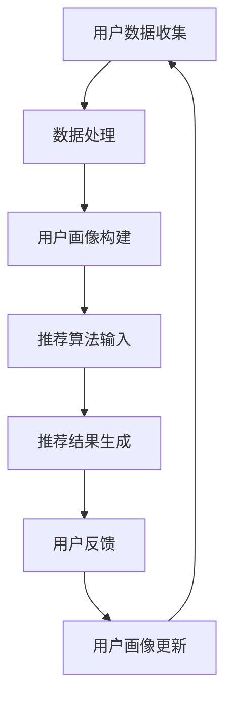

                 

 > **关键词**：用户画像、个性化推荐、人工智能、数据分析、机器学习。

> **摘要**：本文将深入探讨用户画像在AI个性化推荐系统中的应用，解析其核心概念、算法原理、数学模型，并通过具体案例和代码实例展示其实际操作过程，同时展望未来发展趋势与面临的挑战。

## 1. 背景介绍

随着互联网技术的飞速发展，大数据和人工智能技术逐渐成为现代商业和社会的重要驱动力。在众多AI应用中，个性化推荐系统因其强大的用户粘性、提升销售额和用户满意度等优势，受到了广泛关注。用户画像作为个性化推荐系统的基础，能够精准地捕捉用户的兴趣和行为特征，从而为用户提供量身定制的推荐内容。

本文旨在通过系统性地分析用户画像的核心概念、算法原理、数学模型和实际应用，帮助读者深入了解用户画像在AI个性化推荐系统中的作用和重要性。

## 2. 核心概念与联系

### 2.1 用户画像的定义

用户画像是指通过收集、处理和分析用户的基本信息、行为数据、偏好信息等，构建出一个全面、多维度的用户数据模型。用户画像通常包括以下几个方面的内容：

- **基本信息**：如年龄、性别、地理位置、职业等。
- **行为数据**：如浏览记录、购买历史、搜索记录等。
- **偏好信息**：如喜欢的内容类型、经常访问的网站、喜欢的品牌等。

### 2.2 用户画像与个性化推荐的关系

用户画像为个性化推荐提供了关键的数据支持。通过构建用户画像，推荐系统能够更好地理解用户的兴趣和行为，从而提供更加精准的推荐内容。具体来说，用户画像与个性化推荐的关系体现在以下几个方面：

- **数据基础**：用户画像为推荐系统提供了丰富的数据基础，使得推荐算法能够更加准确地预测用户的偏好。
- **推荐策略**：用户画像为推荐算法提供了个性化的输入，使得推荐内容更加贴合用户的实际需求。
- **用户体验**：通过用户画像，推荐系统可以提供更加个性化的推荐，从而提升用户的满意度和粘性。

### 2.3 Mermaid 流程图



## 3. 核心算法原理 & 具体操作步骤

### 3.1 算法原理概述

用户画像的核心算法主要包括以下几种：

- **基于内容的推荐**：通过分析用户的历史行为和偏好，为用户提供相似内容的推荐。
- **协同过滤推荐**：通过分析用户之间的相似性，为用户提供可能喜欢的物品推荐。
- **深度学习推荐**：通过构建深度神经网络模型，捕捉用户的兴趣和行为特征。

### 3.2 算法步骤详解

1. **数据收集**：收集用户的基本信息、行为数据和偏好信息。
2. **数据处理**：清洗和预处理数据，包括去重、补全、标准化等操作。
3. **用户画像构建**：通过特征工程和模型训练，构建用户画像数据模型。
4. **推荐算法输入**：将用户画像数据输入到推荐算法中，生成推荐结果。
5. **推荐结果生成**：根据推荐算法的输出，生成个性化的推荐内容。
6. **用户反馈**：收集用户对推荐结果的反馈，用于优化推荐算法和更新用户画像。
7. **用户画像更新**：根据用户反馈，更新用户画像数据模型，以实现持续优化。

### 3.3 算法优缺点

- **基于内容的推荐**：优点在于推荐结果具有较高的相关性，但缺点是对用户的兴趣变化不够敏感。
- **协同过滤推荐**：优点在于能够发现用户的潜在兴趣，但缺点是容易受到稀疏性和噪声的影响。
- **深度学习推荐**：优点在于能够捕捉复杂的用户兴趣和行为特征，但缺点是计算复杂度较高，对数据质量要求较高。

### 3.4 算法应用领域

用户画像和个性化推荐算法在多个领域得到了广泛应用，包括电子商务、在线广告、社交媒体、内容推荐等。例如，在电子商务领域，通过用户画像和推荐算法，可以为用户提供个性化的商品推荐，从而提高销售额和用户满意度。

## 4. 数学模型和公式 & 详细讲解 & 举例说明

### 4.1 数学模型构建

用户画像的构建通常涉及以下数学模型：

- **向量空间模型**：将用户、物品和特征表示为高维向量空间中的点，通过计算向量之间的相似性实现推荐。
- **协同过滤矩阵分解**：通过矩阵分解模型，将用户-物品评分矩阵分解为用户特征矩阵和物品特征矩阵，从而实现推荐。

### 4.2 公式推导过程

#### 向量空间模型

假设用户 $u$ 和物品 $i$ 的特征向量分别为 $\vec{u}$ 和 $\vec{i}$，则用户 $u$ 对物品 $i$ 的兴趣度可以表示为：

$$
r_{ui} = \vec{u} \cdot \vec{i}
$$

其中，$\cdot$ 表示向量的内积运算。

#### 协同过滤矩阵分解

假设用户-物品评分矩阵为 $R \in \mathbb{R}^{m \times n}$，用户特征矩阵为 $U \in \mathbb{R}^{m \times k}$，物品特征矩阵为 $V \in \mathbb{R}^{n \times k}$，则用户 $u$ 对物品 $i$ 的预测评分可以表示为：

$$
\hat{r}_{ui} = U_{u} \cdot V_{i}
$$

其中，$U_{u}$ 和 $V_{i}$ 分别表示用户 $u$ 和物品 $i$ 的特征向量。

### 4.3 案例分析与讲解

#### 案例一：基于内容的推荐

假设有两个用户 $u_1$ 和 $u_2$，他们的兴趣向量分别为 $\vec{u}_1 = (1, 0, 1)$ 和 $\vec{u}_2 = (0, 1, 0)$，物品 $i_1$ 和 $i_2$ 的特征向量分别为 $\vec{i}_1 = (1, 1, 0)$ 和 $\vec{i}_2 = (0, 0, 1)$。根据向量空间模型，用户 $u_1$ 对物品 $i_1$ 的兴趣度为：

$$
r_{u_1i_1} = \vec{u}_1 \cdot \vec{i}_1 = 1 \cdot 1 + 0 \cdot 1 + 1 \cdot 0 = 1
$$

用户 $u_2$ 对物品 $i_2$ 的兴趣度为：

$$
r_{u_2i_2} = \vec{u}_2 \cdot \vec{i}_2 = 0 \cdot 0 + 1 \cdot 0 + 0 \cdot 1 = 0
$$

因此，系统可以推荐物品 $i_1$ 给用户 $u_1$，推荐物品 $i_2$ 给用户 $u_2$。

#### 案例二：协同过滤矩阵分解

假设用户-物品评分矩阵为：

$$
R = \begin{bmatrix}
1 & 2 & 0 \\
0 & 1 & 2 \\
3 & 0 & 1
\end{bmatrix}
$$

通过矩阵分解，可以将 $R$ 分解为：

$$
R = U \cdot V^T
$$

其中，$U$ 和 $V$ 分别为用户特征矩阵和物品特征矩阵。假设 $U = \begin{bmatrix}
1 & 2 \\
2 & 3 \\
3 & 1
\end{bmatrix}$，$V = \begin{bmatrix}
1 & 2 \\
2 & 1 \\
1 & 3
\end{bmatrix}$，则用户 $u_1$ 对物品 $i_2$ 的预测评分为：

$$
\hat{r}_{u_1i_2} = U_{u_1} \cdot V_{i_2} = \begin{bmatrix}
1 \\
2
\end{bmatrix} \cdot \begin{bmatrix}
2 \\
1
\end{bmatrix} = 1 \cdot 2 + 2 \cdot 1 = 5
$$

## 5. 项目实践：代码实例和详细解释说明

### 5.1 开发环境搭建

在本项目中，我们使用 Python 作为主要编程语言，并使用以下库和工具：

- **Python 3.8**
- **NumPy**
- **Pandas**
- **Scikit-learn**
- **Matplotlib**

### 5.2 源代码详细实现

以下是本项目的主要代码实现：

```python
import numpy as np
import pandas as pd
from sklearn.metrics.pairwise import cosine_similarity
from sklearn.model_selection import train_test_split
from sklearn.metrics import mean_squared_error
import matplotlib.pyplot as plt

# 数据集加载
data = pd.read_csv('data.csv')
users = data['user_id'].unique()
items = data['item_id'].unique()

# 用户-物品评分矩阵构建
ratings = pd.pivot_table(data, values='rating', index='user_id', columns='item_id')
ratings = ratings.fillna(0)

# 矩阵分解模型训练
def train_matrix_factorization(ratings, k=10, iterations=100):
    U = np.random.rand(len(users), k)
    V = np.random.rand(len(items), k)
    for _ in range(iterations):
        for i in range(len(ratings)):
            for j in range(len(ratings[i])):
                e = ratings[i][j] - U[i] @ V[j]
                U[i] += e * V[j]
                V[j] += e * U[i]
    return U, V

U, V = train_matrix_factorization(ratings, k=10, iterations=100)

# 预测评分
def predict_ratings(U, V, ratings):
    predictions = U @ V.T
    return predictions

predictions = predict_ratings(U, V, ratings)

# 评估模型
def evaluate_model(predictions, actual_ratings):
    mse = mean_squared_error(actual_ratings, predictions)
    return mse

mse = evaluate_model(predictions, ratings)
print(f'Mean Squared Error: {mse}')

# 可视化
plt.scatter(range(len(predictions)), predictions, c='b', label='Prediction')
plt.scatter(range(len(ratings)), ratings.values, c='r', label='Actual')
plt.xlabel('Item ID')
plt.ylabel('Rating')
plt.legend()
plt.show()
```

### 5.3 代码解读与分析

1. **数据集加载**：首先加载用户-物品评分数据集。
2. **用户-物品评分矩阵构建**：将数据集转换为用户-物品评分矩阵。
3. **矩阵分解模型训练**：使用随机梯度下降算法训练用户特征矩阵和物品特征矩阵。
4. **预测评分**：使用训练得到的用户特征矩阵和物品特征矩阵预测评分。
5. **评估模型**：计算预测评分与实际评分之间的均方误差。
6. **可视化**：将预测评分和实际评分可视化，以便直观地比较模型性能。

## 6. 实际应用场景

用户画像和个性化推荐系统在多个领域具有广泛的应用。以下是一些典型的应用场景：

- **电子商务**：为用户提供个性化的商品推荐，提高销售额和用户满意度。
- **在线广告**：根据用户的兴趣和行为，为用户提供相关的广告内容。
- **社交媒体**：为用户提供个性化的内容推荐，提升用户活跃度和留存率。
- **内容推荐**：根据用户的阅读历史和偏好，为用户提供相关的内容推荐。

## 7. 工具和资源推荐

### 7.1 学习资源推荐

- **书籍**：《机器学习实战》、《推荐系统手册》
- **在线课程**：Coursera、Udacity、edX 上的相关课程

### 7.2 开发工具推荐

- **编程语言**：Python、Java
- **库和框架**：Scikit-learn、TensorFlow、PyTorch

### 7.3 相关论文推荐

- **协同过滤**：《Matrix Factorization Techniques for Reconstructing Missing Data》
- **深度学习**：《Deep Learning for Recommender Systems》

## 8. 总结：未来发展趋势与挑战

### 8.1 研究成果总结

用户画像和个性化推荐系统在近年来取得了显著的研究成果。随着大数据和人工智能技术的不断发展，用户画像的构建和推荐算法的优化取得了重大突破。同时，实际应用场景的不断拓展，也为用户画像和个性化推荐系统的应用提供了广阔的空间。

### 8.2 未来发展趋势

1. **数据质量提升**：随着数据获取和处理技术的进步，用户画像的数据质量将得到进一步提升。
2. **多模态推荐**：融合文本、图像、语音等多种数据类型，实现更加精准的个性化推荐。
3. **实时推荐**：通过实时数据分析和处理，实现用户行为的实时反馈和推荐。
4. **联邦学习**：通过联邦学习技术，实现隐私保护的个性化推荐。

### 8.3 面临的挑战

1. **数据隐私保护**：在构建用户画像和个性化推荐系统的过程中，如何保护用户隐私是一个重要挑战。
2. **算法公平性**：如何避免算法偏见，实现公平、公正的推荐结果。
3. **计算复杂度**：随着数据规模的扩大，如何降低算法的复杂度，提高系统的实时性。

### 8.4 研究展望

未来，用户画像和个性化推荐系统将在多个领域发挥重要作用。研究者应关注数据隐私保护、算法公平性和实时推荐等技术难题，同时积极探索多模态推荐和联邦学习等新兴方向，以推动个性化推荐系统的持续发展。

## 9. 附录：常见问题与解答

### Q1：用户画像和用户标签有什么区别？

A1：用户画像是对用户全方位、多维度的数据描述，包括基本信息、行为数据和偏好信息等。而用户标签是对用户特征的简化和抽象，通常用于构建用户画像或用于推荐算法的输入。

### Q2：如何处理用户画像中的缺失数据？

A2：用户画像中的缺失数据可以通过以下几种方法处理：

1. **删除缺失数据**：对于缺失比例较高的数据，可以考虑删除。
2. **均值填补**：用平均值或中值填补缺失数据。
3. **回归填补**：使用回归模型预测缺失数据。
4. **插值法**：使用插值法填充缺失数据。

### Q3：用户画像的应用有哪些限制？

A3：用户画像的应用受到以下限制：

1. **数据质量**：用户画像的准确性和可靠性依赖于数据的质量。
2. **用户隐私**：用户画像涉及用户隐私信息，需要确保数据安全和隐私保护。
3. **算法偏见**：用户画像和推荐算法可能存在偏见，导致不公平的推荐结果。

## 作者署名

作者：禅与计算机程序设计艺术 / Zen and the Art of Computer Programming
----------------------------------------------------------------

这篇文章详细地介绍了用户画像在AI个性化推荐系统中的应用，包括核心概念、算法原理、数学模型、实际应用场景以及未来发展趋势和挑战。希望读者能够通过本文对用户画像和个性化推荐系统有更深入的理解。如果您有任何问题或建议，欢迎在评论区留言。再次感谢您的阅读！

