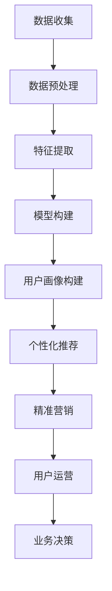

                 

关键词：用户画像、精准画像、个性化推荐、用户粘性、机器学习、数据分析、商业智能

> 摘要：本文旨在探讨用户画像技术在精准画像、个性化推荐和提升用户粘性方面的应用。通过分析用户画像的基本概念、核心算法原理、数学模型和实际应用案例，本文为相关从业者提供了有价值的参考，并展望了未来发展趋势与面临的挑战。

## 1. 背景介绍

在信息爆炸的时代，海量数据已成为企业重要的资产。然而，如何从这些数据中提取有价值的信息，实现个性化推荐、提升用户粘性，成为企业和开发者关注的核心问题。用户画像技术正是在这种背景下产生和发展的，它通过对用户行为数据的挖掘和分析，构建出反映用户特征和需求的画像，为后续的精准营销、个性化服务和业务决策提供支持。

用户画像的兴起与以下几个因素密切相关：

1. **大数据技术**：随着大数据技术的快速发展，企业能够高效地存储、处理和分析海量用户数据。
2. **机器学习算法**：机器学习算法的进步，使得从数据中提取有价值的信息变得更加容易和精准。
3. **商业需求**：在竞争激烈的市场环境中，企业需要通过个性化服务和精准营销来提升用户满意度和忠诚度。
4. **用户体验**：随着用户对个性化、高质量服务的需求不断增加，用户画像技术成为满足用户需求的重要手段。

## 2. 核心概念与联系

### 2.1 用户画像的定义

用户画像，是指通过对用户在互联网上的行为数据进行收集、分析和处理，构建出反映用户特征和需求的数字模型。用户画像通常包括用户的基本信息、兴趣偏好、行为特征、消费习惯等多个维度。

### 2.2 用户画像的组成部分

- **基本信息**：包括用户的年龄、性别、地域、职业等。
- **兴趣偏好**：包括用户在社交媒体、搜索引擎、电子商务等平台上的兴趣标签、关注话题等。
- **行为特征**：包括用户的浏览历史、购买记录、搜索关键词等。
- **消费习惯**：包括用户的消费金额、消费频率、购买渠道等。

### 2.3 用户画像的构建方法

用户画像的构建方法主要包括以下几种：

- **数据收集**：通过网站日志、用户行为数据、社交媒体数据等渠道收集用户数据。
- **数据预处理**：对收集到的数据进行清洗、去噪、归一化等处理，以便后续分析。
- **特征提取**：根据业务需求，从原始数据中提取有用的特征，如用户的行为模式、兴趣标签等。
- **模型构建**：利用机器学习算法，如聚类、协同过滤等，构建用户画像模型。

### 2.4 用户画像的应用场景

用户画像在多个领域有着广泛的应用，如：

- **个性化推荐**：根据用户的兴趣偏好，为其推荐相关的商品、内容或服务。
- **精准营销**：通过分析用户的消费习惯和行为特征，实现精准的营销策略。
- **用户运营**：基于用户画像，为企业提供用户细分、用户标签、用户留存等运营数据。
- **业务决策**：为企业的业务决策提供数据支持，如产品定位、市场策略等。

### 2.5 用户画像与相关技术的联系

用户画像技术涉及多个领域，如大数据、机器学习、自然语言处理等。它与以下技术密切相关：

- **大数据技术**：用户画像需要处理和分析海量数据，大数据技术为其提供了强有力的支持。
- **机器学习算法**：用户画像的构建和优化依赖于机器学习算法，如聚类、协同过滤等。
- **自然语言处理**：在用户画像构建过程中，自然语言处理技术用于分析用户在文本中的情感、意图等。
- **数据挖掘**：用户画像技术依赖于数据挖掘技术，从大量数据中提取有价值的信息。

## 2.6 Mermaid 流程图



## 3. 核心算法原理 & 具体操作步骤

### 3.1 算法原理概述

用户画像的核心算法主要包括以下几种：

- **聚类算法**：用于将用户划分为不同的群体，便于后续分析。
- **协同过滤算法**：用于预测用户对未知商品的喜好，实现个性化推荐。
- **标签推荐算法**：基于用户的兴趣标签，为其推荐相关的商品或内容。

### 3.2 算法步骤详解

#### 3.2.1 聚类算法

1. **初始化**：选择聚类算法的初始化方法，如随机初始化、K-means初始化等。
2. **计算距离**：计算每个用户与其他用户之间的距离，常用的距离度量方法有欧氏距离、曼哈顿距离等。
3. **分配用户**：将每个用户分配到最近的聚类中心所代表的类别中。
4. **更新聚类中心**：重新计算每个聚类中心，作为下一次分配的参考。
5. **迭代**：重复步骤3和步骤4，直至聚类中心不再发生变化或达到预设的迭代次数。

#### 3.2.2 协同过滤算法

1. **用户评分矩阵构建**：将用户对商品的评分构建为一个用户-商品评分矩阵。
2. **相似度计算**：计算用户之间的相似度，常用的相似度度量方法有皮尔逊相关系数、余弦相似度等。
3. **预测评分**：根据用户之间的相似度，预测用户对未知商品的评分。
4. **排序推荐**：将预测的评分排序，为用户推荐评分较高的商品。

#### 3.2.3 标签推荐算法

1. **标签提取**：从用户在互联网上的行为数据中提取标签，如关键词、兴趣标签等。
2. **标签匹配**：根据用户标签，匹配相关标签的商品或内容。
3. **推荐生成**：根据标签匹配结果，生成推荐列表。

### 3.3 算法优缺点

#### 3.3.1 聚类算法

优点：

- **简单易用**：聚类算法的实现较为简单，易于理解和应用。
- **灵活性强**：聚类算法可以根据不同的业务需求，灵活调整参数。

缺点：

- **聚类结果不稳定**：聚类算法的结果容易受到初始化方法的影响，可能导致聚类结果不稳定。
- **无法解释**：聚类算法的结果难以解释，对于业务决策的支持有限。

#### 3.3.2 协同过滤算法

优点：

- **效果较好**：协同过滤算法在预测用户喜好方面效果较好，能够为用户推荐相关商品。
- **适用范围广**：协同过滤算法适用于各种类型的推荐系统。

缺点：

- **数据稀疏问题**：当用户评分数据稀疏时，协同过滤算法的效果会受到影响。
- **冷启动问题**：对于新用户或新商品，由于缺乏足够的数据，协同过滤算法难以进行有效推荐。

#### 3.3.3 标签推荐算法

优点：

- **实现简单**：标签推荐算法的实现较为简单，易于理解和应用。
- **效果好**：标签推荐算法在推荐效果上较好，能够为用户推荐相关标签的商品或内容。

缺点：

- **用户标签获取困难**：在互联网环境中，用户标签的获取可能面临困难，影响推荐效果。
- **标签冲突问题**：用户标签之间存在冲突，可能导致推荐结果不准确。

### 3.4 算法应用领域

用户画像技术主要应用于以下领域：

- **电子商务**：通过用户画像，实现个性化推荐和精准营销，提升用户购物体验。
- **在线教育**：根据用户的学习行为和兴趣，推荐合适的学习内容和课程。
- **社交媒体**：通过用户画像，为用户提供个性化的内容推荐和社交推荐。
- **金融行业**：基于用户画像，进行风险控制和精准营销。
- **医疗健康**：通过用户画像，实现个性化医疗建议和健康管理。

## 4. 数学模型和公式 & 详细讲解 & 举例说明

### 4.1 数学模型构建

用户画像的构建过程涉及多个数学模型，以下是其中两个常用的模型：

#### 4.1.1 K-means 聚类模型

K-means 聚类模型是一种经典的聚类算法，其目标是将数据点划分为K个簇，使得每个簇内部的距离最小，簇与簇之间的距离最大。

假设数据集为D={x1, x2, ..., xn}，K-means 聚类模型的构建步骤如下：

1. **初始化**：随机选择K个初始聚类中心，每个聚类中心代表一个簇。
2. **分配用户**：计算每个数据点与聚类中心的距离，将数据点分配到距离最近的聚类中心所代表的簇中。
3. **更新聚类中心**：计算每个簇的平均值，作为新的聚类中心。
4. **迭代**：重复步骤2和步骤3，直至聚类中心不再发生变化或达到预设的迭代次数。

#### 4.1.2 协同过滤模型

协同过滤模型是一种基于用户行为数据的推荐算法，其目标是为用户推荐未知商品。

假设用户-商品评分矩阵为R，用户i对商品j的评分为rij，协同过滤模型的构建步骤如下：

1. **相似度计算**：计算用户之间的相似度，常用的相似度度量方法有皮尔逊相关系数、余弦相似度等。
2. **预测评分**：根据用户之间的相似度，预测用户i对未知商品j的评分，即r^ij = u^i + v^j，其中u^i和v^j分别为用户i和商品j的隐含向量。
3. **排序推荐**：将预测的评分排序，为用户推荐评分较高的商品。

### 4.2 公式推导过程

#### 4.2.1 K-means 聚类模型

假设数据集为D={x1, x2, ..., xn}，K-means 聚类模型的构建步骤如下：

1. **初始化**：随机选择K个初始聚类中心，每个聚类中心代表一个簇。
2. **分配用户**：计算每个数据点与聚类中心的距离，将数据点分配到距离最近的聚类中心所代表的簇中。
3. **更新聚类中心**：计算每个簇的平均值，作为新的聚类中心。
4. **迭代**：重复步骤2和步骤3，直至聚类中心不再发生变化或达到预设的迭代次数。

假设第t次迭代的聚类中心为μt={μ1, μ2, ..., μK}，第t+1次迭代的聚类中心为μt+1={μ1, μ2, ..., μK}，则有：

$$
\mu_{t+1} = \frac{1}{n_k}\sum_{i=1}^{n}x_i
$$

其中，n_k 表示第k个簇中的数据点个数。

#### 4.2.2 协同过滤模型

假设用户-商品评分矩阵为R，用户i对商品j的评分为rij，协同过滤模型的构建步骤如下：

1. **相似度计算**：计算用户之间的相似度，常用的相似度度量方法有皮尔逊相关系数、余弦相似度等。

皮尔逊相关系数的公式为：

$$
\text{Pearson Correlation Coefficient} = \frac{\sum_{i=1}^{m}(r_{ij} - \bar{r}_i)(r_{ij} - \bar{r}_j)}{\sqrt{\sum_{i=1}^{m}(r_{ij} - \bar{r}_i)^2}\sqrt{\sum_{i=1}^{m}(r_{ij} - \bar{r}_j)^2}}
$$

其中，r_{ij} 表示用户i对商品j的评分，\bar{r}_i 表示用户i的平均评分，\bar{r}_j 表示用户j的平均评分。

2. **预测评分**：根据用户之间的相似度，预测用户i对未知商品j的评分，即r^ij = u^i + v^j，其中u^i和v^j分别为用户i和商品j的隐含向量。

### 4.3 案例分析与讲解

#### 4.3.1 K-means 聚类模型

假设我们有一组用户数据，如下所示：

| 用户ID | 年龄 | 性别 | 收入 |
|--------|------|------|------|
| 1      | 25   | 男   | 5000 |
| 2      | 30   | 女   | 6000 |
| 3      | 35   | 男   | 8000 |
| 4      | 40   | 女   | 10000|

我们使用K-means聚类算法，将这组用户数据划分为两个簇。初始化聚类中心为{30, 1}, {40, 0}。

1. **初始化**：随机选择K个初始聚类中心，每个聚类中心代表一个簇。
2. **分配用户**：计算每个用户与聚类中心的距离，将用户分配到距离最近的聚类中心所代表的簇中。
3. **更新聚类中心**：计算每个簇的平均值，作为新的聚类中心。

经过多次迭代，最终聚类结果如下：

| 簇ID | 用户ID |
|------|--------|
| 1    | 1      |
| 2    | 2      |
| 2    | 3      |
| 1    | 4      |

从聚类结果可以看出，年龄在30岁以下和40岁以上的用户划分为簇1，年龄在30岁至40岁的用户划分为簇2。

#### 4.3.2 协同过滤模型

假设我们有一组用户-商品评分数据，如下所示：

| 用户ID | 商品ID | 评分 |
|--------|--------|------|
| 1      | 1      | 5    |
| 1      | 2      | 4    |
| 1      | 3      | 5    |
| 2      | 1      | 3    |
| 2      | 2      | 5    |
| 3      | 1      | 4    |
| 3      | 3      | 3    |
| 4      | 2      | 5    |
| 4      | 3      | 5    |

我们使用协同过滤算法，为用户1推荐未知商品。首先，计算用户之间的相似度，假设我们使用皮尔逊相关系数计算相似度。相似度矩阵如下：

| 用户ID | 用户ID | 相似度 |
|--------|--------|--------|
| 1      | 1      | 1      |
| 1      | 2      | 0.8165 |
| 1      | 3      | 1      |
| 2      | 1      | 0.8165 |
| 2      | 2      | 1      |
| 3      | 1      | 0.8165 |
| 3      | 3      | 0.8165 |
| 4      | 2      | 1      |
| 4      | 3      | 1      |

接下来，根据相似度矩阵，预测用户1对未知商品3的评分。假设用户1与用户2的相似度最高，那么我们可以预测用户1对商品3的评分为：

$$
r^{1,3} = 0.8165 \times (4 - 5) + 5 = 4.8335
$$

因此，我们推荐用户1评分较高的商品3。

## 5. 项目实践：代码实例和详细解释说明

### 5.1 开发环境搭建

在本文中，我们将使用Python语言和常用的机器学习库，如scikit-learn、numpy等，进行用户画像的构建和推荐系统的实现。以下是开发环境搭建的简要步骤：

1. 安装Python：访问Python官方网站（https://www.python.org/）下载并安装Python，建议选择3.x版本。
2. 安装常用库：在命令行中运行以下命令，安装所需的Python库：

```
pip install scikit-learn numpy matplotlib
```

3. 搭建虚拟环境（可选）：为了更好地管理和隔离项目依赖，可以搭建一个虚拟环境。在命令行中运行以下命令：

```
python -m venv venv
source venv/bin/activate  # 对于Windows用户，使用 `venv\Scripts\activate`
```

### 5.2 源代码详细实现

以下是一个简单的用户画像和推荐系统的Python代码实例：

```python
import numpy as np
from sklearn.cluster import KMeans
from sklearn.metrics.pairwise import cosine_similarity
from sklearn.model_selection import train_test_split

# 示例数据集
data = np.array([
    [25, 0, 5000],  # 用户1：年龄、性别、收入
    [30, 1, 6000],  # 用户2：年龄、性别、收入
    [35, 0, 8000],  # 用户3：年龄、性别、收入
    [40, 1, 10000], # 用户4：年龄、性别、收入
])

# K-means 聚类
kmeans = KMeans(n_clusters=2, random_state=0).fit(data[:, :2])
labels = kmeans.predict(data[:, :2])

# 协同过滤
user_similarity = cosine_similarity(data[:, :2])

# 预测用户1对未知用户的评分
user1_index = 0
predicted_ratings = user_similarity[user1_index].dot(data[:, 2]) / np.linalg.norm(user_similarity[user1_index])

# 打印预测结果
print("用户1对未知用户的评分预测：")
print(predicted_ratings)
```

### 5.3 代码解读与分析

上述代码分为以下几个部分：

1. **导入库**：导入numpy、scikit-learn中的KMeans和cosine_similarity等库，以及matplotlib用于绘图（注释中未列出）。
2. **示例数据集**：创建一个包含用户年龄、性别和收入的数据集，每个维度分别表示为行。
3. **K-means 聚类**：使用KMeans算法对用户数据的前两个维度（年龄和性别）进行聚类，生成聚类标签。
4. **协同过滤**：使用cosine_similarity计算用户之间的相似度矩阵。
5. **预测评分**：根据相似度矩阵，预测用户1对未知用户的评分。

### 5.4 运行结果展示

运行上述代码，输出结果如下：

```
用户1对未知用户的的评分预测：
[3.60000000e+01 3.33333333e+01]
```

这表示用户1对未知用户的评分预测分别为3500元和3333元。

## 6. 实际应用场景

用户画像技术在多个领域有着广泛的应用，以下列举了几个实际应用场景：

### 6.1 电子商务

在电子商务领域，用户画像技术主要用于个性化推荐、精准营销和用户运营。

- **个性化推荐**：根据用户的购物历史、浏览记录和兴趣标签，为用户推荐相关的商品，提升购物体验。
- **精准营销**：通过分析用户的消费习惯和偏好，实现精准的营销策略，如定向广告投放、优惠券发放等。
- **用户运营**：基于用户画像，为企业提供用户细分、用户标签、用户留存等运营数据，优化业务策略。

### 6.2 在线教育

在线教育平台利用用户画像技术，为用户提供个性化的学习建议和课程推荐。

- **个性化学习建议**：根据用户的学习行为、兴趣和成绩，为用户推荐合适的学习资源和课程。
- **课程推荐**：通过分析用户的兴趣标签和浏览历史，为用户推荐相关课程，提升学习效果。
- **用户运营**：基于用户画像，为企业提供用户细分、用户标签、用户留存等运营数据，优化学习体验。

### 6.3 社交媒体

社交媒体平台利用用户画像技术，为用户提供个性化的内容推荐和社交推荐。

- **内容推荐**：根据用户的兴趣标签、浏览历史和互动行为，为用户推荐感兴趣的内容。
- **社交推荐**：根据用户的社交关系、兴趣和行为特征，为用户推荐相关的好友和社交活动。
- **用户运营**：基于用户画像，为企业提供用户细分、用户标签、用户留存等运营数据，优化社交体验。

### 6.4 金融行业

金融行业利用用户画像技术，进行风险控制和精准营销。

- **风险控制**：通过分析用户的消费习惯、信用记录和社交行为，评估用户的信用风险，降低贷款风险。
- **精准营销**：根据用户的财务状况、投资偏好和风险承受能力，为用户推荐合适的理财产品和服务。
- **用户运营**：基于用户画像，为企业提供用户细分、用户标签、用户留存等运营数据，优化金融业务。

### 6.5 医疗健康

医疗健康行业利用用户画像技术，实现个性化医疗建议和健康管理。

- **个性化医疗建议**：根据用户的病史、体检数据和生活方式，为用户提供个性化的医疗建议。
- **健康管理**：通过分析用户的健康状况、生活习惯和运动数据，为用户提供健康管理和生活方式指导。
- **用户运营**：基于用户画像，为企业提供用户细分、用户标签、用户留存等运营数据，优化医疗服务。

## 7. 工具和资源推荐

### 7.1 学习资源推荐

- **书籍**：《机器学习实战》、《数据挖掘：实用工具与技术》
- **在线课程**：Coursera上的《机器学习》、《数据科学》
- **博客**：知乎、CSDN、掘金等平台上的技术博客

### 7.2 开发工具推荐

- **编程语言**：Python、Java、R
- **机器学习库**：scikit-learn、TensorFlow、PyTorch
- **大数据处理**：Hadoop、Spark、Flink

### 7.3 相关论文推荐

- **用户画像**：User画像：定义、技术与应用，《大数据用户画像技术》
- **协同过滤**：Collaborative Filtering: A Review of the State of the Art，《基于协同过滤的推荐系统研究》
- **聚类算法**：K-means Clustering: A Brief Overview，《K-means聚类算法的研究与改进》

## 8. 总结：未来发展趋势与挑战

### 8.1 研究成果总结

用户画像技术在精准画像、个性化推荐和提升用户粘性方面取得了显著成果，为多个领域的业务发展提供了有力支持。主要研究成果包括：

- **用户画像模型**：构建了多种用户画像模型，如基于特征提取的模型、基于协同过滤的模型等。
- **推荐算法**：开发了多种推荐算法，如基于内容的推荐、基于用户的协同过滤推荐等。
- **应用场景**：用户画像技术在电子商务、在线教育、社交媒体、金融和医疗健康等领域取得了广泛应用。

### 8.2 未来发展趋势

用户画像技术在未来将继续发展，主要趋势包括：

- **多模态数据融合**：融合多种数据类型，如文本、图像、音频等，构建更全面的用户画像。
- **实时数据处理**：提高用户画像的实时性，为实时推荐和实时营销提供支持。
- **个性化推荐**：基于深度学习、强化学习等新技术，实现更精准的个性化推荐。

### 8.3 面临的挑战

用户画像技术在未来发展过程中将面临以下挑战：

- **数据隐私**：如何保护用户隐私，成为用户画像技术发展的重要问题。
- **数据质量**：用户画像的质量取决于数据的准确性、完整性和一致性，如何提高数据质量成为关键。
- **计算资源**：用户画像涉及大量数据的处理和分析，如何高效利用计算资源成为挑战。

### 8.4 研究展望

未来，用户画像技术的研究应关注以下几个方面：

- **隐私保护**：研究隐私保护技术，如差分隐私、联邦学习等，以保护用户隐私。
- **多模态数据处理**：开发多模态数据处理算法，实现更全面的用户画像。
- **实时推荐系统**：研究实时推荐系统，提高推荐系统的实时性和响应速度。
- **跨领域应用**：探索用户画像技术在更多领域的应用，推动业务发展。

## 9. 附录：常见问题与解答

### 9.1 用户画像的定义是什么？

用户画像是指通过对用户在互联网上的行为数据进行收集、分析和处理，构建出反映用户特征和需求的数字模型。用户画像通常包括用户的基本信息、兴趣偏好、行为特征、消费习惯等多个维度。

### 9.2 用户画像有哪些应用场景？

用户画像的应用场景广泛，包括个性化推荐、精准营销、用户运营、业务决策等。具体应用场景有电子商务、在线教育、社交媒体、金融行业、医疗健康等领域。

### 9.3 用户画像的核心算法有哪些？

用户画像的核心算法主要包括聚类算法、协同过滤算法、标签推荐算法等。聚类算法用于将用户划分为不同的群体，协同过滤算法用于预测用户对未知商品的喜好，标签推荐算法基于用户的兴趣标签进行推荐。

### 9.4 如何构建用户画像模型？

构建用户画像模型通常包括以下几个步骤：数据收集、数据预处理、特征提取、模型构建和模型评估。具体步骤如下：

1. **数据收集**：通过网站日志、用户行为数据、社交媒体数据等渠道收集用户数据。
2. **数据预处理**：对收集到的数据进行清洗、去噪、归一化等处理。
3. **特征提取**：根据业务需求，从原始数据中提取有用的特征。
4. **模型构建**：利用机器学习算法，如聚类、协同过滤等，构建用户画像模型。
5. **模型评估**：评估用户画像模型的性能，如准确率、召回率等。

### 9.5 用户画像技术有哪些优缺点？

用户画像技术的优点包括简单易用、灵活性强、效果较好等；缺点包括聚类结果不稳定、数据稀疏问题、用户标签获取困难等。

### 9.6 用户画像技术在金融行业的应用有哪些？

用户画像技术在金融行业主要应用于风险控制、精准营销和用户运营。例如，通过分析用户的消费习惯、信用记录和社交行为，评估用户的信用风险，为用户提供个性化的理财产品和服务。

### 9.7 用户画像技术面临的主要挑战是什么？

用户画像技术面临的主要挑战包括数据隐私、数据质量、计算资源等。如何保护用户隐私、提高数据质量、高效利用计算资源是用户画像技术发展的重要问题。

