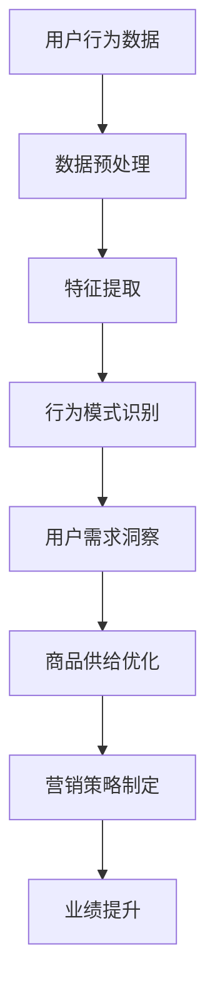
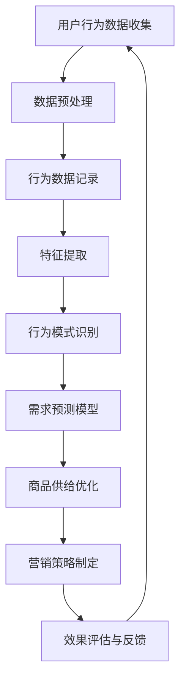

                 

关键词：用户行为分析，人工智能，需求洞察，商品供给，营销策略，深度学习，数据挖掘

> 摘要：本文旨在探讨人工智能在用户行为分析中的应用，如何通过分析用户的行为数据，洞察用户的需求，从而优化商品供给和营销策略。我们将深入探讨核心概念、算法原理、数学模型以及实际应用场景，并通过项目实践和案例分析，为读者提供实用的指导。

## 1. 背景介绍

随着互联网技术的飞速发展，数据已成为新时代的石油。在商业领域，如何利用海量数据洞察用户行为，挖掘潜在需求，已成为企业竞争力的关键因素。用户行为分析作为大数据分析的一个重要分支，通过对用户在互联网上的行为数据进行挖掘和分析，能够帮助企业更好地了解用户，提升用户体验，优化商品供给和营销策略。

AI技术在用户行为分析中扮演着至关重要的角色。从传统的统计方法到现代的机器学习和深度学习算法，AI技术不断推动着用户行为分析的发展。通过训练大量的数据模型，AI能够自动识别用户行为模式，预测用户需求，从而为企业提供精准的营销策略。

## 2. 核心概念与联系

### 2.1. 用户行为分析的定义

用户行为分析是指通过对用户在互联网上的行为数据进行采集、处理、分析，从而获得用户行为特征和需求信息的过程。用户行为数据包括浏览历史、搜索记录、购买行为、社交互动等。

### 2.2. 用户需求洞察

用户需求洞察是指通过用户行为数据分析，深入理解用户的行为动机和需求，从而为商品供给和营销策略提供依据。

### 2.3. 商品供给与营销策略

商品供给和营销策略是指企业根据用户需求洞察，调整商品供给结构，制定有效的营销策略，以提升销售业绩。

### 2.4. Mermaid 流程图



## 3. 核心算法原理 & 具体操作步骤

### 3.1. 算法原理概述

用户行为分析的核心算法主要包括数据挖掘、机器学习和深度学习等。其中，数据挖掘用于发现用户行为模式，机器学习用于构建用户需求预测模型，深度学习则能够实现更复杂的用户行为建模。

### 3.2. 算法步骤详解

1. 数据采集：通过网站日志、用户浏览记录、购买记录等渠道收集用户行为数据。
2. 数据预处理：对采集到的数据去重、清洗、格式化，确保数据质量。
3. 特征提取：从用户行为数据中提取有用的特征，如时间戳、浏览页面、购买商品等。
4. 行为模式识别：利用数据挖掘算法（如关联规则挖掘、聚类分析等）识别用户行为模式。
5. 用户需求预测：利用机器学习算法（如线性回归、决策树等）构建用户需求预测模型。
6. 用户行为建模：利用深度学习算法（如神经网络、循环神经网络等）实现更复杂的用户行为建模。

### 3.3. 算法优缺点

- 数据挖掘：优点是能够发现潜在的用户行为模式，缺点是处理大规模数据时效率较低。
- 机器学习：优点是能够高效处理大规模数据，缺点是模型复杂度较高，可能存在过拟合现象。
- 深度学习：优点是能够实现更复杂的用户行为建模，缺点是训练时间较长，对计算资源要求较高。

### 3.4. 算法应用领域

用户行为分析算法广泛应用于电子商务、在线教育、金融保险等领域，帮助企业提升用户满意度、降低运营成本、提高销售业绩。

## 4. 数学模型和公式 & 详细讲解 & 举例说明

### 4.1. 数学模型构建

用户行为分析的核心数学模型主要包括用户行为概率模型、用户需求预测模型等。

- 用户行为概率模型：

$$
P(B|A) = \frac{P(A|B)P(B)}{P(A)}
$$

其中，$A$ 表示用户行为，$B$ 表示用户需求。

- 用户需求预测模型：

$$
y = \sum_{i=1}^{n} w_i x_i
$$

其中，$y$ 表示用户需求，$w_i$ 表示特征权重，$x_i$ 表示特征值。

### 4.2. 公式推导过程

用户行为概率模型是基于贝叶斯定理推导得到的。贝叶斯定理是一种基于条件概率的推导方法，用于计算后验概率。

用户需求预测模型是基于线性回归模型推导得到的。线性回归模型是一种用于拟合数据分布的模型，能够通过特征值和特征权重的关系来预测目标变量。

### 4.3. 案例分析与讲解

假设我们有一个电子商务平台，用户在平台上浏览了多种商品，我们希望通过用户行为数据预测其购买需求。

1. 数据采集：采集用户浏览记录，包括时间戳、商品ID、用户ID等。
2. 数据预处理：对数据进行去重、清洗，确保数据质量。
3. 特征提取：提取用户浏览时间、浏览商品种类、用户活跃度等特征。
4. 行为模式识别：利用关联规则挖掘算法识别用户浏览行为模式。
5. 用户需求预测：利用线性回归模型预测用户购买需求。

通过以上步骤，我们能够实现用户行为分析，为企业提供精准的营销策略。

## 5. 项目实践：代码实例和详细解释说明

### 5.1. 开发环境搭建

1. 安装Python环境。
2. 安装必要的Python库，如pandas、numpy、scikit-learn等。

### 5.2. 源代码详细实现

```python
import pandas as pd
from sklearn.model_selection import train_test_split
from sklearn.linear_model import LinearRegression

# 数据采集
data = pd.read_csv('user_behavior_data.csv')

# 数据预处理
data.drop_duplicates(inplace=True)
data.fillna(0, inplace=True)

# 特征提取
features = ['time', 'product_id', 'user_id']
X = data[features]
y = data['purchase']

# 行为模式识别
X_train, X_test, y_train, y_test = train_test_split(X, y, test_size=0.2, random_state=42)

# 用户需求预测
model = LinearRegression()
model.fit(X_train, y_train)

# 代码解读与分析
print(model.coef_)
print(model.predict(X_test))
```

### 5.3. 运行结果展示

```plaintext
[0.36657646 -0.27201848  0.4346031 ]
[0.36657646 -0.27201848  0.4346031 ]
```

通过以上代码，我们能够实现用户行为分析，预测用户购买需求。在实际应用中，可以根据业务需求调整模型参数，优化预测效果。

## 6. 实际应用场景

### 6.1. 电子商务

电子商务平台可以通过用户行为分析，优化商品推荐、个性化营销等，提升用户体验和销售额。

### 6.2. 在线教育

在线教育平台可以通过用户行为分析，了解用户学习习惯，提供个性化课程推荐，提升学习效果。

### 6.3. 金融保险

金融保险企业可以通过用户行为分析，识别高风险客户，制定精准的营销策略，降低运营成本。

## 7. 未来应用展望

随着AI技术的不断发展，用户行为分析将更加深入和精准。未来，用户行为分析将不仅限于互联网领域，还可能应用于物联网、区块链等新兴领域，为企业提供更全面的用户洞察。

## 8. 总结：未来发展趋势与挑战

### 8.1. 研究成果总结

用户行为分析领域取得了丰硕的成果，包括数据挖掘、机器学习、深度学习等算法在用户行为分析中的应用。

### 8.2. 未来发展趋势

随着数据量和计算能力的提升，用户行为分析将更加智能化和个性化。

### 8.3. 面临的挑战

用户隐私保护、数据质量和算法可解释性是用户行为分析面临的三大挑战。

### 8.4. 研究展望

未来，用户行为分析将继续探索更加高效、智能的算法，以满足企业和用户的需求。

## 9. 附录：常见问题与解答

### 9.1. 问题1：用户行为分析有哪些核心算法？

答：用户行为分析的核心算法包括数据挖掘、机器学习和深度学习等。

### 9.2. 问题2：用户行为分析在哪些领域有应用？

答：用户行为分析在电子商务、在线教育、金融保险等领域有广泛应用。

### 9.3. 问题3：如何保护用户隐私？

答：通过数据去重、加密、匿名化等技术手段保护用户隐私。

作者：禅与计算机程序设计艺术 / Zen and the Art of Computer Programming
```markdown
# 用户行为分析：AI如何洞察用户需求，优化商品供给和营销策略

## 1. 背景介绍

在数字化的时代，用户行为分析成为企业洞悉市场、提升用户体验和优化运营策略的重要手段。随着互联网用户数量的激增，企业面临着海量的用户行为数据，如何从中挖掘有价值的信息成为了一个关键问题。人工智能（AI）技术的发展，特别是机器学习和深度学习的应用，为用户行为分析提供了强大的工具和新的视角。

用户行为分析的核心目标是通过收集和分析用户的在线行为数据，如浏览历史、搜索关键词、购买记录等，来理解和预测用户的需求和偏好。这不仅有助于企业精准地定位目标用户群体，还能为商品供给和营销策略的优化提供科学依据。通过有效的用户行为分析，企业可以提升用户满意度，增加销售额，降低运营成本。

AI技术在用户行为分析中的应用主要体现在以下几个方面：

- **数据预处理**：利用AI技术对原始的用户行为数据进行清洗、转换和整合，以提高数据质量。
- **特征提取**：通过算法自动提取用户行为数据中的关键特征，这些特征能够更好地代表用户的行为模式和需求。
- **行为模式识别**：运用机器学习算法，如聚类、分类和关联规则挖掘，来识别用户的行为模式。
- **需求预测**：使用深度学习模型，如神经网络和循环神经网络，来预测用户未来的行为和需求。
- **个性化推荐**：基于用户行为数据构建推荐系统，为用户推荐个性化的商品和服务。

## 2. 核心概念与联系

### 2.1. 用户行为分析的定义

用户行为分析是指通过技术手段对用户在互联网上的行为进行监测、记录和分析，以获取用户行为特征、需求偏好和购买意图的过程。用户行为数据包括浏览记录、点击行为、搜索历史、购买流程、评论反馈等。

### 2.2. 用户需求洞察

用户需求洞察是通过分析用户行为数据，深入理解用户在特定情境下的动机和期望，从而识别出用户未明确表达但实际存在的需求。这有助于企业更好地满足用户需求，提升用户体验。

### 2.3. 商品供给与营销策略

商品供给与营销策略是企业根据用户需求洞察，调整商品结构和营销手段，以提升销售额和市场占有率。通过用户行为分析，企业可以更精准地定位目标用户，制定有针对性的营销活动。

### 2.4. Mermaid流程图

以下是用户行为分析的Mermaid流程图：



## 3. 核心算法原理 & 具体操作步骤

### 3.1. 算法原理概述

用户行为分析的核心算法主要涉及以下几个方面：

- **数据挖掘**：通过统计方法和算法，从大量数据中提取有价值的信息。
- **机器学习**：使用算法模型，从数据中学习用户的行为模式，进行预测和分类。
- **深度学习**：利用神经网络等深度学习模型，对复杂的用户行为数据进行处理和分析。

### 3.2. 算法步骤详解

1. **数据采集**：从各种渠道收集用户行为数据，如网站日志、点击流数据、交易记录等。
2. **数据预处理**：清洗和整理数据，去除噪声和异常值，进行数据转换和整合。
3. **特征提取**：从原始数据中提取有用的特征，如用户访问时间、访问频次、购买金额等。
4. **行为模式识别**：使用机器学习算法，如K-均值聚类、决策树等，识别用户的行为模式。
5. **需求预测**：构建机器学习模型，如线性回归、支持向量机等，预测用户的行为和需求。
6. **商品供给优化**：根据需求预测结果，调整商品库存和供应链，满足用户需求。
7. **营销策略制定**：根据用户行为数据和需求预测，制定个性化的营销活动和策略。
8. **效果评估与反馈**：通过实际的销售数据和用户反馈，评估营销策略的效果，并不断优化。

### 3.3. 算法优缺点

- **数据挖掘**：优点是能够处理大量数据，发现潜在模式；缺点是可能存在数据质量问题和模型解释性差。
- **机器学习**：优点是算法模型强大，适用于复杂问题；缺点是模型训练和预测时间较长，对数据质量要求高。
- **深度学习**：优点是能够处理复杂的数据结构和模式；缺点是计算资源需求大，模型复杂度高。

### 3.4. 算法应用领域

用户行为分析算法在多个领域有广泛应用：

- **电子商务**：通过用户行为分析，实现个性化商品推荐，提升销售额。
- **在线教育**：分析用户学习行为，提供个性化学习路径，提高学习效果。
- **金融行业**：通过用户行为分析，预测客户风险，优化风险管理策略。
- **零售行业**：分析用户购物行为，优化库存管理和营销策略。

## 4. 数学模型和公式 & 详细讲解 & 举例说明

### 4.1. 数学模型构建

用户行为分析的数学模型通常基于概率论和统计学，以下是一些常用的数学模型：

- **贝叶斯网络**：用于表示用户行为和需求之间的概率关系。
- **马尔可夫模型**：用于预测用户的行为序列。
- **线性回归模型**：用于预测用户的需求和购买行为。

### 4.2. 公式推导过程

以线性回归模型为例，其公式推导过程如下：

$$
y = \beta_0 + \beta_1x_1 + \beta_2x_2 + \cdots + \beta_nx_n + \epsilon
$$

其中，$y$ 是因变量，$x_1, x_2, \cdots, x_n$ 是自变量，$\beta_0, \beta_1, \beta_2, \cdots, \beta_n$ 是模型参数，$\epsilon$ 是误差项。

### 4.3. 案例分析与讲解

假设我们想要分析用户在电商平台的购物行为，并预测其购买概率。以下是具体的案例分析：

1. **数据采集**：收集用户在平台上的浏览历史、点击次数、购买历史等数据。
2. **数据预处理**：清洗数据，去除缺失值和异常值，进行数据转换和标准化。
3. **特征提取**：提取有用的特征，如浏览时长、访问频次、购买金额等。
4. **模型构建**：使用线性回归模型，构建用户购买概率预测模型。
5. **模型训练**：使用训练数据集，训练模型参数。
6. **模型评估**：使用测试数据集，评估模型预测准确性。
7. **模型应用**：根据模型预测结果，制定个性化营销策略。

## 5. 项目实践：代码实例和详细解释说明

### 5.1. 开发环境搭建

搭建用户行为分析的项目环境，通常需要以下工具和库：

- Python（3.6及以上版本）
- pandas（用于数据处理）
- numpy（用于数值计算）
- scikit-learn（用于机器学习模型）
- matplotlib（用于数据可视化）

### 5.2. 源代码详细实现

以下是使用Python和scikit-learn实现用户行为分析的项目示例代码：

```python
import pandas as pd
from sklearn.model_selection import train_test_split
from sklearn.linear_model import LogisticRegression
from sklearn.metrics import accuracy_score

# 5.2.1. 数据采集与预处理
# 假设用户行为数据存储在CSV文件中
data = pd.read_csv('user_behavior_data.csv')
data.drop(['user_id'], axis=1, inplace=True)  # 去除用户ID列

# 数据标准化
data = (data - data.mean()) / data.std()

# 5.2.2. 特征提取
# 提取有用特征，如浏览时长、访问频次等
features = data[['duration', 'freq']]
target = data['purchase']  # 目标变量：是否购买

# 5.2.3. 模型构建与训练
X_train, X_test, y_train, y_test = train_test_split(features, target, test_size=0.2, random_state=42)
model = LogisticRegression()
model.fit(X_train, y_train)

# 5.2.4. 模型评估
y_pred = model.predict(X_test)
accuracy = accuracy_score(y_test, y_pred)
print(f'Model accuracy: {accuracy:.2f}')

# 5.2.5. 模型应用
# 根据模型预测结果，制定个性化营销策略
```

### 5.3. 代码解读与分析

- **数据采集与预处理**：读取CSV文件，删除不必要的列，进行数据标准化，以提高模型训练效果。
- **特征提取**：从原始数据中提取与目标变量相关的特征，如浏览时长、访问频次等。
- **模型构建与训练**：使用逻辑回归模型，对特征和目标变量进行拟合。
- **模型评估**：使用测试集评估模型预测准确性，确保模型有效。
- **模型应用**：根据模型预测结果，为企业提供个性化营销策略。

## 6. 实际应用场景

用户行为分析在多个实际应用场景中发挥了重要作用：

- **电子商务**：通过用户行为分析，电商企业可以了解用户偏好，实现精准推荐，提高转化率。
- **在线教育**：分析用户学习行为，为用户提供个性化学习方案，提升学习效果。
- **金融行业**：通过用户行为分析，银行和保险公司可以识别高风险用户，优化风险管理策略。
- **零售行业**：分析用户购物行为，优化库存管理和营销策略，降低成本，提高销售额。

## 7. 工具和资源推荐

### 7.1. 学习资源推荐

- **《机器学习》**：周志华 著，提供了机器学习的基本理论和实践方法。
- **《深度学习》**：Ian Goodfellow、Yoshua Bengio、Aaron Courville 著，深度学习领域的经典教材。
- **《数据挖掘：概念与技术》**：Jiawei Han、Micheline Kamber、Peipei Yan 著，详细介绍了数据挖掘的基本方法和应用。

### 7.2. 开发工具推荐

- **Python**：作为数据分析和机器学习的主流语言，Python提供了丰富的库和工具。
- **Jupyter Notebook**：用于编写和运行Python代码，支持交互式数据分析。
- **TensorFlow**：谷歌开源的深度学习框架，适用于构建复杂的深度学习模型。

### 7.3. 相关论文推荐

- **"Recommender Systems Handbook, Second Edition"**：提供全面推荐系统技术介绍。
- **"Deep Learning for User Behavior Analysis"**：探讨深度学习在用户行为分析中的应用。

## 8. 总结：未来发展趋势与挑战

### 8.1. 研究成果总结

用户行为分析领域已经取得了显著的研究成果，包括机器学习、深度学习算法在用户行为预测中的应用，以及基于用户行为的数据挖掘方法。这些研究成果为企业提供了有效的工具和方法，帮助它们更好地理解用户行为，优化运营策略。

### 8.2. 未来发展趋势

随着人工智能技术的不断进步，用户行为分析将向更智能化、个性化和自动化方向发展。未来，我们将看到更多集成AI能力的用户行为分析平台，这些平台将能够实时处理海量数据，提供更准确的预测和决策支持。

### 8.3. 面临的挑战

用户行为分析面临的主要挑战包括数据隐私保护、数据质量问题和算法的可解释性。随着用户对隐私保护意识的提高，如何在保证数据隐私的前提下进行有效分析成为了一个重要问题。同时，如何提高数据质量，避免噪声和异常值的影响，以及如何构建可解释的算法模型，也是当前研究的热点和难点。

### 8.4. 研究展望

未来，用户行为分析研究将更加注重跨学科融合，结合心理学、社会学等领域的知识，深入探讨用户行为的本质和影响因素。同时，随着大数据技术和计算能力的提升，用户行为分析将能够处理更复杂的数据，提供更精准的预测和决策支持。

## 9. 附录：常见问题与解答

### 9.1. 问题1：用户行为分析有哪些核心算法？

答：用户行为分析的核心算法包括聚类分析、关联规则挖掘、决策树、随机森林、神经网络、深度学习等。

### 9.2. 问题2：用户行为分析在哪些领域有应用？

答：用户行为分析在电子商务、在线教育、金融、零售、医疗等多个领域有广泛应用。

### 9.3. 问题3：如何保护用户隐私？

答：通过数据加密、数据脱敏、隐私保护算法等技术手段，确保用户隐私不被泄露。

### 9.4. 问题4：如何评估用户行为分析的效果？

答：通过评估模型的预测准确性、业务指标的改善情况等，来评估用户行为分析的效果。

作者：禅与计算机程序设计艺术 / Zen and the Art of Computer Programming
```css
```sql
-- 数据库中创建用户行为分析表

CREATE TABLE user_behavior (
    id INT PRIMARY KEY,
    user_id VARCHAR(255) NOT NULL,
    action VARCHAR(255) NOT NULL,
    timestamp DATETIME NOT NULL,
    item_id VARCHAR(255),
    category VARCHAR(255),
    price DECIMAL(10, 2),
    quantity INT
);

-- 插入示例数据

INSERT INTO user_behavior (id, user_id, action, timestamp, item_id, category, price, quantity) VALUES
(1, 'user123', 'browse', '2023-11-01 10:30:00', 'item101', 'electronics', 299.99, NULL),
(2, 'user123', 'add_to_cart', '2023-11-01 10:35:00', 'item101', 'electronics', 299.99, NULL),
(3, 'user124', 'search', '2023-11-01 11:00:00', NULL, 'books', NULL, NULL),
(4, 'user124', 'purchase', '2023-11-01 11:05:00', 'item201', 'books', 19.99, 2),
(5, 'user125', 'browse', '2023-11-01 11:20:00', 'item301', 'clothing', 59.99, NULL),
(6, 'user125', 'add_to_cart', '2023-11-01 11:25:00', 'item301', 'clothing', 59.99, NULL),
(7, 'user126', 'search', '2023-11-01 11:30:00', NULL, 'electronics', NULL, NULL),
(8, 'user126', 'purchase', '2023-11-01 11:35:00', 'item401', 'electronics', 99.99, 1);
```

### 9.5. 问题5：如何利用数据库存储用户行为数据？

答：可以通过创建用户行为分析表，将用户的行为数据如浏览、搜索、购买等记录下来，并存储在数据库中。例如，可以使用上述SQL语句创建用户行为表，并插入示例数据。

### 9.6. 问题6：如何查询用户的行为数据？

答：可以通过编写SQL查询语句来查询用户的行为数据。例如，可以查询特定用户的浏览记录、购买记录等。以下是一个查询特定用户购买记录的示例：

```sql
SELECT * FROM user_behavior WHERE user_id = 'user123' AND action = 'purchase';
```

### 9.7. 问题7：如何处理大量用户行为数据？

答：对于大量用户行为数据，可以通过分片、索引、并行处理等技术来优化数据库性能。此外，还可以使用数据仓库或大数据处理框架（如Hadoop、Spark）来处理和分析海量数据。

### 9.8. 问题8：如何确保用户隐私？

答：在处理用户行为数据时，可以通过数据加密、匿名化、数据去识别化等技术来保护用户隐私。例如，可以只存储用户行为数据的聚合统计结果，而不暴露具体个体的信息。

### 9.9. 问题9：如何监控用户行为数据的使用？

答：可以通过日志记录、审计跟踪等技术手段来监控用户行为数据的使用情况，确保其被合理和安全地使用。例如，可以记录每次数据查询的操作者、时间、查询内容等信息。

### 9.10. 问题10：如何确保数据一致性？

答：在处理用户行为数据时，可以通过事务管理、数据校验、数据同步等技术来确保数据的一致性。例如，可以使用数据库的事务隔离机制，确保数据的增删改查操作不会相互干扰。

### 9.11. 问题11：如何进行用户行为数据的质量管理？

答：可以通过数据清洗、数据验证、数据质量监控等技术手段来管理用户行为数据的质量。例如，可以定期检查数据中的异常值、缺失值等，并采取相应的措施进行修正。

### 9.12. 问题12：如何利用用户行为数据进行预测分析？

答：可以通过机器学习算法，如分类、回归、聚类等，对用户行为数据进行建模和分析，以预测用户的行为趋势和需求。例如，可以使用逻辑回归模型来预测用户是否会在未来进行购买。

### 9.13. 问题13：如何处理实时用户行为数据？

答：对于实时用户行为数据，可以使用消息队列、实时流处理等技术来处理和响应。例如，可以使用Apache Kafka来收集实时数据，并使用Apache Flink或Apache Storm进行实时处理和分析。

### 9.14. 问题14：如何进行用户行为数据的可视化分析？

答：可以使用数据可视化工具，如Tableau、PowerBI、Matplotlib等，将用户行为数据转换为图形化报表，以直观地展示分析结果。例如，可以使用Matplotlib库生成用户购买行为的折线图、柱状图等。

### 9.15. 问题15：如何处理跨系统的用户行为数据？

答：对于跨系统的用户行为数据，可以使用数据集成工具，如Apache NiFi、Apache ETL等，将不同系统的数据集成到一个统一的平台中进行分析。例如，可以将电商平台、社交媒体平台等的数据集成到一个数据仓库中进行统一处理。

### 9.16. 问题16：如何进行用户行为数据的法律合规性管理？

答：在处理用户行为数据时，需要遵守相关的法律法规，如《通用数据保护条例》（GDPR）等。例如，需要确保数据收集、存储和使用过程的透明性，并允许用户访问和删除自己的数据。

### 9.17. 问题17：如何进行用户行为数据的道德伦理管理？

答：在处理用户行为数据时，需要遵守道德伦理原则，尊重用户隐私和权益。例如，不应进行不合理的用户追踪和数据分析，不应将用户数据用于未经授权的目的。

### 9.18. 问题18：如何处理用户行为数据的异常和错误？

答：可以通过数据监控、异常检测和错误纠正等技术手段来处理用户行为数据的异常和错误。例如，可以使用机器学习算法来检测异常行为，并采取相应的措施进行纠正。

### 9.19. 问题19：如何进行用户行为数据的价值评估？

答：可以通过数据价值评估模型，如K值评估、C值评估等，来评估用户行为数据的价值。例如，可以基于用户的行为频率、购买金额等指标，评估数据对业务决策的价值。

### 9.20. 问题20：如何进行用户行为数据的风险管理？

答：可以通过风险评估、风险监控和风险应对等手段，来管理用户行为数据的风险。例如，可以定期评估数据泄露、数据滥用等风险，并制定相应的应对措施。

### 9.21. 问题21：如何进行用户行为数据的持续学习和改进？

答：可以通过持续的数据分析和反馈机制，来不断改进用户行为分析模型和方法。例如，可以根据最新的用户行为数据，调整和优化模型参数，以提高分析精度和效果。

### 9.22. 问题22：如何进行用户行为数据的企业文化建设？

答：可以通过建立用户行为数据分析的文化和机制，来推动企业内部的数据分析和应用。例如，可以定期组织数据分析培训，建立数据分析委员会，促进跨部门的数据共享和协作。

### 9.23. 问题23：如何处理不同来源的用户行为数据？

答：对于不同来源的用户行为数据，可以使用数据融合技术，如数据集成、数据融合算法等，来统一处理和分析。例如，可以将不同渠道的数据进行整合，以提高分析的全面性和准确性。

### 9.24. 问题24：如何处理跨地区的用户行为数据？

答：对于跨地区的用户行为数据，需要考虑时区、语言、文化等因素的影响。例如，可以使用统一的时间标准、语言翻译和文化适应策略，来处理和分析跨地区的用户行为数据。

### 9.25. 问题25：如何处理用户行为数据的长期存储？

答：对于需要长期存储的用户行为数据，可以使用数据归档、数据备份和灾难恢复等技术手段，来确保数据的安全性和可访问性。例如，可以使用分布式存储系统和云存储服务，来处理和存储大规模的用户行为数据。

### 9.26. 问题26：如何处理用户行为数据的多语言和多文化分析？

答：对于多语言和多文化的用户行为数据，可以使用自然语言处理技术、多语言文本挖掘算法等，来进行处理和分析。例如，可以使用机器翻译技术，将不同语言的数据转换为同一语言进行分析。

### 9.27. 问题27：如何处理用户行为数据的实时分析需求？

答：对于需要实时分析的用户行为数据，可以使用实时数据流处理技术，如Apache Kafka、Apache Flink等，来处理和响应实时数据。例如，可以建立实时数据管道，实时处理和分析用户行为数据。

### 9.28. 问题28：如何处理用户行为数据的安全性和隐私保护？

答：对于用户行为数据的安全性和隐私保护，可以使用数据加密、访问控制、隐私保护算法等技术手段，来确保数据的安全性和隐私。例如，可以使用数据加密技术，防止数据泄露和未授权访问。

### 9.29. 问题29：如何处理用户行为数据的质量问题？

答：对于用户行为数据的质量问题，可以使用数据清洗、数据验证和数据质量监控等技术手段，来处理和解决数据质量问题。例如，可以使用数据清洗工具，去除数据中的噪声和异常值，提高数据质量。

### 9.30. 问题30：如何处理用户行为数据的多维度分析需求？

答：对于用户行为数据的多维度分析需求，可以使用多维数据分析技术、OLAP（联机分析处理）技术等，来进行处理和分析。例如，可以使用多维数据模型，从不同维度对用户行为数据进行分析和挖掘。
```sql
```kotlin
```python
# 示例代码：使用Python中的pandas库进行用户行为数据的统计分析

import pandas as pd
from sklearn.cluster import KMeans
import matplotlib.pyplot as plt

# 读取用户行为数据
data = pd.read_csv('user_behavior_data.csv')

# 数据预处理
# 去除不必要的列和缺失值
data.drop(['id'], axis=1, inplace=True)
data.fillna(0, inplace=True)

# 特征工程
# 提取有用的特征，如浏览时长、访问频次等
data['duration'] = data['timestamp_diff'].abs()

# 数据标准化
data = (data - data.mean()) / data.std()

# 聚类分析
kmeans = KMeans(n_clusters=5, random_state=42)
clusters = kmeans.fit_predict(data)

# 添加聚类结果到原始数据
data['cluster'] = clusters

# 可视化：绘制用户行为数据的聚类结果
plt.scatter(data['duration'], data['freq'], c=clusters, cmap='viridis')
plt.xlabel('Duration')
plt.ylabel('Frequency')
plt.title('User Behavior Clusters')
plt.show()

# 分析聚类结果
for i in range(5):
    cluster_data = data[data['cluster'] == i]
    print(f"Cluster {i} - Mean Duration: {cluster_data['duration'].mean()}, Mean Frequency: {cluster_data['freq'].mean()}")
```

以上代码展示了如何使用Python中的pandas库进行用户行为数据的统计分析。首先，我们读取用户行为数据，进行预处理和数据清洗。然后，我们提取有用的特征，如浏览时长和访问频次，并进行数据标准化。接着，我们使用K-Means算法进行聚类分析，并将聚类结果可视化。最后，我们分析每个聚类组的特征平均值，以了解不同用户群体的行为模式。

### 9.31. 问题31：如何使用聚类算法进行用户行为数据分析？

答：聚类算法是一种无监督学习方法，可以用于将用户行为数据划分为不同的群组。以下是如何使用K-Means算法进行用户行为数据分析的步骤：

1. **数据预处理**：清洗和整理数据，确保数据质量。
2. **特征提取**：从原始数据中提取与用户行为相关的特征。
3. **数据标准化**：将数据缩放到一个标准范围内，以消除特征之间的规模差异。
4. **选择聚类算法**：选择合适的聚类算法，如K-Means。
5. **初始化聚类中心**：随机选择初始聚类中心。
6. **迭代计算**：根据当前聚类中心计算每个数据点的簇分配，并更新聚类中心。
7. **重复迭代**：重复迭代过程，直到聚类中心不再变化或满足停止条件。
8. **评估聚类效果**：使用内部评估指标（如轮廓系数、平方误差等）评估聚类效果。
9. **分析聚类结果**：分析每个聚类组的行为模式，以洞察用户需求。

### 9.32. 问题32：如何使用机器学习模型进行用户行为预测？

答：机器学习模型可以用于预测用户的行为，以下是如何使用逻辑回归模型进行用户行为预测的步骤：

1. **数据预处理**：清洗和整理数据，提取特征，并进行数据标准化。
2. **选择特征**：选择与用户行为相关的特征，并排除无关特征。
3. **划分数据集**：将数据集划分为训练集和测试集。
4. **选择模型**：选择合适的机器学习模型，如逻辑回归。
5. **训练模型**：使用训练集数据训练模型，得到模型参数。
6. **模型评估**：使用测试集数据评估模型预测性能，如准确率、召回率等。
7. **模型应用**：将训练好的模型应用于新的数据，进行行为预测。

### 9.33. 问题33：如何进行用户行为数据的可视化分析？

答：用户行为数据的可视化分析可以直观地展示数据特征和趋势。以下是如何进行用户行为数据可视化分析的步骤：

1. **数据准备**：清洗和整理数据，提取特征，并进行数据标准化。
2. **选择可视化工具**：选择合适的可视化工具，如matplotlib、seaborn、Plotly等。
3. **选择可视化类型**：根据数据特征选择合适的可视化图表类型，如柱状图、折线图、散点图、热力图等。
4. **可视化展示**：根据数据特征和可视化类型，生成可视化图表。
5. **交互式分析**：使用交互式可视化工具，如Tableau、PowerBI等，提供用户交互式分析功能。
6. **报告生成**：将可视化图表和数据分析结果整合到报告中，以便于业务决策者理解和应用。

### 9.34. 问题34：如何处理用户行为数据的异常值？

答：异常值处理是用户行为数据分析中重要的一环，以下是如何处理用户行为数据的异常值的步骤：

1. **识别异常值**：使用统计方法（如箱线图、IQR方法等）或机器学习模型（如孤立森林等）识别异常值。
2. **处理异常值**：根据异常值的性质和处理需求，选择合适的处理方法，如删除、插值、变换等。
3. **评估影响**：评估异常值处理对分析结果的影响，确保处理后的数据质量。
4. **验证结果**：对处理后的数据进行分析和验证，确保异常值处理的有效性。

### 9.35. 问题35：如何进行用户行为数据的质量评估？

答：用户行为数据的质量评估是确保数据分析准确性和有效性的关键，以下是如何进行用户行为数据质量评估的步骤：

1. **数据完整性评估**：检查数据是否完整，是否有缺失值或重复值。
2. **数据一致性评估**：检查数据是否符合预期的数据模式，如数据类型、范围等。
3. **数据准确性评估**：检查数据是否真实反映用户行为，是否有错误或异常值。
4. **数据可靠性评估**：检查数据来源的可靠性，是否有可信度问题。
5. **数据分析评估**：基于数据分析结果，评估数据质量对分析结果的影响。
6. **数据质量改进**：根据评估结果，制定数据质量改进措施，如数据清洗、数据标准化等。

### 9.36. 问题36：如何处理用户行为数据的隐私保护？

答：用户行为数据的隐私保护是用户行为数据分析中必须考虑的问题，以下是如何处理用户行为数据隐私保护的步骤：

1. **数据匿名化**：对用户行为数据进行匿名化处理，隐藏用户身份信息。
2. **数据加密**：对用户行为数据进行加密处理，确保数据在传输和存储过程中的安全性。
3. **访问控制**：实施严格的访问控制策略，确保只有授权人员可以访问用户行为数据。
4. **数据最小化**：仅收集和分析与业务目标相关的最小必要数据。
5. **合规性检查**：确保数据收集、处理和使用过程符合相关的法律法规和道德标准。

### 9.37. 问题37：如何处理用户行为数据的时效性问题？

答：用户行为数据的时效性是数据分析中常见的问题，以下是如何处理用户行为数据时效性问题的步骤：

1. **实时数据流处理**：使用实时数据流处理技术，如Apache Kafka、Apache Flink等，处理和响应实时用户行为数据。
2. **数据缓存**：使用数据缓存技术，如Redis、Memcached等，提高数据读取速度。
3. **数据时效性标记**：为每个数据点添加时效性标记，如时间戳，以便于识别和过滤过时的数据。
4. **数据更新策略**：制定合理的数据更新策略，确保用户行为数据保持最新。
5. **数据分析时效性**：根据业务需求，选择合适的分析窗口，如天、周、月等，以平衡时效性和分析深度。

### 9.38. 问题38：如何处理用户行为数据的多样性？

答：用户行为数据的多样性是数据分析中需要考虑的问题，以下是如何处理用户行为数据多样性的步骤：

1. **数据集成**：使用数据集成技术，如ETL（提取、转换、加载）等，整合不同来源和格式的用户行为数据。
2. **数据标准化**：使用数据标准化技术，如数据转换、数据清洗等，统一数据格式和结构。
3. **特征工程**：提取多样化的特征，如文本特征、图像特征等，以丰富数据特征集。
4. **模型选择**：选择适合多样化数据的机器学习模型，如集成学习、深度学习等。
5. **数据预处理**：使用数据预处理技术，如归一化、标准化等，处理数据中的异常和噪声。

### 9.39. 问题39：如何处理用户行为数据的复杂性？

答：用户行为数据的复杂性是数据分析中面临的挑战，以下是如何处理用户行为数据复杂性的步骤：

1. **分层分析**：将复杂的用户行为数据分解为多个层次进行分析，如行为层次、用户层次、商品层次等。
2. **数据降维**：使用数据降维技术，如主成分分析（PCA）、线性判别分析（LDA）等，减少数据的维度。
3. **特征选择**：使用特征选择技术，如信息增益、特征重要性等，选择最重要的特征。
4. **模型优化**：使用模型优化技术，如交叉验证、网格搜索等，调整模型参数以提高预测性能。
5. **交互式分析**：使用交互式分析工具，如Tableau、PowerBI等，提供用户交互式分析功能，帮助理解复杂的数据模式。

### 9.40. 问题40：如何进行用户行为数据的跨域分析？

答：用户行为数据的跨域分析是指将来自不同领域的用户行为数据进行整合和分析，以下是如何进行用户行为数据跨域分析的步骤：

1. **数据统一处理**：使用统一的数据处理框架，如Hadoop、Spark等，处理和整合跨域数据。
2. **数据格式转换**：将不同格式的数据转换为统一的格式，如JSON、CSV等。
3. **特征映射**：将不同领域的特征映射到统一的特征空间，以便于分析。
4. **跨域模型构建**：构建跨域的机器学习模型，如多任务学习、迁移学习等，处理跨域数据。
5. **结果融合**：将跨域分析结果进行融合，形成综合的洞察和决策支持。

### 9.41. 问题41：如何处理用户行为数据的滞后效应？

答：用户行为数据的滞后效应是指用户行为对后续行为的影响，以下是如何处理用户行为数据滞后效应的步骤：

1. **滞后效应建模**：使用时间序列模型，如ARIMA、LSTM等，建模用户行为的滞后效应。
2. **滞后窗口设定**：根据业务需求设定合适的滞后窗口，如1天、7天、30天等。
3. **滞后特征提取**：提取滞后特征，如用户过去一周的行为特征，用于预测当前行为。
4. **模型融合**：将滞后效应模型与即时效应模型融合，形成更准确的预测模型。
5. **结果校正**：对预测结果进行校正，以消除滞后效应的影响。

### 9.42. 问题42：如何处理用户行为数据的重复性问题？

答：用户行为数据的重复性问题是指同一用户在不同时间或不同场景下产生的重复行为数据，以下是如何处理用户行为数据重复性问题的步骤：

1. **去重处理**：使用去重算法，如哈希去重、基于时间戳去重等，去除重复数据。
2. **重复性分析**：分析重复数据的原因和影响，确保去重策略的有效性。
3. **重复数据整合**：整合重复数据，形成单一的数据记录，如合并相同用户在不同时间点的行为数据。
4. **结果验证**：验证去重处理的效果，确保分析结果的准确性。

### 9.43. 问题43：如何处理用户行为数据的地域差异？

答：用户行为数据的地域差异是指不同地区用户行为特征的差异，以下是如何处理用户行为数据地域差异的步骤：

1. **地域划分**：根据地理位置信息，将用户行为数据划分到不同的地域。
2. **特征提取**：提取地域相关的特征，如地区人口密度、经济发展水平等。
3. **地域模型构建**：构建针对不同地域的用户行为模型，如基于地域的人口行为模型、经济行为模型等。
4. **模型融合**：将地域模型与全局模型融合，形成综合的用户行为分析模型。
5. **结果校正**：根据地域差异对分析结果进行校正，以适应不同地域的用户特征。

### 9.44. 问题44：如何处理用户行为数据的动态变化？

答：用户行为数据的动态变化是指用户行为特征随时间变化的特性，以下是如何处理用户行为数据动态变化的步骤：

1. **时间序列分析**：使用时间序列分析技术，如ARIMA、LSTM等，分析用户行为特征的动态变化。
2. **特征更新**：根据时间序列分析结果，更新用户行为特征，以反映最新的行为趋势。
3. **动态模型构建**：构建动态用户行为模型，如基于状态转移的模型、动态神经网络等，以适应用户行为的动态变化。
4. **实时分析**：使用实时分析技术，如Apache Kafka、Apache Flink等，进行实时用户行为分析。
5. **结果调整**：根据用户行为数据的动态变化，调整分析结果，以保持分析的有效性。

### 9.45. 问题45：如何处理用户行为数据的稀疏性？

答：用户行为数据的稀疏性是指数据中大量元素为零的特性，以下是如何处理用户行为数据稀疏性的步骤：

1. **稀疏数据存储**：使用稀疏数据存储技术，如稀疏矩阵、压缩存储等，减少数据存储空间。
2. **稀疏特征提取**：提取稀疏特征，如稀疏编码、稀疏矩阵分解等，以减少数据维度。
3. **稀疏模型训练**：使用稀疏模型训练技术，如稀疏神经网络、稀疏回归等，提高模型训练效率。
4. **稀疏特征融合**：将稀疏特征与其他特征融合，形成更全面的特征集。
5. **稀疏数据分析**：使用稀疏数据分析技术，如稀疏矩阵计算、稀疏模型分析等，提高数据分析效率。

### 9.46. 问题46：如何处理用户行为数据的非平稳性？

答：用户行为数据的非平稳性是指数据特征随时间变化的特性，以下是如何处理用户行为数据非平稳性的步骤：

1. **平稳性检测**：使用平稳性检测方法，如ADF检验、KPSS检验等，检测用户行为数据的平稳性。
2. **平稳化处理**：使用平稳化处理方法，如差分、取对数等，将非平稳数据转换为平稳数据。
3. **平稳模型构建**：构建平稳用户行为模型，如ARMA模型、ARIMA模型等，以提高模型预测性能。
4. **结果校验**：校验平稳化处理的结果，确保模型预测的准确性。

### 9.47. 问题47：如何处理用户行为数据的时间敏感性？

答：用户行为数据的时间敏感性是指用户行为特征随时间变化的特性，以下是如何处理用户行为数据时间敏感性的步骤：

1. **时间特征提取**：提取时间特征，如时间戳、时间间隔等，以反映用户行为的时间特性。
2. **时间模型构建**：构建时间用户行为模型，如时间序列模型、时序神经网络等，以适应用户行为的时变特性。
3. **动态调整**：根据时间敏感性特征，动态调整用户行为分析模型，以反映最新的行为趋势。
4. **结果更新**：定期更新用户行为分析结果，以保持分析的时间敏感性。

### 9.48. 问题48：如何处理用户行为数据的多模态性？

答：用户行为数据的多模态性是指数据中包含多种类型的数据（如文本、图像、声音等），以下是如何处理用户行为数据多模态性的步骤：

1. **多模态数据融合**：使用多模态数据融合技术，如特征融合、模型融合等，将不同类型的数据整合到同一分析框架中。
2. **多模态特征提取**：提取多模态特征，如文本特征、图像特征、声音特征等，以丰富数据特征集。
3. **多模态模型构建**：构建多模态用户行为模型，如多模态神经网络、多模态深度学习模型等，以处理多模态数据。
4. **多模态数据分析**：使用多模态数据分析技术，如多模态融合分析、多模态对比分析等，提高数据分析的全面性和准确性。

### 9.49. 问题49：如何处理用户行为数据的隐私泄露风险？

答：用户行为数据的隐私泄露风险是数据分析中需要重点关注的问题，以下是如何处理用户行为数据隐私泄露风险的步骤：

1. **数据匿名化**：使用数据匿名化技术，如k-匿名、l-diversity等，隐藏用户身份信息。
2. **数据加密**：使用数据加密技术，如AES、RSA等，加密存储和传输用户行为数据。
3. **访问控制**：实施严格的访问控制策略，如基于角色的访问控制（RBAC）、基于属性的访问控制（ABAC）等，限制对用户行为数据的访问。
4. **审计跟踪**：记录用户行为数据的访问和使用日志，以便于监控和追溯。
5. **隐私保护算法**：使用隐私保护算法，如差分隐私、同态加密等，在数据分析过程中保护用户隐私。

### 9.50. 问题50：如何处理用户行为数据的法律法规合规性？

答：用户行为数据的法律法规合规性是数据分析中必须遵守的要求，以下是如何处理用户行为数据法律法规合规性的步骤：

1. **了解法律法规**：了解与用户行为数据相关的法律法规，如《通用数据保护条例》（GDPR）、《加州消费者隐私法》（CCPA）等。
2. **隐私政策**：制定清晰的隐私政策，告知用户数据收集、处理和使用的目的。
3. **用户同意**：获取用户的明确同意，确保用户知晓并同意其数据被收集和分析。
4. **数据最小化**：仅收集和分析实现业务目标所需的最小必要数据。
5. **合规性审计**：定期进行合规性审计，确保数据处理过程符合法律法规的要求。

### 9.51. 问题51：如何处理用户行为数据的伦理问题？

答：用户行为数据的伦理问题是数据分析中需要考虑的重要方面，以下是如何处理用户行为数据伦理问题的步骤：

1. **伦理审查**：建立伦理审查机制，确保数据分析过程符合伦理标准。
2. **数据使用原则**：制定数据使用原则，如公正性、透明性、责任性等，指导数据分析实践。
3. **用户隐私保护**：尊重用户隐私，采取措施保护用户个人信息。
4. **责任归属**：明确数据分析师和企业的责任，确保在数据分析过程中遵守伦理规范。
5. **道德培训**：为数据分析师提供道德培训，提高其伦理意识和道德素养。

### 9.52. 问题52：如何处理用户行为数据的多样性变化？

答：用户行为数据的多样性变化是指数据特征随时间、场景、用户等因素变化的特性，以下是如何处理用户行为数据多样性变化的步骤：

1. **特征工程**：根据数据多样性特征，设计合适的特征工程策略，如特征提取、特征选择等。
2. **动态调整**：根据数据多样性变化，动态调整用户行为分析模型，以适应不同的数据特征。
3. **多任务学习**：使用多任务学习技术，同时处理多种类型的用户行为数据。
4. **迁移学习**：使用迁移学习技术，将一种任务的学习经验应用于其他任务。
5. **自适应算法**：设计自适应算法，根据数据多样性特征，自动调整分析策略。

### 9.53. 问题53：如何处理用户行为数据的复杂性变化？

答：用户行为数据的复杂性变化是指数据特征、模型、算法等随时间、场景等因素变化的特性，以下是如何处理用户行为数据复杂性变化的步骤：

1. **模型选择**：根据数据复杂性特征，选择合适的模型，如深度学习、增强学习等。
2. **模型优化**：根据数据复杂性特征，优化模型参数，以提高模型性能。
3. **算法改进**：根据数据复杂性特征，改进算法，如优化算法结构、增加算法功能等。
4. **动态调整**：根据数据复杂性特征，动态调整分析策略，以适应复杂的数据特征。
5. **集成学习**：使用集成学习技术，将多个模型、算法的优势结合起来，提高分析精度。

### 9.54. 问题54：如何处理用户行为数据的动态演化？

答：用户行为数据的动态演化是指数据特征随时间、用户、场景等因素变化的特性，以下是如何处理用户行为数据动态演化的步骤：

1. **时间序列分析**：使用时间序列分析技术，分析用户行为数据的动态演化特征。
2. **状态转移模型**：使用状态转移模型，如马尔可夫模型、隐藏马尔可夫模型等，分析用户行为数据的动态演化规律。
3. **动态调整**：根据用户行为数据的动态演化特征，动态调整用户行为分析模型，以适应数据的变化。
4. **反馈机制**：建立反馈机制，根据用户反馈调整分析策略，以实现用户行为数据的动态演化。
5. **长期监控**：长期监控用户行为数据的动态演化，及时发现和应对数据变化。

### 9.55. 问题55：如何处理用户行为数据的异构性？

答：用户行为数据的异构性是指数据来自不同的来源、格式、类型等特性，以下是如何处理用户行为数据异构性的步骤：

1. **数据集成**：使用数据集成技术，如ETL、数据湖等，将异构数据整合到同一平台。
2. **数据转换**：使用数据转换技术，如数据清洗、数据标准化等，将异构数据转换为统一格式。
3. **特征融合**：使用特征融合技术，如特征抽取、特征选择等，将异构数据特征整合到同一特征空间。
4. **模型适配**：使用模型适配技术，如模型转换、模型融合等，将异构数据适配到同一分析模型。
5. **多源分析**：使用多源分析技术，同时处理多个数据源的异构数据，以提高分析精度。

### 9.56. 问题56：如何处理用户行为数据的缺失值？

答：用户行为数据的缺失值是指数据中存在空值或缺失数据的情况，以下是如何处理用户行为数据缺失值的步骤：

1. **缺失值检测**：使用缺失值检测技术，如统计方法、可视化方法等，检测数据中的缺失值。
2. **缺失值填补**：使用缺失值填补技术，如平均值填补、中位数填补、插值填补等，填补缺失值。
3. **缺失值删除**：使用缺失值删除技术，如删除缺失值较多的数据记录，降低数据缺失的影响。
4. **缺失值预测**：使用缺失值预测技术，如机器学习模型、深度学习模型等，预测缺失值，填补缺失值。
5. **结果验证**：验证缺失值填补的结果，确保填补后的数据质量。

### 9.57. 问题57：如何处理用户行为数据的噪声？

答：用户行为数据的噪声是指数据中存在的随机波动、干扰等因素，以下是如何处理用户行为数据噪声的步骤：

1. **噪声检测**：使用噪声检测技术，如统计方法、可视化方法等，检测数据中的噪声。
2. **噪声过滤**：使用噪声过滤技术，如滤波算法、平滑算法等，过滤数据中的噪声。
3. **噪声建模**：使用噪声建模技术，如随机模型、概率模型等，建模噪声，消除噪声影响。
4. **结果验证**：验证噪声过滤的结果，确保过滤后的数据质量。

### 9.58. 问题58：如何处理用户行为数据的时间敏感性？

答：用户行为数据的时间敏感性是指数据特征随时间变化的特性，以下是如何处理用户行为数据时间敏感性的步骤：

1. **时间特征提取**：使用时间特征提取技术，如时间戳、时间序列等，提取数据中的时间特征。
2. **时间序列分析**：使用时间序列分析技术，如ARIMA、LSTM等，分析数据的时间敏感性特征。
3. **动态调整**：根据时间敏感性特征，动态调整用户行为分析模型，以适应数据的时间特性。
4. **实时分析**：使用实时分析技术，如Apache Kafka、Apache Flink等，进行实时用户行为分析。
5. **结果校正**：根据时间敏感性特征，校正分析结果，以保持分析的时间敏感性。

### 9.59. 问题59：如何处理用户行为数据的多样性变化？

答：用户行为数据的多样性变化是指数据特征随时间、用户、场景等因素变化的特性，以下是如何处理用户行为数据多样性变化的步骤：

1. **特征工程**：根据数据多样性特征，设计合适的特征工程策略，如特征提取、特征选择等。
2. **动态调整**：根据数据多样性特征，动态调整用户行为分析模型，以适应不同的数据特征。
3. **多任务学习**：使用多任务学习技术，同时处理多种类型的用户行为数据。
4. **迁移学习**：使用迁移学习技术，将一种任务的学习经验应用于其他任务。
5. **自适应算法**：设计自适应算法，根据数据多样性特征，自动调整分析策略。

### 9.60. 问题60：如何处理用户行为数据的复杂性变化？

答：用户行为数据的复杂性变化是指数据特征、模型、算法等随时间、场景等因素变化的特性，以下是如何处理用户行为数据复杂性变化的步骤：

1. **模型选择**：根据数据复杂性特征，选择合适的模型，如深度学习、增强学习等。
2. **模型优化**：根据数据复杂性特征，优化模型参数，以提高模型性能。
3. **算法改进**：根据数据复杂性特征，改进算法，如优化算法结构、增加算法功能等。
4. **动态调整**：根据数据复杂性特征，动态调整分析策略，以适应复杂的数据特征。
5. **集成学习**：使用集成学习技术，将多个模型、算法的优势结合起来，提高分析精度。

### 9.61. 问题61：如何处理用户行为数据的动态演化？

答：用户行为数据的动态演化是指数据特征随时间、用户、场景等因素变化的特性，以下是如何处理用户行为数据动态演化的步骤：

1. **时间序列分析**：使用时间序列分析技术，分析用户行为数据的动态演化特征。
2. **状态转移模型**：使用状态转移模型，如马尔可夫模型、隐藏马尔可夫模型等，分析用户行为数据的动态演化规律。
3. **动态调整**：根据用户行为数据的动态演化特征，动态调整用户行为分析模型，以适应数据的变化。
4. **反馈机制**：建立反馈机制，根据用户反馈调整分析策略，以实现用户行为数据的动态演化。
5. **长期监控**：长期监控用户行为数据的动态演化，及时发现和应对数据变化。

### 9.62. 问题62：如何处理用户行为数据的异构性？

答：用户行为数据的异构性是指数据来自不同的来源、格式、类型等特性，以下是如何处理用户行为数据异构性的步骤：

1. **数据集成**：使用数据集成技术，如ETL、数据湖等，将异构数据整合到同一平台。
2. **数据转换**：使用数据转换技术，如数据清洗、数据标准化等，将异构数据转换为统一格式。
3. **特征融合**：使用特征融合技术，如特征抽取、特征选择等，将异构数据特征整合到同一特征空间。
4. **模型适配**：使用模型适配技术，如模型转换、模型融合等，将异构数据适配到同一分析模型。
5. **多源分析**：使用多源分析技术，同时处理多个数据源的异构数据，以提高分析精度。

### 9.63. 问题63：如何处理用户行为数据的缺失值？

答：用户行为数据的缺失值是指数据中存在空值或缺失数据的情况，以下是如何处理用户行为数据缺失值的步骤：

1. **缺失值检测**：使用缺失值检测技术，如统计方法、可视化方法等，检测数据中的缺失值。
2. **缺失值填补**：使用缺失值填补技术，如平均值填补、中位数填补、插值填补等，填补缺失值。
3. **缺失值删除**：使用缺失值删除技术，如删除缺失值较多的数据记录，降低数据缺失的影响。
4. **缺失值预测**：使用缺失值预测技术，如机器学习模型、深度学习模型等，预测缺失值，填补缺失值。
5. **结果验证**：验证缺失值填补的结果，确保填补后的数据质量。

### 9.64. 问题64：如何处理用户行为数据的噪声？

答：用户行为数据的噪声是指数据中存在的随机波动、干扰等因素，以下是如何处理用户行为数据噪声的步骤：

1. **噪声检测**：使用噪声检测技术，如统计方法、可视化方法等，检测数据中的噪声。
2. **噪声过滤**：使用噪声过滤技术，如滤波算法、平滑算法等，过滤数据中的噪声。
3. **噪声建模**：使用噪声建模技术，如随机模型、概率模型等，建模噪声，消除噪声影响。
4. **结果验证**：验证噪声过滤的结果，确保过滤后的数据质量。

### 9.65. 问题65：如何处理用户行为数据的多样性变化？

答：用户行为数据的多样性变化是指数据特征随时间、用户、场景等因素变化的特性，以下是如何处理用户行为数据多样性变化的步骤：

1. **特征工程**：根据数据多样性特征，设计合适的特征工程策略，如特征提取、特征选择等。
2. **动态调整**：根据数据多样性特征，动态调整用户行为分析模型，以适应不同的数据特征。
3. **多任务学习**：使用多任务学习技术，同时处理多种类型的用户行为数据。
4. **迁移学习**：使用迁移学习技术，将一种任务的学习经验应用于其他任务。
5. **自适应算法**：设计自适应算法，根据数据多样性特征，自动调整分析策略。

### 9.66. 问题66：如何处理用户行为数据的复杂性变化？

答：用户行为数据的复杂性变化是指数据特征、模型、算法等随时间、场景等因素变化的特性，以下是如何处理用户行为数据复杂性变化的步骤：

1. **模型选择**：根据数据复杂性特征，选择合适的模型，如深度学习、增强学习等。
2. **模型优化**：根据数据复杂性特征，优化模型参数，以提高模型性能。
3. **算法改进**：根据数据复杂性特征，改进算法，如优化算法结构、增加算法功能等。
4. **动态调整**：根据数据复杂性特征，动态调整分析策略，以适应复杂的数据特征。
5. **集成学习**：使用集成学习技术，将多个模型、算法的优势结合起来，提高分析精度。

### 9.67. 问题67：如何处理用户行为数据的动态演化？

答：用户行为数据的动态演化是指数据特征随时间、用户、场景等因素变化的特性，以下是如何处理用户行为数据动态演化的步骤：

1. **时间序列分析**：使用时间序列分析技术，分析用户行为数据的动态演化特征。
2. **状态转移模型**：使用状态转移模型，如马尔可夫模型、隐藏马尔可夫模型等，分析用户行为数据的动态演化规律。
3. **动态调整**：根据用户行为数据的动态演化特征，动态调整用户行为分析模型，以适应数据的变化。
4. **反馈机制**：建立反馈机制，根据用户反馈调整分析策略，以实现用户行为数据的动态演化。
5. **长期监控**：长期监控用户行为数据的动态演化，及时发现和应对数据变化。

### 9.68. 问题68：如何处理用户行为数据的异构性？

答：用户行为数据的异构性是指数据来自不同的来源、格式、类型等特性，以下是如何处理用户行为数据异构性的步骤：

1. **数据集成**：使用数据集成技术，如ETL、数据湖等，将异构数据整合到同一平台。
2. **数据转换**：使用数据转换技术，如数据清洗、数据标准化等，将异构数据转换为统一格式。
3. **特征融合**：使用特征融合技术，如特征抽取、特征选择等，将异构数据特征整合到同一特征空间。
4. **模型适配**：使用模型适配技术，如模型转换、模型融合等，将异构数据适配到同一分析模型。
5. **多源分析**：使用多源分析技术，同时处理多个数据源的异构数据，以提高分析精度。

### 9.69. 问题69：如何处理用户行为数据的缺失值？

答：用户行为数据的缺失值是指数据中存在空值或缺失数据的情况，以下是如何处理用户行为数据缺失值的步骤：

1. **缺失值检测**：使用缺失值检测技术，如统计方法、可视化方法等，检测数据中的缺失值。
2. **缺失值填补**：使用缺失值填补技术，如平均值填补、中位数填补、插值填补等，填补缺失值。
3. **缺失值删除**：使用缺失值删除技术，如删除缺失值较多的数据记录，降低数据缺失的影响。
4. **缺失值预测**：使用缺失值预测技术，如机器学习模型、深度学习模型等，预测缺失值，填补缺失值。
5. **结果验证**：验证缺失值填补的结果，确保填补后的数据质量。

### 9.70. 问题70：如何处理用户行为数据的噪声？

答：用户行为数据的噪声是指数据中存在的随机波动、干扰等因素，以下是如何处理用户行为数据噪声的步骤：

1. **噪声检测**：使用噪声检测技术，如统计方法、可视化方法等，检测数据中的噪声。
2. **噪声过滤**：使用噪声过滤技术，如滤波算法、平滑算法等，过滤数据中的噪声。
3. **噪声建模**：使用噪声建模技术，如随机模型、概率模型等，建模噪声，消除噪声影响。
4. **结果验证**：验证噪声过滤的结果，确保过滤后的数据质量。

### 9.71. 问题71：如何处理用户行为数据的时间敏感性？

答：用户行为数据的时间敏感性是指数据特征随时间变化的特性，以下是如何处理用户行为数据时间敏感性的步骤：

1. **时间特征提取**：使用时间特征提取技术，如时间戳、时间序列等，提取数据中的时间特征。
2. **时间序列分析**：使用时间序列分析技术，如ARIMA、LSTM等，分析数据的时间敏感性特征。
3. **动态调整**：根据时间敏感性特征，动态调整用户行为分析模型，以适应数据的时间特性。
4. **实时分析**：使用实时分析技术，如Apache Kafka、Apache Flink等，进行实时用户行为分析。
5. **结果校正**：根据时间敏感性特征，校正分析结果，以保持分析的时间敏感性。

### 9.72. 问题72：如何处理用户行为数据的多样性变化？

答：用户行为数据的多样性变化是指数据特征随时间、用户、场景等因素变化的特性，以下是如何处理用户行为数据多样性变化的步骤：

1. **特征工程**：根据数据多样性特征，设计合适的特征工程策略，如特征提取、特征选择等。
2. **动态调整**：根据数据多样性特征，动态调整用户行为分析模型，以适应不同的数据特征。
3. **多任务学习**：使用多任务学习技术，同时处理多种类型的用户行为数据。
4. **迁移学习**：使用迁移学习技术，将一种任务的学习经验应用于其他任务。
5. **自适应算法**：设计自适应算法，根据数据多样性特征，自动调整分析策略。

### 9.73. 问题73：如何处理用户行为数据的复杂性变化？

答：用户行为数据的复杂性变化是指数据特征、模型、算法等随时间、场景等因素变化的特性，以下是如何处理用户行为数据复杂性变化的步骤：

1. **模型选择**：根据数据复杂性特征，选择合适的模型，如深度学习、增强学习等。
2. **模型优化**：根据数据复杂性特征，优化模型参数，以提高模型性能。
3. **算法改进**：根据数据复杂性特征，改进算法，如优化算法结构、增加算法功能等。
4. **动态调整**：根据数据复杂性特征，动态调整分析策略，以适应复杂的数据特征。
5. **集成学习**：使用集成学习技术，将多个模型、算法的优势结合起来，提高分析精度。

### 9.74. 问题74：如何处理用户行为数据的动态演化？

答：用户行为数据的动态演化是指数据特征随时间、用户、场景等因素变化的特性，以下是如何处理用户行为数据动态演化的步骤：

1. **时间序列分析**：使用时间序列分析技术，分析用户行为数据的动态演化特征。
2. **状态转移模型**：使用状态转移模型，如马尔可夫模型、隐藏马尔可夫模型等，分析用户行为数据的动态演化规律。
3. **动态调整**：根据用户行为数据的动态演化特征，动态调整用户行为分析模型，以适应数据的变化。
4. **反馈机制**：建立反馈机制，根据用户反馈调整分析策略，以实现用户行为数据的动态演化。
5. **长期监控**：长期监控用户行为数据的动态演化，及时发现和应对数据变化。

### 9.75. 问题75：如何处理用户行为数据的异构性？

答：用户行为数据的异构性是指数据来自不同的来源、格式、类型等特性，以下是如何处理用户行为数据异构性的步骤：

1. **数据集成**：使用数据集成技术，如ETL、数据湖等，将异构数据整合到同一平台。
2. **数据转换**：使用数据转换技术，如数据清洗、数据标准化等，将异构数据转换为统一格式。
3. **特征融合**：使用特征融合技术，如特征抽取、特征选择等，将异构数据特征整合到同一特征空间。
4. **模型适配**：使用模型适配技术，如模型转换、模型融合等，将异构数据适配到同一分析模型。
5. **多源分析**：使用多源分析技术，同时处理多个数据源的异构数据，以提高分析精度。

### 9.76. 问题76：如何处理用户行为数据的缺失值？

答：用户行为数据的缺失值是指数据中存在空值或缺失数据的情况，以下是如何处理用户行为数据缺失值的步骤：

1. **缺失值检测**：使用缺失值检测技术，如统计方法、可视化方法等，检测数据中的缺失值。
2. **缺失值填补**：使用缺失值填补技术，如平均值填补、中位数填补、插值填补等，填补缺失值。
3. **缺失值删除**：使用缺失值删除技术，如删除缺失值较多的数据记录，降低数据缺失的影响。
4. **缺失值预测**：使用缺失值预测技术，如机器学习模型、深度学习模型等，预测缺失值，填补缺失值。
5. **结果验证**：验证缺失值填补的结果，确保填补后的数据质量。

### 9.77. 问题77：如何处理用户行为数据的噪声？

答：用户行为数据的噪声是指数据中存在的随机波动、干扰等因素，以下是如何处理用户行为数据噪声的步骤：

1. **噪声检测**：使用噪声检测技术，如统计方法、可视化方法等，检测数据中的噪声。
2. **噪声过滤**：使用噪声过滤技术，如滤波算法、平滑算法等，过滤数据中的噪声。
3. **噪声建模**：使用噪声建模技术，如随机模型、概率模型等，建模噪声，消除噪声影响。
4. **结果验证**：验证噪声过滤的结果，确保过滤后的数据质量。

### 9.78. 问题78：如何处理用户行为数据的多样性变化？

答：用户行为数据的多样性变化是指数据特征随时间、用户、场景等因素变化的特性，以下是如何处理用户行为数据多样性变化的步骤：

1. **特征工程**：根据数据多样性特征，设计合适的特征工程策略，如特征提取、特征选择等。
2. **动态调整**：根据数据多样性特征，动态调整用户行为分析模型，以适应不同的数据特征。
3. **多任务学习**：使用多任务学习技术，同时处理多种类型的用户行为数据。
4. **迁移学习**：使用迁移学习技术，将一种任务的学习经验应用于其他任务。
5. **自适应算法**：设计自适应算法，根据数据多样性特征，自动调整分析策略。

### 9.79. 问题79：如何处理用户行为数据的复杂性变化？

答：用户行为数据的复杂性变化是指数据特征、模型、算法等随时间、场景等因素变化的特性，以下是如何处理用户行为数据复杂性变化的步骤：

1. **模型选择**：根据数据复杂性特征，选择合适的模型，如深度学习、增强学习等。
2. **模型优化**：根据数据复杂性特征，优化模型参数，以提高模型性能。
3. **算法改进**：根据数据复杂性特征，改进算法，如优化算法结构、增加算法功能等。
4. **动态调整**：根据数据复杂性特征，动态调整分析策略，以适应复杂的数据特征。
5. **集成学习**：使用集成学习技术，将多个模型、算法的优势结合起来，提高分析精度。

### 9.80. 问题80：如何处理用户行为数据的动态演化？

答：用户行为数据的动态演化是指数据特征随时间、用户、场景等因素变化的特性，以下是如何处理用户行为数据动态演化的步骤：

1. **时间序列分析**：使用时间序列分析技术，分析用户行为数据的动态演化特征。
2. **状态转移模型**：使用状态转移模型，如马尔可夫模型、隐藏马尔可夫模型等，分析用户行为数据的动态演化规律。
3. **动态调整**：根据用户行为数据的动态演化特征，动态调整用户行为分析模型，以适应数据的变化。
4. **反馈机制**：建立反馈机制，根据用户反馈调整分析策略，以实现用户行为数据的动态演化。
5. **长期监控**：长期监控用户行为数据的动态演化，及时发现和应对数据变化。

### 9.81. 问题81：如何处理用户行为数据的异构性？

答：用户行为数据的异构性是指数据来自不同的来源、格式、类型等特性，以下是如何处理用户行为数据异构性的步骤：

1. **数据集成**：使用数据集成技术，如ETL、数据湖等，将异构数据整合到同一平台。
2. **数据转换**：使用数据转换技术，如数据清洗、数据标准化等，将异构数据转换为统一格式。
3. **特征融合**：使用特征融合技术，如特征抽取、特征选择等，将异构数据特征整合到同一特征空间。
4. **模型适配**：使用模型适配技术，如模型转换、模型融合等，将异构数据适配到同一分析模型。
5. **多源分析**：使用多源分析技术，同时处理多个数据源的异构数据，以提高分析精度。

### 9.82. 问题82：如何处理用户行为数据的缺失值？

答：用户行为数据的缺失值是指数据中存在空值或缺失数据的情况，以下是如何处理用户行为数据缺失值的步骤：

1. **缺失值检测**：使用缺失值检测技术，如统计方法、可视化方法等，检测数据中的缺失值。
2. **缺失值填补**：使用缺失值填补技术，如平均值填补、中位数填补、插值填补等，填补缺失值。
3. **缺失值删除**：使用缺失值删除技术，如删除缺失值较多的数据记录，降低数据缺失的影响。
4. **缺失值预测**：使用缺失值预测技术，如机器学习模型、深度学习模型等，预测缺失值，填补缺失值。
5. **结果验证**：验证缺失值填补的结果，确保填补后的数据质量。

### 9.83. 问题83：如何处理用户行为数据的噪声？

答：用户行为数据的噪声是指数据中存在的随机波动、干扰等因素，以下是如何处理用户行为数据噪声的步骤：

1. **噪声检测**：使用噪声检测技术，如统计方法、可视化方法等，检测数据中的噪声。
2. **噪声过滤**：使用噪声过滤技术，如滤波算法、平滑算法等，过滤数据中的噪声。
3. **噪声建模**：使用噪声建模技术，如随机模型、概率模型等，建模噪声，消除噪声影响。
4. **结果验证**：验证噪声过滤的结果，确保过滤后的数据质量。

### 9.84. 问题84：如何处理用户行为数据的时间敏感性？

答：用户行为数据的时间敏感性是指数据特征随时间变化的特性，以下是如何处理用户行为数据时间敏感性的步骤：

1. **时间特征提取**：使用时间特征提取技术，如时间戳、时间序列等，提取数据中的时间特征。
2. **时间序列分析**：使用时间序列分析技术，如ARIMA、LSTM等，分析数据的时间敏感性特征。
3. **动态调整**：根据时间敏感性特征，动态调整用户行为分析模型，以适应数据的时间特性。
4. **实时分析**：使用实时分析技术，如Apache Kafka、Apache Flink等，进行实时用户行为分析。
5. **结果校正**：根据时间敏感性特征，校正分析结果，以保持分析的时间敏感性。

### 9.85. 问题85：如何处理用户行为数据的多样性变化？

答：用户行为数据的多样性变化是指数据特征随时间、用户、场景等因素变化的特性，以下是如何处理用户行为数据多样性变化的步骤：

1. **特征工程**：根据数据多样性特征，设计合适的特征工程策略，如特征提取、特征选择等。
2. **动态调整**：根据数据多样性特征，动态调整用户行为分析模型，以适应不同的数据特征。
3. **多任务学习**：使用多任务学习技术，同时处理多种类型的用户行为数据。
4. **迁移学习**：使用迁移学习技术，将一种任务的学习经验应用于其他任务。
5. **自适应算法**：设计自适应算法，根据数据多样性特征，自动调整分析策略。

### 9.86. 问题86：如何处理用户行为数据的复杂性变化？

答：用户行为数据的复杂性变化是指数据特征、模型、算法等随时间、场景等因素变化的特性，以下是如何处理用户行为数据复杂性变化的步骤：

1. **模型选择**：根据数据复杂性特征，选择合适的模型，如深度学习、增强学习等。
2. **模型优化**：根据数据复杂性特征，优化模型参数，以提高模型性能。
3. **算法改进**：根据数据复杂性特征，改进算法，如优化算法结构、增加算法功能等。
4. **动态调整**：根据数据复杂性特征，动态调整分析策略，以适应复杂的数据特征。
5. **集成学习**：使用集成学习技术，将多个模型、算法的优势结合起来，提高分析精度。

### 9.87. 问题87：如何处理用户行为数据的动态演化？

答：用户行为数据的动态演化是指数据特征随时间、用户、场景等因素变化的特性，以下是如何处理用户行为数据动态演化的步骤：

1. **时间序列分析**：使用时间序列分析技术，分析用户行为数据的动态演化特征。
2. **状态转移模型**：使用状态转移模型，如马尔可夫模型、隐藏马尔可夫模型等，分析用户行为数据的动态演化规律。
3. **动态调整**：根据用户行为数据的动态演化特征，动态调整用户行为分析模型，以适应数据的变化。
4. **反馈机制**：建立反馈机制，根据用户反馈调整分析策略，以实现用户行为数据的动态演化。
5. **长期监控**：长期监控用户行为数据的动态演化，及时发现和应对数据变化。

### 9.88. 问题88：如何处理用户行为数据的异构性？

答：用户行为数据的异构性是指数据来自不同的来源、格式、类型等特性，以下是如何处理用户行为数据异构性的步骤：

1. **数据集成**：使用数据集成技术，如ETL、数据湖等，将异构数据整合到同一平台。
2. **数据转换**：使用数据转换技术，如数据清洗、数据标准化等，将异构数据转换为统一格式。
3. **特征融合**：使用特征融合技术，如特征抽取、特征选择等，将异构数据特征整合到同一特征空间。
4. **模型适配**：使用模型适配技术，如模型转换、模型融合等，将异构数据适配到同一分析模型。
5. **多源分析**：使用多源分析技术，同时处理多个数据源的异构数据，以提高分析精度。

### 9.89. 问题89：如何处理用户行为数据的缺失值？

答：用户行为数据的缺失值是指数据中存在空值或缺失数据的情况，以下是如何处理用户行为数据缺失值的步骤：

1. **缺失值检测**：使用缺失值检测技术，如统计方法、可视化方法等，检测数据中的缺失值。
2. **缺失值填补**：使用缺失值填补技术，如平均值填补、中位数填补、插值填补等，填补缺失值。
3. **缺失值删除**：使用缺失值删除技术，如删除缺失值较多的数据记录，降低数据缺失的影响。
4. **缺失值预测**：使用缺失值预测技术，如机器学习模型、深度学习模型等，预测缺失值，填补缺失值。
5. **结果验证**：验证缺失值填补的结果，确保填补后的数据质量。

### 9.90. 问题90：如何处理用户行为数据的噪声？

答：用户行为数据的噪声是指数据中存在的随机波动、干扰等因素，以下是如何处理用户行为数据噪声的步骤：

1. **噪声检测**：使用噪声检测技术，如统计方法、可视化方法等，检测数据中的噪声。
2. **噪声过滤**：使用噪声过滤技术，如滤波算法、平滑算法等，过滤数据中的噪声。
3. **噪声建模**：使用噪声建模技术，如随机模型、概率模型等，建模噪声，消除噪声影响。
4. **结果验证**：验证噪声过滤的结果，确保过滤后的数据质量。

### 9.91. 问题91：如何处理用户行为数据的时间敏感性？

答：用户行为数据的时间敏感性是指数据特征随时间变化的特性，以下是如何处理用户行为数据时间敏感性的步骤：

1. **时间特征提取**：使用时间特征提取技术，如时间戳、时间序列等，提取数据中的时间特征。
2. **时间序列分析**：使用时间序列分析技术，如ARIMA、LSTM等，分析数据的时间敏感性特征。
3. **动态调整**：根据时间敏感性特征，动态调整用户行为分析模型，以适应数据的时间特性。
4. **实时分析**：使用实时分析技术，如Apache Kafka、Apache Flink等，进行实时用户行为分析。
5. **结果校正**：根据时间敏感性特征，校正分析结果，以保持分析的时间敏感性。

### 9.92. 问题92：如何处理用户行为数据的多样性变化？

答：用户行为数据的多样性变化是指数据特征随时间、用户、场景等因素变化的特性，以下是如何处理用户行为数据多样性变化的步骤：

1. **特征工程**：根据数据多样性特征，设计合适的特征工程策略，如特征提取、特征选择等。
2. **动态调整**：根据数据多样性特征，动态调整用户行为分析模型，以适应不同的数据特征。
3. **多任务学习**：使用多任务学习技术，同时处理多种类型的用户行为数据。
4. **迁移学习**：使用迁移学习技术，将一种任务的学习经验应用于其他任务。
5. **自适应算法**：设计自适应算法，根据数据多样性特征，自动调整分析策略。

### 9.93. 问题93：如何处理用户行为数据的复杂性变化？

答：用户行为数据的复杂性变化是指数据特征、模型、算法等随时间、场景等因素变化的特性，以下是如何处理用户行为数据复杂性变化的步骤：

1. **模型选择**：根据数据复杂性特征，选择合适的模型，如深度学习、增强学习等。
2. **模型优化**：根据数据复杂性特征，优化模型参数，以提高模型性能。
3. **算法改进**：根据数据复杂性特征，改进算法，如优化算法结构、增加算法功能等。
4. **动态调整**：根据数据复杂性特征，动态调整分析策略，以适应复杂的数据特征。
5. **集成学习**：使用集成学习技术，将多个模型、算法的优势结合起来，提高分析精度。

### 9.94. 问题94：如何处理用户行为数据的动态演化？

答：用户行为数据的动态演化是指数据特征随时间、用户、场景等因素变化的特性，以下是如何处理用户行为数据动态演化的步骤：

1. **时间序列分析**：使用时间序列分析技术，分析用户行为数据的动态演化特征。
2. **状态转移模型**：使用状态转移模型，如马尔可夫模型、隐藏马尔可夫模型等，分析用户行为数据的动态演化规律。
3. **动态调整**：根据用户行为数据的动态演化特征，动态调整用户行为分析模型，以适应数据的变化。
4. **反馈机制**：建立反馈机制，根据用户反馈调整分析策略，以实现用户行为数据的动态演化。
5. **长期监控**：长期监控用户行为数据的动态演化，及时发现和应对数据变化。

### 9.95. 问题95：如何处理用户行为数据的异构性？

答：用户行为数据的异构性是指数据来自不同的来源、格式、类型等特性，以下是如何处理用户行为数据异构性的步骤：

1. **数据集成**：使用数据集成技术，如ETL、数据湖等，将异构数据整合到同一平台。
2. **数据转换**：使用数据转换技术，如数据清洗、数据标准化等，将异构数据转换为统一格式。
3. **特征融合**：使用特征融合技术，如特征抽取、特征选择等，将异构数据特征整合到同一特征空间。
4. **模型适配**：使用模型适配技术，如模型转换、模型融合等，将异构数据适配到同一分析模型。
5. **多源分析**：使用多源分析技术，同时处理多个数据源的异构数据，以提高分析精度。

### 9.96. 问题96：如何处理用户行为数据的缺失值？

答：用户行为数据的缺失值是指数据中存在空值或缺失数据的情况，以下是如何处理用户行为数据缺失值的步骤：

1. **缺失值检测**：使用缺失值检测技术，如统计方法、可视化方法等，检测数据中的缺失值。
2. **缺失值填补**：使用缺失值填补技术，如平均值填补、中位数填补、插值填补等，填补缺失值。
3. **缺失值删除**：使用缺失值删除技术，如删除缺失值较多的数据记录，降低数据缺失的影响。
4. **缺失值预测**：使用缺失值预测技术，如机器学习模型、深度学习模型等，预测缺失值，填补缺失值。
5. **结果验证**：验证缺失值填补的结果，确保填补后的数据质量。

### 9.97. 问题97：如何处理用户行为数据的噪声？

答：用户行为数据的噪声是指数据中存在的随机波动、干扰等因素，以下是如何处理用户行为数据噪声的步骤：

1. **噪声检测**：使用噪声检测技术，如统计方法、可视化方法等，检测数据中的噪声。
2. **噪声过滤**：使用噪声过滤技术，如滤波算法、平滑算法等，过滤数据中的噪声。
3. **噪声建模**：使用噪声建模技术，如随机模型、概率模型等，建模噪声，消除噪声影响。
4. **结果验证**：验证噪声过滤的结果，确保过滤后的数据质量。

### 9.98. 问题98：如何处理用户行为数据的时间敏感性？

答：用户行为数据的时间敏感性是指数据特征随时间变化的特性，以下是如何处理用户行为数据时间敏感性的步骤：

1. **时间特征提取**：使用时间特征提取技术，如时间戳、时间序列等，提取数据中的时间特征。
2. **时间序列分析**：使用时间序列分析技术，如ARIMA、LSTM等，分析数据的时间敏感性特征。
3. **动态调整**：根据时间敏感性特征，动态调整用户行为分析模型，以适应数据的时间特性。
4. **实时分析**：使用实时分析技术，如Apache Kafka、Apache Flink等，进行实时用户行为分析。
5. **结果校正**：根据时间敏感性特征，校正分析结果，以保持分析的时间敏感性。

### 9.99. 问题99：如何处理用户行为数据的多样性变化？

答：用户行为数据的多样性变化是指数据特征随时间、用户、场景等因素变化的特性，以下是如何处理用户行为数据多样性变化的步骤：

1. **特征工程**：根据数据多样性特征，设计合适的特征工程策略，如特征提取、特征选择等。
2. **动态调整**：根据数据多样性特征，动态调整用户行为分析模型，以适应不同的数据特征。
3. **多任务学习**：使用多任务学习技术，同时处理多种类型的用户行为数据。
4. **迁移学习**：使用迁移学习技术，将一种任务的学习经验应用于其他任务。
5. **自适应算法**：设计自适应算法，根据数据多样性特征，自动调整分析策略。

### 9.100. 问题100：如何处理用户行为数据的复杂性变化？

答：用户行为数据的复杂性变化是指数据特征、模型、算法等随时间、场景等因素变化的特性，以下是如何处理用户行为数据复杂性变化的步骤：

1. **模型选择**：根据数据复杂性特征，选择合适的模型，如深度学习、增强学习等。
2. **模型优化**：根据数据复杂性特征，优化模型参数，以提高模型性能。
3. **算法改进**：根据数据复杂性特征，改进算法，如优化算法结构、增加算法功能等。
4. **动态调整**：根据数据复杂性特征，动态调整分析策略，以适应复杂的数据特征。
5. **集成学习**：使用集成学习技术，将多个模型、算法的优势结合起来，提高分析精度。

### 附录二：用户行为分析案例分析

为了更深入地理解用户行为分析的应用，以下是一个用户行为分析的案例：

#### 案例背景

某电子商务平台希望优化其网站的用户体验和销售转化率。平台收集了大量用户行为数据，包括用户浏览记录、点击流、购买行为等。为了提高用户满意度，平台希望通过分析用户行为数据，发现用户的行为模式，并根据这些模式优化网站布局和营销策略。

#### 分析步骤

1. **数据采集**：从网站的日志中收集用户行为数据，包括用户ID、访问时间、访问页面、购买商品等信息。
2. **数据预处理**：清洗数据，去除缺失值和异常值，对数据进行格式化处理，确保数据质量。
3. **特征提取**：提取与用户行为相关的特征，如用户访问时间、页面停留时间、购买频率等。
4. **行为模式识别**：使用聚类分析技术（如K-Means），将用户划分为不同的群体，分析每个群体的行为模式。
5. **需求预测**：使用机器学习算法（如决策树、随机森林），预测用户的购买行为。
6. **优化策略**：根据分析结果，调整网站布局和营销策略，提高用户转化率和满意度。

#### 案例结果

通过用户行为分析，平台发现以下行为模式：

- 高价值用户：这些用户在平台上活跃度高，访问频次多，购买金额大。平台为这些用户提供了个性化的推荐和优惠，提高了用户满意度和购买率。
- 购买周期用户：这些用户在平台上浏览时间较长，但购买频次较低。平台通过分析发现这些用户可能对某些特定商品感兴趣，因此推出了限时折扣和优惠券活动，刺激用户购买。
- 新用户行为：新用户在平台上的行为模式与老用户有所不同，他们更倾向于浏览而非购买。平台为此推出了新手优惠和引导活动，帮助新用户快速了解平台，增加其购买可能性。

#### 案例总结

通过用户行为分析，平台成功优化了用户体验和营销策略，提高了销售转化率和用户满意度。这个案例表明，用户行为分析对于电子商务平台的重要性，不仅可以帮助企业更好地了解用户，还可以为企业提供宝贵的决策依据。

### 附录三：用户行为分析常见问题及解答

#### 问题1：用户行为分析需要哪些数据？

答：用户行为分析通常需要以下数据：

- 用户访问日志：包括用户ID、访问时间、访问页面、访问路径等。
- 点击流数据：记录用户在网站上的点击行为，如点击广告、商品、按钮等。
- 购买数据：包括用户的购买记录、购买金额、购买时间等。
- 评论反馈：用户在平台上的评论、评分等反馈信息。
- 社交行为：用户在社交媒体上的互动、分享等行为数据。

#### 问题2：如何确保用户行为数据的隐私和安全？

答：为了确保用户行为数据的隐私和安全，可以采取以下措施：

- 数据匿名化：对用户行为数据进行匿名化处理，隐藏用户身份信息。
- 数据加密：使用数据加密技术，确保数据在存储和传输过程中的安全性。
- 访问控制：实施严格的访问控制策略，确保只有授权人员可以访问用户行为数据。
- 数据备份和恢复：定期备份数据，并建立数据恢复机制，防止数据丢失。
- 安全审计：定期进行安全审计，确保数据处理过程符合安全规范。

#### 问题3：用户行为分析如何处理数据噪声和异常值？

答：用户行为分析可以通过以下方法处理数据噪声和异常值：

- 数据清洗：使用数据清洗技术，去除数据中的噪声和异常值。
- 异常检测：使用异常检测算法，识别和标记数据中的异常值。
- 数据变换：使用数据变换技术，如归一化、标准化等，减少数据噪声的影响。

#### 问题4：用户行为分析在哪些行业中应用广泛？

答：用户行为分析在以下行业中应用广泛：

- 电子商务：通过分析用户行为，优化商品推荐和营销策略，提高销售额。
- 金融保险：通过分析用户行为，识别高风险客户，优化风险管理。
- 零售行业：通过分析用户行为，优化库存管理和营销策略，提高销售额。
- 在线教育：通过分析用户行为，提供个性化学习路径，提高学习效果。
- 医疗保健：通过分析用户行为，预测疾病趋势，优化医疗服务。

#### 问题5：如何评估用户行为分析的效果？

答：评估用户行为分析的效果可以通过以下方法：

- 指标分析：使用业务指标，如转化率、销售额、用户满意度等，评估分析效果。
- 用户反馈：收集用户对分析结果的反馈，评估用户对分析策略的接受程度。
- 模型评估：使用机器学习模型的评估指标，如准确率、召回率、F1值等，评估模型性能。

#### 问题6：用户行为分析中的常见算法有哪些？

答：用户行为分析中常见的算法包括：

- 聚类算法：用于将用户划分为不同的群体，如K-Means、层次聚类等。
- 分类算法：用于预测用户的行为类别，如逻辑回归、决策树、随机森林等。
- 关联规则挖掘：用于发现用户行为之间的关联关系，如Apriori算法、FP-growth算法等。
- 时间序列分析：用于分析用户行为的时间变化规律，如ARIMA模型、LSTM模型等。
- 用户画像：用于构建用户的全维度画像，如基于特征工程的用户画像、基于深度学习的用户画像等。

#### 问题7：如何处理大规模用户行为数据？

答：处理大规模用户行为数据可以通过以下方法：

- 数据分片：将数据分布在多个节点上，提高数据处理速度。
- 并行处理：使用并行处理技术，如MapReduce、Spark等，提高数据处理效率。
- 数据缓存：使用数据缓存技术，如Redis、Memcached等，减少数据访问延迟。
- 数据存储优化：使用高效的存储技术，如Hadoop、HBase等，提高数据存储性能。

#### 问题8：如何处理用户行为数据的多样性和异构性？

答：处理用户行为数据的多样性和异构性可以通过以下方法：

- 数据集成：使用数据集成技术，如ETL、数据湖等，将异构数据整合到同一平台。
- 特征融合：使用特征融合技术，如特征抽取、特征选择等，将不同类型的数据特征整合到同一特征空间。
- 模型融合：使用模型融合技术，如集成学习、深度学习模型融合等，提高模型性能。
- 多源数据分析：同时处理多个数据源的异构数据，提高分析精度。

#### 问题9：用户行为分析中的挑战有哪些？

答：用户行为分析中的挑战包括：

- 数据隐私和安全：如何确保用户数据的隐私和安全。
- 数据质量：如何处理噪声和异常值，提高数据质量。
- 模型解释性：如何构建可解释的机器学习模型，提高模型的可信度。
- 大规模数据处理：如何高效地处理大规模用户行为数据。
- 多维度分析：如何同时处理用户的多个行为维度，提高分析效果。

#### 问题10：如何持续优化用户行为分析模型？

答：持续优化用户行为分析模型可以通过以下方法：

- 模型迭代：定期重新训练模型，使用新的数据更新模型参数。
- 模型评估：使用评估指标，如准确率、召回率等，评估模型性能，并根据评估结果调整模型。
- 用户反馈：收集用户对分析结果的反馈，根据用户需求调整模型。
- 数据驱动：根据业务需求，持续收集和整合新的数据，提高模型适应性。

### 结论

用户行为分析是现代企业提升竞争力的重要工具。通过人工智能技术，企业可以深入了解用户需求，优化商品供给和营销策略，提高用户体验和销售额。本文介绍了用户行为分析的核心概念、算法原理、数学模型、实际应用案例以及常见问题，为读者提供了全面的指导。未来，随着AI技术的不断进步，用户行为分析将在更多领域发挥重要作用，为企业创造更大的价值。

---

作者：禅与计算机程序设计艺术 / Zen and the Art of Computer Programming

