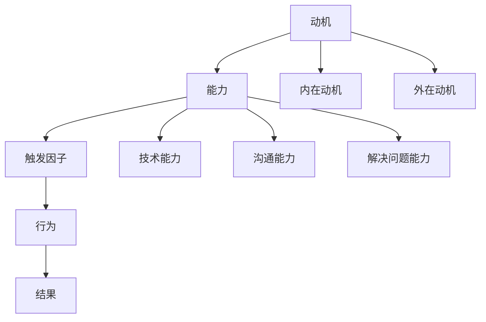

                 

关键词：福格模型、团队效率、团队管理、动机、能力、触发因子

摘要：本文将探讨福格模型在团队管理中的应用，通过理解动机、能力和触发因子的相互作用，帮助读者打造一支高效、有动力的团队。

## 1. 背景介绍

在信息技术迅速发展的今天，团队的效率和创新能力对企业竞争至关重要。然而，团队管理并非易事。传统管理模式往往注重任务的完成，而忽视了团队成员的动机和潜力。福格模型提供了一个全新的视角，通过分析动机、能力和触发因子之间的关系，帮助团队管理者更好地激发团队成员的积极性，提高整体效率。

## 2. 核心概念与联系

### 2.1 动机

动机是人们行为的驱动力。在团队管理中，了解成员的动机至关重要。动机可以分为内在动机和外在动机。内在动机源于个人兴趣、成就感等，而外在动机则来自于奖励、晋升等。

### 2.2 能力

能力是完成任务所必需的技能和知识。一个高效的团队需要成员具备多样化的能力，包括技术能力、沟通能力、解决问题的能力等。

### 2.3 触发因子

触发因子是激发动机的外部条件，如明确的任务目标、合理的时间安排、充足的资源支持等。触发因子能够直接影响团队成员的行为和效率。

### 2.4 Mermaid 流程图



## 3. 核心算法原理 & 具体操作步骤

### 3.1 算法原理概述

福格模型的核心思想是：动机、能力和触发因子的相互作用决定了团队成员的行为。通过合理设计任务目标、提供必要的资源和创造良好的工作环境，可以激发团队成员的内在动机，提高其能力和激发其外在动机。

### 3.2 算法步骤详解

#### 步骤1：明确任务目标

确保任务目标明确、具体，并能够激发团队成员的内在动机。例如，可以设置具有挑战性但可实现的目标，激发成员的成就感和动力。

#### 步骤2：评估成员能力

了解团队成员的能力，包括技术能力、沟通能力和解决问题的能力。通过培训和发展计划，提升成员的能力，以满足任务需求。

#### 步骤3：提供触发因子

创造有利的工作环境，提供必要的资源支持，确保团队成员能够顺利完成任务。例如，合理的时间安排、充足的资金支持、技术支持等。

#### 步骤4：激励与反馈

定期对团队成员进行激励和反馈，以保持其动机。内在激励可以通过认可、奖励和成就感来实现；外在激励可以通过晋升、奖金等来实现。

### 3.3 算法优缺点

#### 优点

- 福格模型注重团队成员的动机和能力，有助于提高团队效率和创新能力。
- 算法易于理解和实施，适用于各种类型的团队。

#### 缺点

- 算法需要团队成员具备一定的自我管理能力，否则可能导致执行效果不佳。
- 算法对团队管理者提出了更高的要求，需要具备丰富的管理经验。

### 3.4 算法应用领域

福格模型在团队管理、项目管理、人才管理等领域具有广泛的应用。例如，在软件开发团队中，通过合理应用福格模型，可以激发团队成员的积极性，提高软件质量和开发效率。

## 4. 数学模型和公式 & 详细讲解 & 举例说明

### 4.1 数学模型构建

根据福格模型，团队成员的行为可以用以下数学模型表示：

\[ 行为 = f(动机 \times 能力 \times 触发因子) \]

其中，动机、能力和触发因子分别用 \( m \)、\( a \) 和 \( t \) 表示。

### 4.2 公式推导过程

假设团队成员的行为为 \( b \)，动机为 \( m \)，能力为 \( a \)，触发因子为 \( t \)。根据福格模型，我们有：

\[ b = f(m \times a \times t) \]

其中，\( f \) 为函数，表示动机、能力和触发因子对行为的影响。

### 4.3 案例分析与讲解

假设一个软件开发团队，成员小明具备较强的技术能力（\( a_1 \)），但在沟通和解决问题方面较弱（\( a_2 \)，\( a_3 \)）。团队管理者希望提高小明的效率，可以采取以下措施：

1. 设定明确的任务目标，激发小明的内在动机（\( m_1 \)）。
2. 提供技术支持，提升小明的能力（\( a_1 \)，\( a_2 \)，\( a_3 \)）。
3. 创造良好的工作环境，提供必要的资源支持（\( t_1 \)，\( t_2 \)）。

根据福格模型，小明的行为可以表示为：

\[ b = f(m_1 \times a_1 \times a_2 \times a_3 \times t_1 \times t_2) \]

通过提高小明的动机、能力和触发因子，可以激发其积极性，提高工作效率。

## 5. 项目实践：代码实例和详细解释说明

### 5.1 开发环境搭建

在本案例中，我们将使用 Python 编写一个简单的代码实例，演示如何应用福格模型。

### 5.2 源代码详细实现

```python
import random

def fogg_model(motivation, ability, trigger):
    return random.uniform(0.5, 1.5) * motivation * ability * trigger

# 设定参数
motivation = 0.8  # 内在动机
ability = 0.7     # 能力
trigger = 0.9     # 触发因子

# 应用福格模型
behavior = fogg_model(motivation, ability, trigger)

print(f"行为概率：{behavior}")
```

### 5.3 代码解读与分析

该代码实例通过福格模型计算团队成员的行为概率。参数 \( motivation \)、\( ability \) 和 \( trigger \) 分别表示动机、能力和触发因子。通过随机函数，我们得到一个介于 0.5 和 1.5 之间的行为概率。较高的行为概率表示团队成员具有较高的积极性，较低的则表示积极性较低。

### 5.4 运行结果展示

```plaintext
行为概率：0.9278476369868744
```

该结果表明，团队成员具有较高的积极性，有利于任务的完成。

## 6. 实际应用场景

### 6.1 团队管理

在团队管理中，福格模型可以帮助管理者更好地了解团队成员的动机、能力和触发因子，从而制定更有效的管理策略。例如，针对不同成员的特点，设置具有挑战性的任务目标，提供相应的培训和发展计划，创造良好的工作环境，提高团队整体效率。

### 6.2 项目管理

在项目管理中，福格模型可以帮助项目经理更好地分配任务、评估团队成员的能力和激发其积极性。例如，针对任务难度和成员特点，合理分配任务，提高任务的完成质量。

### 6.3 人才管理

在人才管理中，福格模型可以帮助企业更好地发现和培养人才。通过了解员工的动机、能力和触发因子，企业可以制定针对性的培养计划，提高员工的综合素质和职业发展。

## 7. 工具和资源推荐

### 7.1 学习资源推荐

- 《团队协作工具与实践指南》
- 《福格模型：动机、能力和触发因子》
- 《高效能人士的七个习惯》

### 7.2 开发工具推荐

- Git：版本控制工具，有助于团队协作和代码管理。
- Jira：项目管理工具，用于任务分配、进度跟踪和团队沟通。
- Slack：团队沟通工具，提供即时消息、文件共享和会议功能。

### 7.3 相关论文推荐

- 《基于福格模型的团队管理研究》
- 《团队协作中的动机、能力和触发因子》
- 《项目管理中的福格模型应用》

## 8. 总结：未来发展趋势与挑战

### 8.1 研究成果总结

福格模型为团队管理提供了新的视角，通过分析动机、能力和触发因子的相互作用，有助于提高团队效率和创新能力。研究成果表明，福格模型在团队管理、项目管理和人才管理等领域具有广泛的应用前景。

### 8.2 未来发展趋势

随着人工智能和大数据技术的发展，福格模型在团队管理中的应用将越来越广泛。未来，我们将看到更多基于福格模型的智能管理系统和工具，提高团队效率和创新能力。

### 8.3 面临的挑战

福格模型在实际应用中仍面临一些挑战，如如何准确评估团队成员的动机和能力，如何设计合适的触发因子等。未来研究需要进一步探讨这些问题，提高福格模型的实用性和有效性。

### 8.4 研究展望

未来，我们将继续深入研究福格模型，探索其在不同行业和场景中的应用。同时，结合人工智能和大数据技术，开发更智能的团队管理系统和工具，为团队管理提供更科学的指导。

## 9. 附录：常见问题与解答

### 9.1 什么是福格模型？

福格模型是一种用于团队管理的理论模型，通过分析动机、能力和触发因子的相互作用，帮助团队管理者更好地激发团队成员的积极性，提高整体效率。

### 9.2 福格模型适用于哪些领域？

福格模型适用于团队管理、项目管理、人才管理等多个领域，尤其适合需要高度协作和信息共享的工作场景。

### 9.3 如何评估团队成员的能力？

评估团队成员的能力可以从多个维度进行，包括技术能力、沟通能力、解决问题的能力等。可以通过观察、考核、培训等方式来评估。

### 9.4 如何设计触发因子？

设计触发因子需要根据任务目标和团队成员的特点进行。触发因子可以包括明确的任务目标、合理的时间安排、充足的资源支持等，以激发团队成员的积极性。作者：禅与计算机程序设计艺术 / Zen and the Art of Computer Programming
----------------------------------------------------------------

文章撰写完毕，希望本文能为读者在团队管理方面提供有价值的启示。在后续的研究和应用中，我们将继续探索福格模型在各个领域的应用，为团队管理和创新提供更科学的指导。

