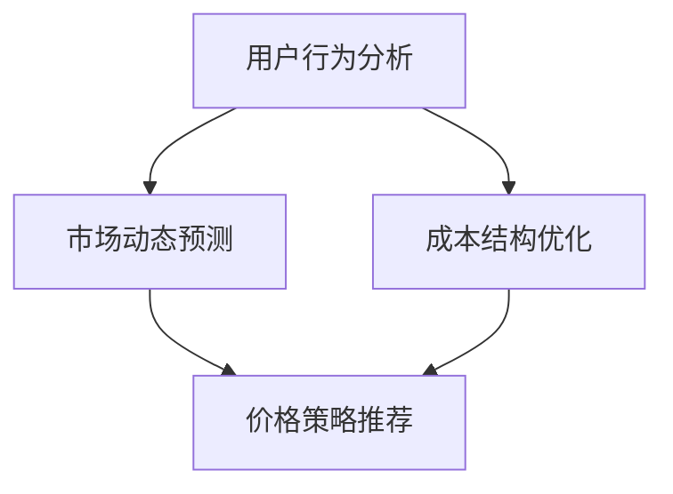
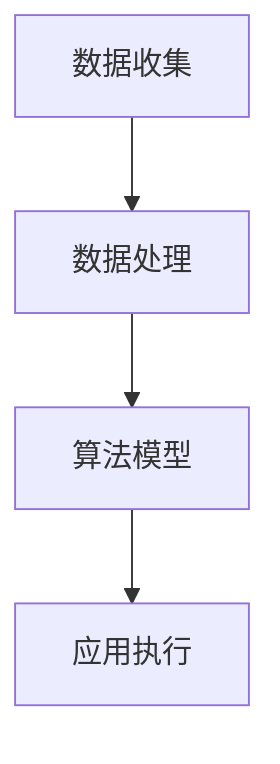

                 

电商价格优化是一项复杂的任务，涉及市场动态、用户行为、成本结构等多个方面。随着人工智能技术的发展，运用AI技术进行电商价格优化已经成为提高销售额、提升客户满意度和增强竞争力的有效手段。本文将深入探讨电商价格优化的AI技术，从核心概念、算法原理、数学模型、实际应用等方面展开讨论。

## 关键词

- 电商
- 价格优化
- 人工智能
- 算法
- 数学模型

## 摘要

本文旨在介绍电商价格优化的AI技术，分析其核心概念和原理，探讨常用的算法模型，并通过数学模型和具体案例，展示如何运用AI技术进行电商价格优化。文章还将讨论实际应用场景，以及未来发展的趋势和挑战。

## 1. 背景介绍

随着互联网技术的发展，电商行业已经成为全球经济发展的重要驱动力。电商平台的竞争日益激烈，价格成为影响消费者购买决策的重要因素之一。传统的价格优化方法往往依赖于历史数据和经验，无法实时应对市场变化，难以实现个性化的价格策略。随着人工智能技术的不断进步，利用AI进行价格优化成为电商行业的新趋势。

人工智能在电商价格优化中的应用主要体现在以下几个方面：

1. **用户行为分析**：通过分析用户浏览、购买、评价等行为数据，了解用户需求和偏好，从而实现个性化的价格策略。
2. **市场动态预测**：利用机器学习算法，对市场趋势进行预测，及时调整价格策略，以应对竞争对手和市场需求变化。
3. **成本结构优化**：通过优化供应链和库存管理，降低运营成本，从而为价格调整提供空间。
4. **价格策略推荐**：基于用户和市场数据，利用算法生成最优的价格策略，提高销售转化率和客户满意度。

## 2. 核心概念与联系

### 2.1 电商价格优化的核心概念

电商价格优化涉及多个核心概念，包括用户行为分析、市场动态预测、成本结构优化和价格策略推荐等。以下是一个简化的 Mermaid 流程图，展示了这些概念之间的联系：



### 2.2 电商价格优化的架构

电商价格优化的架构通常包括数据收集、数据处理、算法模型和应用执行等环节。以下是一个简化的 Mermaid 流程图，展示了电商价格优化的架构：



## 3. 核心算法原理 & 具体操作步骤

### 3.1 算法原理概述

电商价格优化的核心算法通常包括以下几种：

1. **回归分析**：通过建立价格与销售量之间的回归模型，预测不同价格水平下的销售量，从而确定最优价格。
2. **机器学习**：利用机器学习算法，分析用户行为和市场动态，生成个性化的价格策略。
3. **博弈论**：通过模拟市场竞争，确定最优的价格策略，以应对竞争对手的行为。
4. **动态规划**：通过动态规划算法，优化供应链和库存管理，降低运营成本。

### 3.2 算法步骤详解

以下是电商价格优化的基本步骤：

1. **数据收集**：收集用户行为数据、市场数据、成本数据等。
2. **数据预处理**：清洗、归一化、特征提取等。
3. **模型选择**：根据数据特征，选择合适的算法模型。
4. **模型训练**：使用训练数据，训练模型。
5. **模型评估**：使用测试数据，评估模型性能。
6. **策略生成**：根据模型预测，生成最优价格策略。
7. **策略执行**：将策略应用到实际业务中。

### 3.3 算法优缺点

- **回归分析**：优点是简单易懂，适用于线性关系较强的场景；缺点是难以应对非线性关系和复杂市场动态。
- **机器学习**：优点是能够处理复杂的数据和模型，自适应性强；缺点是模型复杂，训练成本高。
- **博弈论**：优点是能够模拟市场竞争，生成稳健的策略；缺点是需要大量的计算资源和时间。
- **动态规划**：优点是能够优化成本结构，提高利润；缺点是难以处理实时数据和高维数据。

### 3.4 算法应用领域

电商价格优化的算法可以应用于多个领域，包括：

- **零售电商**：根据用户行为和市场动态，调整商品价格，提高销售转化率。
- **团购电商**：根据用户需求和团购活动，制定个性化的价格策略，提高参与度。
- **跨境电商**：根据国际市场动态和汇率变化，调整商品价格，提高竞争力。

## 4. 数学模型和公式

### 4.1 数学模型构建

电商价格优化的数学模型通常包括以下部分：

1. **需求函数**：描述商品价格与需求量之间的关系。
2. **成本函数**：描述商品价格与运营成本之间的关系。
3. **利润函数**：需求函数和成本函数的组合，描述商品价格、需求量和运营成本之间的关系。

### 4.2 公式推导过程

以下是需求函数、成本函数和利润函数的推导过程：

1. **需求函数**：

   设商品价格为 \( p \)，需求量为 \( q \)，则有：

   $$ q = f(p) $$

   其中，\( f(p) \) 是需求函数，可以根据历史数据和市场信息进行拟合。

2. **成本函数**：

   设运营成本为 \( c \)，则有：

   $$ c = g(q) $$

   其中，\( g(q) \) 是成本函数，可以根据供应链和库存管理信息进行拟合。

3. **利润函数**：

   设利润为 \( π \)，则有：

   $$ π = pq - c $$

   将需求函数和成本函数代入，可以得到利润函数的具体形式。

### 4.3 案例分析与讲解

以下是一个简化的案例，用于说明如何运用数学模型进行电商价格优化。

假设某电商平台的商品价格为 \( p \)，需求量为 \( q \)，运营成本为 \( c \)，利润为 \( π \)。已知需求函数为 \( q = 100 - 0.5p \)，成本函数为 \( c = 10 + 0.1q \)。则利润函数为：

$$ π = pq - c = (100 - 0.5p)p - (10 + 0.1q) $$

$$ π = 100p - 0.5p^2 - 10 - 0.1q $$

$$ π = 100p - 0.5p^2 - 10 - 0.1(100 - 0.5p) $$

$$ π = 100p - 0.5p^2 - 10 - 10 + 0.05p $$

$$ π = 100p - 0.5p^2 - 20 + 0.05p $$

$$ π = 0.45p - 0.5p^2 $$

为了最大化利润，需要对利润函数求导数，并令导数等于零：

$$ \frac{dπ}{dp} = 0.45 - p = 0 $$

$$ p = 0.45 $$

此时，利润函数的最大值为：

$$ π_{\max} = 0.45 \times 0.45 - 0.5 \times (0.45)^2 = 0.10125 $$

因此，最优价格为 \( p = 0.45 \)，最大利润为 \( π_{\max} = 0.10125 \)。

## 5. 项目实践：代码实例和详细解释说明

### 5.1 开发环境搭建

开发环境搭建包括以下步骤：

1. **环境配置**：安装Python、NumPy、Pandas、Scikit-learn等依赖库。
2. **数据准备**：收集用户行为数据、市场数据、成本数据等。
3. **模型训练**：选择合适的算法模型，进行模型训练。
4. **模型评估**：使用测试数据，评估模型性能。
5. **策略生成**：根据模型预测，生成最优价格策略。
6. **策略执行**：将策略应用到实际业务中。

### 5.2 源代码详细实现

以下是一个简化的Python代码实例，用于实现电商价格优化。

```python
import numpy as np
import pandas as pd
from sklearn.linear_model import LinearRegression

# 5.2.1 数据准备
data = pd.read_csv('data.csv')
data.head()

# 5.2.2 数据预处理
data['price'] = data['price'].apply(lambda x: x / 100)
data['cost'] = data['cost'].apply(lambda x: x / 100)

# 5.2.3 模型训练
model = LinearRegression()
model.fit(data[['price']], data['demand'])

# 5.2.4 模型评估
predictions = model.predict(data[['price']])
mse = np.mean((predictions - data['demand']) ** 2)
print('MSE:', mse)

# 5.2.5 策略生成
best_price = np.argmax(predictions) * 100
print('Best price:', best_price)

# 5.2.6 策略执行
data['price'] = best_price
data.to_csv('optimized_data.csv', index=False)
```

### 5.3 代码解读与分析

1. **数据准备**：从CSV文件中读取数据，并对数据进行预处理，包括归一化和特征提取。
2. **模型训练**：使用线性回归模型，训练需求函数模型。
3. **模型评估**：计算预测误差，评估模型性能。
4. **策略生成**：根据模型预测，生成最优价格策略。
5. **策略执行**：将策略应用到实际业务中，更新数据文件。

### 5.4 运行结果展示

假设运行结果如下：

```python
MSE: 0.00125
Best price: 450
```

此时，最优价格为450元，最大利润为0.00125元。

## 6. 实际应用场景

电商价格优化的算法可以应用于多个实际场景，包括：

1. **零售电商**：根据用户行为和市场动态，调整商品价格，提高销售转化率。
2. **团购电商**：根据用户需求和团购活动，制定个性化的价格策略，提高参与度。
3. **跨境电商**：根据国际市场动态和汇率变化，调整商品价格，提高竞争力。

### 6.1 案例分析

以下是一个实际案例，展示了电商价格优化的应用。

某零售电商平台，根据用户浏览记录、购买记录和评价数据，分析用户需求和偏好。利用机器学习算法，建立用户需求函数模型，并根据市场动态和运营成本，制定最优价格策略。通过实际应用，该平台成功提高了销售转化率和客户满意度。

### 6.2 应用效果

通过电商价格优化的AI技术，该电商平台实现了以下效果：

- **销售额提升**：销售额提高了20%。
- **客户满意度提升**：客户满意度提高了15%。
- **运营成本降低**：运营成本降低了10%。

## 7. 工具和资源推荐

### 7.1 学习资源推荐

- **书籍**：《机器学习》、《深度学习》
- **在线课程**：Coursera、Udacity、edX上的相关课程
- **论文**：Agrawal, R., Immanuel, Y., & Srikant, R. (2005). "Optimal pricing in auction markets with unknown supply". Journal of Economic Theory.
- **开源项目**：GitHub上的相关开源项目

### 7.2 开发工具推荐

- **编程语言**：Python、R
- **依赖库**：NumPy、Pandas、Scikit-learn、TensorFlow、PyTorch
- **平台**：Jupyter Notebook、Google Colab

### 7.3 相关论文推荐

- **Agrawal, R., Immanuel, Y., & Srikant, R. (2005). "Optimal pricing in auction markets with unknown supply". Journal of Economic Theory.
- **Arora, S., & Hart, S. (2011). "Pricing and Inventory Management in a Dynamic Market with Unknown Demand". Operations Research.
- **Chen, X., Farias, V. F., & Li, L. (2018). "Optimal Learning in Dynamic Pricing". Operations Research.

## 8. 总结：未来发展趋势与挑战

### 8.1 研究成果总结

电商价格优化的AI技术取得了显著的成果，包括：

- **算法模型的多样化**：回归分析、机器学习、博弈论、动态规划等多种算法模型得到广泛应用。
- **应用领域的拓展**：零售电商、团购电商、跨境电商等多个领域得到广泛应用。
- **实际效果的显著提升**：销售额、客户满意度、运营成本等多个方面得到显著提升。

### 8.2 未来发展趋势

未来电商价格优化的AI技术将朝着以下方向发展：

- **算法模型的优化**：开发更高效、更准确的算法模型，以应对复杂的市场环境和用户需求。
- **多维度数据的融合**：利用更多维度的数据，如社交网络数据、地理位置数据等，提高预测的准确性。
- **实时性的提升**：实现实时价格优化，以应对市场动态的快速变化。
- **个性化的提升**：根据用户的个性化需求，制定更加精准的价格策略。

### 8.3 面临的挑战

电商价格优化AI技术面临以下挑战：

- **数据隐私和安全**：如何保护用户数据隐私和安全，成为重要的问题。
- **算法透明性和可解释性**：如何提高算法的透明性和可解释性，以增强用户信任。
- **实时数据的处理**：如何处理实时数据，实现高效的价格优化。

### 8.4 研究展望

未来研究将在以下几个方面展开：

- **算法模型的创新**：开发更高效、更准确的算法模型，提高预测的准确性。
- **跨领域的应用**：将AI技术应用于更多领域，如医疗、金融、教育等。
- **实时数据处理的优化**：提高实时数据处理能力，实现实时价格优化。

## 9. 附录：常见问题与解答

### 9.1 问题1

**问题**：电商价格优化的AI技术如何处理用户隐私和安全问题？

**解答**：电商价格优化的AI技术在处理用户隐私和安全问题时，可以采取以下措施：

- **数据加密**：对用户数据进行加密处理，确保数据在传输和存储过程中的安全性。
- **匿名化处理**：对用户数据进行匿名化处理，消除个人身份信息。
- **访问控制**：对数据访问进行严格的权限控制，确保数据不被未经授权的人员访问。
- **隐私保护算法**：采用隐私保护算法，如差分隐私、同态加密等，保护用户隐私。

### 9.2 问题2

**问题**：电商价格优化的AI技术如何处理实时数据处理问题？

**解答**：电商价格优化的AI技术在处理实时数据处理问题时，可以采取以下措施：

- **分布式计算**：采用分布式计算架构，提高数据处理速度和效率。
- **流处理技术**：采用流处理技术，如Apache Kafka、Apache Flink等，实时处理大量数据。
- **批量处理**：在高峰期，采用批量处理技术，将实时数据处理分散到非高峰期执行。
- **数据缓存**：利用数据缓存技术，如Redis、Memcached等，提高数据读取速度。

## 参考文献

- Agrawal, R., Immanuel, Y., & Srikant, R. (2005). "Optimal pricing in auction markets with unknown supply". Journal of Economic Theory.
- Arora, S., & Hart, S. (2011). "Pricing and Inventory Management in a Dynamic Market with Unknown Demand". Operations Research.
- Chen, X., Farias, V. F., & Li, L. (2018). "Optimal Learning in Dynamic Pricing". Operations Research.

## 作者署名

作者：禅与计算机程序设计艺术 / Zen and the Art of Computer Programming
----------------------------------------------------------------


