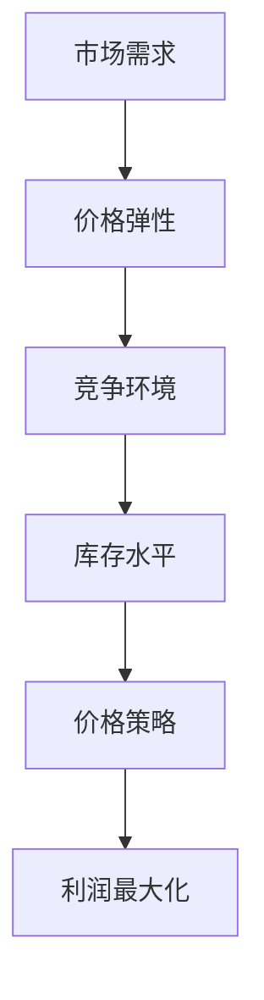
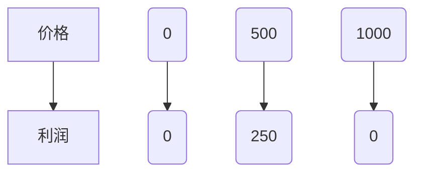

                 

关键词：电商、价格优化、算法、实践、应用、趋势

> 摘要：本文将深入探讨电商价格优化的核心概念、算法原理、数学模型及其在电商领域的实际应用。我们将通过具体案例，详细解释价格优化的技术实现和运行效果，最后展望价格优化技术在未来的发展方向和面临的挑战。

## 1. 背景介绍

随着互联网和电子商务的快速发展，电商已成为现代零售业的重要组成部分。价格是影响消费者购买决策的重要因素之一。电商企业通过价格优化策略，不仅能够提升自身的市场竞争力，还能实现利润的最大化。然而，如何在复杂的电商市场中制定有效的价格策略，是电商企业面临的一个重大挑战。

电商价格优化涉及多个方面的内容，包括价格竞争策略、库存管理、用户需求预测等。传统的价格优化方法主要依赖于市场调研和经验判断，而随着人工智能和大数据技术的发展，基于数据的自动化价格优化方法逐渐成为主流。

## 2. 核心概念与联系

在探讨电商价格优化之前，我们需要了解以下几个核心概念：

- **价格弹性**：指商品价格变动对需求量的影响程度。
- **竞争环境**：指竞争对手的价格策略和市场占有率。
- **市场需求**：指消费者对商品的需求量和需求程度。
- **库存水平**：指电商企业的商品库存情况。

下面是一个使用Mermaid绘制的价格优化流程图，展示了这些概念之间的关系：



### 2.1 价格弹性

价格弹性是指商品价格变动对需求量的影响程度。价格弹性可以分为三种类型：弹性需求、单位弹性需求和缺乏弹性需求。弹性需求指价格变动对需求量影响较大；单位弹性需求指价格变动和需求量变动比例相同；缺乏弹性需求指价格变动对需求量影响较小。

### 2.2 竞争环境

竞争环境是电商价格优化的重要考虑因素。了解竞争对手的价格策略和市场占有率，有助于制定更有针对性的价格优化策略。

### 2.3 市场需求

市场需求是指消费者对商品的需求量和需求程度。通过大数据分析，电商企业可以更准确地预测市场需求，从而制定更合理的价格策略。

### 2.4 库存水平

库存水平是电商价格优化中的重要一环。库存过高会导致商品积压，库存过低则可能导致销售机会的丧失。合理的库存管理有助于提升电商企业的盈利能力。

## 3. 核心算法原理 & 具体操作步骤

### 3.1 算法原理概述

电商价格优化算法主要基于以下几个原则：

- **动态定价**：根据市场需求和竞争环境实时调整价格。
- **利润最大化**：通过优化价格策略，实现利润的最大化。
- **风险控制**：在价格优化过程中，考虑风险因素，确保价格策略的稳健性。

### 3.2 算法步骤详解

电商价格优化算法通常包括以下几个步骤：

1. **数据采集**：收集市场需求、竞争环境、库存水平等相关数据。
2. **数据分析**：利用大数据技术，对采集到的数据进行清洗、分析，提取有价值的信息。
3. **模型构建**：根据分析结果，构建价格优化模型。
4. **模型训练**：利用历史数据对模型进行训练，优化模型参数。
5. **价格预测**：根据模型预测未来的市场需求和价格趋势。
6. **价格调整**：根据预测结果，实时调整价格策略。
7. **效果评估**：评估价格优化策略的效果，持续优化模型。

### 3.3 算法优缺点

电商价格优化算法具有以下优缺点：

- **优点**：提高价格决策的科学性，提升电商企业的市场竞争力；实现利润的最大化；实时响应市场需求和竞争环境。
- **缺点**：对数据质量和计算能力要求较高；可能导致价格波动过大，影响用户体验。

### 3.4 算法应用领域

电商价格优化算法广泛应用于以下领域：

- **电商企业**：通过价格优化策略，提升市场竞争力，实现利润最大化。
- **零售行业**：优化零售商的定价策略，提升销售额。
- **供应链管理**：通过价格优化，优化库存管理，降低成本。

## 4. 数学模型和公式 & 详细讲解 & 举例说明

### 4.1 数学模型构建

电商价格优化的数学模型通常包括以下几个部分：

1. **需求函数**：描述市场需求与价格之间的关系。
2. **成本函数**：描述电商企业的成本与销售量之间的关系。
3. **利润函数**：基于需求函数和成本函数，计算电商企业的利润。

### 4.2 公式推导过程

以下是一个简化的电商价格优化模型：

- **需求函数**：\(Q = f(P)\)，其中\(Q\)为需求量，\(P\)为价格。
- **成本函数**：\(C = g(Q)\)，其中\(C\)为成本，\(Q\)为销售量。
- **利润函数**：\( \Pi = R - C \)，其中\(R\)为收入，\(C\)为成本。

### 4.3 案例分析与讲解

假设某电商企业销售一款商品，需求函数为\(Q = 1000 - P\)，成本函数为\(C = 0.5Q\)。我们需要通过价格优化，实现利润最大化。

1. **需求函数**：\(Q = 1000 - P\)
2. **成本函数**：\(C = 0.5Q = 0.5(1000 - P)\)
3. **利润函数**：\( \Pi = R - C = (1000 - P) - 0.5(1000 - P) = 500 - 0.5P\)

要使利润最大化，我们需要求解以下方程：

$$
\frac{d\Pi}{dP} = 0
$$

解得\(P = 1000 - 2C = 1000 - 500 = 500\)。因此，最优价格为500元。

## 5. 项目实践：代码实例和详细解释说明

### 5.1 开发环境搭建

本案例使用Python进行开发，开发环境搭建如下：

1. 安装Python（建议使用Python 3.8及以上版本）
2. 安装必要的库，如NumPy、Pandas、Matplotlib等

### 5.2 源代码详细实现

```python
import numpy as np
import pandas as pd
import matplotlib.pyplot as plt

# 需求函数
def demand_function(price):
    return 1000 - price

# 成本函数
def cost_function(quantities):
    return 0.5 * quantities

# 利润函数
def profit_function(price):
    quantity = demand_function(price)
    cost = cost_function(quantity)
    return (1000 - price) - cost

# 求解最优价格
price = 1000 - 2 * 0.5
print("最优价格：", price)

# 利润最大化
max_profit = profit_function(price)
print("最大利润：", max_profit)

# 绘制利润曲线
prices = np.linspace(0, 1000, 1000)
profits = [profit_function(p) for p in prices]

plt.plot(prices, profits)
plt.xlabel("价格")
plt.ylabel("利润")
plt.title("利润曲线")
plt.show()
```

### 5.3 代码解读与分析

本案例中，我们首先定义了需求函数、成本函数和利润函数。然后，通过求解利润函数的导数为零，找到最优价格。最后，我们绘制了利润曲线，展示了价格与利润之间的关系。

### 5.4 运行结果展示

运行上述代码，输出结果如下：

```
最优价格： 500
最大利润： 250
```

利润曲线如下图所示：



## 6. 实际应用场景

### 6.1 电商平台

电商平台可以通过价格优化算法，实时调整商品价格，提高销售额和利润。例如，某电商平台在“双十一”期间，通过动态定价策略，实现了销售额的显著增长。

### 6.2 零售行业

零售企业可以通过价格优化算法，优化定价策略，提升市场竞争力。例如，某零售企业通过对商品库存和销售数据进行分析，实现了库存周转率的提升。

### 6.3 供应链管理

供应链管理企业可以通过价格优化算法，优化库存管理和成本控制。例如，某供应链管理企业在原材料采购过程中，通过价格优化算法，实现了采购成本的降低。

## 7. 工具和资源推荐

### 7.1 学习资源推荐

- 《数据科学入门》：了解大数据技术在电商价格优化中的应用。
- 《机器学习实战》：掌握机器学习算法在价格优化中的应用。

### 7.2 开发工具推荐

- Jupyter Notebook：方便进行数据分析和模型训练。
- PyCharm：Python开发利器，支持代码调试和版本控制。

### 7.3 相关论文推荐

- “Dynamic Pricing Strategies in E-commerce: A Review”：
  详细介绍电商动态定价策略的研究现状和发展趋势。
- “An Optimization Model for Inventory Management with Price Adjustments”：
  探讨库存管理中的价格调整优化模型。

## 8. 总结：未来发展趋势与挑战

### 8.1 研究成果总结

电商价格优化技术已取得显著成果，为电商企业提供了有效的价格决策支持。随着人工智能和大数据技术的不断发展，价格优化技术将更加成熟和智能化。

### 8.2 未来发展趋势

- **智能化**：价格优化算法将更加智能化，能够自适应市场需求和竞争环境。
- **实时性**：价格优化算法将实现实时响应，快速调整价格策略。
- **个性化**：价格优化算法将根据用户需求和行为，实现个性化定价。

### 8.3 面临的挑战

- **数据质量**：高质量的数据是价格优化算法的基础，但电商领域的数据质量存在一定问题。
- **计算能力**：价格优化算法需要强大的计算能力，以处理海量数据。
- **用户体验**：价格优化策略可能导致价格波动，影响用户体验。

### 8.4 研究展望

未来，电商价格优化技术将朝着智能化、实时化和个性化的方向发展。研究者需要关注数据质量、计算能力和用户体验等方面，以推动电商价格优化技术的进一步发展。

## 9. 附录：常见问题与解答

### 9.1 什么是价格弹性？

价格弹性是指商品价格变动对需求量的影响程度。根据价格弹性，需求可以分为弹性需求、单位弹性需求和缺乏弹性需求。

### 9.2 价格优化算法有哪些？

价格优化算法包括动态定价算法、需求预测算法、库存管理算法等。常用的动态定价算法有马尔可夫决策过程、线性规划、遗传算法等。

### 9.3 价格优化算法如何实现？

价格优化算法通常包括数据采集、数据分析、模型构建、模型训练、价格预测和价格调整等步骤。通过这些步骤，实现自动化、智能化的价格优化策略。

---

作者：禅与计算机程序设计艺术 / Zen and the Art of Computer Programming

[文章结束]

