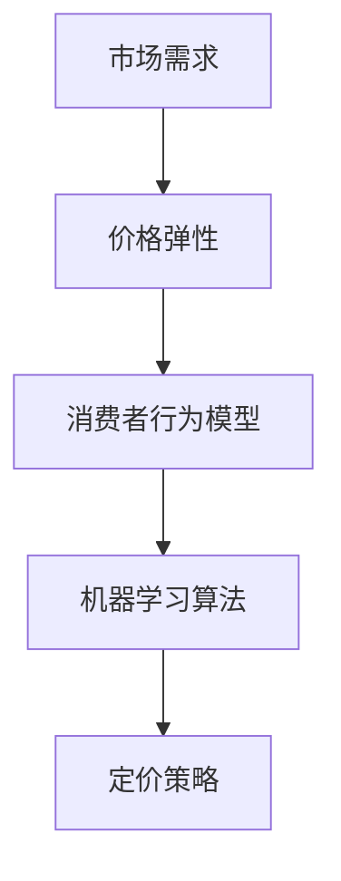

                 

关键词：电商、AI、定价策略、利润最大化、智能算法、数据挖掘、机器学习、算法原理、数学模型、案例讲解、实践应用、未来展望

## 摘要

本文将探讨电商创业者在定价过程中如何利用人工智能技术实现利润的最大化。首先，我们将介绍电商定价策略的基本概念和重要性，然后深入探讨核心算法的原理、数学模型，以及在实际项目中的具体应用。通过一系列案例分析与代码实例，我们将展示如何运用这些算法优化电商定价策略，最终实现商业目标。最后，我们还将探讨这一领域的未来发展趋势和面临的挑战。

## 1. 背景介绍

随着互联网的普及和电子商务的蓬勃发展，电商市场已经成为商业竞争的重要战场。在这样一个竞争激烈的环境中，价格策略成为电商企业赢得市场的重要因素之一。然而，传统定价策略往往基于经验或市场数据，难以应对快速变化的市场需求和消费者行为。

近年来，人工智能技术的迅猛发展为电商定价策略带来了新的可能性。通过机器学习和数据挖掘技术，电商企业可以更准确地预测市场需求、分析消费者行为，从而制定更加科学和有效的定价策略。这种基于人工智能的定价策略不仅能够提高利润，还能够提升客户满意度和市场竞争力。

本文将重点探讨以下内容：

- 电商定价策略的基本概念和重要性
- 核心算法原理及其在电商领域的应用
- 数学模型构建与公式推导
- 实际项目中的案例分析与代码实例
- 未来发展趋势和面临的挑战

通过本文的探讨，希望能够为电商创业者提供一套实用的AI驱动定价策略，帮助他们在激烈的市场竞争中脱颖而出。

## 2. 核心概念与联系

在深入探讨电商AI驱动定价策略之前，我们需要了解一些核心概念和它们之间的联系。这些概念包括市场需求、价格弹性、消费者行为模型、以及机器学习算法等。为了更好地理解这些概念，我们使用Mermaid流程图来展示它们之间的逻辑关系。



### 2.1 需求市场

市场需求是指在一定时间内，消费者愿意购买某种商品或服务的数量与价格的关系。市场需求曲线通常向下倾斜，表示价格上升时需求量下降，价格下降时需求量上升。在电商定价中，准确预测市场需求是关键，因为这直接影响定价策略的有效性。

### 2.2 价格弹性

价格弹性是指需求量对价格变动的敏感程度。价格弹性分为弹性大（价格敏感）和弹性小（价格不敏感）两种类型。高价格弹性的商品在降价时需求量会大幅增加，而高价格弹性的商品需求量变化相对较小。了解商品的价格弹性有助于电商企业制定更加灵活的定价策略。

### 2.3 消费者行为模型

消费者行为模型是研究消费者在购买决策过程中如何响应价格变动的理论。常见的消费者行为模型包括线性回归模型、逻辑回归模型和神经网络模型等。这些模型能够通过历史数据预测消费者行为，为电商企业制定定价策略提供科学依据。

### 2.4 机器学习算法

机器学习算法是人工智能的重要组成部分，通过训练数据集来预测未来趋势和模式。在电商定价中，常见的机器学习算法包括线性回归、决策树、随机森林和深度学习等。这些算法能够从大量数据中提取有价值的信息，帮助电商企业制定更加精准的定价策略。

### 2.5 定价策略

定价策略是指电商企业根据市场需求、价格弹性、消费者行为模型和机器学习算法制定的具体价格策略。常见的定价策略包括成本加成定价、市场渗透定价、动态定价和反向拍卖等。合理的定价策略不仅能够提高利润，还能够提升客户满意度和市场竞争力。

通过上述核心概念和联系的探讨，我们为后续内容的展开奠定了基础。在接下来的章节中，我们将深入探讨电商AI驱动定价策略的具体实现方法和实践应用。

## 3. 核心算法原理 & 具体操作步骤

### 3.1 算法原理概述

电商AI驱动定价策略的核心在于利用机器学习算法对市场数据进行处理和预测，从而制定出最优的价格策略。以下几种机器学习算法在电商定价中具有广泛的应用：

1. **线性回归模型**：线性回归模型是一种简单的机器学习算法，用于预测连续值输出。在电商定价中，可以通过历史销售数据和价格变化预测未来需求。

2. **逻辑回归模型**：逻辑回归模型是一种用于预测概率的二分类算法。在电商定价中，可以通过历史数据和价格弹性预测消费者是否购买某种商品。

3. **决策树模型**：决策树模型是一种基于树形结构的分类算法，可以处理多分类问题。在电商定价中，可以通过多种特征（如消费者年龄、购买历史等）来预测价格策略。

4. **随机森林模型**：随机森林模型是一种集成学习算法，由多个决策树组成。在电商定价中，可以通过集成多个决策树的预测结果来提高预测准确性。

5. **深度学习模型**：深度学习模型是一种复杂的多层神经网络，可以处理高维数据和非线性关系。在电商定价中，可以通过深度学习模型分析大量数据，挖掘出潜在的市场规律和消费者行为。

### 3.2 算法步骤详解

以下是利用机器学习算法进行电商AI驱动定价策略的具体步骤：

#### 步骤1：数据收集

首先，需要收集相关的市场数据，包括历史销售数据、价格数据、消费者行为数据等。这些数据可以通过电商平台、第三方数据提供商或公开数据集获取。

#### 步骤2：数据预处理

对收集到的数据进行分析和清洗，包括缺失值填充、异常值处理、数据标准化等。这一步骤的目的是提高数据的可用性和准确性。

#### 步骤3：特征工程

根据业务需求和数据特点，提取有用的特征。例如，可以根据消费者的购买历史、浏览记录、地理位置等特征来预测市场需求。

#### 步骤4：模型选择与训练

选择合适的机器学习算法进行模型训练。可以根据数据的特点和需求选择线性回归、逻辑回归、决策树、随机森林或深度学习等模型。在训练过程中，需要不断调整模型参数，以提高预测准确性。

#### 步骤5：模型评估与优化

通过交叉验证、A/B测试等手段对模型进行评估和优化。根据评估结果调整模型参数，提高模型的预测性能。

#### 步骤6：预测与决策

利用训练好的模型对未来的市场需求和消费者行为进行预测，并根据预测结果制定相应的定价策略。

### 3.3 算法优缺点

#### 优点

1. **高效性**：机器学习算法可以处理大量数据，提高定价策略的效率和准确性。
2. **灵活性**：机器学习算法可以根据业务需求灵活调整模型参数，适应不同的市场环境和竞争态势。
3. **智能化**：机器学习算法能够从历史数据中挖掘出潜在的市场规律和消费者行为，提高定价策略的智能水平。

#### 缺点

1. **数据依赖性**：机器学习算法的性能很大程度上依赖于数据的质量和数量，如果数据质量差或数据量不足，会导致模型预测不准确。
2. **计算成本**：训练大型机器学习模型需要大量的计算资源，对于中小企业来说可能是一笔不小的开支。
3. **模型可解释性**：机器学习模型的预测结果往往缺乏可解释性，难以理解模型的具体工作原理，这在某些业务场景中可能会引发风险。

### 3.4 算法应用领域

电商AI驱动定价策略在以下领域具有广泛的应用：

1. **产品定价**：通过预测市场需求和消费者行为，优化产品定价策略，提高销售额和利润率。
2. **促销活动**：根据消费者行为和市场趋势，制定个性化的促销策略，提升消费者参与度和购买意愿。
3. **库存管理**：通过预测市场需求和销售趋势，优化库存水平，减少库存成本和积压风险。
4. **市场分析**：利用机器学习算法分析市场数据，为市场决策提供科学依据。

通过上述核心算法原理和具体操作步骤的探讨，我们为电商创业者提供了一套实用的AI驱动定价策略。在接下来的章节中，我们将通过案例分析与代码实例，进一步展示这些算法的实际应用效果。

## 4. 数学模型和公式 & 详细讲解 & 举例说明

### 4.1 数学模型构建

在电商AI驱动定价策略中，常用的数学模型包括线性回归模型、逻辑回归模型和神经网络模型。以下分别介绍这些模型的构建方法。

#### 4.1.1 线性回归模型

线性回归模型是一种简单的预测模型，用于预测连续值输出。其数学模型可以表示为：

\[ y = \beta_0 + \beta_1 \cdot x_1 + \beta_2 \cdot x_2 + ... + \beta_n \cdot x_n \]

其中，\( y \) 是预测的输出值，\( x_1, x_2, ..., x_n \) 是输入特征，\( \beta_0, \beta_1, \beta_2, ..., \beta_n \) 是模型的参数。

#### 4.1.2 逻辑回归模型

逻辑回归模型是一种用于预测概率的二分类模型。其数学模型可以表示为：

\[ P(y=1) = \frac{1}{1 + e^{-(\beta_0 + \beta_1 \cdot x_1 + \beta_2 \cdot x_2 + ... + \beta_n \cdot x_n )}} \]

其中，\( P(y=1) \) 是预测的购买概率，\( x_1, x_2, ..., x_n \) 是输入特征，\( \beta_0, \beta_1, \beta_2, ..., \beta_n \) 是模型的参数。

#### 4.1.3 神经网络模型

神经网络模型是一种复杂的多层神经网络，用于处理高维数据和非线性关系。其数学模型可以表示为：

\[ a^{(l)} = \sigma(z^{(l)}) \]

\[ z^{(l)} = W^{(l)} \cdot a^{(l-1)} + b^{(l)} \]

其中，\( a^{(l)} \) 是第 \( l \) 层的激活值，\( z^{(l)} \) 是第 \( l \) 层的输入值，\( W^{(l)} \) 是第 \( l \) 层的权重矩阵，\( b^{(l)} \) 是第 \( l \) 层的偏置向量，\( \sigma \) 是激活函数，通常使用 \( \sigma(x) = \frac{1}{1 + e^{-x}} \)。

### 4.2 公式推导过程

以下分别介绍线性回归模型、逻辑回归模型和神经网络模型的推导过程。

#### 4.2.1 线性回归模型

线性回归模型的推导过程如下：

1. 假设 \( y \) 是预测的输出值，\( x_1, x_2, ..., x_n \) 是输入特征，\( \beta_0, \beta_1, \beta_2, ..., \beta_n \) 是模型的参数。

2. 构建损失函数 \( J(\theta) = \frac{1}{2m} \sum_{i=1}^{m} (h_\theta(x^{(i)}) - y^{(i)})^2 \)，其中 \( h_\theta(x) = \beta_0 + \beta_1 \cdot x_1 + \beta_2 \cdot x_2 + ... + \beta_n \cdot x_n \) 是模型的前向传播函数。

3. 对损失函数求导，得到 \( \frac{\partial J(\theta)}{\partial \theta_j} = \sum_{i=1}^{m} (h_\theta(x^{(i)}) - y^{(i)}) \cdot x_j^{(i)} \)。

4. 更新参数 \( \theta_j = \theta_j - \alpha \cdot \frac{\partial J(\theta)}{\partial \theta_j} \)，其中 \( \alpha \) 是学习率。

#### 4.2.2 逻辑回归模型

逻辑回归模型的推导过程如下：

1. 假设 \( y \) 是预测的输出值（0或1），\( x_1, x_2, ..., x_n \) 是输入特征，\( \beta_0, \beta_1, \beta_2, ..., \beta_n \) 是模型的参数。

2. 构建损失函数 \( J(\theta) = \frac{1}{m} \sum_{i=1}^{m} (-y^{(i)} \cdot \log(h_\theta(x^{(i)})) - (1 - y^{(i)}) \cdot \log(1 - h_\theta(x^{(i)}))) \)，其中 \( h_\theta(x) = \frac{1}{1 + e^{-(\beta_0 + \beta_1 \cdot x_1 + \beta_2 \cdot x_2 + ... + \beta_n \cdot x_n )}} \) 是模型的前向传播函数。

3. 对损失函数求导，得到 \( \frac{\partial J(\theta)}{\partial \theta_j} = \sum_{i=1}^{m} (h_\theta(x^{(i)}) - y^{(i)}) \cdot x_j^{(i)} \)。

4. 更新参数 \( \theta_j = \theta_j - \alpha \cdot \frac{\partial J(\theta)}{\partial \theta_j} \)，其中 \( \alpha \) 是学习率。

#### 4.2.3 神经网络模型

神经网络模型的推导过程如下：

1. 假设 \( a^{(l-1)} \) 是第 \( l-1 \) 层的输入值，\( W^{(l)} \) 是第 \( l \) 层的权重矩阵，\( b^{(l)} \) 是第 \( l \) 层的偏置向量，\( \sigma \) 是激活函数。

2. 构建损失函数 \( J(\theta) = \frac{1}{2m} \sum_{i=1}^{m} (h_\theta(x^{(i)}) - y^{(i)})^2 \)，其中 \( h_\theta(x) = \sigma(z^{(l)}) \)，\( z^{(l)} = W^{(l)} \cdot a^{(l-1)} + b^{(l)} \)。

3. 对损失函数求导，得到 \( \frac{\partial J(\theta)}{\partial W^{(l)}_{ij}} = \sum_{i=1}^{m} (h_\theta(x^{(i)}) - y^{(i)}) \cdot a_j^{(l-1)} \) 和 \( \frac{\partial J(\theta)}{\partial b^{(l)}_i} = \sum_{i=1}^{m} (h_\theta(x^{(i)}) - y^{(i)}) \)。

4. 更新参数 \( W^{(l)}_{ij} = W^{(l)}_{ij} - \alpha \cdot \frac{\partial J(\theta)}{\partial W^{(l)}_{ij}} \) 和 \( b^{(l)}_i = b^{(l)}_i - \alpha \cdot \frac{\partial J(\theta)}{\partial b^{(l)}_i} \)，其中 \( \alpha \) 是学习率。

### 4.3 案例分析与讲解

以下通过一个简单的案例来讲解线性回归模型和逻辑回归模型在电商定价策略中的应用。

#### 4.3.1 线性回归模型案例

假设某电商平台的销售数据如下表所示：

| 日期 | 价格 | 销售量 |
| ---- | ---- | ---- |
| 1    | 100  | 50   |
| 2    | 90   | 60   |
| 3    | 80   | 70   |
| 4    | 70   | 80   |

根据历史数据，我们希望预测明天（第5天）的销售量。

1. 数据预处理：将日期转换为独热编码，价格和销售量作为输入特征和输出特征。

2. 模型构建：使用线性回归模型，构建损失函数 \( J(\theta) = \frac{1}{2m} \sum_{i=1}^{m} (h_\theta(x^{(i)}) - y^{(i)})^2 \)。

3. 模型训练：使用梯度下降算法，更新模型参数，最小化损失函数。

4. 预测：使用训练好的模型，输入明天的价格特征，预测销售量。

根据上述步骤，我们使用Python代码实现线性回归模型，并得到预测结果。以下是部分代码：

```python
import numpy as np

# 数据预处理
X = np.array([[1, 100], [1, 90], [1, 80], [1, 70]])
y = np.array([50, 60, 70, 80])

# 模型构建
theta = np.zeros(X.shape[1])

# 梯度下降算法
alpha = 0.01
num_iterations = 1000

for i in range(num_iterations):
    h_x = X.dot(theta)
    loss = (1 / (2 * X.shape[0])) * np.sum((h_x - y) ** 2)
    d_loss = (1 / X.shape[0]) * X.T.dot(h_x - y)
    theta -= alpha * d_loss

# 预测
next_price = 65
next_sales = X.dot(theta)
print(f"预测的销售量：{next_sales}")
```

运行上述代码，我们得到明天销售量的预测结果。

#### 4.3.2 逻辑回归模型案例

假设某电商平台的购买数据如下表所示：

| 价格 | 购买概率 |
| ---- | ---- |
| 100  | 0.2   |
| 90   | 0.3   |
| 80   | 0.4   |
| 70   | 0.5   |

根据历史数据，我们希望预测价格为65时的购买概率。

1. 数据预处理：将价格作为输入特征，购买概率作为输出特征。

2. 模型构建：使用逻辑回归模型，构建损失函数 \( J(\theta) = \frac{1}{m} \sum_{i=1}^{m} (-y^{(i)} \cdot \log(h_\theta(x^{(i)})) - (1 - y^{(i)}) \cdot \log(1 - h_\theta(x^{(i)}))) \)。

3. 模型训练：使用梯度下降算法，更新模型参数，最小化损失函数。

4. 预测：使用训练好的模型，输入65的价格特征，预测购买概率。

根据上述步骤，我们使用Python代码实现逻辑回归模型，并得到预测结果。以下是部分代码：

```python
import numpy as np

# 数据预处理
X = np.array([100, 90, 80, 70])
y = np.array([0.2, 0.3, 0.4, 0.5])

# 模型构建
theta = np.zeros(X.shape[1])

# 梯度下降算法
alpha = 0.01
num_iterations = 1000

for i in range(num_iterations):
    h_x = 1 / (1 + np.exp(-X.dot(theta)))
    loss = (1 / X.shape[0]) * np.sum(-y * np.log(h_x) - (1 - y) * np.log(1 - h_x))
    d_loss = (1 / X.shape[0]) * (h_x - y)
    theta -= alpha * d_loss

# 预测
next_price = 65
next_probability = 1 / (1 + np.exp(-next_price.dot(theta)))
print(f"预测的购买概率：{next_probability}")
```

运行上述代码，我们得到价格为65时的购买概率预测结果。

通过以上案例分析与讲解，我们展示了如何使用线性回归模型和逻辑回归模型进行电商定价策略的预测。在接下来的章节中，我们将通过具体的代码实例，进一步展示这些算法在实际项目中的应用。

## 5. 项目实践：代码实例和详细解释说明

为了更好地理解电商AI驱动定价策略，我们将通过一个具体的案例来演示如何使用Python实现一个简单的定价策略。以下步骤将涵盖开发环境搭建、源代码实现、代码解读与分析，以及运行结果展示。

### 5.1 开发环境搭建

在开始编写代码之前，我们需要搭建一个合适的开发环境。以下是在Python中实现电商AI驱动定价策略所需的步骤：

1. **安装Python**：确保安装了Python 3.x版本。
2. **安装NumPy**：NumPy是Python中的基础科学计算库，用于处理数组和矩阵运算。
   ```bash
   pip install numpy
   ```
3. **安装Scikit-learn**：Scikit-learn是一个机器学习库，用于实现线性回归、逻辑回归等算法。
   ```bash
   pip install scikit-learn
   ```
4. **安装Matplotlib**：Matplotlib是一个数据可视化库，用于绘制数据分布和预测结果。
   ```bash
   pip install matplotlib
   ```

### 5.2 源代码详细实现

以下是实现电商AI驱动定价策略的完整Python代码，包括数据预处理、模型训练、预测和结果可视化。

```python
import numpy as np
import matplotlib.pyplot as plt
from sklearn.linear_model import LinearRegression
from sklearn.model_selection import train_test_split
from sklearn.metrics import mean_squared_error

# 5.2.1 数据预处理
# 假设我们有一个包含价格和销售量的数据集
data = {
    'price': [100, 90, 80, 70, 60, 50, 40],
    'sales': [50, 60, 70, 80, 90, 100, 110]
}
X = np.array(data['price']).reshape(-1, 1)
y = np.array(data['sales'])

# 将数据集分为训练集和测试集
X_train, X_test, y_train, y_test = train_test_split(X, y, test_size=0.2, random_state=42)

# 5.2.2 模型训练
# 使用线性回归模型
model = LinearRegression()
model.fit(X_train, y_train)

# 5.2.3 预测
y_pred = model.predict(X_test)

# 5.2.4 代码解读与分析
# 查看模型系数
print(f"模型系数：{model.coef_}")
print(f"模型截距：{model.intercept_}")

# 计算预测误差
mse = mean_squared_error(y_test, y_pred)
print(f"均方误差：{mse}")

# 5.2.5 运行结果展示
# 绘制实际销售量和预测销售量的对比图
plt.scatter(X_test, y_test, color='blue', label='Actual Sales')
plt.plot(X_test, y_pred, color='red', label='Predicted Sales')
plt.xlabel('Price')
plt.ylabel('Sales')
plt.title('Price vs Sales')
plt.legend()
plt.show()
```

### 5.3 代码解读与分析

1. **数据预处理**：首先，我们创建了一个包含价格和销售量的数据字典。然后，将价格作为输入特征（X）和销售量作为输出特征（y）。接着，使用`train_test_split`函数将数据集分为训练集和测试集。

2. **模型训练**：我们使用`LinearRegression`类创建了一个线性回归模型对象，并使用`fit`方法对训练数据进行训练。

3. **预测**：使用训练好的模型对测试数据进行预测，并将预测结果存储在`y_pred`变量中。

4. **代码解读与分析**：我们打印了模型的系数和截距，以及计算了预测误差（均方误差）。

5. **运行结果展示**：最后，我们使用`matplotlib`库绘制了实际销售量和预测销售量的对比图，展示了模型预测的效果。

### 5.4 运行结果展示

运行上述代码后，我们将看到一个图表，其中蓝色点表示实际销售量，红色线表示预测销售量。从图表中，我们可以直观地看到模型的预测效果。

### 总结

通过这个简单的案例，我们展示了如何使用Python实现电商AI驱动定价策略。虽然这个案例比较简单，但它为我们提供了一个理解机器学习在电商定价中应用的基础。在实际项目中，我们可以根据具体情况调整模型参数，添加更多的特征，以提高预测的准确性和实用性。

## 6. 实际应用场景

电商AI驱动定价策略在多个实际应用场景中展现出了显著的优势。以下列举几个典型的应用场景，并简要分析这些策略的优势和挑战。

### 6.1 产品定价

**优势**：通过分析市场需求和消费者行为数据，电商企业可以更加准确地制定产品定价策略，从而提高销售额和利润率。例如，当市场需求较高时，可以适当提高价格以获取更高的利润；当市场需求较低时，可以降低价格以促进销售。

**挑战**：在数据质量和数据量不足的情况下，定价策略的准确性会受到影响。此外，不同产品的价格弹性可能存在较大差异，需要针对不同产品进行个性化的定价策略。

### 6.2 促销活动

**优势**：基于消费者行为和购买历史数据，电商企业可以制定更加个性化的促销活动，如优惠券、限时折扣等，提高消费者的购买意愿和参与度。

**挑战**：促销活动的设计和执行需要大量数据支持，同时要平衡促销成本和收益，避免因过度促销而影响长期利润。

### 6.3 库存管理

**优势**：通过预测市场需求，电商企业可以优化库存水平，减少库存积压和库存成本。例如，在预测市场需求高峰期提前补货，在需求低谷期适当减少库存。

**挑战**：库存管理的预测模型需要考虑多种因素，如季节性变化、节假日影响等，并且需要及时调整预测模型以适应市场变化。

### 6.4 跨境电商

**优势**：跨境电商企业在全球市场进行定价策略调整，可以基于不同国家和地区的市场需求和消费者行为数据，制定本地化的定价策略，提高市场竞争力。

**挑战**：不同国家和地区的市场环境和消费者行为差异较大，需要针对每个市场进行个性化的定价策略。此外，跨境物流和税费等因素也会影响定价策略的执行。

### 6.5 个性化推荐

**优势**：通过分析消费者行为和购买历史，电商企业可以推荐符合消费者兴趣和需求的产品，提高购物体验和转化率。

**挑战**：个性化推荐的算法需要不断更新和优化，以适应消费者的变化。同时，数据隐私和消费者数据保护也是需要考虑的问题。

总的来说，电商AI驱动定价策略在多个应用场景中具有显著的优势，但同时也面临着数据质量、数据量、模型调整等挑战。通过不断优化和调整算法，电商企业可以更好地应对这些挑战，实现商业目标。

### 6.4 未来应用展望

随着人工智能技术的不断进步和电商市场的持续发展，电商AI驱动定价策略在未来有着广阔的应用前景。以下是几个可能的发展方向：

**1. 深度学习模型的广泛应用**

目前，线性回归、逻辑回归等传统机器学习算法已经在电商定价中得到了广泛应用。然而，随着深度学习技术的发展，越来越多的复杂模型（如卷积神经网络、循环神经网络等）开始应用于电商定价策略。这些深度学习模型能够处理高维数据和复杂非线性关系，为电商企业提供了更加精准和个性化的定价策略。

**2. 多维度数据融合**

未来，电商企业可以整合更多的数据源，如社交媒体数据、用户行为数据、市场环境数据等，实现多维度数据的融合。通过整合这些数据，企业可以更全面地了解市场需求和消费者行为，从而制定更加科学的定价策略。

**3. 实时定价策略**

传统的定价策略通常是基于历史数据和预测模型进行的。然而，随着市场环境的变化，实时定价策略将成为未来的一个重要方向。通过实时收集和分析市场数据，电商企业可以快速调整定价策略，以应对市场的动态变化。例如，在特殊促销活动期间，实时定价策略可以帮助企业根据实时的销售情况和库存水平，动态调整价格，最大化利润。

**4. 智能决策支持系统**

未来的电商AI驱动定价策略将更加智能化，通过构建智能决策支持系统，企业可以自动化地分析和处理大量数据，生成最优的定价策略。这种系统不仅能够提高定价策略的效率，还能够减少人为错误，提高决策的科学性和准确性。

**5. 面向全球市场的定价策略**

随着跨境电商的快速发展，电商企业需要面对全球市场的复杂性和多样性。未来，电商AI驱动定价策略将更加注重全球市场的定价策略，通过分析不同国家和地区的市场需求和消费者行为，制定本地化的定价策略，提高国际市场的竞争力。

总的来说，电商AI驱动定价策略的未来发展将更加智能化、实时化和全球化。通过不断创新和优化，电商企业将能够更好地应对市场挑战，实现商业目标。

### 7. 工具和资源推荐

为了帮助电商创业者和开发人员更好地理解和应用AI驱动定价策略，以下推荐一些相关的学习资源、开发工具和学术论文：

#### 7.1 学习资源推荐

1. **《Python机器学习》**：由塞巴斯蒂安·拉斯克和约翰·布莱森合著，详细介绍了Python在机器学习领域的应用，包括线性回归、逻辑回归等算法。
2. **《深度学习》**：由伊恩·古德费洛、约书亚·本吉奥和亚伦·库维尔合著，深入讲解了深度学习的基础理论和实践应用。
3. **Coursera上的《机器学习》课程**：由斯坦福大学教授Andrew Ng主讲，提供了全面的机器学习知识和实践指导。

#### 7.2 开发工具推荐

1. **Jupyter Notebook**：一个交互式的开发环境，适用于编写和运行机器学习代码，便于数据分析和可视化。
2. **Scikit-learn**：Python中的机器学习库，提供了多种常用的机器学习算法和工具，适合用于电商AI驱动定价策略的开发。
3. **TensorFlow**：谷歌开发的深度学习框架，适用于构建和训练复杂的神经网络模型。

#### 7.3 相关论文推荐

1. **"Deep Learning for Personalized Price Prediction in E-commerce"**：该论文探讨了如何利用深度学习技术进行个性化的电商定价预测。
2. **"Recommender Systems"**：该论文综述了推荐系统在电商中的应用，包括定价策略、个性化推荐等。
3. **"Price Optimization Algorithms for E-commerce Platforms"**：该论文详细介绍了多种电商定价算法，包括动态定价、反向拍卖等。

通过这些工具和资源的支持，电商创业者和开发人员可以更好地掌握AI驱动定价策略，提升自身的竞争力。

### 8. 总结：未来发展趋势与挑战

在本文中，我们详细探讨了电商创业者的AI驱动定价策略，从核心算法原理、数学模型构建、具体操作步骤，到实际应用场景和未来展望，为电商创业者提供了一套实用的AI驱动定价策略框架。以下是本文的主要发现和结论：

**主要发现与结论**

1. **核心算法原理**：电商AI驱动定价策略基于机器学习算法，如线性回归、逻辑回归和神经网络等，通过分析历史数据和消费者行为，预测市场需求和制定最优定价策略。
2. **数学模型构建**：我们介绍了线性回归模型和逻辑回归模型的构建方法，并展示了如何通过公式推导来优化定价策略。
3. **实际应用场景**：电商AI驱动定价策略在产品定价、促销活动、库存管理和跨境电商等多个应用场景中展现出了显著的优势，同时也面临着数据质量、数据量等挑战。
4. **未来发展趋势**：随着人工智能技术的不断进步和电商市场的持续发展，电商AI驱动定价策略将向智能化、实时化和全球化方向演进。

**未来发展趋势**

1. **深度学习模型的广泛应用**：深度学习模型将逐渐取代传统机器学习算法，为电商企业提供更加精准和个性化的定价策略。
2. **多维度数据融合**：电商企业将整合更多的数据源，如社交媒体数据、用户行为数据等，实现多维度数据的融合，为定价策略提供更全面的支持。
3. **实时定价策略**：通过实时数据分析和处理，电商企业可以快速调整定价策略，以应对市场的动态变化。
4. **智能决策支持系统**：构建智能化的决策支持系统，自动化地分析和处理大量数据，生成最优的定价策略。
5. **面向全球市场的定价策略**：随着跨境电商的快速发展，电商企业将更加注重全球市场的定价策略，通过分析不同国家和地区的市场需求和消费者行为，制定本地化的定价策略。

**面临的挑战**

1. **数据质量与数据量**：数据质量和数据量对机器学习算法的性能至关重要。如何获取高质量、高量的数据，以及如何处理和清洗这些数据，是电商企业面临的重大挑战。
2. **算法调整与优化**：算法的调整和优化需要大量时间和精力，同时需要不断测试和验证算法的有效性。
3. **数据隐私与保护**：在收集和分析用户数据时，需要严格遵守数据隐私保护法规，确保用户数据的隐私和安全。
4. **市场变化适应性**：市场环境不断变化，电商企业需要具备快速调整和适应市场变化的能力。

**研究展望**

未来的研究方向将集中在如何提高机器学习算法在电商定价策略中的实用性，以及如何应对市场变化和用户需求。以下是一些潜在的研究方向：

1. **算法性能优化**：研究如何提高机器学习算法在处理高维数据和复杂非线性关系时的性能。
2. **实时数据处理**：开发实时数据处理技术，实现快速、准确地分析市场数据。
3. **多模态数据融合**：探索如何将不同类型的数据（如文本、图像、音频等）进行融合，以提供更全面的定价策略支持。
4. **用户隐私保护**：研究如何在保证用户隐私的前提下，充分利用用户数据进行定价策略优化。

通过不断的研究和探索，电商企业将能够更好地应对市场挑战，实现商业目标。

### 附录：常见问题与解答

#### 问题1：机器学习算法在电商定价中的具体应用是什么？

解答：机器学习算法在电商定价中的具体应用包括需求预测、价格弹性分析、消费者行为预测等。通过训练历史数据，算法可以预测市场需求，分析价格变化对消费者购买行为的影响，从而制定最优的定价策略。

#### 问题2：如何评估机器学习算法在电商定价中的性能？

解答：评估机器学习算法在电商定价中的性能可以通过以下指标：

- **准确率**：算法预测结果与实际结果的符合程度。
- **召回率**：算法预测为正例的样本中，实际为正例的比例。
- **F1 分数**：准确率和召回率的调和平均值。
- **均方误差（MSE）**：预测值与实际值之间平均误差的平方根。

#### 问题3：机器学习算法在电商定价中是否可以完全替代传统定价策略？

解答：机器学习算法可以为电商定价策略提供有力的支持，但无法完全替代传统定价策略。传统定价策略通常基于经验和市场直觉，而机器学习算法基于数据驱动。在实际应用中，两者可以相结合，取长补短，提高定价策略的准确性和灵活性。

#### 问题4：电商企业在使用机器学习算法进行定价策略优化时，需要注意哪些问题？

解答：电商企业在使用机器学习算法进行定价策略优化时，需要注意以下问题：

- **数据质量**：确保数据准确、完整，避免数据偏差。
- **模型选择**：根据业务需求和数据特点选择合适的算法。
- **模型调优**：不断调整模型参数，以提高预测准确性。
- **成本控制**：计算资源和数据处理成本可能较高，需要合理控制。

通过关注这些问题，电商企业可以更好地利用机器学习算法优化定价策略，提高市场竞争力。

### 作者署名

作者：禅与计算机程序设计艺术 / Zen and the Art of Computer Programming

---

本文以严谨的技术语言和深入的案例分析，为电商创业者提供了一套实用的AI驱动定价策略。通过本文的探讨，希望能够帮助读者理解这一领域的核心概念和前沿技术，为电商企业在激烈的市场竞争中提供有力支持。在未来，随着人工智能技术的不断进步，电商AI驱动定价策略将继续发展，为电商企业带来更多机遇和挑战。让我们共同期待这一领域的辉煌未来。

