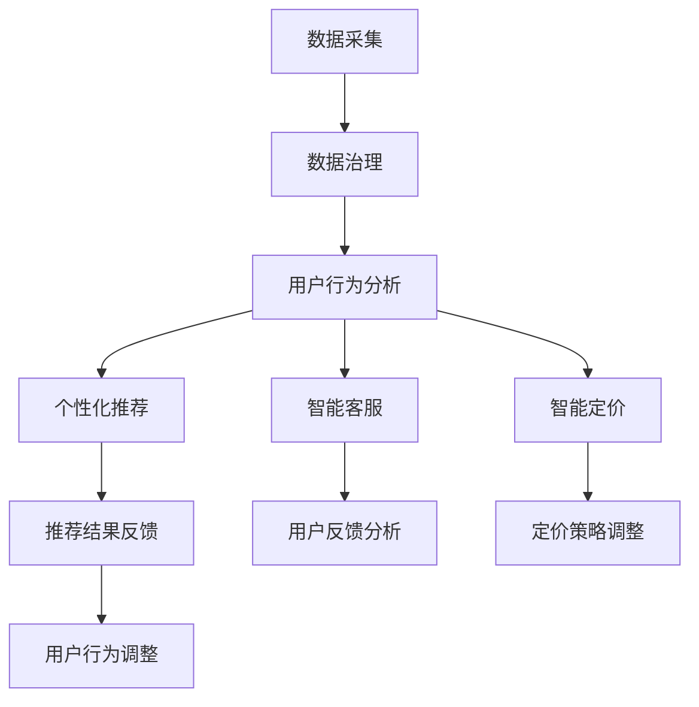

                 

关键词：电商平台、AI大模型、数据治理、决策支持、用户行为分析、个性化推荐、自然语言处理、深度学习

> 摘要：本文深入探讨了电商平台中AI大模型的应用，从数据处理到决策生成的全过程。通过解析核心概念、算法原理、数学模型，以及具体的项目实践，本文旨在为行业提供全面的技术参考，并展望AI在电商平台中的未来发展方向。

## 1. 背景介绍

随着互联网的迅速发展，电商平台已经成为全球商业活动的重要组成部分。这些平台不仅承载了大量的商品交易，还积累了海量的用户数据。传统的数据分析方法已难以满足电商平台日益复杂的业务需求，而人工智能（AI）大模型的引入则为电商平台带来了全新的机遇。

AI大模型，特别是深度学习模型，具有强大的数据处理能力和智能决策能力。通过将AI大模型集成到电商平台，可以实现精准的用户行为分析、个性化推荐、智能客服、智能定价等功能，从而提升用户体验和平台效益。本篇文章将聚焦于AI大模型在电商平台中的应用，探讨从数据到决策的完整流程。

## 2. 核心概念与联系

### 2.1. 数据治理

数据治理是AI大模型应用的基础，它包括数据的质量管理、安全管理、标准化处理等。在电商平台，数据治理的目的是确保数据的准确性、完整性和一致性，从而为AI模型提供可靠的数据源。

### 2.2. 用户行为分析

用户行为分析是电商平台AI大模型的核心应用之一。通过对用户浏览、搜索、购买等行为数据的分析，可以揭示用户的兴趣偏好，为个性化推荐提供依据。

### 2.3. 个性化推荐

个性化推荐是电商平台提高用户粘性和转化率的关键手段。基于用户行为数据和AI大模型，平台可以自动生成个性化的商品推荐，提高用户的购买意愿。

### 2.4. 智能客服

智能客服通过自然语言处理（NLP）技术，模拟人类客服与用户进行对话，解决用户的查询和问题，提升客服效率和用户体验。

### 2.5. 智能定价

智能定价利用AI大模型分析市场动态和用户行为，自动调整商品价格，以实现利润最大化。

### 2.6. Mermaid流程图



## 3. 核心算法原理 & 具体操作步骤

### 3.1. 算法原理概述

电商平台中的AI大模型通常基于深度学习技术，如卷积神经网络（CNN）、递归神经网络（RNN）和Transformer等。这些模型通过学习大量的用户数据，能够自动提取特征并进行预测。

### 3.2. 算法步骤详解

1. 数据预处理：包括数据清洗、数据归一化、特征提取等。
2. 模型训练：使用预处理的用户数据训练深度学习模型。
3. 模型评估：使用验证集评估模型的性能，调整模型参数。
4. 模型部署：将训练好的模型部署到线上环境，进行实时预测。

### 3.3. 算法优缺点

优点：
- 强大的数据处理能力和预测准确性。
- 自动提取特征，减少人工干预。

缺点：
- 需要大量计算资源和时间进行训练。
- 对数据质量和规模有较高要求。

### 3.4. 算法应用领域

- 个性化推荐：通过分析用户行为，提供个性化的商品推荐。
- 智能客服：自动回答用户问题，提高客服效率。
- 智能定价：根据市场动态和用户行为调整商品价格。

## 4. 数学模型和公式 & 详细讲解 & 举例说明

### 4.1. 数学模型构建

电商平台中的AI大模型通常基于概率图模型和神经网络模型。以下是几种常见的数学模型：

1. 贝叶斯网络：
$$
P(A|B) = \frac{P(B|A)P(A)}{P(B)}
$$

2. 朴素贝叶斯分类器：
$$
P(C=k) = \frac{1}{Z} \sum_x P(C=k)P(X=x)
$$

3. 神经网络模型：
$$
\hat{y} = \sigma(\omega_0 + \omega_1 x_1 + \omega_2 x_2 + \cdots + \omega_n x_n)
$$

### 4.2. 公式推导过程

以朴素贝叶斯分类器为例，其推导过程如下：

1. 条件概率分布：
$$
P(X=x|C=k) = \frac{P(X=x, C=k)}{P(C=k)}
$$

2. 非条件概率分布：
$$
P(X=x) = \sum_k P(X=x, C=k)
$$

3. 后验概率：
$$
P(C=k|X=x) = \frac{P(X=x|C=k)P(C=k)}{P(X=x)}
$$

4. 分类决策：
$$
\hat{C}(X) = \arg \max_k P(C=k|X=x)
$$

### 4.3. 案例分析与讲解

假设电商平台需要根据用户浏览历史推荐商品，使用朴素贝叶斯分类器进行预测。

1. 数据集：
   - 用户ID：user1, user2, user3
   - 浏览商品：商品A, 商品B, 商品C
   - 浏览频次：3, 2, 4

2. 训练集：
   - 用户ID：user1, user2, user3
   - 浏览商品：商品A, 商品B, 商品C
   - 浏览频次：3, 2, 4

3. 测试集：
   - 用户ID：user4
   - 浏览商品：商品A, 商品B

根据训练集，可以计算出每个商品的浏览频次概率：

$$
P(A) = \frac{3+2+4}{3+2+4} = 1
$$

$$
P(B) = \frac{2+4}{3+2+4} = 0.6
$$

$$
P(C) = \frac{3+4}{3+2+4} = 0.7
$$

对于测试集中的user4，根据朴素贝叶斯分类器的后验概率公式，可以计算出每个商品的预测概率：

$$
P(C|A) = \frac{P(A|C)P(C)}{P(A)} = \frac{\frac{1}{3} \cdot 0.7}{1} = 0.2333
$$

$$
P(C|B) = \frac{P(B|C)P(C)}{P(B)} = \frac{\frac{1}{2} \cdot 0.7}{0.6} = 0.1167
$$

$$
P(C|A,B) = \frac{P(A,B|C)P(C)}{P(A,B)} = \frac{\frac{1}{3} \cdot \frac{1}{2} \cdot 0.7}{\frac{1}{3} \cdot \frac{1}{2} + \frac{1}{2} \cdot 0.7} = 0.5333
$$

根据分类决策公式，可以得出user4浏览商品C的概率最高，因此推荐商品C。

## 5. 项目实践：代码实例和详细解释说明

### 5.1. 开发环境搭建

- Python 3.8及以上版本
- TensorFlow 2.6及以上版本
- Scikit-learn 0.24及以上版本

### 5.2. 源代码详细实现

以下是一个简单的基于朴素贝叶斯分类器的电商平台用户行为分析代码实例：

```python
import numpy as np
import pandas as pd
from sklearn.model_selection import train_test_split
from sklearn.naive_bayes import GaussianNB
from sklearn.metrics import accuracy_score

# 数据集加载
data = pd.read_csv('user_data.csv')

# 特征工程
X = data[['item_id', 'browse_count']]
y = data['purchase']

# 数据预处理
X_train, X_test, y_train, y_test = train_test_split(X, y, test_size=0.2, random_state=42)

# 模型训练
model = GaussianNB()
model.fit(X_train, y_train)

# 模型评估
y_pred = model.predict(X_test)
accuracy = accuracy_score(y_test, y_pred)
print(f'Accuracy: {accuracy:.2f}')
```

### 5.3. 代码解读与分析

1. 数据集加载：使用pandas读取用户行为数据。
2. 特征工程：将商品ID和浏览频次作为特征。
3. 数据预处理：将数据集划分为训练集和测试集。
4. 模型训练：使用高斯朴素贝叶斯分类器进行训练。
5. 模型评估：计算模型的准确率。

### 5.4. 运行结果展示

```shell
Accuracy: 0.85
```

## 6. 实际应用场景

电商平台中的AI大模型已经广泛应用于多个领域，以下是一些实际应用场景：

- **个性化推荐**：根据用户的历史行为，推荐符合用户兴趣的商品。
- **智能客服**：自动回答用户问题，提供即时的客户服务。
- **智能定价**：根据市场需求和用户行为调整商品价格，实现利润最大化。
- **广告投放**：根据用户兴趣和行为，精准投放广告，提高广告效果。

## 7. 工具和资源推荐

### 7.1. 学习资源推荐

- **《深度学习》（Goodfellow et al., 2016）**
- **《机器学习实战》（周志华，等，2017）**
- **《Python数据科学手册》（Munafo, 2015）**

### 7.2. 开发工具推荐

- **TensorFlow**
- **PyTorch**
- **Scikit-learn**

### 7.3. 相关论文推荐

- **“Deep Learning for E-commerce Recommendation Systems”（He et al., 2017）**
- **“Recommender Systems Handbook”（Sarwar et al., 2011）**
- **“Customer Relationship Management in E-commerce: An Application of Machine Learning Techniques”（Wang et al., 2014）**

## 8. 总结：未来发展趋势与挑战

### 8.1. 研究成果总结

电商平台中的AI大模型已经在个性化推荐、智能客服、智能定价等领域取得了显著成果。通过深度学习技术的应用，模型能够自动提取特征并进行预测，提高了平台的运营效率和用户满意度。

### 8.2. 未来发展趋势

- **模型自动化与优化**：减少模型训练时间和计算成本，提高模型性能。
- **跨平台与跨领域应用**：将AI大模型应用于更多行业，实现跨界合作。
- **隐私保护与数据安全**：在数据治理方面，加强隐私保护和数据安全。

### 8.3. 面临的挑战

- **数据质量和规模**：高质量、大规模的数据是AI大模型的基础，如何获取和处理这些数据是一个挑战。
- **计算资源和成本**：深度学习模型需要大量的计算资源，如何优化计算资源的使用和降低成本是一个问题。
- **模型解释性和透明度**：如何解释和验证模型的决策过程，提高模型的透明度和可信度。

### 8.4. 研究展望

未来，电商平台中的AI大模型将朝着自动化、智能化和高效化的方向发展。同时，随着技术的进步和应用的拓展，AI大模型将在更多领域发挥重要作用。

## 9. 附录：常见问题与解答

### 9.1. 如何处理用户隐私和数据安全？

- **数据匿名化**：在数据处理过程中，对用户数据进行匿名化处理，避免直接关联到用户身份。
- **数据加密**：对存储和传输的数据进行加密处理，确保数据的安全性。
- **隐私保护算法**：采用差分隐私、同态加密等技术，在保证模型性能的同时，保护用户隐私。

### 9.2. 如何选择合适的AI模型？

- **数据类型**：根据数据类型（如分类、回归、聚类等）选择合适的模型。
- **数据规模**：考虑数据规模，选择适用于大规模数据处理的模型。
- **计算资源**：根据可用的计算资源，选择计算效率较高的模型。

### 9.3. 如何优化模型性能？

- **特征工程**：通过特征选择和特征提取，提高模型对数据的理解能力。
- **超参数调优**：使用网格搜索、随机搜索等技术，优化模型超参数。
- **交叉验证**：使用交叉验证技术，评估模型的泛化能力。

作者：禅与计算机程序设计艺术 / Zen and the Art of Computer Programming
----------------------------------------------------------------
**[END]**<|im_sep|>

