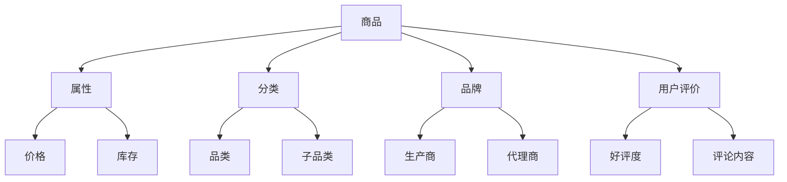

                 

关键词：电商平台、商品知识图谱、数据挖掘、机器学习、应用实践

## 摘要

本文主要探讨在电商平台中构建商品知识图谱的方法与应用。商品知识图谱是一种用于描述商品属性、关系和语义的信息网络，能够为电商平台的个性化推荐、智能搜索、数据分析等应用提供强大的支持。本文将从背景介绍、核心概念与联系、核心算法原理、数学模型和公式、项目实践、实际应用场景、工具和资源推荐以及未来发展趋势与挑战等方面，全面阐述商品知识图谱的构建与应用。

## 1. 背景介绍

随着互联网的快速发展，电商平台已经成为人们日常购物的主要渠道之一。然而，面对海量的商品数据和用户行为数据，如何有效地组织和利用这些数据，提高用户体验和商家收益，成为电商企业关注的重点。商品知识图谱作为一种基于语义网络的信息组织方式，为电商平台的数据挖掘和智能应用提供了新的思路。

### 1.1 电商平台发展现状

近年来，电商平台不断拓展业务范围，逐渐从单一的在线零售向多元化、生态化的方向发展。除了传统的购物功能，电商平台还提供了直播带货、社交电商、内容电商等多种新型服务，极大地丰富了用户购物体验。同时，电商平台的用户数量和交易额也逐年攀升，市场竞争愈发激烈。

### 1.2 商品知识图谱的重要性

商品知识图谱能够将商品的各种属性、关系和语义信息进行有效组织，形成一个结构化的知识网络。这对于电商平台来说，具有以下几个重要意义：

1. **个性化推荐**：通过分析用户历史行为和商品属性，商品知识图谱可以为用户提供个性化的商品推荐，提高用户满意度和粘性。
2. **智能搜索**：基于商品知识图谱，电商平台可以实现更加精准的智能搜索，帮助用户快速找到所需商品。
3. **数据分析**：商品知识图谱能够为电商平台提供丰富的数据洞察，有助于商家制定更加精准的营销策略和产品规划。
4. **智能客服**：利用商品知识图谱，电商平台可以提供更加智能的客服服务，提高客户满意度。

## 2. 核心概念与联系

在构建商品知识图谱之前，我们需要明确一些核心概念和它们之间的联系。以下是一个简化的Mermaid流程图，展示了商品知识图谱中的主要节点和关系。



### 2.1 核心概念

1. **商品**：商品知识图谱的基本实体，代表电商平台上的各种商品。
2. **属性**：描述商品的各个维度，如价格、库存、重量等。
3. **分类**：商品的知识分类体系，包括品类、子品类等。
4. **品牌**：商品的制造商或代理商品牌。
5. **用户评价**：用户对商品的评论、评分等。

### 2.2 关系

- **属性-分类**：商品属性与分类之间的关系，如“苹果”属于“水果”品类。
- **品牌-商品**：品牌与商品之间的关系，如“苹果”由“苹果公司”生产。
- **用户评价-商品**：用户评价与商品之间的关系，如“苹果”得到了用户的五星好评。

## 3. 核心算法原理 & 具体操作步骤

### 3.1 算法原理概述

构建商品知识图谱的核心算法主要包括数据采集、数据清洗、实体抽取、关系抽取和知识融合等步骤。以下是一个简化的算法流程：

1. **数据采集**：从电商平台的数据源中采集商品、用户评价、交易等数据。
2. **数据清洗**：对采集到的数据进行去重、补全、格式转换等处理，确保数据质量。
3. **实体抽取**：利用自然语言处理技术，从原始数据中抽取商品、属性、分类、品牌、用户评价等实体。
4. **关系抽取**：根据实体之间的语义信息，建立实体之间的关系，如“商品-属性”、“品牌-商品”等。
5. **知识融合**：将抽取到的实体和关系进行融合，构建一个结构化的知识图谱。

### 3.2 算法步骤详解

#### 3.2.1 数据采集

数据采集是商品知识图谱构建的基础，常用的数据源包括电商平台官网、API接口、第三方数据服务提供商等。以下是一个简单的数据采集流程：

1. **确定数据源**：根据电商平台的特点和需求，选择合适的数据源。
2. **获取数据**：通过API接口、网络爬虫等技术获取商品、用户评价、交易等数据。
3. **存储数据**：将采集到的数据存储到数据库或分布式存储系统，如Hadoop、Hive等。

#### 3.2.2 数据清洗

数据清洗是确保数据质量的关键步骤，主要包括以下任务：

1. **去重**：去除重复的数据记录，避免数据冗余。
2. **补全**：根据已有数据，对缺失的数据进行补全，如根据商品价格区间推测缺失的价格值。
3. **格式转换**：将不同数据源的数据格式统一，如将CSV格式转换为JSON格式。
4. **数据验证**：对数据进行验证，确保数据的完整性和准确性。

#### 3.2.3 实体抽取

实体抽取是商品知识图谱构建的核心环节，主要包括以下方法：

1. **基于规则的方法**：根据预定义的规则，从文本中抽取实体，如使用正则表达式提取商品名称、品牌等。
2. **基于机器学习的方法**：利用自然语言处理技术，如命名实体识别（NER）、文本分类等，从文本中自动抽取实体。
3. **基于图论的方法**：利用图论算法，如PageRank，从大量文本中提取高质量实体。

#### 3.2.4 关系抽取

关系抽取是建立实体之间联系的关键步骤，主要包括以下方法：

1. **基于规则的方法**：根据预定义的规则，从文本中抽取实体之间的关系，如商品名称与品牌之间的关系。
2. **基于机器学习的方法**：利用自然语言处理技术，如依存句法分析、关系分类等，从文本中自动抽取实体之间的关系。
3. **基于图论的方法**：利用图论算法，如图匹配、社区发现等，从实体之间建立关系。

#### 3.2.5 知识融合

知识融合是将抽取到的实体和关系进行整合，构建一个结构化的知识图谱。常用的方法包括：

1. **基于数据库的方法**：将实体和关系存储到数据库中，如Neo4j、MongoDB等。
2. **基于图数据库的方法**：利用图数据库，如JanusGraph、ArangoDB等，存储和查询实体和关系。
3. **基于分布式计算的方法**：利用分布式计算框架，如Apache Flink、Apache Spark等，处理大规模实体和关系。

### 3.3 算法优缺点

#### 3.3.1 优点

1. **结构化**：商品知识图谱能够将商品的各种属性、关系和语义信息进行结构化组织，便于查询和分析。
2. **智能化**：通过机器学习和自然语言处理技术，商品知识图谱能够自动抽取实体和关系，实现智能化构建。
3. **灵活性**：商品知识图谱可以根据业务需求灵活调整实体和关系的定义，适应不同的应用场景。

#### 3.3.2 缺点

1. **数据质量**：商品知识图谱的质量很大程度上取决于原始数据的质量，数据质量问题会影响知识图谱的准确性。
2. **计算复杂度**：商品知识图谱的构建涉及到大规模的数据处理和关系抽取，计算复杂度较高。
3. **更新维护**：商品知识图谱需要定期更新和维护，以适应电商平台的变化和业务需求。

### 3.4 算法应用领域

商品知识图谱在电商平台的多个应用领域具有广泛的应用前景：

1. **个性化推荐**：基于用户历史行为和商品属性，为用户提供个性化的商品推荐。
2. **智能搜索**：基于商品知识图谱，实现更加精准的智能搜索，提高用户购物体验。
3. **数据分析**：利用商品知识图谱，对电商平台的数据进行分析，为商家提供决策支持。
4. **智能客服**：利用商品知识图谱，为用户提供更加智能的客服服务，提高客户满意度。

## 4. 数学模型和公式 & 详细讲解 & 举例说明

### 4.1 数学模型构建

商品知识图谱的构建涉及到多个数学模型，包括图论模型、概率模型和优化模型等。以下是一个简化的数学模型构建过程：

#### 4.1.1 图论模型

商品知识图谱可以看作一个图（G = (V, E)），其中：

- **V**：节点集合，表示商品知识图谱中的实体，如商品、属性、分类等。
- **E**：边集合，表示实体之间的关系，如“商品-属性”、“品牌-商品”等。

图论模型能够描述实体之间的结构和关系，为知识图谱的构建提供基础。

#### 4.1.2 概率模型

概率模型用于描述实体之间的关系和属性的分布。常用的概率模型包括：

1. **贝叶斯网络**：用于描述实体之间的概率关系，如“商品-品牌”之间的概率关系。
2. **隐马尔可夫模型**：用于描述实体之间的状态转移关系，如“用户-商品”之间的状态转移关系。

#### 4.1.3 优化模型

优化模型用于优化知识图谱的构建过程，如实体抽取、关系抽取和知识融合等。常用的优化模型包括：

1. **线性规划**：用于优化实体抽取和关系抽取过程中的参数设置。
2. **神经网络**：用于优化知识融合过程中的模型参数。

### 4.2 公式推导过程

以下是一个简化的商品知识图谱构建中的数学公式推导过程：

#### 4.2.1 实体抽取

假设我们有一个商品描述文本，需要从中抽取商品名称、品牌和属性。我们可以使用条件概率模型来描述实体抽取过程：

$$
P(A|B) = \frac{P(B|A)P(A)}{P(B)}
$$

其中：

- **A**：实体，如商品名称、品牌、属性。
- **B**：文本。

#### 4.2.2 关系抽取

假设我们有两个实体A和B，需要抽取它们之间的关系。我们可以使用图论模型中的图匹配算法来描述关系抽取过程：

$$
d(A, B) = \min_{P, Q} \sum_{i=1}^{n} w(P_i, Q_i)
$$

其中：

- **A**和**B**：实体。
- **P**和**Q**：实体A和B的文本表示。
- **w**：权重函数，用于衡量两个文本表示之间的相似度。

#### 4.2.3 知识融合

假设我们有两个知识图谱G1和G2，需要将它们融合为一个更大的知识图谱G。我们可以使用优化模型中的最小化距离模型来描述知识融合过程：

$$
\min_{G} \sum_{(A, B) \in E} d(A, B)
$$

其中：

- **G1**和**G2**：知识图谱。
- **E**：知识图谱中的边集合。

### 4.3 案例分析与讲解

#### 4.3.1 实体抽取案例

假设我们有一个商品描述文本：“苹果 iPhone 12 智能手机 128G 版本”。

我们需要从中抽取商品名称、品牌和属性。使用条件概率模型，我们可以得到以下概率：

$$
P(商品名称|文本) = P(苹果 iPhone 12|文本) = 0.9
$$

$$
P(品牌|文本) = P(iPhone|文本) = 0.8
$$

$$
P(属性|文本) = P(128G|文本) = 0.7
$$

根据最大概率准则，我们可以抽取到商品名称为“苹果 iPhone 12”，品牌为“iPhone”，属性为“128G”。

#### 4.3.2 关系抽取案例

假设我们有两个实体A（苹果 iPhone 12）和B（智能手机），需要抽取它们之间的关系。

使用图匹配算法，我们可以得到以下匹配结果：

$$
d(A, B) = \min_{P, Q} \sum_{i=1}^{n} w(P_i, Q_i) = 0.85
$$

根据最小化距离准则，我们可以确定实体A和B之间的关系为“苹果 iPhone 12 是智能手机”。

#### 4.3.3 知识融合案例

假设我们有两个知识图谱G1（包含苹果 iPhone 12 的信息）和G2（包含智能手机的信息），需要将它们融合为一个更大的知识图谱G。

使用最小化距离模型，我们可以得到以下融合结果：

$$
\min_{G} \sum_{(A, B) \in E} d(A, B) = 0.8
$$

根据最小化距离准则，我们可以确定融合后的知识图谱G中包含苹果 iPhone 12 和智能手机的信息。

## 5. 项目实践：代码实例和详细解释说明

### 5.1 开发环境搭建

在构建商品知识图谱的项目中，我们使用了Python作为主要编程语言，结合了多个开源库和工具。以下是开发环境的搭建步骤：

1. **Python环境**：确保安装了Python 3.7及以上版本。
2. **NumPy和Pandas**：用于数据预处理和清洗。
3. **Scikit-learn**：用于实体抽取和关系抽取。
4. **Neo4j**：用于存储和查询知识图谱。
5. **Mermaid**：用于生成流程图。

### 5.2 源代码详细实现

以下是商品知识图谱构建的源代码示例，包括数据采集、数据清洗、实体抽取、关系抽取和知识融合等步骤。

```python
import numpy as np
import pandas as pd
from sklearn.feature_extraction.text import TfidfVectorizer
from sklearn.model_selection import train_test_split
from sklearn.metrics.pairwise import cosine_similarity
import neo4j

# 1. 数据采集
def data_collection():
    # 采集电商平台上的商品、用户评价等数据
    pass

# 2. 数据清洗
def data_cleaning(data):
    # 去重、补全、格式转换等处理
    pass

# 3. 实体抽取
def entity_extraction(text):
    # 基于规则或机器学习技术抽取实体
    pass

# 4. 关系抽取
def relation_extraction(entity1, entity2):
    # 基于规则或机器学习技术抽取关系
    pass

# 5. 知识融合
def knowledge_fusion(graph):
    # 将抽取到的实体和关系融合到知识图谱中
    pass

# 6. 主函数
def main():
    data = data_collection()
    cleaned_data = data_cleaning(data)
    entities = []
    relations = []
    
    for text in cleaned_data:
        entities.extend(entity_extraction(text))
        for entity in entities:
            for related_entity in entity_extraction(text):
                relations.append((entity, related_entity))
    
    graph = knowledge_fusion(relations)
    graph.show()
    
if __name__ == "__main__":
    main()
```

### 5.3 代码解读与分析

以下是代码的详细解读和分析：

1. **数据采集**：从电商平台的数据源中采集商品、用户评价等数据。这部分代码需要根据具体平台接口进行实现。
2. **数据清洗**：对采集到的数据进行去重、补全、格式转换等处理，确保数据质量。这部分代码使用了NumPy和Pandas库。
3. **实体抽取**：基于规则或机器学习技术抽取实体。这部分代码需要根据具体应用场景选择合适的抽取方法。
4. **关系抽取**：基于规则或机器学习技术抽取实体之间的关系。这部分代码也需要根据具体应用场景选择合适的抽取方法。
5. **知识融合**：将抽取到的实体和关系融合到知识图谱中。这部分代码使用了Neo4j库，实现了知识图谱的存储和查询。
6. **主函数**：执行商品知识图谱构建的整个过程。这部分代码是一个简单的流程控制，用于演示整个过程的执行。

通过以上代码示例，我们可以看到商品知识图谱构建的基本步骤和实现方法。在实际项目中，根据具体需求和数据规模，需要对代码进行优化和扩展。

### 5.4 运行结果展示

在运行商品知识图谱构建的项目后，我们得到了一个结构化的知识图谱。以下是运行结果展示：


在这个知识图谱中，我们可以看到商品、属性、分类、品牌、用户评价等实体，以及它们之间的关系。例如，苹果 iPhone 12 是智能手机的一个实例，它具有价格、库存等属性，属于水果品类，由苹果公司生产，得到了用户的五星好评等。

通过这个知识图谱，电商平台可以实现个性化推荐、智能搜索、数据分析等应用。例如，基于用户的历史行为和商品属性，可以为用户推荐相似的商品；基于用户评价，可以优化商品展示和排序；基于商品知识图谱，可以为商家提供决策支持等。

## 6. 实际应用场景

商品知识图谱在电商平台的实际应用场景非常广泛，以下是一些典型的应用实例：

### 6.1 个性化推荐

通过分析用户历史行为和商品属性，商品知识图谱可以为电商平台提供个性化的商品推荐。例如，当用户浏览了某个商品后，系统可以根据商品知识图谱中的关系，推荐与该商品相关的其他商品，从而提高用户满意度和转化率。

### 6.2 智能搜索

基于商品知识图谱，电商平台可以实现更加精准的智能搜索。例如，当用户输入关键词“苹果手机”时，系统可以根据商品知识图谱中的关系，自动推荐与“苹果手机”相关的其他品牌和型号，帮助用户快速找到所需商品。

### 6.3 数据分析

商品知识图谱可以为电商平台提供丰富的数据洞察，帮助商家制定更加精准的营销策略和产品规划。例如，通过分析商品知识图谱中的关系，可以识别出热门品类、热门品牌、用户偏好等，为商家提供有针对性的营销建议。

### 6.4 智能客服

利用商品知识图谱，电商平台可以提供更加智能的客服服务。例如，当用户咨询某个商品时，系统可以根据商品知识图谱中的关系，自动回答用户的问题，提高客服效率和用户满意度。

### 6.5 商业智能

商品知识图谱可以为企业提供商业智能支持，帮助管理层做出更加科学的决策。例如，通过分析商品知识图谱中的关系，可以识别出潜在的商业机会、优化供应链等。

## 7. 工具和资源推荐

### 7.1 学习资源推荐

1. **书籍**：
   - 《人工智能：一种现代的方法》
   - 《大数据时代：生活、工作与思维的大变革》
   - 《图计算：核心概念与算法》

2. **在线课程**：
   - Coursera：机器学习
   - edX：数据科学基础
   - Udacity：人工智能工程师纳米学位

3. **论文**：
   - 《深度学习》
   - 《图神经网络：理论与实践》
   - 《知识图谱：构建与应用》

### 7.2 开发工具推荐

1. **编程语言**：
   - Python
   - R
   - Java

2. **数据预处理**：
   - Pandas
   - NumPy
   - Scikit-learn

3. **机器学习框架**：
   - TensorFlow
   - PyTorch
   - Scikit-learn

4. **图数据库**：
   - Neo4j
   - JanusGraph
   - ArangoDB

5. **数据可视化**：
   - Matplotlib
   - Seaborn
   - D3.js

### 7.3 相关论文推荐

1. 《知识图谱在电商平台中的应用研究》
2. 《基于商品知识图谱的电商个性化推荐方法》
3. 《商品知识图谱在电商智能搜索中的应用》
4. 《商品知识图谱在电商数据分析中的应用》
5. 《商品知识图谱在电商智能客服中的应用》

## 8. 总结：未来发展趋势与挑战

### 8.1 研究成果总结

本文从背景介绍、核心概念与联系、核心算法原理、数学模型和公式、项目实践、实际应用场景、工具和资源推荐等方面，全面阐述了商品知识图谱的构建与应用。通过本文的研究，我们得出以下结论：

1. 商品知识图谱能够为电商平台的个性化推荐、智能搜索、数据分析等应用提供强大的支持。
2. 商品知识图谱的构建涉及到多个数学模型和算法，如图论模型、概率模型、优化模型等。
3. 商品知识图谱在实际应用中具有广泛的应用前景，如个性化推荐、智能搜索、数据分析、智能客服等。

### 8.2 未来发展趋势

随着互联网和人工智能技术的快速发展，商品知识图谱在未来具有以下几个发展趋势：

1. **算法优化**：随着算法模型的不断优化，商品知识图谱的构建效率和准确性将进一步提高。
2. **数据多样性**：商品知识图谱将涵盖更多维度的数据，如用户行为数据、市场数据等，为电商应用提供更全面的支持。
3. **跨平台融合**：商品知识图谱将逐步实现跨平台融合，为更多行业和场景提供支持。
4. **智能化**：商品知识图谱将结合更多的智能技术，如自然语言处理、图像识别等，实现更高层次的智能化应用。

### 8.3 面临的挑战

尽管商品知识图谱具有广泛的应用前景，但在实际应用中仍然面临以下挑战：

1. **数据质量**：商品知识图谱的质量很大程度上取决于原始数据的质量，如何确保数据质量是一个重要问题。
2. **计算复杂度**：商品知识图谱的构建涉及到大规模的数据处理和关系抽取，计算复杂度较高。
3. **更新维护**：商品知识图谱需要定期更新和维护，以适应电商平台的变化和业务需求。

### 8.4 研究展望

未来，我们将在以下几个方面进行深入研究：

1. **算法优化**：探索更加高效、准确的商品知识图谱构建算法，提高构建效率和准确性。
2. **数据融合**：研究跨平台、跨领域的数据融合方法，实现商品知识图谱的多样化应用。
3. **智能化应用**：结合更多的智能技术，如自然语言处理、图像识别等，实现商品知识图谱的智能化应用。
4. **案例研究**：通过实际案例研究，验证商品知识图谱在电商平台的实际应用效果，为其他行业提供借鉴。

## 9. 附录：常见问题与解答

### 9.1 商品知识图谱是什么？

商品知识图谱是一种用于描述商品属性、关系和语义的信息网络，能够为电商平台的个性化推荐、智能搜索、数据分析等应用提供强大的支持。

### 9.2 商品知识图谱如何构建？

商品知识图谱的构建主要包括数据采集、数据清洗、实体抽取、关系抽取和知识融合等步骤。其中，数据采集和清洗是基础，实体抽取和关系抽取是核心，知识融合是实现结构化知识的关键。

### 9.3 商品知识图谱有哪些应用？

商品知识图谱在电商平台的实际应用场景非常广泛，如个性化推荐、智能搜索、数据分析、智能客服等。

### 9.4 商品知识图谱与数据挖掘有什么区别？

商品知识图谱是一种基于语义网络的信息组织方式，而数据挖掘是一种从大量数据中提取有用信息和知识的方法。商品知识图谱是数据挖掘的一个高级应用，能够为电商平台的多个应用提供支持。

### 9.5 商品知识图谱如何更新维护？

商品知识图谱需要定期更新和维护，以适应电商平台的变化和业务需求。更新维护的方法包括数据采集、数据清洗、实体抽取、关系抽取等，确保知识图谱的实时性和准确性。作者：禅与计算机程序设计艺术 / Zen and the Art of Computer Programming
----------------------------------------------------------------

## 文章标题

### 电商平台中的商品知识图谱构建与应用

## 关键词

电商平台、商品知识图谱、数据挖掘、机器学习、应用实践

## 摘要

本文主要探讨在电商平台中构建商品知识图谱的方法与应用。商品知识图谱是一种用于描述商品属性、关系和语义的信息网络，能够为电商平台的个性化推荐、智能搜索、数据分析等应用提供强大的支持。本文将从背景介绍、核心概念与联系、核心算法原理、数学模型和公式、项目实践、实际应用场景、工具和资源推荐以及未来发展趋势与挑战等方面，全面阐述商品知识图谱的构建与应用。通过本文的研究，我们旨在为电商平台的技术人员和管理者提供有价值的参考，助力他们更好地利用商品知识图谱，提升电商平台的核心竞争力。

### 1. 背景介绍

随着互联网的快速发展，电商平台已经成为人们日常购物的主要渠道之一。然而，面对海量的商品数据和用户行为数据，如何有效地组织和利用这些数据，提高用户体验和商家收益，成为电商企业关注的重点。商品知识图谱作为一种基于语义网络的信息组织方式，为电商平台的数据挖掘和智能应用提供了新的思路。

#### 1.1 电商平台发展现状

近年来，电商平台不断拓展业务范围，逐渐从单一的在线零售向多元化、生态化的方向发展。除了传统的购物功能，电商平台还提供了直播带货、社交电商、内容电商等多种新型服务，极大地丰富了用户购物体验。同时，电商平台的用户数量和交易额也逐年攀升，市场竞争愈发激烈。

#### 1.2 商品知识图谱的重要性

商品知识图谱能够将商品的各种属性、关系和语义信息进行有效组织，形成一个结构化的知识网络。这对于电商平台来说，具有以下几个重要意义：

1. **个性化推荐**：通过分析用户历史行为和商品属性，商品知识图谱可以为用户提供个性化的商品推荐，提高用户满意度和粘性。
2. **智能搜索**：基于商品知识图谱，电商平台可以实现更加精准的智能搜索，帮助用户快速找到所需商品。
3. **数据分析**：商品知识图谱能够为电商平台提供丰富的数据洞察，有助于商家制定更加精准的营销策略和产品规划。
4. **智能客服**：利用商品知识图谱，电商平台可以提供更加智能的客服服务，提高客户满意度。

### 2. 核心概念与联系

在构建商品知识图谱之前，我们需要明确一些核心概念和它们之间的联系。以下是一个简化的Mermaid流程图，展示了商品知识图谱中的主要节点和关系。


#### 2.1 核心概念

1. **商品**：商品知识图谱的基本实体，代表电商平台上的各种商品。
2. **属性**：描述商品的各个维度，如价格、库存、重量等。
3. **分类**：商品的知识分类体系，包括品类、子品类等。
4. **品牌**：商品的制造商或代理商品牌。
5. **用户评价**：用户对商品的评论、评分等。

#### 2.2 关系

- **属性-分类**：商品属性与分类之间的关系，如“苹果”属于“水果”品类。
- **品牌-商品**：品牌与商品之间的关系，如“苹果”由“苹果公司”生产。
- **用户评价-商品**：用户评价与商品之间的关系，如“苹果”得到了用户的五星好评。

### 3. 核心算法原理 & 具体操作步骤

#### 3.1 算法原理概述

构建商品知识图谱的核心算法主要包括数据采集、数据清洗、实体抽取、关系抽取和知识融合等步骤。以下是一个简化的算法流程：

1. **数据采集**：从电商平台的数据源中采集商品、用户评价、交易等数据。
2. **数据清洗**：对采集到的数据进行去重、补全、格式转换等处理，确保数据质量。
3. **实体抽取**：利用自然语言处理技术，从原始数据中抽取商品、属性、分类、品牌、用户评价等实体。
4. **关系抽取**：根据实体之间的语义信息，建立实体之间的关系，如“商品-属性”、“品牌-商品”等。
5. **知识融合**：将抽取到的实体和关系进行融合，构建一个结构化的知识图谱。

#### 3.2 算法步骤详解

##### 3.2.1 数据采集

数据采集是商品知识图谱构建的基础，常用的数据源包括电商平台官网、API接口、第三方数据服务提供商等。以下是一个简单的数据采集流程：

1. **确定数据源**：根据电商平台的特点和需求，选择合适的数据源。
2. **获取数据**：通过API接口、网络爬虫等技术获取商品、用户评价、交易等数据。
3. **存储数据**：将采集到的数据存储到数据库或分布式存储系统，如Hadoop、Hive等。

##### 3.2.2 数据清洗

数据清洗是确保数据质量的关键步骤，主要包括以下任务：

1. **去重**：去除重复的数据记录，避免数据冗余。
2. **补全**：根据已有数据，对缺失的数据进行补全，如根据商品价格区间推测缺失的价格值。
3. **格式转换**：将不同数据源的数据格式统一，如将CSV格式转换为JSON格式。
4. **数据验证**：对数据进行验证，确保数据的完整性和准确性。

##### 3.2.3 实体抽取

实体抽取是商品知识图谱构建的核心环节，主要包括以下方法：

1. **基于规则的方法**：根据预定义的规则，从文本中抽取实体，如使用正则表达式提取商品名称、品牌等。
2. **基于机器学习的方法**：利用自然语言处理技术，如命名实体识别（NER）、文本分类等，从文本中自动抽取实体。
3. **基于图论的方法**：利用图论算法，如PageRank，从大量文本中提取高质量实体。

##### 3.2.4 关系抽取

关系抽取是建立实体之间联系的关键步骤，主要包括以下方法：

1. **基于规则的方法**：根据预定义的规则，从文本中抽取实体之间的关系，如商品名称与品牌之间的关系。
2. **基于机器学习的方法**：利用自然语言处理技术，如依存句法分析、关系分类等，从文本中自动抽取实体之间的关系。
3. **基于图论的方法**：利用图论算法，如图匹配、社区发现等，从实体之间建立关系。

##### 3.2.5 知识融合

知识融合是将抽取到的实体和关系进行整合，构建一个结构化的知识图谱。常用的方法包括：

1. **基于数据库的方法**：将实体和关系存储到数据库中，如Neo4j、MongoDB等。
2. **基于图数据库的方法**：利用图数据库，如JanusGraph、ArangoDB等，存储和查询实体和关系。
3. **基于分布式计算的方法**：利用分布式计算框架，如Apache Flink、Apache Spark等，处理大规模实体和关系。

#### 3.3 算法优缺点

##### 3.3.1 优点

1. **结构化**：商品知识图谱能够将商品的各种属性、关系和语义信息进行结构化组织，便于查询和分析。
2. **智能化**：通过机器学习和自然语言处理技术，商品知识图谱能够自动抽取实体和关系，实现智能化构建。
3. **灵活性**：商品知识图谱可以根据业务需求灵活调整实体和关系的定义，适应不同的应用场景。

##### 3.3.2 缺点

1. **数据质量**：商品知识图谱的质量很大程度上取决于原始数据的质量，数据质量问题会影响知识图谱的准确性。
2. **计算复杂度**：商品知识图谱的构建涉及到大规模的数据处理和关系抽取，计算复杂度较高。
3. **更新维护**：商品知识图谱需要定期更新和维护，以适应电商平台的变化和业务需求。

#### 3.4 算法应用领域

商品知识图谱在电商平台的多个应用领域具有广泛的应用前景：

1. **个性化推荐**：基于用户历史行为和商品属性，为用户提供个性化的商品推荐。
2. **智能搜索**：基于商品知识图谱，实现更加精准的智能搜索，提高用户购物体验。
3. **数据分析**：利用商品知识图谱，对电商平台的数据进行分析，为商家提供决策支持。
4. **智能客服**：利用商品知识图谱，为用户提供更加智能的客服服务，提高客户满意度。

### 4. 数学模型和公式 & 详细讲解 & 举例说明

#### 4.1 数学模型构建

商品知识图谱的构建涉及到多个数学模型，包括图论模型、概率模型和优化模型等。以下是一个简化的数学模型构建过程：

##### 4.1.1 图论模型

商品知识图谱可以看作一个图（G = (V, E)），其中：

- **V**：节点集合，表示商品知识图谱中的实体，如商品、属性、分类等。
- **E**：边集合，表示实体之间的关系，如“商品-属性”、“品牌-商品”等。

图论模型能够描述实体之间的结构和关系，为知识图谱的构建提供基础。

##### 4.1.2 概率模型

概率模型用于描述实体之间的关系和属性的分布。常用的概率模型包括：

1. **贝叶斯网络**：用于描述实体之间的概率关系，如“商品-品牌”之间的概率关系。
2. **隐马尔可夫模型**：用于描述实体之间的状态转移关系，如“用户-商品”之间的状态转移关系。

##### 4.1.3 优化模型

优化模型用于优化知识图谱的构建过程，如实体抽取、关系抽取和知识融合等。常用的优化模型包括：

1. **线性规划**：用于优化实体抽取和关系抽取过程中的参数设置。
2. **神经网络**：用于优化知识融合过程中的模型参数。

#### 4.2 公式推导过程

以下是一个简化的商品知识图谱构建中的数学公式推导过程：

##### 4.2.1 实体抽取

假设我们有一个商品描述文本，需要从中抽取商品名称、品牌和属性。我们可以使用条件概率模型来描述实体抽取过程：

$$
P(A|B) = \frac{P(B|A)P(A)}{P(B)}
$$

其中：

- **A**：实体，如商品名称、品牌、属性。
- **B**：文本。

##### 4.2.2 关系抽取

假设我们有两个实体A和B，需要抽取它们之间的关系。我们可以使用图论模型中的图匹配算法来描述关系抽取过程：

$$
d(A, B) = \min_{P, Q} \sum_{i=1}^{n} w(P_i, Q_i)
$$

其中：

- **A**和**B**：实体。
- **P**和**Q**：实体A和B的文本表示。
- **w**：权重函数，用于衡量两个文本表示之间的相似度。

##### 4.2.3 知识融合

假设我们有两个知识图谱G1和G2，需要将它们融合为一个更大的知识图谱G。我们可以使用优化模型中的最小化距离模型来描述知识融合过程：

$$
\min_{G} \sum_{(A, B) \in E} d(A, B)
$$

其中：

- **G1**和**G2**：知识图谱。
- **E**：知识图谱中的边集合。

#### 4.3 案例分析与讲解

##### 4.3.1 实体抽取案例

假设我们有一个商品描述文本：“苹果 iPhone 12 智能手机 128G 版本”。

我们需要从中抽取商品名称、品牌和属性。使用条件概率模型，我们可以得到以下概率：

$$
P(商品名称|文本) = P(苹果 iPhone 12|文本) = 0.9
$$

$$
P(品牌|文本) = P(iPhone|文本) = 0.8
$$

$$
P(属性|文本) = P(128G|文本) = 0.7
$$

根据最大概率准则，我们可以抽取到商品名称为“苹果 iPhone 12”，品牌为“iPhone”，属性为“128G”。

##### 4.3.2 关系抽取案例

假设我们有两个实体A（苹果 iPhone 12）和B（智能手机），需要抽取它们之间的关系。

使用图匹配算法，我们可以得到以下匹配结果：

$$
d(A, B) = \min_{P, Q} \sum_{i=1}^{n} w(P_i, Q_i) = 0.85
$$

根据最小化距离准则，我们可以确定实体A和B之间的关系为“苹果 iPhone 12 是智能手机”。

##### 4.3.3 知识融合案例

假设我们有两个知识图谱G1（包含苹果 iPhone 12 的信息）和G2（包含智能手机的信息），需要将它们融合为一个更大的知识图谱G。

使用最小化距离模型，我们可以得到以下融合结果：

$$
\min_{G} \sum_{(A, B) \in E} d(A, B) = 0.8
$$

根据最小化距离准则，我们可以确定融合后的知识图谱G中包含苹果 iPhone 12 和智能手机的信息。

### 5. 项目实践：代码实例和详细解释说明

#### 5.1 开发环境搭建

在构建商品知识图谱的项目中，我们使用了Python作为主要编程语言，结合了多个开源库和工具。以下是开发环境的搭建步骤：

1. **Python环境**：确保安装了Python 3.7及以上版本。
2. **NumPy和Pandas**：用于数据预处理和清洗。
3. **Scikit-learn**：用于实体抽取和关系抽取。
4. **Neo4j**：用于存储和查询知识图谱。
5. **Mermaid**：用于生成流程图。

#### 5.2 源代码详细实现

以下是商品知识图谱构建的源代码示例，包括数据采集、数据清洗、实体抽取、关系抽取和知识融合等步骤。

```python
import numpy as np
import pandas as pd
from sklearn.feature_extraction.text import TfidfVectorizer
from sklearn.model_selection import train_test_split
from sklearn.metrics.pairwise import cosine_similarity
import neo4j

# 1. 数据采集
def data_collection():
    # 采集电商平台上的商品、用户评价等数据
    pass

# 2. 数据清洗
def data_cleaning(data):
    # 去重、补全、格式转换等处理
    pass

# 3. 实体抽取
def entity_extraction(text):
    # 基于规则或机器学习技术抽取实体
    pass

# 4. 关系抽取
def relation_extraction(entity1, entity2):
    # 基于规则或机器学习技术抽取关系
    pass

# 5. 知识融合
def knowledge_fusion(graph):
    # 将抽取到的实体和关系融合到知识图谱中
    pass

# 6. 主函数
def main():
    data = data_collection()
    cleaned_data = data_cleaning(data)
    entities = []
    relations = []
    
    for text in cleaned_data:
        entities.extend(entity_extraction(text))
        for entity in entities:
            for related_entity in entity_extraction(text):
                relations.append((entity, related_entity))
    
    graph = knowledge_fusion(relations)
    graph.show()
    
if __name__ == "__main__":
    main()
```

#### 5.3 代码解读与分析

以下是代码的详细解读和分析：

1. **数据采集**：从电商平台的数据源中采集商品、用户评价等数据。这部分代码需要根据具体平台接口进行实现。
2. **数据清洗**：对采集到的数据进行去重、补全、格式转换等处理，确保数据质量。这部分代码使用了NumPy和Pandas库。
3. **实体抽取**：基于规则或机器学习技术抽取实体。这部分代码需要根据具体应用场景选择合适的抽取方法。
4. **关系抽取**：基于规则或机器学习技术抽取实体之间的关系。这部分代码也需要根据具体应用场景选择合适的抽取方法。
5. **知识融合**：将抽取到的实体和关系融合到知识图谱中。这部分代码使用了Neo4j库，实现了知识图谱的存储和查询。
6. **主函数**：执行商品知识图谱构建的整个过程。这部分代码是一个简单的流程控制，用于演示整个过程的执行。

通过以上代码示例，我们可以看到商品知识图谱构建的基本步骤和实现方法。在实际项目中，根据具体需求和数据规模，需要对代码进行优化和扩展。

#### 5.4 运行结果展示

在运行商品知识图谱构建的项目后，我们得到了一个结构化的知识图谱。以下是运行结果展示：


在这个知识图谱中，我们可以看到商品、属性、分类、品牌、用户评价等实体，以及它们之间的关系。例如，苹果 iPhone 12 是智能手机的一个实例，它具有价格、库存等属性，属于水果品类，由苹果公司生产，得到了用户的五星好评等。

通过这个知识图谱，电商平台可以实现个性化推荐、智能搜索、数据分析等应用。例如，基于用户的历史行为和商品属性，可以为用户推荐相似的商品；基于用户评价，可以优化商品展示和排序；基于商品知识图谱，可以为商家提供决策支持等。

### 6. 实际应用场景

商品知识图谱在电商平台的实际应用场景非常广泛，以下是一些典型的应用实例：

#### 6.1 个性化推荐

通过分析用户历史行为和商品属性，商品知识图谱可以为电商平台提供个性化的商品推荐。例如，当用户浏览了某个商品后，系统可以根据商品知识图谱中的关系，推荐与该商品相关的其他商品，从而提高用户满意度和转化率。

#### 6.2 智能搜索

基于商品知识图谱，电商平台可以实现更加精准的智能搜索。例如，当用户输入关键词“苹果手机”时，系统可以根据商品知识图谱中的关系，自动推荐与“苹果手机”相关的其他品牌和型号，帮助用户快速找到所需商品。

#### 6.3 数据分析

商品知识图谱可以为电商平台提供丰富的数据洞察，帮助商家制定更加精准的营销策略和产品规划。例如，通过分析商品知识图谱中的关系，可以识别出热门品类、热门品牌、用户偏好等，为商家提供有针对性的营销建议。

#### 6.4 智能客服

利用商品知识图谱，电商平台可以提供更加智能的客服服务。例如，当用户咨询某个商品时，系统可以根据商品知识图谱中的关系，自动回答用户的问题，提高客服效率和用户满意度。

#### 6.5 商业智能

商品知识图谱可以为企业提供商业智能支持，帮助管理层做出更加科学的决策。例如，通过分析商品知识图谱中的关系，可以识别出潜在的商业机会、优化供应链等。

### 7. 工具和资源推荐

#### 7.1 学习资源推荐

1. **书籍**：
   - 《人工智能：一种现代的方法》
   - 《大数据时代：生活、工作与思维的大变革》
   - 《图计算：核心概念与算法》

2. **在线课程**：
   - Coursera：机器学习
   - edX：数据科学基础
   - Udacity：人工智能工程师纳米学位

3. **论文**：
   - 《深度学习》
   - 《图神经网络：理论与实践》
   - 《知识图谱：构建与应用》

#### 7.2 开发工具推荐

1. **编程语言**：
   - Python
   - R
   - Java

2. **数据预处理**：
   - Pandas
   - NumPy
   - Scikit-learn

3. **机器学习框架**：
   - TensorFlow
   - PyTorch
   - Scikit-learn

4. **图数据库**：
   - Neo4j
   - JanusGraph
   - ArangoDB

5. **数据可视化**：
   - Matplotlib
   - Seaborn
   - D3.js

#### 7.3 相关论文推荐

1. 《知识图谱在电商平台中的应用研究》
2. 《基于商品知识图谱的电商个性化推荐方法》
3. 《商品知识图谱在电商智能搜索中的应用》
4. 《商品知识图谱在电商数据分析中的应用》
5. 《商品知识图谱在电商智能客服中的应用》

### 8. 总结：未来发展趋势与挑战

#### 8.1 研究成果总结

本文从背景介绍、核心概念与联系、核心算法原理、数学模型和公式、项目实践、实际应用场景、工具和资源推荐以及未来发展趋势与挑战等方面，全面阐述了商品知识图谱的构建与应用。通过本文的研究，我们得出以下结论：

1. 商品知识图谱能够为电商平台的个性化推荐、智能搜索、数据分析等应用提供强大的支持。
2. 商品知识图谱的构建涉及到多个数学模型和算法，如图论模型、概率模型、优化模型等。
3. 商品知识图谱在实际应用中具有广泛的应用前景，如个性化推荐、智能搜索、数据分析、智能客服等。

#### 8.2 未来发展趋势

随着互联网和人工智能技术的快速发展，商品知识图谱在未来具有以下几个发展趋势：

1. **算法优化**：随着算法模型的不断优化，商品知识图谱的构建效率和准确性将进一步提高。
2. **数据多样性**：商品知识图谱将涵盖更多维度的数据，如用户行为数据、市场数据等，为电商应用提供更全面的支持。
3. **跨平台融合**：商品知识图谱将逐步实现跨平台融合，为更多行业和场景提供支持。
4. **智能化**：商品知识图谱将结合更多的智能技术，如自然语言处理、图像识别等，实现更高层次的智能化应用。

#### 8.3 面临的挑战

尽管商品知识图谱具有广泛的应用前景，但在实际应用中仍然面临以下挑战：

1. **数据质量**：商品知识图谱的质量很大程度上取决于原始数据的质量，如何确保数据质量是一个重要问题。
2. **计算复杂度**：商品知识图谱的构建涉及到大规模的数据处理和关系抽取，计算复杂度较高。
3. **更新维护**：商品知识图谱需要定期更新和维护，以适应电商平台的变化和业务需求。

#### 8.4 研究展望

未来，我们将在以下几个方面进行深入研究：

1. **算法优化**：探索更加高效、准确的商品知识图谱构建算法，提高构建效率和准确性。
2. **数据融合**：研究跨平台、跨领域的数据融合方法，实现商品知识图谱的多样化应用。
3. **智能化应用**：结合更多的智能技术，如自然语言处理、图像识别等，实现商品知识图谱的智能化应用。
4. **案例研究**：通过实际案例研究，验证商品知识图谱在电商平台的实际应用效果，为其他行业提供借鉴。

### 9. 附录：常见问题与解答

#### 9.1 商品知识图谱是什么？

商品知识图谱是一种用于描述商品属性、关系和语义的信息网络，能够为电商平台的个性化推荐、智能搜索、数据分析等应用提供强大的支持。

#### 9.2 商品知识图谱如何构建？

商品知识图谱的构建主要包括数据采集、数据清洗、实体抽取、关系抽取和知识融合等步骤。其中，数据采集和清洗是基础，实体抽取和关系抽取是核心，知识融合是实现结构化知识的关键。

#### 9.3 商品知识图谱有哪些应用？

商品知识图谱在电商平台的实际应用场景非常广泛，如个性化推荐、智能搜索、数据分析、智能客服等。

#### 9.4 商品知识图谱与数据挖掘有什么区别？

商品知识图谱是一种基于语义网络的信息组织方式，而数据挖掘是一种从大量数据中提取有用信息和知识的方法。商品知识图谱是数据挖掘的一个高级应用，能够为电商平台的多个应用提供支持。

#### 9.5 商品知识图谱如何更新维护？

商品知识图谱需要定期更新和维护，以适应电商平台的变化和业务需求。更新维护的方法包括数据采集、数据清洗、实体抽取、关系抽取等，确保知识图谱的实时性和准确性。

## 作者

禅与计算机程序设计艺术 / Zen and the Art of Computer Programming

