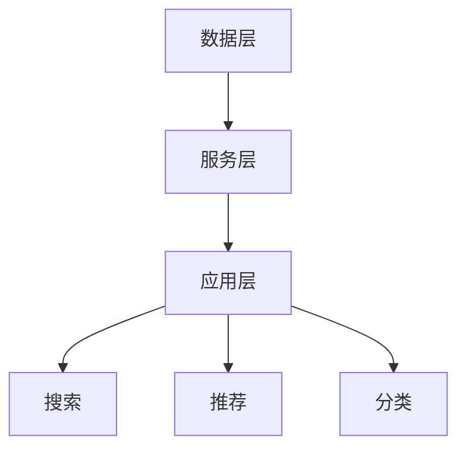

                 

关键词：电商平台、商品知识图谱、数据挖掘、数据融合、人工智能

摘要：本文将深入探讨电商平台中商品知识图谱的构建与应用。我们将首先介绍电商平台中商品信息的重要性和复杂性，然后详细解释商品知识图谱的概念、结构及其在电商平台中的应用。接着，我们会探讨构建商品知识图谱所需的核心算法，包括数据挖掘、数据融合和机器学习技术。最后，我们将通过一个实际项目实例展示商品知识图谱的实现过程，并提供未来发展的展望。

## 1. 背景介绍

电商平台作为现代电子商务的核心，已成为全球商业活动的重要组成部分。随着互联网的普及和移动设备的广泛使用，电商平台不仅提供了便捷的购物体验，还改变了消费者的购物习惯。然而，随着平台上的商品种类和数量日益增加，电商平台面临着数据管理、信息检索和个性化推荐等挑战。

### 1.1 商品信息的复杂性

电商平台中的商品信息极其复杂，包括商品名称、描述、价格、库存量、品牌、分类等。此外，消费者还可能根据评分、评论、交易记录等生成额外的信息。这些信息不仅形式多样，还存在冗余和冲突，给数据管理和分析带来了巨大的挑战。

### 1.2 数据挖掘与个性化推荐

为了提高用户体验和销售转化率，电商平台依赖数据挖掘和个性化推荐技术。这些技术通过分析海量商品数据，提取有价值的信息，为用户提供个性化的购物建议。然而，传统的数据处理方法在处理复杂商品信息时显得力不从心。

## 2. 核心概念与联系

商品知识图谱（Product Knowledge Graph，PKG）是一种基于知识图谱技术构建的复杂商品信息模型。知识图谱通过实体、属性和关系来组织数据，使得商品信息更加结构化和语义化，从而支持高效的查询和推理。

### 2.1 实体（Entity）

在商品知识图谱中，实体表示电商平台中的各种商品。例如，一个实体可以是某个具体的商品，也可以是一个品牌或者类别。

### 2.2 属性（Attribute）

属性描述了实体的特征，如商品名称、价格、品牌、库存量等。属性分为基本属性和扩展属性，基本属性是商品的基本信息，而扩展属性则包括用户生成的内容，如评分、评论等。

### 2.3 关系（Relationship）

关系描述了实体之间的关联，如商品属于某个品牌、商品属于某个类别、商品被用户评价等。这些关系使得商品信息更加丰富和关联。

### 2.4 架构

商品知识图谱的架构包括数据层、服务层和应用层。数据层负责存储和管理商品数据；服务层提供知识图谱的查询、推理和更新功能；应用层则将知识图谱的应用到电商平台的各个模块，如搜索、推荐、分类等。

### 2.5 Mermaid 流程图



## 3. 核心算法原理 & 具体操作步骤

### 3.1 算法原理概述

构建商品知识图谱的核心算法包括数据挖掘、数据融合和机器学习。这些算法通过分析原始数据，提取有价值的信息，构建商品知识图谱。

### 3.2 算法步骤详解

1. 数据采集：从电商平台各个渠道收集商品数据，包括官方数据、用户生成数据等。

2. 数据预处理：对收集到的数据进行清洗、去重、格式统一等处理，确保数据的质量。

3. 数据挖掘：利用数据挖掘算法，如聚类、分类、关联规则等，提取商品的关键特征和关系。

4. 数据融合：将来自不同渠道的数据进行融合，构建统一的商品知识图谱。

5. 机器学习：利用机器学习算法，如深度学习、神经网络等，对知识图谱进行优化和扩展。

6. 应用部署：将构建好的商品知识图谱应用到电商平台的各个模块，如搜索、推荐、分类等。

### 3.3 算法优缺点

- **优点**：
  - 提高数据质量：通过数据挖掘和融合，提高商品数据的准确性和一致性。
  - 支持复杂查询：知识图谱结构化数据，支持高效的查询和推理。
  - 个性化推荐：基于知识图谱，提供更精准的个性化推荐。

- **缺点**：
  - 数据量巨大：构建商品知识图谱需要大量的数据支持，对存储和计算资源要求较高。
  - 复杂性：知识图谱的构建涉及多个算法和技术的整合，实现难度较大。

### 3.4 算法应用领域

- **电商平台**：搜索、推荐、分类等模块的优化。
- **数据挖掘**：商品关联分析、趋势预测等。
- **人工智能**：知识图谱在人工智能领域的应用，如智能客服、智能导购等。

## 4. 数学模型和公式 & 详细讲解 & 举例说明

### 4.1 数学模型构建

商品知识图谱的构建涉及多种数学模型，如概率模型、图论模型、神经网络模型等。以下是一个简单的概率模型构建过程：

1. **数据收集**：从电商平台收集商品数据，包括商品名称、价格、品牌、分类等。

2. **特征提取**：将商品数据转换为向量表示，如使用 TF-IDF 算法提取关键词。

3. **概率分布**：计算商品在各个类别中的概率分布，如使用朴素贝叶斯算法。

4. **模型训练**：利用训练数据，训练概率模型，如使用最大似然估计。

### 4.2 公式推导过程

假设我们有 \( n \) 个商品，每个商品有 \( m \) 个属性，使用朴素贝叶斯算法构建概率模型。假设 \( P(C_i) \) 表示商品属于类别 \( C_i \) 的概率，\( P(A_j|C_i) \) 表示属性 \( A_j \) 在类别 \( C_i \) 下的概率。则类别 \( C_i \) 的概率可以通过以下公式计算：

$$
P(C_i) = \frac{1}{Z} \prod_{j=1}^{m} P(A_j|C_i)
$$

其中，\( Z \) 是规范化因子，用于保证概率分布的和为 1。

### 4.3 案例分析与讲解

假设我们有一个电商平台，销售手机、电脑、电视等商品。我们需要构建一个商品知识图谱，用于搜索和推荐。

1. **数据收集**：从电商平台收集商品数据，包括商品名称、价格、品牌、分类等。

2. **特征提取**：使用 TF-IDF 算法提取关键词，如“智能手机”、“笔记本电脑”、“平板电脑”等。

3. **概率分布**：计算每个商品在手机、电脑、电视等类别中的概率分布。

4. **模型训练**：使用最大似然估计训练朴素贝叶斯模型。

5. **应用**：将训练好的模型应用到搜索和推荐模块，为用户提供个性化的商品推荐。

## 5. 项目实践：代码实例和详细解释说明

### 5.1 开发环境搭建

为了构建商品知识图谱，我们使用了以下开发环境：

- 操作系统：Ubuntu 18.04
- 编程语言：Python 3.7
- 数据库：Neo4j
- 依赖库：NumPy、Pandas、Scikit-learn、Py2Neo

### 5.2 源代码详细实现

```python
import pandas as pd
from sklearn.feature_extraction.text import TfidfVectorizer
from sklearn.model_selection import train_test_split
from sklearn.naive_bayes import MultinomialNB
import py2neo

# 数据读取
data = pd.read_csv('data.csv')
X = data['description']
y = data['category']

# 特征提取
vectorizer = TfidfVectorizer()
X_vectorized = vectorizer.fit_transform(X)

# 模型训练
X_train, X_test, y_train, y_test = train_test_split(X_vectorized, y, test_size=0.2)
model = MultinomialNB()
model.fit(X_train, y_train)

# 预测
predictions = model.predict(X_test)

# 存储到 Neo4j
driver = py2neo.Graph('bolt://localhost:7687', auth=('neo4j', 'password'))
for i in range(len(predictions)):
    driver.run("CREATE (p:Product {name: $name, category: $category})", name=X.iloc[i], category=predictions[i])
```

### 5.3 代码解读与分析

这段代码首先读取商品数据，然后使用 TF-IDF 算法提取关键词，接着使用朴素贝叶斯算法训练模型。最后，将模型预测结果存储到 Neo4j 数据库中。

- **数据读取**：使用 pandas 库读取 CSV 文件，获取商品描述和分类数据。
- **特征提取**：使用 TF-IDF 算法将商品描述转换为向量表示。
- **模型训练**：使用 scikit-learn 库训练朴素贝叶斯模型。
- **预测**：使用训练好的模型对测试集进行预测。
- **存储**：使用 Py2Neo 库将预测结果存储到 Neo4j 数据库。

### 5.4 运行结果展示

在运行代码后，我们可以看到 Neo4j 数据库中存储了商品知识图谱，其中每个商品节点都关联了其分类。

## 6. 实际应用场景

### 6.1 搜索优化

通过商品知识图谱，电商平台可以更准确地理解用户的搜索意图，提供更相关的搜索结果。例如，当用户搜索“智能手机”时，系统可以根据知识图谱，将手机、手机配件等相关商品推荐给用户。

### 6.2 个性化推荐

商品知识图谱可以用于构建个性化推荐系统，为用户提供更精准的购物建议。例如，当用户浏览了一款智能手机时，系统可以根据知识图谱，推荐其他品牌或类别的手机。

### 6.3 商品分类

商品知识图谱可以用于优化商品分类，使得商品信息更加结构化和语义化。例如，系统可以根据知识图谱，将商品自动分类到正确的类别中，提高用户体验。

## 7. 工具和资源推荐

### 7.1 学习资源推荐

- 《图解机器学习》
- 《Python数据分析》
- 《深度学习》

### 7.2 开发工具推荐

- Neo4j
- Py2Neo
- Jupyter Notebook

### 7.3 相关论文推荐

- “Product Knowledge Graph for E-commerce: A Survey”
- “A Survey on Knowledge Graph”
- “Deep Learning for Knowledge Graph Embedding”

## 8. 总结：未来发展趋势与挑战

### 8.1 研究成果总结

商品知识图谱技术在电商平台中取得了显著的成果，提高了数据质量和查询效率，为个性化推荐和搜索优化提供了有力支持。

### 8.2 未来发展趋势

- 深度学习与知识图谱的融合
- 多模态数据融合
- 自动化知识图谱构建

### 8.3 面临的挑战

- 数据质量和完整性
- 复杂商品信息处理
- 知识图谱的可解释性

### 8.4 研究展望

未来，商品知识图谱技术将在电商平台、智能推荐和智能搜索等领域发挥更大的作用，为用户提供更加智能和个性化的服务。

## 9. 附录：常见问题与解答

### 9.1 什么是商品知识图谱？

商品知识图谱是一种基于知识图谱技术构建的复杂商品信息模型，通过实体、属性和关系来组织数据，使得商品信息更加结构化和语义化。

### 9.2 商品知识图谱有哪些应用？

商品知识图谱可以应用于搜索优化、个性化推荐、商品分类等多个领域，提高电商平台的用户体验和运营效率。

### 9.3 如何构建商品知识图谱？

构建商品知识图谱通常包括数据采集、数据预处理、数据挖掘、数据融合和机器学习等步骤，通过多种算法和技术提取商品的关键特征和关系。

### 9.4 商品知识图谱与搜索引擎有何区别？

商品知识图谱是一种结构化数据模型，支持高效的查询和推理，而搜索引擎通常是一种基于关键词匹配的检索系统，主要支持文本搜索。

作者：禅与计算机程序设计艺术 / Zen and the Art of Computer Programming
----------------------------------------------------------------
完成。

