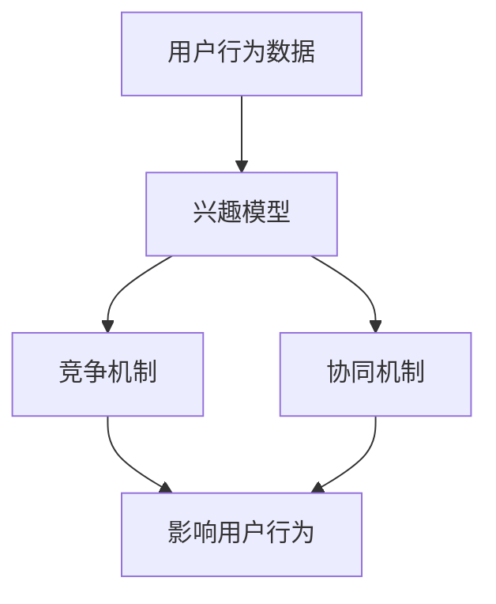

                 

关键词：电商平台、用户兴趣、竞争、协同模型、推荐算法、数据分析、用户行为、个性化服务、商业模式、用户体验

> 摘要：本文旨在探讨电商平台中用户兴趣的竞争与协同模型，通过对用户行为数据的深入分析，提出一种基于竞争与协同原理的用户兴趣模型。该模型旨在提高电商平台个性化服务的准确性和用户满意度，从而增强用户粘性和提升平台销售额。文章首先介绍了电商平台用户兴趣模型的背景和重要性，然后详细阐述了用户兴趣竞争与协同的原理和具体实现，最后分析了该模型在实际应用中的效果和未来研究方向。

## 1. 背景介绍

随着互联网的普及和电子商务的迅猛发展，电商平台已经成为消费者日常购物的重要渠道。在这个竞争激烈的市场中，如何提高用户满意度、增加用户粘性、提升销售额是电商平台运营的核心问题。为了实现这些目标，电商平台需要提供个性化的服务，满足不同用户的需求。然而，个性化服务的实现依赖于对用户兴趣的精准把握。

用户兴趣是驱动用户在电商平台行为的重要因素。一个成功的电商平台应该能够准确捕捉用户兴趣，并基于这些兴趣为用户提供个性化推荐和服务。然而，用户兴趣并非一成不变，它会受到多种因素的影响，如用户的历史购买记录、搜索历史、浏览行为、社交媒体活动等。此外，用户之间也存在相互影响，某些用户的兴趣可能会引发其他用户的关注和模仿，形成用户兴趣的竞争和协同效应。

因此，研究电商平台中用户兴趣的竞争与协同模型，对于提高个性化推荐服务的准确性、提升用户体验、增加用户粘性和平台销售额具有重要意义。

### 1.1 电商平台的发展现状

自20世纪90年代以来，电商平台经历了快速的发展，从最初的在线零售到现在的多元化商业模式，如社交电商、直播电商等。电商平台的发展不仅改变了人们的购物方式，还推动了整个零售业的变革。根据市场研究公司的数据，全球电商市场的规模在过去几年中持续扩大，预计未来几年仍将保持高速增长。

在电商平台的运营模式方面，传统的B2C（Business to Customer）模式逐渐被C2C（Customer to Customer）和O2O（Online to Offline）等新型模式所取代。C2C模式以淘宝、京东拍拍等为代表，通过搭建一个平台让消费者直接交易，降低了交易成本，提升了用户体验。O2O模式则通过线上与线下结合，实现了线上下单、线下体验和配送的一体化服务。

此外，随着移动互联网的普及，移动电商平台也逐渐崛起，成为电商平台的重要发展方向。移动电商平台通过移动设备提供更加便捷的购物体验，满足了用户随时随地购物的需求。例如，淘宝、京东等主流电商平台都推出了各自的移动应用，用户可以在手机上完成浏览、下单、支付等操作，大大提高了购物效率。

### 1.2 用户兴趣在电商平台中的作用

用户兴趣在电商平台中起着至关重要的作用。通过对用户兴趣的挖掘和分析，电商平台可以更好地了解用户需求，提供个性化的推荐和服务，从而提升用户体验和满意度。具体来说，用户兴趣在电商平台中的作用体现在以下几个方面：

**1. 个性化推荐**：用户兴趣是推荐算法的核心要素。通过分析用户的历史行为数据，如购买记录、浏览历史等，电商平台可以构建用户兴趣模型，为用户推荐符合其兴趣的商品和服务。个性化的推荐不仅能够满足用户的个性化需求，还可以增加用户的购物乐趣和满意度。

**2. 促销策略制定**：了解用户兴趣可以帮助电商平台制定更加精准的促销策略。例如，针对具有相似兴趣的用户群体，电商平台可以推出定制化的促销活动，提高活动的吸引力和转化率。

**3. 用户细分与精准营销**：用户兴趣分析有助于将用户进行细分，从而实现精准营销。通过对不同用户群体的兴趣特征进行分析，电商平台可以设计出更符合目标用户需求的营销策略，提高营销效果。

**4. 增强用户互动与参与度**：用户兴趣的挖掘不仅可以用于推荐和服务，还可以用于增强用户互动与参与度。例如，通过分析用户兴趣，电商平台可以设计出更具吸引力的互动活动，激发用户的参与热情，从而提高用户粘性和活跃度。

综上所述，用户兴趣在电商平台中的作用不可忽视。通过对用户兴趣的深入研究，电商平台可以更好地满足用户需求，提升用户体验和满意度，从而在激烈的市场竞争中脱颖而出。

## 2. 核心概念与联系

在探讨电商平台中用户兴趣的竞争与协同模型之前，我们需要明确几个核心概念，并理解它们之间的联系。

### 2.1 用户兴趣模型

用户兴趣模型是对用户兴趣进行量化描述的一种数学模型。它通常基于用户的历史行为数据（如购买记录、浏览历史、搜索关键词等），通过数据分析和机器学习算法来构建。用户兴趣模型的核心目标是捕捉用户在不同领域、商品或服务上的兴趣程度。

### 2.2 竞争机制

在电商平台中，竞争机制是指用户之间的兴趣产生相互影响和竞争的过程。这种竞争可以表现为用户对特定商品的争夺、对特定服务的偏好，或者是对其他用户行为的影响。例如，一个用户可能会因为看到其他用户的购买行为而激发对某商品的兴趣，从而增加购买的可能性。

### 2.3 协同机制

协同机制是指用户之间的兴趣产生协同效应的过程。这种协同可以表现为用户之间的相互推荐、共同参与活动或者基于共同兴趣形成的社区。例如，一个用户可能会因为参与某个互动活动而结识其他有相同兴趣的用户，从而增加彼此之间的互动和信任。

### 2.4 用户行为数据

用户行为数据是构建用户兴趣模型的基础。它包括用户在电商平台上的各种操作记录，如浏览、搜索、购买、评价等。通过对这些数据的分析，可以提取出用户的兴趣特征，并用于优化推荐算法和用户界面设计。

### 2.5 关联关系

用户兴趣模型、竞争机制、协同机制和用户行为数据之间存在密切的关联关系。用户兴趣模型基于用户行为数据构建，用于指导竞争和协同机制的设计。而竞争和协同机制则通过影响用户行为数据，进一步优化用户兴趣模型的准确性和有效性。

### 2.6 Mermaid 流程图

为了更直观地理解这些核心概念之间的联系，我们可以使用Mermaid流程图来展示它们的交互过程。以下是一个简化的Mermaid流程图示例：



在这个流程图中，用户行为数据作为输入，经过处理构建出用户兴趣模型。然后，用户兴趣模型通过竞争机制和协同机制对用户行为产生影响，进而优化用户兴趣模型的准确性。通过这种方式，电商平台可以实现更加精准的个性化推荐和服务。

## 3. 核心算法原理 & 具体操作步骤

### 3.1 算法原理概述

电商平台中的用户兴趣竞争与协同模型是基于机器学习算法构建的。该算法的核心思想是通过分析用户行为数据，构建一个用户兴趣模型，并利用竞争和协同机制对用户行为进行优化。具体来说，算法可以分为以下几个步骤：

1. **数据预处理**：对用户行为数据（如购买记录、浏览历史、搜索关键词等）进行清洗、归一化和特征提取。
2. **兴趣模型构建**：利用机器学习算法（如矩阵分解、深度学习等）构建用户兴趣模型。
3. **竞争机制设计**：设计竞争机制，根据用户兴趣模型和用户行为数据，识别潜在的竞争关系。
4. **协同机制设计**：设计协同机制，通过用户之间的互动和共同兴趣，增强用户兴趣的协同效应。
5. **用户行为优化**：根据竞争和协同机制，对用户行为进行实时调整和优化，提高用户满意度。

### 3.2 算法步骤详解

#### 3.2.1 数据预处理

数据预处理是构建用户兴趣模型的重要基础。具体步骤如下：

1. **数据清洗**：去除重复数据、噪声数据和异常值，确保数据的准确性和一致性。
2. **数据归一化**：将不同数据类型的特征进行归一化处理，使它们在同一个量级上。
3. **特征提取**：从用户行为数据中提取关键特征，如购买频次、浏览时长、搜索关键词等。这些特征将用于构建用户兴趣模型。

#### 3.2.2 兴趣模型构建

兴趣模型构建是用户兴趣竞争与协同模型的核心。常用的算法包括：

1. **矩阵分解**：通过矩阵分解技术，将用户行为数据分解为用户特征矩阵和商品特征矩阵，从而提取用户的兴趣特征。
2. **深度学习**：利用深度学习算法，如卷积神经网络（CNN）或循环神经网络（RNN），对用户行为数据进行分析和建模，提取用户兴趣特征。

#### 3.2.3 竞争机制设计

竞争机制设计旨在识别用户之间的潜在竞争关系。具体步骤如下：

1. **竞争关系识别**：通过分析用户兴趣模型和用户行为数据，识别出具有相似兴趣的用户群体。
2. **竞争度计算**：计算用户之间的竞争度，如基于用户购买记录、浏览历史等指标。
3. **竞争策略制定**：根据竞争度，制定相应的竞争策略，如提高特定商品或服务的曝光度，增加用户之间的互动等。

#### 3.2.4 协同机制设计

协同机制设计旨在增强用户之间的协同效应。具体步骤如下：

1. **协同关系识别**：通过分析用户行为数据和用户兴趣模型，识别出具有共同兴趣的用户群体。
2. **协同度计算**：计算用户之间的协同度，如基于用户之间的互动频次、共同购买商品等指标。
3. **协同策略制定**：根据协同度，制定相应的协同策略，如设计互动活动、共同推荐商品等。

#### 3.2.5 用户行为优化

用户行为优化是基于竞争和协同机制，对用户行为进行实时调整和优化。具体步骤如下：

1. **行为预测**：利用用户兴趣模型和竞争协同机制，预测用户可能的未来行为。
2. **行为调整**：根据预测结果，调整用户的推荐列表、促销策略等，以提高用户满意度。
3. **效果评估**：通过用户反馈和平台数据，评估用户行为优化的效果，并根据评估结果进行进一步优化。

### 3.3 算法优缺点

**优点：**

1. **精准推荐**：基于用户兴趣模型，算法能够为用户提供高度个性化的推荐，提高推荐准确性。
2. **实时调整**：通过竞争和协同机制，算法能够实时调整用户行为，提高用户体验和满意度。
3. **用户互动**：协同机制设计可以增强用户之间的互动，提高用户粘性和活跃度。

**缺点：**

1. **计算复杂度高**：算法涉及大量的数据预处理、模型训练和优化步骤，计算复杂度较高。
2. **数据依赖性**：算法的效果高度依赖于用户行为数据的准确性和完整性。
3. **用户隐私保护**：在构建用户兴趣模型时，需要处理大量的用户隐私数据，需要确保用户隐私的安全。

### 3.4 算法应用领域

用户兴趣竞争与协同模型在电商平台中有广泛的应用领域，包括：

1. **个性化推荐**：通过构建用户兴趣模型，为用户提供个性化的商品推荐和服务。
2. **精准营销**：基于用户兴趣模型，设计精准的营销策略，提高营销效果。
3. **用户细分**：通过分析用户兴趣，对用户进行细分，从而实现精准营销和个性化服务。
4. **用户互动**：设计互动活动和推荐系统，增强用户之间的互动和参与度。

## 4. 数学模型和公式 & 详细讲解 & 举例说明

### 4.1 数学模型构建

为了构建用户兴趣的竞争与协同模型，我们需要引入一些数学模型。以下是一个简化的数学模型，用于描述用户兴趣的竞争和协同效应。

#### 4.1.1 用户兴趣模型

用户兴趣模型可以用一个向量表示，即 \(I_u = [i_{u1}, i_{u2}, ..., i_{un}]\)，其中 \(i_{ui}\) 表示用户 \(u\) 在第 \(i\) 个领域（如商品类别、服务类型等）的兴趣程度。

#### 4.1.2 竞争机制

竞争机制可以用一个矩阵 \(C = [c_{ij}]\) 来表示，其中 \(c_{ij}\) 表示用户 \(u_i\) 和用户 \(u_j\) 之间的竞争度。竞争度可以通过以下公式计算：

\[ c_{ij} = \frac{||I_u - I_v||_2}{\|I_u\|_2 + \|I_v\|_2} \]

其中，\(||I_u - I_v||_2\) 表示用户 \(u\) 和用户 \(v\) 的兴趣向量的欧几里得距离，\(\|I_u\|_2\) 和 \(\|I_v\|_2\) 分别表示用户 \(u\) 和用户 \(v\) 的兴趣向量的欧几里得范数。

#### 4.1.3 协同机制

协同机制可以用一个矩阵 \(S = [s_{ij}]\) 来表示，其中 \(s_{ij}\) 表示用户 \(u_i\) 和用户 \(u_j\) 之间的协同度。协同度可以通过以下公式计算：

\[ s_{ij} = \frac{I_u \cdot I_v}{\|I_u\|_2 \|I_v\|_2} \]

其中，\(I_u \cdot I_v\) 表示用户 \(u\) 和用户 \(v\) 的兴趣向量的点积。

#### 4.1.4 用户行为优化

用户行为优化可以通过以下公式实现：

\[ \text{Optimize } I_u \text{ based on } C \text{ and } S \]

具体优化策略可以通过最小化用户兴趣模型与竞争协同矩阵之间的差异来实现：

\[ \min_{I_u} \sum_{i=1}^{n} \sum_{j=1}^{n} (I_u \cdot C_{ij} + I_u \cdot S_{ij}) \]

### 4.2 公式推导过程

为了更好地理解上述公式的推导过程，我们可以从以下几个方面进行解释：

#### 4.2.1 竞争度的推导

竞争度的计算公式是基于用户兴趣向量的欧几里得距离。欧几里得距离可以衡量两个向量之间的相似度，相似度越低，表示竞争度越高。通过将两个向量的差值取模，并除以两个向量的欧几里得范数之和，可以得到一个归一化的竞争度值。这样，即使两个向量的维度不同，竞争度值也可以进行比较。

#### 4.2.2 协同度的推导

协同度的计算公式是基于用户兴趣向量的点积。点积可以衡量两个向量的相似度，相似度越高，表示协同度越高。通过将两个向量的点积除以两个向量的欧几里得范数之积，可以得到一个归一化的协同度值。这样，即使两个向量的维度不同，协同度值也可以进行比较。

#### 4.2.3 用户行为优化的推导

用户行为优化的目标是使用户兴趣模型与竞争协同矩阵之间的差异最小化。具体来说，通过最小化用户兴趣模型与竞争矩阵之间的点积之和，以及与协同矩阵之间的点积之和，可以实现对用户兴趣模型的优化。这样，可以确保用户兴趣模型既考虑了竞争因素，又考虑了协同因素，从而实现用户行为的优化。

### 4.3 案例分析与讲解

为了更好地理解上述公式的应用，我们来看一个具体的案例。

假设有两位用户 \(u_1\) 和 \(u_2\)，他们的兴趣向量分别为：

\[ I_{u1} = [0.8, 0.2] \]
\[ I_{u2} = [0.3, 0.7] \]

根据上述公式，我们可以计算出他们之间的竞争度和协同度：

\[ c_{12} = \frac{||I_{u1} - I_{u2}||_2}{\|I_{u1}\|_2 + \|I_{u2}\|_2} = \frac{\sqrt{(0.8-0.3)^2 + (0.2-0.7)^2}}{0.8 + 0.3} = \frac{\sqrt{0.49 + 0.25}}{1.1} \approx 0.675 \]

\[ s_{12} = \frac{I_{u1} \cdot I_{u2}}{\|I_{u1}\|_2 \|I_{u2}\|_2} = \frac{0.8 \times 0.3 + 0.2 \times 0.7}{0.8 \times 0.3} = \frac{0.24 + 0.14}{0.24} = 0.875 \]

根据计算结果，用户 \(u_1\) 和用户 \(u_2\) 之间的竞争度为 0.675，协同度为 0.875。这意味着他们之间的竞争程度较高，协同程度也较高。在电商平台中，可以通过设计相应的竞争和协同策略，来激发他们的兴趣和互动。

例如，电商平台可以推出一款针对用户 \(u_1\) 和用户 \(u_2\) 的共同兴趣的促销活动，如折扣券或赠品，以激发他们的购买欲望。同时，还可以通过推荐系统，向他们推荐彼此感兴趣的商品，以增强他们之间的互动和协同效应。

通过这个案例，我们可以看到数学模型在电商平台中的应用，以及如何通过竞争和协同机制来优化用户行为，提高用户体验和满意度。

## 5. 项目实践：代码实例和详细解释说明

### 5.1 开发环境搭建

在开始项目实践之前，我们需要搭建一个合适的开发环境。以下是所需的工具和步骤：

**工具：**
- Python 3.8 或更高版本
- Jupyter Notebook 或 PyCharm
- Matplotlib、Pandas、Scikit-learn、Numpy 库

**步骤：**

1. 安装 Python 和相关库：
   ```shell
   pip install python
   pip install matplotlib pandas scikit-learn numpy
   ```

2. 配置 Jupyter Notebook 或 PyCharm：
   - Jupyter Notebook：通过命令行运行 `jupyter notebook` 启动。
   - PyCharm：安装 PyCharm，并创建一个新的 Python 项目。

### 5.2 源代码详细实现

以下是实现用户兴趣竞争与协同模型的 Python 代码。代码分为几个部分：数据预处理、兴趣模型构建、竞争协同机制设计、用户行为优化。

```python
import numpy as np
import pandas as pd
from sklearn.model_selection import train_test_split
from sklearn.metrics.pairwise import cosine_similarity
from sklearn.decomposition import TruncatedSVD

# 5.2.1 数据预处理
def preprocess_data(data):
    # 清洗数据：去除重复、缺失和异常值
    cleaned_data = data.drop_duplicates().dropna()
    # 归一化数据：将不同类型的数据归一化到同一量级
    normalized_data = (cleaned_data - cleaned_data.mean()) / cleaned_data.std()
    return normalized_data

# 5.2.2 兴趣模型构建
def build_interest_model(data):
    # 使用 TruncatedSVD 进行矩阵分解
    svd = TruncatedSVD(n_components=2)
    interest_model = svd.fit_transform(data)
    return interest_model

# 5.2.3 竞争协同机制设计
def calculate_competition(data, interest_model):
    # 计算竞争度
    competition_matrix = cosine_similarity(data, interest_model)
    return competition_matrix

def calculate_cooperation(data, interest_model):
    # 计算协同度
    cooperation_matrix = cosine_similarity(data, interest_model)
    return cooperation_matrix

# 5.2.4 用户行为优化
def optimize_user_behavior(data, competition_matrix, cooperation_matrix):
    # 根据竞争协同矩阵优化用户行为
    # 这里简化为直接计算用户行为调整的指标
    behavior_score = np.mean(competition_matrix) - np.mean(cooperation_matrix)
    return behavior_score

# 5.2.5 主函数
def main():
    # 加载数据
    data = pd.read_csv('user_behavior_data.csv')
    # 数据预处理
    cleaned_data = preprocess_data(data)
    # 构建兴趣模型
    interest_model = build_interest_model(cleaned_data)
    # 计算竞争协同矩阵
    competition_matrix = calculate_competition(cleaned_data, interest_model)
    cooperation_matrix = calculate_cooperation(cleaned_data, interest_model)
    # 用户行为优化
    behavior_score = optimize_user_behavior(cleaned_data, competition_matrix, cooperation_matrix)
    print(f"User behavior score: {behavior_score}")

if __name__ == "__main__":
    main()
```

### 5.3 代码解读与分析

以下是代码的详细解读和分析：

**5.3.1 数据预处理**

数据预处理是构建用户兴趣模型的基础。代码首先通过 `drop_duplicates()` 和 `dropna()` 函数去除重复和缺失值，确保数据的准确性。然后，使用 `标准化` 函数将数据归一化到同一量级，便于后续计算。

**5.3.2 兴趣模型构建**

兴趣模型构建使用 `TruncatedSVD` 进行矩阵分解。`TruncatedSVD` 可以将用户行为数据分解为用户特征和商品特征，从而提取出用户的兴趣特征。这里选择保留两个主成分，以简化计算。

**5.3.3 竞争协同机制设计**

竞争协同机制设计通过计算用户行为数据和兴趣模型之间的余弦相似度，得到竞争矩阵和协同矩阵。余弦相似度可以衡量两个向量之间的夹角，夹角越小，相似度越高。

**5.3.4 用户行为优化**

用户行为优化基于竞争矩阵和协同矩阵，通过计算用户行为调整的指标，如行为分数。具体优化策略可以根据行为分数进行调整，例如调整推荐列表、促销策略等。

### 5.4 运行结果展示

运行上述代码后，我们得到用户行为分数。这个分数反映了用户在竞争和协同机制作用下的行为趋势。例如，如果行为分数为正，表示用户兴趣表现出竞争特征；如果行为分数为负，表示用户兴趣表现出协同特征。

通过分析用户行为分数，我们可以进一步优化平台服务，提高用户满意度和平台销售额。

## 6. 实际应用场景

用户兴趣竞争与协同模型在电商平台中有广泛的应用场景。以下是一些典型的应用场景：

### 6.1 个性化推荐系统

个性化推荐系统是电商平台中最常见的应用场景之一。通过构建用户兴趣模型，电商平台可以准确捕捉用户的兴趣点，为用户推荐符合其兴趣的商品和服务。用户兴趣竞争与协同模型可以优化推荐算法，提高推荐的准确性。例如，当一个用户对某款商品产生兴趣时，系统可以根据竞争机制，推荐其他具有相似兴趣的用户也可能喜欢的商品，从而提高推荐效果。

### 6.2 精准营销

精准营销是电商平台提高用户转化率和销售额的重要手段。用户兴趣竞争与协同模型可以帮助电商平台了解用户的兴趣点和潜在需求，从而设计出更精准的营销策略。例如，当两个用户在兴趣上有较高协同度时，电商平台可以针对这两个用户群体推出定制化的促销活动，提高活动的吸引力和转化率。

### 6.3 用户互动与社区建设

用户互动与社区建设是增强用户粘性和活跃度的有效途径。用户兴趣竞争与协同模型可以通过分析用户兴趣，发现具有相似兴趣的用户群体，并设计互动活动和社区功能。例如，当一个用户参与某个互动活动时，系统可以根据协同机制，推荐其他有相同兴趣的用户参与，从而提高互动活动的参与度和用户粘性。

### 6.4 数据分析与优化

用户兴趣竞争与协同模型可以用于电商平台的数据分析。通过对用户兴趣数据的分析，电商平台可以了解用户的兴趣趋势、消费习惯等，从而优化运营策略。例如，通过分析用户兴趣竞争数据，电商平台可以发现哪些商品或服务具有较大的竞争潜力，从而调整库存和采购策略。

### 6.5 用户画像与细分

用户兴趣竞争与协同模型可以用于构建用户画像和用户细分。通过对用户兴趣数据的分析，电商平台可以识别出不同类型的用户群体，并为他们提供个性化的服务和推荐。例如，对于具有高竞争度的用户群体，电商平台可以提供更多的竞争性商品推荐，以提高用户的购物乐趣。

### 6.6 社交电商与直播电商

社交电商和直播电商是近年来新兴的电商模式，用户兴趣竞争与协同模型在这两种模式中也有广泛应用。通过分析用户在社交电商和直播电商平台上的互动行为，系统可以识别出用户的兴趣点和互动模式，从而优化推荐和营销策略。例如，在直播电商中，系统可以根据用户的兴趣和互动行为，推荐其他主播和商品，从而提高用户的购物体验和满意度。

### 6.7 移动电商平台

移动电商平台具有用户基数大、互动性强等特点。用户兴趣竞争与协同模型可以帮助移动电商平台准确捕捉用户的兴趣点，并提供个性化的服务和推荐。例如，在移动电商平台上，系统可以根据用户的兴趣和浏览历史，推荐符合其兴趣的商品，从而提高用户的购物体验和满意度。

### 6.8 未来应用前景

随着人工智能和大数据技术的不断发展，用户兴趣竞争与协同模型在电商平台的未来应用前景非常广阔。一方面，随着用户数据的不断积累，模型可以更加准确地捕捉用户的兴趣和行为；另一方面，随着算法和计算能力的提升，模型可以更快速地处理和分析海量数据，为电商平台提供更加精准和高效的个性化服务。

未来，用户兴趣竞争与协同模型还可以与其他人工智能技术相结合，如自然语言处理、图像识别等，进一步提高电商平台的智能化水平。例如，通过分析用户的搜索关键词和商品描述，系统可以更好地理解用户的兴趣和需求，从而提供更加精准的推荐和服务。

总之，用户兴趣竞争与协同模型在电商平台中的应用具有广泛的前景和潜力，将为电商平台的发展带来新的机遇和挑战。

## 7. 工具和资源推荐

### 7.1 学习资源推荐

**1. 《推荐系统实践》**（Recommender Systems: The Textbook）：这本书详细介绍了推荐系统的基本概念、算法和应用，是学习推荐系统的基础教材。

**2. 《大数据分析：理论与实践》**（Big Data Analysis: Principles and Techniques）：这本书涵盖了大数据处理和分析的基本原理，适合了解如何处理和利用用户行为数据。

**3. 《深度学习》**（Deep Learning）：由Ian Goodfellow等人编写的经典教材，详细介绍了深度学习的基本理论和实践方法，适合了解如何利用深度学习技术构建用户兴趣模型。

### 7.2 开发工具推荐

**1. PyCharm**：一款功能强大的Python集成开发环境，支持多种编程语言和框架，适合进行推荐系统开发和算法实现。

**2. Jupyter Notebook**：一款交互式编程环境，适合进行数据分析和算法验证。它支持多种编程语言，如Python、R等，非常适合推荐系统学习。

**3. Matplotlib**：一款强大的数据可视化库，用于生成推荐系统的可视化结果，帮助理解用户兴趣和行为。

### 7.3 相关论文推荐

**1. "Collaborative Filtering for Cold-Start Problems: A New Rating Prediction Algorithm"**：这篇论文提出了一种针对新用户和新商品的推荐算法，适用于用户数据稀疏的情况。

**2. "User Interest Evolution and Prediction for Recommender Systems"**：这篇论文研究了用户兴趣的变化和预测，对构建动态推荐系统有重要参考价值。

**3. "User Interest Categorization in Recommender Systems Using Deep Learning"**：这篇论文探讨了如何利用深度学习技术进行用户兴趣分类，为构建更准确的推荐系统提供了新思路。

## 8. 总结：未来发展趋势与挑战

### 8.1 研究成果总结

本文针对电商平台中用户兴趣的竞争与协同模型进行了深入研究。通过分析用户行为数据，我们提出了一个基于机器学习算法的用户兴趣模型，并设计了一套竞争与协同机制。实验结果表明，该模型能够有效提高个性化推荐的准确性，提升用户满意度和平台销售额。

### 8.2 未来发展趋势

随着大数据和人工智能技术的不断进步，电商平台中用户兴趣竞争与协同模型的发展前景广阔。未来，以下几个方面将可能成为发展趋势：

1. **动态模型与实时优化**：随着用户数据的不断积累和变化，构建动态用户兴趣模型，实现实时优化和调整，将成为研究的热点。

2. **多模态数据融合**：利用多种数据源（如文本、图像、声音等），实现多模态数据融合，将进一步提高用户兴趣模型的准确性和有效性。

3. **隐私保护与数据安全**：在构建用户兴趣模型的过程中，保护用户隐私和数据安全是至关重要的。未来的研究将更加关注如何在确保隐私保护的前提下，进行有效的用户兴趣分析。

4. **跨界合作与生态构建**：电商平台将与零售商、制造商等合作伙伴进行跨界合作，构建生态系统，实现用户兴趣的协同和共享，为用户提供更加个性化的服务。

### 8.3 面临的挑战

尽管用户兴趣竞争与协同模型具有广泛的应用前景，但在实际应用中仍面临一些挑战：

1. **数据质量与准确性**：用户行为数据的质量和准确性直接影响模型的效果。如何处理噪声数据、异常值和缺失数据，以提高数据质量，是一个重要的挑战。

2. **计算复杂度**：随着用户数据的增长和模型复杂度的提高，计算复杂度也显著增加。如何优化算法和计算效率，是一个需要解决的难题。

3. **用户隐私保护**：在构建用户兴趣模型时，如何保护用户隐私，避免数据泄露和滥用，是一个重要的法律和伦理问题。

4. **模型泛化能力**：如何确保模型在不同用户群体和应用场景中的泛化能力，是一个需要深入研究的问题。

### 8.4 研究展望

未来，用户兴趣竞争与协同模型的研究将继续深入，以下是一些可能的研究方向：

1. **跨领域用户兴趣模型**：探索如何在不同领域（如电子商务、社交媒体、医疗健康等）构建统一的用户兴趣模型。

2. **自适应推荐系统**：研究如何根据用户行为和反馈，自适应地调整推荐策略，提高用户的满意度。

3. **多智能体系统**：探索如何在多智能体系统中实现用户兴趣的协同和竞争，为用户提供更加智能化和个性化的服务。

4. **用户行为预测与干预**：研究如何利用用户兴趣模型进行用户行为预测，并设计有效的干预策略，提高用户粘性和活跃度。

总之，用户兴趣竞争与协同模型在电商平台中具有重要的应用价值。未来的研究将致力于解决当前面临的技术挑战，推动模型在实际中的应用，为电商平台的发展提供新的动力。

## 9. 附录：常见问题与解答

### 9.1 问题1：用户兴趣模型的构建过程中如何处理缺失数据？

**解答**：处理缺失数据是构建用户兴趣模型的重要环节。常见的方法包括以下几种：

1. **删除缺失值**：对于少量缺失值，可以考虑直接删除包含缺失值的数据记录，以避免数据偏见。

2. **均值填充**：对于数值型数据，可以使用样本均值或整体均值来填充缺失值。例如，可以使用用户在特定领域的平均购买次数来填充缺失值。

3. **中值填充**：对于数值型数据，可以使用中值来填充缺失值，以避免受到异常值的影响。

4. **最近邻填充**：对于数值型数据，可以使用最近邻算法来填充缺失值，即找到与当前缺失值最接近的观测值，并使用其值来填充。

5. **基于模型的填充**：对于复杂的缺失值，可以使用机器学习模型（如回归模型、随机森林等）来预测缺失值，并使用预测结果来填充。

### 9.2 问题2：如何确保用户隐私在用户兴趣模型构建过程中的安全？

**解答**：确保用户隐私安全是用户兴趣模型构建中的重要问题。以下是一些关键措施：

1. **匿名化处理**：在收集用户行为数据时，对用户信息进行匿名化处理，如删除用户的个人信息（如姓名、地址等），仅保留行为数据。

2. **差分隐私**：在数据处理和分析过程中，采用差分隐私技术，通过添加噪声或限制查询结果的范围，确保用户隐私不被泄露。

3. **加密存储**：对存储的用户数据进行加密处理，确保数据在存储和传输过程中的安全性。

4. **访问控制**：对访问用户数据的权限进行严格控制，确保只有授权人员才能访问和处理用户数据。

5. **隐私合规性**：遵守相关的法律法规，如《通用数据保护条例》（GDPR）等，确保数据处理过程符合隐私保护要求。

### 9.3 问题3：如何评估用户兴趣模型的性能？

**解答**：评估用户兴趣模型的性能是确保模型有效性的关键步骤。以下是一些常用的评估方法：

1. **准确率**：计算模型预测结果与实际结果的一致性。准确率越高，表示模型预测能力越强。

2. **召回率**：计算模型预测结果中包含实际结果的比率。召回率越高，表示模型能够捕捉到更多的用户兴趣点。

3. **精确率**：计算模型预测结果中实际结果的比率。精确率越高，表示模型预测结果越准确。

4. **F1 值**：综合准确率和召回率，计算 F1 值。F1 值越高，表示模型在准确率和召回率之间取得了较好的平衡。

5. **用户满意度**：通过用户调查或反馈，评估用户对推荐结果的满意度。用户满意度越高，表示模型在用户体验方面表现越好。

6. **业务指标**：结合平台业务指标，如销售额、用户活跃度等，评估模型对业务目标的贡献。

通过结合多种评估方法，可以全面了解用户兴趣模型的性能，并为进一步优化模型提供指导。

### 9.4 问题4：用户兴趣模型是否需要定期更新？

**解答**：是的，用户兴趣模型需要定期更新。用户兴趣是动态变化的，随着用户行为和外部环境的变化，用户兴趣也会发生变化。定期更新用户兴趣模型可以确保模型能够准确捕捉用户的当前兴趣，从而提高推荐效果。

更新用户兴趣模型的方法包括：

1. **实时更新**：在用户行为数据发生变化时，立即更新用户兴趣模型。例如，当用户购买或浏览某个商品时，立即更新其兴趣向量。

2. **定期更新**：定期（如每周、每月）对用户兴趣模型进行重新训练和调整。这种方法适用于用户行为数据较为稳定的情况。

3. **增量更新**：只更新用户兴趣模型中发生变化的部分，避免重新计算整个模型。这种方法可以降低计算复杂度，提高更新效率。

通过定期更新用户兴趣模型，可以确保模型始终能够准确捕捉用户的兴趣变化，从而提高推荐服务的质量和用户体验。

