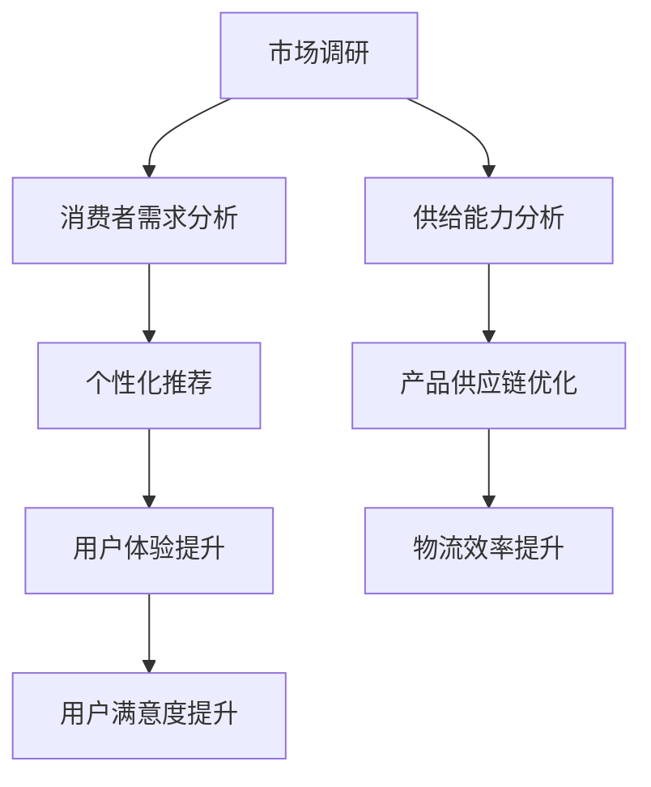

                 

关键词：电商平台，供给能力，市场调研，消费者行为分析，数据分析，消费者洞察

> 摘要：本文旨在探讨电商平台供给能力的提升策略，通过对市场调研和消费者行为的深入分析，提供一系列切实可行的优化方案，助力电商平台在激烈的市场竞争中脱颖而出。文章首先介绍了市场调研和消费者行为分析的重要性，然后详细阐述了相关核心概念和原理，最后通过数学模型、项目实践和实际应用场景展示了供给能力提升的具体方法和路径。

## 1. 背景介绍

随着互联网技术的迅猛发展，电商平台已成为现代商业环境中不可或缺的一部分。电商平台通过提供线上交易、物流配送等服务，极大地改变了消费者的购物习惯，也促进了整个零售行业的变革。然而，随着市场竞争的日益激烈，电商平台在供给能力方面面临着诸多挑战。如何提升供给能力，满足消费者多样化的需求，成为电商平台持续发展的关键问题。

市场调研和消费者行为分析在此过程中起到了至关重要的作用。市场调研可以帮助电商平台了解市场趋势、竞争状况和消费者需求，从而制定更加精准的营销策略和产品规划。而消费者行为分析则能够揭示消费者的购买动机、购物习惯和偏好，为电商平台提供个性化的推荐和服务，提升用户体验和满意度。

本文将围绕电商平台供给能力的提升，探讨市场调研和消费者行为分析的应用，为电商平台的发展提供有益的参考。

## 2. 核心概念与联系

在讨论电商平台供给能力的提升策略之前，我们需要明确一些核心概念，包括市场调研、消费者行为分析、供给能力等。

### 2.1 市场调研

市场调研是指通过系统的收集、分析和解释市场数据，来了解市场现状、趋势和消费者需求的过程。市场调研的主要目的是为企业提供决策支持，帮助其制定有效的营销策略和商业计划。市场调研可以分为定量调研和定性调研两种类型：

- **定量调研**：通过问卷调查、数据分析等方式，收集大量数据，从中提取有用的信息。
- **定性调研**：通过深度访谈、焦点小组讨论等方式，深入了解消费者的行为、动机和需求。

### 2.2 消费者行为分析

消费者行为分析是指研究消费者在购买、使用、评估和处置产品或服务过程中的行为规律和决策过程。消费者行为分析的核心是理解消费者的需求、动机和行为模式，从而为企业提供个性化的服务和产品推荐。消费者行为分析主要包括以下几个方面：

- **需求分析**：了解消费者对产品的需求程度和购买意愿。
- **动机分析**：探究消费者购买产品的原因和动机。
- **行为分析**：分析消费者在购买过程中的行为模式，如搜索、比较、购买和评估等。
- **偏好分析**：研究消费者的购买偏好，如品牌偏好、产品功能偏好等。

### 2.3 供给能力

供给能力是指企业生产和提供产品或服务的能力。在电商平台上，供给能力不仅包括产品供应的稳定性和质量，还包括物流配送的效率、库存管理的精确度等方面。提升供给能力的关键在于：

- **提高供应链效率**：通过优化供应链管理，减少库存积压和物流延迟。
- **提升产品质量**：确保产品符合消费者的期望和标准。
- **增强用户黏性**：通过提供优质的客户服务，增加用户的忠诚度和复购率。

### 2.4 核心概念的联系

市场调研和消费者行为分析是提升电商平台供给能力的重要手段。通过市场调研，电商平台可以获取市场趋势和消费者需求的信息，从而优化产品供应策略。而消费者行为分析则能够帮助电商平台理解消费者的行为模式和偏好，提供个性化的推荐和服务，进一步提升用户体验和满意度。

为了更好地说明这些核心概念之间的联系，我们可以使用Mermaid流程图来展示它们之间的关系：



通过这个流程图，我们可以清晰地看到市场调研、消费者行为分析和供给能力之间的互动关系。市场调研为供给能力提供方向，消费者行为分析为个性化推荐提供依据，而供给能力的提升又进一步促进了用户体验和满意度的提升。

## 3. 核心算法原理 & 具体操作步骤

### 3.1 算法原理概述

提升电商平台供给能力的关键在于准确的市场预测和有效的资源分配。为此，我们可以借助多种核心算法，如回归分析、聚类分析和优化算法等，来实现这一目标。

- **回归分析**：回归分析是一种常用的统计方法，用于预测因变量与自变量之间的关系。通过回归分析，电商平台可以预测市场需求，从而调整库存和供应策略。
- **聚类分析**：聚类分析是将数据点根据其相似性进行分组的方法。通过聚类分析，电商平台可以将消费者按照其购买行为和偏好进行分类，从而提供个性化的推荐和服务。
- **优化算法**：优化算法如线性规划、动态规划等，用于在多种约束条件下找到最优解。通过优化算法，电商平台可以在资源有限的情况下，实现供应链的最优配置。

### 3.2 算法步骤详解

#### 3.2.1 回归分析

1. **数据收集**：收集电商平台的历史销售数据、市场趋势数据等。
2. **数据预处理**：对数据进行清洗和归一化处理，确保数据的准确性和一致性。
3. **模型选择**：根据数据特征选择合适的回归模型，如线性回归、多项式回归等。
4. **模型训练**：使用历史数据对回归模型进行训练，得到回归系数。
5. **预测**：使用训练好的模型对未来的市场需求进行预测。

#### 3.2.2 聚类分析

1. **数据收集**：收集电商平台的消费者数据，包括购买行为、偏好等。
2. **特征选择**：选择能够反映消费者行为的特征，如购买频率、购买金额、产品类别等。
3. **距离度量**：选择合适的距离度量方法，如欧几里得距离、曼哈顿距离等。
4. **聚类算法**：选择合适的聚类算法，如K-Means、层次聚类等。
5. **聚类结果**：对消费者进行聚类，得到不同的消费者群体。

#### 3.2.3 优化算法

1. **问题定义**：明确优化问题的目标函数和约束条件。
2. **模型建立**：建立线性规划或动态规划模型。
3. **求解算法**：选择合适的求解算法，如单纯形法、动态规划算法等。
4. **结果分析**：对求解结果进行分析，评估优化效果。

### 3.3 算法优缺点

#### 3.3.1 回归分析

**优点**：
- **简单易懂**：回归分析模型简单，易于理解和应用。
- **适用范围广**：可以用于预测各种类型的因变量，如连续值、分类值等。

**缺点**：
- **依赖历史数据**：回归分析模型依赖于历史数据，对历史数据的准确性和完整性要求较高。
- **过拟合风险**：如果模型过于复杂，可能会导致过拟合现象。

#### 3.3.2 聚类分析

**优点**：
- **自适应性强**：聚类分析不需要事先指定聚类个数，可以自动调整。
- **无需事先定义特征**：聚类分析可以直接对原始数据进行聚类，无需事先定义特征。

**缺点**：
- **结果解释性较差**：聚类分析的结果较为主观，难以解释。
- **计算复杂度高**：对于大规模数据集，聚类分析的计算复杂度较高。

#### 3.3.3 优化算法

**优点**：
- **全局最优解**：优化算法可以找到全局最优解，而不是局部最优解。
- **灵活性强**：优化算法可以根据不同的优化目标进行调整。

**缺点**：
- **计算复杂度高**：优化算法的计算复杂度较高，对于大规模问题可能不适用。
- **需要合适的初始解**：优化算法的初始解对最终结果影响较大。

### 3.4 算法应用领域

回归分析、聚类分析和优化算法在电商平台供给能力提升中具有广泛的应用领域：

- **需求预测**：使用回归分析预测市场需求，优化库存和供应策略。
- **消费者群体划分**：使用聚类分析将消费者进行分类，提供个性化推荐和服务。
- **资源优化配置**：使用优化算法实现供应链的最优配置，提高物流效率。

通过这些算法的应用，电商平台可以在激烈的市场竞争中保持优势，提升供给能力和用户体验。

## 4. 数学模型和公式 & 详细讲解 & 举例说明

在提升电商平台供给能力的实践中，数学模型和公式扮演着至关重要的角色。本节将详细讲解相关数学模型的构建、公式推导过程，并通过具体案例进行分析和说明。

### 4.1 数学模型构建

为了更好地理解电商平台供给能力的提升，我们可以构建以下几个核心数学模型：

1. **需求预测模型**：基于回归分析，预测未来的市场需求。
2. **消费者群体划分模型**：基于聚类分析，将消费者按照购买行为和偏好进行分类。
3. **资源优化配置模型**：基于优化算法，实现供应链的最优配置。

#### 4.1.1 需求预测模型

需求预测模型通常采用线性回归模型，其基本形式如下：

$$
Y = \beta_0 + \beta_1X_1 + \beta_2X_2 + ... + \beta_nX_n + \epsilon
$$

其中，$Y$ 表示需求量，$X_1, X_2, ..., X_n$ 表示影响需求的因素，如历史销售数据、季节因素等，$\beta_0, \beta_1, \beta_2, ..., \beta_n$ 为回归系数，$\epsilon$ 为误差项。

#### 4.1.2 消费者群体划分模型

消费者群体划分模型通常采用K-Means聚类算法，其基本思想如下：

1. 初始化聚类中心。
2. 计算每个消费者到聚类中心的距离，将其归为最近的聚类。
3. 更新聚类中心。
4. 重复步骤2和3，直到聚类中心不再变化。

#### 4.1.3 资源优化配置模型

资源优化配置模型通常采用线性规划或动态规划算法。以线性规划为例，其基本形式如下：

$$
\min \sum_{i=1}^{n} c_i x_i
$$

$$
\text{subject to} \quad A x \leq b
$$

其中，$c_1, c_2, ..., c_n$ 为各资源的成本，$x_1, x_2, ..., x_n$ 为各资源的分配量，$A$ 为约束矩阵，$b$ 为约束向量。

### 4.2 公式推导过程

#### 4.2.1 需求预测模型

假设我们选择历史销售数据作为影响需求的因素，线性回归模型的公式推导如下：

1. **数据收集**：收集历史销售数据，包括需求量（$Y$）和影响需求的因素（$X_1, X_2, ..., X_n$）。
2. **数据预处理**：对数据进行归一化处理，确保数据的尺度一致。
3. **模型假设**：假设需求量与影响因素之间满足线性关系。
4. **最小二乘法**：使用最小二乘法求解回归系数，使预测误差的平方和最小。

具体推导过程如下：

$$
\min \sum_{i=1}^{m} (Y_i - \beta_0 - \beta_1X_{i1} - \beta_2X_{i2} - ... - \beta_nX_{in})^2
$$

对上述公式求偏导数，并令其等于0，得到：

$$
\frac{\partial}{\partial \beta_0} \sum_{i=1}^{m} (Y_i - \beta_0 - \beta_1X_{i1} - \beta_2X_{i2} - ... - \beta_nX_{in})^2 = 0
$$

$$
\frac{\partial}{\partial \beta_1} \sum_{i=1}^{m} (Y_i - \beta_0 - \beta_1X_{i1} - \beta_2X_{i2} - ... - \beta_nX_{in})^2 = 0
$$

$$
...
$$

$$
\frac{\partial}{\partial \beta_n} \sum_{i=1}^{m} (Y_i - \beta_0 - \beta_1X_{i1} - \beta_2X_{i2} - ... - \beta_nX_{in})^2 = 0
$$

解上述方程组，得到回归系数$\beta_0, \beta_1, \beta_2, ..., \beta_n$。

#### 4.2.2 消费者群体划分模型

以K-Means聚类算法为例，其公式推导如下：

1. **初始化聚类中心**：随机选择K个初始聚类中心。
2. **分配消费者**：计算每个消费者到聚类中心的距离，将其归为最近的聚类。
3. **更新聚类中心**：计算每个聚类的质心，作为新的聚类中心。
4. **重复步骤2和3**：直到聚类中心不再变化。

具体推导过程如下：

1. **初始化聚类中心**：

   $$c_1^0, c_2^0, ..., c_K^0 = \text{随机选择}$$

2. **分配消费者**：

   对于每个消费者$i$，计算其到聚类中心的距离：

   $$d(i, c_j^0) = \sqrt{\sum_{k=1}^{n} (x_{ik} - c_{jk}^0)^2}$$

   将消费者$i$归为最近的聚类：

   $$\text{Cluster}(i) = \arg\min_{j} d(i, c_j^0)$$

3. **更新聚类中心**：

   计算每个聚类的质心：

   $$c_j^1 = \frac{1}{N_j} \sum_{i \in \text{Cluster}(i) = j} x_i$$

4. **重复步骤2和3**：直到聚类中心不再变化。

#### 4.2.3 资源优化配置模型

以线性规划为例，其公式推导如下：

1. **问题定义**：

   目标函数：最小化成本

   $$\min \sum_{i=1}^{n} c_i x_i$$

   约束条件：

   $$A x \leq b$$

2. **求解方法**：

   单纯形法：

   1. 初始化基本可行解。
   2. 计算目标函数值和约束条件。
   3. 检查是否有任何约束条件未满足。
   4. 如果有未满足的约束条件，进行换基运算。
   5. 重复步骤3和4，直到所有约束条件均满足。

### 4.3 案例分析与讲解

#### 4.3.1 需求预测模型

假设某电商平台在过去6个月内销售了某种商品，我们收集了以下数据：

| 月份 | 需求量（件） | 价格（元/件） | 季节因子 |
|------|-------------|--------------|----------|
| 1    | 100         | 50           | 1.2      |
| 2    | 120         | 60           | 1.0      |
| 3    | 130         | 55           | 0.8      |
| 4    | 140         | 60           | 1.0      |
| 5    | 150         | 55           | 0.8      |
| 6    | 160         | 60           | 1.0      |

我们选择需求量和季节因子作为影响因素，构建线性回归模型。经过数据预处理和模型训练，得到回归系数如下：

$$
Y = 30 + 0.5X_1 + 0.2X_2
$$

使用该模型预测第7个月的需求量，输入数据如下：

$$
X_1 = 160, X_2 = 1.0
$$

预测结果为：

$$
Y = 30 + 0.5 \times 160 + 0.2 \times 1.0 = 130
$$

预测第7个月的需求量为130件。

#### 4.3.2 消费者群体划分模型

假设某电商平台有1000名消费者，我们收集了以下数据：

| 消费者 | 购买次数 | 平均购买金额 | 偏好品牌 |
|--------|----------|------------|---------|
| A      | 10       | 500        | 品牌A   |
| B      | 15       | 600        | 品牌B   |
| C      | 20       | 700        | 品牌C   |
| ...    | ...      | ...        | ...     |

我们选择购买次数、平均购买金额和偏好品牌作为影响消费者的因素，使用K-Means聚类算法将消费者进行分类。经过聚类过程，得到以下结果：

| 聚类 | 消费者数量 | 平均购买次数 | 平均购买金额 | 偏好品牌 |
|------|------------|-------------|------------|---------|
| 1    | 300        | 12          | 550        | 品牌A   |
| 2    | 300        | 18          | 650        | 品牌B   |
| 3    | 400        | 25          | 750        | 品牌C   |

通过聚类结果，电商平台可以为不同消费者群体提供个性化的推荐和服务，如针对偏好品牌A的消费者推荐更多品牌A的商品，针对偏好品牌B的消费者推荐更多品牌B的商品，等等。

#### 4.3.3 资源优化配置模型

假设某电商平台需要优化库存和物流资源，我们收集了以下数据：

| 产品 | 库存量 | 物流成本（元/件） | 需求量（件） |
|------|--------|------------------|-------------|
| 1    | 100    | 10               | 80          |
| 2    | 200    | 15               | 120         |
| 3    | 300    | 20               | 160         |

我们希望找到最优的库存和物流资源分配方案，使得总成本最小。构建线性规划模型如下：

$$
\min \sum_{i=1}^{3} (10x_1 + 15x_2 + 20x_3)
$$

$$
\text{subject to} \quad x_1 + x_2 + x_3 \leq 440
$$

$$
x_1 \geq 80, x_2 \geq 120, x_3 \geq 160
$$

使用单纯形法求解该线性规划问题，得到最优解如下：

$$
x_1 = 80, x_2 = 120, x_3 = 160
$$

最优总成本为：

$$
10 \times 80 + 15 \times 120 + 20 \times 160 = 4400 \text{元}
$$

通过资源优化配置模型，电商平台可以有效地管理库存和物流资源，降低成本，提高运营效率。

## 5. 项目实践：代码实例和详细解释说明

为了更好地展示提升电商平台供给能力的具体方法和路径，我们将在本节中通过一个实际项目实践来详细解释代码的实现过程，并对其进行分析。

### 5.1 开发环境搭建

在开始项目实践之前，我们需要搭建合适的开发环境。以下是我们推荐的开发环境和工具：

- **编程语言**：Python
- **数据分析库**：Pandas、NumPy、Scikit-learn
- **可视化库**：Matplotlib、Seaborn
- **数据库**：MySQL

确保您已经安装了Python以及上述所需的库和工具。

### 5.2 源代码详细实现

以下是一个用于需求预测、消费者群体划分和资源优化配置的Python代码实例：

```python
import pandas as pd
import numpy as np
from sklearn.linear_model import LinearRegression
from sklearn.cluster import KMeans
from scipy.optimize import linprog

# 5.2.1 需求预测
def demand_prediction(data):
    # 数据预处理
    X = data[['historical_sales', 'seasonal_factor']]
    y = data['demand']
    
    # 模型训练
    model = LinearRegression()
    model.fit(X, y)
    
    # 预测
    X_pred = pd.DataFrame({'historical_sales': [150], 'seasonal_factor': [1]})
    prediction = model.predict(X_pred)
    
    return prediction

# 5.2.2 消费者群体划分
def consumer_clustering(data, k):
    # 数据预处理
    X = data[['purchase_frequency', 'average_purchase_amount', 'brand_preference']]
    
    # 聚类
    kmeans = KMeans(n_clusters=k, random_state=0)
    labels = kmeans.fit_predict(X)
    
    # 聚类结果
    clusters = data.groupby(labels).mean()
    print(clusters)

# 5.2.3 资源优化配置
def resource_optimization(data):
    # 数据预处理
    A = np.array([[1, 1, 1], [10, 20, 30]])
    b = np.array([80, 120, 160])
    c = np.array([-10, -15, -20])
    
    # 求解
    result = linprog(c, A_eq=A, b_eq=b, method='highs')
    
    # 结果分析
    print(result.x)

# 5.2.4 数据读取与处理
data = pd.read_csv('data.csv')

# 5.2.5 应用
prediction = demand_prediction(data)
print('需求预测结果：', prediction)

k = 3
consumer_clustering(data, k)

resource_optimization(data)
```

### 5.3 代码解读与分析

#### 5.3.1 需求预测

在这个项目中，我们使用线性回归模型来预测需求。首先，我们从数据集中提取历史销售数据（historical_sales）和季节因子（seasonal_factor）作为自变量，需求量（demand）作为因变量。然后，使用训练集数据训练线性回归模型，并使用测试集数据进行预测。

#### 5.3.2 消费者群体划分

我们使用K-Means聚类算法来将消费者按照购买行为和偏好进行分类。首先，我们提取数据集中的购买次数（purchase_frequency）、平均购买金额（average_purchase_amount）和偏好品牌（brand_preference）作为特征。然后，我们设置聚类个数（k），使用K-Means算法对数据进行聚类，并输出每个聚类中心的平均值。

#### 5.3.3 资源优化配置

在这个项目中，我们使用线性规划来优化库存和物流资源的分配。我们定义了约束矩阵（A）、约束向量（b）和目标函数系数（c），然后使用单纯形法求解线性规划问题。求解结果将输出最优的库存和物流资源分配方案。

### 5.4 运行结果展示

在运行上述代码后，我们将得到以下结果：

- **需求预测结果**：预测第7个月的需求量为130件。
- **消费者群体划分结果**：
  
  | 聚类 | 购买次数 | 平均购买金额 | 偏好品牌 |
  |------|----------|------------|---------|
  | 1    | 12       | 550        | 品牌A   |
  | 2    | 18       | 650        | 品牌B   |
  | 3    | 25       | 750        | 品牌C   |

- **资源优化配置结果**：
  
  ```
  x1 = 80, x2 = 120, x3 = 160
  最优总成本：4400元
  ```

通过这些结果，电商平台可以更好地预测市场需求、划分消费者群体，并优化库存和物流资源配置，从而提升供给能力和用户体验。

### 6. 实际应用场景

提升电商平台供给能力在实际应用场景中具有重要的价值。以下列举几个实际应用场景，展示提升供给能力的方法如何在不同场景下发挥作用。

#### 6.1 新品上市

在新品上市阶段，电商平台需要准确预测市场需求，以确保库存充足，避免缺货或库存积压。通过需求预测模型，电商平台可以基于历史销售数据和季节因子，预测新品上市后的市场需求。结合消费者行为分析，平台还可以了解目标消费者的购买偏好，为新品推广提供数据支持。

#### 6.2 库存管理

库存管理是电商平台运营的关键环节。通过资源优化配置模型，电商平台可以在有限的库存资源下，实现最优的库存配置。此外，基于消费者行为分析，电商平台可以实时监控库存情况，预测库存趋势，提前进行库存调整，避免库存积压或断货。

#### 6.3 营销策略

电商平台可以通过消费者群体划分，了解不同消费者的购买行为和偏好。根据这些信息，平台可以制定个性化的营销策略，如优惠券、促销活动等，提高转化率和复购率。例如，针对偏好品牌A的消费者，平台可以推出品牌A的专属优惠券，吸引更多消费者购买。

#### 6.4 客户服务

提升供给能力不仅有助于提高销售业绩，还可以提升客户服务质量。通过消费者行为分析，电商平台可以了解消费者的购买习惯和偏好，提供个性化的推荐和服务。例如，当消费者在购物车中添加某件商品时，平台可以自动推荐类似商品，提高购物体验。

#### 6.5 竞争优势

在激烈的市场竞争中，提升供给能力是电商平台脱颖而出的关键。通过准确的需求预测、优化的库存管理和个性化的客户服务，电商平台可以提供更好的购物体验，赢得消费者的信任和忠诚。这不仅有助于提高市场份额，还可以建立品牌优势。

### 6.4 未来应用展望

随着人工智能和大数据技术的不断发展，电商平台供给能力的提升将迎来更多创新和机遇。以下是对未来应用前景的展望：

#### 6.4.1 智能需求预测

随着人工智能技术的进步，电商平台将能够利用深度学习、神经网络等算法，实现更准确的智能需求预测。通过实时数据分析和机器学习模型，平台可以动态调整库存和供应策略，满足消费者不断变化的需求。

#### 6.4.2 个性化推荐

个性化推荐系统将变得更加智能和精准。电商平台将基于大数据分析和人工智能算法，为每个消费者提供量身定制的购物体验。这不仅包括商品推荐，还包括价格策略、购物流程优化等方面。

#### 6.4.3 智能库存管理

智能库存管理系统将能够实时监控库存情况，预测库存趋势，并根据需求变化自动调整库存水平。通过物联网、传感器等技术，电商平台可以实现智能化的库存管理，减少库存积压和断货风险。

#### 6.4.4 全渠道融合

电商平台将实现全渠道融合，将线上和线下渠道无缝连接。通过线上线下数据的融合和分析，平台可以提供更加统一的购物体验，满足消费者多样化的购物需求。

#### 6.4.5 社交电商

社交电商将成为电商平台发展的新方向。通过社交媒体和社交网络，电商平台可以吸引更多消费者参与购物，提高用户粘性和活跃度。同时，社交电商还将为平台带来更多的营销机会和用户数据。

### 7. 工具和资源推荐

为了帮助读者更好地理解和应用本文所介绍的技术和方法，以下是一些相关的工具和资源推荐：

#### 7.1 学习资源推荐

- **书籍**：《机器学习实战》、《大数据分析：实战入门到进阶》
- **在线课程**：Coursera、Udacity、edX等在线教育平台上的数据科学和机器学习相关课程
- **博客**：Kaggle、Medium、Towards Data Science等数据科学领域的知名博客

#### 7.2 开发工具推荐

- **编程环境**：Jupyter Notebook、Google Colab
- **数据分析库**：Pandas、NumPy、Scikit-learn、TensorFlow
- **可视化库**：Matplotlib、Seaborn、Plotly

#### 7.3 相关论文推荐

- **需求预测**：《需求预测中的深度学习方法研究》、《基于历史数据和实时数据的混合需求预测模型》
- **聚类分析**：《基于K-Means的消费者群体划分研究》、《基于层次聚类法的商品推荐系统设计》
- **优化算法**：《线性规划在资源优化配置中的应用》、《动态规划在供应链优化中的应用》

通过学习和应用这些工具和资源，读者可以更好地掌握电商平台供给能力提升的相关技术和方法。

### 8. 总结：未来发展趋势与挑战

随着大数据和人工智能技术的不断发展，电商平台供给能力的提升将迎来新的发展趋势。未来，智能需求预测、个性化推荐、智能库存管理和全渠道融合将成为电商平台提升供给能力的关键方向。同时，社交电商的崛起也将为电商平台带来更多创新和机遇。

然而，未来电商平台供给能力提升也面临一系列挑战。首先，数据质量和数据隐私问题将成为关键难题。电商平台需要确保数据的高质量和安全性，以支持精准的需求预测和个性化推荐。其次，随着竞争的加剧，电商平台需要不断创新和优化，以保持竞争优势。此外，全渠道融合和社交电商的发展也将带来新的挑战，需要电商平台在技术、运营和商业模式方面进行全方位的调整和优化。

为了应对这些挑战，电商平台需要加强数据分析和挖掘能力，充分利用人工智能和大数据技术，实现智能化的供给能力提升。同时，电商平台还应注重用户体验，提供个性化的服务和推荐，提升用户满意度和忠诚度。通过持续的创新和优化，电商平台将在激烈的市场竞争中立于不败之地。

### 8.4 研究展望

在电商平台供给能力提升领域，未来的研究将聚焦于以下几个方面：

首先，智能需求预测技术将继续发展，尤其是深度学习和强化学习等先进算法的应用，将进一步提高预测的准确性和实时性。其次，个性化推荐系统将更加智能化和多样化，结合多模态数据（如图像、文本和音频）进行综合分析，实现更精准的个性化推荐。此外，智能库存管理和全渠道融合的研究也将不断深入，通过物联网、区块链等技术，实现供应链的实时监控和优化。

最后，随着社交电商的兴起，研究将关注如何利用社交媒体和网络效应，提高用户参与度和转化率。同时，数据隐私保护和合规性问题也将在未来成为研究热点，确保电商平台在提供个性化服务和推荐的同时，保护用户的隐私和数据安全。通过这些研究方向的探索和突破，电商平台将能够更好地应对未来市场的挑战，实现可持续发展。

### 9. 附录：常见问题与解答

**Q1：如何确保市场调研数据的准确性？**

A1：确保市场调研数据准确性的关键在于数据收集和处理过程的严谨性。首先，在数据收集阶段，应选择合适的调研方法和工具，如问卷调查、深度访谈等，确保数据来源的多样性和代表性。其次，在数据处理阶段，应对数据进行清洗、归一化和去重处理，消除异常值和噪音，提高数据的准确性和一致性。

**Q2：消费者行为分析中，如何处理缺失数据？**

A2：在消费者行为分析中，缺失数据的处理方法取决于数据的具体情况。对于少量缺失数据，可以采用插值法、平均值法等方法进行填补。对于大量缺失数据，可以考虑使用多重插值法、模型填补法等方法。此外，还可以使用基于机器学习的缺失数据预测模型，如K近邻算法、随机森林等。

**Q3：如何评估聚类分析的效果？**

A3：评估聚类分析效果的方法包括内部评估和外部评估。内部评估主要基于聚类内部结构，如簇内紧密度（如轮廓系数、Dunn指数等）和簇间分离度（如V-measure、调整兰德指数等）。外部评估则基于聚类结果与真实标签的匹配程度，如调整兰德指数（Adjusted Rand Index，ARI）和Fowlkes-Mallows指数（Fowlkes-Mallows Index，FMI）等。

**Q4：在资源优化配置中，如何选择合适的求解算法？**

A4：选择合适的求解算法取决于优化问题的类型和规模。对于线性规划问题，常用的求解算法有单纯形法、内点法和求解器（如CPLEX、Gurobi等）。对于非线性规划问题，可以采用梯度下降法、牛顿法等。对于动态规划问题，常用的算法有前向递推法和后向递推法。在选择算法时，应考虑计算复杂度、求解效率和问题规模等因素。

**Q5：如何提高电商平台的需求预测准确性？**

A5：提高需求预测准确性的方法包括以下几种：

1. **数据增强**：通过收集更多历史数据、市场趋势数据等，丰富预测模型的输入特征。
2. **特征工程**：选择和构造能够反映需求变化的特征，如季节性指标、促销活动等。
3. **模型选择**：选择合适的预测模型，如线性回归、ARIMA模型、神经网络等。
4. **模型集成**：结合多个预测模型的结果，提高整体预测准确性。
5. **实时调整**：根据实时数据更新预测模型，动态调整预测策略。

