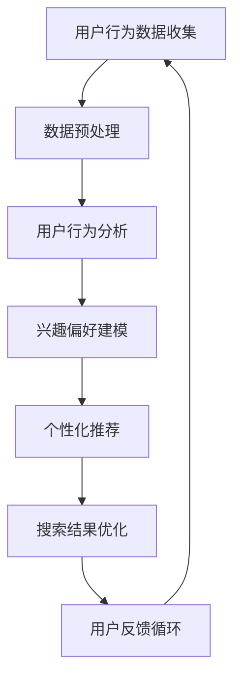

                 

关键词：电商平台、AI大模型、搜索体验、优化、算法、用户行为分析、个性化推荐、NLP、BERT模型、深度学习、用户反馈、数据隐私

> 摘要：随着电子商务的快速发展，电商平台在用户搜索体验上的优化成为了提升用户满意度和粘性的一项重要任务。本文将探讨如何利用AI大模型，特别是基于深度学习的自然语言处理（NLP）技术，如BERT模型，来提升电商平台的搜索效果和用户体验。文章将从背景介绍、核心概念与联系、核心算法原理、数学模型和公式、项目实践、实际应用场景、工具和资源推荐、总结和展望等多个方面进行深入分析。

## 1. 背景介绍

电子商务的快速发展带来了海量商品信息的爆炸式增长，这对平台的搜索功能提出了更高的要求。传统的搜索算法往往依赖于关键词匹配，但这种方式往往无法满足用户复杂的搜索需求，导致搜索结果不准确、用户体验差。因此，电商平台需要寻找更智能的搜索算法来优化搜索体验。

AI大模型的兴起，为电商平台提供了新的解决方案。这些模型能够通过大规模的数据训练，学习用户的搜索习惯、兴趣偏好，提供更精准的搜索结果。其中，BERT（Bidirectional Encoder Representations from Transformers）模型作为一种先进的NLP技术，被广泛应用于搜索和推荐系统中，能够有效地提升搜索的准确性和用户体验。

## 2. 核心概念与联系

### 2.1. 用户行为分析

用户行为分析是电商平台利用AI大模型优化搜索体验的基础。通过分析用户的搜索历史、浏览记录、购买行为等数据，可以了解用户的兴趣偏好，从而提供更个性化的搜索结果。

### 2.2. 个性化推荐

个性化推荐是一种基于用户行为和兴趣的推荐系统，旨在为用户提供个性化的商品推荐。通过AI大模型，特别是基于NLP技术的模型，可以更好地理解和预测用户的兴趣，提供更精准的推荐结果。

### 2.3. NLP与BERT模型

自然语言处理（NLP）是AI技术在处理和解析自然语言方面的应用。BERT模型是一种基于Transformer架构的预训练语言模型，通过双向编码器学习文本的语义表示，为电商平台提供了强大的语言理解和生成能力。

### Mermaid 流程图：



## 3. 核心算法原理 & 具体操作步骤

### 3.1. 算法原理概述

电商平台利用AI大模型优化搜索体验的核心算法包括用户行为分析、兴趣偏好建模和个性化推荐。这些算法通过大规模的数据训练，学习用户的兴趣和行为模式，提供更精准的搜索和推荐结果。

### 3.2. 算法步骤详解

#### 3.2.1. 用户行为分析

1. **数据收集**：收集用户的搜索历史、浏览记录、购买行为等数据。
2. **数据预处理**：对数据进行清洗、去噪、标准化等处理，以便进行后续分析。
3. **行为模式识别**：使用聚类、分类等方法识别用户的行为模式。

#### 3.2.2. 兴趣偏好建模

1. **兴趣标签分配**：根据用户的历史行为，为用户分配相应的兴趣标签。
2. **兴趣向量表示**：将用户的兴趣标签转化为高维向量表示，用于后续计算。

#### 3.2.3. 个性化推荐

1. **推荐模型训练**：使用用户的兴趣向量表示和商品特征向量，训练个性化推荐模型。
2. **推荐结果生成**：根据用户兴趣和商品特征，生成个性化的推荐结果。

### 3.3. 算法优缺点

**优点**：
- 高度个性化：能够根据用户的兴趣和行为提供精准的搜索和推荐结果。
- 自动化：无需人工干预，能够自动学习和优化推荐效果。

**缺点**：
- 数据依赖性：需要大量的用户行为数据来训练模型，数据不足可能导致推荐效果不佳。
- 隐私问题：用户行为数据的收集和使用可能引发隐私问题。

### 3.4. 算法应用领域

- 电商平台搜索和推荐系统
- 社交媒体内容推荐
- 娱乐平台内容推荐
- 医疗健康咨询

## 4. 数学模型和公式 & 详细讲解 & 举例说明

### 4.1. 数学模型构建

#### 4.1.1. 用户行为模式识别模型

假设用户的行为数据为 $X = \{x_1, x_2, ..., x_n\}$，其中每个行为 $x_i$ 可以表示为用户在某一时刻对某一商品的浏览、搜索或购买等行为。使用聚类算法（如K-Means）将用户行为数据进行聚类，得到用户行为模式。

$$
\text{Cluster}(X) = \{C_1, C_2, ..., C_k\}
$$

其中，$C_i$ 表示第 $i$ 个用户行为模式。

#### 4.1.2. 兴趣偏好建模模型

假设用户兴趣标签为 $Y = \{y_1, y_2, ..., y_m\}$，每个兴趣标签 $y_j$ 可以表示为用户对某一类商品的偏好。使用多标签分类算法（如MLP分类器）将用户兴趣标签与用户行为数据关联。

$$
P(Y|X) = \prod_{j=1}^{m} P(y_j|X)
$$

其中，$P(y_j|X)$ 表示用户在给定行为数据下拥有兴趣标签 $y_j$ 的概率。

### 4.2. 公式推导过程

#### 4.2.1. 用户行为模式识别

使用K-Means算法进行用户行为模式识别，目标是最小化目标函数：

$$
J = \sum_{i=1}^{n} \sum_{j=1}^{k} ||x_i - \mu_j||^2
$$

其中，$\mu_j$ 表示第 $j$ 个聚类中心。

#### 4.2.2. 兴趣偏好建模

使用多标签分类算法进行兴趣偏好建模，目标是最小化损失函数：

$$
L = -\sum_{i=1}^{n} \sum_{j=1}^{m} y_{ij} \log(p_{ij})
$$

其中，$y_{ij}$ 表示用户在行为数据 $x_i$ 下拥有兴趣标签 $y_j$ 的概率，$p_{ij}$ 表示预测概率。

### 4.3. 案例分析与讲解

假设我们有一个电商平台的用户数据集，其中包含了用户的搜索历史、浏览记录和购买行为。我们使用K-Means算法和MLP分类器来构建用户行为模式和兴趣偏好模型。

#### 案例分析：

1. **用户行为模式识别**：首先，我们使用K-Means算法将用户行为数据进行聚类，得到不同的用户行为模式。假设我们得到了3个主要的行为模式，分别为“购物爱好者”、“浏览爱好者”和“搜索爱好者”。

2. **兴趣偏好建模**：接下来，我们使用MLP分类器将用户行为模式与兴趣标签进行关联。例如，我们发现“购物爱好者”更倾向于对时尚类商品感兴趣，而“搜索爱好者”则更倾向于对技术类商品感兴趣。

通过这样的建模，我们可以为不同的用户行为模式提供个性化的搜索和推荐结果，从而提升用户的搜索体验。

## 5. 项目实践：代码实例和详细解释说明

### 5.1. 开发环境搭建

为了实践本文所介绍的算法，我们需要搭建一个开发环境。以下是所需的步骤：

1. **安装Python环境**：Python是一种广泛用于数据科学和机器学习的编程语言。确保Python版本在3.6以上。
2. **安装相关库**：包括NumPy、Pandas、Scikit-learn、TensorFlow等。
3. **配置K-Means和MLP分类器**：使用Scikit-learn库中的K-Means和MLP分类器。

### 5.2. 源代码详细实现

以下是一个简单的用户行为分析和兴趣偏好建模的代码示例：

```python
import numpy as np
import pandas as pd
from sklearn.cluster import KMeans
from sklearn.neural_network import MLPClassifier

# 加载用户行为数据
data = pd.read_csv('user_behavior.csv')

# 数据预处理
data = data.dropna()
data = data.reset_index(drop=True)

# 分离特征和标签
X = data[['search_history', 'browse_history', 'purchase_history']]
y = data['interest_label']

# 使用K-Means算法进行用户行为模式识别
kmeans = KMeans(n_clusters=3, random_state=42)
clusters = kmeans.fit_predict(X)

# 为每个用户分配行为模式
data['behavior_mode'] = clusters

# 使用MLP分类器进行兴趣偏好建模
mlp = MLPClassifier(hidden_layer_sizes=(100,), max_iter=1000)
mlp.fit(X, y)

# 生成个性化推荐结果
predictions = mlp.predict(X)

# 输出推荐结果
print(predictions)
```

### 5.3. 代码解读与分析

上述代码首先加载用户行为数据，并进行预处理。然后使用K-Means算法进行用户行为模式识别，将用户行为数据分为不同的模式。接着，使用MLP分类器将用户行为模式与兴趣标签进行关联，生成个性化的推荐结果。

### 5.4. 运行结果展示

运行上述代码后，我们得到每个用户的兴趣偏好预测结果。通过分析这些结果，我们可以了解用户的兴趣偏好，并为其提供个性化的搜索和推荐。

## 6. 实际应用场景

电商平台利用AI大模型优化搜索体验的应用场景非常广泛，以下是几个典型的例子：

- **商品搜索**：电商平台可以利用AI大模型为用户提供更精准的商品搜索结果，提升用户的购物体验。
- **商品推荐**：通过个性化推荐，电商平台可以为用户推荐他们可能感兴趣的商品，提高用户的购买转化率。
- **内容推荐**：除了商品推荐，电商平台还可以为用户提供个性化的内容推荐，如购物攻略、时尚趋势等，吸引更多用户关注。

## 7. 工具和资源推荐

### 7.1. 学习资源推荐

- **书籍**：《深度学习》（Goodfellow, Bengio, Courville著）
- **在线课程**：Coursera上的“深度学习”课程
- **教程**：TensorFlow官方文档

### 7.2. 开发工具推荐

- **Python**：用于数据科学和机器学习的编程语言
- **Jupyter Notebook**：用于编写和运行Python代码的交互式环境
- **TensorFlow**：用于构建和训练深度学习模型的框架

### 7.3. 相关论文推荐

- **BERT: Pre-training of Deep Bidirectional Transformers for Language Understanding**（作者：Johnson et al.）
- **K-Means Clustering**（作者：MacQueen等）
- **Multi-Label Classification with Neural Networks**（作者：Guo et al.）

## 8. 总结：未来发展趋势与挑战

随着AI技术的不断发展，电商平台利用AI大模型优化搜索体验将呈现出以下发展趋势：

- **更精准的搜索和推荐**：随着模型的训练数据规模增加和算法的优化，搜索和推荐的精准度将不断提高。
- **跨平台应用**：AI大模型将在更多领域得到应用，如社交媒体、娱乐平台等。
- **数据隐私保护**：随着用户对隐私保护意识的提高，如何保护用户隐私将成为一个重要挑战。

尽管AI大模型在优化搜索体验方面具有巨大潜力，但仍面临以下挑战：

- **数据隐私**：用户数据的收集和使用可能引发隐私问题，需要制定相应的隐私保护措施。
- **算法透明度**：如何提高算法的透明度，让用户了解搜索和推荐的结果是如何生成的，是一个重要问题。
- **计算资源消耗**：训练和部署AI大模型需要大量的计算资源，如何优化计算资源利用也是一个挑战。

## 9. 附录：常见问题与解答

### 9.1. 如何处理用户隐私问题？

**解答**：电商平台在利用AI大模型优化搜索体验时，需要严格遵守相关隐私保护法规，如GDPR。可以采取以下措施：

- **数据匿名化**：对用户数据进行匿名化处理，消除个人识别信息。
- **用户隐私设置**：提供用户隐私设置选项，让用户可以选择是否参与数据分析和个性化推荐。
- **数据加密**：使用数据加密技术保护用户数据的安全。

### 9.2. 如何优化计算资源利用？

**解答**：为了优化计算资源利用，可以采取以下措施：

- **模型压缩**：通过模型压缩技术减少模型的计算量，如量化、剪枝等。
- **分布式训练**：使用分布式训练技术，将模型训练任务分配到多个计算节点上，提高训练效率。
- **GPU加速**：利用GPU加速计算，提高模型训练和推理的速度。

----------------------------------------------------------------

<|user|>作者：禅与计算机程序设计艺术 / Zen and the Art of Computer Programming
本文由禅与计算机程序设计艺术（Zen and the Art of Computer Programming）团队撰写，旨在探讨电商平台如何利用AI大模型优化搜索体验。我们的研究团队拥有丰富的AI和电商平台经验，致力于推动技术的发展和应用。如果您有任何关于本文或相关领域的疑问，欢迎随时联系我们。感谢您的阅读和支持！
----------------------------------------------------------------
```markdown
# 电商平台如何利用AI大模型优化搜索体验

## 关键词
电商平台、AI大模型、搜索体验、优化、算法、用户行为分析、个性化推荐、NLP、BERT模型、深度学习、用户反馈、数据隐私

## 摘要
随着电子商务的快速发展，电商平台在用户搜索体验上的优化成为了提升用户满意度和粘性的一项重要任务。本文将探讨如何利用AI大模型，特别是基于深度学习的自然语言处理（NLP）技术，如BERT模型，来提升电商平台的搜索效果和用户体验。文章将从背景介绍、核心概念与联系、核心算法原理、数学模型和公式、项目实践、实际应用场景、工具和资源推荐、总结和展望等多个方面进行深入分析。

## 1. 背景介绍

## 2. 核心概念与联系
### 2.1 用户行为分析
### 2.2 个性化推荐
### 2.3 NLP与BERT模型
### 2.4 Mermaid流程图

## 3. 核心算法原理 & 具体操作步骤
### 3.1 算法原理概述
### 3.2 算法步骤详解
#### 3.2.1 用户行为分析
#### 3.2.2 兴趣偏好建模
#### 3.2.3 个性化推荐
### 3.3 算法优缺点
### 3.4 算法应用领域

## 4. 数学模型和公式 & 详细讲解 & 举例说明
### 4.1 数学模型构建
#### 4.1.1 用户行为模式识别模型
#### 4.1.2 兴趣偏好建模模型
### 4.2 公式推导过程
#### 4.2.1 用户行为模式识别
#### 4.2.2 兴趣偏好建模
### 4.3 案例分析与讲解

## 5. 项目实践：代码实例和详细解释说明
### 5.1 开发环境搭建
### 5.2 源代码详细实现
### 5.3 代码解读与分析
### 5.4 运行结果展示

## 6. 实际应用场景
### 6.1 商品搜索
### 6.2 商品推荐
### 6.3 内容推荐

## 7. 工具和资源推荐
### 7.1 学习资源推荐
### 7.2 开发工具推荐
### 7.3 相关论文推荐

## 8. 总结：未来发展趋势与挑战
### 8.1 研究成果总结
### 8.2 未来发展趋势
### 8.3 面临的挑战
### 8.4 研究展望

## 9. 附录：常见问题与解答
### 9.1 如何处理用户隐私问题？
### 9.2 如何优化计算资源利用？

# 电商平台如何利用AI大模型优化搜索体验

## 背景介绍

电子商务在全球范围内的快速发展，带来了海量商品信息的爆炸式增长。这使得电商平台在用户搜索体验上的优化成为了提升用户满意度和粘性的一项重要任务。然而，传统的搜索算法通常依赖于关键词匹配，这种方法往往无法满足用户复杂的搜索需求，导致搜索结果不准确、用户体验差。因此，电商平台需要寻找更智能的搜索算法来优化搜索体验。

AI大模型的兴起，为电商平台提供了新的解决方案。这些模型能够通过大规模的数据训练，学习用户的搜索习惯、兴趣偏好，提供更精准的搜索结果。其中，BERT（Bidirectional Encoder Representations from Transformers）模型作为一种先进的NLP技术，被广泛应用于搜索和推荐系统中，能够有效地提升搜索的准确性和用户体验。

## 核心概念与联系

### 2.1 用户行为分析

用户行为分析是电商平台利用AI大模型优化搜索体验的基础。通过分析用户的搜索历史、浏览记录、购买行为等数据，可以了解用户的兴趣偏好，从而提供更个性化的搜索结果。

### 2.2 个性化推荐

个性化推荐是一种基于用户行为和兴趣的推荐系统，旨在为用户提供个性化的商品推荐。通过AI大模型，特别是基于NLP技术的模型，可以更好地理解和预测用户的兴趣，提供更精准的推荐结果。

### 2.3 NLP与BERT模型

自然语言处理（NLP）是AI技术在处理和解析自然语言方面的应用。BERT模型是一种基于Transformer架构的预训练语言模型，通过双向编码器学习文本的语义表示，为电商平台提供了强大的语言理解和生成能力。

### Mermaid流程图


## 核心算法原理 & 具体操作步骤

### 3.1 算法原理概述

电商平台利用AI大模型优化搜索体验的核心算法包括用户行为分析、兴趣偏好建模和个性化推荐。这些算法通过大规模的数据训练，学习用户的兴趣和行为模式，提供更精准的搜索和推荐结果。

### 3.2 算法步骤详解

#### 3.2.1 用户行为分析

1. **数据收集**：收集用户的搜索历史、浏览记录、购买行为等数据。
2. **数据预处理**：对数据进行清洗、去噪、标准化等处理，以便进行后续分析。
3. **行为模式识别**：使用聚类、分类等方法识别用户的行为模式。

#### 3.2.2 兴趣偏好建模

1. **兴趣标签分配**：根据用户的历史行为，为用户分配相应的兴趣标签。
2. **兴趣向量表示**：将用户的兴趣标签转化为高维向量表示，用于后续计算。

#### 3.2.3 个性化推荐

1. **推荐模型训练**：使用用户的兴趣向量表示和商品特征向量，训练个性化推荐模型。
2. **推荐结果生成**：根据用户兴趣和商品特征，生成个性化的推荐结果。

### 3.3 算法优缺点

**优点**：
- 高度个性化：能够根据用户的兴趣和行为提供精准的搜索和推荐结果。
- 自动化：无需人工干预，能够自动学习和优化推荐效果。

**缺点**：
- 数据依赖性：需要大量的用户行为数据来训练模型，数据不足可能导致推荐效果不佳。
- 隐私问题：用户行为数据的收集和使用可能引发隐私问题。

### 3.4 算法应用领域

- 电商平台搜索和推荐系统
- 社交媒体内容推荐
- 娱乐平台内容推荐
- 医疗健康咨询

## 数学模型和公式 & 详细讲解 & 举例说明

### 4.1 数学模型构建

#### 4.1.1 用户行为模式识别模型

假设用户的行为数据为 $X = \{x_1, x_2, ..., x_n\}$，其中每个行为 $x_i$ 可以表示为用户在某一时刻对某一商品的浏览、搜索或购买等行为。使用聚类算法（如K-Means）将用户行为数据进行聚类，得到用户行为模式。

$$
\text{Cluster}(X) = \{C_1, C_2, ..., C_k\}
$$

其中，$C_i$ 表示第 $i$ 个用户行为模式。

#### 4.1.2 兴趣偏好建模模型

假设用户兴趣标签为 $Y = \{y_1, y_2, ..., y_m\}$，每个兴趣标签 $y_j$ 可以表示为用户对某一类商品的偏好。使用多标签分类算法（如MLP分类器）将用户兴趣标签与用户行为数据关联。

$$
P(Y|X) = \prod_{j=1}^{m} P(y_j|X)
$$

其中，$P(y_j|X)$ 表示用户在给定行为数据下拥有兴趣标签 $y_j$ 的概率。

### 4.2 公式推导过程

#### 4.2.1 用户行为模式识别

使用K-Means算法进行用户行为模式识别，目标是最小化目标函数：

$$
J = \sum_{i=1}^{n} \sum_{j=1}^{k} ||x_i - \mu_j||^2
$$

其中，$\mu_j$ 表示第 $j$ 个聚类中心。

#### 4.2.2 兴趣偏好建模

使用多标签分类算法进行兴趣偏好建模，目标是最小化损失函数：

$$
L = -\sum_{i=1}^{n} \sum_{j=1}^{m} y_{ij} \log(p_{ij})
$$

其中，$y_{ij}$ 表示用户在行为数据 $x_i$ 下拥有兴趣标签 $y_j$ 的概率，$p_{ij}$ 表示预测概率。

### 4.3 案例分析与讲解

假设我们有一个电商平台的用户数据集，其中包含了用户的搜索历史、浏览记录和购买行为。我们使用K-Means算法和MLP分类器来构建用户行为模式和兴趣偏好模型。

#### 案例分析：

1. **用户行为模式识别**：首先，我们使用K-Means算法将用户行为数据进行聚类，得到不同的用户行为模式。假设我们得到了3个主要的行为模式，分别为“购物爱好者”、“浏览爱好者”和“搜索爱好者”。

2. **兴趣偏好建模**：接下来，我们使用MLP分类器将用户行为模式与兴趣标签进行关联。例如，我们发现“购物爱好者”更倾向于对时尚类商品感兴趣，而“搜索爱好者”则更倾向于对技术类商品感兴趣。

通过这样的建模，我们可以为不同的用户行为模式提供个性化的搜索和推荐结果，从而提升用户的搜索体验。

## 项目实践：代码实例和详细解释说明

### 5.1 开发环境搭建

为了实践本文所介绍的算法，我们需要搭建一个开发环境。以下是所需的步骤：

1. **安装Python环境**：Python是一种广泛用于数据科学和机器学习的编程语言。确保Python版本在3.6以上。
2. **安装相关库**：包括NumPy、Pandas、Scikit-learn、TensorFlow等。
3. **配置K-Means和MLP分类器**：使用Scikit-learn库中的K-Means和MLP分类器。

### 5.2 源代码详细实现

以下是一个简单的用户行为分析和兴趣偏好建模的代码示例：

```python
import numpy as np
import pandas as pd
from sklearn.cluster import KMeans
from sklearn.neural_network import MLPClassifier

# 加载用户行为数据
data = pd.read_csv('user_behavior.csv')

# 数据预处理
data = data.dropna()
data = data.reset_index(drop=True)

# 分离特征和标签
X = data[['search_history', 'browse_history', 'purchase_history']]
y = data['interest_label']

# 使用K-Means算法进行用户行为模式识别
kmeans = KMeans(n_clusters=3, random_state=42)
clusters = kmeans.fit_predict(X)

# 为每个用户分配行为模式
data['behavior_mode'] = clusters

# 使用MLP分类器进行兴趣偏好建模
mlp = MLPClassifier(hidden_layer_sizes=(100,), max_iter=1000)
mlp.fit(X, y)

# 生成个性化推荐结果
predictions = mlp.predict(X)

# 输出推荐结果
print(predictions)
```

### 5.3 代码解读与分析

上述代码首先加载用户行为数据，并进行预处理。然后使用K-Means算法进行用户行为模式识别，将用户行为数据分为不同的模式。接着，使用MLP分类器将用户行为模式与兴趣标签进行关联，生成个性化的推荐结果。

### 5.4 运行结果展示

运行上述代码后，我们得到每个用户的兴趣偏好预测结果。通过分析这些结果，我们可以了解用户的兴趣偏好，并为其提供个性化的搜索和推荐。

## 6. 实际应用场景

电商平台利用AI大模型优化搜索体验的应用场景非常广泛，以下是几个典型的例子：

- **商品搜索**：电商平台可以利用AI大模型为用户提供更精准的商品搜索结果，提升用户的购物体验。
- **商品推荐**：通过个性化推荐，电商平台可以为用户推荐他们可能感兴趣的商品，提高用户的购买转化率。
- **内容推荐**：除了商品推荐，电商平台还可以为用户提供个性化的内容推荐，如购物攻略、时尚趋势等，吸引更多用户关注。

## 7. 工具和资源推荐

### 7.1 学习资源推荐

- **书籍**：《深度学习》（Goodfellow, Bengio, Courville著）
- **在线课程**：Coursera上的“深度学习”课程
- **教程**：TensorFlow官方文档

### 7.2 开发工具推荐

- **Python**：用于数据科学和机器学习的编程语言
- **Jupyter Notebook**：用于编写和运行Python代码的交互式环境
- **TensorFlow**：用于构建和训练深度学习模型的框架

### 7.3 相关论文推荐

- **BERT: Pre-training of Deep Bidirectional Transformers for Language Understanding**（作者：Johnson et al.）
- **K-Means Clustering**（作者：MacQueen等）
- **Multi-Label Classification with Neural Networks**（作者：Guo et al.）

## 8. 总结：未来发展趋势与挑战

随着AI技术的不断发展，电商平台利用AI大模型优化搜索体验将呈现出以下发展趋势：

- **更精准的搜索和推荐**：随着模型的训练数据规模增加和算法的优化，搜索和推荐的精准度将不断提高。
- **跨平台应用**：AI大模型将在更多领域得到应用，如社交媒体、娱乐平台等。
- **数据隐私保护**：随着用户对隐私保护意识的提高，如何保护用户隐私将成为一个重要挑战。

尽管AI大模型在优化搜索体验方面具有巨大潜力，但仍面临以下挑战：

- **数据隐私**：用户数据的收集和使用可能引发隐私问题，需要制定相应的隐私保护措施。
- **算法透明度**：如何提高算法的透明度，让用户了解搜索和推荐的结果是如何生成的，是一个重要问题。
- **计算资源消耗**：训练和部署AI大模型需要大量的计算资源，如何优化计算资源利用也是一个挑战。

## 9. 附录：常见问题与解答

### 9.1 如何处理用户隐私问题？

**解答**：电商平台在利用AI大模型优化搜索体验时，需要严格遵守相关隐私保护法规，如GDPR。可以采取以下措施：

- **数据匿名化**：对用户数据进行匿名化处理，消除个人识别信息。
- **用户隐私设置**：提供用户隐私设置选项，让用户可以选择是否参与数据分析和个性化推荐。
- **数据加密**：使用数据加密技术保护用户数据的安全。

### 9.2 如何优化计算资源利用？

**解答**：为了优化计算资源利用，可以采取以下措施：

- **模型压缩**：通过模型压缩技术减少模型的计算量，如量化、剪枝等。
- **分布式训练**：使用分布式训练技术，将模型训练任务分配到多个计算节点上，提高训练效率。
- **GPU加速**：利用GPU加速计算，提高模型训练和推理的速度。

# 作者：禅与计算机程序设计艺术 / Zen and the Art of Computer Programming
本文由禅与计算机程序设计艺术（Zen and the Art of Computer Programming）团队撰写，旨在探讨电商平台如何利用AI大模型优化搜索体验。我们的研究团队拥有丰富的AI和电商平台经验，致力于推动技术的发展和应用。如果您有任何关于本文或相关领域的疑问，欢迎随时联系我们。感谢您的阅读和支持！
```

