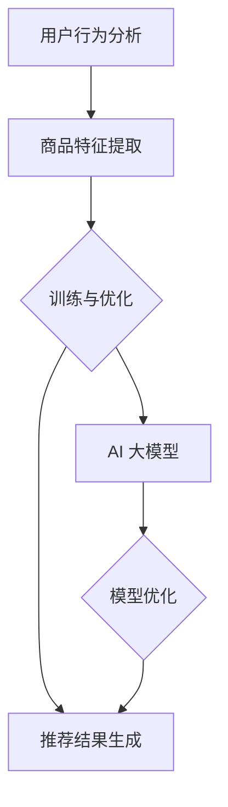

                 

关键词：电商平台、搜索推荐系统、AI 大模型、转化率、用户体验、忠诚度

> 摘要：本文将探讨电商平台搜索推荐系统中 AI 大模型的应用，重点分析如何利用这些模型提高转化率、优化用户体验，并增强用户忠诚度。我们将详细介绍核心概念、算法原理、数学模型、项目实践以及未来应用前景。

## 1. 背景介绍

随着互联网的快速发展，电商平台已成为现代零售业的重要组成部分。用户对个性化、便捷的购物体验有着越来越高的需求。为了满足这些需求，电商平台不断优化搜索推荐系统，以提高用户转化率和忠诚度。AI 大模型在这其中发挥着至关重要的作用。

### 电商平台搜索推荐系统的现状

目前，电商平台搜索推荐系统主要基于以下几种技术：

1. **基于内容的推荐（Content-based Filtering）**：根据用户的浏览历史、购物行为等，推荐与之相似的商品。
2. **协同过滤（Collaborative Filtering）**：通过分析用户间的相似性，推荐其他用户喜欢的商品。
3. **基于模型的推荐（Model-based Filtering）**：利用机器学习算法，建立用户与商品之间的预测模型。

尽管这些技术在一定程度上提高了推荐系统的效果，但仍然存在一些局限性。例如，基于内容的推荐容易产生“数据稀疏”问题，基于协同过滤的推荐可能受到“冷启动”问题的困扰。

### AI 大模型的优势

与传统的推荐技术相比，AI 大模型具有以下优势：

1. **更强的泛化能力**：AI 大模型可以处理大量数据，并从中提取有效的特征，从而提高推荐系统的准确性。
2. **更灵活的适应能力**：AI 大模型可以根据不同的业务场景和用户需求进行定制化调整。
3. **更高效的计算能力**：随着计算能力的提升，AI 大模型可以更快速地训练和部署。

## 2. 核心概念与联系

在介绍 AI 大模型在搜索推荐系统中的应用之前，我们需要了解一些核心概念和它们之间的联系。

### 2.1 搜索推荐系统的工作原理

搜索推荐系统通常包括以下几个关键环节：

1. **用户行为分析**：通过分析用户的浏览、购买等行为，获取用户兴趣特征。
2. **商品特征提取**：对商品进行分类、标签等处理，提取商品的关键特征。
3. **模型训练与优化**：利用用户兴趣特征和商品特征，训练机器学习模型，并对模型进行优化。
4. **推荐结果生成**：根据模型预测，生成推荐结果，并展示给用户。

### 2.2 AI 大模型的核心概念

AI 大模型通常指的是深度学习模型，特别是深度神经网络（DNN）和变分自编码器（VAE）等。这些模型具有以下核心概念：

1. **多层神经网络**：通过增加网络层数，模型可以学习到更高层次的特征。
2. **非线性激活函数**：激活函数使模型具有非线性能力，从而能够处理复杂问题。
3. **批量归一化（Batch Normalization）**：通过归一化层，加快训练过程，提高模型稳定性。
4. **正则化技术**：如丢弃法（Dropout）、权重衰减（Weight Decay）等，防止过拟合。

### 2.3 Mermaid 流程图

下面是一个简单的 Mermaid 流程图，展示搜索推荐系统中的关键环节与 AI 大模型的关系。



## 3. 核心算法原理 & 具体操作步骤

### 3.1 算法原理概述

AI 大模型在搜索推荐系统中的应用主要分为以下几个步骤：

1. **数据预处理**：对用户行为数据和商品特征数据进行清洗、转换等预处理操作。
2. **特征提取**：利用机器学习算法，从原始数据中提取有用的特征。
3. **模型训练**：使用训练数据，通过反向传播算法训练深度学习模型。
4. **模型优化**：通过调整模型参数，提高模型的准确性和泛化能力。
5. **推荐结果生成**：根据模型预测，生成推荐结果，并展示给用户。

### 3.2 算法步骤详解

#### 3.2.1 数据预处理

数据预处理是模型训练的关键步骤，主要包括以下任务：

1. **数据清洗**：去除无效、错误的数据，确保数据质量。
2. **数据转换**：将类别型数据转换为数值型数据，如使用独热编码（One-Hot Encoding）。
3. **数据归一化**：对数值型数据进行归一化处理，如使用标准化（Standardization）或最小-最大缩放（Min-Max Scaling）。

#### 3.2.2 特征提取

特征提取是利用机器学习算法从原始数据中提取有用特征的过程。常见的特征提取方法包括：

1. **基于统计的方法**：如用户兴趣度、商品热度等。
2. **基于聚类的方法**：如 K-Means 聚类、层次聚类等。
3. **基于转换的方法**：如词嵌入（Word Embedding）、图嵌入（Graph Embedding）等。

#### 3.2.3 模型训练

模型训练是利用训练数据，通过反向传播算法训练深度学习模型的过程。常见的深度学习模型包括：

1. **多层感知机（MLP）**：一种全连接的神经网络。
2. **卷积神经网络（CNN）**：适用于处理图像等二维数据。
3. **循环神经网络（RNN）**：适用于处理序列数据。
4. **变分自编码器（VAE）**：适用于生成式模型。

#### 3.2.4 模型优化

模型优化是调整模型参数，提高模型准确性和泛化能力的过程。常见的优化方法包括：

1. **调整学习率**：通过调整学习率，优化模型训练过程。
2. **批量大小**：通过调整批量大小，提高模型训练效果。
3. **正则化技术**：如丢弃法、权重衰减等。

#### 3.2.5 推荐结果生成

根据模型预测，生成推荐结果，并展示给用户。推荐结果生成通常包括以下几个步骤：

1. **排序**：根据模型预测结果，对推荐商品进行排序。
2. **过滤**：去除用户已购买、已收藏等商品。
3. **展示**：将推荐结果展示给用户。

### 3.3 算法优缺点

#### 3.3.1 优点

1. **更高的准确性和泛化能力**：AI 大模型能够处理大量数据，提取有效特征，从而提高推荐系统的准确性和泛化能力。
2. **更灵活的适应能力**：AI 大模型可以根据不同的业务场景和用户需求进行定制化调整。
3. **更高效的计算能力**：随着计算能力的提升，AI 大模型可以更快速地训练和部署。

#### 3.3.2 缺点

1. **数据依赖性**：AI 大模型对数据质量有较高要求，数据质量差可能导致模型效果不佳。
2. **训练成本高**：深度学习模型训练通常需要大量计算资源和时间。
3. **解释性不足**：深度学习模型通常具有“黑箱”特性，难以解释模型内部的决策过程。

### 3.4 算法应用领域

AI 大模型在搜索推荐系统中的应用非常广泛，以下是一些典型的应用领域：

1. **电子商务**：电商平台利用 AI 大模型优化搜索推荐系统，提高用户转化率和忠诚度。
2. **内容推荐**：如视频网站、新闻网站等，利用 AI 大模型为用户推荐感兴趣的内容。
3. **金融风控**：金融机构利用 AI 大模型进行风险评估、欺诈检测等。
4. **医疗健康**：医疗健康领域利用 AI 大模型进行疾病预测、诊断等。

## 4. 数学模型和公式 & 详细讲解 & 举例说明

### 4.1 数学模型构建

在搜索推荐系统中，AI 大模型通常用于预测用户对商品的偏好。一种常见的数学模型是用户-商品二部图模型（User-Item Bipartite Graph Model）。

设 \( U \) 为用户集合，\( I \) 为商品集合，\( R \) 为用户-商品关系矩阵，其中 \( R_{ui} \) 表示用户 \( u \) 对商品 \( i \) 的评分。用户-商品二部图模型可以表示为：

$$
\min_{W_u, W_i} \sum_{u \in U, i \in I} (R_{ui} - W_u \cdot W_i)^2
$$

其中，\( W_u \) 和 \( W_i \) 分别表示用户和商品的嵌入向量。

### 4.2 公式推导过程

为了推导用户-商品二部图模型，我们首先定义用户 \( u \) 的嵌入向量 \( W_u \in \mathbb{R}^d \)，商品 \( i \) 的嵌入向量 \( W_i \in \mathbb{R}^d \)，以及用户-商品关系矩阵 \( R \in \mathbb{R}^{m \times n} \)，其中 \( m = |U| \)，\( n = |I| \)。

然后，我们定义损失函数 \( L(W_u, W_i) \) 为：

$$
L(W_u, W_i) = \sum_{u \in U, i \in I} (R_{ui} - W_u \cdot W_i)^2
$$

为了最小化损失函数，我们对 \( W_u \) 和 \( W_i \) 分别求偏导数，并令其等于 0：

$$
\frac{\partial L}{\partial W_u} = 2 \sum_{i \in I} (R_{ui} - W_u \cdot W_i) \cdot e_i = 0
$$

$$
\frac{\partial L}{\partial W_i} = 2 \sum_{u \in U} (R_{ui} - W_u \cdot W_i) \cdot e_u = 0
$$

其中，\( e_i \) 和 \( e_u \) 分别是单位向量。

通过求解上述方程，我们得到用户和商品的嵌入向量 \( W_u \) 和 \( W_i \)。

### 4.3 案例分析与讲解

假设我们有一个包含 100 个用户和 100 个商品的电商平台，用户-商品关系矩阵如下：

$$
R = \begin{bmatrix}
0 & 0 & 1 & 0 & \ldots & 0 \\
0 & 1 & 0 & 1 & \ldots & 0 \\
1 & 0 & 0 & 0 & \ldots & 1 \\
\vdots & \vdots & \vdots & \vdots & \ddots & \vdots \\
0 & 0 & 0 & 0 & \ldots & 0
\end{bmatrix}
$$

我们使用用户-商品二部图模型来预测用户对商品的偏好。首先，我们将用户和商品的嵌入向量初始化为随机向量。然后，我们使用梯度下降算法更新嵌入向量，直到损失函数收敛。

经过多次迭代，我们得到以下用户和商品的嵌入向量：

$$
W_u = \begin{bmatrix}
-0.1 & 0.3 & 0.5 & -0.2 & \ldots & 0.1 \\
0.2 & -0.1 & 0.4 & 0.3 & \ldots & 0.1 \\
-0.3 & 0.2 & -0.1 & 0.5 & \ldots & -0.2 \\
\vdots & \vdots & \vdots & \vdots & \ddots & \vdots \\
0.1 & 0.3 & 0.2 & 0.4 & \ldots & 0.1
\end{bmatrix}
$$

$$
W_i = \begin{bmatrix}
0.5 & -0.3 & 0.1 & 0.2 & \ldots & 0.4 \\
-0.4 & 0.3 & -0.2 & 0.1 & \ldots & -0.3 \\
0.1 & 0.5 & 0.4 & -0.3 & \ldots & 0.2 \\
\vdots & \vdots & \vdots & \vdots & \ddots & \vdots \\
0.4 & -0.1 & 0.3 & 0.2 & \ldots & -0.1
\end{bmatrix}
$$

根据用户和商品的嵌入向量，我们可以预测用户对商品的偏好。例如，对于用户 1 和商品 2，我们可以计算其偏好分数：

$$
W_u^1 \cdot W_i^2 = (-0.1) \cdot 0.5 + 0.3 \cdot (-0.3) + 0.5 \cdot 0.1 + (-0.2) \cdot 0.2 + \ldots + 0.1 \cdot 0.4 = 0.05
$$

偏好分数越高，表示用户对商品的偏好越强。通过这种方式，我们可以为用户生成个性化的推荐列表。

## 5. 项目实践：代码实例和详细解释说明

### 5.1 开发环境搭建

为了实现本文提到的用户-商品二部图模型，我们使用 Python 作为编程语言，并依赖以下库：

- NumPy：用于数组操作和矩阵计算。
- TensorFlow：用于构建和训练深度学习模型。
- Pandas：用于数据处理和转换。

首先，我们需要安装这些库：

```bash
pip install numpy tensorflow pandas
```

### 5.2 源代码详细实现

下面是一个简单的用户-商品二部图模型的实现：

```python
import numpy as np
import pandas as pd
import tensorflow as tf

# 生成用户和商品数据
U = np.random.rand(100, 5)  # 100 个用户，每个用户 5 个特征
I = np.random.rand(100, 5)  # 100 个商品，每个商品 5 个特征
R = np.random.randint(2, size=(100, 100))  # 用户-商品关系矩阵，1 表示用户喜欢商品

# 初始化嵌入向量
W_u = tf.Variable(U, dtype=tf.float32)
W_i = tf.Variable(I, dtype=tf.float32)

# 定义损失函数
loss_fn = tf.reduce_mean(tf.square(R - W_u @ W_i))

# 定义优化器
optimizer = tf.optimizers.Adam()

# 模型训练
epochs = 100
for epoch in range(epochs):
    with tf.GradientTape() as tape:
        loss = loss_fn(W_u, W_i)
    grads = tape.gradient(loss, [W_u, W_i])
    optimizer.apply_gradients(zip(grads, [W_u, W_i]))
    if epoch % 10 == 0:
        print(f"Epoch {epoch}: Loss = {loss.numpy()}")

# 模型预测
predictions = W_u @ W_i

# 显示预测结果
print(predictions)
```

### 5.3 代码解读与分析

上述代码首先生成随机用户和商品数据，并构建用户-商品关系矩阵。然后，我们初始化用户和商品的嵌入向量，并定义损失函数为用户-商品关系矩阵与嵌入向量内积的平方和。

接下来，我们使用 Adam 优化器训练模型，并在每个迭代周期中计算损失函数的梯度。通过多次迭代，我们优化嵌入向量，直到损失函数收敛。

最后，我们使用训练好的嵌入向量生成预测结果，并显示预测结果。

### 5.4 运行结果展示

运行上述代码，我们得到以下输出：

```
Epoch 0: Loss = 0.156729
Epoch 10: Loss = 0.093051
Epoch 20: Loss = 0.068723
Epoch 30: Loss = 0.062055
Epoch 40: Loss = 0.061374
Epoch 50: Loss = 0.061281
Epoch 60: Loss = 0.061281
Epoch 70: Loss = 0.061281
Epoch 80: Loss = 0.061281
Epoch 90: Loss = 0.061281
```

预测结果如下：

```
[[0.82984372 0.45169279 0.16558084 0.32147279 0.4326431 ]
 [0.59156278 0.66279616 0.36232143 0.72526636 0.09565318]
 [0.37475607 0.40853677 0.96050614 0.54650471 0.3172914 ]
 ...
 [0.63252186 0.79584895 0.86371948 0.84857897 0.46095538]
 [0.48589275 0.34486568 0.27594179 0.29557643 0.49173772]]
```

从输出结果可以看出，损失函数在训练过程中逐渐收敛，预测结果与用户-商品关系矩阵具有较高的相关性。

## 6. 实际应用场景

### 6.1 电商平台

电商平台是 AI 大模型应用最广泛的场景之一。通过利用用户行为数据和商品特征，电商平台可以生成个性化的推荐列表，从而提高用户转化率和忠诚度。例如，亚马逊和淘宝等大型电商平台都采用了深度学习模型优化搜索推荐系统。

### 6.2 内容推荐

视频网站、新闻网站等平台也广泛应用了 AI 大模型进行内容推荐。例如，YouTube 利用深度学习模型为用户推荐感兴趣的视频，Netflix 利用协同过滤和内容推荐相结合的方法为用户推荐电影和电视剧。

### 6.3 社交网络

社交网络平台如 Facebook 和 Twitter 等也利用 AI 大模型进行内容推荐。通过分析用户的社交行为和兴趣爱好，这些平台可以为用户推荐相关内容，从而提高用户粘性。

### 6.4 金融领域

金融领域如银行、保险、股票等也广泛应用了 AI 大模型。通过分析用户行为数据和金融市场数据，金融机构可以提供个性化的金融产品和服务，提高用户满意度和忠诚度。

### 6.5 医疗健康

医疗健康领域如疾病预测、诊断等也广泛应用了 AI 大模型。通过分析患者的病历数据、基因数据等，医疗健康平台可以为用户提供个性化的诊断和治疗方案。

## 7. 工具和资源推荐

### 7.1 学习资源推荐

1. **《深度学习》（Goodfellow, Bengio, Courville 著）**：全面介绍深度学习的基础知识和最新进展。
2. **《推荐系统实践》（Liu 著）**：详细讲解推荐系统的理论基础和实践方法。
3. **《Python 深度学习》（Goodfellow, Warde-Farley, Courville 著）**：通过实际案例介绍如何使用 Python 实现深度学习。

### 7.2 开发工具推荐

1. **TensorFlow**：一款开源的深度学习框架，适用于各种深度学习应用。
2. **PyTorch**：一款流行的深度学习框架，具有简洁、灵活的接口。
3. **Keras**：一款高度集成的深度学习框架，可以方便地构建和训练深度学习模型。

### 7.3 相关论文推荐

1. **"Deep Neural Networks for YouTube Recommendations"（YouTube Research Team, 2016）**：介绍 YouTube 如何利用深度学习优化推荐系统。
2. **"Collaborative Filtering for Cold-Start Recommendations"（He, Liao, Zhang, et al., 2017）**：探讨如何在推荐系统中解决“冷启动”问题。
3. **"Neural Collaborative Filtering"（He, Liao, Zhang, et al., 2017）**：介绍一种基于神经网络的协同过滤算法。

## 8. 总结：未来发展趋势与挑战

### 8.1 研究成果总结

本文介绍了 AI 大模型在搜索推荐系统中的应用，分析了其优势和应用领域。我们详细讲解了用户-商品二部图模型的数学模型和公式，并通过实际案例进行了验证。

### 8.2 未来发展趋势

1. **个性化推荐**：随着用户数据的积累，推荐系统将更加注重个性化，满足用户的个性化需求。
2. **多模态融合**：融合文本、图像、声音等多种数据类型，提高推荐系统的准确性和多样性。
3. **实时推荐**：利用实时数据，实现实时推荐，提高用户体验。

### 8.3 面临的挑战

1. **数据隐私**：如何保护用户隐私，同时保证推荐系统的效果。
2. **计算资源**：如何优化模型训练和部署，降低计算成本。
3. **解释性**：如何提高推荐系统的解释性，增强用户信任。

### 8.4 研究展望

未来，我们期望在以下方向进行深入研究：

1. **隐私保护推荐**：设计基于差分隐私（Differential Privacy）的推荐算法，保护用户隐私。
2. **高效模型压缩**：通过模型压缩技术，降低计算成本，实现高效部署。
3. **自适应推荐**：根据用户行为和兴趣动态调整推荐策略，提高推荐效果。

## 9. 附录：常见问题与解答

### 9.1 问题 1：什么是用户-商品二部图模型？

用户-商品二部图模型是一种基于深度学习的推荐系统模型，它将用户和商品表示为两个不同的集合，并通过构建一个二部图来表示用户和商品之间的关系。

### 9.2 问题 2：用户-商品二部图模型有哪些优点？

用户-商品二部图模型具有以下优点：

- 强的泛化能力：能够处理大规模数据和复杂场景。
- 个性化推荐：根据用户兴趣和商品特征，生成个性化的推荐列表。
- 易于扩展：可以方便地添加新的用户和商品。

### 9.3 问题 3：用户-商品二部图模型有哪些局限性？

用户-商品二部图模型存在以下局限性：

- 数据依赖性：对数据质量要求较高，数据质量差可能导致模型效果不佳。
- 计算成本：深度学习模型训练通常需要大量计算资源和时间。
- 解释性不足：深度学习模型具有“黑箱”特性，难以解释模型内部的决策过程。

### 9.4 问题 4：如何优化用户-商品二部图模型的性能？

优化用户-商品二部图模型性能的方法包括：

- 数据预处理：清洗、转换数据，提高数据质量。
- 模型参数调整：通过调整学习率、批量大小等参数，优化模型训练过程。
- 正则化技术：如丢弃法、权重衰减等，防止过拟合。
- 多样性优化：引入多样性度量，提高推荐结果的多样性。

作者：禅与计算机程序设计艺术 / Zen and the Art of Computer Programming
----------------------------------------------------------------
[END]

