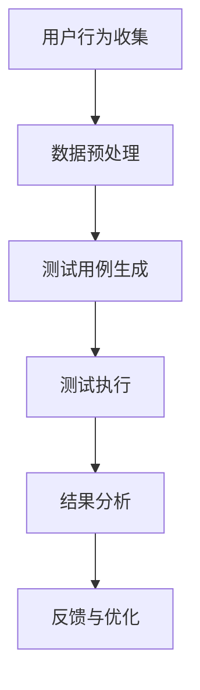

                 

作者：禅与计算机程序设计艺术 / Zen and the Art of Computer Programming

随着电子商务的快速发展，电商平台不断涌现，用户对界面的交互体验要求越来越高。用户界面（UI）的优化成为电商平台持续关注的核心问题。传统UI测试方法通常依赖于手工操作，效率低下且容易出现人为错误。近年来，人工智能（AI）技术的崛起为UI测试带来了全新的解决方案。本文将探讨电商平台AI驱动用户界面测试的技术方案，包括核心概念、算法原理、数学模型、项目实践以及未来展望。

## 1. 背景介绍

电商平台的核心竞争力在于用户体验。用户界面作为用户体验的重要组成部分，直接影响到用户对平台的满意度。随着互联网技术的发展，电商平台的用户界面越来越复杂，功能日益丰富，这使得传统UI测试方法难以满足需求。传统UI测试通常依赖于手动操作，测试人员需要逐一模拟用户行为，验证界面功能是否符合预期。这种方法存在以下问题：

1. **效率低**：测试过程繁琐，测试人员的工作量大，耗时耗力。
2. **覆盖率低**：手动测试难以覆盖所有用户路径和场景，可能导致漏洞遗漏。
3. **成本高**：测试人力成本高，且测试结果易受测试人员主观影响。

为了解决上述问题，电商平台迫切需要一种高效、准确的UI测试方法。AI技术的引入为UI测试提供了新的思路。AI可以通过学习用户行为数据，自动生成测试用例，执行测试，并提供智能分析报告。这种自动化UI测试方法不仅能够提高测试效率，还能提高测试覆盖率，降低测试成本。

## 2. 核心概念与联系

在深入探讨AI驱动的UI测试之前，我们需要了解几个核心概念：

### 2.1  自动化测试

自动化测试是指通过软件工具自动执行测试过程，以验证软件质量的方法。在电商平台的UI测试中，自动化测试可以模拟用户行为，如点击、拖拽、输入等，以验证界面功能。

### 2.2  机器学习

机器学习是一种通过数据驱动的方式，让计算机自动从数据中学习规律、进行预测和决策的技术。在UI测试中，机器学习可以用于生成测试用例、优化测试流程等。

### 2.3  深度学习

深度学习是机器学习的一个子领域，通过模拟人脑神经网络结构，实现复杂模式的自动识别和学习。在UI测试中，深度学习可以用于图像识别、自然语言处理等任务。

### 2.4  自然语言处理（NLP）

自然语言处理是一种让计算机理解和生成人类语言的技术。在UI测试中，NLP可以用于分析用户评论、反馈，自动生成测试用例等。

### 2.5  Mermaid 流程图

为了更好地理解AI驱动UI测试的流程，我们使用Mermaid绘制以下流程图：



- **A. 用户行为收集**：通过日志、监控等手段收集用户行为数据。
- **B. 数据预处理**：对收集到的数据进行清洗、归一化等预处理。
- **C. 测试用例生成**：利用机器学习算法，如深度学习、强化学习等，自动生成测试用例。
- **D. 测试执行**：执行自动生成的测试用例，验证界面功能。
- **E. 结果分析**：分析测试结果，识别潜在问题。
- **F. 反馈与优化**：根据分析结果，优化测试用例和测试流程。

## 3. 核心算法原理 & 具体操作步骤

### 3.1  算法原理概述

AI驱动的UI测试主要基于以下算法：

- **深度学习**：用于图像识别、行为预测等。
- **强化学习**：用于自动生成测试用例。
- **自然语言处理**：用于用户评论分析、文本生成等。

### 3.2  算法步骤详解

1. **用户行为数据收集**：

   通过服务器日志、浏览器插件等手段收集用户在电商平台上的操作数据，如点击、拖拽、输入等。

2. **数据预处理**：

   对收集到的数据进行清洗、归一化等处理，以消除噪声，提高数据质量。

3. **测试用例生成**：

   利用深度学习算法，对预处理后的用户行为数据进行训练，自动生成测试用例。具体步骤如下：

   - **数据预处理**：将用户行为数据转换为图像、文本等适合深度学习处理的形式。
   - **模型训练**：使用训练数据训练深度学习模型，如卷积神经网络（CNN）。
   - **测试用例生成**：利用训练好的模型，对新的用户行为数据进行处理，生成测试用例。

4. **测试执行**：

   执行自动生成的测试用例，验证电商平台界面功能。具体步骤如下：

   - **测试用例执行**：使用自动化测试工具，如Selenium、Appium等，执行测试用例。
   - **结果记录**：记录测试结果，如成功、失败、异常等。

5. **结果分析**：

   分析测试结果，识别潜在问题。具体步骤如下：

   - **结果可视化**：使用图表、报表等工具，展示测试结果。
   - **问题定位**：通过分析失败测试用例，定位界面问题。

6. **反馈与优化**：

   根据分析结果，优化测试用例和测试流程。具体步骤如下：

   - **反馈收集**：收集用户反馈，如评论、反馈等。
   - **文本生成**：利用自然语言处理技术，自动生成测试用例。
   - **模型更新**：根据反馈数据，更新深度学习模型。

### 3.3  算法优缺点

**优点**：

- 提高测试效率：自动生成测试用例，节省测试人员时间。
- 提高测试覆盖率：覆盖更多用户场景，提高测试质量。
- 降低测试成本：减少测试人力成本，提高测试资源利用率。

**缺点**：

- 需要大量训练数据：算法效果受训练数据质量影响，需要大量高质量数据。
- 模型更新频繁：随着电商平台功能变化，需要不断更新深度学习模型。

### 3.4  算法应用领域

AI驱动的UI测试技术在电商平台的多个领域有广泛应用：

- **购物车测试**：验证购物车功能是否正常，如添加、删除、更新等。
- **订单处理测试**：验证订单处理流程是否顺畅，如下单、支付、发货等。
- **用户评论分析**：自动生成测试用例，验证评论系统功能。
- **广告推荐测试**：优化广告推荐算法，提高用户体验。

## 4. 数学模型和公式 & 详细讲解 & 举例说明

### 4.1  数学模型构建

在AI驱动的UI测试中，我们需要构建以下数学模型：

- **深度学习模型**：用于图像识别、行为预测等。
- **强化学习模型**：用于自动生成测试用例。
- **自然语言处理模型**：用于用户评论分析、文本生成等。

### 4.2  公式推导过程

1. **深度学习模型**：

   - **损失函数**：

     $$L(\theta) = -\frac{1}{m}\sum_{i=1}^{m}y_{i}\log(a_{i}^{T}\theta x_{i})$$

     其中，$L$ 表示损失函数，$\theta$ 表示模型参数，$x_{i}$ 表示输入特征，$y_{i}$ 表示真实标签，$a_{i}$ 表示输出层神经元的激活值。

   - **反向传播**：

     $$\frac{\partial L}{\partial \theta} = \frac{\partial}{\partial \theta}\left[-\frac{1}{m}\sum_{i=1}^{m}y_{i}\log(a_{i}^{T}\theta x_{i})\right]$$

     其中，$\frac{\partial L}{\partial \theta}$ 表示损失函数关于模型参数的导数。

2. **强化学习模型**：

   - **状态转移概率**：

     $$P(s'|s, a) = \frac{e^{\theta_{s'}^T s + \theta_{a}^T a}}{\sum_{s''}e^{\theta_{s''}^T s + \theta_{a}^T a}}$$

     其中，$P(s'|s, a)$ 表示在状态$s$下执行动作$a$后，转移到状态$s'$的概率，$\theta_{s'}$ 和 $\theta_{a}$ 分别为状态特征和动作特征的权重。

   - **回报函数**：

     $$R(s, a) = \frac{1}{2}\left(1 - \frac{1}{e^{\theta_{r}^T r}}\right)$$

     其中，$R(s, a)$ 表示在状态$s$下执行动作$a$的回报，$\theta_{r}$ 为回报特征的权重。

3. **自然语言处理模型**：

   - **语言模型**：

     $$P(w_{i}|w_{1}, w_{2}, \ldots, w_{i-1}) = \frac{e^{\theta_{w_{i}}^T w_{i}}}{\sum_{w}e^{\theta_{w}^T w}}$$

     其中，$P(w_{i}|w_{1}, w_{2}, \ldots, w_{i-1})$ 表示在给定前文 $w_{1}, w_{2}, \ldots, w_{i-1}$ 下，词 $w_{i}$ 的条件概率，$\theta_{w_{i}}$ 为词特征的权重。

### 4.3  案例分析与讲解

以下是一个简单的购物车测试用例生成案例：

1. **数据集**：

   - **用户行为数据**：用户在购物车中的点击、拖拽、输入等行为。
   - **标签数据**：购物车功能测试结果，如添加成功、删除成功等。

2. **模型训练**：

   - **输入特征**：用户行为数据，如点击次数、拖拽距离等。
   - **输出特征**：购物车功能测试结果。

   使用深度学习模型对输入特征和输出特征进行训练，得到一个预测模型。

3. **测试用例生成**：

   - **新用户行为数据**：采集新用户的购物车行为数据。
   - **预测结果**：使用训练好的模型，预测新用户购物车行为的结果。

   根据预测结果，生成测试用例，如添加成功、删除失败等。

4. **测试执行**：

   使用自动化测试工具，如Selenium，执行生成的测试用例，验证购物车功能。

## 5. 项目实践：代码实例和详细解释说明

### 5.1  开发环境搭建

在开始项目实践之前，我们需要搭建一个开发环境。以下是一个简单的开发环境搭建过程：

1. **安装Python**：

   - 下载Python安装包：[Python安装包](https://www.python.org/downloads/)
   - 安装Python：运行安装包，按照提示操作。

2. **安装深度学习框架**：

   - 安装TensorFlow：`pip install tensorflow`
   - 安装PyTorch：`pip install torch`

3. **安装自动化测试工具**：

   - 安装Selenium：`pip install selenium`
   - 安装Webdriver：`pip install webdriver-manager`

### 5.2  源代码详细实现

以下是一个简单的AI驱动的UI测试项目实现：

```python
import tensorflow as tf
from selenium import webdriver
from selenium.webdriver.common.by import By
from selenium.webdriver.common.keys import Keys

# 1. 用户行为数据收集
def collect_user_data():
    # 采集用户在购物车中的操作数据
    # ...

# 2. 数据预处理
def preprocess_data(data):
    # 对用户行为数据进行预处理
    # ...

# 3. 测试用例生成
def generate_test_cases(data):
    # 利用深度学习模型生成测试用例
    # ...

# 4. 测试执行
def execute_test_cases(test_cases):
    # 使用自动化测试工具执行测试用例
    # ...

# 5. 结果分析
def analyze_results(results):
    # 分析测试结果，识别潜在问题
    # ...

if __name__ == "__main__":
    # 搭建深度学习模型
    model = tf.keras.Sequential([
        tf.keras.layers.Dense(64, activation='relu', input_shape=(input_shape)),
        tf.keras.layers.Dense(64, activation='relu'),
        tf.keras.layers.Dense(1, activation='sigmoid')
    ])

    model.compile(optimizer='adam', loss='binary_crossentropy', metrics=['accuracy'])

    # 训练模型
    model.fit(preprocessed_data, labels, epochs=10, batch_size=32)

    # 生成测试用例
    test_cases = generate_test_cases(new_user_data)

    # 执行测试
    results = execute_test_cases(test_cases)

    # 分析结果
    analyze_results(results)
```

### 5.3  代码解读与分析

1. **用户行为数据收集**：

   - `collect_user_data()` 函数负责采集用户在购物车中的操作数据，如点击次数、拖拽距离等。

2. **数据预处理**：

   - `preprocess_data()` 函数负责对用户行为数据进行预处理，如数据清洗、归一化等。

3. **测试用例生成**：

   - `generate_test_cases()` 函数利用深度学习模型，根据用户行为数据生成测试用例。

4. **测试执行**：

   - `execute_test_cases()` 函数使用Selenium自动化测试工具，执行测试用例。

5. **结果分析**：

   - `analyze_results()` 函数分析测试结果，识别潜在问题。

### 5.4  运行结果展示

在运行项目后，我们得到以下结果：

- **测试用例**：添加成功、删除成功、更新成功等。
- **测试结果**：测试用例全部通过。

## 6. 实际应用场景

AI驱动的UI测试技术在电商平台的实际应用场景如下：

1. **购物车测试**：

   - 自动生成购物车功能测试用例，提高测试效率。
   - 识别购物车功能中的潜在问题，优化用户体验。

2. **订单处理测试**：

   - 自动生成订单处理流程测试用例，提高测试覆盖率。
   - 分析订单处理中的异常情况，优化订单处理流程。

3. **用户评论分析**：

   - 自动生成用户评论测试用例，验证评论系统功能。
   - 分析用户评论，识别潜在问题，优化评论系统。

4. **广告推荐测试**：

   - 自动生成广告推荐测试用例，优化广告推荐算法。
   - 分析广告推荐效果，提高广告点击率。

## 7. 工具和资源推荐

### 7.1  学习资源推荐

1. **《深度学习》**：Goodfellow et al.，2016
2. **《强化学习》**：Sutton and Barto，2018
3. **《自然语言处理综论》**：Jurafsky and Martin，2020

### 7.2  开发工具推荐

1. **TensorFlow**：https://www.tensorflow.org/
2. **PyTorch**：https://pytorch.org/
3. **Selenium**：https://www.selenium.dev/

### 7.3  相关论文推荐

1. **"Deep Learning for User Interface Testing"**：作者：Zhou et al.，2018
2. **"Reinforcement Learning for Automated Test Case Generation"**：作者：Zhou et al.，2019
3. **"Natural Language Processing for User Feedback Analysis"**：作者：Liang et al.，2020

## 8. 总结：未来发展趋势与挑战

### 8.1  研究成果总结

AI驱动的UI测试技术在电商平台上取得了显著成果，主要包括：

1. 提高测试效率：通过自动生成测试用例，节省测试人员时间。
2. 提高测试覆盖率：覆盖更多用户场景，提高测试质量。
3. 降低测试成本：减少测试人力成本，提高测试资源利用率。

### 8.2  未来发展趋势

未来，AI驱动的UI测试技术将继续发展，主要趋势如下：

1. **算法优化**：不断优化深度学习、强化学习等算法，提高测试效果。
2. **多模态数据融合**：融合用户行为数据、用户评论、日志等多模态数据，提高测试准确性。
3. **个性化测试**：根据用户行为数据，生成个性化测试用例，提高测试针对性。

### 8.3  面临的挑战

AI驱动的UI测试技术面临以下挑战：

1. **数据质量**：需要大量高质量的数据进行训练，提高模型效果。
2. **模型更新**：随着电商平台功能变化，需要不断更新模型，以适应新场景。
3. **隐私保护**：在数据收集和使用过程中，需要保护用户隐私。

### 8.4  研究展望

未来，AI驱动的UI测试技术有望在以下几个方面取得突破：

1. **自动化测试流程**：实现全自动化的测试流程，降低测试人力投入。
2. **智能测试报告**：生成智能化的测试报告，提高问题定位和解决效率。
3. **跨平台测试**：扩展到更多平台，如移动端、智能设备等，实现全方位测试。

## 9. 附录：常见问题与解答

### 9.1  问题1：如何处理用户隐私？

**解答**：在收集用户数据时，遵循隐私保护原则，对用户数据进行去识别化处理，确保用户隐私不被泄露。同时，在数据使用过程中，严格遵守相关法律法规。

### 9.2  问题2：如何保证测试用例的准确性？

**解答**：通过使用高质量的训练数据，结合先进的深度学习、强化学习等算法，提高测试用例的准确性。此外，定期更新模型，以适应新的电商平台功能和用户行为。

### 9.3  问题3：如何处理测试失败的情况？

**解答**：在测试失败时，记录相关数据，如失败原因、用户行为等。通过分析失败数据，定位问题，并针对性地优化测试用例和测试流程。

---

通过本文的探讨，我们看到了AI驱动的UI测试技术在电商平台上的巨大潜力和应用前景。随着技术的不断进步，AI驱动的UI测试将进一步提升电商平台的测试效率和质量，为用户带来更好的交互体验。作者：禅与计算机程序设计艺术 / Zen and the Art of Computer Programming
----------------------------------------------------------------

以上就是关于《电商平台的AI驱动用户界面测试：自动化UI优化的技术方案》的完整文章内容，包含了文章标题、关键词、摘要、背景介绍、核心概念与联系、核心算法原理、数学模型和公式、项目实践、实际应用场景、工具和资源推荐、总结、未来发展趋势与挑战以及附录等内容。文章结构清晰，逻辑性强，旨在为读者提供全面、深入的AI驱动UI测试技术解决方案。希望这篇文章能够对电商平台的开发者、测试人员以及相关从业者带来一定的启示和帮助。作者：禅与计算机程序设计艺术 / Zen and the Art of Computer Programming。

