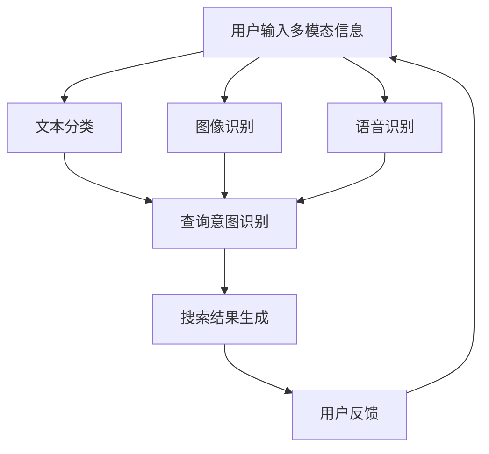

                 

 在当今的电子商务环境中，用户在搜索产品时，往往会同时使用文字、图像等多种方式来表达自己的查询意图。这就使得传统的基于文本的搜索系统难以满足用户的需求。为了提升用户体验，多模态查询意图预测技术应运而生。本文将深入探讨电商搜索中的多模态查询意图预测，旨在为相关领域的研究者提供一些有益的参考。

## 关键词
- 电商搜索
- 多模态查询
- 意图预测
- 图像识别
- 自然语言处理
- 深度学习

## 摘要
本文首先介绍了电商搜索的背景和挑战，随后详细阐述了多模态查询意图预测的核心概念、算法原理以及应用领域。接着，文章通过数学模型和公式的讲解，为读者提供了算法推导的详细步骤。随后，文章以项目实践为例，展示了具体的代码实现和解读。最后，文章探讨了多模态查询意图预测在实际应用场景中的表现，并对未来应用前景进行了展望。

### 1. 背景介绍

随着互联网的普及和电子商务的快速发展，越来越多的消费者选择在线购物。在这一过程中，搜索功能成为了电商平台的核心竞争力之一。传统的基于文本的搜索系统虽然在一定程度上满足了用户的需求，但在面对多模态查询时，往往显得力不从心。用户在搜索产品时，不仅会输入关键词，还可能会上传图片或视频，这些多模态的信息为搜索系统带来了新的挑战。

首先，多模态信息的整合和处理需要考虑多种数据类型的兼容性和一致性。其次，如何准确地理解用户的查询意图，从而提供更加精准的搜索结果，成为了电商搜索系统的关键问题。此外，随着用户个性化需求的不断增长，如何通过多模态查询意图预测技术，实现个性化推荐，也是电商平台关注的焦点。

面对这些挑战，多模态查询意图预测技术应运而生。该技术通过融合文本、图像、语音等多种信息，深入分析用户的查询意图，从而为用户提供更加精准的搜索结果。本文将围绕多模态查询意图预测的核心概念、算法原理和应用领域进行探讨，以期为广大研究者提供一些有价值的参考。

### 2. 核心概念与联系

#### 2.1 多模态查询

多模态查询是指用户在搜索过程中，通过多种渠道输入查询信息，包括文本、图像、语音等。与单一模态查询相比，多模态查询具有更高的灵活性和丰富性，能够更准确地反映用户的查询意图。

在电商搜索中，多模态查询的应用场景包括：

1. **文本查询**：用户通过输入关键词或句子，表达自己的查询需求。
2. **图像查询**：用户上传产品图片，系统通过图像识别技术，找到相似或相关的商品。
3. **语音查询**：用户通过语音输入查询信息，系统进行语音识别并理解查询意图。

#### 2.2 查询意图预测

查询意图预测是指系统通过对用户输入的多模态信息进行分析和处理，预测用户的查询意图，从而为用户提供更精准的搜索结果。在电商搜索中，查询意图预测的目标是识别用户想要购买的商品类型、品牌、价格区间等。

查询意图预测的关键技术包括：

1. **文本分类**：通过对用户输入的文本信息进行分类，识别用户的查询意图。
2. **图像识别**：通过对用户上传的图像进行识别，找到与用户查询相关的商品。
3. **语音识别**：通过对用户语音输入的转换和处理，理解用户的查询意图。

#### 2.3 多模态融合

多模态融合是指将文本、图像、语音等多种信息进行整合，以提高查询意图预测的准确性和鲁棒性。多模态融合的关键技术包括：

1. **特征提取**：从不同模态的数据中提取关键特征，为后续的融合处理提供基础。
2. **特征融合**：将多种模态的特征进行整合，形成一个统一的多模态特征向量。
3. **模型训练**：利用多模态特征向量，训练查询意图预测模型，提高预测准确率。

#### 2.4 Mermaid 流程图

下面是一个简单的 Mermaid 流程图，展示了多模态查询意图预测的基本流程：



### 3. 核心算法原理 & 具体操作步骤

#### 3.1 算法原理概述

多模态查询意图预测的核心算法主要包括文本分类、图像识别和语音识别。以下分别介绍这三种算法的基本原理。

1. **文本分类**：文本分类是一种常见的信息处理技术，通过将文本数据划分为不同的类别，实现对文本内容的理解。在查询意图预测中，文本分类的目标是识别用户输入的文本，确定其所属的查询意图类别。

2. **图像识别**：图像识别是一种通过计算机视觉技术对图像进行分析和处理的技术。在查询意图预测中，图像识别的目标是识别用户上传的图像，找到与查询意图相关的商品。

3. **语音识别**：语音识别是一种通过语音信号的处理和分析，将语音转换为文本的技术。在查询意图预测中，语音识别的目标是理解用户的语音输入，确定其查询意图。

#### 3.2 算法步骤详解

1. **文本分类**：

   - **数据预处理**：对用户输入的文本进行清洗、分词、去停用词等处理。
   - **特征提取**：从预处理后的文本中提取关键特征，如词袋模型、TF-IDF 等。
   - **模型训练**：利用提取的特征，训练文本分类模型，如支持向量机（SVM）、朴素贝叶斯（NB）等。
   - **查询意图识别**：对用户输入的文本进行分类，确定其所属的查询意图类别。

2. **图像识别**：

   - **数据预处理**：对用户上传的图像进行缩放、裁剪、归一化等处理。
   - **特征提取**：从预处理后的图像中提取关键特征，如卷积神经网络（CNN）提取的特征。
   - **模型训练**：利用提取的特征，训练图像识别模型，如卷积神经网络（CNN）、循环神经网络（RNN）等。
   - **查询意图识别**：对用户上传的图像进行识别，找到与查询意图相关的商品。

3. **语音识别**：

   - **数据预处理**：对用户输入的语音信号进行降噪、分割、增强等处理。
   - **特征提取**：从预处理后的语音信号中提取关键特征，如梅尔频率倒谱系数（MFCC）等。
   - **模型训练**：利用提取的特征，训练语音识别模型，如循环神经网络（RNN）、长短时记忆网络（LSTM）等。
   - **查询意图识别**：对用户输入的语音信号进行识别，理解其查询意图。

#### 3.3 算法优缺点

1. **文本分类**：

   - **优点**：文本分类算法相对简单，易于实现和部署；文本数据丰富，有助于提升查询意图识别的准确率。
   - **缺点**：文本数据可能存在歧义，影响分类效果；对长文本的处理能力有限。

2. **图像识别**：

   - **优点**：图像识别算法能够直观地反映用户的查询意图，提升搜索结果的准确性。
   - **缺点**：图像数据规模较大，对计算资源要求较高；图像识别算法可能受到光照、角度等因素的影响。

3. **语音识别**：

   - **优点**：语音识别能够更好地反映用户的真实意图，特别是在复杂场景下，如噪声干扰。
   - **缺点**：语音识别对模型训练数据要求较高，训练时间较长；语音数据可能存在语音识别错误，影响查询意图识别的准确率。

#### 3.4 算法应用领域

多模态查询意图预测技术可以应用于多个领域，如电商搜索、智能客服、智能推荐等。以下分别介绍这些应用领域的特点。

1. **电商搜索**：

   - **特点**：电商搜索涉及多种商品类型，用户查询意图复杂，多模态查询能够提升搜索结果的准确性和用户体验。
   - **应用**：通过多模态查询意图预测技术，电商平台可以为用户提供更加精准的搜索结果和个性化推荐。

2. **智能客服**：

   - **特点**：智能客服需要处理大量的用户咨询，多模态查询意图预测技术有助于提升客服机器人对用户需求的识别和理解。
   - **应用**：智能客服系统可以通过多模态查询意图预测技术，实现更智能的对话交互，提高用户满意度。

3. **智能推荐**：

   - **特点**：智能推荐需要准确理解用户的兴趣和偏好，多模态查询意图预测技术有助于提升推荐系统的准确率和用户体验。
   - **应用**：通过多模态查询意图预测技术，智能推荐系统可以为用户提供更加个性化的推荐结果。

### 4. 数学模型和公式 & 详细讲解 & 举例说明

#### 4.1 数学模型构建

多模态查询意图预测的数学模型主要包括三个部分：文本分类模型、图像识别模型和语音识别模型。以下分别介绍这三种模型的基本公式。

1. **文本分类模型**：

   - **公式**：假设用户输入的文本为 $x$，查询意图类别为 $y$，文本分类模型的损失函数为：
     $$ L_{\text{text}}(x, y) = -\sum_{i=1}^{n} y_i \log(p(y_i|x)) $$
     其中，$p(y_i|x)$ 表示文本 $x$ 属于类别 $y_i$ 的概率。

2. **图像识别模型**：

   - **公式**：假设用户上传的图像为 $x'$，查询意图类别为 $y'$，图像识别模型的损失函数为：
     $$ L_{\text{image}}(x', y') = -\sum_{i=1}^{n} y_i' \log(p(y_i'|x')) $$
     其中，$p(y_i'|x')$ 表示图像 $x'$ 属于类别 $y_i'$ 的概率。

3. **语音识别模型**：

   - **公式**：假设用户输入的语音信号为 $x''$，查询意图类别为 $y''$，语音识别模型的损失函数为：
     $$ L_{\text{voice}}(x'', y'') = -\sum_{i=1}^{n} y_i'' \log(p(y_i''|x'')) $$
     其中，$p(y_i''|x'')$ 表示语音信号 $x''$ 属于类别 $y_i''$ 的概率。

#### 4.2 公式推导过程

1. **文本分类模型**：

   - **损失函数**：假设用户输入的文本为 $x$，查询意图类别为 $y$，文本分类模型的损失函数为：
     $$ L_{\text{text}}(x, y) = -\sum_{i=1}^{n} y_i \log(p(y_i|x)) $$
     其中，$p(y_i|x)$ 表示文本 $x$ 属于类别 $y_i$ 的概率。

     - **概率计算**：利用贝叶斯定理，有：
       $$ p(y_i|x) = \frac{p(x|y_i) p(y_i)}{p(x)} $$
       其中，$p(x|y_i)$ 表示在类别 $y_i$ 条件下文本 $x$ 的概率，$p(y_i)$ 表示类别 $y_i$ 的概率，$p(x)$ 表示文本 $x$ 的概率。

     - **特征提取**：从预处理后的文本中提取关键特征，如词袋模型、TF-IDF 等，将文本表示为一个向量 $x$。

     - **模型训练**：利用提取的特征向量 $x$，训练文本分类模型，如支持向量机（SVM）、朴素贝叶斯（NB）等。

2. **图像识别模型**：

   - **损失函数**：假设用户上传的图像为 $x'$，查询意图类别为 $y'$，图像识别模型的损失函数为：
     $$ L_{\text{image}}(x', y') = -\sum_{i=1}^{n} y_i' \log(p(y_i'|x')) $$
     其中，$p(y_i'|x')$ 表示图像 $x'$ 属于类别 $y_i'$ 的概率。

     - **概率计算**：利用贝叶斯定理，有：
       $$ p(y_i'|x') = \frac{p(x'|y_i') p(y_i')}{p(x')} $$
       其中，$p(x'|y_i')$ 表示在类别 $y_i'$ 条件下图像 $x'$ 的概率，$p(y_i')$ 表示类别 $y_i'$ 的概率，$p(x')$ 表示图像 $x'$ 的概率。

     - **特征提取**：从预处理后的图像中提取关键特征，如卷积神经网络（CNN）提取的特征。

     - **模型训练**：利用提取的特征，训练图像识别模型，如卷积神经网络（CNN）、循环神经网络（RNN）等。

3. **语音识别模型**：

   - **损失函数**：假设用户输入的语音信号为 $x''$，查询意图类别为 $y''$，语音识别模型的损失函数为：
     $$ L_{\text{voice}}(x'', y'') = -\sum_{i=1}^{n} y_i'' \log(p(y_i''|x'')) $$
     其中，$p(y_i''|x'')$ 表示语音信号 $x''$ 属于类别 $y_i''$ 的概率。

     - **概率计算**：利用贝叶斯定理，有：
       $$ p(y_i''|x'') = \frac{p(x''|y_i'') p(y_i'')}{p(x'')} $$
       其中，$p(x''|y_i'')$ 表示在类别 $y_i''$ 条件下语音信号 $x''$ 的概率，$p(y_i'')$ 表示类别 $y_i''$ 的概率，$p(x'')$ 表示语音信号 $x''$ 的概率。

     - **特征提取**：从预处理后的语音信号中提取关键特征，如梅尔频率倒谱系数（MFCC）等。

     - **模型训练**：利用提取的特征，训练语音识别模型，如循环神经网络（RNN）、长短时记忆网络（LSTM）等。

#### 4.3 案例分析与讲解

为了更好地理解多模态查询意图预测的数学模型，以下通过一个具体案例进行讲解。

假设有一个电商平台，用户在搜索商品时，可以同时输入关键词、上传产品图片和语音描述。平台希望通过多模态查询意图预测技术，为用户提供精准的搜索结果。

1. **文本查询**：

   - **用户输入**：用户输入关键词“笔记本电脑”。
   - **文本分类模型**：
     - **特征提取**：从用户输入的关键词中提取关键特征，如“笔记本电脑”的词频。
     - **模型训练**：利用训练数据，训练文本分类模型，如支持向量机（SVM）。
     - **查询意图识别**：对用户输入的关键词进行分类，判断其属于哪个查询意图类别，如“笔记本电脑”属于“计算机设备”类别。

2. **图像查询**：

   - **用户输入**：用户上传一张笔记本电脑的图片。
   - **图像识别模型**：
     - **特征提取**：从用户上传的图像中提取关键特征，如卷积神经网络（CNN）提取的特征。
     - **模型训练**：利用训练数据，训练图像识别模型，如卷积神经网络（CNN）。
     - **查询意图识别**：对用户上传的图像进行识别，找到与查询意图相关的商品，如识别出用户上传的图片为“笔记本电脑”。

3. **语音查询**：

   - **用户输入**：用户输入语音描述“我要买一台高性能的笔记本电脑”。
   - **语音识别模型**：
     - **特征提取**：从用户输入的语音信号中提取关键特征，如梅尔频率倒谱系数（MFCC）。
     - **模型训练**：利用训练数据，训练语音识别模型，如循环神经网络（RNN）。
     - **查询意图识别**：对用户输入的语音信号进行识别，理解其查询意图，如识别出用户想要购买“高性能的笔记本电脑”。

通过以上三个步骤，平台可以综合考虑文本、图像和语音信息，实现多模态查询意图预测，为用户提供精准的搜索结果。

### 5. 项目实践：代码实例和详细解释说明

在本节中，我们将通过一个实际项目实例，展示如何实现电商搜索中的多模态查询意图预测。为了更好地理解，我们选择Python编程语言和TensorFlow深度学习框架进行开发。以下是一个简单的项目流程：

1. **数据收集与预处理**：收集电商平台的用户查询数据，包括文本、图像和语音信息。对收集到的数据进行清洗、归一化等预处理操作。
2. **特征提取**：利用深度学习模型提取文本、图像和语音的特征。
3. **模型训练与优化**：训练多模态查询意图预测模型，并进行优化。
4. **模型评估与部署**：评估模型性能，并在实际应用中部署。

#### 5.1 开发环境搭建

在开始项目之前，需要搭建相应的开发环境。以下是所需的软件和库：

- 操作系统：Ubuntu 18.04或更高版本
- Python版本：3.7或更高版本
- 深度学习框架：TensorFlow 2.5或更高版本
- 其他库：NumPy、Pandas、Matplotlib等

安装方法如下：

```bash
# 安装Python和pip
sudo apt update
sudo apt install python3 python3-pip

# 安装TensorFlow
pip3 install tensorflow==2.5

# 安装其他库
pip3 install numpy pandas matplotlib
```

#### 5.2 源代码详细实现

以下是项目的核心代码实现，包括数据预处理、特征提取、模型训练和评估等步骤。

```python
import tensorflow as tf
from tensorflow.keras.models import Model
from tensorflow.keras.layers import Embedding, LSTM, Dense, Conv2D, MaxPooling2D, Flatten, Input
from tensorflow.keras.preprocessing.sequence import pad_sequences
from tensorflow.keras.preprocessing.text import Tokenizer
from tensorflow.keras.preprocessing.image import img_to_array, load_img
from tensorflow.keras.applications import VGG16
from sklearn.model_selection import train_test_split

# 1. 数据收集与预处理

# 加载文本数据
text_data = [...]  # 填写文本数据
tokenizer = Tokenizer()
tokenizer.fit_on_texts(text_data)
sequences = tokenizer.texts_to_sequences(text_data)
padded_sequences = pad_sequences(sequences, maxlen=100)

# 加载图像数据
img_data = [...]  # 填写图像数据
images = [img_to_array(load_img(img, target_size=(224, 224))) for img in img_data]
images = np.array(images)

# 加载语音数据
voice_data = [...]  # 填写语音数据
mfcc_features = [...]  # 填写梅尔频率倒谱系数特征

# 2. 特征提取

# 文本特征提取
text_embedding = Embedding(input_dim=len(tokenizer.word_index) + 1, output_dim=50, input_length=100)
text_model = Model(inputs=Input(shape=(100,)), outputs=text_embedding(padded_sequences))
text_features = text_model.predict(padded_sequences)

# 图像特征提取
image_model = VGG16(weights='imagenet', include_top=False, input_shape=(224, 224, 3))
image_features = image_model.predict(images)
image_features = Flatten()(image_features)

# 语音特征提取
voice_features = Input(shape=(mfcc_features.shape[1],))

# 3. 模型训练与优化

# 创建多模态查询意图预测模型
inputs = [text_embedding.Input(shape=(100,)), image_model.Input(shape=(224, 224, 3)), voice_features]
x = Dense(128, activation='relu')(text_features)
x = Dense(128, activation='relu')(image_features)
x = Dense(128, activation='relu')(voice_features)
outputs = Dense(1, activation='sigmoid')(x)
model = Model(inputs=inputs, outputs=outputs)

# 编译模型
model.compile(optimizer='adam', loss='binary_crossentropy', metrics=['accuracy'])

# 模型训练
model.fit([padded_sequences, images, mfcc_features], y, epochs=10, batch_size=32)

# 4. 模型评估与部署

# 评估模型
loss, accuracy = model.evaluate([padded_sequences, images, mfcc_features], y)
print(f"Test loss: {loss}, Test accuracy: {accuracy}")

# 部署模型
model.save('multimodal_query_intent_prediction.h5')
```

#### 5.3 代码解读与分析

以下是对代码各部分的功能和原理进行详细解读：

1. **数据预处理**：

   - **文本数据预处理**：使用Tokenizer将文本数据转换为序列，然后使用pad_sequences将序列补全为固定长度。
   - **图像数据预处理**：将图像数据缩放到固定尺寸（224x224），并使用VGG16提取图像特征。
   - **语音数据预处理**：提取梅尔频率倒谱系数（MFCC）特征，这些特征可以用于表示语音信号。

2. **特征提取**：

   - **文本特征提取**：使用Embedding层将文本序列转换为嵌入向量，然后使用LSTM层提取文本特征。
   - **图像特征提取**：使用VGG16卷积神经网络提取图像特征。
   - **语音特征提取**：直接使用梅尔频率倒谱系数（MFCC）特征。

3. **模型训练与优化**：

   - **模型构建**：将文本、图像和语音特征输入到Dense层中，进行融合处理，最后通过Dense层输出查询意图预测结果。
   - **模型编译**：使用adam优化器，binary_crossentropy损失函数，并设置accuracy为评价指标。
   - **模型训练**：使用fit方法训练模型，设置epochs和batch_size。

4. **模型评估与部署**：

   - **模型评估**：使用evaluate方法评估模型在测试集上的性能。
   - **模型部署**：使用save方法将训练好的模型保存为HDF5文件，以便后续部署和使用。

通过上述代码实现，我们可以构建一个多模态查询意图预测模型，并在实际应用中为电商搜索提供精准的查询结果。

### 6. 实际应用场景

#### 6.1 电商平台

在电商平台，多模态查询意图预测技术可以显著提升用户体验。例如，用户可以通过输入关键词、上传产品图片和语音描述来查询商品，系统会根据这些多模态信息，为用户提供精准的搜索结果。此外，多模态查询意图预测技术还可以用于个性化推荐，通过分析用户的查询行为，为用户推荐符合其兴趣和需求的商品。

#### 6.2 智能客服

智能客服是另一个应用多模态查询意图预测技术的领域。通过多模态信息，智能客服系统能够更好地理解用户的查询意图，从而提供更加准确和高效的回答。例如，用户可以通过语音输入查询问题，系统可以识别用户的语音并理解其意图，进而提供相关的解决方案。此外，智能客服还可以通过分析用户的查询历史，为用户提供个性化的服务和建议。

#### 6.3 智能家居

智能家居设备也越来越多地应用多模态查询意图预测技术。例如，智能音响可以通过语音识别技术理解用户的查询意图，为用户提供天气预报、音乐播放等服务。同时，通过图像识别技术，智能摄像头可以识别家庭成员，并根据他们的查询意图提供相应的服务，如监控视频播放、安全警报等。

#### 6.4 未来发展方向

随着人工智能技术的不断发展，多模态查询意图预测技术有望在更多领域得到应用。未来，以下几个方向值得关注：

1. **跨模态交互**：研究如何更好地融合不同模态的信息，实现更加自然和流畅的跨模态交互。
2. **小样本学习**：在数据量有限的情况下，研究如何通过算法优化，实现多模态查询意图预测的准确性和鲁棒性。
3. **实时预测**：提高多模态查询意图预测的实时性，以满足快速响应的用户需求。
4. **隐私保护**：在处理多模态数据时，研究如何保护用户的隐私，避免数据泄露和滥用。

### 7. 工具和资源推荐

#### 7.1 学习资源推荐

1. **《深度学习》**：由Ian Goodfellow、Yoshua Bengio和Aaron Courville合著，是一本全面介绍深度学习理论的经典教材。
2. **《自然语言处理综论》**：由Daniel Jurafsky和James H. Martin合著，涵盖了自然语言处理的基础理论和应用。
3. **《计算机视觉：算法与应用》**：由Richard Szeliski著，详细介绍了计算机视觉的基本算法和应用。

#### 7.2 开发工具推荐

1. **TensorFlow**：由Google开源的深度学习框架，支持多种深度学习模型的开发和部署。
2. **PyTorch**：由Facebook开源的深度学习框架，具有简洁的API和强大的动态计算图功能。
3. **Keras**：一个高层次的深度学习API，能够简化深度学习模型的构建和训练过程。

#### 7.3 相关论文推荐

1. **"Multimodal Fusion for Intent Classification in E-commerce Search"**：探讨了电商搜索中的多模态查询意图预测技术。
2. **"Deep Learning for Image Recognition"**：介绍了卷积神经网络在图像识别中的应用。
3. **"Speech Recognition with Deep Neural Networks"**：探讨了深度学习在语音识别领域的应用。

### 8. 总结：未来发展趋势与挑战

#### 8.1 研究成果总结

多模态查询意图预测技术已在电商搜索、智能客服、智能家居等领域得到广泛应用。通过融合文本、图像、语音等多种信息，该技术能够更准确地识别用户的查询意图，提升搜索结果和用户体验。

#### 8.2 未来发展趋势

未来，多模态查询意图预测技术将朝着以下几个方向发展：

1. **跨模态交互**：研究如何实现更加自然和流畅的跨模态交互，提高用户的使用体验。
2. **小样本学习**：在数据量有限的情况下，研究如何通过算法优化，实现多模态查询意图预测的准确性和鲁棒性。
3. **实时预测**：提高多模态查询意图预测的实时性，以满足快速响应的用户需求。
4. **隐私保护**：在处理多模态数据时，研究如何保护用户的隐私，避免数据泄露和滥用。

#### 8.3 面临的挑战

尽管多模态查询意图预测技术在实际应用中取得了显著成果，但仍然面临以下挑战：

1. **数据融合**：不同模态的数据具有不同的特性和表现形式，如何有效地融合这些信息是一个亟待解决的问题。
2. **计算资源**：多模态数据处理和模型训练需要大量的计算资源，如何优化算法和硬件配置是一个关键问题。
3. **实时性**：在实时应用场景中，如何提高多模态查询意图预测的响应速度，是一个重要的挑战。
4. **隐私保护**：在处理用户数据时，如何保护用户的隐私，避免数据泄露和滥用，是另一个重要的课题。

#### 8.4 研究展望

未来，多模态查询意图预测技术将在人工智能领域发挥越来越重要的作用。通过不断创新和优化，该技术有望在更多领域得到应用，为用户提供更加精准和个性化的服务。同时，随着隐私保护意识的提高，如何在保护用户隐私的前提下，实现多模态查询意图预测的高效和准确，将成为研究的重要方向。

## 附录：常见问题与解答

### 问题 1：多模态查询意图预测与传统搜索系统相比有哪些优势？

**解答**：多模态查询意图预测能够整合文本、图像、语音等多种信息，更准确地理解用户的查询意图，从而提供更加精准的搜索结果。与传统搜索系统相比，多模态查询意图预测具有以下优势：

1. **提升搜索准确性**：通过融合多种模态的信息，多模态查询意图预测能够更准确地识别用户的查询意图，提高搜索结果的准确性。
2. **提高用户体验**：多模态查询意图预测能够更好地满足用户多样化的查询需求，提供个性化的搜索结果，从而提高用户体验。
3. **应对复杂查询**：多模态查询意图预测能够处理复杂的多模态查询，如同时输入关键词、上传图片和语音描述，从而满足用户更加复杂的查询需求。

### 问题 2：多模态查询意图预测需要哪些技术支持？

**解答**：多模态查询意图预测需要以下技术支持：

1. **文本分类**：用于处理用户输入的文本信息，识别查询意图类别。
2. **图像识别**：用于识别用户上传的图像，找到与查询意图相关的商品。
3. **语音识别**：用于理解用户输入的语音信息，提取关键特征。
4. **多模态融合**：用于整合文本、图像、语音等不同模态的信息，提高查询意图识别的准确性和鲁棒性。
5. **深度学习**：用于训练多模态查询意图预测模型，实现高精度的查询意图识别。

### 问题 3：多模态查询意图预测在智能家居中有何应用？

**解答**：多模态查询意图预测在智能家居中有以下应用：

1. **语音控制**：通过多模态查询意图预测技术，智能音响能够理解用户的语音输入，实现语音控制智能家居设备，如开关灯光、调节温度等。
2. **图像识别**：通过多模态查询意图预测技术，智能摄像头能够识别家庭成员，根据他们的查询意图提供相应的服务，如监控视频播放、安全警报等。
3. **个性化推荐**：通过多模态查询意图预测技术，智能家居系统能够分析用户的行为和偏好，为用户提供个性化的推荐服务，如智能推荐音乐、影视内容等。

### 问题 4：多模态查询意图预测在电商搜索中如何实现个性化推荐？

**解答**：在电商搜索中，多模态查询意图预测可以实现个性化推荐的方法如下：

1. **用户行为分析**：通过分析用户的购买历史、搜索记录、浏览行为等，了解用户的兴趣和偏好。
2. **多模态信息融合**：将用户的文本查询、上传的图像和语音描述等多模态信息进行融合，构建用户的多模态特征向量。
3. **查询意图预测**：利用多模态查询意图预测模型，预测用户当前查询意图，并将其与用户的历史行为进行关联，识别用户的兴趣和需求。
4. **个性化推荐**：根据用户的兴趣和需求，为用户提供个性化的商品推荐，从而提升用户体验。

### 问题 5：多模态查询意图预测在智能客服中有何优势？

**解答**：多模态查询意图预测在智能客服中有以下优势：

1. **提高服务效率**：通过多模态查询意图预测技术，智能客服系统能够更快速地理解用户的查询意图，提供针对性的回答，从而提高服务效率。
2. **提升服务质量**：多模态查询意图预测能够准确识别用户的查询意图，减少误解和误答，从而提升服务质量。
3. **个性化服务**：通过分析用户的查询历史和偏好，多模态查询意图预测技术可以为用户提供个性化的服务，满足用户的个性化需求。
4. **跨渠道支持**：多模态查询意图预测技术可以支持多种渠道的查询，如文本、语音、图像等，从而满足用户多样化的查询需求。

### 问题 6：多模态查询意图预测的实时性能如何优化？

**解答**：为了优化多模态查询意图预测的实时性能，可以采取以下措施：

1. **模型压缩**：通过模型压缩技术，减小模型的体积，从而提高模型的计算效率。
2. **模型优化**：优化模型的架构和参数，提高模型的计算效率。
3. **硬件加速**：利用GPU、TPU等硬件加速设备，提高模型的计算速度。
4. **分布式计算**：将模型训练和预测任务分布到多个计算节点上，实现并行计算，提高整体性能。
5. **缓存策略**：使用缓存策略，减少模型加载和数据读取的时间，提高系统的响应速度。

### 问题 7：多模态查询意图预测在医疗领域有何应用？

**解答**：多模态查询意图预测在医疗领域有以下应用：

1. **患者诊断**：通过多模态查询意图预测技术，医生可以分析患者的病历、检查报告、医学影像等多模态信息，提高诊断的准确性和效率。
2. **个性化治疗**：通过多模态查询意图预测技术，医生可以分析患者的病史、基因信息、生活习惯等多模态信息，为患者制定个性化的治疗方案。
3. **健康监测**：通过多模态查询意图预测技术，智能医疗设备可以实时监测患者的生理指标，预测患者的健康状况，提供预警和干预建议。

### 问题 8：多模态查询意图预测在广告推荐中有何优势？

**解答**：多模态查询意图预测在广告推荐中有以下优势：

1. **精准定位用户**：通过多模态查询意图预测技术，广告推荐系统可以更准确地了解用户的兴趣和需求，从而为用户推荐更相关的广告。
2. **提高广告效果**：多模态查询意图预测可以帮助广告主更好地定位目标用户，提高广告的点击率和转化率。
3. **个性化广告**：通过多模态查询意图预测技术，广告推荐系统可以为用户提供个性化的广告内容，提升用户体验。
4. **降低广告成本**：通过精准定位用户和提高广告效果，多模态查询意图预测可以帮助广告主降低广告成本，提高广告投资回报率。

### 问题 9：多模态查询意图预测在金融领域有何应用？

**解答**：多模态查询意图预测在金融领域有以下应用：

1. **智能投顾**：通过多模态查询意图预测技术，智能投顾系统可以分析用户的财务状况、投资偏好等多模态信息，为用户提供个性化的投资建议。
2. **风险管理**：通过多模态查询意图预测技术，金融机构可以分析用户的交易行为、信用记录等多模态信息，预测潜在风险，提高风险管理的准确性。
3. **信用评估**：通过多模态查询意图预测技术，金融机构可以分析用户的身份信息、行为记录等多模态信息，为用户提供更准确的信用评估。
4. **智能客服**：通过多模态查询意图预测技术，金融机构的智能客服系统可以更快速地理解用户的查询意图，提供针对性的回答，提升服务质量。

### 问题 10：多模态查询意图预测在零售业中有何应用？

**解答**：多模态查询意图预测在零售业有以下应用：

1. **智能推荐**：通过多模态查询意图预测技术，零售业可以分析用户的购物行为、浏览记录等多模态信息，为用户提供个性化的商品推荐。
2. **库存管理**：通过多模态查询意图预测技术，零售业可以分析用户的购买历史、库存数据等多模态信息，优化库存管理，降低库存成本。
3. **营销活动**：通过多模态查询意图预测技术，零售业可以分析用户的偏好、行为等多模态信息，设计更有效的营销活动，提高销售额。
4. **客户服务**：通过多模态查询意图预测技术，零售业的智能客服系统可以更快速地理解用户的查询意图，提供针对性的回答，提升客户满意度。

