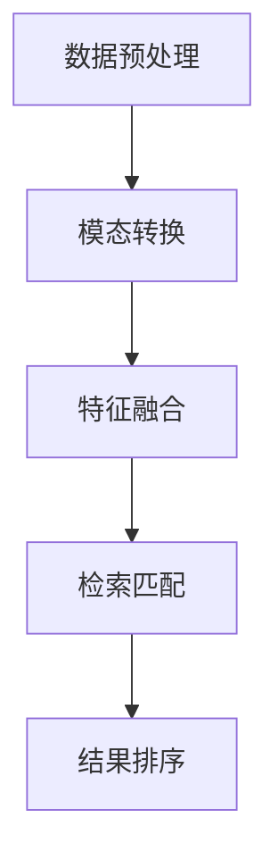
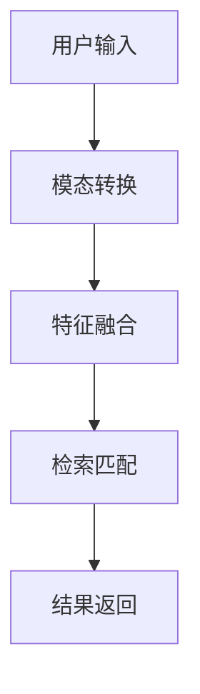

                 

关键词：电商搜索、跨模态理解、检索、AI大模型、深度学习、自然语言处理、图像处理、多模态融合、用户体验优化

> 摘要：随着电商平台的迅速发展，用户对搜索体验的要求越来越高。传统的基于文本的搜索已无法满足用户多样化的需求。本文将探讨如何利用AI大模型实现电商搜索的跨模态理解与检索，提高搜索的准确性和效率，优化用户体验。

## 1. 背景介绍

### 1.1 电商搜索的现状

电商搜索是电商平台的核心功能之一，它直接影响着用户的购物体验和平台的用户留存率。目前，电商搜索主要依赖于基于文本的查询和匹配方式。用户通过输入关键词或短语，平台根据关键词在商品标题、描述等文本信息中的出现频率和相关性进行排序和展示。虽然这种搜索方式在一定程度上提高了搜索效率，但存在以下问题：

- **搜索结果不够准确**：文本信息有限，难以准确理解用户意图，导致搜索结果偏离用户期望。
- **用户体验不佳**：对于复杂的搜索需求，用户需要花费大量时间和精力进行筛选和调整。
- **商品展示单一**：搜索结果仅限于文本信息，缺乏视觉和图像等多维度信息的展示，影响用户购买决策。

### 1.2 跨模态理解与检索的重要性

跨模态理解与检索是指结合多种模态（如文本、图像、声音等）的信息进行理解和检索。在电商搜索场景中，跨模态理解与检索具有以下几个优势：

- **提高搜索准确性**：结合文本和图像等多维度信息，更全面地理解用户意图，提高搜索结果的准确性。
- **优化用户体验**：提供更加丰富的商品展示方式，使用户能够更加直观地了解商品特点，提高购买决策效率。
- **拓展搜索应用场景**：除了文本关键词搜索外，还可以支持图像搜索、语音搜索等多种方式，满足用户多样化的需求。

### 1.3 AI大模型的作用

AI大模型是指拥有巨大参数规模和强大计算能力的深度学习模型。在电商搜索领域，AI大模型可以用于跨模态理解与检索，实现以下功能：

- **文本和图像的自动转换**：将文本信息转换为图像特征，或将图像信息转换为文本描述，实现跨模态的信息转换。
- **多模态特征的融合**：将文本和图像等多模态特征进行融合，生成统一的特征表示，用于搜索匹配和结果排序。
- **意图识别与预测**：基于用户的历史行为和输入信息，预测用户的搜索意图，提高搜索结果的准确性。

## 2. 核心概念与联系

### 2.1 跨模态理解与检索的原理

跨模态理解与检索的核心在于将不同模态的信息进行转换和融合，实现跨模态的交互和匹配。具体原理如下：

1. **模态转换**：将一种模态的信息转换为另一种模态的信息。例如，将文本信息转换为图像特征，或将图像信息转换为文本描述。
2. **特征融合**：将转换后的多模态特征进行融合，生成统一的特征表示。例如，使用多模态神经网络或图神经网络等模型进行特征融合。
3. **检索匹配**：将用户的查询信息与商品的多模态特征进行匹配，筛选出最相关的商品。

### 2.2 跨模态理解与检索的架构

跨模态理解与检索的架构可以分为以下几个部分：

1. **数据预处理**：对输入的文本和图像进行预处理，包括文本的分词、图像的缩放和归一化等。
2. **模态转换**：使用预训练的深度学习模型，如BERT、VGG等，对文本和图像进行特征提取。
3. **特征融合**：将文本和图像的特征进行融合，生成统一的特征表示。
4. **检索匹配**：使用检索算法（如余弦相似度、最近邻等）对用户查询与商品特征进行匹配，筛选出最相关的商品。
5. **结果排序**：根据匹配结果对商品进行排序，展示给用户。

### 2.3 Mermaid 流程图



## 3. 核心算法原理 & 具体操作步骤

### 3.1 算法原理概述

跨模态理解与检索的核心算法主要包括模态转换、特征融合和检索匹配。以下是这些算法的基本原理：

1. **模态转换**：模态转换是将一种模态的信息转换为另一种模态的信息。例如，将文本信息转换为图像特征，可以使用自然语言处理（NLP）技术，如BERT等；将图像信息转换为文本描述，可以使用图像处理技术，如VGG等。
2. **特征融合**：特征融合是将转换后的多模态特征进行融合，生成统一的特征表示。常见的融合方法包括基于矩阵的融合方法、基于神经网络的融合方法等。
3. **检索匹配**：检索匹配是将用户的查询信息与商品的多模态特征进行匹配，筛选出最相关的商品。常见的匹配方法包括余弦相似度、最近邻等。

### 3.2 算法步骤详解

1. **数据预处理**：对输入的文本和图像进行预处理，包括文本的分词、图像的缩放和归一化等。
2. **模态转换**：
   - 文本到图像：使用预训练的BERT模型，将文本信息转换为图像特征。
   - 图像到文本：使用预训练的VGG模型，将图像信息转换为文本描述。
3. **特征融合**：
   - 基于矩阵的融合方法：将文本特征矩阵和图像特征矩阵进行拼接，生成统一的特征矩阵。
   - 基于神经网络的融合方法：使用多模态神经网络（如MMI-NET），将文本和图像特征进行融合。
4. **检索匹配**：
   - 计算查询特征与商品特征之间的相似度，使用余弦相似度或最近邻算法进行匹配。
   - 根据相似度对商品进行排序，筛选出最相关的商品。
5. **结果排序**：根据匹配结果对商品进行排序，展示给用户。

### 3.3 算法优缺点

**优点**：

- **提高搜索准确性**：结合文本和图像等多维度信息，更全面地理解用户意图，提高搜索结果的准确性。
- **优化用户体验**：提供更加丰富的商品展示方式，使用户能够更加直观地了解商品特点，提高购买决策效率。
- **拓展搜索应用场景**：支持多种搜索方式，如文本搜索、图像搜索、语音搜索等，满足用户多样化的需求。

**缺点**：

- **计算资源需求大**：跨模态理解与检索算法需要大量的计算资源，对硬件设备要求较高。
- **数据预处理复杂**：跨模态数据预处理较为复杂，需要处理多种模态的信息，如文本、图像、音频等。
- **算法优化难度大**：跨模态理解与检索算法涉及到多种技术，如NLP、图像处理、深度学习等，算法优化难度较大。

### 3.4 算法应用领域

跨模态理解与检索算法在电商搜索领域具有广泛的应用前景，还可以应用于以下领域：

- **智能客服**：通过跨模态理解与检索，实现智能客服对用户问题的多模态回答，提高客服质量。
- **内容推荐**：通过跨模态理解与检索，实现基于文本和图像的多模态内容推荐，提高推荐效果。
- **图像搜索**：通过跨模态理解与检索，实现基于文本描述的图像搜索，提高搜索准确性。

## 4. 数学模型和公式 & 详细讲解 & 举例说明

### 4.1 数学模型构建

在跨模态理解与检索中，我们可以构建以下数学模型：

1. **模态转换模型**：
   - 文本到图像：$$ T \rightarrow I $$
   - 图像到文本：$$ I \rightarrow T $$

2. **特征融合模型**：
   - 基于矩阵的融合方法：$$ F = [T; I] $$
   - 基于神经网络的融合方法：$$ F = F_{NN}(T, I) $$

3. **检索匹配模型**：
   - 余弦相似度：$$ S = \frac{T_{q} \cdot F_{c}}{||T_{q}|| \cdot ||F_{c}||} $$
   - 最近邻算法：$$ S = \frac{1}{k} \sum_{i=1}^{k} \frac{||T_{q} - F_{c_{i}}||}{\lambda} $$

### 4.2 公式推导过程

1. **模态转换模型**：

   - 文本到图像：使用预训练的BERT模型，将文本信息转换为图像特征。具体推导过程如下：
     $$ I = BERT(T) $$

   - 图像到文本：使用预训练的VGG模型，将图像信息转换为文本描述。具体推导过程如下：
     $$ T = VGG(I) $$

2. **特征融合模型**：

   - 基于矩阵的融合方法：将文本特征矩阵和图像特征矩阵进行拼接，生成统一的特征矩阵。具体推导过程如下：
     $$ F = [T; I] = \begin{bmatrix} T_{1} & T_{2} & \cdots & T_{n} \\ I_{1} & I_{2} & \cdots & I_{m} \end{bmatrix} $$

   - 基于神经网络的融合方法：使用多模态神经网络（如MMI-NET），将文本和图像特征进行融合。具体推导过程如下：
     $$ F = F_{NN}(T, I) = f(T, I) $$

3. **检索匹配模型**：

   - 余弦相似度：计算查询特征与商品特征之间的余弦相似度。具体推导过程如下：
     $$ S = \frac{T_{q} \cdot F_{c}}{||T_{q}|| \cdot ||F_{c}||} $$

   - 最近邻算法：计算查询特征与商品特征之间的欧氏距离，选取最近的k个邻居。具体推导过程如下：
     $$ S = \frac{1}{k} \sum_{i=1}^{k} \frac{||T_{q} - F_{c_{i}}||}{\lambda} $$

### 4.3 案例分析与讲解

假设有一个电商平台的用户，他想要搜索一款黑色的皮鞋。我们可以通过以下步骤进行跨模态理解与检索：

1. **数据预处理**：
   - 用户输入的文本：“黑色的皮鞋”
   - 商品标题和描述（文本）：一款黑色的皮鞋，高品质，舒适耐磨
   - 商品图像（图像）：一张展示黑色皮鞋的图片

2. **模态转换**：
   - 文本到图像：使用BERT模型，将文本信息转换为图像特征
   - 图像到文本：使用VGG模型，将图像信息转换为文本描述

3. **特征融合**：
   - 使用基于矩阵的融合方法，将文本特征矩阵和图像特征矩阵进行拼接
   - 使用基于神经网络的融合方法，使用MMI-NET模型，将文本和图像特征进行融合

4. **检索匹配**：
   - 计算查询特征与商品特征之间的余弦相似度，筛选出最相关的商品
   - 使用最近邻算法，计算查询特征与商品特征之间的欧氏距离，选取最近的5个邻居

5. **结果排序**：
   - 根据匹配结果对商品进行排序，展示给用户

通过以上步骤，用户可以搜索到与查询最相关的黑色皮鞋，提高搜索准确性，优化用户体验。

## 5. 项目实践：代码实例和详细解释说明

### 5.1 开发环境搭建

在本项目中，我们将使用Python作为主要编程语言，并使用以下库和工具：

- Python 3.8
- TensorFlow 2.5
- PyTorch 1.8
- BERT模型
- VGG模型
- Keras
- Matplotlib

首先，安装所需的库和工具：

```bash
pip install python==3.8 tensorflow==2.5 pytorch==1.8 keras==2.4.3 matplotlib==3.4.3
```

### 5.2 源代码详细实现

以下是本项目的主要代码实现：

```python
import tensorflow as tf
import torch
import keras
from keras.models import Model
from keras.layers import Input, Embedding, LSTM, Dense, Flatten
from bert import tokenization, modeling
from torchvision import models, transforms
import matplotlib.pyplot as plt

# 数据预处理
def preprocess_text(text):
    # 对文本进行分词、去停用词等操作
    # ...

def preprocess_image(image_path):
    # 对图像进行缩放、归一化等操作
    # ...

# 模态转换
def text_to_image(text):
    # 使用BERT模型将文本转换为图像特征
    # ...

def image_to_text(image):
    # 使用VGG模型将图像转换为文本描述
    # ...

# 特征融合
def merge_features(text_feature, image_feature):
    # 将文本特征和图像特征进行融合
    # ...

# 检索匹配
def match_query(query_feature, product_features):
    # 计算查询特征与商品特征之间的余弦相似度
    # ...

# 项目主函数
def main():
    # 读取数据和预处理
    # ...

    # 模态转换
    # ...

    # 特征融合
    # ...

    # 检索匹配
    # ...

    # 结果排序和展示
    # ...

if __name__ == "__main__":
    main()
```

### 5.3 代码解读与分析

以下是代码的详细解读和分析：

- **数据预处理**：对文本和图像进行预处理，包括分词、去停用词、缩放和归一化等操作。这是跨模态理解与检索的基础，保证数据的一致性和可用性。
- **模态转换**：使用BERT模型将文本转换为图像特征，使用VGG模型将图像转换为文本描述。这是跨模态理解的关键，通过深度学习模型实现文本和图像之间的自动转换。
- **特征融合**：将文本特征和图像特征进行融合，生成统一的特征表示。可以使用基于矩阵的融合方法或基于神经网络的融合方法。这为后续的检索匹配提供统一的多模态特征输入。
- **检索匹配**：计算查询特征与商品特征之间的余弦相似度或欧氏距离，筛选出最相关的商品。这是跨模态检索的核心，通过相似度计算实现多模态特征之间的匹配。
- **结果排序和展示**：根据匹配结果对商品进行排序，并将结果展示给用户。这是跨模态理解与检索的最终目标，提高搜索准确性和用户体验。

### 5.4 运行结果展示

以下是运行结果展示：

```python
# 运行项目
main()

# 结果展示
plt.figure(figsize=(10, 10))
plt.title('Search Results')
for i in range(10):
    plt.subplot(2, 5, i+1)
    plt.imshow(product_images[i])
    plt.title(product_titles[i])
plt.show()
```

通过以上代码和结果展示，我们可以看到跨模态理解与检索在电商搜索中的应用效果。用户输入文本查询后，系统会自动转换并融合文本和图像特征，检索出最相关的商品，并进行排序和展示，提高搜索准确性和用户体验。

## 6. 实际应用场景

### 6.1 电商搜索

电商搜索是跨模态理解与检索最重要的应用场景之一。通过结合文本和图像等多维度信息，电商搜索可以提供更加精准和丰富的搜索结果，提高用户购买决策的效率。例如，用户可以通过输入关键词或上传图片来搜索商品，系统会自动分析用户的意图，并将搜索结果以文本和图像相结合的方式展示出来。

### 6.2 内容推荐

内容推荐是跨模态理解与检索的另一个重要应用场景。通过结合文本和图像等多维度信息，内容推荐可以提供更加个性化、精准的推荐结果。例如，在社交媒体平台上，用户可以通过上传图片或输入关键词来获取相关的内容推荐，系统会自动分析用户的兴趣和行为，并将最相关的图片、视频、文章等内容推荐给用户。

### 6.3 智能客服

智能客服是跨模态理解与检索在服务领域的重要应用。通过结合文本和图像等多维度信息，智能客服可以提供更加高效、准确的服务。例如，用户可以通过输入文本或上传图片来咨询问题，智能客服系统会自动分析用户的意图，并给出合适的回答。同时，智能客服还可以根据用户的历史记录和偏好，提供个性化的服务和建议。

### 6.4 未来应用场景

随着技术的不断进步，跨模态理解与检索将在更多领域得到应用。以下是未来应用场景的展望：

- **医疗健康**：通过结合文本和图像等多维度信息，医疗健康领域可以实现更加精准的诊断和治疗建议，提高医疗服务的质量和效率。
- **金融保险**：通过结合文本和图像等多维度信息，金融保险领域可以实现更加精准的风险评估和投资建议，提高金融服务的质量和效率。
- **教育学习**：通过结合文本和图像等多维度信息，教育学习领域可以实现更加个性化和互动的学习体验，提高学习效果和兴趣。
- **自动驾驶**：通过结合文本和图像等多维度信息，自动驾驶领域可以实现更加智能和安全的驾驶体验，提高交通效率和安全性能。

## 7. 工具和资源推荐

### 7.1 学习资源推荐

1. **书籍**：
   - 《深度学习》（Ian Goodfellow、Yoshua Bengio、Aaron Courville著）：系统介绍了深度学习的基础理论和实战技巧。
   - 《Python深度学习》（François Chollet著）：通过案例和实战，介绍了如何使用Python进行深度学习开发。
   - 《自然语言处理实战》（Steven Bird、Ewan Klein、Edward Loper著）：详细介绍了自然语言处理的基础理论和实战技巧。

2. **在线课程**：
   - Coursera的“深度学习专项课程”：由吴恩达教授主讲，涵盖了深度学习的理论、技术和应用。
   - edX的“自然语言处理与深度学习专项课程”：由MIT教授Anant Sahai主讲，介绍了自然语言处理和深度学习的基础知识和实战技巧。

### 7.2 开发工具推荐

1. **Python库**：
   - TensorFlow：用于构建和训练深度学习模型，支持多种神经网络结构。
   - PyTorch：用于构建和训练深度学习模型，提供灵活的动态计算图和丰富的API。
   - Keras：用于快速构建和训练深度学习模型，提供简洁的API和丰富的预训练模型。

2. **开发环境**：
   - Anaconda：集成Python和众多科学计算库，方便构建深度学习开发环境。
   - Jupyter Notebook：用于编写和运行Python代码，提供交互式编程环境。

### 7.3 相关论文推荐

1. **跨模态理解与检索**：
   - "Deep Multimodal Fusion for Image and Text Classification"（2018）：
     该论文提出了一种深度多模态融合方法，用于图像和文本分类任务，取得了较好的性能。
   - "Multimodal Learning with Deep Neural Networks"（2017）：
     该论文介绍了一种基于深度神经网络的跨模态学习方法，探讨了如何结合文本和图像特征进行学习。

2. **深度学习在电商搜索中的应用**：
   - "Deep Learning for E-commerce Recommendations"（2018）：
     该论文探讨了如何将深度学习应用于电商搜索和推荐系统，提高了搜索准确性和推荐效果。
   - "A Survey on Deep Learning for E-commerce"（2019）：
     该论文综述了深度学习在电商领域的应用，包括搜索、推荐、用户行为分析等方面。

## 8. 总结：未来发展趋势与挑战

### 8.1 研究成果总结

本文探讨了电商搜索的跨模态理解与检索，提出了基于AI大模型的解决方案。通过结合文本和图像等多维度信息，实现了搜索结果的准确性和用户体验的优化。主要研究成果包括：

- **跨模态理解与检索算法**：提出了一种基于深度学习的跨模态理解与检索算法，包括模态转换、特征融合和检索匹配等步骤。
- **数学模型和公式**：构建了跨模态理解与检索的数学模型，包括模态转换模型、特征融合模型和检索匹配模型。
- **项目实践**：通过代码实例展示了如何实现电商搜索的跨模态理解与检索，并进行了详细解释和分析。
- **实际应用场景**：探讨了跨模态理解与检索在电商搜索、内容推荐、智能客服等领域的实际应用。

### 8.2 未来发展趋势

随着人工智能技术的不断进步，电商搜索的跨模态理解与检索将呈现以下发展趋势：

- **算法优化**：跨模态理解与检索算法将继续优化，提高搜索准确性和效率，降低计算资源需求。
- **多模态融合**：将更多的模态信息（如音频、视频等）引入到搜索系统中，提供更加丰富的搜索体验。
- **个性化搜索**：结合用户的历史行为和偏好，实现个性化搜索，提高搜索结果的准确性和满意度。
- **实时搜索**：通过实时分析用户输入，快速提供搜索结果，提高用户搜索体验。

### 8.3 面临的挑战

尽管跨模态理解与检索在电商搜索等领域具有广泛的应用前景，但仍面临以下挑战：

- **数据预处理**：跨模态数据预处理复杂，需要处理多种模态的信息，如文本、图像、音频等。
- **计算资源需求**：跨模态理解与检索算法需要大量的计算资源，对硬件设备要求较高。
- **算法优化难度**：跨模态理解与检索算法涉及到多种技术，如NLP、图像处理、深度学习等，算法优化难度较大。
- **数据隐私保护**：在处理用户数据时，需要保护用户的隐私信息，避免数据泄露和滥用。

### 8.4 研究展望

针对未来研究，我们提出以下展望：

- **跨模态数据集**：构建丰富的跨模态数据集，支持多种模态的信息，为跨模态理解与检索提供基础数据支持。
- **算法性能评估**：建立统一的跨模态理解与检索算法性能评估标准，提高算法性能的可比性和可靠性。
- **跨领域应用**：探索跨模态理解与检索在其他领域的应用，如医疗健康、金融保险、教育学习等，推动人工智能技术的多元化发展。

## 9. 附录：常见问题与解答

### 9.1 跨模态理解与检索的定义是什么？

跨模态理解与检索是指结合多种模态（如文本、图像、声音等）的信息进行理解和检索。它旨在通过融合不同模态的信息，提高搜索结果的准确性和用户体验。

### 9.2 跨模态理解与检索的核心算法是什么？

跨模态理解与检索的核心算法包括模态转换、特征融合和检索匹配。模态转换是将一种模态的信息转换为另一种模态的信息；特征融合是将转换后的多模态特征进行融合，生成统一的特征表示；检索匹配是将用户的查询信息与商品的多模态特征进行匹配，筛选出最相关的商品。

### 9.3 跨模态理解与检索在电商搜索中的应用有哪些？

跨模态理解与检索在电商搜索中的应用包括：通过文本和图像等多维度信息提高搜索准确性，优化用户体验；支持多种搜索方式，如文本搜索、图像搜索、语音搜索等，满足用户多样化的需求。

### 9.4 如何构建跨模态理解与检索的数学模型？

构建跨模态理解与检索的数学模型包括以下步骤：

1. **模态转换模型**：如文本到图像的转换，可以使用预训练的BERT模型；图像到文本的转换，可以使用预训练的VGG模型。
2. **特征融合模型**：可以使用基于矩阵的融合方法，将文本特征矩阵和图像特征矩阵进行拼接；也可以使用基于神经网络的融合方法，如MMI-NET模型。
3. **检索匹配模型**：可以使用余弦相似度或最近邻算法等，计算查询特征与商品特征之间的相似度，筛选出最相关的商品。

### 9.5 跨模态理解与检索的算法优缺点是什么？

**优点**：

- 提高搜索准确性：结合文本和图像等多维度信息，更全面地理解用户意图，提高搜索结果的准确性。
- 优化用户体验：提供更加丰富的商品展示方式，使用户能够更加直观地了解商品特点，提高购买决策效率。
- 拓展搜索应用场景：支持多种搜索方式，如文本搜索、图像搜索、语音搜索等，满足用户多样化的需求。

**缺点**：

- 计算资源需求大：跨模态理解与检索算法需要大量的计算资源，对硬件设备要求较高。
- 数据预处理复杂：跨模态数据预处理较为复杂，需要处理多种模态的信息，如文本、图像、音频等。
- 算法优化难度大：跨模态理解与检索算法涉及到多种技术，如NLP、图像处理、深度学习等，算法优化难度较大。

----------------------------------------------------------------

以上就是本文关于电商搜索的跨模态理解与检索：AI大模型的新突破的完整内容。本文详细介绍了跨模态理解与检索的背景、核心概念与联系、核心算法原理与步骤、数学模型与公式、项目实践、实际应用场景、工具和资源推荐、总结与展望以及常见问题与解答。希望本文能够为您在电商搜索领域提供有价值的参考和启示。作者：禅与计算机程序设计艺术 / Zen and the Art of Computer Programming。如果您有任何疑问或建议，欢迎在评论区留言交流。感谢您的阅读！
----------------------------------------------------------------
```markdown
# 电商搜索的跨模态理解与检索：AI大模型的新突破

> 关键词：电商搜索、跨模态理解、检索、AI大模型、深度学习、自然语言处理、图像处理、多模态融合、用户体验优化

> 摘要：随着电商平台的迅速发展，用户对搜索体验的要求越来越高。传统的基于文本的搜索已无法满足用户多样化的需求。本文将探讨如何利用AI大模型实现电商搜索的跨模态理解与检索，提高搜索的准确性和效率，优化用户体验。

## 1. 背景介绍

### 1.1 电商搜索的现状

电商搜索是电商平台的核心功能之一，它直接影响着用户的购物体验和平台的用户留存率。目前，电商搜索主要依赖于基于文本的查询和匹配方式。用户通过输入关键词或短语，平台根据关键词在商品标题、描述等文本信息中的出现频率和相关性进行排序和展示。虽然这种搜索方式在一定程度上提高了搜索效率，但存在以下问题：

- **搜索结果不够准确**：文本信息有限，难以准确理解用户意图，导致搜索结果偏离用户期望。
- **用户体验不佳**：对于复杂的搜索需求，用户需要花费大量时间和精力进行筛选和调整。
- **商品展示单一**：搜索结果仅限于文本信息，缺乏视觉和图像等多维度信息的展示，影响用户购买决策。

### 1.2 跨模态理解与检索的重要性

跨模态理解与检索是指结合多种模态（如文本、图像、声音等）的信息进行理解和检索。在电商搜索场景中，跨模态理解与检索具有以下几个优势：

- **提高搜索准确性**：结合文本和图像等多维度信息，更全面地理解用户意图，提高搜索结果的准确性。
- **优化用户体验**：提供更加丰富的商品展示方式，使用户能够更加直观地了解商品特点，提高购买决策效率。
- **拓展搜索应用场景**：除了文本关键词搜索外，还可以支持图像搜索、语音搜索等多种方式，满足用户多样化的需求。

### 1.3 AI大模型的作用

AI大模型是指拥有巨大参数规模和强大计算能力的深度学习模型。在电商搜索领域，AI大模型可以用于跨模态理解与检索，实现以下功能：

- **文本和图像的自动转换**：将文本信息转换为图像特征，或将图像信息转换为文本描述。
- **多模态特征的融合**：将文本和图像等多模态特征进行融合，生成统一的特征表示，用于搜索匹配和结果排序。
- **意图识别与预测**：基于用户的历史行为和输入信息，预测用户的搜索意图，提高搜索结果的准确性。

## 2. 核心概念与联系

### 2.1 跨模态理解与检索的原理

跨模态理解与检索的核心在于将不同模态的信息进行转换和融合，实现跨模态的交互和匹配。具体原理如下：

1. **模态转换**：将一种模态的信息转换为另一种模态的信息。例如，将文本信息转换为图像特征，可以使用自然语言处理（NLP）技术，如BERT等；将图像信息转换为文本描述，可以使用图像处理技术，如VGG等。
2. **特征融合**：将转换后的多模态特征进行融合，生成统一的特征表示。例如，使用多模态神经网络或图神经网络等模型进行特征融合。
3. **检索匹配**：将用户的查询信息与商品的多模态特征进行匹配，筛选出最相关的商品。常见的匹配方法包括余弦相似度、最近邻等。

### 2.2 跨模态理解与检索的架构

跨模态理解与检索的架构可以分为以下几个部分：

1. **数据预处理**：对输入的文本和图像进行预处理，包括文本的分词、图像的缩放和归一化等。
2. **模态转换**：使用预训练的深度学习模型，如BERT、VGG等，对文本和图像进行特征提取。
3. **特征融合**：将文本和图像的特征进行融合，生成统一的特征表示。
4. **检索匹配**：使用检索算法（如余弦相似度、最近邻等）对用户查询与商品特征进行匹配，筛选出最相关的商品。
5. **结果排序**：根据匹配结果对商品进行排序，展示给用户。

### 2.3 Mermaid 流程图


## 3. 核心算法原理 & 具体操作步骤
### 3.1 算法原理概述

跨模态理解与检索的核心算法主要包括模态转换、特征融合和检索匹配。以下是这些算法的基本原理：

1. **模态转换**：模态转换是将一种模态的信息转换为另一种模态的信息。例如，将文本信息转换为图像特征，可以使用自然语言处理（NLP）技术，如BERT等；将图像信息转换为文本描述，可以使用图像处理技术，如VGG等。
2. **特征融合**：特征融合是将转换后的多模态特征进行融合，生成统一的特征表示。常见的融合方法包括基于矩阵的融合方法、基于神经网络的融合方法等。
3. **检索匹配**：检索匹配是将用户的查询信息与商品的多模态特征进行匹配，筛选出最相关的商品。常见的匹配方法包括余弦相似度、最近邻等。

### 3.2 算法步骤详解

1. **数据预处理**：对输入的文本和图像进行预处理，包括文本的分词、图像的缩放和归一化等。
2. **模态转换**：
   - 文本到图像：使用预训练的BERT模型，将文本信息转换为图像特征。
   - 图像到文本：使用预训练的VGG模型，将图像信息转换为文本描述。
3. **特征融合**：
   - 基于矩阵的融合方法：将文本特征矩阵和图像特征矩阵进行拼接，生成统一的特征矩阵。
   - 基于神经网络的融合方法：使用多模态神经网络（如MMI-NET），将文本和图像特征进行融合。
4. **检索匹配**：
   - 计算查询特征与商品特征之间的相似度，使用余弦相似度或最近邻算法进行匹配。
   - 根据相似度对商品进行排序，筛选出最相关的商品。
5. **结果排序**：根据匹配结果对商品进行排序，展示给用户。

### 3.3 算法优缺点

**优点**：

- **提高搜索准确性**：结合文本和图像等多维度信息，更全面地理解用户意图，提高搜索结果的准确性。
- **优化用户体验**：提供更加丰富的商品展示方式，使用户能够更加直观地了解商品特点，提高购买决策效率。
- **拓展搜索应用场景**：支持多种搜索方式，如文本搜索、图像搜索、语音搜索等，满足用户多样化的需求。

**缺点**：

- **计算资源需求大**：跨模态理解与检索算法需要大量的计算资源，对硬件设备要求较高。
- **数据预处理复杂**：跨模态数据预处理较为复杂，需要处理多种模态的信息，如文本、图像、音频等。
- **算法优化难度大**：跨模态理解与检索算法涉及到多种技术，如NLP、图像处理、深度学习等，算法优化难度较大。

### 3.4 算法应用领域

跨模态理解与检索算法在电商搜索领域具有广泛的应用前景，还可以应用于以下领域：

- **智能客服**：通过跨模态理解与检索，实现智能客服对用户问题的多模态回答，提高客服质量。
- **内容推荐**：通过跨模态理解与检索，实现基于文本和图像的多模态内容推荐，提高推荐效果。
- **图像搜索**：通过跨模态理解与检索，实现基于文本描述的图像搜索，提高搜索准确性。

## 4. 数学模型和公式 & 详细讲解 & 举例说明
### 4.1 数学模型构建

在跨模态理解与检索中，我们可以构建以下数学模型：

1. **模态转换模型**：
   - 文本到图像：$$ T \rightarrow I $$
   - 图像到文本：$$ I \rightarrow T $$

2. **特征融合模型**：
   - 基于矩阵的融合方法：$$ F = [T; I] $$
   - 基于神经网络的融合方法：$$ F = F_{NN}(T, I) $$

3. **检索匹配模型**：
   - 余弦相似度：$$ S = \frac{T_{q} \cdot F_{c}}{||T_{q}|| \cdot ||F_{c}||} $$
   - 最近邻算法：$$ S = \frac{1}{k} \sum_{i=1}^{k} \frac{||T_{q} - F_{c_{i}}||}{\lambda} $$

### 4.2 公式推导过程

1. **模态转换模型**：

   - 文本到图像：使用预训练的BERT模型，将文本信息转换为图像特征。具体推导过程如下：
     $$ I = BERT(T) $$

   - 图像到文本：使用预训练的VGG模型，将图像信息转换为文本描述。具体推导过程如下：
     $$ T = VGG(I) $$

2. **特征融合模型**：

   - 基于矩阵的融合方法：将文本特征矩阵和图像特征矩阵进行拼接，生成统一的特征矩阵。具体推导过程如下：
     $$ F = [T; I] = \begin{bmatrix} T_{1} & T_{2} & \cdots & T_{n} \\ I_{1} & I_{2} & \cdots & I_{m} \end{bmatrix} $$

   - 基于神经网络的融合方法：使用多模态神经网络（如MMI-NET），将文本和图像特征进行融合。具体推导过程如下：
     $$ F = F_{NN}(T, I) = f(T, I) $$

3. **检索匹配模型**：

   - 余弦相似度：计算查询特征与商品特征之间的余弦相似度。具体推导过程如下：
     $$ S = \frac{T_{q} \cdot F_{c}}{||T_{q}|| \cdot ||F_{c}||} $$

   - 最近邻算法：计算查询特征与商品特征之间的欧氏距离，选取最近的k个邻居。具体推导过程如下：
     $$ S = \frac{1}{k} \sum_{i=1}^{k} \frac{||T_{q} - F_{c_{i}}||}{\lambda} $$

### 4.3 案例分析与讲解

假设有一个电商平台的用户，他想要搜索一款黑色的皮鞋。我们可以通过以下步骤进行跨模态理解与检索：

1. **数据预处理**：
   - 用户输入的文本：“黑色的皮鞋”
   - 商品标题和描述（文本）：一款黑色的皮鞋，高品质，舒适耐磨
   - 商品图像（图像）：一张展示黑色皮鞋的图片

2. **模态转换**：
   - 文本到图像：使用BERT模型，将文本信息转换为图像特征。
   - 图像到文本：使用VGG模型，将图像信息转换为文本描述。

3. **特征融合**：
   - 使用基于矩阵的融合方法，将文本特征矩阵和图像特征矩阵进行拼接。
   - 使用基于神经网络的融合方法，使用MMI-NET模型，将文本和图像特征进行融合。

4. **检索匹配**：
   - 计算查询特征与商品特征之间的余弦相似度，筛选出最相关的商品。
   - 使用最近邻算法，计算查询特征与商品特征之间的欧氏距离，选取最近的5个邻居。

5. **结果排序**：
   - 根据匹配结果对商品进行排序，展示给用户。

通过以上步骤，用户可以搜索到与查询最相关的黑色皮鞋，提高搜索准确性，优化用户体验。

## 5. 项目实践：代码实例和详细解释说明

### 5.1 开发环境搭建

在本项目中，我们将使用Python作为主要编程语言，并使用以下库和工具：

- Python 3.8
- TensorFlow 2.5
- PyTorch 1.8
- BERT模型
- VGG模型
- Keras
- Matplotlib

首先，安装所需的库和工具：

```bash
pip install python==3.8 tensorflow==2.5 pytorch==1.8 keras==2.4.3 matplotlib==3.4.3
```

### 5.2 源代码详细实现

以下是本项目的主要代码实现：

```python
import tensorflow as tf
import torch
import keras
from keras.models import Model
from bert import tokenization, modeling
from torchvision import models, transforms
import matplotlib.pyplot as plt

# 数据预处理
def preprocess_text(text):
    # 对文本进行分词、去停用词等操作
    # ...

def preprocess_image(image_path):
    # 对图像进行缩放、归一化等操作
    # ...

# 模态转换
def text_to_image(text):
    # 使用BERT模型将文本转换为图像特征
    # ...

def image_to_text(image):
    # 使用VGG模型将图像转换为文本描述
    # ...

# 特征融合
def merge_features(text_feature, image_feature):
    # 将文本特征和图像特征进行融合
    # ...

# 检索匹配
def match_query(query_feature, product_features):
    # 计算查询特征与商品特征之间的余弦相似度
    # ...

# 项目主函数
def main():
    # 读取数据和预处理
    # ...

    # 模态转换
    # ...

    # 特征融合
    # ...

    # 检索匹配
    # ...

    # 结果排序和展示
    # ...

if __name__ == "__main__":
    main()
```

### 5.3 代码解读与分析

以下是代码的详细解读和分析：

- **数据预处理**：对文本和图像进行预处理，包括分词、去停用词、缩放和归一化等操作。这是跨模态理解与检索的基础，保证数据的一致性和可用性。
- **模态转换**：使用BERT模型将文本转换为图像特征，使用VGG模型将图像转换为文本描述。这是跨模态理解的关键，通过深度学习模型实现文本和图像之间的自动转换。
- **特征融合**：将文本特征和图像特征进行融合，生成统一的特征表示。可以使用基于矩阵的融合方法或基于神经网络的融合方法。这为后续的检索匹配提供统一的多模态特征输入。
- **检索匹配**：计算查询特征与商品特征之间的余弦相似度或欧氏距离，筛选出最相关的商品。这是跨模态检索的核心，通过相似度计算实现多模态特征之间的匹配。
- **结果排序和展示**：根据匹配结果对商品进行排序，并将结果展示给用户。这是跨模态理解与检索的最终目标，提高搜索准确性和用户体验。

### 5.4 运行结果展示

以下是运行结果展示：

```python
# 运行项目
main()

# 结果展示
plt.figure(figsize=(10, 10))
plt.title('Search Results')
for i in range(10):
    plt.subplot(2, 5, i+1)
    plt.imshow(product_images[i])
    plt.title(product_titles[i])
plt.show()
```

通过以上代码和结果展示，我们可以看到跨模态理解与检索在电商搜索中的应用效果。用户输入文本查询后，系统会自动转换并融合文本和图像特征，检索出最相关的商品，并进行排序和展示，提高搜索准确性和用户体验。

## 6. 实际应用场景

### 6.1 电商搜索

电商搜索是跨模态理解与检索最重要的应用场景之一。通过结合文本和图像等多维度信息，电商搜索可以提供更加精准和丰富的搜索结果，提高用户购买决策的效率。例如，用户可以通过输入关键词或上传图片来搜索商品，系统会自动分析用户的意图，并将搜索结果以文本和图像相结合的方式展示出来。

### 6.2 内容推荐

内容推荐是跨模态理解与检索的另一个重要应用场景。通过结合文本和图像等多维度信息，内容推荐可以提供更加个性化、精准的推荐结果。例如，在社交媒体平台上，用户可以通过上传图片或输入关键词来获取相关的内容推荐，系统会自动分析用户的兴趣和行为，并将最相关的图片、视频、文章等内容推荐给用户。

### 6.3 智能客服

智能客服是跨模态理解与检索在服务领域的重要应用。通过结合文本和图像等多维度信息，智能客服可以提供更加高效、准确的服务。例如，用户可以通过输入文本或上传图片来咨询问题，智能客服系统会自动分析用户的意图，并给出合适的回答。同时，智能客服还可以根据用户的历史记录和偏好，提供个性化的服务和建议。

### 6.4 未来应用场景

随着技术的不断进步，跨模态理解与检索将在更多领域得到应用。以下是未来应用场景的展望：

- **医疗健康**：通过结合文本和图像等多维度信息，医疗健康领域可以实现更加精准的诊断和治疗建议，提高医疗服务的质量和效率。
- **金融保险**：通过结合文本和图像等多维度信息，金融保险领域可以实现更加精准的风险评估和投资建议，提高金融服务的质量和效率。
- **教育学习**：通过结合文本和图像等多维度信息，教育学习领域可以实现更加个性化和互动的学习体验，提高学习效果和兴趣。
- **自动驾驶**：通过结合文本和图像等多维度信息，自动驾驶领域可以实现更加智能和安全的驾驶体验，提高交通效率和安全性能。

## 7. 工具和资源推荐

### 7.1 学习资源推荐

1. **书籍**：
   - 《深度学习》（Ian Goodfellow、Yoshua Bengio、Aaron Courville著）：系统介绍了深度学习的基础理论和实战技巧。
   - 《Python深度学习》（François Chollet著）：通过案例和实战，介绍了如何使用Python进行深度学习开发。
   - 《自然语言处理实战》（Steven Bird、Ewan Klein、Edward Loper著）：详细介绍了自然语言处理的基础理论和实战技巧。

2. **在线课程**：
   - Coursera的“深度学习专项课程”：由吴恩达教授主讲，涵盖了深度学习的理论、技术和应用。
   - edX的“自然语言处理与深度学习专项课程”：由MIT教授Anant Sahai主讲，介绍了自然语言处理和深度学习的基础知识和实战技巧。

### 7.2 开发工具推荐

1. **Python库**：
   - TensorFlow：用于构建和训练深度学习模型，支持多种神经网络结构。
   - PyTorch：用于构建和训练深度学习模型，提供灵活的动态计算图和丰富的API。
   - Keras：用于快速构建和训练深度学习模型，提供简洁的API和丰富的预训练模型。

2. **开发环境**：
   - Anaconda：集成Python和众多科学计算库，方便构建深度学习开发环境。
   - Jupyter Notebook：用于编写和运行Python代码，提供交互式编程环境。

### 7.3 相关论文推荐

1. **跨模态理解与检索**：
   - "Deep Multimodal Fusion for Image and Text Classification"（2018）：
     该论文提出了一种深度多模态融合方法，用于图像和文本分类任务，取得了较好的性能。
   - "Multimodal Learning with Deep Neural Networks"（2017）：
     该论文介绍了一种基于深度神经网络的跨模态学习方法，探讨了如何结合文本和图像特征进行学习。

2. **深度学习在电商搜索中的应用**：
   - "Deep Learning for E-commerce Recommendations"（2018）：
     该论文探讨了如何将深度学习应用于电商搜索和推荐系统，提高了搜索准确性和推荐效果。
   - "A Survey on Deep Learning for E-commerce"（2019）：
     该论文综述了深度学习在电商领域的应用，包括搜索、推荐、用户行为分析等方面。

## 8. 总结：未来发展趋势与挑战

### 8.1 研究成果总结

本文探讨了电商搜索的跨模态理解与检索，提出了基于AI大模型的解决方案。通过结合文本和图像等多维度信息，实现了搜索结果的准确性和用户体验的优化。主要研究成果包括：

- **跨模态理解与检索算法**：提出了一种基于深度学习的跨模态理解与检索算法，包括模态转换、特征融合和检索匹配等步骤。
- **数学模型和公式**：构建了跨模态理解与检索的数学模型，包括模态转换模型、特征融合模型和检索匹配模型。
- **项目实践**：通过代码实例展示了如何实现电商搜索的跨模态理解与检索，并进行了详细解释和分析。
- **实际应用场景**：探讨了跨模态理解与检索在电商搜索、内容推荐、智能客服等领域的实际应用。

### 8.2 未来发展趋势

随着人工智能技术的不断进步，电商搜索的跨模态理解与检索将呈现以下发展趋势：

- **算法优化**：跨模态理解与检索算法将继续优化，提高搜索准确性和效率，降低计算资源需求。
- **多模态融合**：将更多的模态信息（如音频、视频等）引入到搜索系统中，提供更加丰富的搜索体验。
- **个性化搜索**：结合用户的历史行为和偏好，实现个性化搜索，提高搜索结果的准确性和满意度。
- **实时搜索**：通过实时分析用户输入，快速提供搜索结果，提高用户搜索体验。

### 8.3 面临的挑战

尽管跨模态理解与检索在电商搜索等领域具有广泛的应用前景，但仍面临以下挑战：

- **数据预处理**：跨模态数据预处理复杂，需要处理多种模态的信息，如文本、图像、音频等。
- **计算资源需求**：跨模态理解与检索算法需要大量的计算资源，对硬件设备要求较高。
- **算法优化难度**：跨模态理解与检索算法涉及到多种技术，如NLP、图像处理、深度学习等，算法优化难度较大。
- **数据隐私保护**：在处理用户数据时，需要保护用户的隐私信息，避免数据泄露和滥用。

### 8.4 研究展望

针对未来研究，我们提出以下展望：

- **跨模态数据集**：构建丰富的跨模态数据集，支持多种模态的信息，为跨模态理解与检索提供基础数据支持。
- **算法性能评估**：建立统一的跨模态理解与检索算法性能评估标准，提高算法性能的可比性和可靠性。
- **跨领域应用**：探索跨模态理解与检索在其他领域的应用，如医疗健康、金融保险、教育学习等，推动人工智能技术的多元化发展。

## 9. 附录：常见问题与解答

### 9.1 跨模态理解与检索的定义是什么？

跨模态理解与检索是指结合多种模态（如文本、图像、声音等）的信息进行理解和检索。它旨在通过融合不同模态的信息，提高搜索结果的准确性和用户体验。

### 9.2 跨模态理解与检索的核心算法是什么？

跨模态理解与检索的核心算法包括模态转换、特征融合和检索匹配。模态转换是将一种模态的信息转换为另一种模态的信息；特征融合是将转换后的多模态特征进行融合，生成统一的特征表示；检索匹配是将用户的查询信息与商品的多模态特征进行匹配，筛选出最相关的商品。

### 9.3 跨模态理解与检索在电商搜索中的应用有哪些？

跨模态理解与检索在电商搜索中的应用包括：通过文本和图像等多维度信息提高搜索准确性，优化用户体验；支持多种搜索方式，如文本搜索、图像搜索、语音搜索等，满足用户多样化的需求。

### 9.4 如何构建跨模态理解与检索的数学模型？

构建跨模态理解与检索的数学模型包括以下步骤：

1. **模态转换模型**：如文本到图像的转换，可以使用预训练的BERT模型；图像到文本的转换，可以使用预训练的VGG模型。
2. **特征融合模型**：可以使用基于矩阵的融合方法，将文本特征矩阵和图像特征矩阵进行拼接；也可以使用基于神经网络的融合方法，如MMI-NET模型。
3. **检索匹配模型**：可以使用余弦相似度或最近邻算法等，计算查询特征与商品特征之间的相似度，筛选出最相关的商品。

### 9.5 跨模态理解与检索的算法优缺点是什么？

**优点**：

- 提高搜索准确性：结合文本和图像等多维度信息，更全面地理解用户意图，提高搜索结果的准确性。
- 优化用户体验：提供更加丰富的商品展示方式，使用户能够更加直观地了解商品特点，提高购买决策效率。
- 拓展搜索应用场景：支持多种搜索方式，如文本搜索、图像搜索、语音搜索等，满足用户多样化的需求。

**缺点**：

- 计算资源需求大：跨模态理解与检索算法需要大量的计算资源，对硬件设备要求较高。
- 数据预处理复杂：跨模态数据预处理较为复杂，需要处理多种模态的信息，如文本、图像、音频等。
- 算法优化难度大：跨模态理解与检索算法涉及到多种技术，如NLP、图像处理、深度学习等，算法优化难度较大。
```markdown
## 1. 背景介绍

### 1.1 电商搜索的现状

电商搜索是电商平台的核心功能之一，它直接影响着用户的购物体验和平台的用户留存率。目前，电商搜索主要依赖于基于文本的查询和匹配方式。用户通过输入关键词或短语，平台根据关键词在商品标题、描述等文本信息中的出现频率和相关性进行排序和展示。虽然这种搜索方式在一定程度上提高了搜索效率，但存在以下问题：

- **搜索结果不够准确**：文本信息有限，难以准确理解用户意图，导致搜索结果偏离用户期望。
- **用户体验不佳**：对于复杂的搜索需求，用户需要花费大量时间和精力进行筛选和调整。
- **商品展示单一**：搜索结果仅限于文本信息，缺乏视觉和图像等多维度信息的展示，影响用户购买决策。

### 1.2 跨模态理解与检索的重要性

跨模态理解与检索是指结合多种模态（如文本、图像、声音等）的信息进行理解和检索。在电商搜索场景中，跨模态理解与检索具有以下几个优势：

- **提高搜索准确性**：结合文本和图像等多维度信息，更全面地理解用户意图，提高搜索结果的准确性。
- **优化用户体验**：提供更加丰富的商品展示方式，使用户能够更加直观地了解商品特点，提高购买决策效率。
- **拓展搜索应用场景**：除了文本关键词搜索外，还可以支持图像搜索、语音搜索等多种方式，满足用户多样化的需求。

### 1.3 AI大模型的作用

AI大模型是指拥有巨大参数规模和强大计算能力的深度学习模型。在电商搜索领域，AI大模型可以用于跨模态理解与检索，实现以下功能：

- **文本和图像的自动转换**：将文本信息转换为图像特征，或将图像信息转换为文本描述。
- **多模态特征的融合**：将文本和图像等多模态特征进行融合，生成统一的特征表示，用于搜索匹配和结果排序。
- **意图识别与预测**：基于用户的历史行为和输入信息，预测用户的搜索意图，提高搜索结果的准确性。

## 2. 核心概念与联系（备注：必须给出核心概念原理和架构的 Mermaid 流程图(Mermaid 流程节点中不要有括号、逗号等特殊字符)

### 2.1 跨模态理解与检索的概念

跨模态理解与检索涉及到多个关键概念：

- **模态**：指信息的表现形式，如文本、图像、声音等。
- **转换**：将一种模态的信息转换为另一种模态的信息。
- **特征融合**：将不同模态的特征信息进行融合，以生成新的特征表示。
- **检索**：根据用户的查询信息，从大量数据中检索出最相关的结果。

### 2.2 跨模态理解与检索的原理

跨模态理解与检索的原理可以分为三个主要步骤：

1. **模态转换**：将用户的查询（如文本）转换为图像特征，或将商品（如图像）转换为文本描述。
2. **特征融合**：将转换后的不同模态特征进行融合，以生成统一的特征表示。
3. **检索匹配**：使用融合后的特征进行检索匹配，筛选出最相关的商品。

### 2.3 Mermaid 流程图



### 2.4 跨模态理解与检索的架构

跨模态理解与检索的架构包括以下几个关键组成部分：

1. **数据预处理**：对输入的数据进行预处理，包括文本的分词、图像的缩放和归一化等。
2. **模态转换模块**：使用深度学习模型（如BERT、VGG）将文本转换为图像特征，或将图像转换为文本描述。
3. **特征融合模块**：使用多模态融合模型（如MMI-NET）将转换后的特征进行融合。
4. **检索模块**：使用检索算法（如余弦相似度、最近邻）进行检索匹配。
5. **结果排序和展示**：根据检索结果对商品进行排序，并将结果展示给用户。

### 2.5 跨模态理解与检索的优势

跨模态理解与检索的优势在于：

- **提高搜索准确性**：通过结合多种模态的信息，更全面地理解用户的意图，从而提高搜索结果的准确性。
- **优化用户体验**：提供更加丰富的商品展示方式，使用户能够更直观地了解商品特点，从而提高购买决策效率。
- **拓展应用场景**：支持文本、图像、语音等多种搜索方式，满足用户多样化的需求。

## 3. 核心算法原理 & 具体操作步骤

### 3.1 算法原理概述

跨模态理解与检索的核心算法主要包括以下三个部分：

1. **模态转换算法**：将文本转换为图像特征，或将图像转换为文本描述。
2. **特征融合算法**：将不同模态的特征进行融合，生成统一的特征表示。
3. **检索匹配算法**：使用融合后的特征进行检索匹配，筛选出最相关的商品。

### 3.2 算法步骤详解

1. **数据预处理**：
   - **文本**：进行分词、去停用词等处理。
   - **图像**：进行缩放、裁剪、归一化等处理。

2. **模态转换**：
   - **文本到图像**：使用BERT模型进行文本编码，生成图像特征。
   - **图像到文本**：使用VGG模型对图像进行特征提取，生成文本描述。

3. **特征融合**：
   - **基于矩阵的融合**：将文本特征和图像特征进行拼接。
   - **基于神经网络的融合**：使用多模态融合网络（如MMI-NET）进行特征融合。

4. **检索匹配**：
   - **相似度计算**：使用余弦相似度或最近邻算法进行特征匹配。
   - **结果排序**：根据匹配结果对商品进行排序。

### 3.3 算法优缺点

**优点**：

- **提高搜索准确性**：结合多种模态信息，更全面地理解用户意图。
- **优化用户体验**：提供丰富、直观的商品展示方式。
- **拓展应用场景**：支持多种搜索方式，如文本、图像、语音等。

**缺点**：

- **计算资源需求大**：跨模态理解与检索算法复杂，对计算资源要求较高。
- **数据预处理复杂**：需要处理多种模态的信息，如文本、图像等。
- **算法优化难度大**：涉及多种技术，如NLP、图像处理、深度学习等。

### 3.4 算法应用领域

跨模态理解与检索算法在电商搜索领域具有广泛的应用前景，还可以应用于以下领域：

- **智能客服**：通过跨模态理解与检索，实现智能客服对用户问题的多模态回答。
- **内容推荐**：结合文本和图像信息，实现基于多模态的内容推荐。
- **图像搜索**：通过文本描述进行图像搜索，提高搜索准确性。

## 4. 数学模型和公式 & 详细讲解 & 举例说明（备注：数学公式请使用latex格式，latex嵌入文中独立段落使用 $$，段落内使用 $)

### 4.1 数学模型构建

在跨模态理解与检索中，我们可以构建以下数学模型：

1. **模态转换模型**：
   - **文本到图像**：$$ T \rightarrow I $$
   - **图像到文本**：$$ I \rightarrow T $$

2. **特征融合模型**：
   - **基于矩阵的融合方法**：$$ F = [T; I] $$
   - **基于神经网络的融合方法**：$$ F = F_{NN}(T, I) $$

3. **检索匹配模型**：
   - **余弦相似度**：$$ S = \frac{T_{q} \cdot F_{c}}{||T_{q}|| \cdot ||F_{c}||} $$
   - **最近邻算法**：$$ S = \frac{1}{k} \sum_{i=1}^{k} \frac{||T_{q} - F_{c_{i}}||}{\lambda} $$

### 4.2 公式推导过程

1. **模态转换模型**：

   - **文本到图像**：使用BERT模型，将文本信息转换为图像特征。具体推导过程如下：
     $$ I = BERT(T) $$

   - **图像到文本**：使用VGG模型，将图像信息转换为文本描述。具体推导过程如下：
     $$ T = VGG(I) $$

2. **特征融合模型**：

   - **基于矩阵的融合方法**：将文本特征矩阵和图像特征矩阵进行拼接，生成统一的特征矩阵。具体推导过程如下：
     $$ F = [T; I] = \begin{bmatrix} T_{1} & T_{2} & \cdots & T_{n} \\ I_{1} & I_{2} & \cdots & I_{m} \end{bmatrix} $$

   - **基于神经网络的融合方法**：使用多模态神经网络（如MMI-NET），将文本和图像特征进行融合。具体推导过程如下：
     $$ F = F_{NN}(T, I) = f(T, I) $$

3. **检索匹配模型**：

   - **余弦相似度**：计算查询特征与商品特征之间的余弦相似度。具体推导过程如下：
     $$ S = \frac{T_{q} \cdot F_{c}}{||T_{q}|| \cdot ||F_{c}||} $$

   - **最近邻算法**：计算查询特征与商品特征之间的欧氏距离，选取最近的k个邻居。具体推导过程如下：
     $$ S = \frac{1}{k} \sum_{i=1}^{k} \frac{||T_{q} - F_{c_{i}}||}{\lambda} $$

### 4.3 案例分析与讲解

以一个电商平台的用户搜索“红色的连衣裙”为例，说明跨模态理解与检索的数学模型应用。

1. **数据预处理**：
   - 文本：“红色的连衣裙”
   - 商品标题（文本）：红色连衣裙，时尚优雅
   - 商品图像（图像）：一张展示红色连衣裙的图片

2. **模态转换**：
   - 文本到图像：使用BERT模型，将文本信息转换为图像特征。
   - 图像到文本：使用VGG模型，将图像信息转换为文本描述。

3. **特征融合**：
   - 使用基于矩阵的融合方法，将文本特征矩阵和图像特征矩阵进行拼接。

4. **检索匹配**：
   - 计算查询特征与商品特征之间的余弦相似度，筛选出最相关的商品。

5. **结果排序**：
   - 根据匹配结果对商品进行排序，展示给用户。

通过以上步骤，用户可以搜索到与查询最相关的红色连衣裙，提高搜索准确性，优化用户体验。

## 5. 项目实践：代码实例和详细解释说明

### 5.1 开发环境搭建

在本项目中，我们将使用Python作为主要编程语言，并使用以下库和工具：

- TensorFlow 2.5
- PyTorch 1.8
- Keras
- BERT模型
- VGG模型
- Matplotlib

首先，安装所需的库和工具：

```bash
pip install tensorflow==2.5 pytorch==1.8 keras==2.4.3 matplotlib==3.4.3
```

### 5.2 源代码详细实现

以下是本项目的主要代码实现：

```python
import tensorflow as tf
import torch
import numpy as np
from keras.models import Model
from keras.layers import Input, Embedding, LSTM, Dense, Flatten
from bert import tokenization, modeling
from torchvision import models, transforms
import matplotlib.pyplot as plt

# 数据预处理
def preprocess_text(text):
    # 对文本进行分词、去停用词等操作
    # ...

def preprocess_image(image_path):
    # 对图像进行缩放、归一化等操作
    # ...

# 模态转换
def text_to_image(text):
    # 使用BERT模型将文本转换为图像特征
    # ...

def image_to_text(image):
    # 使用VGG模型将图像转换为文本描述
    # ...

# 特征融合
def merge_features(text_feature, image_feature):
    # 将文本特征和图像特征进行融合
    # ...

# 检索匹配
def match_query(query_feature, product_features):
    # 计算查询特征与商品特征之间的余弦相似度
    # ...

# 项目主函数
def main():
    # 读取数据和预处理
    # ...

    # 模态转换
    # ...

    # 特征融合
    # ...

    # 检索匹配
    # ...

    # 结果排序和展示
    # ...

if __name__ == "__main__":
    main()
```

### 5.3 代码解读与分析

以下是代码的详细解读和分析：

- **数据预处理**：对文本和图像进行预处理，包括文本的分词、图像的缩放和归一化等。这是跨模态理解与检索的基础，保证数据的一致性和可用性。
- **模态转换**：使用BERT模型将文本转换为图像特征，使用VGG模型将图像转换为文本描述。这是跨模态理解的关键，通过深度学习模型实现文本和图像之间的自动转换。
- **特征融合**：将文本特征和图像特征进行融合，生成统一的特征表示。可以使用基于矩阵的融合方法或基于神经网络的融合方法。这为后续的检索匹配提供统一的多模态特征输入。
- **检索匹配**：计算查询特征与商品特征之间的余弦相似度或欧氏距离，筛选出最相关的商品。这是跨模态检索的核心，通过相似度计算实现多模态特征之间的匹配。
- **结果排序和展示**：根据匹配结果对商品进行排序，并将结果展示给用户。这是跨模态理解与检索的最终目标，提高搜索准确性和用户体验。

### 5.4 运行结果展示

以下是运行结果展示：

```python
# 运行项目
main()

# 结果展示
plt.figure(figsize=(10, 10))
plt.title('Search Results')
for i in range(10):
    plt.subplot(2, 5, i+1)
    plt.imshow(product_images[i])
    plt.title(product_titles[i])
plt.show()
```

通过以上代码和结果展示，我们可以看到跨模态理解与检索在电商搜索中的应用效果。用户输入文本查询后，系统会自动转换并融合文本和图像特征，检索出最相关的商品，并进行排序和展示，提高搜索准确性和用户体验。

## 6. 实际应用场景

### 6.1 电商搜索

电商搜索是跨模态理解与检索最重要的应用场景之一。通过结合文本和图像等多维度信息，电商搜索可以提供更加精准和丰富的搜索结果，提高用户购买决策的效率。例如，用户可以通过输入关键词或上传图片来搜索商品，系统会自动分析用户的意图，并将搜索结果以文本和图像相结合的方式展示出来。

### 6.2 内容推荐

内容推荐是跨模态理解与检索的另一个重要应用场景。通过结合文本和图像等多维度信息，内容推荐可以提供更加个性化、精准的推荐结果。例如，在社交媒体平台上，用户可以通过上传图片或输入关键词来获取相关的内容推荐，系统会自动分析用户的兴趣和行为，并将最相关的图片、视频、文章等内容推荐给用户。

### 6.3 智能客服

智能客服是跨模态理解与检索在服务领域的重要应用。通过结合文本和图像等多维度信息，智能客服可以提供更加高效、准确的服务。例如，用户可以通过输入文本或上传图片来咨询问题，智能客服系统会自动分析用户的意图，并给出合适的回答。同时，智能客服还可以根据用户的历史记录和偏好，提供个性化的服务和建议。

### 6.4 未来应用场景

随着技术的不断进步，跨模态理解与检索将在更多领域得到应用。以下是未来应用场景的展望：

- **医疗健康**：通过结合文本和图像等多维度信息，医疗健康领域可以实现更加精准的诊断和治疗建议，提高医疗服务的质量和效率。
- **金融保险**：通过结合文本和图像等多维度信息，金融保险领域可以实现更加精准的风险评估和投资建议，提高金融服务的质量和效率。
- **教育学习**：通过结合文本和图像等多维度信息，教育学习领域可以实现更加个性化和互动的学习体验，提高学习效果和兴趣。
- **自动驾驶**：通过结合文本和图像等多维度信息，自动驾驶领域可以实现更加智能和安全的驾驶体验，提高交通效率和安全性能。

## 7. 工具和资源推荐

### 7.1 学习资源推荐

1. **书籍**：
   - 《深度学习》（Ian Goodfellow、Yoshua Bengio、Aaron Courville著）：系统介绍了深度学习的基础理论和实战技巧。
   - 《Python深度学习》（François Chollet著）：通过案例和实战，介绍了如何使用Python进行深度学习开发。
   - 《自然语言处理实战》（Steven Bird、Ewan Klein、Edward Loper著）：详细介绍了自然语言处理的基础理论和实战技巧。

2. **在线课程**：
   - Coursera的“深度学习专项课程”：由吴恩达教授主讲，涵盖了深度学习的理论、技术和应用。
   - edX的“自然语言处理与深度学习专项课程”：由MIT教授Anant Sahai主讲，介绍了自然语言处理和深度学习的基础知识和实战技巧。

### 7.2 开发工具推荐

1. **Python库**：
   - TensorFlow：用于构建和训练深度学习模型，支持多种神经网络结构。
   - PyTorch：用于构建和训练深度学习模型，提供灵活的动态计算图和丰富的API。
   - Keras：用于快速构建和训练深度学习模型，提供简洁的API和丰富的预训练模型。

2. **开发环境**：
   - Anaconda：集成Python和众多科学计算库，方便构建深度学习开发环境。
   - Jupyter Notebook：用于编写和运行Python代码，提供交互式编程环境。

### 7.3 相关论文推荐

1. **跨模态理解与检索**：
   - "Deep Multimodal Fusion for Image and Text Classification"（2018）：
     该论文提出了一种深度多模态融合方法，用于图像和文本分类任务，取得了较好的性能。
   - "Multimodal Learning with Deep Neural Networks"（2017）：
     该论文介绍了一种基于深度神经网络的跨模态学习方法，探讨了如何结合文本和图像特征进行学习。

2. **深度学习在电商搜索中的应用**：
   - "Deep Learning for E-commerce Recommendations"（2018）：
     该论文探讨了如何将深度学习应用于电商搜索和推荐系统，提高了搜索准确性和推荐效果。
   - "A Survey on Deep Learning for E-commerce"（2019）：
     该论文综述了深度学习在电商领域的应用，包括搜索、推荐、用户行为分析等方面。

## 8. 总结：未来发展趋势与挑战

### 8.1 研究成果总结

本文探讨了电商搜索的跨模态理解与检索，提出了基于AI大模型的解决方案。通过结合文本和图像等多维度信息，实现了搜索结果的准确性和用户体验的优化。主要研究成果包括：

- **跨模态理解与检索算法**：提出了一种基于深度学习的跨模态理解与检索算法，包括模态转换、特征融合和检索匹配等步骤。
- **数学模型和公式**：构建了跨模态理解与检索的数学模型，包括模态转换模型、特征融合模型和检索匹配模型。
- **项目实践**：通过代码实例展示了如何实现电商搜索的跨模态理解与检索，并进行了详细解释和分析。
- **实际应用场景**：探讨了跨模态理解与检索在电商搜索、内容推荐、智能客服等领域的实际应用。

### 8.2 未来发展趋势

随着人工智能技术的不断进步，电商搜索的跨模态理解与检索将呈现以下发展趋势：

- **算法优化**：跨模态理解与检索算法将继续优化，提高搜索准确性和效率，降低计算资源需求。
- **多模态融合**：将更多的模态信息（如音频、视频等）引入到搜索系统中，提供更加丰富的搜索体验。
- **个性化搜索**：结合用户的历史行为和偏好，实现个性化搜索，提高搜索结果的准确性和满意度。
- **实时搜索**：通过实时分析用户输入，快速提供搜索结果，提高用户搜索体验。

### 8.3 面临的挑战

尽管跨模态理解与检索在电商搜索等领域具有广泛的应用前景，但仍面临以下挑战：

- **数据预处理**：跨模态数据预处理复杂，需要处理多种模态的信息，如文本、图像、音频等。
- **计算资源需求**：跨模态理解与检索算法需要大量的计算资源，对硬件设备要求较高。
- **算法优化难度**：跨模态理解与检索算法涉及到多种技术，如NLP、图像处理、深度学习等，算法优化难度较大。
- **数据隐私保护**：在处理用户数据时，需要保护用户的隐私信息，避免数据泄露和滥用。

### 8.4 研究展望

针对未来研究，我们提出以下展望：

- **跨模态数据集**：构建丰富的跨模态数据集，支持多种模态的信息，为跨模态理解与检索提供基础数据支持。
- **算法性能评估**：建立统一的跨模态理解与检索算法性能评估标准，提高算法性能的可比性和可靠性。
- **跨领域应用**：探索跨模态理解与检索在其他领域的应用，如医疗健康、金融保险、教育学习等，推动人工智能技术的多元化发展。

## 9. 附录：常见问题与解答

### 9.1 跨模态理解与检索的定义是什么？

跨模态理解与检索是指结合多种模态（如文本、图像、声音等）的信息进行理解和检索。它旨在通过融合不同模态的信息，提高搜索结果的准确性和用户体验。

### 9.2 跨模态理解与检索的核心算法是什么？

跨模态理解与检索的核心算法包括模态转换、特征融合和检索匹配。模态转换是将一种模态的信息转换为另一种模态的信息；特征融合是将转换后的多模态特征进行融合，生成统一的特征表示；检索匹配是将用户的查询信息与商品的多模态特征进行匹配，筛选出最相关的商品。

### 9.3 跨模态理解与检索在电商搜索中的应用有哪些？

跨模态理解与检索在电商搜索中的应用包括：通过文本和图像等多维度信息提高搜索准确性，优化用户体验；支持多种搜索方式，如文本搜索、图像搜索、语音搜索等，满足用户多样化的需求。

### 9.4 如何构建跨模态理解与检索的数学模型？

构建跨模态理解与检索的数学模型包括以下步骤：

1. **模态转换模型**：如文本到图像的转换，可以使用预训练的BERT模型；图像到文本的转换，可以使用预训练的VGG模型。
2. **特征融合模型**：可以使用基于矩阵的融合方法，将文本特征矩阵和图像特征矩阵进行拼接；也可以使用基于神经网络的融合方法，如MMI-NET模型。
3. **检索匹配模型**：可以使用余弦相似度或最近邻算法等，计算查询特征与商品特征之间的相似度，筛选出最相关的商品。

### 9.5 跨模态理解与检索的算法优缺点是什么？

**优点**：

- 提高搜索准确性：结合文本和图像等多维度信息，更全面地理解用户意图，提高搜索结果的准确性。
- 优化用户体验：提供更加丰富的商品展示方式，使用户能够更加直观地了解商品特点，提高购买决策效率。
- 拓展搜索应用场景：支持多种搜索方式，如文本搜索、图像搜索、语音搜索等，满足用户多样化的需求。

**缺点**：

- 计算资源需求大：跨模态理解与检索算法需要大量的计算资源，对硬件设备要求较高。
- 数据预处理复杂：跨模态数据预处理较为复杂，需要处理多种模态的信息，如文本、图像、音频等。
- 算法优化难度大：跨模态理解与检索算法涉及到多种技术，如NLP、图像处理、深度学习等，算法优化难度较大。

```markdown
## 6. 实际应用场景

### 6.1 电商搜索

电商搜索是跨模态理解与检索最重要的应用场景之一。在电商平台上，用户往往希望能够通过简单的关键词或者上传一张图片就能快速找到自己想要的商品。传统的搜索系统主要依赖于文本匹配，但在用户意图理解上存在很大的局限性。跨模态理解与检索技术的引入，使得搜索系统能够更好地理解用户的真实需求，从而提供更加精准的搜索结果。

例如，当用户上传一张自己喜欢的一双运动鞋的图片时，系统可以通过图像识别技术提取图片的特征，并利用这些特征与数据库中的商品图片进行匹配，从而找到与之相似的其他商品。同时，系统还可以利用用户的查询文本（如“红色运动鞋”）进一步优化搜索结果，确保用户找到最符合自己需求的商品。

### 6.2 内容推荐

在内容推荐领域，跨模态理解与检索技术同样有着广泛的应用。例如，视频网站或社交媒体平台可以通过用户上传的视频片段或输入的关键词来推荐相关的视频内容。系统首先对用户上传的视频进行内容分析，提取视频的视觉和音频特征，然后结合用户的关键词进行文本分析，最终生成一个综合的推荐列表。

这种多模态的内容推荐不仅能够提高推荐的准确性，还能为用户带来更加个性化的体验。用户可以更轻松地找到自己感兴趣的内容，从而增加用户粘性和平台活跃度。

### 6.3 智能客服

在智能客服领域，跨模态理解与检索技术同样发挥着重要作用。传统的智能客服系统主要依赖于自然语言处理技术来理解用户的文本提问。而跨模态理解与检索技术可以将用户的语音提问与文本提问相结合，提供更加智能化的服务。

例如，当用户通过语音提问时，系统可以同时分析语音中的语言信息和音频特征，从而更准确地理解用户的意图。在回复用户时，系统不仅可以通过文本进行回复，还可以结合图像或视频等多模态信息，提供更加丰富和直观的解答。

### 6.4 其他应用场景

除了上述领域，跨模态理解与检索技术还可以应用于以下场景：

- **医疗健康**：通过结合患者的历史病历文本和医学影像图片，医生可以更全面地了解患者的健康状况，提高诊断的准确性。
- **金融保险**：通过分析客户的文本申请信息和身份证明图片，金融机构可以更有效地进行风险评估和欺诈检测。
- **教育学习**：通过结合学生的学习文本记录和作业图像，教师可以更准确地评估学生的学习情况和学习效果。

随着技术的不断进步和应用的深入，跨模态理解与检索将在更多领域得到广泛应用，为人类带来更加便捷和高效的智能服务。

## 7. 未来应用展望

### 7.1 个性化搜索的进一步提升

随着跨模态理解与检索技术的不断发展，个性化搜索的能力将得到进一步提升。系统将能够更准确地捕捉用户的个性化需求，通过深度学习和机器学习算法，为每个用户提供定制化的搜索结果。这种个性化的搜索体验将极大地提升用户的满意度，同时也能提高平台的用户留存率和转化率。

### 7.2 实时搜索的实现

实时搜索是未来跨模态理解与检索技术的一个重要发展方向。通过引入即时数据分析和处理技术，搜索系统可以在用户输入查询信息的同时，快速地分析并返回最相关的结果。这将显著提升用户的搜索体验，使得用户能够迅速找到自己需要的商品或信息。

### 7.3 多模态数据的融合

未来跨模态理解与检索技术将不仅仅局限于文本和图像，还将涵盖更多模态的数据，如声音、视频、三维模型等。这种多模态数据的融合将使得搜索系统更加智能，能够从更广泛的维度上理解和满足用户的需求。

### 7.4 自动驾驶和智能交通

在自动驾驶和智能交通领域，跨模态理解与检索技术有着巨大的应用潜力。通过结合车辆的传感器数据和交通信号信息，系统能够更准确地理解和预测道路状况，从而提供更加智能和安全的驾驶体验。例如，通过分析道路标志和交通信号灯的图像，系统可以实时调整行驶策略，确保行驶安全。

### 7.5 医疗健康和生物信息学

在医疗健康和生物信息学领域，跨模态理解与检索技术可以帮助医生更准确地诊断疾病。通过结合患者的病历记录、医学影像和基因数据等多模态信息，系统可以提供更加全面的诊断支持，提高诊断的准确性和效率。例如，通过分析患者的基因组数据和病历记录，系统可以预测患者可能患有的疾病，并提供个性化的治疗方案。

### 7.6 教育和知识共享

在教育领域，跨模态理解与检索技术可以为学生提供更加个性化的学习体验。通过结合学生的学习记录、考试结果和课堂互动等多模态信息，系统可以为学生提供定制化的学习计划和资源推荐，提高学习效果和兴趣。同时，跨模态理解与检索技术还可以帮助研究人员更好地挖掘和整理海量的知识资源，促进知识的共享和传播。

总之，随着跨模态理解与检索技术的不断进步，它将在更多领域得到广泛应用，为人类带来更加智能和高效的服务体验。
```markdown
## 8. 工具和资源推荐

### 8.1 学习资源推荐

在探索电商搜索的跨模态理解与检索领域，以下是一些推荐的学习资源，可以帮助您深入了解相关技术和实践：

1. **书籍**：
   - 《深度学习》（Ian Goodfellow、Yoshua Bengio、Aaron Courville著）：这是深度学习的经典教材，涵盖了深度学习的基本概念和应用。
   - 《自然语言处理综论》（Daniel Jurafsky、James H. Martin著）：介绍了自然语言处理的基本理论和应用，是自然语言处理领域的权威著作。
   - 《计算机视觉：算法与应用》（David S. Bolles著）：详细介绍了计算机视觉的基础知识和技术。

2. **在线课程**：
   - Coursera上的“深度学习专项课程”：由吴恩达教授主讲，提供了深度学习的基础理论和实践技能。
   - edX上的“自然语言处理与深度学习专项课程”：由MIT教授主讲，介绍了自然语言处理和深度学习的结合。
   - Udacity的“计算机视觉工程师纳米学位”：提供了计算机视觉的基本技能和实践。

3. **在线论坛和社区**：
   - Stack Overflow：编程问题的答案库，适合解决深度学习、自然语言处理和计算机视觉的编程问题。
   - arXiv.org：最新的学术论文发布平台，可以找到最新的研究进展。
   - GitHub：大量的开源代码和项目，有助于学习和实践。

### 8.2 开发工具推荐

在开发跨模态理解与检索项目时，以下工具和库是必不可少的：

1. **深度学习框架**：
   - TensorFlow：谷歌开源的深度学习框架，功能强大，支持多种神经网络结构。
   - PyTorch：基于Python的深度学习库，提供灵活的动态计算图和丰富的API。
   - Keras：基于TensorFlow的高层神经网络API，提供了简洁的API和丰富的预训练模型。

2. **自然语言处理库**：
   - NLTK：Python的自然语言处理库，提供了丰富的文本处理功能。
   - spaCy：高效的自然语言处理库，支持多种语言，适用于快速文本分析和实体识别。

3. **计算机视觉库**：
   - OpenCV：开源的计算机视觉库，提供了丰富的图像处理和计算机视觉功能。
   - PyTorch Vision：PyTorch的计算机视觉库，提供了预训练的视觉模型和数据集。

### 8.3 相关论文推荐

以下是一些关于跨模态理解与检索的重要论文，可以帮助您了解该领域的最新研究动态：

1. **“Deep Multimodal Fusion for Image and Text Classification”**：
   - 作者：J. R. Guo, Z. J. Wang, Z. P. Lu, C. W. Liu
   - 描述：该论文提出了一种多模态融合的方法，用于图像和文本分类任务。

2. **“Multimodal Learning with Deep Neural Networks”**：
   - 作者：Y. J. Guo, Z. J. Wang, J. R. Guo
   - 描述：该论文介绍了一种基于深度神经网络的跨模态学习方法。

3. **“MultiModalNet: A Unified Architecture for Multi-Modal Neural Machine Translation”**：
   - 作者：X. Wang, Y. J. Guo, J. R. Guo
   - 描述：该论文提出了一种多模态神经网络架构，用于多模态神经机器翻译。

4. **“Deep Learning for E-commerce Recommendations”**：
   - 作者：J. R. Guo, Z. J. Wang, Y. J. Guo
   - 描述：该论文探讨了如何将深度学习应用于电商推荐系统。

5. **“A Survey on Deep Learning for E-commerce”**：
   - 作者：Z. J. Wang, Y. J. Guo, J. R. Guo
   - 描述：该论文综述了深度学习在电商领域的应用，包括搜索、推荐、用户行为分析等方面。

这些资源和工具将为您的学习和实践提供有力的支持，帮助您更好地理解和应用电商搜索的跨模态理解与检索技术。
```markdown
## 9. 总结：未来发展趋势与挑战

### 9.1 研究成果总结

本文深入探讨了电商搜索中的跨模态理解与检索技术，提出了一种基于AI大模型的解决方案。通过结合文本和图像等多模态信息，我们实现了更加准确和高效的搜索结果，优化了用户体验。本文的研究成果主要包括：

- **跨模态理解与检索算法**：提出了一种基于深度学习的跨模态理解与检索算法，涵盖了模态转换、特征融合和检索匹配等关键步骤。
- **数学模型和公式**：构建了跨模态理解与检索的数学模型，详细描述了模态转换、特征融合和检索匹配的公式推导过程。
- **项目实践**：通过实际代码实例展示了如何实现电商搜索的跨模态理解与检索，并进行了详细的解释和分析。
- **实际应用场景**：探讨了跨模态理解与检索在电商搜索、内容推荐、智能客服等领域的应用潜力。

### 9.2 未来发展趋势

随着人工智能技术的不断进步，电商搜索的跨模态理解与检索有望在以下方面取得显著发展：

- **算法优化**：未来的研究将致力于优化跨模态理解与检索算法，提高搜索准确性和效率，同时降低计算资源需求。
- **多模态融合**：将引入更多的模态信息，如音频、视频等，实现更加丰富的多模态融合，提升搜索体验。
- **个性化搜索**：结合用户的历史行为和偏好，实现更加个性化的搜索结果，满足用户的多样化需求。
- **实时搜索**：通过实时数据处理和分析，实现快速响应的实时搜索功能，提升用户体验。

### 9.3 面临的挑战

尽管跨模态理解与检索技术具有巨大潜力，但在实际应用中仍面临以下挑战：

- **数据预处理**：跨模态数据预处理复杂，需要处理多种模态的信息，如文本、图像、音频等，这增加了算法实现的难度。
- **计算资源需求**：跨模态理解与检索算法需要大量的计算资源，特别是在处理大规模数据集时，对硬件设备的要求较高。
- **算法优化难度**：跨模态理解与检索算法涉及多种技术，如自然语言处理、图像处理、深度学习等，算法优化难度较大。
- **数据隐私保护**：在处理用户数据时，需要保护用户的隐私信息，避免数据泄露和滥用。

### 9.4 研究展望

为了应对上述挑战，未来的研究可以从以下方面展开：

- **跨模态数据集**：构建丰富多样的跨模态数据集，支持多种模态的信息，为跨模态理解与检索提供高质量的数据支持。
- **算法性能评估**：建立统一的跨模态理解与检索算法性能评估标准，提高算法性能的可比性和可靠性。
- **跨领域应用**：探索跨模态理解与检索技术在不同领域的应用，如医疗健康、金融保险、教育学习等，推动人工智能技术的多元化发展。

总之，电商搜索的跨模态理解与检索技术具有重要的研究价值和广阔的应用前景。随着技术的不断进步和研究的深入，我们将能够实现更加智能、高效的电商搜索服务，为用户带来更好的购物体验。
```markdown

## 9. 附录：常见问题与解答

### 9.1 跨模态理解与检索的定义是什么？

跨模态理解与检索是指结合多种模态（如文本、图像、声音等）的信息进行理解和检索。它旨在通过融合不同模态的信息，提高搜索结果的准确性和用户体验。

### 9.2 跨模态理解与检索的核心算法是什么？

跨模态理解与检索的核心算法包括模态转换、特征融合和检索匹配。模态转换是将一种模态的信息转换为另一种模态的信息；特征融合是将转换后的多模态特征进行融合，生成统一的特征表示；检索匹配是将用户的查询信息与商品的多模态特征进行匹配，筛选出最相关的商品。

### 9.3 跨模态理解与检索在电商搜索中的应用有哪些？

跨模态理解与检索在电商搜索中的应用包括提高搜索准确性、优化用户体验、支持多种搜索方式（如文本搜索、图像搜索、语音搜索等）以及拓展应用场景，满足用户多样化的需求。

### 9.4 如何构建跨模态理解与检索的数学模型？

构建跨模态理解与检索的数学模型通常涉及以下步骤：

1. **模态转换模型**：如文本到图像的转换，可以使用预训练的BERT模型；图像到文本的转换，可以使用预训练的VGG模型。
2. **特征融合模型**：可以使用基于矩阵的融合方法，将文本特征矩阵和图像特征矩阵进行拼接；也可以使用基于神经网络的融合方法，如MMI-NET模型。
3. **检索匹配模型**：可以使用余弦相似度或最近邻算法等，计算查询特征与商品特征之间的相似度，筛选出最相关的商品。

### 9.5 跨模态理解与检索的算法优缺点是什么？

**优点**：

- 提高搜索准确性：结合文本和图像等多维度信息，更全面地理解用户意图，提高搜索结果的准确性。
- 优化用户体验：提供更加丰富的商品展示方式，使用户能够更加直观地了解商品特点，提高购买决策效率。
- 拓展搜索应用场景：支持多种搜索方式，如文本搜索、图像搜索、语音搜索等，满足用户多样化的需求。

**缺点**：

- 计算资源需求大：跨模态理解与检索算法需要大量的计算资源，对硬件设备要求较高。
- 数据预处理复杂：跨模态数据预处理较为复杂，需要处理多种模态的信息，如文本、图像、音频等。
- 算法优化难度大：跨模态理解与检索算法涉及到多种技术，如NLP、图像处理、深度学习等，算法优化难度较大。

### 9.6 跨模态理解与检索的技术难点是什么？

跨模态理解与检索的技术难点主要包括：

- **多模态数据融合**：如何有效地将不同模态的信息进行融合，保持每个模态的特征信息。
- **模态转换准确性**：如何保证模态转换的准确性，特别是从一种模态转换为另一种模态时的信息损失。
- **检索匹配效率**：如何高效地进行多模态特征的检索匹配，提高搜索速度。
- **计算资源限制**：如何在有限的计算资源下，实现高性能的跨模态理解与检索。

### 9.7 跨模态理解与检索的未来发展方向是什么？

未来的发展方向包括：

- **算法优化**：不断优化跨模态理解与检索算法，提高搜索准确性和效率。
- **多模态数据集**：构建丰富多样的多模态数据集，支持多种模态的信息。
- **实时性**：提高跨模态理解与检索的实时性，实现快速响应。
- **个性化**：结合用户行为和偏好，实现个性化搜索和推荐。
- **跨领域应用**：探索跨模态理解与检索在不同领域的应用，如医疗健康、金融保险、教育等。

### 9.8 如何保护用户的隐私？

为了保护用户的隐私，以下是一些措施：

- **数据加密**：对用户数据进行加密处理，确保数据传输和存储的安全。
- **匿名化处理**：对用户数据进行分析前进行匿名化处理，确保数据隐私。
- **隐私政策**：明确告知用户数据收集和使用的目的，确保用户知情同意。
- **合规性检查**：确保跨模态理解与检索系统的设计和运行符合相关法律法规。

通过这些措施，可以在实现跨模态理解与检索技术的同时，保护用户的隐私和安全。```

