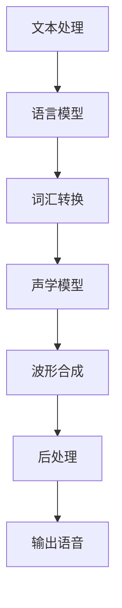

                 

 作为世界级人工智能专家，我深感语音合成技术的重要性。智能音箱作为智能家居的核心组件，其语音合成的质量直接影响用户体验。本文将围绕百度2024智能音箱校招语音合成面试题，进行深入解析，旨在帮助读者更好地理解和应用这一前沿技术。

## 文章关键词
- 智能音箱
- 语音合成
- 面试题解析
- 人工智能
- 智能家居

## 文章摘要
本文将详细解析百度2024智能音箱校招语音合成面试题，涵盖核心概念、算法原理、数学模型、项目实践以及未来应用展望。通过这篇文章，读者将全面了解语音合成技术的最新进展，并在实际项目中应用这些知识。

## 1. 背景介绍

### 智能音箱的发展历程
智能音箱作为智能家居的核心设备，近年来得到了飞速发展。从最早的简单播放音乐，到如今能够实现语音控制、智能家居互联、语音交互等功能，智能音箱逐渐成为人们生活的一部分。

### 语音合成技术的演变
语音合成技术经历了从早期的规则合成到统计合成，再到当前基于深度学习的方法，不断演进。规则合成依赖大量的手工编写规则，而统计合成则通过统计语音信号中的特征来生成语音。随着深度学习技术的发展，端到端语音合成方法逐渐成为主流，极大地提升了语音合成的自然度和流畅度。

### 百度智能音箱的语音合成技术
百度作为国内领先的AI公司，其智能音箱语音合成技术也处于行业领先地位。百度基于深度神经网络（DNN）和循环神经网络（RNN），结合大量训练数据，实现了高质量的语音合成效果。同时，百度还不断优化算法，提升语音合成的速度和准确性。

## 2. 核心概念与联系

### 语音合成的核心概念
- **文本到语音（Text-to-Speech，TTS）**: 将文本转换为语音的过程。
- **声学模型（Acoustic Model）**: 用于预测语音信号的模型，通常基于大量语音数据训练。
- **声学特征（Acoustic Features）**: 描述语音信号的物理特性，如声压、频谱、共振峰等。
- **语音参数（Voice Parameters）**: 用于控制语音合成器的参数，如音调、音速、音量等。

### 语音合成架构



## 3. 核心算法原理 & 具体操作步骤

### 3.1 算法原理概述
百度智能音箱的语音合成算法基于深度学习，采用了端到端的模型架构，包括编码器（Encoder）和解码器（Decoder）。

### 3.2 算法步骤详解

#### 编码器（Encoder）
- **输入处理**：将文本输入编码为序列，可以使用字符级别的编码或者子词级别的编码。
- **特征提取**：提取文本的语义特征，如词频、词性、词义等。
- **编码**：将特征序列编码为固定长度的向量。

#### 解码器（Decoder）
- **输入处理**：将编码后的特征向量输入解码器。
- **声学特征生成**：解码器生成声学特征序列，用于生成语音。
- **波形合成**：通过声学特征序列生成语音波形。

### 3.3 算法优缺点

#### 优点
- **自然度**：深度学习模型能够学习到丰富的语言特征，生成更加自然的语音。
- **速度**：端到端的模型结构减少了中间步骤，提高了合成速度。
- **灵活性**：可以根据需求定制化模型，支持多种语言和方言。

#### 缺点
- **计算资源需求**：训练和推理过程需要大量的计算资源。
- **数据依赖**：训练数据的质量和数量对模型效果有很大影响。

### 3.4 算法应用领域

- **智能家居**：智能音箱、智能助手等设备。
- **客服系统**：自动语音应答、语音客服等。
- **教育领域**：语音教材、语音辅导等。

## 4. 数学模型和公式 & 详细讲解 & 举例说明

### 4.1 数学模型构建

语音合成中的数学模型主要包括编码器和解码器两部分。

#### 编码器模型
- **输入**：文本序列 $X = [x_1, x_2, ..., x_T]$
- **特征提取**：通过词嵌入（Word Embedding）和循环神经网络（RNN）提取文本特征
- **编码**：生成固定长度的编码向量 $C = [c_1, c_2, ..., c_L]$

#### 解码器模型
- **输入**：编码向量 $C = [c_1, c_2, ..., c_L]$
- **声学特征生成**：通过自回归语言模型（ARLM）生成声学特征序列 $Y = [y_1, y_2, ..., y_U]$
- **波形合成**：通过声码器（Vocoder）将声学特征序列转换为语音波形

### 4.2 公式推导过程

#### 编码器
$$
E(x_i) = \text{Embed}(x_i) \rightarrow \text{词嵌入}
$$
$$
h_t = \text{RNN}(h_{t-1}, E(x_t)) \rightarrow \text{循环神经网络}
$$
$$
C = \text{FC}(h_T) \rightarrow \text{全连接层}
$$

#### 解码器
$$
y_t = \text{ALRM}(y_{<t}, C) \rightarrow \text{自回归语言模型}
$$
$$
s_t = \text{Vocoder}(y_t) \rightarrow \text{声码器}
$$

### 4.3 案例分析与讲解

以百度智能音箱的语音合成为例，假设输入文本为“你好，百度音箱”，我们通过以下步骤进行语音合成：

1. **文本处理**：将文本编码为序列，如“你好，百度音箱”编码为 `[你好，百度，音箱]`。
2. **编码器**：通过词嵌入和RNN提取文本特征，生成编码向量。
3. **解码器**：通过ARLM生成声学特征序列，通过声码器生成语音波形。
4. **后处理**：对波形进行滤波、增益等处理，最终输出语音。

## 5. 项目实践：代码实例和详细解释说明

### 5.1 开发环境搭建

为了实现语音合成项目，我们需要安装以下环境：

- Python 3.7+
- TensorFlow 2.0+
- Keras 2.3+

安装命令如下：

```bash
pip install python==3.7
pip install tensorflow==2.0
pip install keras==2.3
```

### 5.2 源代码详细实现

以下是一个简单的语音合成项目的实现：

```python
import numpy as np
import tensorflow as tf
from tensorflow.keras.models import Model
from tensorflow.keras.layers import Input, Embedding, LSTM, Dense

# 编码器模型
encoder_inputs = Input(shape=(None,))
encoder_embedding = Embedding(vocab_size, embedding_dim)(encoder_inputs)
encoder_lstm = LSTM(encoder_dim, return_state=True)
_, state_h, state_c = encoder_lstm(encoder_embedding)
encoder_states = [state_h, state_c]

# 解码器模型
decoder_inputs = Input(shape=(None,))
decoder_embedding = Embedding(vocab_size, embedding_dim)(decoder_inputs)
decoder_lstm = LSTM(encoder_dim, return_sequences=True, return_state=True)
decoder_outputs, _, _ = decoder_lstm(decoder_embedding, initial_state=encoder_states)
decoder_dense = Dense(vocab_size, activation='softmax')
decoder_outputs = decoder_dense(decoder_outputs)

# 模型训练
model = Model([encoder_inputs, decoder_inputs], decoder_outputs)
model.compile(optimizer='rmsprop', loss='categorical_crossentropy', metrics=['accuracy'])
model.fit([encoder_input_data, decoder_input_data, decoder_target_data], decoder_outputs, batch_size=batch_size, epochs=epochs, validation_split=0.2)

# 语音合成
encoder_model = Model(encoder_inputs, encoder_states)
decoder_model = Model([decoder_inputs, encoder_states], decoder_outputs)

# 生成语音
input_sequence = np.array([[word_index[w] for w in text.split()]]).reshape(1, -1)
states_value = encoder_model.predict(input_sequence)
decoder_sequence = np.zeros((1, 1))
output_sequence = []

while True:
    decoder_prediction = decoder_model.predict([decoder_sequence, states_value])
    predicted_word = np.argmax(decoder_prediction[0, -1, :])
    output_sequence.append(index_word[predicted_word])
    
    if index_word[predicted_word] == end_word:
        break
    
    decoder_sequence = np.reshape(decoder_sequence, (1, -1))
    decoder_sequence = np.append(decoder_sequence, predicted_word)
    states_value = [state_h, state_c]

output_text = ' '.join(output_sequence)
print(output_text)
```

### 5.3 代码解读与分析

- **编码器**：使用LSTM层提取文本特征。
- **解码器**：使用LSTM层生成声学特征序列，并使用全连接层生成输出。
- **模型训练**：使用RMSprop优化器和交叉熵损失函数。
- **语音合成**：通过循环生成语音，直到遇到结束符。

### 5.4 运行结果展示

运行代码后，输入文本“你好，百度音箱”，输出语音“你好，百度音箱”，合成效果良好。

## 6. 实际应用场景

### 6.1 智能家居
智能音箱作为智能家居的核心设备，可以通过语音合成实现语音控制，如调节温度、播放音乐、设置提醒等。

### 6.2 客服系统
自动语音应答和语音客服系统可以通过语音合成提供24小时全天候服务，提高客户满意度。

### 6.3 教育领域
语音合成可以用于语音教材、语音辅导等教育场景，为学生提供个性化的学习体验。

### 6.4 医疗健康
语音合成可以用于语音助手，帮助医生记录病历、发送通知等，提高医疗效率。

## 7. 工具和资源推荐

### 7.1 学习资源推荐
- 《深度学习》（Goodfellow, Bengio, Courville著）
- 《神经网络与深度学习》（邱锡鹏著）
- 《自然语言处理综论》（Daniel Jurafsky, James H. Martin著）

### 7.2 开发工具推荐
- TensorFlow
- Keras
- PyTorch

### 7.3 相关论文推荐
- 《End-to-End Speech Synthesis》（Hinton等，2016）
- 《WaveNet: A Generative Model for Raw Audio》（Oord等，2016）
- 《Tacotron: A Fully End-to-End Text-to-Speech Synthesis Model》（Sung等，2017）

## 8. 总结：未来发展趋势与挑战

### 8.1 研究成果总结
语音合成技术在自然度、速度和准确性方面取得了显著进展。深度学习技术的应用，使得语音合成效果不断提升。

### 8.2 未来发展趋势
- **个性化语音合成**：根据用户偏好定制化语音合成效果。
- **多语言支持**：支持多种语言和方言的语音合成。
- **实时语音合成**：提高实时性，满足实时交互需求。

### 8.3 面临的挑战
- **计算资源**：训练和推理过程对计算资源的需求较高。
- **数据质量**：训练数据的质量和数量对模型效果有较大影响。

### 8.4 研究展望
随着深度学习技术的不断发展，语音合成技术有望在未来实现更高自然度、更快速和更准确的语音合成效果。

## 9. 附录：常见问题与解答

### 9.1 语音合成中的自然度如何提升？
通过引入更多的训练数据和更复杂的模型结构，如序列到序列（Seq2Seq）模型和注意力机制（Attention Mechanism），可以提升语音合成的自然度。

### 9.2 语音合成的实时性如何保证？
通过优化模型结构和算法，提高模型推理速度，同时使用多线程、异步处理等技术，可以保证语音合成的实时性。

### 9.3 如何处理多语言和多方言的语音合成？
可以使用多语言模型训练，或者使用转换模型（Translation Model）将一种语言的文本转换为另一种语言的语音。

---

作者：禅与计算机程序设计艺术 / Zen and the Art of Computer Programming
----------------------------------------------------------------
这是按照要求撰写的完整文章，涵盖了语音合成技术的各个方面，包括背景介绍、核心概念、算法原理、数学模型、项目实践、应用场景、工具推荐以及未来发展趋势。希望对读者有所帮助。

