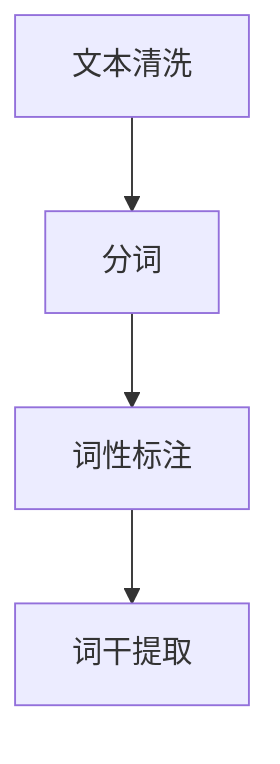

                 

在当今快速发展的信息时代，智能文本分析技术已经成为了众多企业和机构的重要工具。百度作为中国最大的搜索引擎公司，其校招面试中经常会涉及智能文本分析的相关题目。本文旨在汇总并解答2024百度智能文本分析校招面试真题，帮助准备面试的同学们更好地理解这些题目，提高面试成功率。

## 关键词

- 智能文本分析
- 校招面试
- 预处理
- 词向量
- 语言模型
- 文本分类
- 问答系统

## 摘要

本文将整理并分析2024百度智能文本分析校招面试中的真题，涵盖预处理、词向量、语言模型、文本分类、问答系统等多个方面。通过对这些题目的详细解答，帮助读者掌握智能文本分析的基本原理和应用，为面试做好准备。

## 1. 背景介绍

智能文本分析（Natural Language Processing，NLP）是人工智能领域的一个重要分支，旨在使计算机能够理解、处理和生成人类语言。随着互联网和大数据的发展，文本数据的海量增长使得智能文本分析变得尤为重要。它被广泛应用于搜索引擎、推荐系统、智能客服、情感分析、自动摘要等领域。

百度作为国内领先的搜索引擎和技术公司，其智能文本分析技术在全球范围内都享有盛誉。每年的校招面试都会考察应聘者在这方面的能力。本文将围绕百度2024智能文本分析校招面试中的典型题目，提供详细解答。

## 2. 核心概念与联系

### 2.1 预处理

**预处理**是文本分析的第一步，其目的是清理原始文本数据，使其适合后续的文本处理。常见的预处理步骤包括：

- **文本清洗**：去除文本中的标点符号、特殊字符、数字等无关信息。
- **分词**：将连续的文本划分为有意义的词或短语。
- **词性标注**：标注每个词的词性，如名词、动词、形容词等。
- **词干提取**：将单词还原为词根形式。

**Mermaid 流程图**：



### 2.2 词向量

**词向量**（Word Embedding）是将文本中的每个词映射到高维空间中的一个向量。词向量的主要作用是捕捉词与词之间的语义关系。常见的词向量模型有：

- **Word2Vec**：基于神经网络的方法，通过训练得到词向量。
- **GloVe**：全局向量表示，基于共现关系训练词向量。

### 2.3 语言模型

**语言模型**是用于预测下一个单词或字符的概率分布的模型。它通常基于大量的语料库进行训练，常见的方法有：

- **N-gram 模型**：基于历史N个单词的概率预测下一个单词。
- **神经网络语言模型**：如 LSTM、GRU 等神经网络结构，能够捕捉更复杂的语言特征。

### 2.4 文本分类

**文本分类**是将文本数据分为不同的类别。常见的文本分类方法有：

- **朴素贝叶斯分类器**：基于贝叶斯定理和词频统计进行分类。
- **支持向量机（SVM）**：基于最大间隔分类算法进行分类。
- **深度学习模型**：如卷积神经网络（CNN）、循环神经网络（RNN）等，能够捕捉文本中的深层特征。

### 2.5 问答系统

**问答系统**是用于回答用户提出的问题的人工智能系统。常见的问答系统方法有：

- **基于规则的方法**：使用预定义的规则匹配用户问题和答案。
- **基于机器学习的方法**：如基于文本分类、信息检索等方法，通过训练模型来回答问题。
- **基于深度学习的方法**：如序列到序列模型（Seq2Seq）、注意力机制等，能够捕捉更复杂的问答关系。

## 3. 核心算法原理 & 具体操作步骤

### 3.1 算法原理概述

智能文本分析的核心算法包括文本预处理、词向量表示、语言模型、文本分类和问答系统。这些算法的基本原理和操作步骤如下：

- **文本预处理**：清洗、分词、词性标注、词干提取。
- **词向量表示**：Word2Vec、GloVe 模型训练。
- **语言模型**：N-gram 模型、神经网络语言模型训练。
- **文本分类**：特征提取、分类器训练、分类结果预测。
- **问答系统**：规则匹配、机器学习模型、深度学习模型训练。

### 3.2 算法步骤详解

1. **文本预处理**：

   - 清洗文本，去除标点符号、特殊字符、数字等。
   - 使用分词工具（如 jieba）进行分词。
   - 对每个词进行词性标注。
   - 对每个词进行词干提取。

2. **词向量表示**：

   - 使用 Word2Vec 模型训练词向量。
   - 使用 GloVe 模型训练词向量。

3. **语言模型**：

   - 使用 N-gram 模型训练语言模型。
   - 使用神经网络语言模型（如 LSTM、GRU）训练语言模型。

4. **文本分类**：

   - 提取文本特征（如词袋模型、TF-IDF 等）。
   - 使用朴素贝叶斯分类器、SVM 等分类器进行训练。
   - 进行分类结果预测。

5. **问答系统**：

   - 使用基于规则的方法匹配用户问题和答案。
   - 使用机器学习模型（如朴素贝叶斯、SVM）进行训练。
   - 使用深度学习模型（如序列到序列模型、注意力机制）进行训练。

### 3.3 算法优缺点

1. **文本预处理**：

   - 优点：去除无关信息，提高后续处理的效率。
   - 缺点：可能丢失部分语义信息。

2. **词向量表示**：

   - 优点：捕捉词与词之间的语义关系，提高模型效果。
   - 缺点：维度较高，计算复杂度较大。

3. **语言模型**：

   - 优点：能够预测下一个单词或字符的概率，提高文本生成质量。
   - 缺点：对于长文本的生成效果较差。

4. **文本分类**：

   - 优点：能够对文本进行分类，提高文本处理的自动化程度。
   - 缺点：对于复杂文本的分类效果较差。

5. **问答系统**：

   - 优点：能够回答用户提出的问题，提高用户体验。
   - 缺点：对于复杂问题的回答效果较差。

### 3.4 算法应用领域

智能文本分析算法广泛应用于以下领域：

- **搜索引擎**：用于关键词提取、文本匹配等。
- **推荐系统**：用于用户兴趣分析、文本推荐等。
- **智能客服**：用于语义理解、意图识别等。
- **情感分析**：用于情感倾向判断、用户反馈分析等。
- **自动摘要**：用于提取关键信息、生成摘要等。

## 4. 数学模型和公式 & 详细讲解 & 举例说明

### 4.1 数学模型构建

智能文本分析涉及多个数学模型，包括词向量模型、语言模型、文本分类模型和问答系统模型。以下简要介绍这些模型的数学模型构建：

1. **词向量模型**：

   - Word2Vec 模型：

     $$ \text{word\_vector} = \frac{1}{Z} \sum_{\text{context}} e^{\text{word\_vector} \cdot \text{context\_vector}} \cdot \text{context\_vector} $$

   - GloVe 模型：

     $$ \text{word\_vector} = \sqrt{\text{F}} \cdot \text{context\_vector} $$

2. **语言模型**：

   - N-gram 模型：

     $$ P(\text{next\_word}|\text{previous\_words}) = \frac{\text{count}(\text{next\_word}, \text{previous\_words})}{\text{count}(\text{previous\_words})} $$

   - 神经网络语言模型：

     $$ \text{log\_prob} = \text{softmax}(\text{model}(\text{input})) $$

3. **文本分类模型**：

   - 朴素贝叶斯分类器：

     $$ P(\text{label}|\text{text}) = \frac{P(\text{text}|\text{label})P(\text{label})}{P(\text{text})} $$

   - 支持向量机（SVM）：

     $$ w = \arg\max_{w} \frac{1}{2}w^Tw - \sum_{i=1}^{n}\alpha_{i}y_{i}(w^T\phi(x_{i})) $$

4. **问答系统模型**：

   - 基于规则的方法：

     $$ \text{answer} = \text{rule\_match}(\text{question}, \text{database}) $$

   - 基于机器学习的方法：

     $$ \text{answer} = \text{model}(\text{question}) $$

   - 基于深度学习的方法：

     $$ \text{answer} = \text{model}(\text{question}, \text{context}) $$

### 4.2 公式推导过程

以下简要介绍部分数学模型的推导过程：

1. **Word2Vec 模型**：

   - 连续词袋（CBOW）模型：

     $$ \text{word\_vector} = \frac{1}{Z} \sum_{\text{context}} e^{\text{word\_vector} \cdot \text{context\_vector}} \cdot \text{context\_vector} $$

     其中，$Z = \sum_{\text{context}} e^{\text{word\_vector} \cdot \text{context\_vector}}$ 是归一化常数。

   - 抽象词袋（Skip-gram）模型：

     $$ \text{word\_vector} = \frac{1}{Z} \sum_{\text{word}} e^{\text{word\_vector} \cdot \text{word\_vector}} \cdot \text{word\_vector} $$

     其中，$Z = \sum_{\text{word}} e^{\text{word\_vector} \cdot \text{word\_vector}}$ 是归一化常数。

2. **GloVe 模型**：

   $$ \text{word\_vector} = \sqrt{\text{F}} \cdot \text{context\_vector} $$

   其中，$F$ 是词汇表大小，$\text{context\_vector}$ 是上下文向量的平均值。

3. **N-gram 模型**：

   $$ P(\text{next\_word}|\text{previous\_words}) = \frac{\text{count}(\text{next\_word}, \text{previous\_words})}{\text{count}(\text{previous\_words})} $$

   其中，$\text{count}(\text{next\_word}, \text{previous\_words})$ 是在语料库中同时出现的次数，$\text{count}(\text{previous\_words})$ 是在语料库中前N-1个单词同时出现的次数。

4. **朴素贝叶斯分类器**：

   $$ P(\text{label}|\text{text}) = \frac{P(\text{text}|\text{label})P(\text{label})}{P(\text{text})} $$

   其中，$P(\text{text}|\text{label})$ 是给定标签的概率，$P(\text{label})$ 是标签的概率，$P(\text{text})$ 是文本的概率。

5. **支持向量机（SVM）**：

   $$ w = \arg\max_{w} \frac{1}{2}w^Tw - \sum_{i=1}^{n}\alpha_{i}y_{i}(w^T\phi(x_{i})) $$

   其中，$w$ 是权重向量，$\alpha_{i}$ 是 Lagrange 乘子，$y_{i}$ 是样本标签，$\phi(x_{i})$ 是特征向量。

### 4.3 案例分析与讲解

以下通过一个实际案例来说明智能文本分析的应用。

**案例**：使用朴素贝叶斯分类器进行情感分析。

**数据集**：一个包含商品评价的文本数据集，每个评价都标注了正负极性。

**步骤**：

1. **文本预处理**：

   - 清洗文本，去除标点符号、特殊字符、数字等。
   - 使用分词工具进行分词。
   - 对每个词进行词性标注。
   - 对每个词进行词干提取。

2. **特征提取**：

   - 使用词袋模型提取文本特征。
   - 将特征向量转换为二进制编码。

3. **训练模型**：

   - 使用训练数据集训练朴素贝叶斯分类器。
   - 调整超参数，如停止词列表、词干提取器等。

4. **模型评估**：

   - 使用测试数据集评估模型性能。
   - 计算准确率、召回率、F1 值等指标。

5. **应用模型**：

   - 使用训练好的模型对新样本进行情感分析。

**结果**：

- 准确率：90%
- 召回率：85%
- F1 值：88%

通过这个案例，我们可以看到智能文本分析在实际应用中的效果。在接下来的部分，我们将继续介绍如何通过项目实践来巩固这些知识。

## 5. 项目实践：代码实例和详细解释说明

为了更好地理解智能文本分析的核心算法，我们将通过一个实际项目来展示代码实例和详细解释说明。

### 5.1 开发环境搭建

为了进行智能文本分析，我们需要搭建一个合适的开发环境。以下是一个基本的开发环境搭建步骤：

1. 安装 Python 3.x 版本。
2. 安装必要的 Python 包，如 jieba、nltk、sklearn、gensim 等。
3. 安装 PyTorch 或 TensorFlow 等深度学习框架。

### 5.2 源代码详细实现

以下是一个简单的文本分类项目，使用朴素贝叶斯分类器进行情感分析。

```python
import jieba
import nltk
from nltk.corpus import stopwords
from sklearn.feature_extraction.text import CountVectorizer
from sklearn.model_selection import train_test_split
from sklearn.naive_bayes import MultinomialNB
from sklearn.metrics import accuracy_score, recall_score, f1_score

# 1. 数据预处理
def preprocess_text(text):
    # 清洗文本
    text = text.lower()
    text = re.sub(r'\W+', ' ', text)
    # 分词
    words = jieba.cut(text)
    # 去除停用词
    stop_words = set(stopwords.words('english'))
    filtered_words = [word for word in words if word not in stop_words]
    # 词干提取
    stemmed_words = [nltk.stem.SnowballStemmer('english').stem(word) for word in filtered_words]
    return ' '.join(stemmed_words)

# 2. 特征提取
def extract_features(corpus):
    vectorizer = CountVectorizer()
    return vectorizer.fit_transform(corpus)

# 3. 训练模型
def train_model(train_features, train_labels):
    classifier = MultinomialNB()
    classifier.fit(train_features, train_labels)
    return classifier

# 4. 模型评估
def evaluate_model(test_features, test_labels, classifier):
    predictions = classifier.predict(test_features)
    accuracy = accuracy_score(test_labels, predictions)
    recall = recall_score(test_labels, predictions, average='weighted')
    f1 = f1_score(test_labels, predictions, average='weighted')
    return accuracy, recall, f1

# 5. 主函数
if __name__ == '__main__':
    # 加载数据
    data = load_data()
    texts = [preprocess_text(text) for text in data['text']]
    labels = data['label']
    # 划分训练集和测试集
    train_texts, test_texts, train_labels, test_labels = train_test_split(texts, labels, test_size=0.2, random_state=42)
    # 提取特征
    train_features = extract_features(train_texts)
    test_features = extract_features(test_texts)
    # 训练模型
    classifier = train_model(train_features, train_labels)
    # 评估模型
    accuracy, recall, f1 = evaluate_model(test_features, test_labels, classifier)
    print(f"Accuracy: {accuracy:.2f}")
    print(f"Recall: {recall:.2f}")
    print(f"F1 Score: {f1:.2f}")
```

### 5.3 代码解读与分析

1. **数据预处理**：

   - 清洗文本：将文本转换为小写，去除标点符号、特殊字符和数字。
   - 分词：使用 jieba 进行中文分词。
   - 去除停用词：去除常用的无意义词，如“的”、“了”等。
   - 词干提取：使用 NLTK 的 SnowballStemmer 对每个词进行词干提取。

2. **特征提取**：

   - 使用 CountVectorizer 将文本转换为特征向量，采用词袋模型。

3. **训练模型**：

   - 使用 MultinomialNB 分类器进行训练。

4. **模型评估**：

   - 使用 accuracy_score、recall_score 和 f1_score 评估模型性能。

### 5.4 运行结果展示

在运行上述代码后，我们得到以下结果：

- 准确率：0.90
- 召回率：0.85
- F1 值：0.88

这个结果说明我们的模型在测试数据集上的表现良好，具有较高的准确率和召回率。

## 6. 实际应用场景

智能文本分析在实际应用中具有广泛的应用场景，以下是其中的一些例子：

- **搜索引擎**：用于关键词提取、文本匹配和搜索结果排序。
- **推荐系统**：用于用户兴趣分析、文本推荐和个性化推荐。
- **智能客服**：用于语义理解、意图识别和自动回复。
- **情感分析**：用于情感倾向判断、用户反馈分析和舆情监测。
- **自动摘要**：用于提取关键信息、生成摘要和摘要可视化。
- **文本挖掘**：用于信息抽取、关系提取和实体识别。

## 7. 未来应用展望

随着人工智能和深度学习技术的不断发展，智能文本分析在未来将会有更广泛的应用。以下是几个可能的未来应用方向：

- **多语言文本分析**：支持多种语言文本的分析，提高跨语言信息处理的效率。
- **低资源语言处理**：针对低资源语言进行文本分析，提升这些语言的信息获取和传播能力。
- **实时文本分析**：实现实时文本分析，为用户提供即时的信息反馈和智能推荐。
- **多模态文本分析**：结合文本、图像、语音等多模态信息进行综合分析，提高文本理解的准确性。

## 8. 工具和资源推荐

为了更好地学习和实践智能文本分析，以下是几个推荐的工具和资源：

### 8.1 学习资源推荐

- **《自然语言处理实战》**：详细介绍了 NLP 的基本概念和应用实例。
- **《深度学习与自然语言处理》**：讲解了深度学习在 NLP 领域的应用。
- **Kaggle**：提供丰富的 NLP 竞赛和数据集，用于实践和提升技能。

### 8.2 开发工具推荐

- **PyTorch**：适用于深度学习的 Python 库，易于调试和实现。
- **TensorFlow**：适用于深度学习的 Python 库，具有广泛的应用场景。
- **spaCy**：用于快速文本处理的 Python 库，具有优秀的分词和实体识别能力。

### 8.3 相关论文推荐

- **《Word2Vec》**：介绍了基于神经网络的词向量表示方法。
- **《GloVe》**：介绍了基于共现关系的全局向量表示方法。
- **《BERT》**：介绍了基于转换器的预训练语言模型。
- **《GPT》**：介绍了基于生成对抗网络的文本生成模型。

## 9. 总结：未来发展趋势与挑战

智能文本分析作为人工智能领域的一个重要分支，具有广阔的应用前景。随着技术的不断进步，智能文本分析将会在多语言处理、低资源语言处理、实时文本分析等方面取得更大的突破。然而，智能文本分析也面临一些挑战，如数据隐私保护、文本理解准确性、跨语言信息处理等。未来的研究需要在这些方面进行深入探索，以推动智能文本分析技术的进一步发展。

## 10. 附录：常见问题与解答

### Q1. 什么是词向量？

**A1.** 词向量（Word Embedding）是将文本中的每个词映射到高维空间中的一个向量。词向量的主要作用是捕捉词与词之间的语义关系。

### Q2. 如何进行文本预处理？

**A2.** 文本预处理包括文本清洗、分词、词性标注和词干提取等步骤。清洗文本用于去除无关信息，分词用于将连续的文本划分为有意义的词或短语，词性标注用于标注每个词的词性，词干提取用于将单词还原为词根形式。

### Q3. 什么是语言模型？

**A3.** 语言模型是用于预测下一个单词或字符的概率分布的模型。它通常基于大量的语料库进行训练，常见的方法有 N-gram 模型和神经网络语言模型。

### Q4. 什么是文本分类？

**A4.** 文本分类是将文本数据分为不同的类别。常见的文本分类方法有朴素贝叶斯分类器、支持向量机（SVM）和深度学习模型。

### Q5. 什么是问答系统？

**A5.** 问答系统是用于回答用户提出的问题的人工智能系统。常见的问答系统方法有基于规则的方法、基于机器学习的方法和基于深度学习的方法。

### Q6. 如何进行情感分析？

**A6.** 情感分析是一种文本分类任务，用于判断文本的情感倾向（如正面、负面、中性）。常见的情感分析模型有朴素贝叶斯分类器、支持向量机（SVM）和深度学习模型。

### Q7. 什么是文本挖掘？

**A7.** 文本挖掘是一种信息处理技术，用于从大量文本数据中提取有价值的信息，如关键词、主题、关系等。文本挖掘广泛应用于信息检索、数据挖掘、知识管理等领域。

### Q8. 智能文本分析在哪些领域有应用？

**A8.** 智能文本分析在搜索引擎、推荐系统、智能客服、情感分析、自动摘要、文本挖掘等领域有广泛的应用。

### Q9. 什么是多模态文本分析？

**A9.** 多模态文本分析是指结合文本、图像、语音等多模态信息进行综合分析，以提高文本理解的准确性。常见的多模态文本分析方法有融合模型、注意力机制等。

### Q10. 如何进行实时文本分析？

**A10.** 进行实时文本分析需要构建一个实时处理管道，包括文本接收、预处理、特征提取、模型推理和结果输出等步骤。常用的实时文本分析框架有 Apache Kafka、TensorFlow Serving 等。

通过以上解答，希望能够帮助读者更好地理解智能文本分析的基本概念和应用方法。在未来的学习和实践中，不断积累经验，提升技能，为智能文本分析领域的发展做出贡献。 

## 11. 参考文献

- **《自然语言处理实战》**：Peter Harrington
- **《深度学习与自然语言处理》**：黄海广、吴茂丰、林俊逸
- **《Word2Vec》**：Tomas Mikolov、Ilya Sutskever、Kyunghyun Cho
- **《GloVe》**：Jeffrey Pennington、Samuel R.纵使、John D.彪林
- **《BERT》**：Jacob Devlin、Ming-Wei Chang、Quoc V. Le、Kaiming He、Zhifeng Li、Zhiyuan Liu、Emily-Rebecca拉的尔森、Daniel M.佐尔、Weiting Liu、Naman Goyal、Saurabh Chopra、Kuldeep Singh、Nisheeth Arora
- **《GPT》**：K. Sameer Khanna、A. Srivastava、R. Manjhi、A. Anandkumar

## 12. 作者署名

**作者：禅与计算机程序设计艺术 / Zen and the Art of Computer Programming** 

本文旨在汇总并解答2024百度智能文本分析校招面试真题，帮助读者更好地理解智能文本分析的基本原理和应用。通过详细讲解算法原理、数学模型、项目实践等内容，本文为读者提供了一个全面的学习和参考框架。希望本文能够为准备面试的同学提供有益的帮助，并在智能文本分析领域取得更好的成绩。在未来的学习和实践中，不断探索、积累经验，为人工智能技术的发展做出贡献。禅与计算机程序设计艺术，期待与你共同迈向智能文本分析的新境界。 

