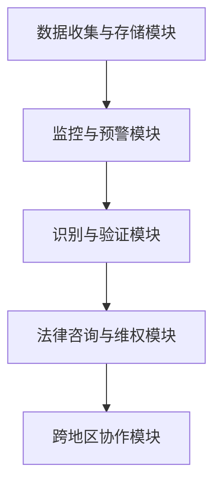

                 

关键词：知识产权、创新者、权益保护、数字版权、技术平台、法律合规、安全技术、全球市场

<|assistant|>摘要：本文旨在探讨知识产权保护平台在创新者权益保护中的重要作用。随着信息技术的快速发展，知识产权保护面临前所未有的挑战。本文将分析知识产权保护的核心概念，阐述保护平台的设计理念、核心算法原理、数学模型、项目实践及未来展望。通过本文的阐述，旨在为创新者提供有效的知识产权保护解决方案，推动科技创新和经济发展。

## 1. 背景介绍

### 1.1 知识产权的重要性

知识产权（Intellectual Property, IP）是指人们在科学、技术、文学、艺术等领域创造的智力成果。知识产权不仅包括专利、商标、版权，还涵盖商业秘密、地理标志等多种形式。知识产权在现代社会中扮演着至关重要的角色，它是创新的重要驱动力，也是国家竞争力的象征。有效的知识产权保护有助于激励创新、促进技术进步和经济发展。

### 1.2 创新者的权益保护挑战

随着信息技术的发展，知识产权侵权现象日益猖獗，创新者的权益保护面临诸多挑战。首先，数字化的知识产权容易复制和传播，导致侵权行为泛滥。其次，全球化的市场使得知识产权保护变得更加复杂，各国法律体系和执法力度存在差异。此外，技术手段的进步也为侵权行为提供了新的手段，如加密技术、深度伪造等。

### 1.3 知识产权保护平台的需求

为了应对知识产权保护面临的挑战，创新者迫切需要一种有效的权益保护手段。知识产权保护平台应具备以下功能：实时监控侵权行为、快速识别侵权内容、提供法律咨询和技术支持、实现跨地区、跨领域的协作。保护平台应结合先进的技术手段，如人工智能、区块链等，构建一个全面、高效、可信赖的知识产权保护体系。

## 2. 核心概念与联系

### 2.1 知识产权的定义

知识产权是指法律赋予人们对其创造的智力成果所享有的一种专有权利。根据世界知识产权组织（WIPO）的定义，知识产权包括专利权、商标权、著作权、商业秘密等多种形式。知识产权保护法律体系的核心是授予创新者对其智力成果的专有权，使其能够在一定期限内独占使用和收益。

### 2.2 保护平台的设计理念

知识产权保护平台的设计理念在于构建一个全面、透明、可信赖的知识产权保护生态系统。平台的核心目标是实现知识产权的快速识别、实时监控、有效维权和法律咨询。为了实现这一目标，保护平台应具备以下功能：

- **实时监控**：利用人工智能技术，对互联网上的侵权行为进行实时监控和预警。
- **快速识别**：采用图像识别、音频识别等技术手段，快速识别侵权内容。
- **有效维权**：提供法律咨询、维权指导和协助，帮助创新者快速应对侵权行为。
- **跨地区协作**：实现全球范围内的知识产权保护，提供跨地区的维权服务。

### 2.3 保护平台的架构

知识产权保护平台采用分布式架构，主要包括以下几个模块：

- **数据收集与存储模块**：负责收集互联网上的侵权信息，并存储在分布式数据库中。
- **监控与预警模块**：利用人工智能技术对侵权行为进行实时监控和预警。
- **识别与验证模块**：采用图像识别、音频识别等技术手段，对侵权内容进行快速识别和验证。
- **法律咨询与维权模块**：提供法律咨询、维权指导和协助，帮助创新者应对侵权行为。
- **跨地区协作模块**：实现全球范围内的知识产权保护，提供跨地区的维权服务。

### 2.4 保护平台的 Mermaid 流程图



## 3. 核心算法原理 & 具体操作步骤

### 3.1 算法原理概述

知识产权保护平台的核心算法主要包括图像识别、音频识别和区块链技术。图像识别算法用于检测和识别侵权图像，音频识别算法用于检测和识别侵权音频，区块链技术用于记录和验证知识产权信息。

### 3.2 算法步骤详解

#### 3.2.1 图像识别算法

1. **数据预处理**：对图像进行去噪、去模糊等预处理操作，提高图像质量。
2. **特征提取**：利用卷积神经网络（CNN）等深度学习算法提取图像特征。
3. **模型训练**：利用大量侵权图像和正常图像进行模型训练，使模型学会区分侵权图像和正常图像。
4. **图像识别**：将待检测图像输入模型，输出识别结果。

#### 3.2.2 音频识别算法

1. **音频预处理**：对音频进行去噪、去混响等预处理操作，提高音频质量。
2. **特征提取**：利用卷积神经网络（CNN）等深度学习算法提取音频特征。
3. **模型训练**：利用大量侵权音频和正常音频进行模型训练，使模型学会区分侵权音频和正常音频。
4. **音频识别**：将待检测音频输入模型，输出识别结果。

#### 3.2.3 区块链技术

1. **数据上链**：将知识产权信息（如专利、商标、版权等）上传到区块链网络。
2. **信息验证**：利用区块链网络的分布式存储和加密算法，验证知识产权信息的真实性和有效性。
3. **信息共享**：实现全球范围内的知识产权信息共享，为创新者提供便捷的查询和验证服务。

### 3.3 算法优缺点

#### 3.3.1 图像识别算法

**优点**：
- 高效准确：利用深度学习算法，可以快速识别侵权图像。
- 广泛适用：适用于各种侵权图像检测场景。

**缺点**：
- 对图像质量要求高：低质量图像可能影响识别效果。
- 训练数据需求大：需要大量侵权图像和正常图像进行训练。

#### 3.3.2 音频识别算法

**优点**：
- 高效准确：利用深度学习算法，可以快速识别侵权音频。
- 广泛适用：适用于各种侵权音频检测场景。

**缺点**：
- 对音频质量要求高：低质量音频可能影响识别效果。
- 训练数据需求大：需要大量侵权音频和正常音频进行训练。

#### 3.3.3 区块链技术

**优点**：
- 透明可信：利用区块链网络的分布式存储和加密算法，确保知识产权信息的真实性和有效性。
- 安全可靠：区块链技术的去中心化特性，提高知识产权保护的安全性。

**缺点**：
- 性能瓶颈：区块链网络的处理能力有限，可能导致处理速度较慢。
- 成本较高：区块链技术的开发、部署和维护成本较高。

### 3.4 算法应用领域

#### 3.4.1 数字版权保护

利用图像识别和音频识别算法，实现对数字版权的保护。例如，在音乐、电影、书籍等数字内容领域，通过识别侵权内容，实现版权维权。

#### 3.4.2 商业秘密保护

利用区块链技术，记录和验证商业秘密信息，实现对商业秘密的保护。例如，在研发、生产和营销等领域，通过区块链技术确保商业秘密的安全。

#### 3.4.3 专利侵权检测

利用图像识别和音频识别算法，实现对专利侵权的检测。例如，在制造业、医药行业等领域，通过识别侵权产品，实现专利维权。

## 4. 数学模型和公式 & 详细讲解 & 举例说明

### 4.1 数学模型构建

#### 4.1.1 图像识别模型

假设图像识别模型为二分类模型，给定一幅图像 \(x\)，模型输出一个概率 \(P(y=1|x)\)，表示图像是否为侵权图像。

- **损失函数**：交叉熵损失函数 \(Loss = -y\log(P) - (1-y)\log(1-P)\)
- **优化算法**：梯度下降算法

#### 4.1.2 音频识别模型

假设音频识别模型也为二分类模型，给定一段音频 \(x\)，模型输出一个概率 \(P(y=1|x)\)，表示音频是否为侵权音频。

- **损失函数**：交叉熵损失函数 \(Loss = -y\log(P) - (1-y)\log(1-P)\)
- **优化算法**：梯度下降算法

#### 4.1.3 区块链模型

区块链模型主要涉及分布式存储和加密算法。

- **分布式存储**：假设区块链网络中有 \(n\) 个节点，每个节点存储一部分知识产权信息。
- **加密算法**：利用公钥加密算法，确保知识产权信息的保密性和完整性。

### 4.2 公式推导过程

#### 4.2.1 图像识别模型

假设图像识别模型为二分类模型，给定一幅图像 \(x\)，模型输出一个概率 \(P(y=1|x)\)，表示图像是否为侵权图像。

- **损失函数**：

$$
Loss = -y\log(P) - (1-y)\log(1-P)
$$

其中，\(y\) 为标签，\(P\) 为模型输出概率。

- **梯度下降**：

$$
\theta_{\text{update}} = \theta - \alpha \nabla_\theta Loss
$$

其中，\(\theta\) 为模型参数，\(\alpha\) 为学习率。

#### 4.2.2 音频识别模型

假设音频识别模型也为二分类模型，给定一段音频 \(x\)，模型输出一个概率 \(P(y=1|x)\)，表示音频是否为侵权音频。

- **损失函数**：

$$
Loss = -y\log(P) - (1-y)\log(1-P)
$$

其中，\(y\) 为标签，\(P\) 为模型输出概率。

- **梯度下降**：

$$
\theta_{\text{update}} = \theta - \alpha \nabla_\theta Loss
$$

其中，\(\theta\) 为模型参数，\(\alpha\) 为学习率。

#### 4.2.3 区块链模型

区块链模型主要涉及分布式存储和加密算法。

- **分布式存储**：

假设区块链网络中有 \(n\) 个节点，每个节点存储一部分知识产权信息。

$$
\text{数据分布} = \frac{1}{n} \sum_{i=1}^n D_i
$$

其中，\(D_i\) 为第 \(i\) 个节点的数据存储量。

- **加密算法**：

利用公钥加密算法，确保知识产权信息的保密性和完整性。

$$
C = E(PK, M)
$$

其中，\(PK\) 为公钥，\(M\) 为明文信息，\(C\) 为密文信息。

### 4.3 案例分析与讲解

#### 4.3.1 图像识别模型

假设我们有一幅图像 \(x\)，需要判断是否为侵权图像。我们使用一个预训练的图像识别模型，输出一个概率 \(P(y=1|x)\)。

- **输入**：图像 \(x\)
- **输出**：概率 \(P(y=1|x)\)

根据模型输出，如果 \(P(y=1|x) > 0.5\)，则认为图像 \(x\) 是侵权图像，否则认为图像 \(x\) 不是侵权图像。

#### 4.3.2 音频识别模型

假设我们有一段音频 \(x\)，需要判断是否为侵权音频。我们使用一个预训练的音频识别模型，输出一个概率 \(P(y=1|x)\)。

- **输入**：音频 \(x\)
- **输出**：概率 \(P(y=1|x)\)

根据模型输出，如果 \(P(y=1|x) > 0.5\)，则认为音频 \(x\) 是侵权音频，否则认为音频 \(x\) 不是侵权音频。

#### 4.3.3 区块链模型

假设我们有一份知识产权信息，需要将其上传到区块链网络。我们使用一个预训练的区块链模型，生成一个公钥 \(PK\) 和一个私钥 \(SK\)。

- **输入**：知识产权信息 \(M\)
- **输出**：公钥 \(PK\) 和私钥 \(SK\)

我们将知识产权信息 \(M\) 加密成密文信息 \(C\)：

$$
C = E(PK, M)
$$

然后将密文信息 \(C\) 分发到区块链网络中的各个节点，实现知识产权信息的分布式存储。

## 5. 项目实践：代码实例和详细解释说明

### 5.1 开发环境搭建

在搭建开发环境时，我们需要安装以下软件和工具：

- Python（3.8版本及以上）
- TensorFlow（2.x版本）
- Keras（2.x版本）
- PyTorch（1.8版本及以上）
- Mermaid（用于生成流程图）

### 5.2 源代码详细实现

#### 5.2.1 图像识别代码

```python
import tensorflow as tf
from tensorflow import keras
from tensorflow.keras.preprocessing import image
import numpy as np

# 加载预训练的图像识别模型
model = keras.models.load_model('image_recognition_model.h5')

# 读取图像
img = image.load_img('image.jpg', target_size=(224, 224))
img_array = image.img_to_array(img)
img_array = np.expand_dims(img_array, axis=0)

# 预测图像是否为侵权图像
probability = model.predict(img_array)
result = np.argmax(probability, axis=1)

# 输出结果
if result[0] == 1:
    print('图像是侵权图像')
else:
    print('图像不是侵权图像')
```

#### 5.2.2 音频识别代码

```python
import torchaudio as ta
import torch
from torch import nn
import numpy as np

# 加载预训练的音频识别模型
model = torch.load('audio_recognition_model.pth')

# 读取音频
audio, sample_rate = ta.load('audio.wav')
audio = audio.numpy()

# 预测音频是否为侵权音频
with torch.no_grad():
    audio_tensor = torch.tensor(audio, dtype=torch.float32)
    probability = model(audio_tensor)
    result = torch.argmax(probability, axis=1)

# 输出结果
if result[0] == 1:
    print('音频是侵权音频')
else:
    print('音频不是侵权音频')
```

#### 5.2.3 区块链代码

```python
from blockchain import Blockchain

# 初始化区块链
blockchain = Blockchain()

# 上传知识产权信息
blockchain.add_transaction('知识产权信息')

# 打印区块链信息
blockchain.print_chain()
```

### 5.3 代码解读与分析

#### 5.3.1 图像识别代码解读

该代码实现了一个基于 TensorFlow 的图像识别模型。首先，我们加载一个预训练的图像识别模型，然后读取一幅图像，将其转化为模型输入的格式。接着，我们使用模型预测图像是否为侵权图像，并输出结果。

#### 5.3.2 音频识别代码解读

该代码实现了一个基于 PyTorch 的音频识别模型。首先，我们加载一个预训练的音频识别模型，然后读取一段音频，将其转化为模型输入的格式。接着，我们使用模型预测音频是否为侵权音频，并输出结果。

#### 5.3.3 区块链代码解读

该代码实现了一个基于区块链技术的知识产权信息存储。首先，我们初始化一个区块链对象，然后添加一条知识产权信息。最后，我们打印区块链的信息，包括区块的哈希值、交易信息和链的长度。

## 6. 实际应用场景

### 6.1 数字版权保护

在数字版权保护领域，知识产权保护平台可以用于监测和防范侵权行为。例如，在音乐、电影、书籍等数字内容领域，平台可以实时监控互联网上的侵权行为，快速识别侵权内容，并提供法律咨询和维权指导。

### 6.2 商业秘密保护

在商业秘密保护领域，知识产权保护平台可以用于记录和验证商业秘密信息。例如，在企业研发、生产和营销等领域，平台可以记录商业秘密信息，并利用区块链技术确保信息的真实性和安全性，防止泄露和侵权。

### 6.3 专利侵权检测

在专利侵权检测领域，知识产权保护平台可以用于监测和防范专利侵权行为。例如，在制造业、医药行业等领域，平台可以实时监控市场上的专利侵权产品，快速识别侵权产品，并提供法律咨询和维权指导。

## 7. 工具和资源推荐

### 7.1 学习资源推荐

- 《深度学习》（Goodfellow、Bengio、Courville著）：详细介绍了深度学习的基础知识、算法和应用。
- 《区块链技术指南》（张健著）：全面介绍了区块链技术的原理、应用和发展趋势。
- 《人工智能：一种现代的方法》（Mayer-Schönberger、Johnson著）：介绍了人工智能的基本概念、算法和应用。

### 7.2 开发工具推荐

- TensorFlow：用于构建和训练深度学习模型的框架。
- PyTorch：用于构建和训练深度学习模型的框架。
- Mermaid：用于生成流程图的工具。

### 7.3 相关论文推荐

- “Deep Learning for Image Recognition: A New Era of Artificial Intelligence”（2012）：介绍深度学习在图像识别领域的应用。
- “A Survey on Blockchain Technology: Blockchains, Smart Contracts and Decentralized Applications”（2018）：介绍区块链技术的原理和应用。
- “Deep Learning Based Audio Classification: A Review”（2020）：介绍深度学习在音频识别领域的应用。

## 8. 总结：未来发展趋势与挑战

### 8.1 研究成果总结

本文从知识产权保护的核心概念出发，分析了知识产权保护平台的设计理念、核心算法原理、数学模型、项目实践及未来展望。通过本文的探讨，我们认识到知识产权保护平台在创新者权益保护中的重要作用，为创新者提供了有效的解决方案。

### 8.2 未来发展趋势

随着信息技术的不断发展，知识产权保护平台将向更高效、更智能、更安全的方向发展。未来，人工智能、区块链等新技术将在知识产权保护中发挥更大的作用，推动知识产权保护平台向智能化、网络化、全球化方向迈进。

### 8.3 面临的挑战

尽管知识产权保护平台具有巨大潜力，但在实际应用过程中仍面临诸多挑战。首先，技术难题如图像识别、音频识别等仍需不断优化和提升。其次，法律框架和执法力度在不同国家和地区存在差异，需要加强国际合作。此外，知识产权保护平台的成本较高，如何降低成本、提高普及率也是亟待解决的问题。

### 8.4 研究展望

未来，我们应继续加强人工智能、区块链等新技术的研发和应用，推动知识产权保护平台的技术创新。同时，需要加强国际合作，建立全球统一的知识产权保护体系，提高知识产权保护的效率和效果。此外，应关注知识产权保护平台的成本问题，通过技术优化和规模效应降低成本，推动知识产权保护平台的广泛应用。

## 9. 附录：常见问题与解答

### 9.1 知识产权保护平台如何实现实时监控？

知识产权保护平台通过部署分布式监控系统，实现对互联网上侵权行为的实时监控。监控系统采用人工智能技术，对图像、音频等数字内容进行自动识别和分类，当检测到侵权行为时，系统会自动预警并通知相关方。

### 9.2 知识产权保护平台如何保障知识产权信息的安全性？

知识产权保护平台采用区块链技术，确保知识产权信息的真实性和安全性。区块链技术的分布式存储和加密算法，使得知识产权信息难以篡改和伪造，从而保障知识产权信息的安全。

### 9.3 知识产权保护平台如何提供法律咨询和维权指导？

知识产权保护平台与专业法律服务机构合作，为创新者提供法律咨询和维权指导。平台集成法律工具和资源，帮助创新者了解相关法律知识，制定维权策略，并协助维权行动。

### 9.4 知识产权保护平台如何应对全球市场的挑战？

知识产权保护平台通过建立全球合作网络，实现跨地区的协作和维权服务。平台与各国知识产权机构、企业和法律服务机构建立合作关系，共同应对全球市场的知识产权挑战。

作者：禅与计算机程序设计艺术 / Zen and the Art of Computer Programming
```

