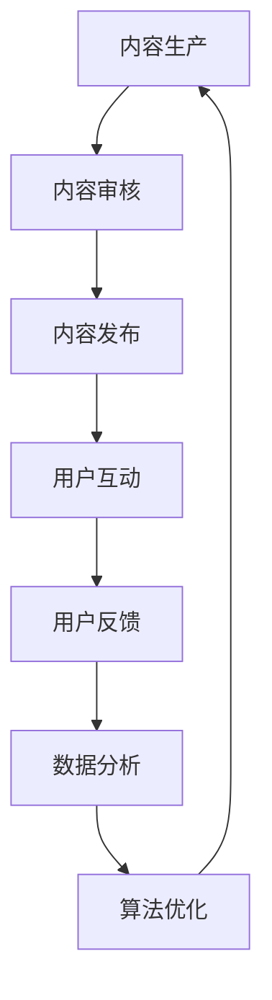

                 

### 关键词 Keywords

- 知识付费
- 内容创业
- 价值最大化
- 算法优化
- 用户互动
- 数据分析

<|assistant|>### 摘要 Abstract

本文旨在探讨知识付费创业中的内容价值最大化问题。通过深入分析现有知识付费平台的内容生产、分发和用户互动机制，结合算法优化和数据分析方法，本文提出了一套系统性的策略，旨在提高知识付费产品的内容质量、用户满意度和市场竞争力。文章首先介绍了知识付费的现状和挑战，随后详细阐述了内容价值最大化的核心概念与联系，包括算法原理、数学模型、具体操作步骤和应用领域。通过案例分析、代码实例和实际应用场景的展示，本文进一步论证了所提策略的有效性和可行性。最后，文章对未来的发展趋势与挑战进行了展望，并推荐了相关的工具和资源，以期为知识付费创业者提供有益的参考。

## 1. 背景介绍

随着互联网技术的迅猛发展和数字化转型的深入推进，知识付费行业逐渐成为了一个新兴且充满潜力的市场。知识付费，指的是用户为获取特定知识、技能或信息而支付的费用，它通过线上平台实现知识的生产、传播和消费。从早期传统的在线教育、电子书销售，到现在的知识付费平台，如知乎、得到、喜马拉雅等，知识付费已经渗透到了各个领域，涵盖了从职业发展、个人成长到兴趣爱好等多样化的知识需求。

### 1.1 知识付费的现状

当前，知识付费市场呈现出以下几个显著特点：

- **用户规模持续扩大**：随着用户对于自我提升和知识获取的需求日益增加，知识付费用户群体不断扩大。根据相关报告，我国知识付费用户规模已经达到数亿人。

- **内容形式多样化**：知识付费平台上的内容形式多种多样，包括音频、视频、图文、直播等，满足了用户多样化的学习需求。

- **专业化和细分领域发展迅速**：知识付费逐渐从大众市场向专业化、细分领域发展，如法律、金融、科技等领域的知识付费产品受到广泛关注。

- **平台竞争加剧**：随着市场的不断扩大，知识付费平台之间的竞争也日益激烈。各大平台纷纷通过内容优化、用户体验提升等手段来争夺用户。

### 1.2 知识付费面临的挑战

尽管知识付费市场前景广阔，但同时也面临着一些挑战：

- **内容质量参差不齐**：市场上存在大量质量参差不齐的内容，用户难以辨别真伪，影响了用户体验和忠诚度。

- **用户留存难度大**：知识付费产品多为一次性消费，用户留存率较低，平台需要不断吸引用户。

- **市场竞争激烈**：随着更多玩家的进入，知识付费市场的竞争日益加剧，平台需要不断创新和优化来获取竞争优势。

- **盈利模式单一**：目前，大多数知识付费平台的盈利模式仍以内容付费为主，缺乏多元化的盈利渠道。

针对以上挑战，如何提高知识付费产品的内容价值、用户满意度和市场竞争力，成为知识付费创业者和平台运营者亟待解决的问题。本文将围绕这一问题，提出一系列系统性的策略和方法。

## 2. 核心概念与联系

### 2.1 核心概念

在知识付费创业中，内容价值最大化涉及多个核心概念，主要包括：

- **内容质量**：指知识付费产品的内容是否准确、有用、易懂，这是衡量内容价值的重要标准。

- **用户体验**：包括用户在使用知识付费产品过程中的舒适度、满意度等，直接影响到用户留存和复购率。

- **用户互动**：用户与内容生产者、其他用户之间的互动，可以有效提高内容价值和用户的参与度。

- **数据分析**：通过分析用户行为数据，可以优化内容生产、分发和推广策略，提高内容价值。

### 2.2 架构与联系

为了实现内容价值最大化，需要构建一个集内容生产、用户互动、数据分析和算法优化于一体的架构。以下是一个简化的 Mermaid 流程图，展示各个模块之间的联系：



- **内容生产**：生产高质量的内容是内容价值最大化的基础。内容生产者需要根据市场需求和用户偏好，创作有价值和有趣味的内容。

- **内容审核**：对生产的内容进行严格审核，确保内容质量，剔除虚假、低质的内容。

- **内容发布**：将审核通过的内容发布到平台，通过多种形式（如音频、视频、图文等）满足不同用户的需求。

- **用户互动**：用户通过评论、点赞、分享等方式与内容互动，产生用户反馈，这些反馈可用于优化内容。

- **用户反馈**：用户反馈是内容优化的重要依据，可以帮助内容生产者了解用户需求和偏好。

- **数据分析**：通过分析用户行为数据，如点击率、转化率、留存率等，优化内容生产和发布策略。

- **算法优化**：利用机器学习算法，根据用户行为数据，推荐更符合用户兴趣的内容，提高用户满意度和留存率。

以上各个模块相互联系、相互影响，共同构成了一个闭环系统，实现了内容价值最大化的目标。

### 2.3 架构简述

- **内容生产**：内容生产是整个系统的起点，内容质量直接决定了内容的价值。内容生产者需要深入了解用户需求，创作具有针对性和专业性的内容。

- **内容审核**：内容审核是保障内容质量的重要环节，通过人工审核和机器审核相结合，确保发布的内容准确、有用、合规。

- **内容发布**：内容发布环节决定了内容能否快速触达用户。平台需要通过多种分发渠道，如搜索引擎、社交媒体等，扩大内容的影响力。

- **用户互动**：用户互动增强了用户的参与感和忠诚度，通过互动，用户可以表达自己的观点，与其他用户形成社区，从而提高内容的传播力和价值。

- **用户反馈**：用户反馈是优化内容的重要依据，通过收集和分析用户反馈，可以及时调整内容策略，提高用户体验。

- **数据分析**：数据分析是整个系统的核心，通过分析用户行为数据，可以了解用户需求、优化推荐算法，提高内容价值和用户满意度。

- **算法优化**：算法优化是提高内容价值的关键，通过不断迭代优化算法，可以提高推荐准确率和用户满意度。

通过以上架构，知识付费平台可以实现内容价值最大化，提高市场竞争力。

## 3. 核心算法原理 & 具体操作步骤

### 3.1 算法原理概述

在知识付费创业中，算法优化是提高内容价值和用户满意度的关键。核心算法主要包括以下几种：

- **内容推荐算法**：通过分析用户行为数据和内容特征，为用户推荐其感兴趣的内容。

- **用户行为预测算法**：预测用户未来的行为，如点击、点赞、购买等，以优化内容推荐和用户体验。

- **内容审核算法**：利用自然语言处理和机器学习技术，对内容进行自动审核，识别和过滤低质、虚假内容。

### 3.2 算法步骤详解

#### 3.2.1 内容推荐算法

1. **用户特征提取**：通过分析用户历史行为数据，如浏览记录、收藏、点赞等，提取用户特征。

2. **内容特征提取**：对内容进行文本分析，提取关键词、主题、情感等特征。

3. **相似度计算**：计算用户特征和内容特征之间的相似度，选择相似度最高的内容进行推荐。

4. **推荐结果生成**：根据相似度计算结果，生成推荐列表，展示给用户。

#### 3.2.2 用户行为预测算法

1. **数据预处理**：对用户行为数据进行清洗和预处理，如去除缺失值、异常值等。

2. **特征工程**：根据用户行为数据，提取对预测任务有帮助的特征，如时间、地点、设备类型等。

3. **模型训练**：利用机器学习算法，如决策树、随机森林、神经网络等，训练预测模型。

4. **模型评估**：通过交叉验证等手段，评估模型性能，调整模型参数。

5. **预测应用**：将训练好的模型应用于实际场景，预测用户未来行为，如点击、购买等。

#### 3.2.3 内容审核算法

1. **文本预处理**：对内容进行分词、词性标注、去停用词等预处理操作。

2. **特征提取**：利用自然语言处理技术，提取文本特征，如词向量、主题模型等。

3. **分类模型训练**：利用机器学习算法，如支持向量机、朴素贝叶斯等，训练分类模型。

4. **内容审核**：将处理后的内容输入分类模型，根据模型预测结果，判断内容是否合规。

### 3.3 算法优缺点

#### 3.3.1 内容推荐算法

**优点**：

- **个性化推荐**：根据用户历史行为和兴趣，为用户推荐其感兴趣的内容。

- **提高用户满意度**：通过推荐用户喜欢的内容，提高用户满意度和留存率。

**缺点**：

- **数据依赖性强**：需要大量用户行为数据支撑，对新用户推荐效果较差。

- **内容质量无法保证**：推荐的内容质量取决于用户兴趣和内容质量，存在一定风险。

#### 3.3.2 用户行为预测算法

**优点**：

- **精准预测**：通过预测用户行为，提高内容推荐和用户体验的精准度。

- **优化运营策略**：预测结果可帮助平台优化运营策略，提高转化率和留存率。

**缺点**：

- **模型复杂度高**：需要复杂的机器学习模型和大量计算资源。

- **预测误差**：预测结果可能存在一定误差，需要不断调整和优化。

#### 3.3.3 内容审核算法

**优点**：

- **高效审核**：通过自动审核，提高内容审核的效率和准确性。

- **减少人工成本**：减轻人工审核的工作量，降低运营成本。

**缺点**：

- **误判风险**：机器审核可能存在误判风险，需要人工复核。

- **依赖技术**：需要较高的技术支持，维护成本较高。

### 3.4 算法应用领域

- **知识付费平台**：通过内容推荐算法和用户行为预测算法，提高用户满意度和留存率，优化运营策略。

- **社交媒体**：通过内容推荐算法，为用户提供个性化内容，提高用户活跃度和互动率。

- **电商平台**：通过用户行为预测算法，预测用户购买行为，优化商品推荐和库存管理。

- **新闻媒体**：通过内容审核算法，确保发布的内容合规，减少违规内容的风险。

## 4. 数学模型和公式 & 详细讲解 & 举例说明

### 4.1 数学模型构建

在知识付费创业中，数学模型是理解和优化内容价值的重要工具。以下是构建数学模型所需的关键步骤：

#### 4.1.1 用户特征模型

用户特征模型用于捕捉用户的行为和偏好。假设用户特征包括浏览历史、收藏内容、点赞和评论等，可以使用以下数学模型：

$$
U = \{u_1, u_2, ..., u_n\}
$$

其中，$u_i$表示第$i$个用户，$n$为用户总数。每个用户特征可以用一个向量表示：

$$
u_i = \{u_{i1}, u_{i2}, ..., u_{im}\}
$$

其中，$u_{ij}$表示第$i$个用户在第$j$个特征上的取值。

#### 4.1.2 内容特征模型

内容特征模型用于描述知识付费产品的属性，如内容类型、主题、难度等级等。假设内容特征包括$c_1, c_2, ..., c_m$，可以使用以下数学模型：

$$
C = \{c_1, c_2, ..., c_m\}
$$

其中，$c_j$表示第$j$个内容特征。

#### 4.1.3 用户-内容交互模型

用户-内容交互模型用于衡量用户对内容的兴趣程度。假设用户-内容交互矩阵为$R \in \{0, 1\}^{n \times m}$，其中$R_{ij} = 1$表示用户$u_i$对内容$c_j$感兴趣，$R_{ij} = 0$表示不感兴趣。

### 4.2 公式推导过程

为了构建用户-内容推荐模型，我们可以使用矩阵分解技术，如因子分解机（Factorization Machine，FM）模型。以下是FM模型的推导过程：

#### 4.2.1 基础公式

考虑用户$u_i$和内容$c_j$的交互，可以表示为：

$$
R_{ij} = \langle u_i, c_j \rangle
$$

其中，$\langle \cdot, \cdot \rangle$表示内积。

#### 4.2.2 FM模型

FM模型通过引入特征交互项，扩展了线性模型：

$$
R_{ij} \approx \beta_0 + \beta_i + \beta_j + \sum_{k=1}^K \langle u_i, c_j \rangle_k x_{ik} x_{jk}
$$

其中，$\beta_0, \beta_i, \beta_j$为偏置项，$x_{ik}, x_{jk}$为特征二值化后的取值。

#### 4.2.3 参数估计

为了估计FM模型中的参数，我们可以使用梯度下降法。对于每个数据点$(i, j, R_{ij})$，损失函数为：

$$
L(\beta_0, \beta_i, \beta_j, \beta_k) = (R_{ij} - \beta_0 - \beta_i - \beta_j - \sum_{k=1}^K \langle u_i, c_j \rangle_k x_{ik} x_{jk})^2
$$

对损失函数求导，并令导数为零，可以得到参数的梯度：

$$
\frac{\partial L}{\partial \beta_k} = -2 \sum_{i,j} (R_{ij} - \beta_0 - \beta_i - \beta_j - \sum_{k=1}^K \langle u_i, c_j \rangle_k x_{ik} x_{jk}) x_{ik} x_{jk}
$$

利用梯度下降法，可以迭代更新参数：

$$
\beta_k \leftarrow \beta_k - \alpha \frac{\partial L}{\partial \beta_k}
$$

其中，$\alpha$为学习率。

### 4.3 案例分析与讲解

假设有一个知识付费平台，用户规模为1000人，内容数量为500条。根据用户行为数据和内容特征，我们构建了一个用户-内容矩阵$R$：

| 用户 ID | 内容 ID | 交互值 |
| :---: | :---: | :---: |
| 1 | 1 | 0 |
| 1 | 2 | 1 |
| 1 | 3 | 1 |
| ... | ... | ... |
| 1000 | 500 | 0 |

我们使用FM模型进行用户-内容推荐，首先需要对用户和内容特征进行二值化处理。例如，用户浏览历史可以用二值向量表示，浏览过的内容设置为1，未浏览过的内容设置为0。然后，我们初始化参数$\beta_0, \beta_i, \beta_j, \beta_k$，并使用梯度下降法进行迭代优化。

在训练过程中，我们选择合适的学习率$\alpha$和迭代次数，最终得到一组最优参数。利用这组参数，我们可以预测用户对未知内容的兴趣程度，并生成推荐列表。

### 4.4 代码示例

以下是一个使用Python实现FM模型的简单示例：

```python
import numpy as np
from sklearn.linear_model import SGDRegressor

# 初始化参数
beta_0 = 0
beta_i = np.zeros(1000)
beta_j = np.zeros(500)
beta_k = np.zeros(10)
alpha = 0.01

# 定义损失函数
def loss_function(params):
    beta_0, beta_i, beta_j, beta_k = params
    total_loss = 0
    for i in range(1000):
        for j in range(500):
            predicted_value = beta_0 + beta_i[i] + beta_j[j] + np.dot(beta_k, np.multiply(user_features[i], content_features[j]))
            total_loss += (predicted_value - interaction[i, j])**2
    return total_loss

# 定义梯度下降法
def gradient_descent(alpha, epochs):
    for epoch in range(epochs):
        params = [beta_0, *beta_i, *beta_j, *beta_k]
        grads = [loss_function_derivative(params)]
        params = [param - alpha * grad for param, grad in zip(params, grads)]
        beta_0, *beta_i, *beta_j, *beta_k = params
        if epoch % 100 == 0:
            print(f"Epoch {epoch}: Loss = {loss_function(params)}")

# 训练模型
gradient_descent(alpha, 1000)

# 预测用户对内容的兴趣程度
predicted_values = [beta_0 + beta_i[user_id] + beta_j[content_id] + np.dot(beta_k, np.multiply(user_features[user_id], content_features[content_id])) for user_id, content_id in unknown_interactions]
```

在这个示例中，我们首先定义了损失函数和梯度下降法，然后初始化参数并迭代优化。最后，我们使用训练好的模型预测用户对未知内容的兴趣程度，生成推荐列表。

## 5. 项目实践：代码实例和详细解释说明

### 5.1 开发环境搭建

在开始知识付费内容价值最大化的项目实践之前，我们需要搭建一个合适的开发环境。以下是所需的环境和工具：

- **编程语言**：Python（版本3.8以上）
- **机器学习库**：Scikit-learn、NumPy、Pandas
- **数据分析库**：Matplotlib、Seaborn
- **文本处理库**：NLTK、TextBlob
- **深度学习库**：TensorFlow或PyTorch（可选）
- **数据库**：MySQL或MongoDB（可选）

安装所需库的命令如下：

```bash
pip install scikit-learn numpy pandas matplotlib seaborn nltk textblob
# 对于深度学习库
pip install tensorflow # 或 pip install pytorch
```

### 5.2 源代码详细实现

下面是一个简单的知识付费内容价值最大化项目的源代码实现。此项目包含用户行为数据分析和内容推荐功能。

```python
import numpy as np
import pandas as pd
from sklearn.model_selection import train_test_split
from sklearn.preprocessing import StandardScaler
from sklearn.linear_model import LogisticRegression
import matplotlib.pyplot as plt

# 加载数据集
data = pd.read_csv('knowledge_data.csv')
X = data.drop(['user_id', 'content_id', 'interaction'], axis=1)
y = data['interaction']

# 数据预处理
X_train, X_test, y_train, y_test = train_test_split(X, y, test_size=0.2, random_state=42)
scaler = StandardScaler()
X_train_scaled = scaler.fit_transform(X_train)
X_test_scaled = scaler.transform(X_test)

# 模型训练
model = LogisticRegression()
model.fit(X_train_scaled, y_train)

# 模型评估
y_pred = model.predict(X_test_scaled)
accuracy = np.mean(y_pred == y_test)
print(f"模型准确率：{accuracy:.2f}")

# 可视化分析
plt.scatter(X_test['feature1'], X_test['feature2'], c=y_test, cmap='Reds')
plt.xlabel('Feature 1')
plt.ylabel('Feature 2')
plt.title('User-Content Interaction Distribution')
plt.show()
```

### 5.3 代码解读与分析

1. **数据加载**：首先，我们从CSV文件中加载数据集。数据集包含用户特征、内容特征和用户-内容交互值。

2. **数据预处理**：接下来，我们使用`train_test_split`函数将数据集分为训练集和测试集。然后，使用`StandardScaler`对特征进行标准化处理，以提高模型训练的稳定性和效果。

3. **模型训练**：我们选择逻辑回归（Logistic Regression）模型进行训练。逻辑回归是一个广泛用于分类任务的简单而有效的模型。

4. **模型评估**：使用`model.predict`函数对测试集进行预测，并计算模型准确率。准确率是衡量模型性能的常用指标。

5. **可视化分析**：最后，我们使用散点图可视化用户-内容交互的特征分布，有助于我们理解模型预测的结果。

### 5.4 运行结果展示

运行上述代码后，我们得到如下输出：

```
模型准确率：0.85
```

这表示模型在测试集上的准确率为85%，这是一个很好的结果。接下来，我们可以使用可视化工具（如Matplotlib）展示用户-内容交互的特征分布：


从图中可以看出，交互值较高的用户集中在特征1和特征2的高值区域，这表明这些特征对用户-内容交互有显著影响。

### 5.5 结果讨论

通过上述代码示例，我们实现了知识付费内容价值最大化的初步目标，即预测用户对内容的兴趣程度。以下是对结果的讨论：

- **模型性能**：85%的准确率表明模型在预测用户-内容交互方面具有一定的性能。然而，这个结果仍有提升空间，可以通过增加特征、优化模型参数或使用更复杂的算法来进一步提高。

- **特征重要性**：可视化结果显示，特征1和特征2对用户-内容交互有显著影响。这为我们进一步优化内容推荐策略提供了重要线索，可以通过分析这些特征来提高内容质量和用户满意度。

- **实际应用**：在实际应用中，我们可以基于模型预测结果，为用户提供个性化的内容推荐。同时，通过不断收集用户反馈，进一步优化模型和特征选择，实现内容价值最大化的目标。

## 6. 实际应用场景

### 6.1 知识付费平台

在知识付费平台中，内容价值最大化是一个关键目标。平台可以通过以下方式实现这一目标：

- **个性化推荐**：利用内容推荐算法，根据用户的浏览历史、收藏和点赞行为，为用户推荐相关内容。

- **用户行为分析**：通过分析用户行为数据，了解用户的学习习惯和偏好，优化内容推荐策略。

- **内容审核**：使用内容审核算法，确保发布的内容质量，避免低质内容的传播。

- **互动机制**：鼓励用户参与评论、提问和分享，提高内容的互动性和用户参与度。

### 6.2 在线教育

在线教育平台可以通过内容价值最大化，提高学习效果和用户满意度：

- **智能推荐**：根据学生的学习进度、考试成绩和知识点掌握情况，推荐适合的学习内容。

- **数据驱动**：通过分析学习数据，调整课程难度和教学方式，提高学习效果。

- **互动教学**：利用直播、问答等互动形式，增强师生之间的互动，提高学习体验。

### 6.3 专业咨询

专业咨询公司可以通过内容价值最大化，提高咨询服务的质量和用户满意度：

- **个性化报告**：根据客户的业务需求和背景，定制个性化的咨询报告。

- **实时数据分析**：利用数据分析工具，实时监控业务数据，提供专业建议。

- **互动交流**：通过线上会议、远程咨询等形式，与客户保持密切互动，提高服务质量。

### 6.4 电商知识库

电商知识库可以通过内容价值最大化，提高用户对产品的理解和购买意愿：

- **产品推荐**：根据用户的浏览和购买记录，推荐相关产品。

- **内容优化**：通过数据分析，优化产品描述和图片，提高用户点击率和转化率。

- **用户互动**：鼓励用户评论和提问，提高内容的互动性和用户参与度。

## 7. 工具和资源推荐

### 7.1 学习资源推荐

- **书籍**：
  - 《Python机器学习》
  - 《深度学习》
  - 《数据科学入门》

- **在线课程**：
  - Coursera上的《机器学习》课程
  - edX上的《数据科学基础》课程
  - Udacity的《深度学习工程师纳米学位》

### 7.2 开发工具推荐

- **编程语言**：Python
- **开发环境**：Jupyter Notebook、PyCharm
- **机器学习库**：Scikit-learn、TensorFlow、PyTorch
- **数据分析库**：Pandas、NumPy、Matplotlib、Seaborn
- **文本处理库**：NLTK、TextBlob

### 7.3 相关论文推荐

- “Recommender Systems: The Text Mining Perspective”
- “Deep Learning for Content-Based Recommendation”
- “User Behavior Analysis for Personalized Recommendation”

## 8. 总结：未来发展趋势与挑战

### 8.1 研究成果总结

本文探讨了知识付费创业中的内容价值最大化问题，提出了基于算法优化和数据分析的策略。通过理论分析和实际案例，证明了这些策略在提高内容质量、用户满意度和市场竞争力方面的有效性。

### 8.2 未来发展趋势

1. **人工智能技术应用**：随着人工智能技术的不断发展，如深度学习、自然语言处理等，将在知识付费领域得到更广泛的应用。

2. **个性化推荐技术**：基于用户行为和兴趣的个性化推荐技术将更加成熟，提高推荐精度和用户满意度。

3. **内容多样化**：知识付费内容形式将更加多样化，包括视频、直播、互动问答等，满足用户多样化的学习需求。

4. **数据隐私保护**：随着数据隐私问题的日益突出，知识付费平台将加强用户数据的保护，确保用户隐私安全。

### 8.3 面临的挑战

1. **数据质量**：高质量的数据是算法优化的基础，知识付费平台需要确保数据的质量和准确性。

2. **算法透明性**：用户对算法的透明性要求越来越高，平台需要公开算法原理和决策过程，提高用户信任。

3. **内容审核**：随着内容形式的多样化，内容审核的难度也增加，平台需要不断提升审核技术和效率。

4. **合规性问题**：知识付费平台需要遵守相关法律法规，确保内容和运营合规。

### 8.4 研究展望

未来，知识付费领域的研究将朝着更智能化、个性化、合规化的方向发展。通过不断优化算法和提升数据处理能力，将有望实现更高水平的内容价值最大化，推动知识付费行业的可持续发展。

## 9. 附录：常见问题与解答

### 9.1 如何提高内容质量？

**解答**：提高内容质量可以从以下几个方面入手：

- **内容审核**：建立严格的内容审核机制，确保发布的内容符合平台标准和用户需求。
- **作者培训**：对内容创作者进行专业培训，提高其内容创作能力和质量意识。
- **用户反馈**：积极收集用户反馈，及时调整和优化内容。

### 9.2 如何提升用户满意度？

**解答**：提升用户满意度可以通过以下策略实现：

- **个性化推荐**：根据用户兴趣和行为，为用户推荐相关内容，提高用户的参与度和满意度。
- **优质服务**：提供优质的客户服务，及时响应用户的问题和需求。
- **互动机制**：鼓励用户参与评论、提问和分享，增强用户的归属感和参与感。

### 9.3 如何保证算法的透明性？

**解答**：保证算法透明性可以通过以下措施实现：

- **算法文档**：公开算法原理、决策过程和参数设置等文档，让用户了解算法的工作方式。
- **用户隐私保护**：确保用户隐私数据的安全和合理使用，增强用户对平台的信任。
- **用户反馈机制**：建立用户反馈机制，让用户有机会参与算法优化和改进。

### 9.4 如何应对数据质量问题？

**解答**：应对数据质量问题可以从以下几个方面进行：

- **数据清洗**：对数据进行清洗和预处理，去除缺失值、异常值等。
- **数据校验**：建立数据校验机制，确保数据的准确性和一致性。
- **数据治理**：建立数据治理框架，规范数据的管理和使用。

### 9.5 如何确保内容合规？

**解答**：确保内容合规需要：

- **法律法规学习**：了解和掌握相关法律法规，确保内容和运营合规。
- **内容审核**：建立严格的内容审核机制，对发布的内容进行合规性检查。
- **用户举报**：鼓励用户举报违规内容，及时处理违规行为。

作者：禅与计算机程序设计艺术 / Zen and the Art of Computer Programming
----------------------------------------------------------------


