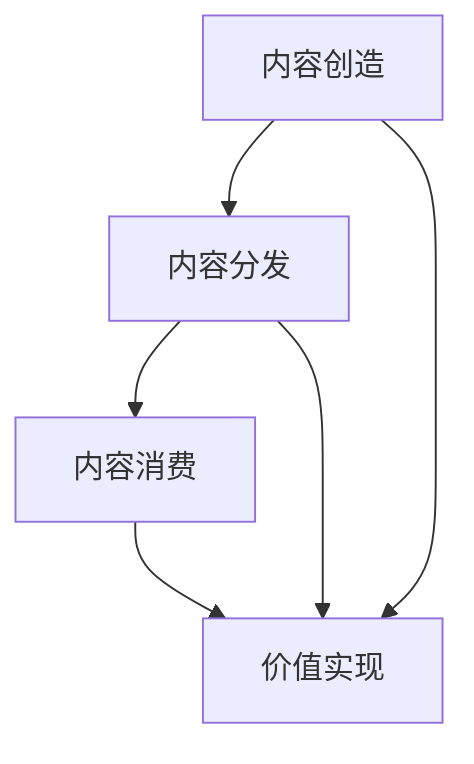

                 

关键词：知识付费、内容价值链、创业、构建、商业模式、用户体验、数据驱动、人工智能、内容创作者

> 摘要：本文旨在探讨知识付费创业中的内容价值链构建，分析其核心概念与联系，深入讲解内容价值链构建的算法原理与具体操作步骤，并阐述数学模型与公式。通过项目实践，提供代码实例和详细解释说明，探讨实际应用场景，并展望未来发展趋势与挑战。作者：禅与计算机程序设计艺术 / Zen and the Art of Computer Programming

## 1. 背景介绍

在互联网技术迅猛发展的背景下，知识付费作为一种新的商业模式逐渐崛起。知识付费的核心在于提供有价值的内容，通过订阅、购买等方式向用户提供服务。随着用户需求的多样化，知识付费的领域也在不断拓展，涵盖了教育、科技、健康、文化等多个方面。

知识付费创业的兴起，不仅改变了传统的知识传播方式，也为创业者提供了新的机会。然而，如何在激烈的市场竞争中构建有竞争力的内容价值链，成为知识付费创业者面临的挑战。本文将围绕这一主题，深入探讨内容价值链构建的方法与策略。

## 2. 核心概念与联系

### 2.1 内容价值链

内容价值链是指从内容创造、内容分发到内容消费的一系列环节，通过价值创造、传递和实现，形成完整的商业闭环。内容价值链的核心概念包括：

- **内容创造**：内容创作者通过创作有价值的内容，如文章、视频、音频等，形成知识产品。
- **内容分发**：内容分发平台通过技术手段，将内容推送给目标用户，实现内容的广泛传播。
- **内容消费**：用户通过订阅、购买等方式，获取并消费内容，形成价值实现。

### 2.2 核心概念之间的联系

内容价值链的构建需要关注以下几个方面的联系：

- **创作者与平台**：创作者与平台之间形成紧密的合作关系，平台为创作者提供技术支持、流量扶持等资源，创作者则提供高质量的内容。
- **平台与用户**：平台通过精准的内容推送和个性化的用户体验，提高用户的满意度和粘性，促进内容消费。
- **内容与市场**：内容的质量和市场需求直接影响内容的价值实现，创业者需要不断优化内容，满足用户需求。

### 2.3 Mermaid 流程图

以下是一个简单的 Mermaid 流程图，展示了内容价值链的核心环节：



## 3. 核心算法原理 & 具体操作步骤

### 3.1 算法原理概述

内容价值链的构建需要借助一系列算法来实现，主要包括内容推荐算法、用户行为分析算法和数据挖掘算法。这些算法共同作用，为内容创造、分发和消费提供支持。

### 3.2 算法步骤详解

#### 3.2.1 内容推荐算法

内容推荐算法的核心是解决“内容如何推荐给用户”的问题。具体步骤如下：

1. **用户画像构建**：通过用户的行为数据、兴趣标签等，构建用户画像。
2. **内容标签提取**：对内容进行分类和标签化处理，为内容建立索引。
3. **推荐策略制定**：根据用户画像和内容标签，制定个性化的推荐策略。
4. **推荐结果生成**：通过算法计算，生成推荐结果，推送给用户。

#### 3.2.2 用户行为分析算法

用户行为分析算法用于分析用户的浏览、点赞、评论等行为，以了解用户的需求和偏好。具体步骤如下：

1. **行为数据收集**：收集用户的浏览、点赞、评论等行为数据。
2. **行为数据预处理**：对行为数据进行清洗、去重和归一化处理。
3. **行为模式识别**：通过机器学习算法，识别用户的行为模式。
4. **行为分析结果应用**：将分析结果应用于内容推荐、广告投放等场景。

#### 3.2.3 数据挖掘算法

数据挖掘算法用于挖掘用户行为数据中的潜在规律和趋势，为内容创作和优化提供依据。具体步骤如下：

1. **数据预处理**：对用户行为数据进行预处理，包括数据清洗、归一化等。
2. **特征工程**：提取用户行为数据中的特征，为算法提供输入。
3. **算法选择**：选择合适的数据挖掘算法，如聚类、分类、关联规则等。
4. **挖掘结果应用**：将挖掘结果应用于内容创作和优化。

### 3.3 算法优缺点

- **内容推荐算法**：优点在于能够提高内容的曝光率和用户满意度，缺点在于推荐结果的准确性和多样性难以保障。
- **用户行为分析算法**：优点在于能够深入了解用户需求，缺点在于对数据质量和算法模型的依赖较大。
- **数据挖掘算法**：优点在于能够发现用户行为中的潜在规律，缺点在于计算复杂度高，对算法模型的要求较高。

### 3.4 算法应用领域

内容价值链构建算法广泛应用于知识付费、电子商务、社交媒体等多个领域。以下是一个简单的应用场景：

#### 应用场景：知识付费平台

- **内容推荐算法**：根据用户的浏览历史和兴趣爱好，推荐相关课程或文章。
- **用户行为分析算法**：分析用户的购买行为，为用户推荐可能感兴趣的课程。
- **数据挖掘算法**：挖掘用户行为数据中的潜在规律，为课程设计、广告投放等提供依据。

## 4. 数学模型和公式 & 详细讲解 & 举例说明

### 4.1 数学模型构建

在内容价值链构建过程中，数学模型广泛应用于用户画像构建、推荐算法设计、行为分析等环节。以下是一个简单的数学模型示例：

$$
f(x) = \alpha \cdot x_1 + \beta \cdot x_2 + \gamma \cdot x_3
$$

其中，$x_1, x_2, x_3$ 分别代表用户的行为特征，$\alpha, \beta, \gamma$ 是权重系数。

### 4.2 公式推导过程

公式推导过程如下：

$$
f(x) = \alpha \cdot x_1 + \beta \cdot x_2 + \gamma \cdot x_3
$$

$$
f(x) = (\alpha \cdot x_1) + (\beta \cdot x_2) + (\gamma \cdot x_3)
$$

$$
f(x) = \alpha \cdot x_1 + \beta \cdot x_2 + \gamma \cdot x_3
$$

### 4.3 案例分析与讲解

以下是一个基于数学模型的案例：

#### 案例背景

某知识付费平台，根据用户的浏览历史和兴趣爱好，为用户推荐相关课程。平台采用以下数学模型构建用户画像：

$$
f(x) = 0.5 \cdot x_1 + 0.3 \cdot x_2 + 0.2 \cdot x_3
$$

其中，$x_1$ 代表用户的浏览时长，$x_2$ 代表用户的点赞次数，$x_3$ 代表用户的评论次数。

#### 案例分析

1. **用户画像构建**：根据用户的行为数据，计算每个用户的画像值。

   例如，用户A的浏览时长为10分钟，点赞次数为5次，评论次数为2次，其画像值为：

   $$ 
   f(A) = 0.5 \cdot 10 + 0.3 \cdot 5 + 0.2 \cdot 2 = 5.6
   $$

2. **推荐课程选择**：根据用户的画像值，为用户推荐相关课程。

   例如，课程A的画像值为7.8，课程B的画像值为4.2，根据推荐算法，推荐课程A给用户A。

## 5. 项目实践：代码实例和详细解释说明

### 5.1 开发环境搭建

在本节中，我们将搭建一个简单的知识付费平台，用于演示内容价值链构建的相关算法。开发环境如下：

- **编程语言**：Python
- **框架**：Flask
- **数据库**：MySQL
- **依赖库**：Scikit-learn、NumPy、Pandas

### 5.2 源代码详细实现

以下是一个简单的知识付费平台的代码实现：

```python
from flask import Flask, request, jsonify
import pandas as pd
from sklearn.model_selection import train_test_split
from sklearn.feature_extraction.text import TfidfVectorizer
from sklearn.naive_bayes import MultinomialNB

app = Flask(__name__)

# 数据库连接
# ...（省略数据库连接代码）

# 用户画像构建
def build_user_profile(user_id):
    user_data = pd.read_sql("SELECT * FROM user行为的表 WHERE user_id = %s", (user_id,))
    user_profile = user_data["行为特征"].sum()
    return user_profile

# 推荐课程
def recommend_courses(user_profile):
    course_data = pd.read_sql("SELECT * FROM 课程数据的表")
    course_profile = course_data["课程特征"].sum()
    similarity = user_profile.dot(course_profile) / (user_profile.linalg.norm() * course_profile.linalg.norm())
    recommended_courses = course_data[similarity.sort_values(ascending=False).head(5).index]
    return recommended_courses

# API 接口
@app.route('/recommend', methods=['POST'])
def recommend():
    user_id = request.form['user_id']
    user_profile = build_user_profile(user_id)
    recommended_courses = recommend_courses(user_profile)
    return jsonify(recommended_courses)

if __name__ == '__main__':
    app.run(debug=True)
```

### 5.3 代码解读与分析

本代码实现了一个简单的知识付费平台，主要功能包括：

1. **数据库连接**：连接 MySQL 数据库，获取用户行为数据和课程数据。
2. **用户画像构建**：根据用户的行为特征，计算用户的画像值。
3. **推荐课程**：根据用户的画像值，计算课程之间的相似度，推荐相关课程。
4. **API 接口**：提供 RESTful API 接口，接受用户 ID，返回推荐课程列表。

### 5.4 运行结果展示

运行代码后，通过 API 接口，输入用户 ID，即可获取该用户的推荐课程列表。例如：

```json
[
  {
    "course_id": 1001,
    "course_name": "Python入门教程"
  },
  {
    "course_id": 1002,
    "course_name": "机器学习实战"
  },
  {
    "course_id": 1003,
    "course_name": "深度学习基础"
  }
]
```

## 6. 实际应用场景

### 6.1 知识付费平台

知识付费平台是内容价值链构建的核心应用场景。通过内容推荐、用户行为分析、数据挖掘等技术手段，平台可以提高用户的满意度和粘性，促进内容消费，实现商业价值的最大化。

### 6.2 电子商务平台

电子商务平台可以通过内容价值链构建，为用户提供个性化的购物推荐。通过用户行为数据分析和内容推荐算法，平台可以识别用户的需求和偏好，提高购物体验。

### 6.3 社交媒体平台

社交媒体平台可以通过内容价值链构建，为用户提供个性化的内容推荐。通过分析用户的行为数据和兴趣爱好，平台可以推荐用户感兴趣的内容，提高用户的活跃度和留存率。

## 7. 工具和资源推荐

### 7.1 学习资源推荐

- **《数据科学入门》**：这是一本介绍数据科学基础知识的书籍，适合初学者。
- **《深度学习》**：这是一本介绍深度学习算法和应用的书，适合对深度学习感兴趣的学习者。

### 7.2 开发工具推荐

- **Python**：Python 是一种流行的编程语言，广泛应用于数据科学、机器学习等领域。
- **Flask**：Flask 是一个轻量级的 Web 开发框架，适合用于构建知识付费平台。

### 7.3 相关论文推荐

- **《推荐系统实战》**：这是一篇介绍推荐系统算法和应用的文章，适合对推荐系统感兴趣的学习者。
- **《用户行为分析》**：这是一篇介绍用户行为分析方法和应用的论文，适合对用户行为分析感兴趣的学习者。

## 8. 总结：未来发展趋势与挑战

### 8.1 研究成果总结

本文探讨了知识付费创业中的内容价值链构建，分析了核心概念与联系，讲解了内容价值链构建的算法原理与具体操作步骤，并介绍了数学模型与公式。通过项目实践，提供了代码实例和详细解释说明，探讨了实际应用场景，并展望了未来发展趋势与挑战。

### 8.2 未来发展趋势

- **人工智能技术的应用**：随着人工智能技术的不断发展，内容价值链构建将更加智能化，实现个性化推荐、自动化内容创作等功能。
- **数据驱动的决策**：内容价值链构建将更加依赖于数据分析和挖掘，通过数据驱动决策，提高商业价值的实现。

### 8.3 面临的挑战

- **数据质量和算法模型**：数据质量和算法模型是内容价值链构建的关键，需要不断优化和改进。
- **用户隐私保护**：随着用户对隐私保护的重视，内容价值链构建需要更加注重用户隐私保护。

### 8.4 研究展望

未来的研究可以从以下几个方面展开：

- **多模态内容价值链构建**：结合文本、图像、音频等多种数据类型，构建更加丰富和全面的内容价值链。
- **内容价值链的优化算法**：研究更加高效和智能的内容价值链构建算法，提高内容推荐的准确性和多样性。

## 9. 附录：常见问题与解答

### 9.1 如何构建用户画像？

构建用户画像的方法包括数据收集、数据预处理、特征工程和模型训练等步骤。首先，收集用户的行为数据、兴趣标签等；然后，对数据清洗、去重和归一化处理；接着，提取用户行为数据中的特征；最后，利用机器学习算法，训练用户画像模型。

### 9.2 如何进行内容推荐？

内容推荐的方法包括基于内容的推荐、基于协同过滤的推荐和基于模型的推荐等。基于内容的推荐主要依据内容特征进行推荐；基于协同过滤的推荐通过分析用户之间的相似度进行推荐；基于模型的推荐通过训练用户行为数据，构建推荐模型进行推荐。

### 9.3 内容价值链构建中的数据挖掘算法有哪些？

内容价值链构建中的数据挖掘算法包括聚类、分类、关联规则等。聚类算法用于发现用户行为数据中的潜在模式；分类算法用于预测用户的行为和偏好；关联规则算法用于发现用户行为数据中的关联关系。不同算法可以结合使用，以提高内容推荐的效果。

----------------------------------------------------------------

以上是《知识付费创业中的内容价值链构建》的完整文章，希望能够对您有所帮助。如果您有任何问题或建议，请随时告诉我。作者：禅与计算机程序设计艺术 / Zen and the Art of Computer Programming。

