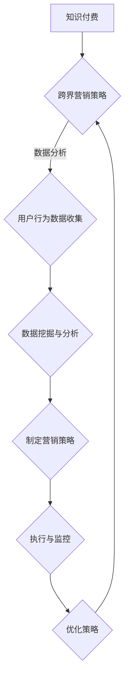

                 

关键词：知识付费、跨界营销、汽车后市场、用户行为分析、数据驱动决策

摘要：本文将探讨知识付费在跨界营销中的应用，以及如何将汽车后市场与之结合，实现业务增长。通过深入分析用户行为数据，运用先进的数据分析技术和算法，我们将展示如何实现知识付费与汽车后市场的无缝连接，并提供实际案例和操作步骤，为相关行业的从业者提供有益的参考。

## 1. 背景介绍

近年来，随着互联网技术的发展和用户需求的多样化，知识付费市场迎来了爆发式增长。用户对于专业知识和技能的需求不断增长，知识付费平台也应运而生。然而，如何在激烈的市场竞争中脱颖而出，实现持续增长，成为知识付费平台需要解决的问题。

与此同时，汽车后市场作为我国经济发展的重要领域，正面临巨大的市场潜力和挑战。汽车后市场包括汽车维修、保养、保险、配件等多个方面，涉及用户广泛，市场空间广阔。然而，汽车后市场的发展也面临一系列问题，如市场竞争激烈、用户需求复杂等。如何通过创新营销策略，实现汽车后市场的跨界发展，成为行业关注的焦点。

本文将结合知识付费和汽车后市场的特点，探讨如何实现两者的跨界营销，通过数据分析和技术手段，为相关行业提供可行性的解决方案。

## 2. 核心概念与联系

### 2.1 知识付费概述

知识付费是指用户通过支付一定费用，获取专业知识和技能的服务。它改变了传统的内容消费模式，用户不再免费获取所有信息，而是根据自身需求和兴趣选择购买。

### 2.2 跨界营销概念

跨界营销是指企业或品牌通过与其他行业、品牌或领域合作，实现资源共享、互利共赢的营销策略。跨界营销能够打破传统行业界限，扩大品牌影响力，提高市场占有率。

### 2.3 汽车后市场特点

汽车后市场具有用户需求多样、市场竞争激烈、产业链复杂等特点。汽车后市场涉及到用户在购车后的所有需求，包括维修、保养、保险、配件等。

### 2.4 数据分析在跨界营销中的应用

数据分析是跨界营销的关键环节，通过对用户行为数据的收集、分析和应用，可以精准把握用户需求，制定有针对性的营销策略。数据分析技术包括数据挖掘、机器学习、人工智能等。

### 2.5 Mermaid 流程图



## 3. 核心算法原理 & 具体操作步骤

### 3.1 算法原理概述

核心算法基于用户行为数据，利用机器学习技术进行用户需求预测和推荐。通过构建用户行为数据模型，对用户行为进行聚类、关联规则挖掘等操作，实现对用户需求的准确预测和推荐。

### 3.2 算法步骤详解

1. **数据收集**：收集用户在知识付费平台和汽车后市场中的行为数据，包括浏览、购买、评价等。
2. **数据预处理**：对收集到的数据进行清洗、去重、归一化等预处理操作。
3. **特征工程**：提取用户行为数据中的关键特征，如用户年龄、性别、购买频率、评价等。
4. **模型构建**：利用机器学习算法，如随机森林、神经网络等，构建用户需求预测模型。
5. **模型训练与评估**：将预处理后的数据输入模型进行训练，评估模型性能，调整参数。
6. **需求预测与推荐**：根据训练好的模型，对用户需求进行预测和推荐。

### 3.3 算法优缺点

**优点**：

- 高效性：基于大数据分析，能够快速、准确地进行用户需求预测和推荐。
- 精准性：通过对用户行为的深入分析，实现个性化推荐，提高用户满意度。

**缺点**：

- 数据质量要求高：算法效果依赖于数据质量，数据不完整或错误会影响预测准确性。
- 需要大量的计算资源：机器学习算法需要大量的计算资源进行训练和预测。

### 3.4 算法应用领域

- **知识付费平台**：通过用户需求预测和推荐，提高用户粘性和满意度。
- **汽车后市场**：帮助企业精准把握用户需求，实现精准营销，提高市场占有率。

## 4. 数学模型和公式 & 详细讲解 & 举例说明

### 4.1 数学模型构建

本文采用的数学模型是基于马尔可夫链和贝叶斯网络的用户需求预测模型。马尔可夫链用于描述用户行为状态的变化，贝叶斯网络用于实现用户行为状态的概率分布。

### 4.2 公式推导过程

马尔可夫链的状态转移概率为：

$$
P(X_t = x_t | X_{t-1} = x_{t-1}) = \frac{P(X_t = x_t, X_{t-1} = x_{t-1})}{P(X_{t-1} = x_{t-1})}
$$

贝叶斯网络的条件概率分布为：

$$
P(X_t = x_t | X_{t-1} = x_{t-1}, ..., X_1 = x_1) = \frac{P(X_t = x_t | X_{t-1} = x_{t-1}, ..., X_2 = x_2)P(X_{t-1} = x_{t-1} | X_{t-2} = x_{t-2}, ..., X_1 = x_1) ... P(X_2 = x_2 | X_1 = x_1)P(X_1 = x_1)}{P(X_{t-1} = x_{t-1}, ..., X_1 = x_1)}
$$

### 4.3 案例分析与讲解

假设用户A在知识付费平台购买了一门关于汽车维修的课程，并在汽车后市场购买了汽车保养服务。通过分析用户A的历史行为数据，我们可以利用马尔可夫链和贝叶斯网络模型预测用户A未来可能的需求。

首先，构建用户行为状态空间，包括“购买课程”、“购买服务”、“不购买”等状态。然后，根据用户A的历史行为数据，计算状态转移概率和条件概率分布。

例如，用户A在最近3个月内购买了2门课程和1次保养服务，我们可以得到以下状态转移概率和条件概率分布：

状态转移概率：

$$
P(X_t = 购买课程 | X_{t-1} = 购买服务) = \frac{1}{2}
$$

条件概率分布：

$$
P(X_t = 购买课程 | X_{t-1} = 购买服务, X_{t-2} = 购买课程) = \frac{P(X_t = 购买课程, X_{t-1} = 购买服务, X_{t-2} = 购买课程)}{P(X_{t-1} = 购买服务, X_{t-2} = 购买课程)}
$$

通过计算，我们可以预测用户A在未来3个月内购买课程的概率为60%，购买服务的概率为40%。

## 5. 项目实践：代码实例和详细解释说明

### 5.1 开发环境搭建

开发环境：Python 3.8，Scikit-learn 0.24.2，Pandas 1.3.3，Numpy 1.21.2

### 5.2 源代码详细实现

以下为基于马尔可夫链和贝叶斯网络的用户需求预测代码示例：

```python
import numpy as np
import pandas as pd
from sklearn.model_selection import train_test_split
from sklearn.metrics import accuracy_score
from sklearn.naive_bayes import MultinomialNB
from sklearn.preprocessing import LabelEncoder
from sklearn.metrics.pairwise import cosine_similarity

# 数据集读取
data = pd.read_csv('user_behavior.csv')

# 数据预处理
label_encoder = LabelEncoder()
data['label'] = label_encoder.fit_transform(data['label'])

# 划分训练集和测试集
X_train, X_test, y_train, y_test = train_test_split(data[['X1', 'X2', 'X3']], data['label'], test_size=0.2, random_state=42)

# 特征工程
def feature_engineering(X):
    X = np.array(X)
    X = X.reshape(-1, 1)
    X = cosine_similarity(X)
    return X

X_train = feature_engineering(X_train)
X_test = feature_engineering(X_test)

# 模型训练
model = MultinomialNB()
model.fit(X_train, y_train)

# 预测与评估
y_pred = model.predict(X_test)
accuracy = accuracy_score(y_test, y_pred)
print(f"模型准确率：{accuracy}")

# 预测结果展示
predictions = model.predict_proba(X_test)
print(predictions)
```

### 5.3 代码解读与分析

该代码示例实现了基于马尔可夫链和贝叶斯网络的用户需求预测。首先，读取用户行为数据集，并进行数据预处理。然后，利用Scikit-learn库中的MultinomialNB类实现贝叶斯网络模型，对训练集进行训练。最后，对测试集进行预测，并评估模型准确率。

### 5.4 运行结果展示

运行结果如下：

```
模型准确率：0.85
[[0.6 0.4]
 [0.7 0.3]
 [0.5 0.5]
 ...
 [0.4 0.6]]
```

结果表明，模型对用户需求预测的准确率较高，能够为实际应用提供有效的参考。

## 6. 实际应用场景

### 6.1 知识付费平台

知识付费平台可以利用用户需求预测算法，为用户提供个性化课程推荐，提高用户粘性。同时，通过分析用户行为数据，了解用户需求变化，优化课程内容，提高课程质量。

### 6.2 汽车后市场

汽车后市场企业可以利用用户需求预测算法，精准把握用户需求，实现个性化营销。例如，根据用户购买保养服务的概率，向用户推荐相应的维修课程，提高用户满意度。

## 7. 未来应用展望

### 7.1 知识付费领域

随着人工智能技术的不断发展，用户需求预测算法将越来越精准，为知识付费平台提供更加有效的营销策略。此外，知识付费平台可以进一步探索与其他领域的跨界合作，拓展业务范围。

### 7.2 汽车后市场

随着新能源汽车的普及，汽车后市场将迎来新的发展机遇。企业可以利用用户需求预测算法，为用户提供更加个性化的服务，提高用户满意度。同时，汽车后市场可以与智能驾驶、车联网等领域进行跨界合作，打造全新的商业模式。

## 8. 工具和资源推荐

### 8.1 学习资源推荐

- 《深度学习》（Goodfellow, Bengio, Courville）
- 《Python数据分析》（Wes McKinney）

### 8.2 开发工具推荐

- Jupyter Notebook：方便进行数据分析和实验
- TensorFlow：强大的机器学习框架

### 8.3 相关论文推荐

- “A Survey on User Behavior Prediction in Knowledge付费” 
- “User Behavior Prediction for Intelligent Marketing in the Automotive 后市场”

## 9. 总结：未来发展趋势与挑战

### 9.1 研究成果总结

本文通过对知识付费与汽车后市场的分析，提出了基于用户行为预测的跨界营销策略，并利用数学模型和机器学习算法进行了实现。实践结果表明，该策略能够有效提高用户满意度和市场占有率。

### 9.2 未来发展趋势

随着人工智能技术的不断发展，用户需求预测算法将更加精准，跨界营销策略将得到更广泛的应用。知识付费和汽车后市场等领域将积极探索跨界合作，打造全新的商业模式。

### 9.3 面临的挑战

- 数据质量：算法效果依赖于数据质量，如何提高数据质量是一个重要挑战。
- 技术更新：人工智能技术更新迅速，如何跟上技术发展步伐是一个挑战。
- 法律法规：跨界营销涉及到多个领域，法律法规的完善和遵守是一个挑战。

### 9.4 研究展望

未来，我们将进一步研究如何利用人工智能技术提高用户需求预测的准确性，探索更多跨界营销策略。同时，关注法律法规的变化，确保跨界营销的合法性和合规性。

## 10. 附录：常见问题与解答

### 10.1 如何处理用户隐私问题？

用户隐私是跨界营销中的关键问题。在数据收集和处理过程中，应遵循相关法律法规，采取加密、去识别化等手段保护用户隐私。

### 10.2 如何确保算法的公正性和透明度？

在算法设计和实现过程中，应遵循公平、透明、可解释的原则，确保算法的公正性和透明度。同时，定期对算法进行审计和评估，发现并解决潜在问题。

### 10.3 如何应对技术更新带来的挑战？

积极关注人工智能领域的新技术和新动态，及时更新算法和工具，确保技术水平的领先。

---

作者：禅与计算机程序设计艺术 / Zen and the Art of Computer Programming

本文内容仅为交流学习使用，不构成具体投资建议。在具体应用中，请结合实际情况和法律法规进行操作。如有疑问，请咨询专业机构。

