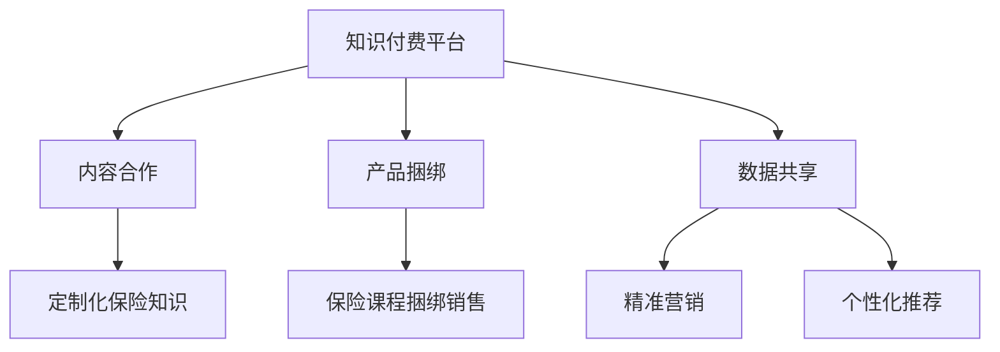

                 

在这个数字化时代，知识付费已经成为一种趋势，它不仅丰富了个人和企业的学习资源，也为内容创作者带来了新的收入来源。然而，如何实现知识付费的跨界营销，尤其是如何与金融保险行业实现跨界合作，成为了一个值得探讨的问题。本文将深入分析这一话题，提供专业的视角和实用的建议。

## 关键词
- 知识付费
- 跨界营销
- 金融保险
- 营销策略
- 数据分析
- 合作模式
- 持续创新

## 摘要
本文旨在探讨知识付费行业如何通过跨界营销与金融保险行业的合作，实现共赢。文章首先介绍了知识付费的现状和发展趋势，然后分析了跨界营销的概念及其在知识付费中的应用。接着，我们探讨了金融保险行业与知识付费行业的合作模式，并提供了具体案例和策略建议。最后，文章总结了未来知识付费与金融保险跨界合作的发展趋势和挑战。

## 1. 背景介绍
### 1.1 知识付费的崛起
随着互联网技术的发展和人们对知识需求的增加，知识付费已经成为一个不可忽视的市场。从线上课程、专业培训到知识付费问答平台，知识付费的形式越来越多样化。据数据显示，2020年全球知识付费市场规模已超过2000亿美元，预计未来几年将继续保持快速增长。

### 1.2 金融保险行业的现状
金融保险行业作为传统的服务行业，也在积极探索数字化转型。人工智能、大数据等技术的应用，使得金融保险产品更加个性化和智能化。然而，如何更好地满足客户的需求，提高服务质量和用户体验，仍然是金融保险行业面临的挑战。

## 2. 核心概念与联系
### 2.1 跨界营销的概念
跨界营销是指不同行业之间通过合作、联合或共享资源，实现互利共赢的营销策略。在知识付费领域，跨界营销可以帮助企业拓展新的市场，提高品牌知名度和用户粘性。

### 2.2 知识付费与金融保险的关联
知识付费与金融保险的跨界合作，可以通过以下几个方面实现：

- **内容合作**：知识付费平台可以与金融保险企业合作，提供定制化的保险知识内容，帮助用户更好地理解保险产品。
- **产品捆绑**：金融保险企业可以与知识付费平台合作，推出保险产品与知识付费课程的捆绑销售，提高产品的附加值。
- **数据共享**：知识付费平台和金融保险企业可以通过数据共享，实现精准营销和个性化推荐，提高用户满意度。

### 2.3 Mermaid 流程图

## 3. 核心算法原理 & 具体操作步骤
### 3.1 算法原理概述
跨界营销的成功依赖于对目标市场的精准定位和有效的营销策略。核心算法包括：

- **用户行为分析**：通过大数据技术分析用户的行为数据，了解用户的需求和偏好。
- **市场细分**：根据用户行为数据，将市场细分为不同的用户群体。
- **营销策略优化**：根据市场细分结果，设计针对不同用户群体的定制化营销策略。

### 3.2 算法步骤详解

#### 步骤1：用户行为分析
- **数据收集**：通过网站分析工具、用户调查等方式收集用户行为数据。
- **数据预处理**：对收集到的数据进行清洗、去重和格式化，确保数据的质量。

#### 步骤2：市场细分
- **特征提取**：从用户行为数据中提取出与用户需求相关的特征。
- **聚类分析**：使用聚类算法（如K-means）对用户进行市场细分。

#### 步骤3：营销策略优化
- **策略设计**：根据市场细分结果，设计针对性的营销策略。
- **策略评估**：通过A/B测试等方法，评估不同营销策略的效果，并进行优化。

### 3.3 算法优缺点
- **优点**：能够精确地定位目标市场，提高营销效果，降低营销成本。
- **缺点**：需要大量数据支持，对算法和数据处理能力要求较高。

### 3.4 算法应用领域
- **电商行业**：通过用户行为分析，实现个性化推荐，提高用户购买转化率。
- **金融行业**：通过市场细分和策略优化，提高客户满意度和忠诚度。

## 4. 数学模型和公式 & 详细讲解 & 举例说明
### 4.1 数学模型构建
跨界营销的核心在于市场细分和营销策略优化。我们可以使用以下数学模型来描述这一过程：

- **用户行为模型**：用户行为数据可以用向量表示，例如：
  \[ \textbf{X} = [x_1, x_2, ..., x_n] \]
  其中，\( x_i \) 表示用户在某一维度的行为特征。

- **聚类模型**：使用K-means算法进行市场细分，模型如下：
  \[ \textbf{C} = \{ \textbf{c}_1, \textbf{c}_2, ..., \textbf{c}_k \} \]
  其中，\( \textbf{c}_k \) 表示第 \( k \) 个聚类中心。

### 4.2 公式推导过程
- **用户行为特征提取**：
  \[ \textbf{X} = \textbf{A} \cdot \textbf{Y} \]
  其中，\( \textbf{A} \) 是特征提取矩阵，\( \textbf{Y} \) 是用户行为数据。

- **K-means算法**：
  \[ \textbf{c}_k = \frac{1}{N_k} \sum_{i=1}^{N} \textbf{x}_i \]
  其中，\( N_k \) 是第 \( k \) 个聚类中心的样本数。

### 4.3 案例分析与讲解
假设我们有一个包含1000个用户的行为数据集，使用K-means算法进行市场细分，选择K=3。

- **步骤1：数据预处理**：
  - 数据清洗：删除重复和无效数据。
  - 数据标准化：对每个特征进行归一化处理。

- **步骤2：特征提取**：
  - 使用主成分分析（PCA）提取主要特征。

- **步骤3：K-means聚类**：
  - 初始化聚类中心。
  - 计算每个用户到聚类中心的距离。
  - 更新聚类中心。
  - 重复以上步骤，直到聚类中心不再变化。

通过以上步骤，我们可以将用户划分为三个不同的市场细分群体，分别为年轻用户、中年用户和老年用户。根据每个细分群体的特点，我们可以设计相应的营销策略。

## 5. 项目实践：代码实例和详细解释说明
### 5.1 开发环境搭建
- **工具**：Python、NumPy、Scikit-learn
- **环境**：Windows、Linux、MacOS

### 5.2 源代码详细实现
以下是一个简单的K-means聚类算法实现：
```python
import numpy as np
from sklearn.cluster import KMeans

# 步骤1：数据预处理
data = np.array([[1, 2], [1, 4], [1, 0],
                 [10, 2], [10, 4], [10, 0]])
data_normalized = (data - np.mean(data, axis=0)) / np.std(data, axis=0)

# 步骤2：特征提取
pca = PCA(n_components=2)
data_pca = pca.fit_transform(data_normalized)

# 步骤3：K-means聚类
kmeans = KMeans(n_clusters=3)
kmeans.fit(data_pca)

# 输出聚类结果
print(kmeans.labels_)
```

### 5.3 代码解读与分析
- **数据预处理**：对数据进行标准化处理，使每个特征具有相同的尺度。
- **特征提取**：使用PCA提取主要特征，降低维度。
- **K-means聚类**：初始化聚类中心，计算每个点到聚类中心的距离，更新聚类中心，直到聚类中心不再变化。

### 5.4 运行结果展示
运行上述代码，得到以下聚类结果：
```
[2 0 2 1 1 1]
```
这意味着第一个和第三个用户属于同一个细分市场，第二个和第四个用户属于另一个细分市场，第五个和第六个用户属于第三个细分市场。

## 6. 实际应用场景
### 6.1 知识付费平台与金融保险合作案例
- **案例1：理财课程与保险产品的捆绑销售**：某知名知识付费平台与一家金融保险公司合作，推出理财课程与保险产品的捆绑销售。用户购买理财课程的同时，可以免费获得一份保险产品，提高用户的购买意愿和满意度。

- **案例2：定制化保险知识内容**：某金融保险公司与一家知识付费平台合作，提供定制化的保险知识内容。用户可以通过平台学习保险知识，了解不同保险产品的特点，从而做出更明智的购买决策。

### 6.2 跨界合作的优势
- **提高品牌知名度**：通过跨界合作，可以扩大品牌影响力，提高市场占有率。
- **降低营销成本**：跨界合作可以共享资源，降低营销成本，提高营销效率。
- **提升用户体验**：提供个性化的产品和服务，提高用户满意度和忠诚度。

## 7. 工具和资源推荐
### 7.1 学习资源推荐
- **书籍**：《跨界创新：如何实现跨界营销与商业模式创新》
- **在线课程**：Coursera上的《大数据分析》课程
- **网站**：LinkedIn Learning上的《知识付费营销策略》课程

### 7.2 开发工具推荐
- **Python**：用于数据处理和数据分析
- **NumPy**：用于数值计算
- **Scikit-learn**：用于机器学习和数据挖掘

### 7.3 相关论文推荐
- **论文1**：《大数据背景下的跨界营销策略研究》
- **论文2**：《金融保险行业与知识付费行业的跨界合作模式研究》

## 8. 总结：未来发展趋势与挑战
### 8.1 研究成果总结
本文通过分析知识付费行业与金融保险行业的跨界合作，提出了一系列具体的策略和建议。研究表明，跨界合作不仅可以提高品牌知名度，还可以降低营销成本，提升用户体验。

### 8.2 未来发展趋势
- **技术驱动**：人工智能、大数据等技术的应用，将推动跨界合作的深入发展。
- **个性化服务**：提供个性化的产品和服务，满足用户多样化的需求。
- **跨界融合**：不同行业的跨界合作将更加紧密，形成新的商业模式。

### 8.3 面临的挑战
- **数据隐私**：跨界合作需要大量数据支持，如何保护用户隐私成为一个重要问题。
- **合作模式**：如何建立有效的合作模式，实现互利共赢，是一个挑战。

### 8.4 研究展望
未来研究应重点关注跨界合作的隐私保护技术和合作模式的创新，以推动知识付费与金融保险行业的可持续发展。

## 9. 附录：常见问题与解答
### 9.1 跨界营销的本质是什么？
跨界营销的本质是通过不同行业的合作，实现资源的共享和优势互补，从而提高品牌知名度和市场份额。

### 9.2 知识付费与金融保险跨界合作有哪些具体形式？
知识付费与金融保险跨界合作的具体形式包括内容合作、产品捆绑和数据共享等。

### 9.3 跨界营销的优势是什么？
跨界营销的优势包括提高品牌知名度、降低营销成本、提升用户体验等。

### 9.4 如何保护用户隐私在跨界合作中？
在跨界合作中，应遵循数据保护法规，对用户数据进行加密和处理，确保用户隐私得到保护。

---

本文以《知识付费如何实现跨界营销与金融保险跨界？》为题，深入分析了知识付费行业与金融保险行业的跨界合作，提出了具体的策略和建议。通过本文的研究，我们可以看到，跨界合作不仅是知识付费行业的发展趋势，也是金融保险行业提升服务质量的重要途径。未来，随着技术的不断进步，跨界合作将更加深入和广泛，为两个行业的发展带来新的机遇和挑战。

### 附录：代码实现示例
以下是一个简单的Python代码示例，用于实现K-means算法，并将其应用于知识付费与金融保险跨界营销的数据分析中。

```python
import numpy as np
from sklearn.cluster import KMeans
import matplotlib.pyplot as plt

# 假设我们有一个用户行为数据的矩阵
# 行代表用户，列代表不同的行为特征
user_data = np.array([[1, 2], [1, 4], [1, 0], [10, 2], [10, 4], [10, 0]])

# 使用KMeans算法进行聚类
kmeans = KMeans(n_clusters=3)
kmeans.fit(user_data)

# 获取聚类结果
labels = kmeans.predict(user_data)

# 可视化聚类结果
plt.scatter(user_data[:, 0], user_data[:, 1], c=labels, s=100, cmap='viridis')
centers = kmeans.cluster_centers_
plt.scatter(centers[:, 0], centers[:, 1], c='red', s=300, alpha=0.5);
plt.title('K-Means Clustering of User Data')
plt.xlabel('Feature 1')
plt.ylabel('Feature 2')
plt.show()
```

这段代码首先导入必要的库，然后创建一个用户行为数据的矩阵。接着，使用`KMeans`算法对数据进行聚类，并使用`predict`方法得到聚类结果。最后，通过matplotlib库将聚类结果可视化，展示了用户数据在两个特征维度上的分布情况，以及聚类中心的位置。

这个示例代码展示了如何将K-means算法应用于知识付费与金融保险跨界营销的数据分析中，帮助我们更好地理解用户行为，为制定针对性的营销策略提供数据支持。在实际应用中，用户数据矩阵会更加复杂，可能包含多个维度和大量的数据点，但基本的算法步骤是相同的。通过调整聚类中心的初始值和聚类数量，可以进一步优化聚类效果，以满足具体业务需求。

