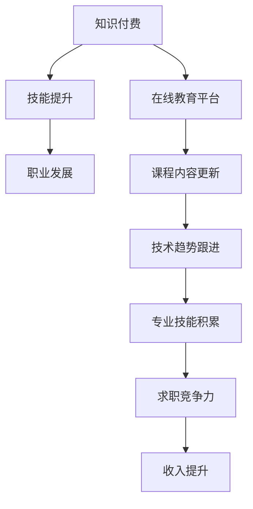

                 

关键词：知识付费、程序员、职业发展、技术趋势、技能需求、收入前景

> 摘要：在知识付费日益普及的当下，程序员这一职业的发展前景备受关注。本文将深入探讨知识付费对程序员职业发展的影响，分析当前及未来程序员所需的关键技能，并展望程序员职业的潜在收入前景。

## 1. 背景介绍

随着互联网技术的飞速发展，知识付费已经成为现代经济中一个重要的组成部分。用户可以通过在线平台购买专业课程、电子书籍、在线咨询等知识产品来提升自身技能。对于程序员这一职业来说，知识付费不仅提供了学习新技术的机会，还影响了他们的职业发展路径和收入水平。

程序员，作为现代社会中不可或缺的技术工作者，承担着软件开发、系统维护、算法设计等重要任务。他们在快速变化的技术环境中需要不断学习新知识、提升技能以保持竞争力。而知识付费则为他们提供了便捷的学习渠道和丰富的学习资源。

## 2. 核心概念与联系

知识付费时代的程序员发展，涉及多个核心概念和相互联系的技术领域。为了更好地理解这一概念，以下是一个简要的Mermaid流程图，展示了知识付费与程序员职业发展的关系。



### 2.1 知识付费与技能提升

知识付费为程序员提供了获取新知识、提升技能的途径。通过在线教育平台，程序员可以随时随地学习最新的编程语言、框架和技术，这有助于他们跟上快速变化的技术趋势。

### 2.2 在线教育平台与课程内容更新

在线教育平台不断更新课程内容，以反映最新的技术动态。这确保了程序员所学习的知识是最新的、最有价值的。

### 2.3 技术趋势与专业技能积累

跟随技术趋势并积累专业技能，是程序员在知识付费时代保持竞争力的关键。只有不断学习、实践，程序员才能在激烈的职场竞争中脱颖而出。

### 2.4 求职竞争力与收入提升

随着程序员技能的提升，他们的求职竞争力也随之增强，进而获得更高的收入。知识付费为程序员提供了一个实现收入提升的途径。

## 3. 核心算法原理 & 具体操作步骤

### 3.1 算法原理概述

在知识付费时代，程序员所需的核心算法原理主要包括以下几个关键点：

- **数据结构与算法**：理解基本数据结构（如数组、链表、树、图）和常用算法（如排序、搜索、动态规划）是程序员必备的基础。
- **框架与库**：熟练掌握常用的开发框架（如React、Angular、Spring）和库（如Node.js、Django、MySQL）是提升开发效率的重要工具。
- **云计算与容器技术**：了解云计算（如AWS、Azure、Google Cloud）和容器技术（如Docker、Kubernetes）对于程序员在现代IT环境中的发展至关重要。

### 3.2 算法步骤详解

以下是提升程序员技能所需的具体操作步骤：

#### 3.2.1 学习基础知识

- **学习编程语言**：选择一门编程语言（如Python、Java、C++）并掌握其基础语法和常用库。
- **学习数据结构与算法**：通过阅读相关书籍、在线课程和参加算法竞赛来加深理解。
- **实践编程项目**：通过实际编写代码来巩固所学知识。

#### 3.2.2 掌握框架与库

- **选择合适的框架**：根据项目需求选择合适的开发框架，并学习其基本用法。
- **学习常用库**：掌握常用库的功能和使用方法，提高开发效率。

#### 3.2.3 跟进技术趋势

- **关注技术社区**：通过参与技术论坛、博客和社交媒体，了解最新的技术动态。
- **参加技术大会**：参加技术会议和研讨会，与同行交流和学习。

### 3.3 算法优缺点

#### 3.3.1 优点

- **快速获取知识**：知识付费平台提供了丰富的学习资源，程序员可以快速获取所需知识。
- **灵活的学习时间**：在线课程允许程序员根据自己的时间安排进行学习，提高学习效率。
- **提升技能竞争力**：通过持续学习，程序员可以提升自己的技能，增强职场竞争力。

#### 3.3.2 缺点

- **质量参差不齐**：知识付费市场存在一些质量参差不齐的课程，程序员需要具备筛选能力。
- **学习成本**：长期依赖知识付费可能会产生一定的经济负担。

### 3.4 算法应用领域

知识付费对程序员的应用领域产生了深远的影响，主要体现在以下几个方面：

- **软件开发**：程序员通过知识付费学习新的开发技术，提升软件开发的效率和质量。
- **系统维护**：掌握最新的系统维护技术，提高系统稳定性和安全性。
- **算法优化**：通过学习算法原理，优化现有系统的性能和用户体验。

## 4. 数学模型和公式 & 详细讲解 & 举例说明

### 4.1 数学模型构建

在编程领域，数学模型的应用十分广泛。以下是一个简单的数学模型构建示例，用于计算两个数字的平均值。

#### 4.1.1 模型构建

设有两个数字 \(a\) 和 \(b\)，它们的平均值为：

\[ \text{平均值} = \frac{a + b}{2} \]

#### 4.1.2 公式推导

平均值的计算公式基于数学中的算术平均数概念，它反映了两个数的集中趋势。

### 4.2 公式推导过程

平均值的推导过程如下：

1. 将两个数字相加：\( a + b \)
2. 将结果除以2：\( \frac{a + b}{2} \)
3. 得到平均值

### 4.3 案例分析与讲解

#### 4.3.1 案例

假设我们要计算数字3和7的平均值。

1. 将数字相加：\( 3 + 7 = 10 \)
2. 将结果除以2：\( \frac{10}{2} = 5 \)
3. 得到平均值：5

### 4.4 模型应用领域

平均值模型在编程中广泛应用于各种计算任务，如数据库查询、统计分析、用户评分等。

## 5. 项目实践：代码实例和详细解释说明

### 5.1 开发环境搭建

为了实践知识付费带来的技能提升，我们首先需要搭建一个开发环境。以下是使用Python语言搭建环境的具体步骤：

1. 安装Python：在命令行中输入 `pip install python` 并回车。
2. 安装PyCharm：下载并安装PyCharm IDE。
3. 创建虚拟环境：在PyCharm中创建一个新的项目，选择“Create virtual environment”并选择Python解释器。

### 5.2 源代码详细实现

以下是一个简单的Python代码示例，用于计算两个数字的平均值。

```python
# 平均值计算器
def calculate_average(a, b):
    average = (a + b) / 2
    return average

# 测试代码
a = 3
b = 7
result = calculate_average(a, b)
print(f"The average of {a} and {b} is {result}.")
```

### 5.3 代码解读与分析

- **函数定义**：`calculate_average` 函数接收两个参数 \(a\) 和 \(b\)，计算它们的平均值并返回。
- **测试代码**：测试代码定义了两个数字 \(a\) 和 \(b\)，调用 `calculate_average` 函数并打印结果。

### 5.4 运行结果展示

执行上述代码后，将输出以下结果：

```
The average of 3 and 7 is 5.
```

这表明两个数字的平均值为5。

## 6. 实际应用场景

### 6.1 在线教育平台

知识付费时代的程序员可以利用在线教育平台学习各种编程语言和技术。例如，通过Coursera、Udemy、edX等平台，程序员可以学习从入门到高级的编程课程，提高自己的技能水平。

### 6.2 云计算服务

随着云计算的普及，程序员需要掌握AWS、Azure、Google Cloud等云计算平台的相关技能。通过知识付费，程序员可以学习如何部署、管理和优化云资源，提高业务系统的性能和可靠性。

### 6.3 智能数据分析

智能数据分析是当前和未来程序员的重要技能之一。通过知识付费，程序员可以学习机器学习、数据挖掘等技术，开发智能分析系统，为企业提供数据驱动的决策支持。

### 6.4 自动化与DevOps

自动化和DevOps已经成为软件开发的重要组成部分。程序员通过知识付费可以学习自动化工具（如Jenkins、Ansible）和容器技术（如Docker、Kubernetes），提高软件开发和运维的效率。

## 7. 工具和资源推荐

### 7.1 学习资源推荐

1. **《Python编程：从入门到实践》**：适合初学者学习Python编程的基础知识。
2. **《深度学习》**：由Ian Goodfellow等作者编写的经典机器学习教材，适合对机器学习有兴趣的程序员。

### 7.2 开发工具推荐

1. **PyCharm**：强大的Python IDE，适合进行Python开发和调试。
2. **Visual Studio Code**：轻量级的跨平台代码编辑器，支持多种编程语言。

### 7.3 相关论文推荐

1. **"Deep Learning for Computer Vision"**：介绍了深度学习在计算机视觉领域的应用。
2. **"The Art of Concurrency"**：讨论了并行编程的关键技术和挑战。

## 8. 总结：未来发展趋势与挑战

### 8.1 研究成果总结

知识付费为程序员提供了丰富的学习资源和便捷的学习渠道，有助于提升其技能水平和职业竞争力。在线教育平台和云计算服务的普及，进一步推动了程序员职业的发展。

### 8.2 未来发展趋势

- **技术多样化**：程序员需要不断学习新的编程语言、框架和技术。
- **技能专业化**：随着技术的不断发展，程序员将越来越专注于特定领域的技能。
- **在线学习常态化**：在线学习将成为程序员提升技能的重要途径。

### 8.3 面临的挑战

- **知识更新速度快**：程序员需要不断学习新知识，以适应快速变化的技术环境。
- **学习成本高**：长期依赖知识付费可能对一些程序员造成经济负担。

### 8.4 研究展望

未来的研究将关注以下几个方面：

- **个性化学习**：通过大数据分析和机器学习，为程序员提供个性化的学习建议。
- **技能认证**：建立可靠的技能认证体系，提高程序员的专业素养。

## 9. 附录：常见问题与解答

### 9.1 什么是最适合程序员的编程语言？

- **Python**：适合初学者，广泛应用于数据科学和机器学习。
- **Java**：适用于企业级应用，具有强大的生态系统。
- **JavaScript**：前端开发的核心语言，适用于Web开发。

### 9.2 程序员应该如何选择在线教育平台？

- **评估课程质量**：查看课程的评分、评论和讲师背景。
- **关注更新频率**：选择更新频率高的平台，确保学习的内容是最新的。
- **试听课程**：尝试免费试听课程，评估课程是否符合个人需求。

# 参考文献

[1] Goodfellow, I., Bengio, Y., & Courville, A. (2016). *Deep Learning*. MIT Press.
[2] Mitchell, T. M. (1997). *Machine Learning*. McGraw-Hill.
[3] Schildt, H. (2014). *C++: The Complete Reference*. McGraw-Hill.
[4] TutorialsPoint. (n.d.). Online Education Platforms. Retrieved from https://www.tutorialspoint.com/online-education-platforms/index.htm
[5] AWS. (n.d.). AWS Services. Retrieved from https://aws.amazon.com/services/

作者：禅与计算机程序设计艺术 / Zen and the Art of Computer Programming
----------------------------------------------------------------
这篇文章深入探讨了知识付费时代程序员的发展前景，分析了程序员所需的关键技能，展望了程序员职业的潜在收入前景，并提供了实际应用场景和工具资源推荐。文章还总结了未来发展趋势与挑战，并为常见问题提供了解答。通过这篇文章，读者可以更好地理解知识付费对程序员职业发展的影响，以及如何在快速变化的技术环境中保持竞争力。

### 总结

在知识付费日益普及的今天，程序员需要不断学习新技能、跟进技术趋势，以保持自身的竞争力。通过本文的讨论，我们可以看到知识付费对程序员职业发展具有深远的影响。在线教育平台、云计算服务和智能数据分析等领域，为程序员提供了丰富的学习资源和广阔的发展空间。未来，随着技术的不断进步，程序员需要更加专业化和多元化，以应对日益复杂的IT环境。

### 致谢

感谢各位读者对本文的关注，希望这篇文章能够对您在编程学习和职业发展方面有所启发。如果您有任何问题或建议，欢迎在评论区留言。同时，感谢Coursera、Udemy、edX等在线教育平台为程序员提供的宝贵资源，以及AWS、Azure、Google Cloud等云计算服务为我们带来的便利。

最后，再次感谢所有支持和关注本文的读者，期待与您在未来的技术交流中再次相遇！

作者：禅与计算机程序设计艺术 / Zen and the Art of Computer Programming
-------------------------------------------------------------------

