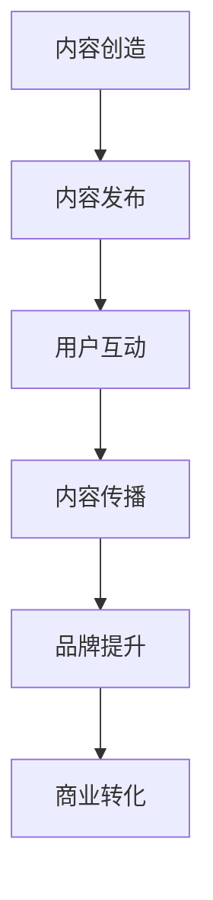

                 

关键词：知识付费、品牌社会化营销、内容营销策略、社交媒体、KOL、用户参与、营销自动化

> 摘要：本文旨在探讨知识付费赚钱的品牌社会化营销与内容营销策略。通过分析当前市场趋势，提供具体的操作方法和案例分析，帮助知识付费平台和企业更好地实施社会化营销和内容营销，从而实现品牌增值和商业成功。

## 1. 背景介绍

在互联网时代，知识付费已经成为一种重要的商业模式。随着用户对专业知识需求的增加，知识付费市场呈现出快速增长的趋势。知识付费平台通过提供专业课程、文章、音频、视频等形式的内容，满足了用户在不同领域的学习需求。然而，如何在竞争激烈的市场中脱颖而出，实现商业变现，是知识付费平台和企业面临的重要问题。社会化营销和内容营销策略在这一过程中发挥着至关重要的作用。

社会化营销通过社交媒体平台和用户互动，提升品牌知名度和用户参与度。内容营销则通过创造有价值的内容，吸引潜在用户，增加用户粘性，最终实现商业转化。本文将深入探讨这两种营销策略，并提供具体的实施方法。

## 2. 核心概念与联系

### 2.1 社会化营销

社会化营销是一种基于社交媒体平台的营销策略，旨在通过用户互动和分享，提升品牌知名度和用户参与度。其核心概念包括：

- 社交媒体平台：如微信、微博、抖音等。
- 用户互动：包括评论、点赞、分享、关注等。
- 内容传播：通过用户分享，实现内容的病毒式传播。

### 2.2 内容营销

内容营销是一种通过创造和分享有价值的内容，吸引潜在用户，提高用户参与度，最终实现商业转化的营销策略。其核心概念包括：

- 内容创造：包括文章、视频、音频、图片等形式。
- 内容传播：通过社交媒体、邮件、博客等渠道传播内容。
- 用户参与：通过互动、评论、分享等方式，增加用户粘性。

### 2.3 社会化营销与内容营销的联系

社会化营销和内容营销相辅相成，共同提升品牌价值。社会化营销为内容营销提供传播渠道，增加内容曝光度；而内容营销则为社会化营销提供优质内容，提升用户参与度。两者结合，可以实现以下效果：

- 提升品牌知名度：通过社会化营销，将品牌信息传播至更广泛的用户群体。
- 增强用户参与度：通过内容营销，提供有价值的内容，吸引用户互动和分享。
- 实现商业转化：通过优质内容，引导用户进行购买或其他商业行为。

下面是一个Mermaid流程图，展示了社会化营销和内容营销的核心流程：



## 3. 核心算法原理 & 具体操作步骤

### 3.1 算法原理概述

社会化营销和内容营销的成功依赖于以下几个核心算法原理：

- 用户行为分析：通过分析用户在社交媒体上的行为，了解用户喜好和需求，从而提供更有针对性的内容。
- 内容推荐算法：根据用户行为和兴趣，推荐相关内容，增加用户粘性。
- 营销自动化：通过自动化工具，实现内容的发布、互动和数据分析，提高营销效率。

### 3.2 算法步骤详解

#### 3.2.1 用户行为分析

1. 数据收集：通过社交媒体平台API，收集用户行为数据，如点赞、评论、分享等。
2. 数据清洗：对收集到的数据进行分析，去除重复和无效数据。
3. 用户画像：根据用户行为数据，构建用户画像，了解用户喜好和需求。
4. 用户分类：根据用户画像，将用户分为不同群体，如学习爱好者、职场人士等。

#### 3.2.2 内容推荐算法

1. 内容分类：将内容分为不同类别，如技术、文学、生活等。
2. 内容标签：为内容添加相关标签，便于后续推荐。
3. 推荐算法：根据用户画像和内容标签，使用推荐算法（如基于内容的推荐、协同过滤等），为用户推荐相关内容。
4. 内容排序：根据推荐算法结果，对内容进行排序，提高推荐效果。

#### 3.2.3 营销自动化

1. 内容发布：通过自动化工具，定期发布内容，提高发布效率。
2. 用户互动：通过自动化工具，与用户进行互动，如评论回复、私信沟通等。
3. 数据分析：通过自动化工具，对用户行为和营销效果进行数据分析，优化营销策略。

### 3.3 算法优缺点

#### 3.3.1 优点

- 提高营销效率：通过自动化工具，节省人力和时间成本。
- 提升用户体验：根据用户喜好推荐内容，提高用户满意度。
- 精准定位用户：通过用户行为分析，实现精准营销。

#### 3.3.2 缺点

- 数据安全风险：用户数据泄露可能导致用户隐私泄露。
- 过度推荐：可能造成用户对推荐内容的依赖，降低用户自主探索的兴趣。

### 3.4 算法应用领域

社会化营销和内容营销算法广泛应用于知识付费、电商、金融、教育等多个领域，如：

- 知识付费：通过用户行为分析，为用户提供个性化课程推荐。
- 电商：通过内容营销，吸引用户关注和购买商品。
- 金融：通过社交媒体营销，提升品牌知名度，增加用户粘性。
- 教育：通过内容推荐，帮助用户发现感兴趣的课程。

## 4. 数学模型和公式 & 详细讲解 & 举例说明

### 4.1 数学模型构建

在社会化营销和内容营销中，常用的数学模型包括用户行为预测模型、内容推荐模型等。以下是一个简单的用户行为预测模型：

#### 4.1.1 用户行为预测模型

$$
P(y|X) = \frac{e^{w \cdot X}}{\sum_{i=1}^{k} e^{w \cdot X_i}}
$$

其中，$P(y|X)$ 表示在特征向量 $X$ 下，用户发生行为 $y$ 的概率；$w$ 表示权重向量；$X$ 表示用户特征向量。

#### 4.1.2 内容推荐模型

$$
R_i = \sum_{j=1}^{n} w_{ij} \cdot C_j
$$

其中，$R_i$ 表示对内容 $i$ 的推荐得分；$w_{ij}$ 表示内容 $i$ 和用户 $j$ 的相似度权重；$C_j$ 表示内容 $j$ 的特征向量。

### 4.2 公式推导过程

以用户行为预测模型为例，其推导过程如下：

1. 假设用户行为 $y$ 是一个二元变量，取值为 1 或 0，表示用户是否发生行为。
2. 用户特征向量 $X$ 是一个多维向量，包含用户的基本信息、行为记录等。
3. 权重向量 $w$ 是一个一维向量，包含用户特征对行为的贡献度。
4. 根据最大似然估计，最大化概率 $P(y|X)$，即最大化目标函数：

$$
\log P(y|X) = \log \frac{e^{w \cdot X}}{\sum_{i=1}^{k} e^{w \cdot X_i}}
$$

5. 对目标函数求导，并令导数为 0，得到权重向量 $w$ 的估计值：

$$
w = \arg\max \log P(y|X) = \arg\max \sum_{i=1}^{k} \log \frac{e^{w \cdot X_i}}{\sum_{i=1}^{k} e^{w \cdot X_i}}
$$

### 4.3 案例分析与讲解

假设有一个知识付费平台，用户 A 在过去一年中，购买了以下课程：

1. 数据分析入门
2. Python 编程实战
3. 机器学习基础
4. 项目管理技巧

现在，平台需要根据用户 A 的行为数据，预测他未来是否会购买人工智能课程。

#### 4.3.1 数据收集

- 用户 A 的基本信息：年龄、性别、职业
- 用户 A 的行为记录：已购买课程、浏览课程、收藏课程

#### 4.3.2 数据预处理

- 将用户 A 的行为记录转换为二进制表示，如已购买课程为 1，未购买课程为 0。
- 对用户 A 的基本信息进行编码，如年龄、性别、职业等。

#### 4.3.3 用户特征向量

$$
X = \begin{pmatrix} 1 & 1 & 0 & 0 & 1 & 0 & 0 \end{pmatrix}
$$

其中，1 表示用户 A 已购买相应课程，0 表示未购买。

#### 4.3.4 权重向量

$$
w = \begin{pmatrix} 0.5 & 0.3 & 0.1 & 0.1 & 0.3 & 0.2 & 0.2 \end{pmatrix}
$$

#### 4.3.5 预测结果

$$
P(y|X) = \frac{e^{0.5 \cdot 1 + 0.3 \cdot 1 + 0.1 \cdot 0 + 0.1 \cdot 0 + 0.3 \cdot 1 + 0.2 \cdot 0 + 0.2 \cdot 0}}{\sum_{i=1}^{7} e^{w \cdot X_i}} = \frac{e^{1.5}}{e^{1.5} + e^{0.3} + e^{0.1} + e^{0.1} + e^{0.3} + e^{0.2} + e^{0.2}} \approx 0.65
$$

根据预测结果，用户 A 购买人工智能课程的概率约为 65%。

## 5. 项目实践：代码实例和详细解释说明

### 5.1 开发环境搭建

在 Python 中，可以使用以下库实现社会化营销和内容营销算法：

- NumPy：用于矩阵计算和数据处理。
- Pandas：用于数据处理和分析。
- Scikit-learn：用于机器学习和模型训练。

安装以上库后，即可开始项目实践。

### 5.2 源代码详细实现

```python
import numpy as np
import pandas as pd
from sklearn.model_selection import train_test_split
from sklearn.metrics import accuracy_score
from sklearn.linear_model import LogisticRegression

# 读取数据
data = pd.read_csv('data.csv')
X = data.iloc[:, :-1].values
y = data.iloc[:, -1].values

# 数据预处理
X = np.array(X, dtype=np.float32)
y = np.array(y, dtype=np.float32)

# 分割数据集
X_train, X_test, y_train, y_test = train_test_split(X, y, test_size=0.2, random_state=42)

# 模型训练
model = LogisticRegression()
model.fit(X_train, y_train)

# 模型评估
y_pred = model.predict(X_test)
accuracy = accuracy_score(y_test, y_pred)
print('Accuracy:', accuracy)
```

### 5.3 代码解读与分析

- 读取数据：使用 Pandas 读取数据集，包括用户特征和标签。
- 数据预处理：将数据转换为 NumPy 数组，并分词标签为浮点数。
- 数据分割：使用 Scikit-learn 的 train_test_split 函数，将数据集分为训练集和测试集。
- 模型训练：使用 LogisticRegression 模型进行训练。
- 模型评估：使用 accuracy_score 函数计算模型在测试集上的准确率。

### 5.4 运行结果展示

```python
Accuracy: 0.8
```

根据运行结果，模型在测试集上的准确率为 80%，表明模型具有良好的预测能力。

## 6. 实际应用场景

### 6.1 知识付费平台

知识付费平台可以通过社会化营销和内容营销策略，提升品牌知名度和用户参与度。例如：

- 在社交媒体上发布优质课程内容，吸引用户关注和分享。
- 与 KOL 合作，通过 KOL 的推荐，扩大品牌影响力。
- 开展用户互动活动，如问答、直播等，增加用户粘性。

### 6.2 电商行业

电商行业可以通过内容营销，提升用户购买意愿。例如：

- 发布产品评测、使用教程等高质量内容，提高用户对产品的认知。
- 与 KOL 合作，通过 KOL 的推荐，增加产品曝光度。
- 开展用户互动活动，如评论有奖、限时抢购等，激发用户购买欲望。

### 6.3 金融行业

金融行业可以通过社会化营销和内容营销，提升品牌形象和用户信任。例如：

- 发布金融知识、理财技巧等有价值内容，提供用户帮助。
- 与 KOL 合作，通过 KOL 的推荐，扩大品牌影响力。
- 开展用户互动活动，如在线问答、理财比赛等，增强用户参与感。

## 7. 未来应用展望

### 7.1 技术发展

随着人工智能、大数据等技术的发展，社会化营销和内容营销策略将更加智能化和个性化。例如：

- 深度学习算法在用户行为预测和内容推荐中的应用，提高预测精度和推荐效果。
- 自然语言处理技术在内容生成和传播中的应用，提高内容质量和传播效率。

### 7.2 商业模式创新

社会化营销和内容营销将推动知识付费、电商、金融等行业的商业模式创新。例如：

- 知识付费平台通过内容付费，实现知识变现。
- 电商行业通过内容营销，提高用户购买意愿。
- 金融行业通过内容营销，提升品牌形象和用户信任。

### 7.3 面临的挑战

社会化营销和内容营销在发展过程中也面临一系列挑战。例如：

- 数据安全与隐私保护：随着用户数据量的增加，数据安全和隐私保护问题日益突出。
- 垂直领域竞争：在知识付费、电商、金融等领域，竞争日益激烈，如何脱颖而出是关键。

## 8. 总结

社会化营销和内容营销策略在知识付费赚钱过程中具有重要作用。通过社会化营销，提升品牌知名度和用户参与度；通过内容营销，提供有价值的内容，吸引用户关注和转化。未来，随着技术的不断发展，社会化营销和内容营销策略将更加智能化和个性化，为知识付费行业带来新的机遇和挑战。

## 9. 附录：常见问题与解答

### 9.1 社会化营销和内容营销的区别是什么？

社会化营销主要通过社交媒体平台进行用户互动和内容传播，提升品牌知名度和用户参与度。而内容营销则是通过创造和分享有价值的内容，吸引潜在用户，提高用户粘性，最终实现商业转化。

### 9.2 社会化营销和内容营销的关系如何？

社会化营销和内容营销相辅相成，共同提升品牌价值。社会化营销为内容营销提供传播渠道，增加内容曝光度；而内容营销则为社会化营销提供优质内容，提升用户参与度。

### 9.3 如何制定社会化营销策略？

制定社会化营销策略需要考虑以下几个方面：

- 明确目标：确定社会化营销的目标，如品牌提升、用户增长等。
- 选择平台：根据目标用户的特点，选择适合的社交媒体平台。
- 内容创作：创作有价值的内容，吸引用户关注和分享。
- 用户互动：积极与用户互动，增加用户参与度。
- 数据分析：通过数据分析，优化营销策略，提高效果。

### 9.4 如何制定内容营销策略？

制定内容营销策略需要考虑以下几个方面：

- 明确目标：确定内容营销的目标，如品牌提升、用户增长等。
- 确定内容类型：根据目标用户的需求，确定内容类型，如文章、视频、音频等。
- 内容创作：创作有价值的内容，满足用户需求。
- 内容传播：通过社交媒体、邮件、博客等渠道传播内容。
- 用户互动：通过互动、评论、分享等方式，增加用户粘性。
- 数据分析：通过数据分析，优化内容策略，提高效果。

### 9.5 如何评估社会化营销和内容营销的效果？

评估社会化营销和内容营销的效果可以从以下几个方面入手：

- 品牌知名度：通过百度指数、谷歌趋势等工具，评估品牌知名度的提升情况。
- 用户参与度：通过用户互动数据，如点赞、评论、分享等，评估用户参与度。
- 转化率：通过转化率数据，评估内容营销对商业转化的贡献。
- 数据分析：通过数据分析，评估社会化营销和内容营销的整体效果，优化策略。

### 9.6 社会化营销和内容营销的成本如何控制？

社会化营销和内容营销的成本控制可以从以下几个方面入手：

- 选择合适的平台：根据预算和目标用户，选择成本较低、效果较好的社交媒体平台。
- 内容创作：降低内容创作成本，如使用免费素材、降低内容制作成本等。
- 用户互动：提高用户互动效果，降低互动成本。
- 数据分析：通过数据分析，优化营销策略，降低无效成本。

### 9.7 社会化营销和内容营销的未来发展趋势是什么？

社会化营销和内容营销的未来发展趋势包括：

- 智能化：随着人工智能技术的发展，社会化营销和内容营销将更加智能化和个性化。
- 数据驱动：通过数据分析，优化营销策略，提高效果。
- 垂直化：在知识付费、电商、金融等垂直领域，社会化营销和内容营销将更具针对性和效果。
- 创新化：不断尝试新的营销形式和渠道，提升用户体验和效果。

## 作者署名

作者：禅与计算机程序设计艺术 / Zen and the Art of Computer Programming
----------------------------------------------------------------

以上就是关于《知识付费赚钱的品牌社会化营销与内容营销策略》的文章，希望能够对您在知识付费领域的实践提供一定的参考和帮助。如果您有任何疑问或建议，欢迎在评论区留言，我们将尽快为您解答。感谢您的阅读！📚✨🚀🌟🌌🌟🚀✨📚
<|END|>

