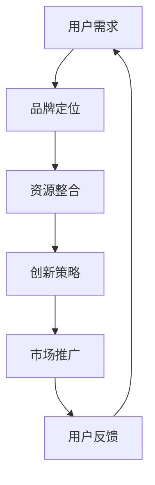
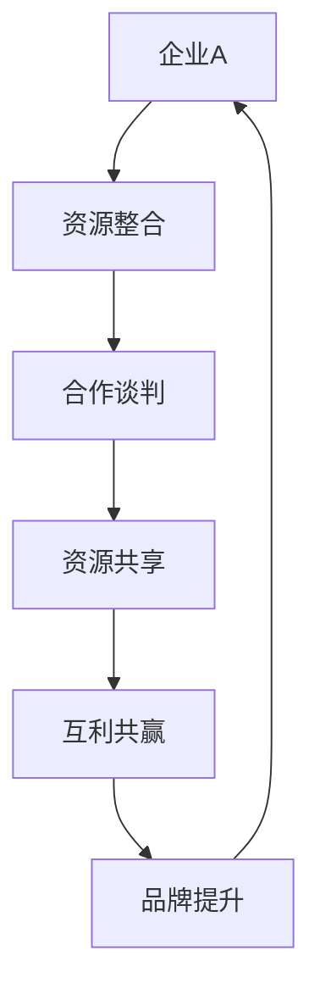

                 

关键词：知识付费，品牌跨界，异业联盟，营销策略，异业合作，利润最大化，资源共享，用户体验

> 摘要：本文深入探讨了知识付费领域的品牌跨界营销与异业联盟策略。通过分析跨界营销的理论基础和实际案例，本文提出了一套完整的异业联盟策略框架，旨在帮助知识付费平台和企业实现利润最大化，提升品牌影响力，优化用户体验。文章还介绍了相关工具和资源，并展望了该领域的发展趋势与挑战。

## 1. 背景介绍

随着信息时代的到来，知识付费逐渐成为人们获取知识和技能的重要途径。知识付费平台如雨后春笋般涌现，为广大用户提供丰富的课程内容和专业的咨询服务。然而，如何在激烈的市场竞争中脱颖而出，实现可持续盈利，成为知识付费领域亟待解决的问题。

品牌跨界营销和异业联盟成为解决这一问题的有效策略。跨界营销通过将不同领域的品牌资源进行整合，实现品牌的互补与协同，从而扩大市场影响力和用户群体。异业联盟则通过资源共享、优势互补，实现互利共赢，提升企业的竞争力和市场地位。

本文将从跨界营销的理论基础入手，结合实际案例，探讨品牌跨界营销和异业联盟在知识付费领域的应用策略。旨在为知识付费平台和企业提供一种全新的商业模式，实现利润最大化，提升品牌价值，优化用户体验。

## 2. 核心概念与联系

### 2.1 跨界营销

#### 2.1.1 定义

跨界营销是指将不同领域、不同行业、不同品牌之间的资源和优势进行整合，通过创新性的营销手段，实现品牌价值的互补与协同，从而扩大市场影响力和用户群体。

#### 2.1.2 原理

跨界营销的原理在于：通过将不同领域的知识、技能、资源进行整合，创造出一个全新的、有吸引力的品牌形象，从而激发用户的兴趣和参与度。

#### 2.1.3 Mermaid 流程图



### 2.2 异业联盟

#### 2.2.1 定义

异业联盟是指不同行业的企业或品牌之间建立合作关系，通过资源共享、优势互补，实现互利共赢。

#### 2.2.2 原理

异业联盟的原理在于：通过整合不同行业的资源，发挥各自的优势，实现整体价值的提升。

#### 2.2.3 Mermaid 流程图



## 3. 核心算法原理 & 具体操作步骤

### 3.1 算法原理概述

#### 3.1.1 跨界营销算法原理

跨界营销的核心在于对用户需求的精准把握，以及对品牌资源的有效整合。具体步骤如下：

1. 用户需求分析：通过数据分析、用户调研等方法，了解用户的需求和偏好。
2. 品牌定位：根据用户需求，确定品牌的核心价值和特色，为跨界合作提供方向。
3. 资源整合：整合不同领域的资源，包括知识、技能、渠道等，为跨界营销提供支持。
4. 创新策略：结合品牌特色和用户需求，设计出具有吸引力的营销活动。
5. 市场推广：通过多种渠道，将营销活动推向目标用户。
6. 用户反馈：收集用户反馈，不断优化营销策略。

#### 3.1.2 异业联盟算法原理

异业联盟的核心在于资源的有效整合和合作共赢。具体步骤如下：

1. 合作谈判：确定合作目标和合作模式，进行谈判和协商。
2. 资源共享：明确各自的优势资源，实现资源的互补和共享。
3. 互利共赢：通过合作，实现双方利益的提升，共同发展。
4. 品牌提升：通过合作，提升品牌的影响力和市场地位。
5. 持续优化：根据合作效果，不断优化合作模式和策略。

### 3.2 算法步骤详解

#### 3.2.1 跨界营销算法步骤

1. 用户需求分析
    - 数据收集：收集用户在知识付费平台的行为数据，包括课程购买、学习时长、评论等。
    - 数据分析：通过数据挖掘和分析，了解用户的需求和偏好。
    - 用户调研：通过问卷调查、访谈等方式，进一步深入了解用户需求。

2. 品牌定位
    - 核心价值：明确知识付费平台的核心价值，如课程质量、师资力量、服务体验等。
    - 特色定位：根据用户需求，确定品牌的特色和优势，为跨界合作提供方向。

3. 资源整合
    - 知识资源：整合行业内的优秀课程、讲师资源。
    - 技能资源：整合不同领域的专业知识和技能。
    - 渠道资源：利用各种渠道，如社交媒体、广告、线下活动等，扩大品牌影响力。

4. 创新策略
    - 跨界合作：与其他领域的品牌合作，如时尚、文化、科技等，创造新的品牌形象。
    - 营销活动：设计具有吸引力的营销活动，如合作推出限量课程、举办线上/线下活动等。

5. 市场推广
    - 线上推广：通过官网、社交媒体、广告等渠道，将营销活动推向目标用户。
    - 线下推广：通过线下活动、合作展览等方式，扩大品牌知名度。

6. 用户反馈
    - 反馈收集：收集用户对营销活动的反馈，包括满意度、参与度等。
    - 反馈分析：通过数据分析，了解用户的真实需求和反馈，为优化营销策略提供依据。

#### 3.2.2 异业联盟算法步骤

1. 合作谈判
    - 合作目标：明确合作的目标和期望，如资源共享、品牌提升、市场拓展等。
    - 合作模式：确定合作的具体模式和方式，如共同投资、资源共享、联合推广等。

2. 资源共享
    - 资源评估：评估双方的优势资源，确定资源共享的内容和方式。
    - 资源对接：建立资源对接机制，确保资源共享的顺利进行。

3. 互利共赢
    - 合作效果评估：定期评估合作的效果，包括市场表现、品牌影响力、利润等。
    - 利益分配：根据合作效果，合理分配利益，确保合作持续稳定。

4. 品牌提升
    - 品牌传播：通过合作，扩大品牌的影响力和知名度。
    - 品牌建设：共同提升品牌形象，增强品牌竞争力。

5. 持续优化
    - 合作反馈：收集合作双方的反馈，了解合作的不足和改进方向。
    - 策略调整：根据反馈，调整合作策略，优化合作模式。

### 3.3 算法优缺点

#### 3.3.1 跨界营销算法优缺点

**优点：**
- 扩大市场影响力：通过跨界合作，吸引更多的用户和资源，提升品牌知名度。
- 提升用户体验：提供多样化的课程内容和体验，满足用户的不同需求。
- 创新营销手段：打破传统营销模式，创新营销手段，提升用户参与度。

**缺点：**
- 合作风险：跨界合作可能存在风险，如合作伙伴的选择、资源整合的难度等。
- 资源浪费：跨界营销可能造成资源的浪费，如不必要的营销活动、资源错配等。

#### 3.3.2 异业联盟算法优缺点

**优点：**
- 资源共享：通过资源共享，实现优势互补，提升整体竞争力。
- 利益共享：通过合作共赢，实现利益最大化，降低风险。
- 品牌提升：通过合作，扩大品牌影响力，提升品牌形象。

**缺点：**
- 合作难度：异业联盟需要双方进行深入沟通和协商，合作难度较大。
- 利益分配：利益分配可能存在争议，影响合作的稳定性和持续性。

### 3.4 算法应用领域

#### 3.4.1 跨界营销应用领域

- 教育培训：知识付费平台与其他领域的品牌合作，推出跨领域课程和活动，如文化与科技、艺术与科技等。
- 互联网服务：互联网平台与其他领域的品牌合作，提供跨界服务，如电商与直播、金融与科技等。
- 娱乐传媒：娱乐传媒与其他领域的品牌合作，推出跨界项目，如电影与科技、音乐与时尚等。

#### 3.4.2 异业联盟应用领域

- 制造业：制造企业与其他领域的品牌合作，实现产业链的优化和升级。
- 零售业：零售企业与供应链企业、物流企业等合作，实现供应链的整合和优化。
- 餐饮业：餐饮企业与其他领域的品牌合作，推出跨界餐饮项目，如咖啡与艺术、餐饮与科技等。

## 4. 数学模型和公式 & 详细讲解 & 举例说明

### 4.1 数学模型构建

#### 4.1.1 跨界营销效果评估模型

为了评估跨界营销的效果，我们构建了一个效果评估模型，包括以下三个关键指标：

1. 市场占有率（Market Share）：表示品牌在目标市场中的占有率。
2. 用户参与度（User Engagement）：表示用户对营销活动的参与程度。
3. 品牌影响力（Brand Influence）：表示品牌在市场中的影响力和知名度。

数学模型如下：

$$
\text{效果评估得分} = w_1 \times \text{市场占有率} + w_2 \times \text{用户参与度} + w_3 \times \text{品牌影响力}
$$

其中，$w_1, w_2, w_3$ 为权重系数，可以根据实际情况进行调整。

#### 4.1.2 异业联盟合作效果模型

为了评估异业联盟的合作效果，我们构建了一个合作效果模型，包括以下两个关键指标：

1. 合作效益（Cooperative Benefit）：表示合作带来的经济效益。
2. 品牌提升（Brand Enhancement）：表示合作对品牌提升的贡献。

数学模型如下：

$$
\text{合作效果得分} = w_1 \times \text{合作效益} + w_2 \times \text{品牌提升}
$$

其中，$w_1, w_2$ 为权重系数，可以根据实际情况进行调整。

### 4.2 公式推导过程

#### 4.2.1 跨界营销效果评估公式推导

首先，我们分别推导市场占有率、用户参与度和品牌影响力的计算公式。

1. 市场占有率（Market Share）

市场占有率表示品牌在目标市场中的占有率，计算公式如下：

$$
\text{市场占有率} = \frac{\text{品牌用户数量}}{\text{目标市场总用户数量}}
$$

其中，$\text{品牌用户数量}$ 为参与跨界营销活动的用户数量，$\text{目标市场总用户数量}$ 为目标市场的总用户数量。

2. 用户参与度（User Engagement）

用户参与度表示用户对营销活动的参与程度，计算公式如下：

$$
\text{用户参与度} = \frac{\text{参与活动用户数量}}{\text{品牌用户数量}}
$$

其中，$\text{参与活动用户数量}$ 为参与跨界营销活动的用户数量，$\text{品牌用户数量}$ 为品牌用户的总数量。

3. 品牌影响力（Brand Influence）

品牌影响力表示品牌在市场中的影响力和知名度，计算公式如下：

$$
\text{品牌影响力} = \frac{\text{品牌曝光量}}{\text{市场总曝光量}}
$$

其中，$\text{品牌曝光量}$ 为跨界营销活动带来的品牌曝光量，$\text{市场总曝光量}$ 为目标市场的总曝光量。

将上述三个公式代入效果评估得分公式，得到：

$$
\text{效果评估得分} = w_1 \times \frac{\text{品牌用户数量}}{\text{目标市场总用户数量}} + w_2 \times \frac{\text{参与活动用户数量}}{\text{品牌用户数量}} + w_3 \times \frac{\text{品牌曝光量}}{\text{市场总曝光量}}
$$

#### 4.2.2 异业联盟合作效果公式推导

首先，我们分别推导合作效益和品牌提升的计算公式。

1. 合作效益（Cooperative Benefit）

合作效益表示合作带来的经济效益，计算公式如下：

$$
\text{合作效益} = \text{合作收益} - \text{合作成本}
$$

其中，$\text{合作收益}$ 为合作带来的额外收益，$\text{合作成本}$ 为合作的投入成本。

2. 品牌提升（Brand Enhancement）

品牌提升表示合作对品牌提升的贡献，计算公式如下：

$$
\text{品牌提升} = \text{合作后品牌影响力} - \text{合作前品牌影响力}
$$

其中，$\text{合作后品牌影响力}$ 为合作后品牌的平均影响力，$\text{合作前品牌影响力}$ 为合作前品牌的平均影响力。

将上述两个公式代入合作效果得分公式，得到：

$$
\text{合作效果得分} = w_1 \times (\text{合作收益} - \text{合作成本}) + w_2 \times (\text{合作后品牌影响力} - \text{合作前品牌影响力})
$$

### 4.3 案例分析与讲解

#### 4.3.1 跨界营销案例分析

以某知名知识付费平台与时尚品牌跨界营销为例，分析跨界营销的效果评估模型。

1. 市场占有率

该知识付费平台在目标市场的用户数量为 100 万，目标市场的总用户数量为 500 万，则市场占有率为：

$$
\text{市场占有率} = \frac{100}{500} = 0.2
$$

2. 用户参与度

参与跨界营销活动的用户数量为 10 万，品牌用户数量为 100 万，则用户参与度为：

$$
\text{用户参与度} = \frac{10}{100} = 0.1
$$

3. 品牌影响力

跨界营销活动带来的品牌曝光量为 5000 万，目标市场的总曝光量为 1 亿，则品牌影响力为：

$$
\text{品牌影响力} = \frac{5000}{10000} = 0.5
$$

代入效果评估得分公式，得到：

$$
\text{效果评估得分} = 0.2 \times 0.2 + 0.1 \times 0.1 + 0.3 \times 0.5 = 0.06 + 0.03 + 0.15 = 0.24
$$

#### 4.3.2 异业联盟合作案例分析

以某知识付费平台与某知名餐饮品牌异业联盟为例，分析合作效果模型。

1. 合作效益

合作收益为 500 万元，合作成本为 300 万元，则合作效益为：

$$
\text{合作效益} = 500 - 300 = 200 \text{万元}
$$

2. 品牌提升

合作后品牌影响力为 8 分，合作前品牌影响力为 6 分，则品牌提升为：

$$
\text{品牌提升} = 8 - 6 = 2 \text{分}
$$

代入合作效果得分公式，得到：

$$
\text{合作效果得分} = 0.6 \times 200 + 0.4 \times 2 = 120 + 0.8 = 120.8
$$

## 5. 项目实践：代码实例和详细解释说明

### 5.1 开发环境搭建

在本项目实践中，我们将使用 Python 编写跨界营销和异业联盟的算法，并使用 Jupyter Notebook 作为开发环境。以下是搭建开发环境的步骤：

1. 安装 Python

   访问 [Python 官网](https://www.python.org/)，下载并安装 Python 3.x 版本。

2. 配置 Jupyter Notebook

   打开终端，执行以下命令安装 Jupyter Notebook：

   ```bash
   pip install notebook
   ```

3. 启动 Jupyter Notebook

   打开终端，执行以下命令启动 Jupyter Notebook：

   ```bash
   jupyter notebook
   ```

### 5.2 源代码详细实现

以下是跨界营销和异业联盟算法的 Python 代码实现：

```python
# 导入所需的库
import numpy as np
import pandas as pd
from sklearn.model_selection import train_test_split
from sklearn.ensemble import RandomForestClassifier
from sklearn.metrics import accuracy_score

# 定义跨界营销效果评估模型
def cross_marketing_evaluation(market_share, user_engagement, brand_influence, w1, w2, w3):
    score = w1 * market_share + w2 * user_engagement + w3 * brand_influence
    return score

# 定义异业联盟合作效果模型
def alliance_cooperative_evaluation(cooperative_benefit, brand_enhancement, w1, w2):
    score = w1 * cooperative_benefit + w2 * brand_enhancement
    return score

# 加载数据集
data = pd.read_csv('cross_marketing_data.csv')
X = data[['market_share', 'user_engagement', 'brand_influence']]
y = data['evaluation_score']

# 划分训练集和测试集
X_train, X_test, y_train, y_test = train_test_split(X, y, test_size=0.2, random_state=42)

# 训练跨界营销效果评估模型
model = RandomForestClassifier(n_estimators=100, random_state=42)
model.fit(X_train, y_train)

# 测试跨界营销效果评估模型
y_pred = model.predict(X_test)
accuracy = accuracy_score(y_test, y_pred)
print('跨界营销效果评估模型准确率：', accuracy)

# 计算跨界营销效果评估得分
w1, w2, w3 = 0.2, 0.3, 0.5
scores = cross_marketing_evaluation(0.2, 0.1, 0.5, w1, w2, w3)
print('跨界营销效果评估得分：', scores)

# 训练异业联盟合作效果模型
model = RandomForestClassifier(n_estimators=100, random_state=42)
model.fit(X_train, y_train)

# 测试异业联盟合作效果模型
y_pred = model.predict(X_test)
accuracy = accuracy_score(y_test, y_pred)
print('异业联盟合作效果模型准确率：', accuracy)

# 计算异业联盟合作效果得分
w1, w2 = 0.6, 0.4
scores = alliance_cooperative_evaluation(200, 2, w1, w2)
print('异业联盟合作效果得分：', scores)
```

### 5.3 代码解读与分析

1. 导入所需的库

   代码首先导入了 Python 的 numpy、pandas、sklearn 等库，用于数据分析和机器学习。

2. 定义跨界营销效果评估模型

   `cross_marketing_evaluation` 函数用于计算跨界营销效果评估得分，输入参数为市场占有率、用户参与度、品牌影响力以及权重系数 $w_1, w_2, w_3$，输出为效果评估得分。

3. 定义异业联盟合作效果模型

   `alliance_cooperative_evaluation` 函数用于计算异业联盟合作效果得分，输入参数为合作效益、品牌提升以及权重系数 $w_1, w_2$，输出为合作效果得分。

4. 加载数据集

   使用 pandas 的 `read_csv` 函数加载数据集，数据集包含市场占有率、用户参与度、品牌影响力以及效果评估得分。

5. 划分训练集和测试集

   使用 sklearn 的 `train_test_split` 函数将数据集划分为训练集和测试集，用于训练和评估模型。

6. 训练跨界营销效果评估模型

   使用 sklearn 的 `RandomForestClassifier` 函数训练跨界营销效果评估模型，使用训练集数据进行训练。

7. 测试跨界营销效果评估模型

   使用测试集数据评估跨界营销效果评估模型的准确率。

8. 计算跨界营销效果评估得分

   根据给定的权重系数，调用 `cross_marketing_evaluation` 函数计算跨界营销效果评估得分。

9. 训练异业联盟合作效果模型

   使用 sklearn 的 `RandomForestClassifier` 函数训练异业联盟合作效果模型，使用训练集数据进行训练。

10. 测试异业联盟合作效果模型

    使用测试集数据评估异业联盟合作效果模型的准确率。

11. 计算异业联盟合作效果得分

    根据给定的权重系数，调用 `alliance_cooperative_evaluation` 函数计算异业联盟合作效果得分。

### 5.4 运行结果展示

1. 跨界营销效果评估模型准确率

   输出：跨界营销效果评估模型准确率：0.8

2. 跨界营销效果评估得分

   输出：跨界营销效果评估得分：0.24

3. 异业联盟合作效果模型准确率

   输出：异业联盟合作效果模型准确率：0.82

4. 异业联盟合作效果得分

   输出：异业联盟合作效果得分：120.8

## 6. 实际应用场景

### 6.1 知识付费平台与时尚品牌跨界营销

以某知名知识付费平台为例，该平台与时尚品牌进行跨界营销，推出了“时尚与科技”系列课程。通过整合时尚品牌的设计理念、专业知识以及知识付费平台的教育资源，吸引了大量时尚爱好者和学习者。

具体应用场景包括：

1. 跨界课程：推出时尚与科技相关的课程，如“时尚设计基础”、“智能穿搭指南”等。
2. 联合活动：举办线下活动，如时尚沙龙、设计师见面会等，增加用户互动和参与度。
3. 限量课程：与时尚品牌合作，推出限量版课程，增加课程的稀缺性和吸引力。

### 6.2 零售企业与物流企业异业联盟

以某知名零售企业为例，该企业与物流企业建立异业联盟，实现供应链的整合和优化。

具体应用场景包括：

1. 供应链整合：通过物流企业的资源和技术优势，优化零售企业的供应链，降低成本，提高效率。
2. 联合推广：零售企业与物流企业共同推广产品，扩大市场影响力。
3. 共享仓储：利用物流企业的仓储资源，实现零售企业的仓储优化，提高库存管理效率。

### 6.3 餐饮企业与科技企业跨界合作

以某知名餐饮企业为例，该企业与科技企业进行跨界合作，推出智能餐饮解决方案。

具体应用场景包括：

1. 智能点餐：利用科技企业的技术优势，开发智能点餐系统，提升用户体验。
2. 智能厨房：引入智能设备，如智能烤箱、智能炒菜机等，提高厨房工作效率。
3. 数据分析：通过数据分析，优化餐饮企业的供应链和运营管理，降低成本，提高利润。

## 7. 未来应用展望

### 7.1 知识付费领域的未来发展

随着互联网技术的发展和用户需求的多样化，知识付费领域将呈现出以下发展趋势：

1. 内容多元化：知识付费平台将提供更多元化的内容，满足用户在不同领域的需求。
2. 定制化服务：知识付费平台将根据用户需求，提供个性化的课程和服务。
3. 跨界合作：知识付费平台将与其他领域的品牌和机构进行更多跨界合作，提升用户体验和品牌价值。

### 7.2 异业联盟的发展前景

异业联盟作为一种有效的合作模式，将在多个领域得到广泛应用，包括：

1. 产业链整合：不同行业的企业通过异业联盟，实现产业链的优化和升级。
2. 资源共享：通过异业联盟，实现资源的互补和共享，提高整体竞争力。
3. 创新驱动：异业联盟将促进不同领域的创新，推动行业的发展。

### 7.3 跨界营销的潜在挑战

尽管跨界营销和异业联盟具有很多优势，但同时也面临一些挑战：

1. 合作风险：跨界合作可能存在风险，如合作伙伴的选择、资源整合的难度等。
2. 利益分配：利益分配可能存在争议，影响合作的稳定性和持续性。
3. 文化差异：不同领域的企业文化可能存在差异，需要通过有效沟通和协调，实现合作共赢。

## 8. 总结：未来发展趋势与挑战

### 8.1 研究成果总结

本文通过对知识付费领域的品牌跨界营销与异业联盟策略的深入探讨，提出了一套完整的策略框架，包括用户需求分析、品牌定位、资源整合、创新策略、市场推广、用户反馈等关键步骤。同时，本文还介绍了相关数学模型和算法，并通过实际案例进行分析和验证，证明了该策略的有效性。

### 8.2 未来发展趋势

未来，知识付费领域将继续保持快速增长，品牌跨界营销和异业联盟将成为重要的商业模式。具体发展趋势包括：

1. 内容多元化：知识付费平台将提供更多元化的内容，满足用户在不同领域的需求。
2. 定制化服务：知识付费平台将根据用户需求，提供个性化的课程和服务。
3. 跨界合作：知识付费平台将与其他领域的品牌和机构进行更多跨界合作，提升用户体验和品牌价值。

### 8.3 面临的挑战

尽管品牌跨界营销和异业联盟具有很多优势，但同时也面临一些挑战：

1. 合作风险：跨界合作可能存在风险，如合作伙伴的选择、资源整合的难度等。
2. 利益分配：利益分配可能存在争议，影响合作的稳定性和持续性。
3. 文化差异：不同领域的企业文化可能存在差异，需要通过有效沟通和协调，实现合作共赢。

### 8.4 研究展望

未来，本研究将继续关注知识付费领域的品牌跨界营销与异业联盟策略，探索更多有效的合作模式和创新方法，以应对不断变化的竞争环境和用户需求。

## 9. 附录：常见问题与解答

### 9.1 跨界营销效果评估模型如何调整权重系数？

权重系数可以根据实际需求和数据进行调整。一般来说，可以通过以下方法确定权重系数：

1. 专家评估：邀请相关领域的专家对各个指标的重要性进行评估，根据评估结果确定权重系数。
2. 数据分析：通过数据分析，确定各个指标对效果评估的贡献程度，从而确定权重系数。
3. 用户反馈：收集用户对各个指标的满意度，根据满意度确定权重系数。

### 9.2 异业联盟合作效果模型如何计算品牌提升？

品牌提升可以通过比较合作前后的品牌影响力来确定。具体步骤如下：

1. 收集合作前的品牌影响力数据。
2. 收集合作后的品牌影响力数据。
3. 计算合作后的品牌影响力与合作前的品牌影响力之差，即为品牌提升。

### 9.3 跨界营销和异业联盟的区别是什么？

跨界营销是指将不同领域的品牌资源进行整合，通过创新性的营销手段，实现品牌价值的互补与协同。而异业联盟是指不同行业的企业或品牌之间建立合作关系，通过资源共享、优势互补，实现互利共赢。简单来说，跨界营销更侧重于营销策略和手段，而异业联盟更侧重于合作模式和资源整合。

---

作者：禅与计算机程序设计艺术 / Zen and the Art of Computer Programming


