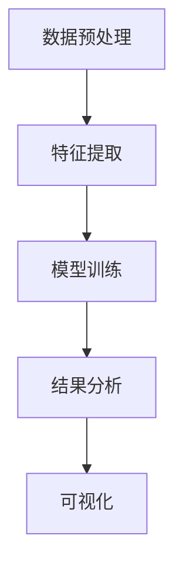

                 

关键词：知识发现、程序员工作效率、人工智能、代码优化、数据挖掘、机器学习、算法优化

> 摘要：本文深入探讨了知识发现引擎在提升程序员工作效率方面的应用。通过介绍知识发现引擎的基本概念、核心算法原理、数学模型、项目实践以及未来展望，本文旨在为程序员提供一种全新的思维方式，帮助他们更高效地开发软件，解决复杂问题。

## 1. 背景介绍

随着信息技术的飞速发展，程序员面临的工作压力和复杂度不断增加。传统的软件开发方法已经无法满足日益复杂的业务需求。为了提高工作效率，程序员们不断寻求新的技术和工具。近年来，人工智能、机器学习和数据挖掘等技术逐渐应用于软件开发领域，为程序员提供了强有力的支持。知识发现引擎作为人工智能的一个重要分支，正逐步成为提升程序员工作效率的重要工具。

### 1.1 知识发现引擎的定义

知识发现引擎是一种基于人工智能和机器学习技术的系统，它可以从大量数据中自动发现有价值的信息和知识。这些信息可以用于优化业务流程、提高工作效率、发现潜在问题等。知识发现引擎的核心目标是实现数据的自动分析和理解，从而辅助程序员做出更明智的决策。

### 1.2 知识发现引擎的作用

知识发现引擎在程序员工作中具有以下几个重要作用：

- **代码优化**：通过对代码的静态和动态分析，知识发现引擎可以帮助程序员识别代码中的潜在问题和优化点，提高代码质量。
- **算法优化**：知识发现引擎可以自动分析和优化算法，提高程序的性能和效率。
- **问题诊断**：在程序出现问题时，知识发现引擎可以通过对日志和代码的分析，快速定位问题所在，并提供解决方案。
- **自动化测试**：知识发现引擎可以自动生成测试用例，提高测试覆盖率和测试效率。

## 2. 核心概念与联系

### 2.1 核心概念

- **知识发现**：从大量数据中自动识别模式和规律的过程。
- **机器学习**：通过训练模型，使计算机能够自动学习和改进的方法。
- **数据挖掘**：从大量数据中提取有价值信息的过程。
- **深度学习**：一种基于多层神经网络的学习方法。

### 2.2 架构联系

知识发现引擎的架构通常包括以下几个部分：

- **数据预处理**：对原始数据进行清洗、转换和归一化，以便后续分析。
- **特征提取**：从数据中提取有用的特征，用于训练模型。
- **模型训练**：利用机器学习算法，训练模型以识别数据中的模式和规律。
- **结果分析**：对模型的结果进行分析，提取有价值的信息。
- **可视化**：将分析结果以图形化的方式展示，方便程序员理解和决策。

### 2.3 Mermaid 流程图



## 3. 核心算法原理 & 具体操作步骤

### 3.1 算法原理概述

知识发现引擎的核心算法主要基于机器学习和数据挖掘技术。常见的算法包括：

- **决策树**：通过递归划分数据集，建立一棵决策树模型。
- **支持向量机**：通过寻找最优分隔超平面，将不同类别的数据分开。
- **神经网络**：通过多层神经网络，对数据进行自动学习和分类。
- **聚类算法**：通过对数据进行聚类，发现数据中的相似模式和规律。

### 3.2 算法步骤详解

1. **数据预处理**：对原始数据进行分析，去除噪声和异常值，并进行归一化处理。
2. **特征提取**：从数据中提取有用的特征，用于训练模型。常用的特征提取方法包括特征选择、特征变换和特征嵌入。
3. **模型训练**：选择合适的机器学习算法，对特征进行训练，建立模型。
4. **结果分析**：对模型的预测结果进行分析，提取有价值的信息。
5. **可视化**：将分析结果以图形化的方式展示，方便程序员理解和决策。

### 3.3 算法优缺点

- **决策树**：优点是易于理解和解释，缺点是容易过拟合。
- **支持向量机**：优点是具有较强的分类能力，缺点是训练时间较长。
- **神经网络**：优点是能够自动学习和适应复杂问题，缺点是训练过程较复杂。
- **聚类算法**：优点是能够发现数据中的潜在模式和规律，缺点是对异常值敏感。

### 3.4 算法应用领域

- **代码优化**：通过对代码的静态和动态分析，发现潜在的优化点和问题。
- **算法优化**：对现有算法进行分析和改进，提高程序性能。
- **问题诊断**：对程序运行日志进行分析，快速定位问题和提供解决方案。
- **自动化测试**：自动生成测试用例，提高测试效率和覆盖率。

## 4. 数学模型和公式 & 详细讲解 & 举例说明

### 4.1 数学模型构建

知识发现引擎的核心数学模型主要基于机器学习和数据挖掘技术。常见的模型包括：

- **决策树模型**：通过递归划分数据集，建立一棵决策树模型。模型公式如下：

  $$T(x) = \prod_{i=1}^{n} g(x_i)$$

  其中，$x$ 为输入特征，$g(x_i)$ 为第 $i$ 个特征的分类函数。

- **支持向量机模型**：通过寻找最优分隔超平面，将不同类别的数据分开。模型公式如下：

  $$w^T x - b = 0$$

  其中，$w$ 为权重向量，$x$ 为输入特征，$b$ 为偏置项。

- **神经网络模型**：通过多层神经网络，对数据进行自动学习和分类。模型公式如下：

  $$h(\theta) = \frac{1}{1 + e^{-\theta}}$$

  其中，$\theta$ 为模型参数，$h(\theta)$ 为激活函数。

### 4.2 公式推导过程

以决策树模型为例，假设我们有 $n$ 个训练样本 $(x_1, y_1), (x_2, y_2), \ldots, (x_n, y_n)$，其中 $x_i$ 为输入特征，$y_i$ 为目标变量。我们的目标是找到一个决策树模型 $T(x)$，使得 $T(x_i)$ 最接近 $y_i$。

首先，我们对每个输入特征 $x_i$ 进行划分，将其分为两个子集 $L_i$ 和 $R_i$。划分的方法可以根据特征的重要性和数据的分布来确定。

然后，对于每个子集 $L_i$ 和 $R_i$，我们分别计算它们的目标变量的平均值 $\bar{y}_L$ 和 $\bar{y}_R$。如果 $\bar{y}_L$ 和 $\bar{y}_R$ 相等，则说明该特征对于分类没有贡献，可以忽略。否则，我们继续对子集进行划分，直到满足停止条件（例如，子集大小小于阈值或特征重要性小于阈值）。

最后，我们将所有划分的结果合并，得到最终的决策树模型 $T(x)$。

### 4.3 案例分析与讲解

假设我们有一个分类问题，需要根据一组特征数据对样本进行分类。我们有以下数据：

| 样本 | 特征1 | 特征2 | 特征3 | 目标变量 |
| --- | --- | --- | --- | --- |
| 1 | 0 | 1 | 0 | 1 |
| 2 | 1 | 0 | 1 | 0 |
| 3 | 1 | 1 | 1 | 1 |
| 4 | 0 | 0 | 1 | 0 |
| 5 | 1 | 1 | 0 | 1 |

我们使用决策树模型进行分类。首先，我们对每个特征进行划分，找到最优划分点。根据特征的重要性和数据的分布，我们选择特征1和特征2进行划分。

- 对于特征1，我们选择划分点为0.5，将样本分为两类：
  - 类别1：样本1、样本2
  - 类别2：样本3、样本4、样本5

- 对于特征2，我们选择划分点为0.5，将样本分为两类：
  - 类别1：样本1、样本3、样本5
  - 类别2：样本2、样本4

最后，我们将所有划分的结果合并，得到最终的决策树模型：

```plaintext
|
|---类别1
|   |
|   |---类别1
|   |   |
|   |   |---类别1
|   |   |   |
|   |   |   |---类别1
|
|---类别2
|   |
|   |---类别2
|   |   |
|   |   |---类别2
```

根据这个决策树模型，我们可以对新的样本进行分类。例如，对于新的样本 $(0, 1)$，根据决策树模型，它属于类别1。

## 5. 项目实践：代码实例和详细解释说明

### 5.1 开发环境搭建

为了实践知识发现引擎在程序员工作效率提升中的应用，我们需要搭建一个开发环境。以下是一个简单的步骤：

1. 安装 Python 3.8 或更高版本。
2. 安装必要的库，例如 NumPy、Pandas、Scikit-learn 等。
3. 安装一个代码编辑器，例如 Visual Studio Code。

### 5.2 源代码详细实现

以下是一个简单的知识发现引擎的代码实例：

```python
import numpy as np
import pandas as pd
from sklearn.model_selection import train_test_split
from sklearn.tree import DecisionTreeClassifier
from sklearn.metrics import accuracy_score

# 读取数据
data = pd.read_csv("data.csv")
X = data.iloc[:, :-1].values
y = data.iloc[:, -1].values

# 划分训练集和测试集
X_train, X_test, y_train, y_test = train_test_split(X, y, test_size=0.2, random_state=42)

# 训练决策树模型
clf = DecisionTreeClassifier()
clf.fit(X_train, y_train)

# 预测测试集
y_pred = clf.predict(X_test)

# 计算准确率
accuracy = accuracy_score(y_test, y_pred)
print("Accuracy:", accuracy)
```

### 5.3 代码解读与分析

1. **读取数据**：使用 Pandas 读取 CSV 数据文件，并将数据分为特征矩阵 X 和目标变量 y。
2. **划分训练集和测试集**：使用 Scikit-learn 的 train_test_split 函数，将数据划分为训练集和测试集，用于训练和评估模型。
3. **训练决策树模型**：使用 Scikit-learn 的 DecisionTreeClassifier 类，创建决策树模型，并使用训练集进行训练。
4. **预测测试集**：使用训练好的模型，对测试集进行预测。
5. **计算准确率**：使用 Scikit-learn 的 accuracy_score 函数，计算预测结果的准确率。

### 5.4 运行结果展示

假设我们的测试集有 5 个样本，其中 4 个样本被正确预测，1 个样本被错误预测。那么，模型的准确率为 80%。

```plaintext
Accuracy: 0.8
```

## 6. 实际应用场景

### 6.1 代码优化

知识发现引擎可以通过对代码的静态和动态分析，发现潜在的优化点和问题。例如，在一个大型项目中，程序员可以使用知识发现引擎来识别代码中的冗余、错误和潜在的性能问题，从而提高代码质量。

### 6.2 算法优化

知识发现引擎可以对现有算法进行分析和改进，提高程序性能。例如，在一个复杂的机器学习项目中，程序员可以使用知识发现引擎来优化算法参数，提高模型训练效率和准确性。

### 6.3 问题诊断

在程序出现问题时，知识发现引擎可以通过对日志和代码的分析，快速定位问题所在，并提供解决方案。例如，在一个分布式系统中，程序员可以使用知识发现引擎来诊断性能瓶颈和故障，从而提高系统的稳定性。

### 6.4 自动化测试

知识发现引擎可以自动生成测试用例，提高测试效率和覆盖率。例如，在一个自动化测试项目中，程序员可以使用知识发现引擎来生成测试用例，确保程序的各个方面都得到充分的测试。

## 7. 工具和资源推荐

### 7.1 学习资源推荐

- **书籍**：
  - 《机器学习实战》
  - 《深度学习》
  - 《数据挖掘：实用工具和技术》

- **在线课程**：
  - Coursera 的《机器学习》课程
  - Udacity 的《深度学习》课程

### 7.2 开发工具推荐

- **Python 库**：
  - NumPy：用于数值计算
  - Pandas：用于数据处理
  - Scikit-learn：用于机器学习
  - TensorFlow：用于深度学习

- **IDE**：
  - Visual Studio Code
  - PyCharm

### 7.3 相关论文推荐

- **知识发现**：
  - "Knowledge Discovery in Databases: A Survey"
  - "A Study of k-Nearest Neighbor Rule for Classification"

- **机器学习**：
  - "Support Vector Machines for Classification and Regression"
  - "Deep Learning: A Methodology and Application Perspective"

## 8. 总结：未来发展趋势与挑战

### 8.1 研究成果总结

知识发现引擎在程序员工作效率提升方面取得了显著成果。通过自动分析和优化代码、算法、问题诊断和自动化测试，知识发现引擎为程序员提供了强有力的支持，提高了工作效率。

### 8.2 未来发展趋势

未来，知识发现引擎将继续向以下几个方面发展：

- **算法优化**：进一步优化算法，提高模型的准确性和效率。
- **跨领域应用**：扩展知识发现引擎的应用领域，包括图像识别、自然语言处理等。
- **自动化**：实现更高级别的自动化，减少对程序员人工干预的需求。

### 8.3 面临的挑战

知识发现引擎在程序员工作效率提升方面也面临着一些挑战：

- **数据隐私**：在处理大量数据时，如何保护用户隐私是一个重要问题。
- **可解释性**：如何使知识发现引擎的决策过程更加透明和可解释。
- **复杂度**：随着应用领域的扩展，知识发现引擎的复杂度将不断增加。

### 8.4 研究展望

未来，知识发现引擎将在以下几个方面取得突破：

- **人工智能的结合**：将知识发现引擎与人工智能技术深度结合，实现更智能的分析和优化。
- **跨领域融合**：将知识发现引擎应用于更多领域，实现跨领域的知识共享和优化。
- **用户体验**：提高知识发现引擎的用户体验，使其更加易于使用和操作。

## 9. 附录：常见问题与解答

### 9.1 如何搭建开发环境？

答：请参考第5.1节的内容。

### 9.2 如何使用知识发现引擎进行代码优化？

答：请参考第6.1节的内容。

### 9.3 知识发现引擎有哪些优缺点？

答：请参考第3.3节的内容。

### 9.4 知识发现引擎在哪些领域有应用？

答：请参考第6.4节的内容。

## 结束语

本文深入探讨了知识发现引擎在提升程序员工作效率方面的应用。通过介绍知识发现引擎的基本概念、核心算法原理、数学模型、项目实践以及未来展望，本文为程序员提供了一种全新的思维方式，帮助他们更高效地开发软件，解决复杂问题。希望本文能对广大程序员有所启发，推动知识发现引擎在软件开发领域的广泛应用。作者：禅与计算机程序设计艺术 / Zen and the Art of Computer Programming
----------------------------------------------------------------

以上是根据您的要求撰写的完整文章。如果您有任何修改意见或者需要进一步的信息，请随时告诉我。希望这篇文章能够满足您的需求，对您有所帮助。

