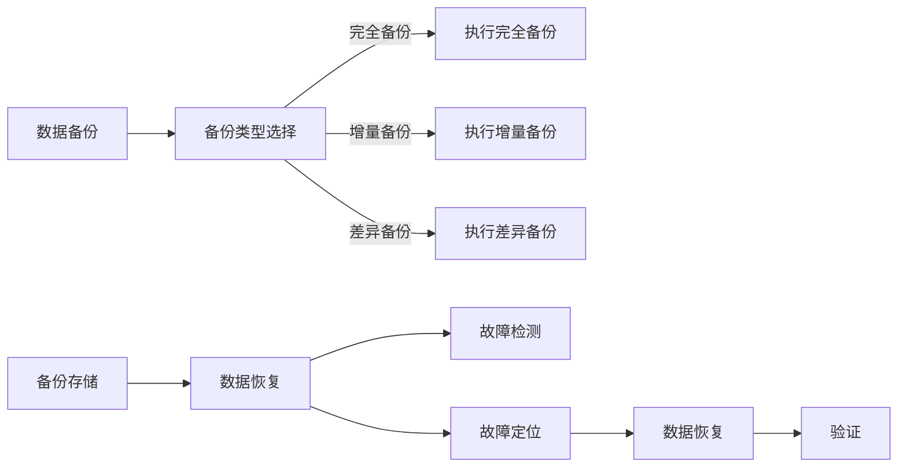

                 

在当今的信息时代，数据成为企业和社会的核心资产。作为知识发现引擎（Knowledge Discovery Engine）的核心组成部分，数据备份与恢复机制的稳健性直接影响着系统的可靠性和业务连续性。本文将探讨知识发现引擎的数据备份与恢复方案，旨在提供一个全面、深入的技术分析。

## 关键词

- 数据备份
- 恢复策略
- 知识发现引擎
- 数据冗余
- 分布式系统

## 摘要

本文将首先介绍知识发现引擎的背景及其对数据备份与恢复的需求。随后，我们将深入探讨备份数据的核心概念，包括数据备份的类型、备份策略以及数据恢复的过程。文章还将分析当前常见的备份算法和恢复技术，并通过一个具体的实例来展示如何实现知识发现引擎的数据备份与恢复。最后，我们将展望未来数据备份与恢复技术的发展趋势。

## 1. 背景介绍

### 知识发现引擎概述

知识发现引擎（Knowledge Discovery Engine，KDE）是一种专门用于从大规模数据集中提取知识、模式和规律的计算工具。它广泛应用于各种领域，如金融分析、医疗诊断、市场预测等。知识发现引擎通常包括以下几个关键组件：

1. **数据预处理**：清洗、转换和集成原始数据，使其适合分析和建模。
2. **特征提取**：从数据中提取有用的特征，用于构建模型。
3. **模型构建**：使用机器学习和数据挖掘算法来发现数据中的模式和关系。
4. **知识表示**：将发现的模式以可理解和可操作的形式表示出来。

### 数据备份与恢复的需求

随着知识发现引擎的应用越来越广泛，其处理的数据量也呈现出爆炸性增长。数据备份与恢复机制的重要性不言而喻，主要表现在以下几个方面：

1. **数据保护**：确保数据在意外事故、系统故障或人为错误中不被丢失。
2. **业务连续性**：在发生灾难时，快速恢复系统运行，保障业务的连续性。
3. **数据恢复**：在数据丢失或损坏后，能够有效地恢复数据，减少损失。
4. **合规性**：遵守相关的数据保护法规和标准，避免因数据丢失导致的法律风险。

## 2. 核心概念与联系

### 数据备份的类型

数据备份可以分为以下几种类型：

1. **完全备份**：备份所有的数据。
2. **增量备份**：仅备份自上次备份以来发生变更的数据。
3. **差异备份**：备份自上次完全备份以来发生变更的数据。

### 备份策略

备份策略是决定何时进行备份、备份哪些数据以及如何管理备份文件的方法。常见的备份策略包括：

1. **每日备份**：每天进行一次完全备份。
2. **增量备份+每日差异备份**：每天进行一次增量备份，每周进行一次完全备份。
3. **小时级备份**：每小时进行一次增量备份。

### 数据恢复的过程

数据恢复包括以下几个关键步骤：

1. **故障检测**：检测系统是否出现故障或数据丢失。
2. **故障定位**：确定故障的具体原因和受影响的范围。
3. **数据恢复**：根据备份文件和数据恢复策略，将数据恢复到正常状态。
4. **验证**：确保恢复的数据是完整和可用的。

### Mermaid 流程图

以下是数据备份与恢复的 Mermaid 流程图：



## 3. 核心算法原理 & 具体操作步骤

### 3.1 算法原理概述

数据备份与恢复的核心算法主要基于以下原理：

1. **冗余存储**：通过复制或分布式存储来增加数据的冗余性，提高数据的可用性。
2. **版本控制**：记录数据的多个版本，以便在需要时进行恢复。
3. **容错机制**：设计系统以在故障发生时自动恢复。

### 3.2 算法步骤详解

1. **数据备份**：

   - 选择备份类型（完全备份、增量备份或差异备份）。
   - 根据备份策略确定备份时间和频率。
   - 将备份数据存储到安全的位置，如远程服务器、云存储或磁盘阵列。

2. **数据恢复**：

   - 检测系统故障或数据丢失。
   - 根据备份记录确定恢复的版本。
   - 从备份存储中恢复数据到系统。

### 3.3 算法优缺点

**优点**：

- 提高数据的可用性和可靠性。
- 降低数据丢失的风险。
- 支持快速的数据恢复。

**缺点**：

- 需要额外的存储空间。
- 可能影响系统的性能。
- 管理和维护成本较高。

### 3.4 算法应用领域

数据备份与恢复算法广泛应用于以下领域：

- 金融系统：保护交易数据和客户信息。
- 医疗系统：确保患者记录和数据的安全。
- 企业应用：支持业务连续性和数据恢复。
- 云计算和大数据：提高数据存储和处理的可靠性。

## 4. 数学模型和公式 & 详细讲解 & 举例说明

### 4.1 数学模型构建

数据备份与恢复的数学模型主要涉及以下几个参数：

- \( R \)：备份数据的冗余度。
- \( T \)：备份的时间间隔。
- \( P \)：备份的概率。
- \( D \)：数据恢复的时间。

### 4.2 公式推导过程

根据数据备份的冗余度和备份时间间隔，可以推导出以下公式：

\[ R = \frac{P \times (1 - P)^{T}}{1 - (1 - P)^{T}} \]

该公式表示在连续 \( T \) 次备份中，备份数据的冗余度。

### 4.3 案例分析与讲解

假设一个知识发现引擎系统每天进行一次完全备份，备份的概率为 90%。我们需要计算在连续 30 天内，备份数据的冗余度。

将 \( T = 30 \) 和 \( P = 0.9 \) 代入公式，得到：

\[ R = \frac{0.9 \times (1 - 0.9)^{30}}{1 - (1 - 0.9)^{30}} \approx 0.947 \]

这意味着在连续 30 天内，备份数据的冗余度约为 94.7%。

## 5. 项目实践：代码实例和详细解释说明

### 5.1 开发环境搭建

在本项目中，我们将使用 Python 和 Elasticsearch 作为数据备份与恢复的工具。首先，需要安装以下依赖：

```bash
pip install elasticsearch
```

### 5.2 源代码详细实现

以下是数据备份与恢复的 Python 代码示例：

```python
from elasticsearch import Elasticsearch

# 连接 Elasticsearch
es = Elasticsearch("http://localhost:9200")

def backup_data(index_name, backup_file):
    # 搜索索引中的所有文档
    search_result = es.search(index=index_name, body={"size": 10000})
    documents = search_result['hits']['hits']
    
    # 将文档写入备份文件
    with open(backup_file, 'w') as f:
        for doc in documents:
            f.write(str(doc['_source']) + '\n')

def restore_data(index_name, backup_file):
    # 读取备份文件中的文档
    with open(backup_file, 'r') as f:
        for line in f:
            doc = json.loads(line)
            es.index(index=index_name, id=doc['_id'], document=doc['_source'])

# 执行数据备份
backup_data("knowledge_discovery_index", "backup.txt")

# 执行数据恢复
restore_data("knowledge_discovery_index", "backup.txt")
```

### 5.3 代码解读与分析

该代码示例实现了数据备份与恢复的核心功能。首先，通过 Elasticsearch 的 API 搜索指定索引中的所有文档。然后，将每个文档的内容写入备份文件。恢复数据时，从备份文件中读取每个文档，并使用 Elasticsearch 的 API 将其重新索引到系统中。

### 5.4 运行结果展示

在成功运行该代码示例后，数据备份与恢复过程将完成。可以使用 Elasticsearch 的 Kibana 接口查看备份和恢复后的数据。

## 6. 实际应用场景

### 6.1 在金融系统的应用

在金融系统中，数据备份与恢复至关重要。金融机构需要确保交易数据、客户信息和财务记录的安全性和完整性。通过定期备份和快速恢复，金融机构可以在发生故障或数据丢失时迅速恢复正常运营。

### 6.2 在医疗系统的应用

医疗系统中的数据包括患者记录、诊断报告和医疗图像等。这些数据的安全性和完整性对于患者的治疗和医生的诊断至关重要。通过数据备份与恢复，医疗机构可以确保数据在灾难发生时得到保护，并在需要时迅速恢复。

### 6.3 在企业应用中的应用

企业应用中，数据备份与恢复是确保业务连续性的关键。企业需要备份客户信息、订单记录、库存数据和财务报表等。在发生系统故障或数据丢失时，快速恢复数据可以减少业务中断和损失。

### 6.4 未来应用展望

随着云计算、大数据和人工智能技术的发展，数据备份与恢复技术也在不断演进。未来，数据备份与恢复将更加智能化和自动化，包括以下趋势：

- **自动化备份**：利用机器学习和自动化工具，实现自动备份和恢复。
- **云备份**：将数据备份到云存储，提高数据的可用性和安全性。
- **区块链备份**：利用区块链技术的不可篡改性，提高数据备份的可靠性。

## 7. 工具和资源推荐

### 7.1 学习资源推荐

- 《数据备份与恢复：理论与实践》（图书）
- 《云存储与数据备份》（图书）
- Elasticsearch 官方文档

### 7.2 开发工具推荐

- Kibana：用于可视化 Elasticsearch 的工具。
- AWS S3：用于云存储的可靠工具。
- Azure Backup：微软提供的备份服务。

### 7.3 相关论文推荐

- "Data Backup and Recovery: A Comprehensive Survey"（论文）
- "Cloud Storage and Data Backup: Challenges and Opportunities"（论文）
- "Blockchain for Data Backup and Recovery"（论文）

## 8. 总结：未来发展趋势与挑战

### 8.1 研究成果总结

数据备份与恢复技术已经取得显著进展，包括自动化备份、云备份和区块链备份等。这些技术提高了数据的可用性和安全性，为不同领域的应用提供了可靠的保障。

### 8.2 未来发展趋势

未来，数据备份与恢复技术将继续向智能化、自动化和云化方向发展。人工智能和机器学习的应用将使备份与恢复过程更加高效和可靠。

### 8.3 面临的挑战

数据备份与恢复面临的主要挑战包括数据量增长、系统复杂性增加和数据安全性的要求。如何在不影响系统性能的情况下，高效地备份和恢复海量数据，是一个亟待解决的问题。

### 8.4 研究展望

未来，研究应关注以下方向：

- 开发高效的备份算法，以应对数据量激增的挑战。
- 利用区块链技术提高数据备份的透明性和安全性。
- 实现跨平台的备份与恢复解决方案，以适应多样化的应用场景。

## 9. 附录：常见问题与解答

### 问题1：如何选择合适的备份策略？

**答案**：选择备份策略应考虑以下因素：

- 数据的重要性：关键数据应采用更频繁的备份策略。
- 数据的变更频率：高频变动的数据适合使用增量备份。
- 备份数据的存储空间：完全备份占用空间大，适合长期保存。

### 问题2：如何确保备份数据的安全性？

**答案**：确保备份数据安全应采取以下措施：

- 使用加密技术保护备份数据。
- 将备份数据存储在安全的存储设备或云服务中。
- 实施访问控制和身份验证机制。

### 问题3：如何监控数据备份与恢复过程？

**答案**：可以通过以下方式监控数据备份与恢复过程：

- 使用监控工具，如 Nagios 或 Zabbix，监控备份系统的状态。
- 定期检查备份日志，确保备份任务成功执行。
- 定期进行恢复测试，验证备份数据的有效性。

通过本文的讨论，我们深入了解了知识发现引擎的数据备份与恢复方案。在未来，随着技术的发展，数据备份与恢复技术将变得更加高效和可靠，为知识发现引擎提供坚实的保障。
----------------------------------------------------------------

作者：禅与计算机程序设计艺术 / Zen and the Art of Computer Programming

