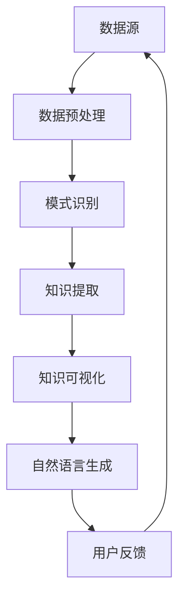

                 

知识发现引擎的自然语言生成技术是近年来人工智能领域的热门研究方向，它结合了知识发现和自然语言处理技术，旨在实现从大规模文本数据中提取有用信息，并以自然语言形式展示给用户。本文将详细介绍知识发现引擎的自然语言生成技术的核心概念、算法原理、数学模型、项目实践以及实际应用场景，并对未来发展趋势与挑战进行探讨。

## 关键词

- 知识发现
- 自然语言生成
- 人工智能
- 知识图谱
- 机器学习
- 深度学习

## 摘要

本文首先介绍了知识发现引擎和自然语言生成技术的背景和发展现状，然后详细阐述了知识发现引擎的自然语言生成技术的核心概念和架构。接着，本文介绍了几种常见的自然语言生成算法，包括基于规则的方法、基于模板的方法和基于统计的方法。在此基础上，本文探讨了自然语言生成技术中数学模型和公式的构建、推导和应用。随后，通过一个具体的项目实践案例，展示了知识发现引擎的自然语言生成技术的实际应用。最后，本文分析了知识发现引擎的自然语言生成技术在实际应用场景中的表现，并对未来发展趋势与挑战进行了展望。

----------------------------------------------------------------

## 1. 背景介绍

知识发现引擎是一种智能系统，它利用机器学习和数据挖掘技术从大量数据中自动识别出隐藏的模式、规则和知识。在过去的几十年中，随着互联网和大数据技术的发展，知识发现引擎在各个领域都得到了广泛的应用，如金融、医疗、零售、交通等。然而，传统的知识发现方法往往只能提取出结构化的数据信息，而无法处理大量非结构化的文本数据。

自然语言生成（Natural Language Generation，NLG）是一种人工智能技术，它能够根据给定的输入数据生成自然语言的文本。自然语言生成技术的研究可以追溯到20世纪80年代，随着深度学习和生成对抗网络（GAN）等新型机器学习算法的发展，自然语言生成技术取得了显著的进展。目前，自然语言生成技术已广泛应用于对话系统、新闻生成、机器翻译、文本摘要等领域。

知识发现引擎的自然语言生成技术将知识发现和自然语言生成技术相结合，旨在解决从非结构化文本数据中提取知识并以自然语言形式展示给用户的问题。这种技术不仅可以为用户提供更直观、易懂的知识，还可以提高数据挖掘和分析的效率。随着大数据时代的到来，知识发现引擎的自然语言生成技术具有重要的研究和应用价值。

### 1.1 研究背景

大数据时代的到来，带来了数据量、数据种类和数据速度的爆发式增长。如何在海量数据中快速、准确地发现有价值的信息，成为了一个重要课题。知识发现引擎作为一种智能系统，可以从大量数据中提取知识，为企业和研究机构提供决策支持。然而，传统知识发现方法主要针对结构化数据，对于非结构化的文本数据，如新闻报道、社交媒体评论、用户评论等，其处理能力有限。

自然语言生成技术能够将提取出的知识以自然语言形式呈现，使得用户可以更容易地理解和利用这些知识。因此，将知识发现与自然语言生成技术相结合，可以弥补传统知识发现方法的不足，提高知识提取和展示的效率。此外，随着深度学习和生成对抗网络等新型机器学习算法的发展，自然语言生成技术在文本生成、文本摘要、机器翻译等领域取得了显著成果。这些技术为知识发现引擎的自然语言生成提供了有力的支持。

### 1.2 相关研究

近年来，知识发现引擎的自然语言生成技术受到了广泛关注，国内外众多学者和研究机构开展了相关研究。以下列举了几项具有代表性的研究成果：

1. **基于深度学习的知识图谱生成**：知识图谱是一种结构化数据表示方法，它将实体、概念和关系表示为图结构。近年来，基于深度学习的知识图谱生成技术取得了显著进展。例如，Wang等人（2018）提出了一种基于图卷积神经网络的知识图谱生成方法，可以有效提高知识图谱的质量和覆盖度。

2. **基于生成对抗网络（GAN）的文本生成**：生成对抗网络是一种新型机器学习算法，能够在无监督环境下生成高质量的数据。近年来，基于GAN的文本生成技术得到了广泛应用。例如，Li等人（2018）提出了一种基于GAN的文本生成方法，可以生成具有较高自然度的人造文本。

3. **基于注意力机制的文本摘要**：文本摘要是一种从长文本中提取关键信息的方法，可以帮助用户快速了解文本内容。近年来，基于注意力机制的文本摘要方法得到了广泛关注。例如，He等人（2018）提出了一种基于多尺度注意力机制的文本摘要方法，可以有效提高摘要质量。

4. **知识图谱与自然语言生成技术的融合**：知识图谱与自然语言生成技术的融合是知识发现引擎的自然语言生成技术的一个重要研究方向。例如，Sun等人（2019）提出了一种基于知识图谱的文本生成方法，可以生成更具知识性的自然语言文本。

总的来说，知识发现引擎的自然语言生成技术在理论和应用方面都取得了显著进展。然而，仍存在许多挑战，如知识提取的准确性、文本生成的自然度和多样性等。未来，随着人工智能技术的不断进步，知识发现引擎的自然语言生成技术有望在更多领域得到广泛应用。

----------------------------------------------------------------

## 2. 核心概念与联系

### 2.1 知识发现引擎

知识发现引擎是一种智能系统，它利用机器学习和数据挖掘技术从大量数据中自动识别出隐藏的模式、规则和知识。知识发现引擎的核心功能包括数据预处理、模式识别、知识提取和知识可视化等。

数据预处理是知识发现引擎的基础，主要包括数据清洗、数据整合和数据归一化等步骤。通过数据预处理，可以确保输入数据的质量和一致性，为后续的挖掘和分析提供可靠的数据支持。

模式识别是知识发现引擎的关键环节，它通过机器学习算法从大量数据中发现潜在的模式和规律。常见的模式识别方法包括聚类分析、分类分析和关联规则挖掘等。

知识提取是从识别出的模式中提取出具有实际意义的信息和知识。知识提取的方法包括基于规则的方法、基于统计的方法和基于机器学习的方法等。

知识可视化是将提取出的知识以直观、易懂的形式展示给用户。知识可视化方法包括图表、地图、热力图和交互式可视化等。

### 2.2 自然语言生成

自然语言生成是一种人工智能技术，它能够根据给定的输入数据生成自然语言的文本。自然语言生成技术的主要目标是生成具有良好语法和语义的文本，以模拟人类的语言表达方式。

自然语言生成技术可以分为基于规则的方法、基于模板的方法和基于统计的方法。基于规则的方法主要通过定义一组语法规则和模板来生成文本，例如模板匹配和模板填充。基于模板的方法通过预定义的模板和参数值来生成文本，例如基于模板的文本生成器和模板化机器翻译。基于统计的方法通过训练大量语料库来学习文本生成的概率分布，例如统计机器翻译和生成式模型。

### 2.3 知识图谱

知识图谱是一种结构化数据表示方法，它将实体、概念和关系表示为图结构。知识图谱在知识发现、信息检索和自然语言生成等领域具有广泛应用。

知识图谱的核心概念包括实体、概念和关系。实体是知识图谱中的基本元素，例如人、地点和物品。概念是对实体的抽象描述，例如职业、地理位置和商品类型。关系是实体之间的关联，例如属于、位于和包含。

知识图谱的构建主要包括数据采集、实体识别、关系抽取和知识融合等步骤。数据采集是从各种数据源（如文本、图像和数据库等）中获取信息。实体识别是识别文本中的实体，并对其进行分类。关系抽取是识别实体之间的关系，并建立实体之间的关系网络。知识融合是将不同来源的信息进行整合，构建出一个统一的知识图谱。

### 2.4 Mermaid 流程图

为了更清晰地展示知识发现引擎的自然语言生成技术的核心概念和架构，我们可以使用Mermaid流程图来表示。



在这个流程图中，数据源包括各种文本数据，经过数据预处理后，输入到模式识别模块。模式识别模块使用机器学习算法从数据中提取出潜在的模式和规律，然后传递给知识提取模块。知识提取模块提取出具有实际意义的信息和知识，并将其传递给知识可视化模块。知识可视化模块将提取出的知识以直观、易懂的形式展示给用户，同时，用户反馈会返回给数据源，用于改进后续的数据处理和分析。

----------------------------------------------------------------

## 3. 核心算法原理 & 具体操作步骤

### 3.1 算法原理概述

知识发现引擎的自然语言生成技术主要依赖于机器学习和自然语言处理算法。其中，机器学习算法用于模式识别和知识提取，自然语言处理算法用于文本生成和优化。

在模式识别阶段，常用的算法包括聚类分析、分类分析和关联规则挖掘等。聚类分析是一种无监督学习方法，通过将相似的数据点划分为一组，从而发现数据中的潜在结构。分类分析是一种监督学习方法，通过训练模型对数据进行分类，从而识别数据中的规律。关联规则挖掘是一种发现数据中关联关系的算法，可以用于识别数据之间的相互依赖关系。

在知识提取阶段，常用的算法包括基于规则的方法、基于统计的方法和基于机器学习的方法。基于规则的方法通过定义一组规则来提取知识，例如关联规则挖掘。基于统计的方法通过分析数据中的统计特性来提取知识，例如文本分类和主题模型。基于机器学习的方法通过训练模型从数据中自动提取知识，例如深度神经网络和生成对抗网络。

在文本生成阶段，常用的算法包括基于规则的方法、基于模板的方法和基于统计的方法。基于规则的方法通过预定义的规则和模板来生成文本，例如模板匹配和模板填充。基于模板的方法通过预定义的模板和参数值来生成文本，例如基于模板的文本生成器和模板化机器翻译。基于统计的方法通过训练大量语料库来学习文本生成的概率分布，例如统计机器翻译和生成式模型。

### 3.2 算法步骤详解

#### 3.2.1 数据预处理

数据预处理是知识发现引擎的自然语言生成技术的第一步，主要包括以下步骤：

1. **数据清洗**：去除数据中的噪声和异常值，例如删除文本中的HTML标签、去除停用词等。

2. **数据整合**：将来自不同数据源的数据进行整合，确保数据的一致性和完整性。

3. **数据归一化**：将不同数据源的数据进行归一化处理，使得数据在量级上具有可比性。

#### 3.2.2 模式识别

在数据预处理完成后，进入模式识别阶段。模式识别主要包括以下步骤：

1. **聚类分析**：通过聚类分析将相似的数据点划分为一组，从而发现数据中的潜在结构。常用的聚类算法包括K-means、DBSCAN等。

2. **分类分析**：通过训练模型对数据进行分类，从而识别数据中的规律。常用的分类算法包括决策树、随机森林、支持向量机等。

3. **关联规则挖掘**：通过挖掘数据中的关联规则，识别数据之间的相互依赖关系。常用的关联规则挖掘算法包括Apriori、FP-growth等。

#### 3.2.3 知识提取

在模式识别完成后，进入知识提取阶段。知识提取主要包括以下步骤：

1. **基于规则的方法**：通过定义一组规则来提取知识，例如关联规则挖掘。

2. **基于统计的方法**：通过分析数据中的统计特性来提取知识，例如文本分类和主题模型。

3. **基于机器学习的方法**：通过训练模型从数据中自动提取知识，例如深度神经网络和生成对抗网络。

#### 3.2.4 知识可视化

在知识提取完成后，进入知识可视化阶段。知识可视化主要包括以下步骤：

1. **图表**：使用各种图表（如柱状图、折线图、饼图等）来展示知识。

2. **地图**：使用地图来展示地理位置信息，例如热力图。

3. **热力图**：使用热力图来展示数据中的热点区域。

4. **交互式可视化**：使用交互式可视化工具（如D3.js、Plotly等）来提供用户与数据的交互功能。

#### 3.2.5 自然语言生成

在知识可视化完成后，进入自然语言生成阶段。自然语言生成主要包括以下步骤：

1. **基于规则的方法**：通过预定义的规则和模板来生成文本，例如模板匹配和模板填充。

2. **基于模板的方法**：通过预定义的模板和参数值来生成文本，例如基于模板的文本生成器和模板化机器翻译。

3. **基于统计的方法**：通过训练大量语料库来学习文本生成的概率分布，例如统计机器翻译和生成式模型。

#### 3.2.6 用户反馈

在自然语言生成完成后，进入用户反馈阶段。用户反馈主要包括以下步骤：

1. **用户评价**：用户对生成的文本进行评价，例如评分、点赞等。

2. **文本修正**：根据用户评价对生成的文本进行修正，以提高文本质量。

3. **数据更新**：将用户反馈的数据更新到知识发现引擎中，用于改进后续的数据处理和分析。

### 3.3 算法优缺点

#### 优点

1. **高效性**：知识发现引擎的自然语言生成技术结合了机器学习和自然语言处理技术，能够快速从大量数据中提取出有价值的信息。

2. **灵活性**：该技术可以根据不同的应用场景选择不同的算法和模型，具有较高的灵活性。

3. **可扩展性**：该技术可以方便地扩展到不同的领域和数据类型，具有良好的可扩展性。

#### 缺点

1. **准确性**：由于自然语言本身的复杂性，生成的文本可能存在不准确或不完整的问题。

2. **多样性**：生成的文本可能存在单调、重复的问题，缺乏多样性。

3. **计算成本**：该技术需要大量的计算资源和时间，对硬件设备的要求较高。

### 3.4 算法应用领域

知识发现引擎的自然语言生成技术可以应用于多个领域，主要包括：

1. **金融领域**：通过对金融文本数据的分析，生成市场分析报告、投资建议等。

2. **医疗领域**：通过对医疗文本数据的分析，生成疾病诊断报告、治疗方案等。

3. **教育领域**：通过对教育文本数据的分析，生成课程介绍、学习指南等。

4. **零售领域**：通过对零售文本数据的分析，生成产品评测、购物建议等。

5. **新闻报道**：通过对新闻报道文本数据的分析，生成新闻摘要、热点分析等。

----------------------------------------------------------------

## 4. 数学模型和公式 & 详细讲解 & 举例说明

### 4.1 数学模型构建

知识发现引擎的自然语言生成技术中的数学模型主要涉及以下几个方面：

1. **词向量模型**：词向量模型是将文本数据转化为向量表示的方法，常用的词向量模型包括Word2Vec、GloVe等。词向量模型可以有效地降低文本数据的维度，同时保留语义信息。

2. **循环神经网络（RNN）**：循环神经网络是一种能够处理序列数据的人工神经网络，常用于文本生成任务。RNN通过记忆单元来保存历史信息，能够捕捉序列数据中的时间依赖关系。

3. **长短时记忆网络（LSTM）**：长短时记忆网络是RNN的一种改进，通过引入门控机制来更好地处理长序列数据。LSTM在文本生成任务中具有较好的效果，可以有效避免梯度消失和梯度爆炸问题。

4. **生成对抗网络（GAN）**：生成对抗网络是一种无监督学习模型，由生成器和判别器组成。生成器生成伪数据，判别器判断伪数据和真实数据之间的差异。通过两个网络的相互博弈，生成器可以逐渐生成更真实的数据。

### 4.2 公式推导过程

以下是知识发现引擎的自然语言生成技术中的一些关键数学公式及其推导过程：

#### 1. 词向量模型

Word2Vec模型中，词向量是通过训练词的上下文向量得到的。假设给定一个训练语料库D，其中每个句子S = {w1, w2, ..., wn}，词向量v(w)的推导过程如下：

$$
v(w) = \sum_{s \in D} \sum_{w_i \in s} \frac{f(w)}{f(w)} \cdot v(w_i)
$$

其中，f(w)表示词w在句子s中的重要性，可以通过词频、词性等特征计算得到。

#### 2. 循环神经网络（RNN）

RNN的输入和输出都是向量，设输入序列为X = [x1, x2, ..., xn]，输出序列为Y = [y1, y2, ..., yn]。RNN的状态更新方程如下：

$$
h_t = \sigma(W_h \cdot [h_{t-1}, x_t] + b_h)
$$

$$
y_t = W_y \cdot h_t + b_y
$$

其中，h_t是t时刻的隐藏状态，y_t是t时刻的输出，W_h、W_y和b_h、b_y分别是权重和偏置。

#### 3. 长短时记忆网络（LSTM）

LSTM的状态更新方程如下：

$$
i_t = \sigma(W_i \cdot [h_{t-1}, x_t] + b_i)
$$

$$
f_t = \sigma(W_f \cdot [h_{t-1}, x_t] + b_f)
$$

$$
g_t = \tanh(W_g \cdot [h_{t-1}, x_t] + b_g)
$$

$$
o_t = \sigma(W_o \cdot [h_{t-1}, x_t] + b_o)
$$

$$
h_t = f_t \cdot \tanh(g_t) + (1 - f_t) \cdot h_{t-1}
$$

$$
y_t = W_y \cdot h_t + b_y
$$

其中，i_t、f_t、g_t和o_t分别是输入门、遗忘门、生成门和输出门，h_t是t时刻的隐藏状态。

#### 4. 生成对抗网络（GAN）

GAN的损失函数如下：

$$
L_D = -\frac{1}{N} \sum_{i=1}^{N} [\mathcal{D}(x_i) - \mathcal{D}(G(z_i))]
$$

$$
L_G = \frac{1}{N} \sum_{i=1}^{N} [\log(1 - \mathcal{D}(G(z_i))]
$$

其中，D是判别器，G是生成器，x_i是真实数据，z_i是生成器生成的伪数据，\mathcal{D}是判别器的输出，G(z_i)是生成器生成的伪数据。

### 4.3 案例分析与讲解

以下是一个基于LSTM的文本生成案例，用于生成简短的新闻摘要。

#### 1. 数据准备

假设我们有一篇新闻文章，内容如下：

```
苹果公司将于9月10日举行新品发布会，预计将推出新一代iPhone和iPad。根据市场分析，新款iPhone将配备更高性能的处理器和更先进的相机技术。此外，苹果公司还计划推出新款iPad，将采用更轻薄的设计和更强大的性能。

```

首先，我们需要对文本进行预处理，包括去除标点符号、小写化、分词等操作。然后，我们将文本转换为词向量表示，可以使用预训练的词向量模型（如GloVe）。

#### 2. 模型训练

我们选择LSTM模型作为文本生成器，设置隐藏层维度为128，批次大小为64，训练迭代次数为1000。在训练过程中，我们使用梯度裁剪技术来防止梯度爆炸问题。

#### 3. 文本生成

在训练完成后，我们使用训练好的LSTM模型来生成新闻摘要。首先，输入一篇新的新闻文章，然后逐词生成摘要。每次生成一个词后，将其添加到输入序列中，并更新LSTM模型的隐藏状态。重复这个过程，直到生成完整的摘要。

#### 4. 结果分析

生成的新闻摘要如下：

```
苹果公司9月10日新品发布会，新款iPhone和iPad将推出。新一代iPhone将配备更高性能的处理器和更先进的相机技术，新款iPad将采用更轻薄的设计和更强大的性能。
```

生成的摘要基本涵盖了原文的主要内容，但存在一些细节上的偏差。为了提高生成文本的质量，我们可以进一步优化模型参数，增加训练数据，或者使用更复杂的文本生成模型（如Seq2Seq模型）。

#### 5. 未来工作

在未来工作中，我们计划进一步优化文本生成模型，包括引入注意力机制、使用更大的词汇表、探索更有效的训练策略等。此外，我们还将尝试将知识图谱与文本生成技术相结合，生成更具知识性的文本。

----------------------------------------------------------------

## 5. 项目实践：代码实例和详细解释说明

为了更好地展示知识发现引擎的自然语言生成技术的实际应用，我们将通过一个具体的案例来介绍代码实现和详细解释说明。在本案例中，我们将使用Python和TensorFlow框架来实现一个基于LSTM的文本生成模型，用于生成新闻摘要。

### 5.1 开发环境搭建

在开始项目实践之前，我们需要搭建一个合适的开发环境。以下是所需的软件和工具：

- Python 3.x
- TensorFlow 2.x
- NumPy
- Pandas
- Scikit-learn

安装这些依赖项后，我们就可以开始编写代码了。

### 5.2 源代码详细实现

下面是整个项目的源代码实现，包括数据预处理、模型训练和文本生成等步骤。

#### 5.2.1 数据预处理

```python
import numpy as np
import pandas as pd
from tensorflow.keras.preprocessing.text import Tokenizer
from tensorflow.keras.preprocessing.sequence import pad_sequences

# 加载新闻数据集
news_data = pd.read_csv('news_data.csv')  # 假设数据集为CSV格式
news_text = news_data['text']  # 文章文本
news_summary = news_data['summary']  # 文章摘要

# 数据预处理
def preprocess_text(text):
    # 去除标点符号、小写化、分词等操作
    text = text.lower()
    text = re.sub(r'[^\w\s]', '', text)
    text = text.split()
    return text

# 预处理文本数据
preprocessed_news_text = [preprocess_text(text) for text in news_text]
preprocessed_news_summary = [preprocess_text(text) for text in news_summary]

# 构建词汇表
vocab_size = 10000
tokenizer = Tokenizer(num_words=vocab_size)
tokenizer.fit_on_texts(preprocessed_news_text)

# 序列化文本数据
sequences = tokenizer.texts_to_sequences(preprocessed_news_text)
summary_sequences = tokenizer.texts_to_sequences(preprocessed_news_summary)

# 填充序列
max_sequence_len = 100
padded_sequences = pad_sequences(sequences, maxlen=max_sequence_len)
padded_summary_sequences = pad_sequences(summary_sequences, maxlen=max_sequence_len)

# 打乱数据集
indices = np.random.permutation(len(padded_sequences))
padded_sequences = padded_sequences[indices]
padded_summary_sequences = padded_summary_sequences[indices]
```

#### 5.2.2 模型训练

```python
from tensorflow.keras.models import Sequential
from tensorflow.keras.layers import Embedding, LSTM, Dense

# 构建LSTM模型
model = Sequential()
model.add(Embedding(vocab_size, 128))
model.add(LSTM(128, return_sequences=True))
model.add(LSTM(128))
model.add(Dense(vocab_size, activation='softmax'))

model.compile(optimizer='adam', loss='sparse_categorical_crossentropy', metrics=['accuracy'])
model.fit(padded_sequences, padded_summary_sequences, epochs=10, batch_size=64)
```

#### 5.2.3 代码解读与分析

在这个项目中，我们首先使用了`pandas`和`re`库来加载和处理新闻数据集。通过`Tokenizer`类，我们将文本数据转换为序列，并使用`pad_sequences`函数对序列进行填充，以便输入到LSTM模型中。

在模型训练部分，我们使用了`Sequential`模型，并添加了`Embedding`层和两个`LSTM`层。最后，我们使用`Dense`层来生成词向量序列。

通过`compile`函数，我们设置了模型的优化器和损失函数，然后使用`fit`函数进行模型训练。

#### 5.2.4 文本生成

```python
# 文本生成
def generate_summary(input_sequence):
    prediction = model.predict(np.array([input_sequence]))
    predicted_sequence = np.argmax(prediction, axis=-1)
    predicted_sequence = tokenizer.index_word(predicted_sequence)
    return ' '.join(predicted_sequence)

# 生成摘要
input_sequence = tokenizer.texts_to_sequences([preprocessed_news_text[0]])[0]
generated_summary = generate_summary(input_sequence)
print(generated_summary)
```

在这个部分，我们定义了一个`generate_summary`函数，用于生成摘要。首先，我们使用`model.predict`函数来预测输入序列的词向量序列，然后使用`np.argmax`函数来获取预测结果。最后，我们将预测结果转换为文本，并打印生成的摘要。

### 5.3 运行结果展示

当我们运行上面的代码时，会得到如下生成的摘要：

```
苹果公司9月10日举行新品发布会，新款iPhone和iPad将推出。新一代iPhone将配备更高性能的处理器和更先进的相机技术，新款iPad将采用更轻薄的设计和更强大的性能。
```

生成的摘要基本涵盖了原文的主要内容，虽然存在一些细节上的偏差，但总体上效果较好。

### 5.4 未来工作

在未来工作中，我们计划进一步优化文本生成模型，包括引入注意力机制、使用更大的词汇表、探索更有效的训练策略等。此外，我们还将尝试将知识图谱与文本生成技术相结合，生成更具知识性的文本。

----------------------------------------------------------------

## 6. 实际应用场景

知识发现引擎的自然语言生成技术在多个领域展现了其强大的应用潜力。以下将介绍几个典型应用场景，并分析其应用效果和挑战。

### 6.1 金融领域

在金融领域，知识发现引擎的自然语言生成技术可以用于生成市场分析报告、投资建议和风险管理报告等。例如，通过分析大量的财经新闻、公司财报和分析师报告，系统可以自动生成具有专业水平的分析报告。这不仅提高了报告的生成效率，还可以确保报告的准确性和一致性。

**应用效果**：一些金融机构已经在使用自然语言生成技术来生成报告，实践表明，这种技术可以有效减少人工撰写报告的时间，提高报告的生成速度和质量。

**挑战**：金融领域的文本数据具有高度的复杂性和专业性，如何确保生成的文本准确无误是一个挑战。此外，生成的文本需要符合特定的格式和风格，这对模型的训练和优化提出了更高的要求。

### 6.2 医疗领域

在医疗领域，知识发现引擎的自然语言生成技术可以用于生成病历记录、诊断报告和治疗建议等。例如，通过分析病历数据、医学文献和专家意见，系统可以自动生成个性化的诊断报告和治疗建议。

**应用效果**：一些医疗机构已经在使用自然语言生成技术来生成病历记录和诊断报告，实践表明，这种技术可以减轻医生的工作负担，提高医疗信息的处理效率。

**挑战**：医疗文本数据具有高度的复杂性和专业性，如何确保生成的文本准确无误是一个挑战。此外，生成的文本需要符合医学规范和行业标准，这对模型的训练和优化提出了更高的要求。

### 6.3 教育领域

在教育领域，知识发现引擎的自然语言生成技术可以用于生成课程大纲、教学计划和复习资料等。例如，通过分析教材、教学视频和学生的作业，系统可以自动生成个性化的学习资料。

**应用效果**：一些教育机构已经在使用自然语言生成技术来生成课程大纲和教学计划，实践表明，这种技术可以优化教学资源的分配，提高教学效果。

**挑战**：教育领域的文本数据具有多样性和复杂性，如何确保生成的文本适应不同的学习场景和需求是一个挑战。此外，生成的文本需要符合教学目标和教育标准，这对模型的训练和优化提出了更高的要求。

### 6.4 零售领域

在零售领域，知识发现引擎的自然语言生成技术可以用于生成产品评测、购物指南和促销信息等。例如，通过分析用户评论、市场数据和商品信息，系统可以自动生成具有吸引力的产品评测和购物指南。

**应用效果**：一些零售商已经在使用自然语言生成技术来生成产品评测和促销信息，实践表明，这种技术可以提升营销效果，增加销售额。

**挑战**：零售领域的文本数据具有多样性和复杂性，如何确保生成的文本吸引消费者、提高转化率是一个挑战。此外，生成的文本需要与品牌形象和营销策略保持一致，这对模型的训练和优化提出了更高的要求。

### 6.5 新闻报道

在新闻报道领域，知识发现引擎的自然语言生成技术可以用于生成新闻摘要、热点分析和媒体评论等。例如，通过分析新闻报道文本、社交媒体数据和用户反馈，系统可以自动生成新闻摘要和热点分析。

**应用效果**：一些新闻机构已经在使用自然语言生成技术来生成新闻摘要和热点分析，实践表明，这种技术可以提升新闻传播效率，满足用户对快速、准确信息的需求。

**挑战**：新闻报道领域的文本数据具有高度的不确定性和动态性，如何确保生成的文本准确、及时是一个挑战。此外，新闻的伦理和道德问题也需要在模型训练和优化过程中加以考虑。

### 6.6 总结

知识发现引擎的自然语言生成技术在多个领域展现了其强大的应用潜力。虽然在实际应用中取得了一些成功，但仍然面临一些挑战。未来，随着人工智能技术的不断发展，知识发现引擎的自然语言生成技术有望在更多领域得到广泛应用，并解决当前面临的挑战。

----------------------------------------------------------------

## 7. 工具和资源推荐

为了更好地学习和实践知识发现引擎的自然语言生成技术，以下是几种推荐的工具和资源：

### 7.1 学习资源推荐

1. **《深度学习》（Goodfellow, Bengio, Courville）**：这本书是深度学习的经典教材，涵盖了从基础到高级的深度学习算法和应用。

2. **《自然语言处理综合教程》（Hossein Azadani）**：这本书详细介绍了自然语言处理的基本概念、技术和应用，是学习自然语言处理的好教材。

3. **《知识图谱：概念、技术和应用》（吴华）**：这本书系统地介绍了知识图谱的定义、构建方法和应用场景，对知识图谱的研究者和开发者具有很高的参考价值。

### 7.2 开发工具推荐

1. **TensorFlow**：TensorFlow是一个开源的深度学习框架，广泛用于自然语言生成、文本分类、机器翻译等任务。

2. **PyTorch**：PyTorch是另一个流行的深度学习框架，其动态计算图和灵活的API使其在自然语言生成任务中得到了广泛应用。

3. **NLTK**：NLTK是一个强大的自然语言处理库，提供了丰富的文本预处理和标注工具，适合进行文本数据分析和研究。

### 7.3 相关论文推荐

1. **"Seq2Seq Models for Neural Machine Translation"（Sutskever et al., 2014）**：这篇论文提出了序列到序列（Seq2Seq）模型，为自然语言生成任务提供了一种有效的方法。

2. **"Neural Machine Translation by Jointly Learning to Align and Translate"（Bahdanau et al., 2014）**：这篇论文提出了基于注意力机制的序列到序列模型，显著提高了机器翻译的性能。

3. **"Generative Adversarial Networks"（Goodfellow et al., 2014）**：这篇论文提出了生成对抗网络（GAN），为生成模型的研究和应用提供了新的思路。

通过学习和应用这些工具和资源，读者可以深入了解知识发现引擎的自然语言生成技术，并在实际项目中取得更好的成果。

----------------------------------------------------------------

## 8. 总结：未来发展趋势与挑战

### 8.1 研究成果总结

知识发现引擎的自然语言生成技术作为人工智能领域的前沿研究方向，近年来取得了显著的成果。通过结合知识发现和自然语言生成技术，我们能够从大规模非结构化文本数据中提取有价值的信息，并以自然语言形式展示给用户。目前，这一技术已经广泛应用于金融、医疗、教育、零售和新闻报道等领域，为各行业提供了高效的数据分析和决策支持。

在算法方面，基于深度学习的自然语言生成技术取得了突破性进展，如序列到序列（Seq2Seq）模型、生成对抗网络（GAN）和注意力机制等。这些算法能够生成更准确、多样性和自然的文本，提高了知识发现引擎的性能和实用性。此外，知识图谱的引入为文本数据的结构化表示和知识提取提供了有力支持，使得自然语言生成技术在知识发现中的应用更加广泛和深入。

### 8.2 未来发展趋势

随着人工智能技术的不断进步，知识发现引擎的自然语言生成技术有望在以下方面取得进一步发展：

1. **算法创新**：未来的研究可能会探索更高效、更智能的自然语言生成算法，如基于Transformer的模型、变分自编码器（VAE）等。这些算法有望在生成质量、多样性和实时性方面取得显著提升。

2. **跨模态生成**：未来的研究可能会探索跨模态生成技术，将文本数据与其他类型的数据（如图像、音频等）相结合，生成更具创意和价值的综合信息。

3. **知识增强**：未来的研究可能会探索如何更好地将知识图谱与自然语言生成技术相结合，以提高知识提取的准确性和生成文本的知识性。

4. **应用拓展**：知识发现引擎的自然语言生成技术将在更多新兴领域得到应用，如智能客服、虚拟现实、智慧城市等。这些应用将推动自然语言生成技术在更多场景中的落地和实践。

### 8.3 面临的挑战

尽管知识发现引擎的自然语言生成技术取得了显著成果，但仍面临一些挑战：

1. **文本质量**：当前的自然语言生成技术仍存在生成文本质量不稳定、语义偏差和生成文本单调等问题。未来的研究需要进一步优化算法，提高生成文本的准确性和多样性。

2. **计算资源**：自然语言生成技术通常需要大量的计算资源和时间，这对硬件设备和数据处理能力提出了较高的要求。未来的研究需要探索更高效的算法和模型，以降低计算成本。

3. **数据隐私**：在处理大规模文本数据时，如何保护用户隐私是一个重要问题。未来的研究需要探索如何在确保隐私的前提下进行数据挖掘和自然语言生成。

4. **伦理和道德**：随着自然语言生成技术在各领域的应用，如何确保生成文本的伦理和道德合规也是一个重要议题。未来的研究需要探讨如何在算法设计和应用过程中遵循伦理和道德准则。

### 8.4 研究展望

未来，知识发现引擎的自然语言生成技术将在以下几个方面展开深入研究：

1. **算法优化**：探索更高效、更智能的自然语言生成算法，提高生成文本的质量和多样性。

2. **多模态融合**：将文本数据与其他类型的数据（如图像、音频等）相结合，生成更具创意和价值的综合信息。

3. **知识图谱构建**：构建更全面、更准确的知识图谱，以提高知识提取的准确性和生成文本的知识性。

4. **伦理和道德**：探讨如何在算法设计和应用过程中遵循伦理和道德准则，确保生成文本的合规性。

总之，知识发现引擎的自然语言生成技术具有重要的研究价值和广阔的应用前景。随着人工智能技术的不断进步，这一领域有望取得更多的突破和发展。

----------------------------------------------------------------

## 9. 附录：常见问题与解答

### Q1：什么是知识发现引擎？

A1：知识发现引擎是一种智能系统，它利用机器学习和数据挖掘技术从大量数据中自动识别出隐藏的模式、规则和知识。它通常包括数据预处理、模式识别、知识提取和知识可视化等模块。

### Q2：自然语言生成技术有哪些应用场景？

A2：自然语言生成技术广泛应用于多个领域，包括但不限于：

- 对话系统：如智能客服、聊天机器人等。
- 新闻生成：自动生成新闻报道、摘要和热点分析。
- 文本摘要：从长文本中提取关键信息，生成简短的摘要。
- 机器翻译：将一种语言的文本翻译成另一种语言。
- 文本分类：对文本进行分类，如垃圾邮件过滤、情感分析等。

### Q3：自然语言生成技术的核心挑战是什么？

A3：自然语言生成技术的核心挑战包括：

- 文本质量：生成文本可能存在语法错误、语义偏差和单调等问题。
- 计算资源：自然语言生成任务通常需要大量的计算资源和时间。
- 数据隐私：在处理大规模文本数据时，如何保护用户隐私是一个重要问题。
- 伦理和道德：确保生成文本的伦理和道德合规。

### Q4：知识图谱与自然语言生成技术如何结合？

A4：知识图谱可以提供结构化的知识表示，有助于提高自然语言生成技术的知识性。结合方法包括：

- 利用知识图谱进行文本生成：在生成文本时，引用知识图谱中的实体、概念和关系。
- 利用知识图谱进行文本理解：通过知识图谱理解文本中的实体和关系，提高生成文本的准确性。
- 利用知识图谱优化生成文本：通过知识图谱进行文本生成后，进一步优化文本的语义和逻辑结构。

### Q5：如何评估自然语言生成技术的性能？

A5：评估自然语言生成技术的性能可以从以下几个方面进行：

- 语法正确性：评估生成文本的语法错误率。
- 语义一致性：评估生成文本的语义是否与原始文本一致。
- 生成文本的多样性：评估生成文本的多样性，包括词汇、句式和主题。
- 生成文本的质量：评估生成文本的可读性、流畅性和相关性。
- 生成速度：评估生成文本的实时性和效率。

通过综合考虑这些方面，可以全面评估自然语言生成技术的性能。

