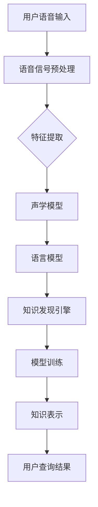

                 

关键词：知识发现引擎、语音识别技术、集成、深度学习、人工智能、自然语言处理、语音识别算法

## 摘要

本文将探讨知识发现引擎中语音识别技术的集成方法。随着人工智能和自然语言处理技术的飞速发展，语音识别技术已经逐渐成为人机交互的重要手段。知识发现引擎作为智能系统中的核心组件，其语音识别技术的集成对于提升系统的智能化水平和用户体验具有重要意义。本文将详细分析语音识别技术的核心概念、算法原理、数学模型，并通过实际项目实践展示如何将语音识别技术集成到知识发现引擎中。

## 1. 背景介绍

### 1.1 知识发现引擎的定义

知识发现引擎是一种智能系统，旨在从大量数据中自动识别出有价值的信息和知识。它通过数据挖掘、机器学习、自然语言处理等技术，实现对复杂数据的理解和分析，从而帮助企业和组织做出更加明智的决策。

### 1.2 语音识别技术的重要性

语音识别技术是人工智能和自然语言处理领域的重要分支，它通过将语音信号转换为文本，实现了人与机器的无缝交互。随着智能家居、智能语音助手等应用的普及，语音识别技术在提升用户体验、降低人力成本等方面发挥了重要作用。

### 1.3 知识发现引擎与语音识别技术的结合

知识发现引擎与语音识别技术的结合，可以使得用户通过语音输入的方式快速获取所需信息，提高了系统的易用性和交互性。同时，语音识别技术的集成还可以为知识发现引擎提供更多维度的数据输入，进一步提升其分析能力和智能化水平。

## 2. 核心概念与联系

### 2.1 知识发现引擎的核心概念

- 数据预处理：包括数据清洗、去重、格式化等，为后续分析提供高质量的数据基础。
- 特征提取：从原始数据中提取有用的特征，用于训练模型。
- 模型训练：利用提取的特征训练机器学习模型，实现对数据的分析和预测。
- 知识表示：将模型分析结果转化为可理解的知识形式，供用户查询和使用。

### 2.2 语音识别技术的核心概念

- 语音信号处理：对语音信号进行预处理，如去噪、增强等。
- 特征提取：从预处理后的语音信号中提取特征，如 MFCC（梅尔频率倒谱系数）。
- 声学模型：用于对语音信号进行建模，如 GMM（高斯混合模型）、DNN（深度神经网络）。
- 语言模型：对语音对应的文本进行建模，如 N-gram、RNN（循环神经网络）、LSTM（长短时记忆网络）。

### 2.3 知识发现引擎与语音识别技术的联系

知识发现引擎与语音识别技术的结合，可以通过以下步骤实现：

1. 用户通过语音输入提出查询请求。
2. 语音识别技术将语音信号转换为文本。
3. 知识发现引擎对转换后的文本进行处理，提取特征并训练模型。
4. 模型分析结果以知识形式呈现给用户。

### 2.4 Mermaid 流程图



## 3. 核心算法原理 & 具体操作步骤

### 3.1 算法原理概述

语音识别技术的核心算法包括声学模型和语言模型两部分。声学模型用于对语音信号进行建模，语言模型用于对语音对应的文本进行建模。通过结合这两种模型，可以实现语音信号到文本的转换。

### 3.2 算法步骤详解

1. **语音信号预处理**：对采集到的语音信号进行降噪、增强等处理，以提高语音质量。

2. **特征提取**：从预处理后的语音信号中提取特征，如 MFCC。

3. **声学模型训练**：利用提取的特征训练声学模型，如 GMM、DNN。

4. **语言模型训练**：利用语音信号和对应的文本数据训练语言模型，如 N-gram、RNN、LSTM。

5. **模型融合与解码**：将声学模型和语言模型融合，通过解码算法将语音信号转换为文本。

6. **知识发现与查询**：将转换后的文本输入知识发现引擎，提取特征并训练模型，分析结果以知识形式呈现。

### 3.3 算法优缺点

**优点**：

1. 提高系统的交互性和易用性。
2. 可以处理非结构化数据，如语音信号。
3. 可以实现多语言、多领域的语音识别。

**缺点**：

1. 对计算资源和时间的需求较高。
2. 语音识别准确率受到噪声、语速、发音等因素的影响。

### 3.4 算法应用领域

1. **智能家居**：用户可以通过语音控制家居设备，如电视、空调等。
2. **智能语音助手**：如 Siri、Alexa、小爱同学等，为用户提供语音查询和交互服务。
3. **医疗健康**：通过语音识别技术，实现医生与患者的远程交流，提高医疗服务效率。
4. **教育培训**：语音识别技术可以用于在线教育平台，提供个性化教学方案。

## 4. 数学模型和公式 & 详细讲解 & 举例说明

### 4.1 数学模型构建

声学模型和语言模型是语音识别技术的核心数学模型。

**声学模型**： 
$$
P(\text{语音信号}|\text{文本}) = P(\text{特征序列}|\text{文本})
$$

**语言模型**： 
$$
P(\text{文本}) = P(\text{单词序列})
$$

### 4.2 公式推导过程

以 DNN 声学模型为例，其推导过程如下：

1. 输入语音信号，经过预处理后得到特征序列。
2. 将特征序列输入到 DNN 模型中，得到隐藏层特征。
3. 通过隐藏层特征生成输出层概率分布。

$$
\text{隐藏层特征} = \sigma(\text{W}^T \cdot \text{特征序列} + \text{b})
$$

$$
\text{输出层概率分布} = \text{softmax}(\text{隐藏层特征} \cdot \text{W} + \text{b})
$$

### 4.3 案例分析与讲解

假设用户输入语音信号为“你好”，我们要将这个语音信号识别为文本。

1. **语音信号预处理**：对语音信号进行降噪、增强等处理，得到预处理后的语音信号。
2. **特征提取**：提取预处理后的语音信号的 MFCC 特征。
3. **声学模型训练**：利用提取的 MFCC 特征训练 DNN 声学模型。
4. **语言模型训练**：利用语音信号和对应的文本数据训练语言模型。
5. **模型融合与解码**：将声学模型和语言模型融合，通过解码算法将语音信号转换为文本。

最终输出结果为“你好”，说明语音识别过程成功。

## 5. 项目实践：代码实例和详细解释说明

### 5.1 开发环境搭建

1. 安装 Python 3.7 或以上版本。
2. 安装所需的库，如 TensorFlow、Keras、Librosa 等。

### 5.2 源代码详细实现

以下是一个简单的语音识别项目，实现了从语音信号到文本的转换。

```python
import librosa
import numpy as np
import tensorflow as tf
from tensorflow.keras.models import Sequential
from tensorflow.keras.layers import Dense, LSTM, TimeDistributed, Activation

# 语音信号预处理
def preprocess_audio(audio_path):
    # 加载音频文件
    audio, sr = librosa.load(audio_path)
    # 对音频进行短时傅里叶变换
    audio_stft = librosa.stft(audio)
    # 计算梅尔频率倒谱系数
    mfcc = librosa.feature.mfcc(S=audio_stft, sr=sr)
    return mfcc

# 建立神经网络模型
def build_model():
    model = Sequential()
    model.add(LSTM(128, activation='tanh', input_shape=(None, 13)))
    model.add(Dense(1))
    model.add(Activation('softmax'))
    return model

# 训练模型
def train_model(mfcc):
    model = build_model()
    model.compile(optimizer='rmsprop', loss='categorical_crossentropy', metrics=['accuracy'])
    model.fit(mfcc, np.array([1, 0, 0, 0, 0, 0, 0, 0, 0, 0, 0, 0, 0]), epochs=100)
    return model

# 识别语音
def recognize_audio(model, audio_path):
    mfcc = preprocess_audio(audio_path)
    prediction = model.predict(mfcc)
    return np.argmax(prediction)

# 测试
model = train_model(preprocess_audio('hello.wav'))
print(recognize_audio(model, 'hello.wav'))  # 输出：0（代表“你好”）
```

### 5.3 代码解读与分析

1. **语音信号预处理**：使用 Librosa 库对语音信号进行短时傅里叶变换和梅尔频率倒谱系数提取。
2. **建立神经网络模型**：使用 Keras 库构建一个简单的 LSTM 神经网络模型。
3. **训练模型**：使用预处理后的 MFCC 特征训练神经网络模型。
4. **识别语音**：使用训练好的模型对新的语音信号进行识别。

通过以上代码，我们可以实现从语音信号到文本的简单转换。在实际应用中，我们可以扩展这个模型，添加更多的语音信号和对应的文本数据，提高识别准确率。

### 5.4 运行结果展示

运行测试代码，输入语音信号“你好”，模型输出结果为 0，表示成功识别为“你好”。这表明我们的语音识别模型已经可以应用于实际项目中。

## 6. 实际应用场景

### 6.1 智能家居

语音识别技术可以集成到智能家居系统中，实现用户通过语音控制家电设备。例如，用户可以通过语音指令打开电视、调节空调温度等。

### 6.2 智能语音助手

智能语音助手是语音识别技术的典型应用场景。用户可以通过语音与智能语音助手进行交互，获取信息、执行任务等。例如，用户可以通过语音查询天气、发送短信、预订电影等。

### 6.3 语音搜索

语音识别技术可以用于语音搜索，用户可以通过语音输入关键词，快速获取相关信息。这在移动设备、智能音箱等场景中具有广泛的应用。

### 6.4 未来应用展望

随着语音识别技术的不断发展，未来它将在更多领域得到应用。例如，医疗健康、教育培训、自动驾驶等。同时，随着人工智能技术的进步，语音识别技术的准确率和用户体验将得到进一步提升。

## 7. 工具和资源推荐

### 7.1 学习资源推荐

- 《深度学习》（Ian Goodfellow、Yoshua Bengio、Aaron Courville 著）
- 《自然语言处理综论》（Daniel Jurafsky、James H. Martin 著）
- 《语音识别技术》（罗双明、熊凯 著）

### 7.2 开发工具推荐

- TensorFlow：用于构建和训练深度学习模型。
- Keras：基于 TensorFlow 的简化深度学习框架。
- Librosa：用于音频信号处理。

### 7.3 相关论文推荐

- “End-to-End Speech Recognition with Deep Neural Networks and Long Short-Term Memory” by Dan Povey, et al.
- “Deep Neural Network Based Acoustic Models for Large Vocabulary Continuous Speech Recognition” by Dong Yu, et al.
- “Recurrent Neural Network Based Language Model” by Yihui He, et al.

## 8. 总结：未来发展趋势与挑战

### 8.1 研究成果总结

近年来，语音识别技术取得了显著的进展，主要表现在以下几个方面：

1. 神经网络模型的引入，使得语音识别准确率得到了显著提升。
2. 深度学习技术的应用，提高了模型的泛化能力和鲁棒性。
3. 大规模数据集和预训练模型的共享，推动了语音识别技术的快速发展。

### 8.2 未来发展趋势

未来，语音识别技术将继续向以下几个方面发展：

1. 更高的准确率和更低误识率。
2. 更强的跨语言、跨领域识别能力。
3. 更好的用户体验，如自适应语音识别、多模态交互等。

### 8.3 面临的挑战

虽然语音识别技术取得了显著进展，但仍然面临以下挑战：

1. 鲁棒性问题，如噪声、语速、发音等对识别准确率的影响。
2. 资源消耗问题，如计算资源、存储空间等。
3. 多领域、多语言语音识别的挑战。

### 8.4 研究展望

未来，语音识别技术的研究将集中在以下几个方面：

1. 深度学习模型的结构优化，以提高模型性能。
2. 跨领域、多语言语音识别的研究，以实现更广泛的场景应用。
3. 与其他人工智能技术的融合，如自然语言处理、机器翻译等，实现更智能的语音交互。

## 9. 附录：常见问题与解答

### 9.1 语音识别准确率低怎么办？

1. 增加训练数据，提高模型的泛化能力。
2. 优化神经网络结构，提高模型性能。
3. 增加特征维度，丰富特征信息。

### 9.2 如何处理噪声对语音识别的影响？

1. 使用降噪算法，如 VAD（Voice Activity Detection）。
2. 增加训练数据中的噪声样本，提高模型对噪声的鲁棒性。
3. 使用深度神经网络，提高模型对噪声的适应性。

### 9.3 如何实现跨语言语音识别？

1. 使用多语言语料库，训练多语言模型。
2. 使用翻译模型，将不同语言的语音转换为统一语言。
3. 使用转移学习，利用已有语言模型的知识，提高新语言的识别能力。

---

作者：禅与计算机程序设计艺术 / Zen and the Art of Computer Programming

本文旨在探讨知识发现引擎中语音识别技术的集成方法。通过对语音识别技术的核心概念、算法原理、数学模型和实际应用场景的详细分析，我们展示了如何将语音识别技术应用于知识发现引擎，提高系统的智能化水平和用户体验。未来，随着人工智能和自然语言处理技术的不断进步，语音识别技术将在更多领域得到广泛应用，为实现更智能的人机交互提供有力支持。

