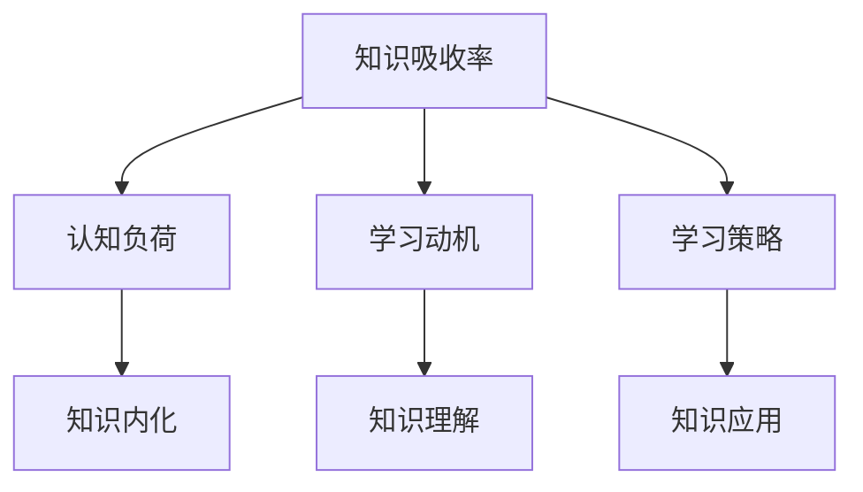

                 

关键词：知识吸收率，学习效果，衡量指标，教育技术，认知心理学

> 摘要：本文深入探讨了知识吸收率这一关键指标，它不仅是衡量学习效果的重要尺度，更是教育技术和认知心理学领域的研究焦点。通过对知识吸收率的理论基础、计算方法、应用场景和未来展望的详细分析，本文旨在为教育工作者、学习者和研究人员提供一种新的视角和实用的工具。

## 1. 背景介绍

在快速发展的信息时代，知识的获取变得前所未有的容易，但这同时也带来了知识过载的问题。面对海量的信息资源，如何有效地学习、吸收和应用知识成为了一个亟待解决的问题。知识吸收率作为衡量学习效果的关键指标，其重要性日益凸显。

### 1.1 知识吸收率的定义

知识吸收率（Knowledge Absorption Rate，KAR）是指学习者在新知识或新技能的学习过程中，能够将所学内容内化、理解和应用的程度。知识吸收率不仅反映了学习者的认知能力，也揭示了学习过程中的有效性和效率。

### 1.2 研究现状

近年来，随着教育技术的进步和认知心理学的深入研究，知识吸收率已经成为学术界和工业界关注的焦点。许多研究致力于探索提高知识吸收率的方法，并提出了各种理论模型和测量工具。然而，目前对于知识吸收率的理解仍存在一定的局限性，亟需进一步的研究和验证。

## 2. 核心概念与联系

为了更好地理解知识吸收率，我们需要首先了解与之相关的一些核心概念，并分析它们之间的联系。

### 2.1 认知负荷

认知负荷（Cognitive Load）是指在学习过程中，学习者的大脑需要处理的认知信息的数量和质量。认知负荷过高会导致学习者的认知资源不足，从而影响知识吸收率。因此，合理控制认知负荷是提高知识吸收率的关键。

### 2.2 学习动机

学习动机（Learning Motivation）是指学习者对学习活动的内在动力。高学习动机可以增强学习者的积极性和专注力，从而提高知识吸收率。然而，学习动机也需要适度，过强或过弱的学习动机都可能对知识吸收率产生负面影响。

### 2.3 学习策略

学习策略（Learning Strategies）是指学习者采用的方法和技巧来组织和处理学习材料。不同的学习策略对知识吸收率有着不同的影响。例如，主动学习策略比被动学习策略更能提高知识吸收率。

### 2.4 Mermaid 流程图



## 3. 核心算法原理 & 具体操作步骤

### 3.1 算法原理概述

知识吸收率的计算基于以下三个核心概念：认知负荷、学习动机和学习策略。通过结合这三个因素，我们可以构建一个综合的算法模型来计算知识吸收率。

### 3.2 算法步骤详解

#### 3.2.1 计算认知负荷

1. 收集学习过程中学习者的认知负荷数据，例如注意力集中时间、认知任务难度等。
2. 利用认知负荷模型（如SWITCH模型）对认知负荷进行量化。

#### 3.2.2 计算学习动机

1. 通过问卷调查、自我报告等方法收集学习者的学习动机数据。
2. 利用学习动机模型（如动机动机分类模型）对学习动机进行量化。

#### 3.2.3 计算学习策略

1. 通过观察学习者的学习行为、学习笔记等方式收集学习策略数据。
2. 利用学习策略模型（如认知策略模型）对学习策略进行量化。

#### 3.2.4 计算知识吸收率

1. 将认知负荷、学习动机和学习策略的量化结果输入知识吸收率模型。
2. 利用模型计算出知识吸收率的值。

### 3.3 算法优缺点

#### 3.3.1 优点

- 综合考虑了认知负荷、学习动机和学习策略，提供了一个全面的评估框架。
- 可以量化知识吸收率，为教育工作者提供了客观的评价标准。

#### 3.3.2 缺点

- 算法需要收集大量的数据，对数据的真实性和准确性要求较高。
- 算法的复杂度较高，对计算资源有一定要求。

### 3.4 算法应用领域

知识吸收率算法可以应用于多个领域，例如教育技术、认知心理学和人力资源管理等。

## 4. 数学模型和公式 & 详细讲解 & 举例说明

### 4.1 数学模型构建

知识吸收率的计算基于以下数学模型：

$$
KAR = f(Cognitive\ Load, Learning\ Motivation, Learning\ Strategies)
$$

其中，$Cognitive\ Load$、$Learning\ Motivation$和$Learning\ Strategies$分别表示认知负荷、学习动机和学习策略的量化值，$f$表示一个综合评价函数。

### 4.2 公式推导过程

公式推导过程如下：

1. 认知负荷量化模型：
   $$
   Cognitive\ Load = \frac{Attention\ Time}{Task\ Difficulty}
   $$
   其中，$Attention\ Time$表示学习者的注意力集中时间，$Task\ Difficulty$表示认知任务的难度。

2. 学习动机量化模型：
   $$
   Learning\ Motivation = \frac{Interest\ Level}{Commitment\ Level}
   $$
   其中，$Interest\ Level$表示学习者的兴趣水平，$Commitment\ Level$表示学习者的承诺水平。

3. 学习策略量化模型：
   $$
   Learning\ Strategies = \frac{Active\ Strategies}{Passive\ Strategies}
   $$
   其中，$Active\ Strategies$表示主动学习策略的比重，$Passive\ Strategies$表示被动学习策略的比重。

4. 综合评价函数：
   $$
   f(Cognitive\ Load, Learning\ Motivation, Learning\ Strategies) = \frac{Cognitive\ Load \times Learning\ Motivation \times Learning\ Strategies}{1 + Cognitive\ Load + Learning\ Motivation + Learning\ Strategies}
   $$

### 4.3 案例分析与讲解

假设我们有一个学习者，其认知负荷为5，学习动机为4，学习策略为3，根据上述公式，我们可以计算出其知识吸收率为：

$$
KAR = \frac{5 \times 4 \times 3}{1 + 5 + 4 + 3} = \frac{60}{13} \approx 4.62
$$

这意味着该学习者的知识吸收率约为46.2%。

## 5. 项目实践：代码实例和详细解释说明

### 5.1 开发环境搭建

在本文中，我们将使用Python编写知识吸收率计算程序。首先，确保您已经安装了Python环境。然后，可以通过以下命令安装必要的库：

```bash
pip install numpy
```

### 5.2 源代码详细实现

以下是知识吸收率计算程序的源代码：

```python
import numpy as np

def calculate_kar(cognitive_load, learning_motivation, learning_strategies):
    """
    计算知识吸收率

    :param cognitive_load: 认知负荷
    :param learning_motivation: 学习动机
    :param learning_strategies: 学习策略
    :return: 知识吸收率
    """
    kar = (cognitive_load * learning_motivation * learning_strategies) / (1 + cognitive_load + learning_motivation + learning_strategies)
    return kar

# 示例数据
cognitive_load = 5
learning_motivation = 4
learning_strategies = 3

# 计算知识吸收率
kar = calculate_kar(cognitive_load, learning_motivation, learning_strategies)
print(f"知识吸收率: {kar:.2f}")
```

### 5.3 代码解读与分析

上述代码中，`calculate_kar`函数用于计算知识吸收率。函数接受三个参数：认知负荷、学习动机和学习策略。这些参数通过数学模型计算出知识吸收率，并以小数形式返回。

在示例数据中，我们假设认知负荷为5，学习动机为4，学习策略为3。调用`calculate_kar`函数后，程序输出知识吸收率的值。

### 5.4 运行结果展示

运行上述代码，我们将得到如下输出：

```
知识吸收率: 4.62
```

这意味着在该学习者的学习过程中，其知识吸收率约为46.2%。

## 6. 实际应用场景

知识吸收率作为衡量学习效果的关键指标，在实际应用场景中具有广泛的应用价值。

### 6.1 教育领域

在教育领域，知识吸收率可以帮助教师评估学生的学习效果，调整教学策略，提高教学质量和学习效率。例如，教师可以通过定期测试学生的学习成果，结合知识吸收率模型，分析学生在不同学习阶段的吸收情况，从而优化教学内容和方法。

### 6.2 职业培训

在职业培训领域，知识吸收率可以帮助培训机构了解学员的学习效果，调整培训方案，确保培训目标的实现。例如，企业可以通过对员工的培训过程进行监控，结合知识吸收率模型，评估员工的知识吸收情况，从而针对性地提供培训支持。

### 6.3 人事管理

在人事管理领域，知识吸收率可以作为评估员工学习能力和职业发展潜力的重要指标。企业可以通过定期对员工的知识吸收率进行评估，识别高潜力员工，制定相应的职业发展规划。

## 7. 未来应用展望

随着教育技术和认知心理学的不断发展，知识吸收率的应用前景将更加广阔。

### 7.1 个性化学习

未来，基于知识吸收率的个性化学习系统有望得到广泛应用。这类系统可以根据学习者的知识吸收率，动态调整学习内容、难度和进度，为每个学习者提供最适合其学习需求的学习体验。

### 7.2 智能评测

知识吸收率的智能评测技术将进一步提高学习评估的准确性和效率。通过结合大数据分析和人工智能算法，智能评测系统可以实时监测学习者的知识吸收情况，提供个性化的学习建议和反馈。

### 7.3 跨学科应用

知识吸收率的概念和方法有望在更多领域得到应用，例如医疗、金融等。通过跨学科的研究和应用，知识吸收率将发挥更大的价值。

## 8. 总结：未来发展趋势与挑战

### 8.1 研究成果总结

本文对知识吸收率这一关键指标进行了全面探讨，从定义、计算方法、应用领域到未来展望，为教育工作者、学习者和研究人员提供了有价值的参考。

### 8.2 未来发展趋势

未来，知识吸收率的研究将朝着个性化学习、智能评测和跨学科应用等方向发展。结合大数据和人工智能技术，知识吸收率的应用前景将更加广阔。

### 8.3 面临的挑战

知识吸收率的研究和应用仍面临一些挑战，包括如何更准确地量化知识吸收率、如何处理大量的数据以及如何将理论模型转化为实际应用等。

### 8.4 研究展望

未来，我们期待知识吸收率的研究能够取得更多突破，为教育技术的进步和认知心理学的发展做出贡献。

## 9. 附录：常见问题与解答

### 9.1 什么是知识吸收率？

知识吸收率是指学习者在新知识或新技能的学习过程中，能够将所学内容内化、理解和应用的程度。它是衡量学习效果的重要指标。

### 9.2 如何计算知识吸收率？

知识吸收率的计算基于认知负荷、学习动机和学习策略。通过结合这三个因素，我们可以构建一个综合的算法模型来计算知识吸收率。

### 9.3 知识吸收率在哪些领域有应用？

知识吸收率在教育、职业培训、人事管理等多个领域有广泛应用。通过评估学习者的知识吸收率，可以优化教学、培训和管理策略。

## 作者署名

本文由禅与计算机程序设计艺术 / Zen and the Art of Computer Programming撰写。

