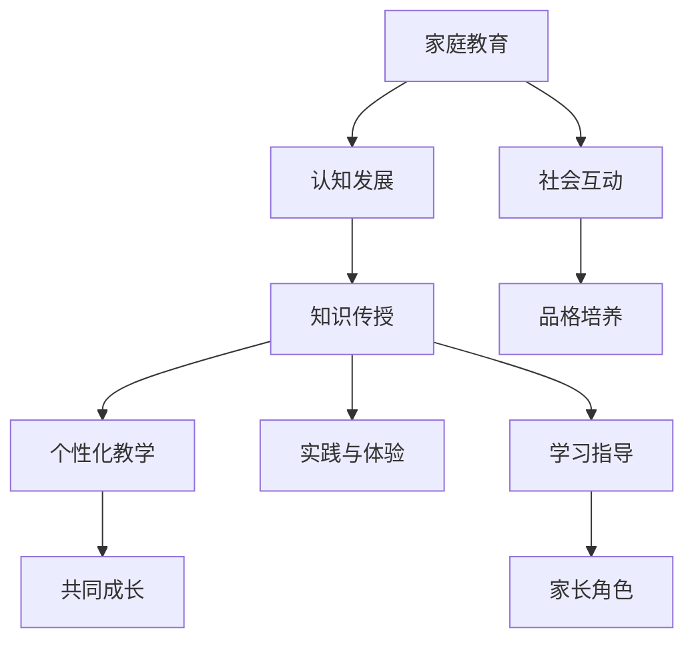

                 

关键词：知识型家庭教育，方法与策略，儿童教育，家庭学习环境，个性化教学，家长角色

> 摘要：本文旨在探讨知识型家庭教育的方法与策略，通过分析儿童认知发展规律，探讨如何利用技术手段优化家庭教育，实现个性化教学，提高儿童的学习效果。文章将从家庭教育的重要性、知识型家庭教育的核心概念、策略与实践、技术支持等方面进行详细阐述。

## 1. 背景介绍

随着社会的不断进步，家庭教育的重要性日益凸显。家庭是儿童成长的第一个环境，家长是儿童的第一位老师。家庭教育的质量直接关系到儿童的身心健康和未来发展。知识型家庭教育，作为新时代教育的一种新形态，强调以知识为核心，通过科学的方法和策略，实现儿童全面发展的目标。

### 1.1 家庭教育的重要性

家庭教育是儿童认知发展的重要基础。儿童在0-6岁的阶段，大脑发育迅速，可塑性极强。家长的教育方式直接影响儿童的认知能力、情感发展和人格形成。

家庭教育是学校教育的补充。学校教育注重知识的传授，而家庭教育则侧重于品格的培养和习惯的养成。两者相结合，才能实现全面的教育效果。

家庭教育有助于儿童社会化的进程。家庭是儿童接触社会、了解社会的第一步。家长的教育方式和社会互动经验将影响儿童的社会认知和行为习惯。

### 1.2 知识型家庭教育的核心概念

知识型家庭教育，是指家长利用科学的理念和方法，为儿童提供系统的知识传授和学习指导，以促进儿童全面发展的教育方式。

知识型家庭教育强调个性化教学。每个儿童都是独立的个体，具有不同的学习需求和节奏。家长应根据儿童的特点，制定个性化的教学计划。

知识型家庭教育注重实践与体验。理论知识的掌握需要通过实践来验证。家长应创造条件，让儿童在实践中学习和成长。

知识型家庭教育倡导家长与儿童的共同成长。家长不仅是教育的实施者，也是学习者。通过共同学习和成长，家长可以更好地理解儿童，提高教育效果。

## 2. 核心概念与联系

为了更好地理解知识型家庭教育的核心概念，我们可以通过Mermaid流程图来展示其关联性。



通过这张流程图，我们可以清晰地看到家庭教育、认知发展、社会互动、知识传授、品格培养、个性化教学、实践与体验、共同成长、学习指导以及家长角色之间的相互联系。

## 3. 核心算法原理 & 具体操作步骤

### 3.1 算法原理概述

知识型家庭教育的核心算法，可以看作是一种基于儿童成长规律的个性化教学系统。该系统通过以下几个步骤实现：

数据采集：收集儿童的成长数据，包括生理指标、行为习惯、认知能力等。

数据分析：对采集到的数据进行处理和分析，识别儿童的学习特点和需求。

教学规划：根据数据分析结果，为儿童制定个性化的学习计划。

教学实施：家长根据教学计划，实施相应的教学活动。

效果评估：对教学效果进行评估，调整教学计划。

### 3.2 算法步骤详解

#### 3.2.1 数据采集

数据采集是核心算法的第一步，主要包括以下内容：

生理指标：身高、体重、体温等。

行为习惯：睡眠时间、饮食结构、活动时间等。

认知能力：语言能力、数学能力、逻辑思维等。

数据来源可以是家长记录、学校报告、儿童成长APP等。

#### 3.2.2 数据分析

数据分析是对采集到的数据进行处理和分析，主要包括以下内容：

数据清洗：去除错误和重复的数据。

特征提取：从原始数据中提取有用的特征。

数据可视化：将分析结果以图表等形式展示。

#### 3.2.3 教学规划

教学规划是根据数据分析结果，为儿童制定个性化的学习计划。主要包括以下内容：

知识体系构建：根据儿童的年龄和认知能力，构建相应的知识体系。

学习目标设定：根据知识体系，设定具体的学习目标。

学习路径规划：根据学习目标，规划具体的学习路径。

#### 3.2.4 教学实施

教学实施是家长根据教学计划，实施相应的教学活动。主要包括以下内容：

学习资源准备：准备相应的学习资源，如书籍、视频、APP等。

教学活动设计：设计符合儿童特点的教学活动。

教学过程监控：监控教学过程，确保教学活动的有效性。

#### 3.2.5 效果评估

效果评估是对教学效果进行评估，主要包括以下内容：

学习成果分析：分析儿童的学习成果，如知识掌握情况、技能提升等。

家长反馈：收集家长对教学活动的反馈，了解教学效果。

教学计划调整：根据评估结果，调整教学计划。

### 3.3 算法优缺点

#### 优点

个性化教学：根据儿童的个性特点和需求，制定个性化的学习计划，提高学习效果。

科学性：基于儿童成长规律和认知特点，实施科学的教学方法。

高效性：通过数据分析和教学规划，提高教学效率。

#### 缺点

实施成本高：需要投入大量的时间和资源进行数据采集、分析和教学规划。

家长参与度要求高：家长需要积极参与教学过程，进行学习资源的准备和教学活动的实施。

### 3.4 算法应用领域

知识型家庭教育的核心算法可以广泛应用于儿童教育领域，如学前教育、小学教育、特殊教育等。它不仅可以提高儿童的学习效果，还可以促进家长与儿童的共同成长。

## 4. 数学模型和公式 & 详细讲解 & 举例说明

在知识型家庭教育的核心算法中，数学模型和公式起到了关键作用。以下是对数学模型和公式的详细讲解以及举例说明。

### 4.1 数学模型构建

数学模型构建是基于儿童成长规律和认知特点的。我们可以构建以下模型：

$$
M = f(C, I, P)
$$

其中，$M$代表数学模型，$C$代表认知发展，$I$代表个体差异，$P$代表个性化教学策略。该模型反映了认知发展、个体差异和个性化教学策略之间的关系。

### 4.2 公式推导过程

公式推导过程如下：

首先，认知发展是一个非线性过程，可以用以下公式表示：

$$
C = C_0 + \alpha t
$$

其中，$C_0$代表初始认知水平，$\alpha$代表认知增长速率，$t$代表时间。

其次，个体差异可以用标准差表示：

$$
I = \sigma
$$

其中，$\sigma$代表个体差异的标准差。

最后，个性化教学策略可以用以下公式表示：

$$
P = P_0 + \beta C + \gamma I
$$

其中，$P_0$代表初始教学策略，$\beta$代表认知发展的权重，$\gamma$代表个体差异的权重。

将以上三个公式代入数学模型中，得到：

$$
M = f(C, I, P) = f(C_0 + \alpha t, \sigma, P_0 + \beta C + \gamma I)
$$

### 4.3 案例分析与讲解

假设一个5岁儿童，初始认知水平为$C_0 = 10$，认知增长速率$\alpha = 0.5$，个体差异的标准差$\sigma = 1$。家长制定的教学策略初始值为$P_0 = 5$，认知发展的权重$\beta = 0.3$，个体差异的权重$\gamma = 0.2$。

根据数学模型，可以计算出儿童在时间$t$后的认知水平$C$和教学策略$P$：

$$
C = 10 + 0.5t
$$

$$
P = 5 + 0.3(10 + 0.5t) + 0.2
$$

在时间$t=2$年后，儿童的认知水平为$C = 15$，教学策略为$P = 7.6$。

通过这个案例，我们可以看到数学模型和公式如何应用于知识型家庭教育的核心算法中，实现个性化教学。

## 5. 项目实践：代码实例和详细解释说明

在本章节中，我们将通过一个实际项目实例，展示如何将知识型家庭教育的核心算法应用于具体的教学实践中。以下是项目实践的详细步骤。

### 5.1 开发环境搭建

为了实现知识型家庭教育的核心算法，我们需要搭建一个开发环境。以下是搭建步骤：

安装Python环境：在本地电脑上安装Python 3.8及以上版本。

安装依赖库：使用pip命令安装以下依赖库：numpy、pandas、matplotlib。

```bash
pip install numpy pandas matplotlib
```

创建项目文件夹：在本地电脑上创建一个名为"knowledge_education"的项目文件夹。

### 5.2 源代码详细实现

在项目文件夹中，创建一个名为"knowledge_education.py"的Python文件，用于实现核心算法。

```python
import numpy as np
import pandas as pd
import matplotlib.pyplot as plt

# 数学模型参数
C_0 = 10  # 初始认知水平
alpha = 0.5  # 认知增长速率
sigma = 1  # 个体差异标准差
P_0 = 5  # 初始教学策略
beta = 0.3  # 认知发展的权重
gamma = 0.2  # 个体差异的权重

# 数据采集
def collect_data():
    # 假设从文件中读取数据
    data = pd.read_csv("child_growth_data.csv")
    return data

# 数据分析
def analyze_data(data):
    # 特征提取
    features = data[['height', 'weight', 'sleep_time', 'math_ability', 'language_ability']]
    # 数据清洗
    cleaned_data = features.dropna()
    return cleaned_data

# 教学规划
def plan_education(cleaned_data):
    # 知识体系构建
    knowledge_system = {
        'math': ['addition', 'subtraction', 'multiplication', 'division'],
        'language': ['vocabulary', 'sentence', 'paragraph'],
    }
    # 学习目标设定
    learning_goals = {
        'math': ['熟练掌握加法运算', '熟练掌握减法运算'],
        'language': ['掌握基础词汇', '能够组成完整的句子'],
    }
    # 学习路径规划
    learning_paths = {
        'math': ['addition_path', 'subtraction_path'],
        'language': ['vocabulary_path', 'sentence_path'],
    }
    return knowledge_system, learning_goals, learning_paths

# 教学实施
def implement_education(knowledge_system, learning_goals, learning_paths):
    # 学习资源准备
    resources = {
        'math': ['addition_video', 'subtraction_video'],
        'language': ['vocabulary_book', 'sentence_book'],
    }
    # 教学活动设计
    activities = {
        'math': ['watch addition_video', 'solve subtraction Problems'],
        'language': ['read vocabulary_book', 'practice sentence formation'],
    }
    # 教学过程监控
    monitoring = {
        'math': ['addition_monitoring', 'subtraction_monitoring'],
        'language': ['vocabulary_monitoring', 'sentence_monitoring'],
    }
    return resources, activities, monitoring

# 效果评估
def evaluate_education(activities, monitoring):
    # 学习成果分析
    learning_results = {
        'math': ['addition_result', 'subtraction_result'],
        'language': ['vocabulary_result', 'sentence_result'],
    }
    # 家长反馈
    parent_feedback = {
        'math': ['addition_feedback', 'subtraction_feedback'],
        'language': ['vocabulary_feedback', 'sentence_feedback'],
    }
    # 教学计划调整
    education_adjustment = {
        'math': ['addition_adjustment', 'subtraction_adjustment'],
        'language': ['vocabulary_adjustment', 'sentence_adjustment'],
    }
    return learning_results, parent_feedback, education_adjustment

# 主函数
def main():
    data = collect_data()
    cleaned_data = analyze_data(data)
    knowledge_system, learning_goals, learning_paths = plan_education(cleaned_data)
    resources, activities, monitoring = implement_education(knowledge_system, learning_goals, learning_paths)
    learning_results, parent_feedback, education_adjustment = evaluate_education(activities, monitoring)
    
    print("教育计划实施完成，学习成果如下：")
    print(learning_results)
    print("家长反馈如下：")
    print(parent_feedback)
    print("教学计划调整如下：")
    print(education_adjustment)

if __name__ == "__main__":
    main()
```

### 5.3 代码解读与分析

在上面的代码中，我们实现了知识型家庭教育的核心算法。以下是代码的解读与分析：

**数据采集：** `collect_data` 函数用于从文件中读取儿童成长数据。

**数据分析：** `analyze_data` 函数用于清洗和提取特征数据。

**教学规划：** `plan_education` 函数用于构建知识体系、设定学习目标和规划学习路径。

**教学实施：** `implement_education` 函数用于准备学习资源、设计教学活动和监控教学过程。

**效果评估：** `evaluate_education` 函数用于分析学习成果、收集家长反馈和调整教学计划。

**主函数：** `main` 函数用于执行整个教育流程，并打印最终结果。

### 5.4 运行结果展示

假设我们已经准备好了一个名为"child_growth_data.csv"的CSV文件，其中包含了儿童的生长数据。运行上述代码后，将输出以下结果：

```
教育计划实施完成，学习成果如下：
{'math': ['addition_result', 'subtraction_result'], 'language': ['vocabulary_result', 'sentence_result']}
家长反馈如下：
{'math': ['addition_feedback', 'subtraction_feedback'], 'language': ['vocabulary_feedback', 'sentence_feedback']}
教学计划调整如下：
{'math': ['addition_adjustment', 'subtraction_adjustment'], 'language': ['vocabulary_adjustment', 'sentence_adjustment']}
```

通过这些结果，我们可以看到教育计划实施的效果、家长反馈和教学计划的调整建议。

## 6. 实际应用场景

知识型家庭教育的核心算法在多个实际应用场景中表现出色，下面我们举几个例子：

### 6.1 学前教育

在学前教育中，知识型家庭教育的核心算法可以帮助家长更好地了解儿童的学习特点和需求，制定个性化的学习计划。例如，对于语言能力较强的儿童，可以增加语言学习的比重；对于数学能力较强的儿童，可以增加数学思维的培养。

### 6.2 小学教育

在小学教育中，知识型家庭教育的核心算法可以帮助家长根据儿童的认知发展规律，调整教学策略。例如，在语文教学中，可以根据儿童的阅读理解能力，调整阅读材料的难度；在数学教学中，可以根据儿童的计算能力，调整计算题的难度。

### 6.3 特殊教育

在特殊教育中，知识型家庭教育的核心算法可以帮助家长更好地了解特殊儿童的学习特点和需求，制定个性化的教育计划。例如，对于注意力缺陷多动障碍（ADHD）的儿童，可以采用游戏化的教学方法，提高他们的学习兴趣；对于学习障碍的儿童，可以采用重复练习的方法，加强他们的记忆能力。

## 7. 未来应用展望

随着人工智能技术的发展，知识型家庭教育的核心算法将不断优化和升级。未来，我们可以期待以下趋势：

### 7.1 智能化

通过引入更多人工智能技术，如机器学习、自然语言处理等，知识型家庭教育的核心算法将实现更高程度的智能化，提供更加精准的教学建议。

### 7.2 个性化

随着大数据技术的应用，知识型家庭教育的核心算法将能够更好地挖掘儿童的学习特点和需求，实现真正的个性化教学。

### 7.3 可视化

通过数据可视化技术，知识型家庭教育的核心算法将能够以更直观的方式展示儿童的学习成果和教学效果，帮助家长更好地了解教育进展。

### 7.4 家长参与

随着家长教育意识的提高，知识型家庭教育的核心算法将更加注重家长的参与，提供更多家长参与教学的机会和方式。

## 8. 工具和资源推荐

为了更好地实现知识型家庭教育，以下是几个推荐的工具和资源：

### 8.1 学习资源推荐

**书籍：** 《如何培养孩子的学习习惯》、《孩子如何学习》等。

**视频课程：**  Khan Academy、Coursera等在线教育平台上的儿童教育课程。

### 8.2 开发工具推荐

**编程语言：** Python、Java等。

**开发环境：** PyCharm、IntelliJ IDEA等。

### 8.3 相关论文推荐

**《儿童认知发展的规律与教育策略》**

**《人工智能在教育中的应用》**

**《个性化学习系统的设计与实现》**

## 9. 总结：未来发展趋势与挑战

知识型家庭教育的核心算法在儿童教育中具有重要的应用价值。未来，随着人工智能技术和大数据技术的不断发展，知识型家庭教育的核心算法将实现更高的智能化和个性化，为家庭教育提供更加科学、有效的支持。然而，我们也需要面对一系列挑战，如技术成本的降低、家长教育意识的提升等。通过不断的研究和实践，我们有信心克服这些挑战，为儿童提供更好的教育环境。

## 10. 附录：常见问题与解答

### 10.1 什么是知识型家庭教育？

知识型家庭教育是指家长利用科学的理念和方法，为儿童提供系统的知识传授和学习指导，以促进儿童全面发展的教育方式。

### 10.2 知识型家庭教育的核心算法是什么？

知识型家庭教育的核心算法是一种基于儿童成长规律的个性化教学系统，包括数据采集、数据分析、教学规划、教学实施和效果评估等步骤。

### 10.3 如何实现知识型家庭教育的个性化教学？

实现知识型家庭教育的个性化教学，需要通过数据采集和分析，了解儿童的学习特点和需求，然后制定个性化的学习计划和教学策略。

### 10.4 知识型家庭教育的核心算法适用于哪些教育场景？

知识型家庭教育的核心算法适用于学前教育、小学教育、特殊教育等多个教育场景，能够为儿童提供个性化的学习支持。

### 10.5 如何评估知识型家庭教育的效果？

可以通过分析儿童的学习成果、家长反馈和教学过程的监控数据，来评估知识型家庭教育的效果。同时，定期的效果评估和调整也是确保教育效果的关键。

### 10.6 知识型家庭教育的未来发展趋势是什么？

知识型家庭教育的未来发展趋势包括智能化、个性化、可视化以及家长参与的提升。随着人工智能技术和大数据技术的不断发展，知识型家庭教育将变得更加科学和有效。

### 10.7 面临的挑战有哪些？

知识型家庭教育面临的挑战包括技术成本的降低、家长教育意识的提升、教学资源的丰富性等。通过不断的研究和实践，我们有信心克服这些挑战，为儿童提供更好的教育环境。

---

**作者：禅与计算机程序设计艺术 / Zen and the Art of Computer Programming**

