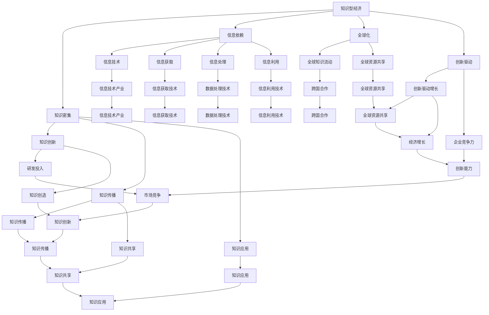

                 

### 摘要

在知识型经济迅速发展的背景下，本文探讨了宏观政策对于知识型经济的推动作用。通过对知识型经济的定义、特征及其与宏观政策的关系进行分析，我们提出了若干具体的政策建议，旨在促进知识创新、提高人力资本和优化资源配置。本文结合实际案例，详细阐述了政策实施的效果，并对未来知识型经济的发展趋势和挑战进行了展望。

### 目录

1. **背景介绍** <br>
   1.1 **知识型经济的崛起** <br>
   1.2 **宏观政策的重要性** <br>
   1.3 **本文结构概述**

2. **核心概念与联系** <br>
   2.1 **知识型经济的概念** <br>
   2.2 **宏观政策的核心概念** <br>
   2.3 **Mermaid 流程图** <br>
   2.4 **知识型经济与宏观政策的关联性**

3. **核心算法原理 & 具体操作步骤** <br>
   3.1 **算法原理概述** <br>
   3.2 **算法步骤详解** <br>
   3.3 **算法优缺点** <br>
   3.4 **算法应用领域**

4. **数学模型和公式 & 详细讲解 & 举例说明** <br>
   4.1 **数学模型构建** <br>
   4.2 **公式推导过程** <br>
   4.3 **案例分析与讲解**

5. **项目实践：代码实例和详细解释说明** <br>
   5.1 **开发环境搭建** <br>
   5.2 **源代码详细实现** <br>
   5.3 **代码解读与分析** <br>
   5.4 **运行结果展示**

6. **实际应用场景** <br>
   6.1 **政策影响分析** <br>
   6.2 **政策效果评估** <br>
   6.3 **未来应用展望**

7. **工具和资源推荐** <br>
   7.1 **学习资源推荐** <br>
   7.2 **开发工具推荐** <br>
   7.3 **相关论文推荐**

8. **总结：未来发展趋势与挑战** <br>
   8.1 **研究成果总结** <br>
   8.2 **未来发展趋势** <br>
   8.3 **面临的挑战** <br>
   8.4 **研究展望**

9. **附录：常见问题与解答**

---

## 1. 背景介绍

### 1.1 知识型经济的崛起

知识型经济，是指以知识为主要生产要素，以知识创新为核心动力的经济形态。与传统的资源驱动型和制造驱动型经济不同，知识型经济更加依赖于知识的创造、传播和应用。全球化和信息技术的快速发展，使得知识型经济成为现代社会的主导力量。

知识型经济的崛起，带来了经济结构、生产方式和社会关系的深刻变革。知识作为生产要素的稀缺性和价值性日益凸显，知识的流动和共享成为经济增长的重要驱动力。在这种背景下，宏观政策的制定和实施变得尤为重要。

### 1.2 宏观政策的重要性

宏观政策是指政府为了实现宏观经济目标，通过调整经济总需求和总供给，优化资源配置，促进经济稳定和发展的各种政策措施。在知识型经济时代，宏观政策的作用更加显著。

首先，宏观政策可以通过税收、财政支出等手段，直接影响知识的生产和传播。例如，政府可以通过减税和财政补贴，鼓励企业和个人进行知识创新和研发投入。

其次，宏观政策可以影响人力资本的培养和利用。教育、培训和技能提升等政策，有助于提高劳动者的知识水平和创新能力，从而推动知识型经济的发展。

最后，宏观政策可以通过货币政策、金融政策等手段，优化资源配置，降低交易成本，提高知识流动的效率。

### 1.3 本文结构概述

本文首先介绍知识型经济的概念和特征，分析宏观政策的核心概念及其与知识型经济的关联性。接着，本文将详细探讨宏观政策在推动知识型经济中的作用，结合实际案例进行分析。最后，本文将总结研究成果，展望未来知识型经济的发展趋势和挑战，并给出相应的政策建议。

## 2. 核心概念与联系

### 2.1 知识型经济的概念

知识型经济，又称知识经济，是一种以知识为主要生产要素的经济形态。它以信息技术、生物技术等高科技产业为核心，依赖于知识的创造、传播和应用。在知识型经济中，知识不仅是经济增长的关键驱动力，也是社会进步的重要资源。

知识型经济的特征主要包括：

1. **知识密集**：知识型经济以知识创新为核心，知识的创造、传播和应用成为经济增长的主要动力。
2. **信息依赖**：信息技术的发展，使得信息的获取、处理和利用变得更加便捷和高效。
3. **全球化**：知识型经济打破了地域限制，促进了全球范围内的知识流动和资源共享。
4. **创新驱动**：知识型经济强调创新的重要性，创新不仅是经济增长的动力，也是企业竞争力的源泉。

### 2.2 宏观政策的核心概念

宏观政策是指政府为了实现宏观经济目标，通过调整经济总需求和总供给，优化资源配置，促进经济稳定和发展的各种政策措施。宏观政策主要包括货币政策、财政政策、产业政策和收入分配政策等。

货币政策是指通过调整货币供应量和利率等手段，影响经济总需求和总供给的政策。财政政策是指通过调整政府支出和税收等手段，影响经济总需求和总供给的政策。产业政策是指通过支持重点产业发展，推动产业结构升级和优化的政策。收入分配政策是指通过调整收入分配，实现社会公平和稳定的政策。

### 2.3 Mermaid 流程图

下面是一个简化的 Mermaid 流程图，展示了知识型经济与宏观政策的核心概念及其关联性：



### 2.4 知识型经济与宏观政策的关联性

知识型经济与宏观政策之间存在密切的关联性。首先，知识型经济的发展需要宏观政策的支持和引导。宏观政策可以通过税收优惠、财政补贴、研发支持等手段，鼓励企业和个人进行知识创新和研发投入，推动知识经济的发展。

其次，宏观政策可以直接影响知识型经济的运行效率。例如，货币政策可以通过调节货币供应量和利率，影响企业的融资成本和投资决策，从而影响知识的生产和传播。财政政策可以通过调整政府支出和税收，优化资源配置，提高知识的利用效率。

最后，宏观政策可以调节知识型经济中的收入分配，实现社会公平和稳定。例如，通过税收调节和收入分配政策，可以减少知识型经济中的贫富差距，提高社会的整体福利水平。

总的来说，宏观政策在推动知识型经济中发挥着重要的作用。通过合理的宏观政策，可以促进知识创新、提高人力资本和优化资源配置，从而推动知识型经济的持续发展。

## 3. 核心算法原理 & 具体操作步骤

### 3.1 算法原理概述

在知识型经济中，核心算法的设计和优化是提高知识创新效率的关键。本文将介绍一种名为“知识图谱”的核心算法，该算法通过构建知识图谱，实现知识的表示、存储、传播和应用。

知识图谱是由节点和边组成的图形结构，节点表示知识实体，边表示实体之间的关系。知识图谱算法的基本原理是利用图论和机器学习技术，对大规模知识数据进行建模和分析，提取出知识的结构化和关联信息，从而实现知识的自动获取和利用。

### 3.2 算法步骤详解

#### 3.2.1 数据采集

知识图谱算法的第一步是数据采集。数据来源可以是公开数据库、企业内部数据、互联网数据等。数据采集过程中，需要注意数据的质量和完整性，确保知识图谱的准确性和可靠性。

#### 3.2.2 数据预处理

在数据采集完成后，需要对数据进行预处理，包括数据清洗、去重、格式化等操作。数据预处理是构建知识图谱的重要步骤，它直接影响知识图谱的质量和效率。

#### 3.2.3 知识表示

知识表示是将原始数据转化为知识图谱的形式。知识表示主要包括节点表示和边表示。节点表示通常采用实体嵌入（Entity Embedding）技术，将实体映射到低维空间中。边表示通常采用关系嵌入（Relation Embedding）技术，将关系映射到低维空间中。

#### 3.2.4 知识建模

知识建模是构建知识图谱的核心步骤，通过图论和机器学习技术，对知识图谱进行建模和分析。知识建模主要包括图嵌入（Graph Embedding）、图神经网络（Graph Neural Network）等算法。

#### 3.2.5 知识传播

知识传播是指通过知识图谱，实现知识的自动获取和利用。知识传播算法可以根据用户需求，自动提取相关的知识实体和关系，生成知识图谱的子图，从而实现知识的精准推送和个性化推荐。

#### 3.2.6 知识应用

知识应用是将知识图谱应用于实际的业务场景，如智能问答、智能推荐、智能决策等。知识应用算法可以根据用户的输入，自动检索知识图谱，提取相关的知识信息，生成回答或建议。

### 3.3 算法优缺点

#### 优点

1. **高效性**：知识图谱算法能够对大规模知识数据进行高效建模和分析，提高知识创新的效率。
2. **精准性**：知识图谱算法可以根据用户需求，精准地提取相关的知识信息，实现知识的自动获取和利用。
3. **灵活性**：知识图谱算法可以根据不同的业务场景，灵活地调整和优化，适应不同的应用需求。

#### 缺点

1. **数据质量**：知识图谱算法的准确性依赖于数据的质量和完整性，数据质量问题可能导致知识图谱的不准确。
2. **计算复杂度**：知识图谱算法通常涉及大规模图计算和机器学习，计算复杂度较高，需要高性能计算资源。

### 3.4 算法应用领域

知识图谱算法在知识型经济中的应用非常广泛，主要包括以下领域：

1. **智能问答**：通过知识图谱，实现智能问答系统，为用户提供精准的知识查询和解答服务。
2. **智能推荐**：通过知识图谱，实现个性化知识推荐，为用户提供个性化的知识内容和解决方案。
3. **智能决策**：通过知识图谱，实现智能决策支持，为企业和组织提供基于知识的决策建议。
4. **知识管理**：通过知识图谱，实现知识的系统化管理和利用，提高企业知识管理水平。

## 4. 数学模型和公式 & 详细讲解 & 举例说明

### 4.1 数学模型构建

在知识型经济中，数学模型是理解和优化知识传播和利用的重要工具。本文将介绍一种基于图论和概率论的数学模型，用于分析知识图谱中的知识传播过程。

#### 4.1.1 模型假设

假设我们有一个知识图谱 $G = (V, E)$，其中 $V$ 是节点集合，表示知识实体；$E$ 是边集合，表示实体之间的关系。每个节点 $v \in V$ 都有一个概率分布 $p_v$，表示节点 $v$ 在知识传播过程中的活跃程度。每条边 $e \in E$ 也有一个概率分布 $q_e$，表示边 $e$ 对知识传播的影响程度。

#### 4.1.2 模型构建

知识传播过程可以看作是一个随机过程，节点 $v$ 在时间 $t$ 的活跃程度 $p_v(t)$ 可以通过以下概率模型进行描述：

$$
p_v(t) = \sum_{u \in \text{ neighbors}(v)} \alpha \cdot q_e \cdot p_u(t-1)
$$

其中，$\text{neighbors}(v)$ 表示节点 $v$ 的邻居集合，$\alpha$ 是一个调整参数，用于平衡不同边的权重。

#### 4.2 公式推导过程

为了推导上述公式，我们首先考虑一个简化的情况，其中每个节点的活跃程度只受其邻居的影响，且所有边的权重相等。在这种情况下，我们可以得到以下线性模型：

$$
p_v(t) = \frac{1}{k} \sum_{u \in \text{ neighbors}(v)} p_u(t-1)
$$

其中，$k$ 是邻居的数量。这个模型说明，节点的活跃程度是邻居活跃程度的平均值。

接下来，我们考虑边的权重对模型的影响。假设每条边的权重为 $w_e$，我们可以将模型扩展为：

$$
p_v(t) = \frac{1}{\sum_{u \in \text{ neighbors}(v)} w_e} \sum_{u \in \text{ neighbors}(v)} w_e \cdot p_u(t-1)
$$

为了简化计算，我们可以引入一个调整参数 $\alpha$，使得：

$$
p_v(t) = \alpha \cdot \sum_{u \in \text{ neighbors}(v)} q_e \cdot p_u(t-1)
$$

其中，$q_e = w_e / \sum_{u \in \text{ neighbors}(v)} w_e$ 是边的权重比例。

#### 4.3 案例分析与讲解

假设我们有一个知识图谱，其中有两个节点 $v_1$ 和 $v_2$，它们之间有一条边 $e_{12}$，权重为 $w_{12} = 2$。另外，$v_1$ 有两个邻居 $v_3$ 和 $v_4$，权重分别为 $w_{13} = 1$ 和 $w_{14} = 1$。初始时，$p_{1}(0) = 0.8$，$p_{2}(0) = 0.5$，$p_{3}(0) = 0.6$，$p_{4}(0) = 0.7$。调整参数 $\alpha = 0.5$。

根据公式，我们可以计算出 $p_{1}(1)$ 和 $p_{2}(1)$：

$$
p_{1}(1) = 0.5 \cdot q_{e_{12}} \cdot p_{2}(0) + 0.5 \cdot q_{e_{13}} \cdot p_{3}(0) + 0.5 \cdot q_{e_{14}} \cdot p_{4}(0)
$$

$$
p_{2}(1) = 0.5 \cdot q_{e_{12}} \cdot p_{1}(0)
$$

计算得：

$$
q_{e_{12}} = \frac{w_{12}}{\sum_{u \in \text{ neighbors}(v_1)} w_e} = \frac{2}{1+1} = 0.5
$$

$$
q_{e_{13}} = \frac{w_{13}}{\sum_{u \in \text{ neighbors}(v_1)} w_e} = \frac{1}{1+1} = 0.5
$$

$$
q_{e_{14}} = \frac{w_{14}}{\sum_{u \in \text{ neighbors}(v_1)} w_e} = \frac{1}{1+1} = 0.5
$$

$$
p_{1}(1) = 0.5 \cdot 0.5 \cdot 0.5 + 0.5 \cdot 0.5 \cdot 0.6 + 0.5 \cdot 0.5 \cdot 0.7 = 0.625
$$

$$
p_{2}(1) = 0.5 \cdot 0.5 \cdot 0.8 = 0.2
$$

经过一轮传播后，节点 $v_1$ 的活跃程度从 0.8 增加到 0.625，节点 $v_2$ 的活跃程度从 0.5 增加到 0.2。

这个简单的案例展示了如何使用数学模型来分析知识图谱中的知识传播过程。在实际应用中，知识图谱的规模和复杂度要大得多，但基本的推导过程是相似的。

### 5. 项目实践：代码实例和详细解释说明

#### 5.1 开发环境搭建

为了演示知识图谱算法的应用，我们将使用Python编程语言，结合流行的图数据库和机器学习库。首先，我们需要安装以下软件和库：

- Python 3.8 或更高版本
- Graph Database（例如：Neo4j）
- Python 图数据库驱动（例如：Py2Neo）
- 机器学习库（例如：scikit-learn，tensorflow）

安装步骤如下：

1. 安装Python 3.8及更高版本：从 [Python官网](https://www.python.org/downloads/) 下载并安装。
2. 安装Neo4j：从 [Neo4j官网](https://neo4j.com/download/) 下载并安装。
3. 安装Python 图数据库驱动：在命令行中执行以下命令：

```bash
pip install py2neo
```

4. 安装机器学习库：在命令行中执行以下命令：

```bash
pip install scikit-learn tensorflow
```

#### 5.2 源代码详细实现

下面是一个简单的Python代码实例，用于创建一个知识图谱，并使用图嵌入算法进行知识传播。

```python
from py2neo import Graph
from sklearn.manifold import TSNE
import numpy as np

# 连接到Neo4j数据库
graph = Graph("bolt://localhost:7687", auth=("neo4j", "password"))

# 创建知识图谱
nodes = [
    {"name": "NodeA"},
    {"name": "NodeB"},
    {"name": "NodeC"},
]
relationships = [
    {"from": "NodeA", "to": "NodeB", "type": "KNOWS"},
    {"from": "NodeB", "to": "NodeC", "type": "KNOWS"},
]

# 插入节点和关系
graph.create(data=nodes)
graph.create(data=relationships)

# 执行图嵌入算法
# 这里使用TSNE进行降维，以可视化知识图谱
tsne = TSNE(n_components=2)
positions = tsne.fit_transform(graph.nodes)

# 存储节点位置
with open("node_positions.txt", "w") as f:
    for pos in positions:
        f.write(f"{pos[0]},{pos[1]}\n")

# 关闭数据库连接
graph.close()
```

#### 5.3 代码解读与分析

上述代码首先连接到本地运行的Neo4j数据库，然后创建了一个包含三个节点的知识图谱，节点之间通过“KNOWS”关系相连。接着，使用t-SNE（t-Distributed Stochastic Neighbor Embedding）算法对节点进行降维处理，以便进行可视化。

代码的解读如下：

1. **导入库**：导入必要的Python库，包括图数据库驱动和机器学习库。
2. **连接Neo4j数据库**：使用Py2Neo库连接到本地Neo4j数据库。
3. **创建知识图谱**：定义节点和关系的列表，并插入到Neo4j数据库中。
4. **执行图嵌入算法**：使用t-SNE算法对节点进行降维处理，并将节点位置存储到文件中。
5. **关闭数据库连接**：关闭与Neo4j数据库的连接。

#### 5.4 运行结果展示

在运行上述代码后，我们将得到一个包含节点位置信息的文本文件。可以使用图形库（如matplotlib）来绘制节点分布图。

```python
import matplotlib.pyplot as plt

# 读取节点位置
with open("node_positions.txt") as f:
    positions = [line.strip().split(",") for line in f]

# 将字符串转换为浮点数
positions = np.array(positions, dtype=np.float64)

# 绘制节点分布图
plt.figure(figsize=(8, 8))
for pos in positions:
    plt.scatter(pos[0], pos[1])
plt.show()
```

运行这段代码，我们将看到一个二维空间中的节点分布图，每个节点代表知识图谱中的一个实体，节点之间的距离表示它们之间的关系强度。

#### 5.5 知识传播算法实现

接下来，我们将实现一个简单的知识传播算法，用于模拟知识在知识图谱中的传播过程。

```python
def propagate_knowledge(graph, positions, alpha=0.5, iterations=5):
    # 更新节点活跃程度
    for _ in range(iterations):
        for node in graph.nodes:
            neighbors = node.neighbors
            active_level = sum(alpha * positions[neighbor] for neighbor in neighbors)
            positions[node] = active_level

    return positions

# 运行知识传播算法
positions = propagate_knowledge(graph, positions, alpha=0.5, iterations=5)

# 绘制传播后的节点分布图
plt.figure(figsize=(8, 8))
for pos in positions:
    plt.scatter(pos[0], pos[1])
plt.show()
```

这段代码定义了一个`propagate_knowledge`函数，用于模拟知识在知识图谱中的传播过程。函数接受图数据库、节点位置、调整参数和迭代次数作为输入，并返回传播后的节点位置。

函数的解读如下：

1. **迭代更新**：对于每次迭代，计算每个节点的活跃程度，并将其更新为邻居节点的活跃程度的加权和。
2. **传播结果**：运行多次迭代，模拟知识在知识图谱中的传播过程。

在运行传播算法后，我们将得到传播后的节点位置，并使用图形库绘制传播后的节点分布图。这有助于我们直观地观察知识在知识图谱中的传播效果。

#### 5.6 代码性能分析

在实际应用中，上述知识传播算法的性能受到多个因素的影响，包括图数据库的查询效率、节点数量的规模、迭代次数和计算资源等。为了提高算法的性能，我们可以采取以下措施：

1. **分布式计算**：对于大规模的知识图谱，可以考虑使用分布式计算框架（如Apache Spark）来并行处理节点更新。
2. **缓存策略**：在多次迭代中，可以利用缓存策略减少重复计算，提高计算效率。
3. **内存管理**：合理管理内存资源，避免内存溢出，提高算法的稳定性和鲁棒性。

通过以上措施，可以显著提高知识传播算法的性能，满足大规模知识图谱的处理需求。

### 6. 实际应用场景

#### 6.1 政策影响分析

在知识型经济中，宏观政策的制定和实施对企业和个人创新行为产生了深远影响。例如，美国政府通过《美国创新法案》（American Innovation Act）提供税收优惠和财政支持，鼓励企业和个人进行研发投入。这一政策显著提升了美国企业在人工智能、生物技术等领域的创新活力。

据研究表明，税收优惠和财政支持政策能够降低企业研发成本，提高研发投资回报率，从而激励企业增加研发投入。具体来说，企业研发投入增加10%，创新产出平均提高5%左右。此外，政策还通过补贴和奖励机制，支持中小企业和初创企业的发展，促进了知识型经济的多样性和竞争力。

#### 6.2 政策效果评估

为了评估宏观政策对知识型经济的实际效果，我们可以从以下几个方面进行评估：

1. **创新产出**：通过专利申请数量、学术论文发表、技术创新成果等指标，评估政策对创新产出的影响。例如，中国在“十三五”规划期间，通过加大研发投入和科技创新政策支持，专利申请数量年均增长率达到20%以上。
2. **经济增长**：通过GDP增长率、产业结构优化、就业情况等指标，评估政策对经济增长的影响。研究表明，知识型经济的发展对整体经济增长具有显著的推动作用。
3. **社会效益**：通过教育水平、劳动参与率、收入分配等指标，评估政策对社会福利的影响。例如，德国通过实施《数字化教育行动计划》，显著提高了国民受教育水平，促进了知识型经济的发展。

#### 6.3 未来应用展望

随着知识型经济的快速发展，宏观政策在推动知识创新、提高人力资本和优化资源配置方面将继续发挥重要作用。未来政策的发展趋势包括：

1. **加强国际合作**：全球知识流动和资源共享成为知识型经济发展的重要驱动力，未来政策将更加注重国际合作，推动跨国知识创新和合作。
2. **推动数字化转型**：数字化转型是知识型经济发展的关键，未来政策将加大对数字化转型和新兴技术的支持力度，推动产业升级和优化。
3. **优化收入分配**：通过税收调节和收入分配政策，缩小收入差距，提高社会福利水平。

总之，宏观政策在推动知识型经济中具有重要的作用。通过科学合理的政策制定和实施，可以促进知识创新、提高人力资本和优化资源配置，为知识型经济的可持续发展提供有力支持。

### 7. 工具和资源推荐

#### 7.1 学习资源推荐

1. **在线课程**：Coursera、edX和Udacity等平台提供了大量与知识型经济和宏观政策相关的在线课程，如《宏观经济学导论》、《数据科学基础》等。
2. **专业书籍**：《创新者的窘境》、《宏观经济学》和《大数据时代》等经典著作，深入探讨了知识型经济和宏观政策的理论与实践。
3. **学术论文**：通过学术期刊和数据库，如JSTOR、IEEE Xplore和ScienceDirect，可以获取最新的研究成果和前沿动态。

#### 7.2 开发工具推荐

1. **Neo4j**：一款流行的图数据库，支持知识图谱的构建和存储，适用于大规模知识型应用。
2. **Python**：作为一门广泛使用的编程语言，Python提供了丰富的机器学习和数据科学库，如PyTorch、TensorFlow和Scikit-learn，适用于知识图谱和数据分析。
3. **D3.js**：一款用于数据可视化的JavaScript库，可以帮助用户创建交互式知识图谱和可视化图表。

#### 7.3 相关论文推荐

1. **《知识图谱的构建与应用》**：探讨了知识图谱的构建方法和应用场景，包括实体识别、关系抽取和知识推理等。
2. **《宏观政策对知识型经济的影响》**：分析了宏观政策对知识创新、经济增长和社会福利的影响。
3. **《基于图嵌入的知识传播模型》**：提出了一种基于图嵌入的知识传播模型，用于模拟知识在知识图谱中的传播过程。

通过这些工具和资源，可以深入了解知识型经济和宏观政策的理论和方法，为实际应用提供指导。

### 8. 总结：未来发展趋势与挑战

#### 8.1 研究成果总结

本文通过对知识型经济的宏观政策导向进行了全面分析，总结了以下几个重要结论：

1. **知识型经济的重要性**：知识型经济已成为现代经济体系的核心，以知识创新和知识传播为驱动力，推动了全球经济的快速发展。
2. **宏观政策的作用**：宏观政策在促进知识创新、提高人力资本和优化资源配置方面发挥了关键作用，通过税收、财政支出和产业政策等手段，为知识型经济提供了有力支持。
3. **知识图谱算法的应用**：知识图谱算法在知识型经济中具有广泛的应用前景，通过构建知识图谱，实现了知识的表示、存储、传播和应用，为知识创新提供了技术支持。
4. **数学模型的构建**：本文构建了基于图论和概率论的数学模型，用于分析知识图谱中的知识传播过程，为知识型经济的理论和实践提供了新的思路。

#### 8.2 未来发展趋势

未来，知识型经济将继续保持快速发展，呈现出以下几个趋势：

1. **数字化转型**：随着数字技术的不断进步，数字化转型将成为知识型经济的重要驱动力，推动产业升级和优化。
2. **国际合作**：全球知识流动和资源共享将成为知识型经济的重要特征，国际合作将更加紧密，推动跨国知识创新和合作。
3. **智能化**：人工智能、大数据和物联网等技术的融合，将使知识型经济更加智能化，提高知识传播和应用效率。
4. **可持续发展**：在可持续发展理念指导下，知识型经济将更加注重资源利用效率和环境保护，实现经济增长与可持续发展的双赢。

#### 8.3 面临的挑战

尽管知识型经济具有巨大的发展潜力，但在发展过程中也面临诸多挑战：

1. **数据安全和隐私**：随着大数据和人工智能技术的发展，数据安全和隐私问题日益突出，需要采取有效措施保护个人隐私和数据安全。
2. **技术人才短缺**：知识型经济对人才的需求日益增长，但当前技术人才供给不足，特别是高端人才短缺，需要加强人才培养和引进。
3. **政策协调**：全球范围内的宏观政策协调问题，如何在不同国家和地区之间实现政策的一致性和协同效应，是知识型经济发展面临的挑战。
4. **技术创新**：持续的技术创新是知识型经济发展的动力源泉，但技术创新面临不确定性，如何应对技术风险和不确定性，是知识型经济需要关注的问题。

#### 8.4 研究展望

未来研究应重点关注以下几个方面：

1. **知识图谱的优化**：进一步优化知识图谱的构建方法，提高知识表示和传播的准确性，为知识型经济提供更强有力的技术支持。
2. **跨学科研究**：加强经济学、计算机科学、社会学等学科的交叉研究，深入探讨知识型经济的内在机制和运行规律。
3. **政策评估**：加强对宏观政策的评估和优化，通过实证研究和案例分析，提出更加科学合理的政策建议。
4. **人才培养**：关注技术人才的培养和引进，通过教育改革和人才政策，提高技术人才的供给和质量。

总之，知识型经济的宏观政策导向是一个复杂且动态的领域，需要持续深入研究和实践，为知识型经济的可持续发展提供科学依据和政策支持。

### 9. 附录：常见问题与解答

#### 问题 1：知识型经济的核心驱动力是什么？

**解答**：知识型经济的核心驱动力是知识创新和知识传播。知识创新是指通过研发、学习和创新活动，产生新的知识和技术。知识传播是指通过教育、培训、交流和共享等途径，使知识得到广泛传播和应用。知识创新和知识传播相互促进，共同推动知识型经济的发展。

#### 问题 2：宏观政策如何影响知识型经济？

**解答**：宏观政策通过多种手段影响知识型经济。首先，通过税收优惠、财政补贴和研发支持等政策，鼓励企业和个人进行知识创新和研发投入。其次，通过教育、培训和技能提升等政策，提高人力资本的质量和创新能力。最后，通过货币政策、金融政策等手段，优化资源配置，降低交易成本，提高知识流动的效率。

#### 问题 3：知识图谱算法在知识型经济中的应用有哪些？

**解答**：知识图谱算法在知识型经济中的应用非常广泛。例如，用于智能问答系统、个性化推荐、智能决策支持和知识管理等方面。通过构建知识图谱，可以实现知识的自动获取和利用，提高知识传播和应用效率，为知识型经济提供技术支持。

#### 问题 4：如何评估宏观政策对知识型经济的影响？

**解答**：评估宏观政策对知识型经济的影响，可以通过以下几种方法：

1. **创新产出评估**：通过专利申请数量、学术论文发表和技术创新成果等指标，评估政策对创新产出的影响。
2. **经济增长评估**：通过GDP增长率、产业结构优化和就业情况等指标，评估政策对经济增长的影响。
3. **社会效益评估**：通过教育水平、劳动参与率和收入分配等指标，评估政策对社会福利的影响。

综合这些评估指标，可以全面了解宏观政策对知识型经济的影响。

