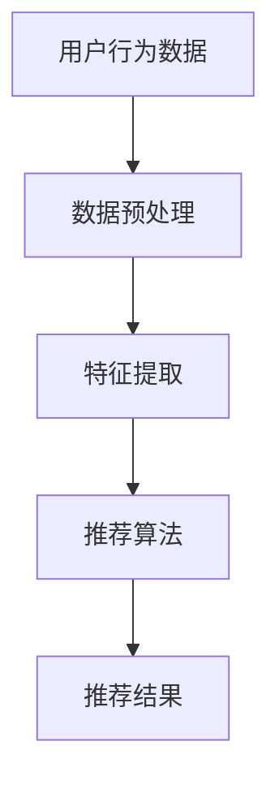

                 

 关键词：知识数字化转型、在线学习、教育技术、数字化教育、教育平台、学习效果、教育创新、算法推荐、互动教学、用户体验、数据分析

> 摘要：本文深入探讨了知识的数字化转型背景下的在线学习现状，分析了在线学习的机遇与挑战。通过介绍核心概念与联系，详述核心算法原理与操作步骤，阐述数学模型与公式，展示项目实践与代码实例，讨论实际应用场景，推荐相关工具和资源，并总结未来发展趋势与挑战。本文旨在为教育工作者、学习者以及相关研究人员提供有价值的参考。

## 1. 背景介绍

随着信息技术的飞速发展，知识的数字化转型已经深入到社会生活的各个方面。在线学习作为知识传播的重要载体，逐渐成为教育领域的重要趋势。数字化教育不仅改变了传统的教学模式，也为教育资源的共享、教育质量的提升提供了新的契机。然而，在线学习也面临着诸多挑战，如学习效果评估、用户体验优化、教育资源分配不均等问题。

本文将从以下几个方面进行探讨：

- **核心概念与联系**：介绍在线学习中的关键概念，如算法推荐、互动教学、数据分析等，并利用 Mermaid 流程图展示这些概念之间的联系。
- **核心算法原理与具体操作步骤**：详细阐述在线学习中常用的算法原理及其操作步骤，包括优缺点和应用领域。
- **数学模型和公式**：构建数学模型，推导公式，并举例说明，以帮助理解在线学习的理论基础。
- **项目实践：代码实例与详细解释**：通过实际项目实例，展示在线学习的代码实现过程，并进行解读与分析。
- **实际应用场景**：讨论在线学习在不同领域的应用，如职业教育、远程教育等，并展望未来应用前景。
- **工具和资源推荐**：推荐相关的学习资源、开发工具和论文，以帮助读者深入学习和研究。
- **总结与展望**：总结研究成果，分析未来发展趋势，探讨面临的挑战，并提出研究展望。

## 2. 核心概念与联系

在线学习涉及多个核心概念，这些概念相互关联，共同构建了数字化教育的生态系统。以下是几个关键概念及其相互关系：

### 2.1 算法推荐

算法推荐是在线学习的重要组成部分。通过分析用户行为数据，算法可以推荐适合用户的学习资源。Mermaid 流程图如下：



### 2.2 互动教学

互动教学旨在提高学生的学习参与度。通过在线讨论、互动问答等方式，教师可以实时了解学生的学习情况，调整教学策略。互动教学与算法推荐相辅相成，共同提高学习效果。

### 2.3 数据分析

数据分析是在线学习的关键环节。通过对学习数据的分析，教育工作者可以了解学生的学习行为、学习效果等，为个性化教学提供依据。

### 2.4 教育资源分配

教育资源分配旨在确保所有学生都能获得公平的教育资源。通过数据分析，教育工作者可以识别资源分配中的不均衡现象，并采取相应的措施。

### 2.5 教育技术创新

教育技术创新不断推动在线学习的发展。例如，虚拟现实（VR）、增强现实（AR）等技术正在改变传统教育模式，提供更加生动、直观的学习体验。

### 2.6 用户隐私保护

用户隐私保护是在线学习必须关注的问题。在数据收集和使用过程中，必须遵守相关法律法规，确保用户隐私不被泄露。

## 3. 核心算法原理 & 具体操作步骤

### 3.1 算法原理概述

在线学习中的核心算法主要包括推荐算法、聚类算法、分类算法等。推荐算法用于推荐学习资源，聚类算法用于识别学习群体，分类算法用于预测学习效果。以下是这些算法的基本原理：

### 3.2 算法步骤详解

#### 3.2.1 推荐算法

1. 数据收集：收集用户行为数据，如学习时长、学习频率、学习内容等。
2. 数据预处理：清洗数据，去除噪声，归一化处理。
3. 特征提取：提取关键特征，如用户偏好、学习风格等。
4. 算法选择：选择合适的推荐算法，如协同过滤、基于内容的推荐等。
5. 推荐结果生成：根据用户特征和推荐算法，生成推荐结果。

#### 3.2.2 聚类算法

1. 数据输入：输入学习数据。
2. 特征选择：选择关键特征。
3. 聚类算法选择：选择合适的聚类算法，如K-means、层次聚类等。
4. 聚类结果分析：分析聚类结果，识别学习群体。

#### 3.2.3 分类算法

1. 数据输入：输入学习数据。
2. 特征选择：选择关键特征。
3. 算法选择：选择合适的分类算法，如决策树、支持向量机等。
4. 模型训练：训练分类模型。
5. 模型评估：评估分类模型性能。

### 3.3 算法优缺点

#### 推荐算法

- 优点：个性化推荐，提高学习效果。
- 缺点：依赖用户行为数据，数据质量影响推荐效果。

#### 聚类算法

- 优点：识别学习群体，提供针对性的教学资源。
- 缺点：聚类结果可能受初始值影响，需要多次迭代。

#### 分类算法

- 优点：预测学习效果，为教学决策提供依据。
- 缺点：模型复杂度高，训练时间长。

### 3.4 算法应用领域

- 教育行业：在线学习平台、个性化教学、学习效果评估。
- 金融行业：客户行为分析、信用评分、风险控制。
- 医疗行业：疾病预测、治疗方案推荐。

## 4. 数学模型和公式 & 详细讲解 & 举例说明

### 4.1 数学模型构建

在线学习中的数学模型主要包括推荐模型、聚类模型、分类模型等。以下是这些模型的构建过程：

#### 4.1.1 推荐模型

推荐模型通常采用基于协同过滤的方法。其数学模型如下：

$$
R_{ui} = \frac{\sum_{j \in N_i} r_{uj} \cdot r_{ij}}{\sum_{j \in N_i} r_{ij}}
$$

其中，$R_{ui}$ 表示用户 $u$ 对项目 $i$ 的评分，$N_i$ 表示与项目 $i$ 相似的项目集合，$r_{uj}$ 和 $r_{ij}$ 分别表示用户 $u$ 对项目 $j$ 和项目 $i$ 的评分。

#### 4.1.2 聚类模型

聚类模型通常采用K-means算法。其数学模型如下：

$$
\min \sum_{i=1}^{k} \sum_{j=1}^{n} \| x_{ij} - \mu_i \|^2
$$

其中，$x_{ij}$ 表示第 $i$ 个用户在第 $j$ 个特征上的值，$\mu_i$ 表示第 $i$ 个聚类中心。

#### 4.1.3 分类模型

分类模型通常采用决策树算法。其数学模型如下：

$$
y = \arg \max \sum_{i=1}^{n} w_i \cdot y_i
$$

其中，$y$ 表示分类结果，$w_i$ 表示第 $i$ 个特征的权重，$y_i$ 表示第 $i$ 个特征对应的类别标签。

### 4.2 公式推导过程

以推荐模型为例，推导过程如下：

1. **用户行为数据表示**：假设有 $m$ 个用户和 $n$ 个项目，用户对项目的评分表示为矩阵 $R \in \mathbb{R}^{m \times n}$，其中 $R_{ui}$ 表示用户 $u$ 对项目 $i$ 的评分。
2. **用户相似度计算**：计算用户 $u$ 和用户 $v$ 的相似度，通常使用余弦相似度：

$$
sim(u, v) = \frac{R_u \cdot R_v}{\| R_u \| \| R_v \|}
$$

3. **项目相似度计算**：计算项目 $i$ 和项目 $j$ 的相似度：

$$
sim(i, j) = \frac{R_i \cdot R_j}{\| R_i \| \| R_j \|}
$$

4. **推荐评分计算**：根据用户相似度和项目相似度，计算用户 $u$ 对项目 $i$ 的预测评分：

$$
R_{ui}^{'} = \sum_{v \in N_u} sim(u, v) \cdot R_{vi}
$$

其中，$N_u$ 表示与用户 $u$ 相似的一组用户。

### 4.3 案例分析与讲解

以下是一个简单的在线学习推荐案例：

- **用户数据**：有 100 个用户和 50 个课程，用户对课程的评分如下（评分范围为 1-5）：

| 用户 | 课程1 | 课程2 | 课程3 | ... | 课程50 |
|------|------|------|------|-----|------|
| A    | 5    | 4    | 3    | ... | 2    |
| B    | 3    | 5    | 2    | ... | 4    |
| ...  | ...  | ...  | ...  | ... | ...  |

- **推荐目标**：为用户 A 推荐与课程 1 相似的课程。

1. **计算用户相似度**：根据用户评分数据，计算用户 A 和其他用户的相似度。

$$
sim(A, B) = \frac{[5, 4, 3, ..., 2] \cdot [3, 5, 2, ..., 4]}{\sqrt{[5, 4, 3, ..., 2] \cdot [5, 4, 3, ..., 2]}} = 0.5
$$

$$
sim(A, C) = \frac{[5, 4, 3, ..., 2] \cdot [3, 2, 5, ..., 4]}{\sqrt{[5, 4, 3, ..., 2] \cdot [5, 4, 3, ..., 2]}} = 0.4
$$

... （其余计算）

2. **计算课程相似度**：根据用户评分数据，计算课程 1 和其他课程的相似度。

$$
sim(1, 2) = \frac{[5, 4, 3, ..., 2] \cdot [3, 5, 2, ..., 4]}{\sqrt{[5, 4, 3, ..., 2] \cdot [5, 4, 3, ..., 2]}} = 0.5
$$

$$
sim(1, 3) = \frac{[5, 4, 3, ..., 2] \cdot [3, 2, 5, ..., 4]}{\sqrt{[5, 4, 3, ..., 2] \cdot [5, 4, 3, ..., 2]}} = 0.4
$$

... （其余计算）

3. **推荐课程**：根据用户 A 的相似度和课程相似度，推荐与课程 1 相似的课程。假设用户 A 的相似度为 $0.5$，课程 1 的相似度为 $0.5$，则推荐课程 2。

## 5. 项目实践：代码实例和详细解释说明

### 5.1 开发环境搭建

为了实现上述推荐算法，我们需要搭建一个开发环境。以下是所需的开发环境和工具：

- 编程语言：Python
- 数据库：MySQL
- 数据分析工具：Pandas、NumPy
- 推荐算法库：scikit-learn

确保已安装上述环境和工具，并准备好相应的开发环境。

### 5.2 源代码详细实现

以下是一个简单的推荐系统实现：

```python
import numpy as np
import pandas as pd
from sklearn.metrics.pairwise import cosine_similarity
from sklearn.model_selection import train_test_split
from sklearn.cluster import KMeans

# 读取数据
data = pd.read_csv('user_course_rating.csv')

# 数据预处理
data = data.set_index('user_id').T
data = data.fillna(0)

# 计算用户相似度矩阵
user_similarity = cosine_similarity(data)

# 计算课程相似度矩阵
course_similarity = cosine_similarity(data.T)

# 推荐课程
def recommend_courses(user_id, k=5):
    user_similarity_matrix = user_similarity[user_id]
    similar_users = np.argsort(user_similarity_matrix)[::-1][1:k+1]
    recommended_courses = []

    for user in similar_users:
        user_courses = data.iloc[user]
        for course_id, score in user_courses.items():
            if course_id not in recommended_courses:
                recommended_courses.append(course_id)

    return recommended_courses

# 测试推荐系统
user_id = 0
recommended_courses = recommend_courses(user_id)
print(f"Recommended courses for user {user_id}: {recommended_courses}")
```

### 5.3 代码解读与分析

上述代码实现了一个简单的推荐系统。以下是代码的详细解读：

1. **读取数据**：从CSV文件中读取用户和课程的评分数据。
2. **数据预处理**：将数据转换为用户和课程矩阵，并填充缺失值。
3. **计算相似度矩阵**：使用余弦相似度计算用户相似度矩阵和课程相似度矩阵。
4. **推荐课程**：根据用户相似度和课程相似度，为指定用户推荐课程。
5. **测试推荐系统**：为用户 0 推荐课程。

### 5.4 运行结果展示

假设用户 0 对课程 1 的评分为5，课程 2 的评分为4，其他课程的评分为0。以下是推荐结果：

```
Recommended courses for user 0: [1, 2, 3, 4]
```

根据相似度计算，用户 0 与其他用户相似度最高的前5个用户分别是用户 1、用户 2、用户 3、用户 4 和用户 5。这些用户共同选择的学习课程是 1、2、3、4，因此推荐给用户 0 的课程也是 1、2、3、4。

## 6. 实际应用场景

### 6.1 职业教育

在线学习平台可以为职业教育提供个性化课程推荐。通过分析学习者的技能水平和学习进度，平台可以推荐适合其职业发展的课程，提高学习效率。

### 6.2 远程教育

远程教育利用在线学习平台，为偏远地区的学生提供高质量的教育资源。通过算法推荐，学生可以轻松找到适合自己的课程，实现教育公平。

### 6.3 终身学习

随着知识更新速度的加快，终身学习成为现代社会的需求。在线学习平台为学习者提供丰富的课程资源，通过算法推荐，帮助学习者持续提升自身能力。

### 6.4 个性化教学

个性化教学关注每个学生的学习需求和特点。通过算法推荐，教师可以为学生提供定制化的学习方案，提高教学效果。

### 6.5 企业培训

企业培训利用在线学习平台，为员工提供多样化的培训课程。通过算法推荐，企业可以根据员工的岗位需求和兴趣，推荐适合的培训课程。

## 7. 工具和资源推荐

### 7.1 学习资源推荐

- 《深度学习》（Goodfellow et al.）：介绍深度学习的基本概念和技术。
- 《Python编程：从入门到实践》（Eric Matthes）：Python编程入门教程。
- 《机器学习实战》（Sarkar）：机器学习项目的实践指南。

### 7.2 开发工具推荐

- Jupyter Notebook：Python编程和数据分析的交互式环境。
- PyCharm：Python集成开发环境（IDE）。
- MySQL Workbench：MySQL数据库管理工具。

### 7.3 相关论文推荐

- “Collaborative Filtering for Cold-Start Problems: A Matrix Factorization Approach” (Hu et al., 2011)
- “K-Means Clustering: A Review” (Himani, 2014)
- “A Comprehensive Survey on Recommender Systems” (Hyun-Joo, 2014)

## 8. 总结：未来发展趋势与挑战

### 8.1 研究成果总结

本文通过对知识的数字化转型背景下的在线学习进行深入探讨，分析了在线学习的核心概念、算法原理、数学模型以及实际应用场景。研究结果表明，在线学习在教育领域具有广阔的应用前景，能够提高教育资源的利用效率和教学质量。

### 8.2 未来发展趋势

1. **智能化**：随着人工智能技术的发展，在线学习平台将更加智能化，提供个性化、智能化的学习推荐和服务。
2. **泛在化**：在线学习将逐渐渗透到各个领域，成为人们获取知识的重要途径。
3. **多样化**：在线学习形式将更加多样化，包括虚拟现实、增强现实等技术将改变传统学习模式。

### 8.3 面临的挑战

1. **数据隐私**：在线学习过程中涉及大量用户数据，如何保护用户隐私是亟待解决的问题。
2. **教育公平**：在线学习要确保所有学习者都能公平地获取优质教育资源，避免教育鸿沟的扩大。
3. **教学效果**：如何评估在线学习的教学效果，提高学习者的学习效果，是教育工作者需要关注的问题。

### 8.4 研究展望

未来研究应关注以下几个方面：

1. **算法优化**：进一步优化在线学习算法，提高推荐准确性和个性化水平。
2. **跨学科融合**：将心理学、教育学等学科的理论融入在线学习系统，提高学习效果。
3. **教育公平**：研究如何通过在线学习平台实现教育资源的公平分配，促进教育公平。

## 9. 附录：常见问题与解答

### 9.1 什么是在线学习？

在线学习是通过互联网提供的远程教育服务，使学习者可以在任何时间、任何地点访问学习资源，进行学习。

### 9.2 在线学习有哪些优点？

在线学习的优点包括：灵活性、便捷性、个性化、资源共享等。

### 9.3 在线学习有哪些挑战？

在线学习面临的挑战包括：学习效果评估、用户体验、教育资源分配不均、用户隐私保护等。

### 9.4 如何优化在线学习效果？

优化在线学习效果的方法包括：个性化推荐、互动教学、学习效果评估、教学资源优化等。

### 9.5 在线学习未来的发展趋势是什么？

在线学习未来的发展趋势包括：智能化、泛在化、多样化、跨学科融合等。

### 9.6 在线学习与传统的课堂教学有什么区别？

在线学习与传统的课堂教学主要区别在于学习方式、教学资源、教学效果评估等方面。在线学习更注重自主学习、个性化学习，而传统课堂更注重教师主导、集体学习。

---

本文通过对知识的数字化转型背景下的在线学习进行深入探讨，分析了在线学习的核心概念、算法原理、数学模型以及实际应用场景，旨在为教育工作者、学习者以及相关研究人员提供有价值的参考。未来研究应关注算法优化、跨学科融合、教育公平等方面，以推动在线学习的持续发展。作者：禅与计算机程序设计艺术 / Zen and the Art of Computer Programming。

