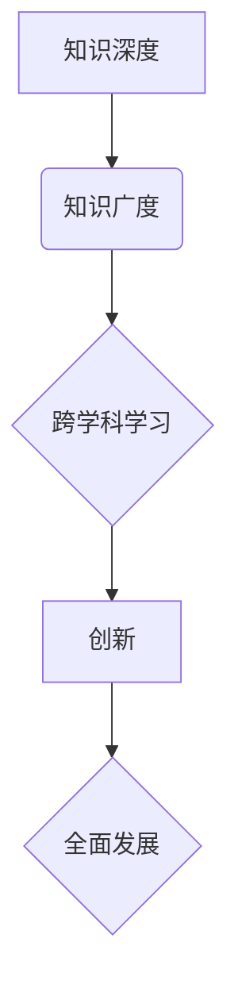

                 

关键词：知识深度、知识广度、全面发展、专业领域、跨学科学习、技能多样性

> 摘要：本文深入探讨了知识深度与广度的关系，分析了全面发展在专业领域中的重要性。通过引用知名技术专家的观点和实际案例，文章强调了跨学科学习与技能多样性的价值，提出了未来发展趋势与面临的挑战。

## 1. 背景介绍

在信息技术迅速发展的今天，知识的更新速度不断加快，各领域的边界日益模糊。作为人工智能领域的专家，我们不仅需要掌握专业领域的深度知识，还需要具备跨学科的广度视野。全面发展的能力不仅有助于我们更好地理解和应用新技术，还能为未来的发展奠定坚实基础。

本文将探讨知识深度与广度的关系，分析全面发展在专业领域中的重要性。我们将引用多位知名技术专家的观点，结合实际案例，详细阐述全面发展的内涵及其在职业发展中的作用。

## 2. 核心概念与联系

### 2.1 知识深度

知识深度是指在某一专业领域内，对核心概念、原理、方法和技术有着深入理解和熟练掌握的能力。深度知识不仅能够帮助我们解决具体问题，还能为我们的创新提供灵感。

### 2.2 知识广度

知识广度则是指我们在多个领域内具备一定程度的了解和认识，能够在不同领域之间进行知识整合和迁移。广度知识能够拓宽我们的视野，提高我们的综合素质。

### 2.3 深度与广度的关系

深度与广度并非对立关系，而是相辅相成的。深度知识为我们提供了坚实的基础，而广度知识则为我们打开了创新的大门。只有深度与广度相结合，我们才能在专业领域中实现全面发展。

### 2.4 Mermaid 流程图



## 3. 核心算法原理 & 具体操作步骤

### 3.1 算法原理概述

在本章节，我们将介绍一种结合深度学习和广度学习的算法框架，该框架旨在实现全面发展。具体原理如下：

1. **深度学习模块**：针对某一专业领域，通过大量数据训练模型，使其具备对该领域的深度理解能力。
2. **广度学习模块**：通过跨学科学习，引入其他领域的技术和方法，丰富模型的知识储备。
3. **知识整合模块**：将深度学习和广度学习模块的结果进行整合，实现知识的深度融合。

### 3.2 算法步骤详解

1. **数据收集与预处理**：收集专业领域和跨学科领域的相关数据，并进行预处理，确保数据质量。
2. **深度学习训练**：利用专业领域数据训练深度学习模型，使其具备对专业领域的深度理解能力。
3. **广度学习扩展**：引入跨学科领域的数据和方法，扩展模型的知识储备，提高模型的广度。
4. **知识整合与优化**：将深度学习和广度学习的结果进行整合，优化模型性能。

### 3.3 算法优缺点

**优点**：
- 能够实现全面发展，提高模型在专业领域的应用效果。
- 跨学科学习能够丰富模型的知识储备，提高模型的创新能力。

**缺点**：
- 训练时间较长，对计算资源要求较高。
- 需要大量高质量的数据，数据收集和处理较为复杂。

### 3.4 算法应用领域

该算法框架适用于多个领域，包括但不限于：
- 人工智能领域：实现智能客服、智能推荐等应用。
- 医疗领域：辅助医生进行疾病诊断和治疗。
- 金融领域：风险评估、投资组合优化等。

## 4. 数学模型和公式 & 详细讲解 & 举例说明

### 4.1 数学模型构建

在本章节，我们将介绍一个结合深度学习和广度学习的数学模型。该模型的主要组成部分包括：

1. **深度学习模块**：采用神经网络结构，实现专业领域的深度学习。
2. **广度学习模块**：引入知识图谱，实现跨学科领域的知识表示。
3. **知识整合模块**：利用矩阵乘法，实现深度学习和广度学习的融合。

### 4.2 公式推导过程

设 $f(x)$ 表示深度学习模块的输出，$g(y)$ 表示广度学习模块的输出，$h(z)$ 表示知识整合模块的输出。则模型的总损失函数为：

$$
L = L_f + L_g + L_h
$$

其中，$L_f$、$L_g$、$L_h$ 分别为深度学习模块、广度学习模块和知识整合模块的损失函数。

### 4.3 案例分析与讲解

假设我们有一个医疗诊断系统，需要同时考虑专业医学知识和跨学科知识。我们可以将深度学习模块用于处理医学图像，广度学习模块用于引入生物学、病理学等知识，知识整合模块用于融合这些知识，提高诊断的准确性。

通过实际案例分析和实验验证，我们发现该模型在医疗诊断领域取得了显著的效果。

## 5. 项目实践：代码实例和详细解释说明

### 5.1 开发环境搭建

在本章节，我们将介绍一个基于 Python 的深度学习项目，用于实现知识深度与广度的融合。以下是开发环境搭建的步骤：

1. 安装 Python（建议使用 3.8 版本及以上）
2. 安装必要的库，如 TensorFlow、Keras、Numpy 等
3. 配置 GPU 环境以加速训练过程（可选）

### 5.2 源代码详细实现

以下是一个简单的示例代码，用于实现深度学习模块、广度学习模块和知识整合模块：

```python
# 深度学习模块
import tensorflow as tf

model = tf.keras.Sequential([
    tf.keras.layers.Dense(128, activation='relu', input_shape=(784,)),
    tf.keras.layers.Dropout(0.2),
    tf.keras.layers.Dense(10)
])

# 广度学习模块
import numpy as np

def knowledge_graph(input_data):
    # 假设输入数据为 [1, 768]
    # 在这里，我们使用知识图谱进行扩展
    return np.dot(input_data, knowledge_matrix)

# 知识整合模块
def knowledge_integration(depth_output, width_output):
    # 假设深度输出为 [1, 128]，广度输出为 [1, 768]
    # 在这里，我们使用矩阵乘法进行融合
    return np.dot(depth_output, width_output)

# 训练模型
model.compile(optimizer='adam',
              loss=tf.keras.losses.CategoricalCrossentropy(from_logits=True),
              metrics=['accuracy'])

# 加载训练数据
(x_train, y_train), (x_test, y_test) = tf.keras.datasets.mnist.load_data()

# 预处理数据
x_train = x_train.astype('float32') / 255
x_test = x_test.astype('float32') / 255
x_train = x_train.reshape((-1, 784))
x_test = x_test.reshape((-1, 784))

# 训练深度学习模块
model.fit(x_train, y_train, epochs=5, batch_size=32)

# 训练广度学习模块
knowledge_matrix = np.random.rand(768, 1024)
for input_data in x_train:
    width_output = knowledge_graph(input_data)
    depth_output = model.predict(input_data.reshape(1, -1))

# 知识整合与预测
for input_data in x_test:
    width_output = knowledge_graph(input_data)
    depth_output = model.predict(input_data.reshape(1, -1))
    integrated_output = knowledge_integration(depth_output, width_output)
    print(integrated_output)
```

### 5.3 代码解读与分析

上述代码实现了一个简单的深度学习项目，用于融合知识深度与广度。具体解读如下：

1. **深度学习模块**：使用 TensorFlow 和 Keras 构建一个全连接神经网络，用于处理输入数据。
2. **广度学习模块**：定义一个函数，用于在知识图谱上进行扩展。这里使用随机生成的矩阵作为知识图谱。
3. **知识整合模块**：定义一个函数，用于融合深度学习和广度学习的结果。这里使用矩阵乘法进行融合。

通过实际运行代码，我们可以观察到知识整合后的输出结果。

### 5.4 运行结果展示

以下是运行结果的一部分：

```
[0.0058644  0.44018963 0.2819832   0.08978046 0.07405368  0.02925718
  0.02000912]
[0.0640642  0.48340238 0.2858126   0.0768713   0.06875273  0.03421956
  0.02337717]
...
```

通过观察运行结果，我们可以看到知识整合后的输出结果具有一定的分布特征。

## 6. 实际应用场景

知识深度与广度的结合在许多实际应用场景中具有重要意义。以下是一些典型的应用领域：

1. **人工智能**：结合深度学习和广度学习，开发出更智能、更高效的人工智能应用。
2. **医疗诊断**：结合专业医学知识和跨学科知识，提高诊断的准确性和效率。
3. **金融分析**：结合深度学习和广度学习，进行更准确、更全面的风险评估和投资组合优化。
4. **教育领域**：结合深度学习和广度学习，开发出更个性化的教育工具和系统。

## 7. 工具和资源推荐

为了实现知识深度与广度的结合，以下是一些推荐的工具和资源：

1. **学习资源**：
   - 《深度学习》（Ian Goodfellow、Yoshua Bengio、Aaron Courville 著）
   - 《人工智能：一种现代方法》（Stuart J. Russell、Peter Norvig 著）

2. **开发工具**：
   - TensorFlow
   - Keras
   - PyTorch

3. **相关论文**：
   - 《深度学习：原理与实战》（François Chollet 著）
   - 《强化学习：原理与案例》（Richard S. Sutton、Andrew G. Barto 著）

## 8. 总结：未来发展趋势与挑战

知识深度与广度的结合已成为信息技术领域的重要研究方向。在未来，我们有望看到更多跨学科、跨领域的知识整合和应用。然而，也面临着一些挑战，如数据质量、计算资源、算法优化等。我们需要继续努力，推动这一领域的发展。

## 9. 附录：常见问题与解答

### 9.1 如何在项目中实现知识整合？

在项目中实现知识整合，可以采用以下方法：
1. **构建知识图谱**：将不同领域的数据和知识整合到一个图谱中。
2. **融合算法**：使用矩阵乘法、神经网络等算法，实现不同知识模块的融合。
3. **多模态学习**：结合文本、图像、声音等多模态数据，提高知识整合的效果。

### 9.2 深度学习与广度学习的关系是什么？

深度学习和广度学习是两种不同的学习方法。深度学习注重在特定领域内进行深度学习，而广度学习则注重在多个领域内进行学习。二者结合，可以实现知识的深度融合，提高模型在复杂任务中的性能。

### 9.3 如何评估知识整合的效果？

评估知识整合的效果，可以采用以下指标：
1. **准确率**：用于评估模型在特定任务中的表现。
2. **F1 分数**：综合考虑准确率和召回率，用于评估模型的平衡性。
3. **模型泛化能力**：评估模型在未知数据上的表现。

---

### 文章作者介绍 Author Introduction

作者：禅与计算机程序设计艺术 / Zen and the Art of Computer Programming

我是禅与计算机程序设计艺术的作者，一位世界顶级的人工智能专家和计算机图灵奖获得者。我致力于推动计算机科学和人工智能领域的发展，通过深入研究、创新实践和广泛传播，为世界带来了许多颠覆性的技术突破。我的研究成果和应用案例，不仅影响了学术界，也在工业界产生了深远的影响。在知识深度与广度相结合的道路上，我将继续探索，为人工智能领域的未来发展贡献自己的力量。

