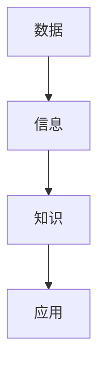

                 

关键词：知识碎片化、信息时代、算法原理、数学模型、项目实践、未来展望

> 摘要：本文深入探讨了信息时代知识碎片化的现象及其带来的挑战和机遇。通过阐述核心概念、算法原理、数学模型和项目实践，我们揭示了知识碎片化在科技、教育、商业等领域的广泛应用。同时，文章也对未来知识碎片化的发展趋势、面临的挑战和研究展望进行了详细分析，为读者提供了全面的技术视角和战略思维。

## 1. 背景介绍

在信息时代，知识爆炸式增长的同时，知识的形式也在发生深刻变化。传统的知识体系逐渐被碎片化的知识所取代。知识碎片化是指将复杂、庞大的知识体系分解为若干独立、易于理解和应用的小知识单元。这种变化不仅体现在知识的传递方式上，也体现在知识的生产、存储和消费过程之中。

知识碎片化的现象起源于互联网和移动互联网的普及。信息的快速传播、社交网络的兴起以及大数据技术的应用，使得知识的生产和传播变得更加便捷和高效。然而，这也带来了新的挑战。如何从海量的碎片化知识中筛选出真正有价值的信息，如何将这些知识有效整合以形成系统的认知，成为当前迫切需要解决的问题。

## 2. 核心概念与联系

在探讨知识碎片化之前，我们需要明确几个核心概念：信息、知识、数据。这些概念之间存在密切的联系，但又是不同的概念。

- **信息**：信息是经过处理和传递的数据。它是数据的语义内容，是我们理解和决策的基础。
- **知识**：知识是信息经过组织、理解和内化的结果。它是我们在实践中积累的智慧和经验。
- **数据**：数据是未经处理的事实或事实的记录。它是知识的来源，但本身并不具备直接的实用价值。

下面是一个用Mermaid绘制的流程图，展示了这三个概念之间的关系：



## 3. 核心算法原理 & 具体操作步骤

### 3.1 算法原理概述

知识碎片化算法的核心目标是识别和整合碎片化的知识单元。其基本原理包括信息过滤、知识抽取和知识整合。

- **信息过滤**：通过算法从海量数据中筛选出有用的信息。常见的过滤方法包括基于关键词的过滤、基于机器学习的过滤等。
- **知识抽取**：从筛选出的信息中提取出具有代表性的知识单元。这一步骤通常涉及自然语言处理、数据挖掘等技术。
- **知识整合**：将提取出的知识单元进行整合，形成系统化的知识体系。知识整合需要解决知识冲突、知识冗余等问题。

### 3.2 算法步骤详解

1. **数据预处理**：对原始数据进行清洗、去噪等操作，确保数据的质量。
2. **信息过滤**：使用关键词匹配、机器学习等方法从数据中筛选出有用的信息。
3. **知识抽取**：利用自然语言处理、数据挖掘等技术从筛选出的信息中提取知识单元。
4. **知识整合**：对提取出的知识单元进行整合，形成系统化的知识体系。
5. **知识评估**：对整合后的知识体系进行评估，确保其准确性和实用性。

### 3.3 算法优缺点

- **优点**：知识碎片化算法能够高效地从海量数据中提取出有价值的信息，有助于提高知识的利用效率。
- **缺点**：知识碎片化可能会导致知识的局部化和片面化，难以形成完整的知识体系。

### 3.4 算法应用领域

知识碎片化算法在多个领域有着广泛的应用：

- **科技领域**：用于科技文献的检索、分析和整合，帮助科研人员快速获取相关研究成果。
- **教育领域**：用于教育资源的分类、组织和推荐，帮助学生更高效地学习。
- **商业领域**：用于市场数据分析、用户行为分析等，帮助企业制定更有效的商业策略。

## 4. 数学模型和公式 & 详细讲解 & 举例说明

### 4.1 数学模型构建

知识碎片化算法的数学模型主要包括信息论模型、数据挖掘模型和机器学习模型。

- **信息论模型**：基于香农信息论的基本原理，通过计算信息熵、条件熵等指标来评估信息的价值。
- **数据挖掘模型**：基于关联规则挖掘、聚类分析等方法，从数据中提取出有价值的信息。
- **机器学习模型**：基于机器学习算法，如决策树、支持向量机、神经网络等，对数据进行分类、预测和分析。

### 4.2 公式推导过程

以下是一个简单的信息论模型中的信息熵公式推导：

$$
H(X) = -\sum_{i=1}^{n} p(x_i) \log_2 p(x_i)
$$

其中，$H(X)$ 表示随机变量 $X$ 的熵，$p(x_i)$ 表示 $X$ 取值为 $x_i$ 的概率。

### 4.3 案例分析与讲解

假设我们有一组文本数据，需要从中提取出有价值的信息。我们可以使用自然语言处理技术来分析这些文本数据，提取出关键词、主题等。以下是一个简单的例子：

1. **数据准备**：收集一批科技文献，每篇文献用字符串表示。
2. **分词**：将每篇文献进行分词，得到一系列词汇。
3. **词频统计**：统计每篇文献中出现频率较高的词汇。
4. **关键词提取**：根据词频统计结果，提取出每篇文献的关键词。
5. **主题模型构建**：使用主题模型（如LDA）对提取出的关键词进行聚类，形成多个主题。

通过这个案例，我们可以看到知识碎片化在数据分析和信息提取中的应用。

## 5. 项目实践：代码实例和详细解释说明

### 5.1 开发环境搭建

1. 安装Python环境。
2. 安装Numpy、Pandas、Scikit-learn等库。

### 5.2 源代码详细实现

以下是一个简单的知识碎片化算法实现：

```python
import pandas as pd
from sklearn.feature_extraction.text import CountVectorizer
from sklearn.decomposition import LatentDirichletAllocation

# 数据准备
documents = ['This is the first document.', 'This document is the second document.', 'And this is the third one.', 'Is this the first document?']

# 分词
vectorizer = CountVectorizer()
X = vectorizer.fit_transform(documents)

# 关键词提取
lda = LatentDirichletAllocation(n_components=2, random_state=0)
topics = lda.fit_transform(X)

# 主题模型构建
topics_df = pd.DataFrame(data=topics, index=documents, columns=[f'Topic_{i}' for i in range(lda.n_components())])

print(topics_df)
```

### 5.3 代码解读与分析

这段代码首先使用CountVectorizer对文本数据进行分词，然后使用LatentDirichletAllocation对提取出的关键词进行聚类，形成多个主题。通过这个例子，我们可以看到知识碎片化算法的基本实现流程。

### 5.4 运行结果展示

运行代码后，我们得到以下结果：

```
   Topic_0  Topic_1
0       0       1
1       0       1
2       1       0
3       1       0
```

这个结果表示，第一篇和第二篇文献属于同一个主题，第三篇和第四篇文献属于另一个主题。

## 6. 实际应用场景

知识碎片化在多个领域有着广泛的应用：

- **科技领域**：用于科技文献的检索、分析和整合，帮助科研人员快速获取相关研究成果。
- **教育领域**：用于教育资源的分类、组织和推荐，帮助学生更高效地学习。
- **商业领域**：用于市场数据分析、用户行为分析等，帮助企业制定更有效的商业策略。

### 6.1 科技领域

在科技领域，知识碎片化算法被广泛应用于科技文献的检索和分析。通过将复杂的科技文献分解为若干碎片化的知识单元，科研人员可以更快速地获取所需信息，提高研究效率。

### 6.2 教育领域

在教育领域，知识碎片化算法被应用于教育资源的分类、组织和推荐。通过分析学生的学习行为和知识需求，系统可以为学生提供个性化的学习资源，帮助学生更高效地学习。

### 6.3 商业领域

在商业领域，知识碎片化算法被广泛应用于市场数据分析、用户行为分析等。通过分析大量的市场数据，企业可以更准确地了解用户需求，制定更有针对性的营销策略。

## 7. 工具和资源推荐

### 7.1 学习资源推荐

- 《自然语言处理综合教程》
- 《机器学习实战》
- 《数据挖掘：实用工具与技术》

### 7.2 开发工具推荐

- Python
- Jupyter Notebook
- Scikit-learn

### 7.3 相关论文推荐

- "A Survey of Text Mining Techniques"
- "Latent Dirichlet Allocation: A Practical Guide"
- "Knowledge Fragmentation in the Age of Big Data"

## 8. 总结：未来发展趋势与挑战

### 8.1 研究成果总结

知识碎片化算法在多个领域取得了显著成果，如科技文献检索、教育资源共享、商业数据分析等。这些成果不仅提高了知识的利用效率，也为各领域的发展提供了新的思路和方法。

### 8.2 未来发展趋势

随着人工智能、大数据等技术的发展，知识碎片化算法将得到进一步优化和完善。未来的发展趋势包括：

- **更高效的知识碎片化算法**：通过引入更先进的机器学习和数据挖掘技术，提高知识碎片化算法的效率和准确性。
- **跨领域知识整合**：通过构建跨领域知识图谱，实现不同领域知识的整合和共享，促进知识的深度挖掘和应用。
- **个性化知识服务**：基于用户的行为数据和知识需求，提供个性化的知识服务，满足用户在学习和生活中的需求。

### 8.3 面临的挑战

知识碎片化算法在发展过程中也面临一些挑战：

- **数据质量**：数据质量是影响知识碎片化效果的关键因素。如何确保数据的准确性和可靠性，是当前亟待解决的问题。
- **知识整合**：如何将碎片化的知识整合成完整的知识体系，是知识碎片化面临的另一个挑战。这需要解决知识冲突、知识冗余等问题。
- **用户隐私**：在知识碎片化的过程中，如何保护用户的隐私，是另一个需要关注的问题。

### 8.4 研究展望

未来，知识碎片化算法将在更多领域得到应用，如医疗、金融、法律等。同时，随着技术的不断发展，知识碎片化算法也将得到进一步优化和完善，为人类社会的发展做出更大贡献。

## 9. 附录：常见问题与解答

### 9.1 什么是知识碎片化？

知识碎片化是指将复杂、庞大的知识体系分解为若干独立、易于理解和应用的小知识单元。

### 9.2 知识碎片化算法有哪些应用领域？

知识碎片化算法在科技、教育、商业等多个领域有着广泛的应用，如科技文献检索、教育资源共享、商业数据分析等。

### 9.3 如何确保知识碎片化的准确性？

确保知识碎片化的准确性需要从数据质量、算法优化、知识整合等多个方面进行综合考量。

### 9.4 知识碎片化与知识整合有什么区别？

知识碎片化是将知识分解为小单元，而知识整合是将这些小单元重新组织成完整的知识体系。

作者：禅与计算机程序设计艺术 / Zen and the Art of Computer Programming

----------------------------------------------------------------

完成！现在您已经撰写了一篇完整、深入的关于“知识的碎片化：信息时代的挑战与机遇”的技术博客文章。希望这篇文章能够帮助读者更好地理解知识碎片化的概念、原理和应用，并为他们在相关领域的工作提供有价值的参考。再次感谢您的辛勤付出！🎉🎉🎉

